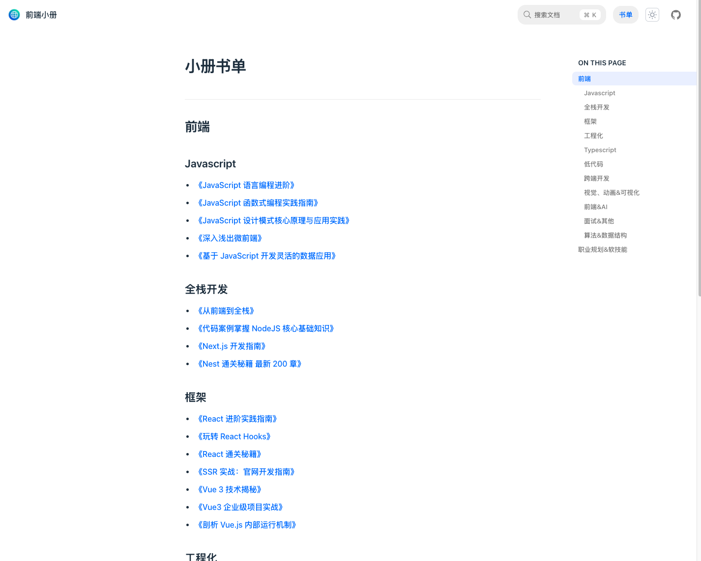

# JueJinBookPress

> **该项目仅供学习参考，请勿用于非法用途。**
<div align=center> </div>

该项目基于 [Rspress](https://rspress.dev/zh/index) 作为站点构建工具，主要资源来源于改项目[NuggetsBooklet](https://github.com/lm-rebooter/NuggetsBooklet)和部分网络资源；
由于大部分 markdown 资源在本地或 github 访问体验都不是很好，图片防盗链以及文件排序乱序等问题影响**阅读体验**。
这个项目旨在将这些资源整合到一起，做到提炼图片资源到本地、优化目录排序和支持全局搜索等，构建出一本方便阅读的小册。

该项目支持本地静态服务运行和 `docker` 构建运行两种方式；

**⚠️注意：** 本地运行硬件推荐 4C16G 及以上配置；

## 本地运行

```bash
pnpm i
npm run start
```

## 构建 docker

```bash
docker build -t juejinbookpress .
docker run -d -p 8080:80 --name juejinbookpress juejinbookpress
```
或者使用 `chrissong1994/juejinbookpress` docker 体验；

## 开发
假如你想加入该项目或者提供资源，请把资源放在 `/docs/books/` 目录下，并在本地执行`npm run generate` 后，会启动文件扫描程序，每个`books` 目录下的文件夹会被作为一本独立的书的目录被扫描，并根据目录下的 `markdown` 文档生成文档文件 `_meta.json` 和 `index.md` 文件。假如扫描 `markdown` 的文档过程中遇到网络链接图片，会自动下载图片到本地，并替换掉网络链接，以达到去网络防盗链的目的。

执行 `npm run generate` 成功后，再执行本地文档服务器 `npm run dev` 并打开 `http://localhost:3000`查看文档是否能正常运行。

运行成功即可提交 `PR`; 

