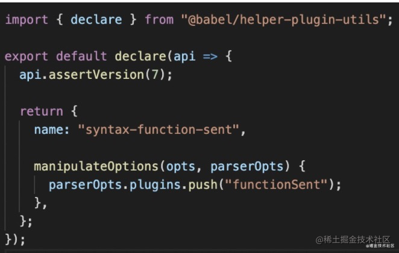
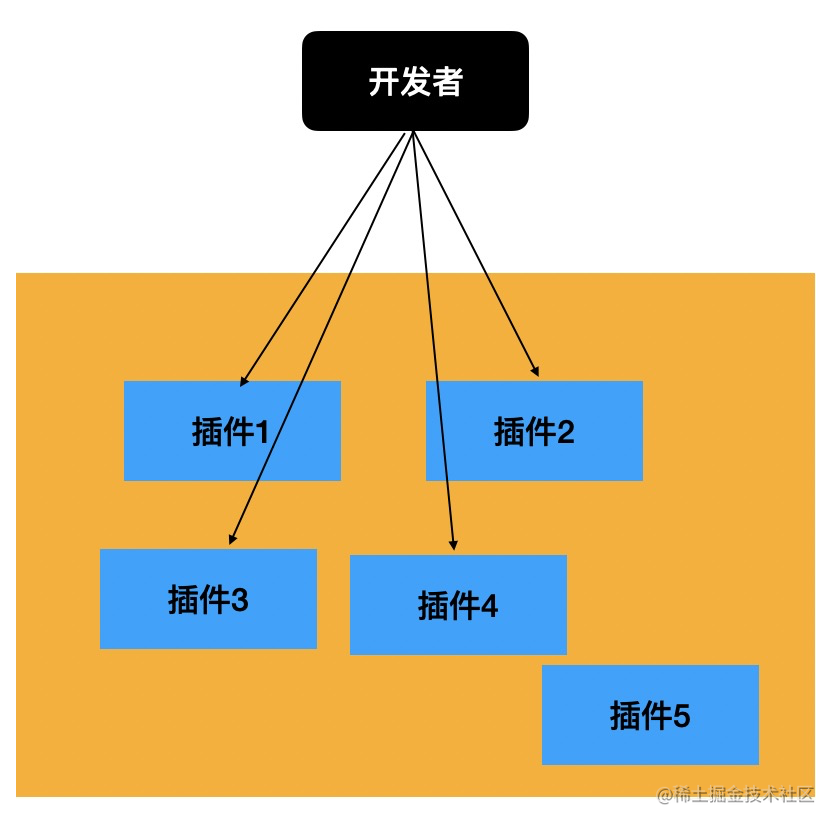
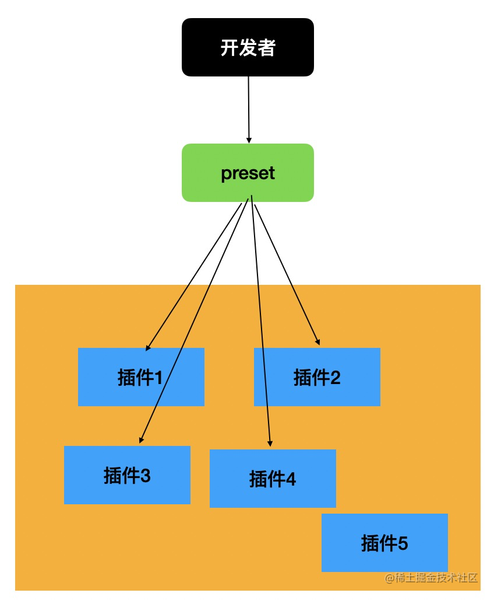

# 10.Babel 插件和 preset

前面的章节，我们学习了 babel 的编译流程，也深入了下原理，知道了怎么用 babel 的 api 来完成一些代码转换功能。但平时我们很少单独使用 babel 的 api，更多是封装成插件，插件可以上传到 npm 仓库来复用。

这一节，我们学习一下 babel 插件的格式以及 preset。

## plugin 的使用

首先，我们回顾一下 plugin 的使用，babel 的 plugin 是在配置文件里面通过 plugins 选项配置，值为字符串或者数组。

```javascript
{
  "plugins": ["pluginA", ["pluginB"], ["pluginC", {/* options */}]]
}
```

如果需要传参就用数组格式，第二个元素为参数。

## plugin的格式

babel plugin 有两种格式：

### 返回对象的函数
第一种是一个函数返回一个对象的格式，对象里有 visitor、pre、post、inherits、manipulateOptions 等属性。

```javascript
export default function(api, options, dirname) {
  return {
    inherits: parentPlugin,
    manipulateOptions(options, parserOptions) {
        options.xxx = '';
    },
    pre(file) {
      this.cache = new Map();
    },
    visitor: {
      StringLiteral(path, state) {
        this.cache.set(path.node.value, 1);
      }
    },
    post(file) {
      console.log(this.cache);
    }
  };
} 
```
首先，插件函数有 3 个参数，api、options、dirname。

- api 里包含了各种 babel 的 api，比如 types、template 等，这些包就不用在插件里单独单独引入了，直接取来用就行。
- options 就是外面传入的参数
- dirname 是目录名（不常用）

返回的对象有 inherits、manipulateOptions、pre、visitor、post 等属性。

- inherits 指定继承某个插件，和当前插件的 options 合并，通过 Object.assign 的方式。
- visitor 指定 traverse 时调用的函数。
- pre 和 post 分别在遍历前后调用，可以做一些插件调用前后的逻辑，比如可以往 file（表示文件的对象，在插件里面通过 state.file 拿到）中放一些东西，在遍历的过程中取出来。 
- manipulateOptions 用于修改 options，是在插件里面修改配置的方式，比如 syntaxt plugin一般都会修改 parser options：


插件做的事情就是通过 api 拿到 types、template 等，通过 state.opts 拿到参数，然后通过 path 来修改 AST。可以通过 state 放一些遍历过程中共享的数据，通过 file 放一些整个插件都能访问到的一些数据，除了这两种之外，还可以通过 this 来传递本对象共享的数据。

### 对象

插件的第二种格式就是直接写一个对象，不用函数包裹，这种方式用于不需要处理参数的情况。

```javascript
export default plugin =  {
    pre(state) {
      this.cache = new Map();
    },
    visitor: {
      StringLiteral(path, state) {
        this.cache.set(path.node.value, 1);
      }
    },
    post(state) {
      console.log(this.cache);
    }
};
```
## preset

plugin 是单个转换功能的实现，当 plugin 比较多或者 plugin 的 options 比较多的时候就会导致使用成本升高。这时候可以封装成一个 preset，用户可以通过 preset 来批量引入 plugin 并进行一些配置。preset 就是对 babel 配置的一层封装。

比如如果使用 plugin 是这样的，开发者需要了解每个插件是干什么的。



而有了 preset 之后就不再需要知道用到了什么插件，只需要选择合适的 preset，然后配置一下，就会引入需要的插件，这就是 preset 的意义。我们学 babel 的内置功能，主要就是学 preset 的配置，比如 preset-env、preset-typescript 等。




preset 格式和 plugin 一样，也是可以是一个对象，或者是一个函数，函数的参数也是一样的 api 和 options，区别只是 preset 返回的是配置对象，包含 plugins、presets 等配置。
```javascript
export default function(api, options) {
  return {
      plugins: ['pluginA'],
      presets: [['presetsB', { options: 'bbb'}]]
  }
}
```

或者

```javascript
export default obj = {
      plugins: ['pluginA'],
      presets: [['presetsB', { options: 'bbb'}]]
}
```

## ConfigItem

@babel/core 的包提供了 createConfigItem 的 api，用于创建配置项。我们之前都是字面量的方式创建的，当需要把配置抽离出去时，可以使用 createConfigItem。

```
const pluginA = createConfigItem('pluginA);
const presetB = createConfigItem('presetsB', { options: 'bbb'})

export default obj = {
      plugins: [ pluginA ],
      presets: [ presetB ]
  }
}
```

## 顺序

preset 和 plugin 从形式上差不多，但是应用顺序不同。

babel 会按照如下顺序处理插件和 preset：

1. 先应用 plugin，再应用 preset
2. plugin 从前到后，preset 从后到前

这个顺序是 babel 的规定。

## 名字

babel 对插件名字的格式有一定的要求，比如最好包含 babel-plugin，如果不包含的话也会自动补充。

babel plugin 名字的补全有这些规则：

- 如果是 ./ 开头的相对路径，不添加 babel plugin，比如 ./dir/plugin.js
- 如果是绝对路径，不添加 babel plugin，比如 /dir/plugin.js
- 如果是单独的名字 aa，会添加为 babel-plugin-aa，所以插件名字可以简写为 aa
- 如果是单独的名字 aa，但以 module 开头，则不添加 babel plugin，比如 module:aa
- 如果 @scope 开头，不包含 plugin，则会添加 babel-plugin，比如 @scope/mod 会变为 @scope/babel-plugin-mod
- babel 自己的 @babel 开头的包，会自动添加 plugin，比如 @babel/aa 会变成 @babel/plugin-aa

（preset也是一样）

规则比较多，总结一下就是 babel 希望插件名字中能包含 babel plugin，这样写 plugin 的名字的时候就可以简化，然后 babel 自动去补充。所以我们写的 babel 插件最好是 babel-plugin-xx 和 @scope/babel-plugin-xx 这两种，就可以简单写为 xx 和 @scope/xx。

写 babel 内置的 plugin 和 preset 的时候也可以简化，比如 @babel/preset-env 可以直接写@babel/env，babel 会自动补充为 @babel/preset-env。

## 总结

这一节我们学习了 babel 的 plugin 和 preset 的格式，两者基本一样，都是可以对象和函数两种形式。

函数的形式接收 api 和 options 参数。还可以通过 @babel/core 包里的 createConfigItem 来创建配置项，方便抽离出去。

plugin 和 preset 是有顺序的，先 plugin 再 preset，plugin 从左到右，preset 从右到左。

plugin 和 preset 还有名字的规范，符合规范的名字可以简写，这样 babel 会自动补充上 babel plugin 或 babel preset。

这一节主要学习插件的的格式和规则，具体转换逻辑还是之前的方式，结合之前学的 babel api，就可以开发插件了。