# 13.Babel 的内置功能（下）

上一节我们学习了 babel 插件的分类、babel 的 preset、helper、runtime。babel 的功能基本都建立在这些之上。

我们通过插件完成了各种代码（es next、proposal、typescript/flow/jsx...）到 es5 的转换，然后把不同的转换插件封装到不同的 preset （preset-env、preset-typescript、preset-react...）里，而且还把插件内部的公共逻辑抽成 helper 来复用，并且提供了 runtime 包用于注入运行时的 api。这样已经能够达到不同语法的代码转 es5 同时对 api 进行 polyfill 的目标了。

平时我们使用 babel 并不需要了解 runtime、helper 都是什么，plugin 怎么写，只需要会用 preset 就行了。

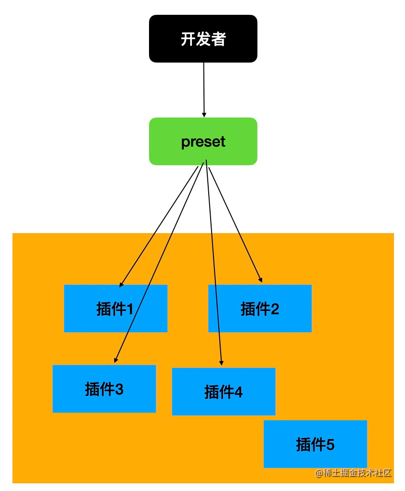

由 preset 引入一系列 plugin，我们只需要选择不同的 preset 即可。

那 babel 的 preset 都是怎么设计的呢？

## preset-es20xx 到 preset-env

babel6 支持的 preset 是 preset-es2015、preset-es2016、preset-stage-x 等。

也就是根据目标语言版本来指定一系列插件。

但是这样的 preset 设计有个问题：

指定了目标环境支持 es5，但如果目标环境支持了部分 es6（es2015）、es7（es2016）等，那岂不是做了很多没必要的转换？
 
还有，reset-es2015、preset-es2016、preset-stage-x 这种 preset 跟随版本走的，那岂不是经常变，得经常改这些 preset 的内容 （当某个提案从 stage 0 进入到 stage 1 就得改下），这样多麻烦啊，而且用户也得经常改配置，stage-x 用到了啥对用户来说也是黑盒。
 
怎么解决这些问题呢？
 
babel6 到 babel7 的变化给出了答案：
 
babel7 废弃了 stage-x 和 es20xx 的 preset，改成 preset-env 和 plugin-proposal-xx 的方式。

这样就不需要指定用的是 es 几了，默认会全部支持，包含[所有的已经是语言标准特性的 transform plugin](https://github.com/babel/babel/blob/master/packages/babel-compat-data/scripts/data/plugin-features.js)。

而且 stage-x 有哪些不再是黑盒，用户想用啥 proposal 的特性直接显示引入对应的 proposal plugin。

做了很多无用的转换的问题通过指定目标环境来解决。

但是目标环境那么多，浏览器版本、node 版本、electron 版本每年都在变，怎么做到精准？ 

##### compat-table

答案是 compat-table 的数据，compat-table 提供了每个特性在不同环境中的支持版本。

比如[默认参数](https://github.com/kangax/compat-table/blob/gh-pages/data-es6.js#L1864-L1904)这个 es2015 的特性，可以查到在 babel6 且 corejs2 以上支持，在 chrome 中是 49 以上支持，chrome48 中还是实验特性，在 node6 以上支持，等等。

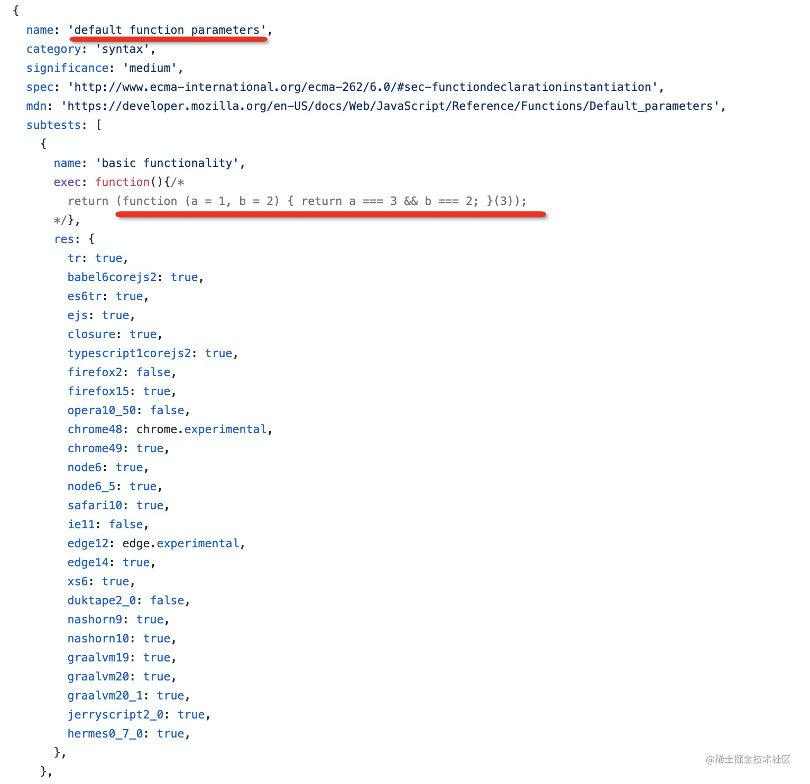
 
光是这些数据还不够，electron 有自己的版本，要支持 electron 得需要 electron 版本和它用的 chromuim 的版本的对应关系。

万幸有 electron-to-chromium 这个项目，它维护了 [electron 版本到 chromium 版本的映射关系](https://github.com/Kilian/electron-to-chromium/blob/master/full-versions.js)。

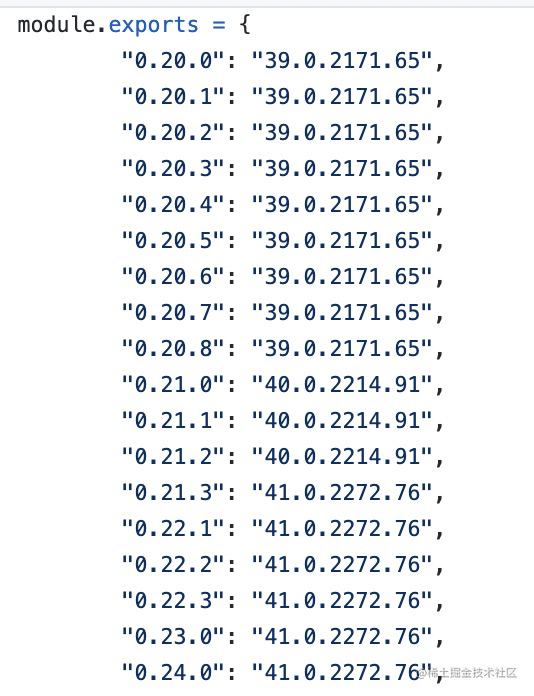

也可以反过来查询 [chromium 版本在哪些 electron 版本中使用](https://github.com/Kilian/electron-to-chromium/blob/master/full-chromium-versions.js)。

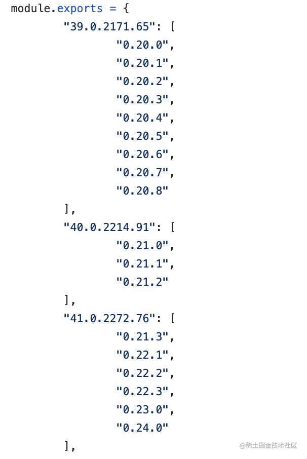

有了这些数据，我们就能知道每一个特性在哪些环境的什么版本支持。

babel7 在 @babel/compat-data 这个包里面维护了这种特性到环境支持版本的映射关系，包括 [plugin 实现的特性的版本支持情况](https://github.com/babel/babel/blob/main/packages/babel-compat-data/data/plugins.json)（包括 transform 和 proposal ），也包括 [corejs 所 polyfill 的特性的版本支持情况](https://github.com/babel/babel/blob/main/packages/babel-compat-data/data/corejs2-built-ins.json)。

比如：

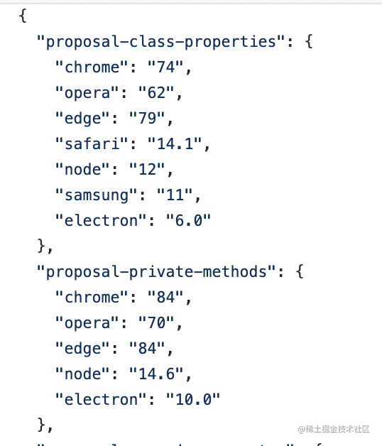

这样我们就知道每一个特性是在什么环境中支持的了，接下来只要用户指定一个环境，我们就能做到按需转换！

##### browserslist

那开发者怎么指定环境呢？ 

让开发者写每个环境的版本是啥肯定不靠谱，这时候就要借助 browerslist 了，它提供了一个从 query （查询表达式） 到对应环境版本的转换。

比如我们可以通过 last 1 version 来查询最新的各环境的版本

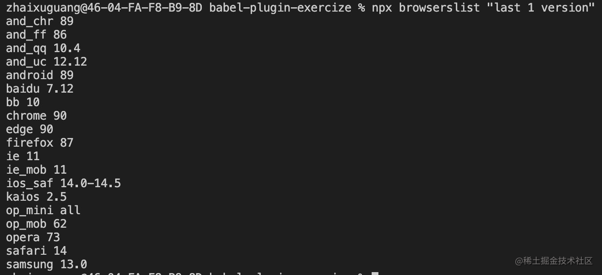

也可以通过 supports es6-module 查询所有支持 es module 的环境版本

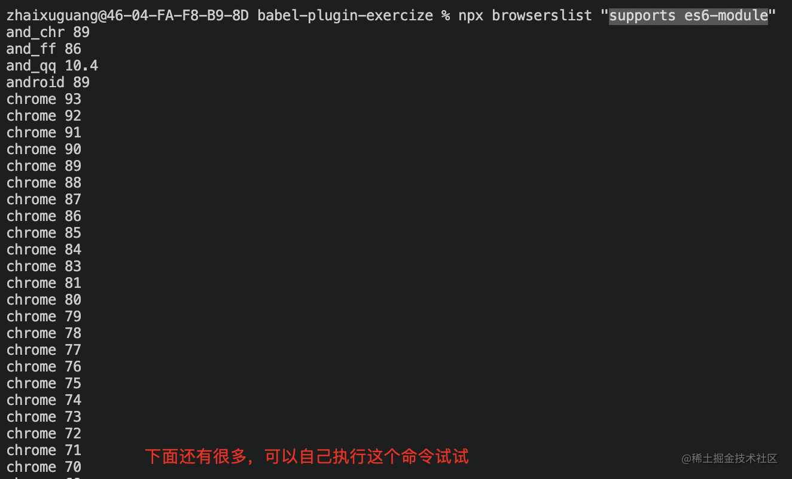

具体查询的语法有很多，可以去 [browserslist 的 query 文档](https://github.com/browserslist/browserslist#queries)中学习，这里就不展开了。

##### @babel/preset-env

现在有了什么特性在什么环境版本中支持，有了可以通过 query 指定目标环境版本的工具，那么就可以上手改了，从都转成 es5 到根据目标环境确定不支持的特性，只转换这部分特性，这就是 @babel/preset-env 做的事情。

有了 @babel/compat-data 的数据，那么只要用户指定他的目标环境是啥就可以了，这时候可以用 browserslist 的 query 来写，比如 `last 1 version, > 1%` 这种字符串，babel 会使用 brwoserslist 来把它们转成目标环境具体版本的数据。

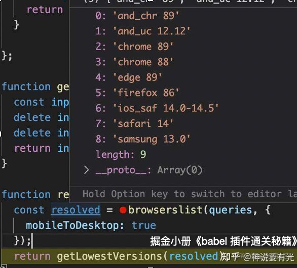

有了不同特性支持的环境的最低版本的数据，有了具体的版本，那么过滤出来的就是目标环境不支持的特性，然后引入它们对应的插件即可。这就是 preset-env 做的事情(按照目标环境按需引入插件)。

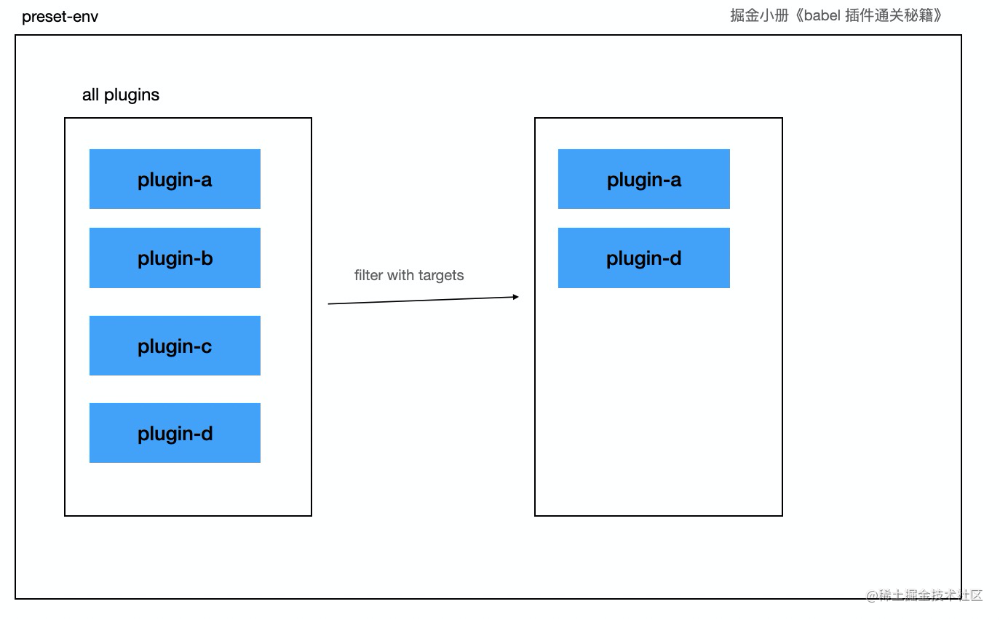

配置方式比如：
```javascript
{
    "presets": [["@babel/preset-env", { "targets": "> 0.25%, not dead" }]]
}
```

这样就通过 preset-env 解决了多转换了目标环境已经支持的特性的问题。

其实 polyfill 也可以通过 targets 来过滤。

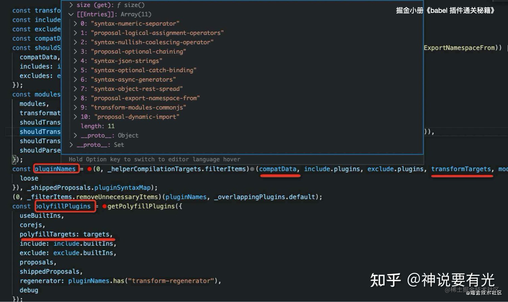

不再手动引入 polyfill，那么怎么引入？ 当然是用 preset-env 自动引入了。但是不是默认就会启用这个功能，需要配置。

```javascript
{
    "presets": [["@babel/preset-env", { 
        "targets": "> 0.25%, not dead",
        "useBuiltIns": "usage",// or "entry" or "false"
        "corejs": 3
    }]]
}
```

配置下 corejs 和 useBuiltIns。

- corejs 就是 babel 7 所用的 polyfill，需要指定下版本，corejs 3 才支持实例方法（比如 Array.prototype.fill ）的 polyfill。

- useBuiltIns 就是使用 polyfill （corejs）的方式，是在入口处全部引入（entry），还是每个文件引入用到的（usage），或者不引入（false）。

配置了这两个 option 就可以自动引入 polyfill 了。


#### @babel/preset-env 的配置

这个包的配置比较多，首先我们要指定的是 targets，也就是 browserslist 的 query，这个同样可以在 .browserslistrc 的配置文件中指定（别的工具也可能用到）。

具体有啥配置可以看 [@babel/preset-env 的文档](https://www.babeljs.cn/docs/babel-preset-env)，这里简单讲几个：

##### targets

targets 是指定编译的目标环境的，可以配 query 或者直接指定环境版本（query 的结果也是环境版本）。

环境有这些：

chrome, opera, edge, firefox, safari, ie, ios, android, node, electron

可以指定 query：

```javascript
{
  "targets": "> 0.25%, not dead"
}
```
也可以直接指定环境版本；
```javascript
{
  "targets": {
    "chrome": "58",
    "ie": "11"
  }
}
```


##### include & exclude

通过 targets 的指定，babel 会自动引入[一些插件](https://github.com/babel/babel/blob/master/packages/babel-compat-data/scripts/data/plugin-features.js)，但如果觉得自动引入的不大对，也可以手动指定。

当需要手动指定要 include 或者 exclude 什么插件的时候可以使用这个 option。

不过这个只是针对 transform plugin，对于 proposal plugin，要在 plugins 的 option 单独引入。

一般情况下用 preset-env 自动引入的就可以了。

##### modules

babel 转换代码自然会涉及到模块语法的转换。

modules 就是指定目标模块规范的，取值有 amd、umd、systemjs、commonjs (cjs)、auto、false。

- amd、umd、systemjs、commonjs (cjs) 这四个分别指定不同的目标模块规范

- false 是不转换模块规范

- auto 则是自动探测，默认值也是这个。

其实一般这个 option 都是 bundler 来设置的，因为 bundler 负责模块转换，自然知道要转换成什么模块规范。我们平时就用默认值 auto 即可。

auto 会根据探测到的目标环境支持的模块规范来做转换。依据是在 transform 的时候传入的 caller 数据。

``` javascript
babel.transformFileSync("example.js", {
  caller: {
    name: "my-custom-tool",
    supportsStaticESM: true,
  },
});
```
比如在调用 transformFile 的 api 的时候传入了 caller 是支持 esm 的，那么在 targets 的 modules 就会自动设置为 esm。

##### debug

我们知道 preset-env 会根据 targets 支持的特性来引入一系列插件。

想知道最终使用了啥插件，那就可以把 debug 设为 true，这样在控制台打印这些数据。

比如
```javascript
const sourceCode = `
  import "core-js";
  new Array(5).fill('111');
`;

const { code, map } = babel.transformSync(sourceCode, {
    filename: 'a.mjs',
    targets: {
        browsers: 'Chrome 45',
    },
    presets: [
        ['@babel/env', {
            debug: true,
            useBuiltIns: 'usage',
            corejs: 3
        }]
    ]
});

```
设置 debug 为 true，会打印 targets 和根据 tragets 过滤出的的 plugin 和 preset：
```
@babel/preset-env: `DEBUG` option

Using targets:
{
  "chrome": "45"
}

Using modules transform: auto

Using plugins:
  proposal-numeric-separator { chrome < 75 }
  proposal-logical-assignment-operators { chrome < 85 }
  proposal-nullish-coalescing-operator { chrome < 80 }
  proposal-optional-chaining { chrome }
  proposal-json-strings { chrome < 66 }
  proposal-optional-catch-binding { chrome < 66 }
  transform-parameters { chrome < 49 }
  proposal-async-generator-functions { chrome < 63 }
  proposal-object-rest-spread { chrome < 60 }
  transform-dotall-regex { chrome < 62 }
  proposal-unicode-property-regex { chrome < 64 }
  transform-named-capturing-groups-regex { chrome < 64 }
  transform-async-to-generator { chrome < 55 }
  transform-exponentiation-operator { chrome < 52 }
  transform-function-name { chrome < 51 }
  transform-arrow-functions { chrome < 47 }
  transform-classes { chrome < 46 }
  transform-object-super { chrome < 46 }
  transform-for-of { chrome < 51 }
  transform-sticky-regex { chrome < 49 }
  transform-unicode-regex { chrome < 50 }
  transform-spread { chrome < 46 }
  transform-destructuring { chrome < 51 }
  transform-block-scoping { chrome < 49 }
  transform-new-target { chrome < 46 }
  transform-regenerator { chrome < 50 }
  proposal-export-namespace-from { chrome < 72 }
  transform-modules-commonjs
  proposal-dynamic-import
corejs3: `DEBUG` option

Using targets: {
  "chrome": "45"
}

Using polyfills with `usage-global` method:
regenerator: `DEBUG` option

Using targets: {
  "chrome": "45"
}

Using polyfills with `usage-global` method:

  When setting `useBuiltIns: 'usage'`, polyfills are automatically imported when needed.
  Please remove the direct import of `core-js` or use `useBuiltIns: 'entry'` instead.

[/Users/zhaixuguang/code/research/babel/a.mjs]
Based on your code and targets, the corejs3 polyfill did not add any polyfill.

[/Users/zhaixuguang/code/research/babel/a.mjs]
Based on your code and targets, the regenerator polyfill did not add any polyfill.

```
用到了哪些插件一目了然，开发时可以开启这个配置项。

我们知道了 preset-env 能够根据目标环境引入对应的插件，最终会注入 helper 到代码里，但这样还是有问题的：

## 从 helper 到 runtime

preset-env 会在使用到新特性的地方注入 helper 到 AST 中，并且会引入用到的特性的 polyfill （corejs + regenerator），这样会导致两个问题：

- 重复注入 helper 的实现，导致代码冗余
- polyfill 污染全局环境

解决这两个问题的思路就是抽离出来，然后作为模块引入，这样多个模块复用同一份代码就不会冗余了，而且 polyfill 是模块化引入的也不会污染全局环境。

使用 transform-runtime 之前：

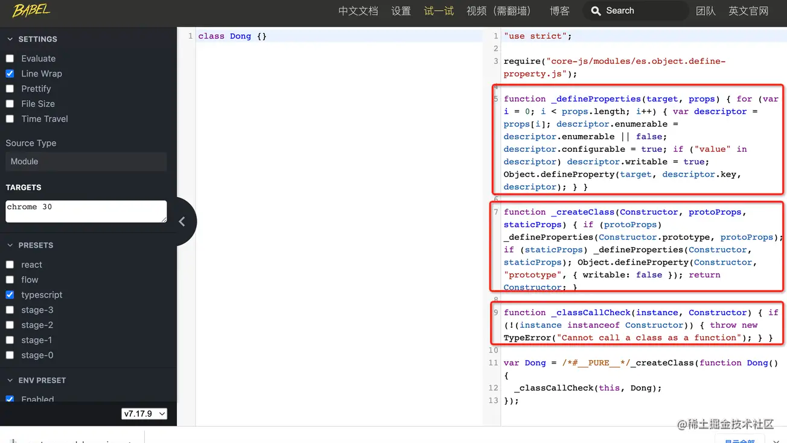

使用 transform-runtime 之后：

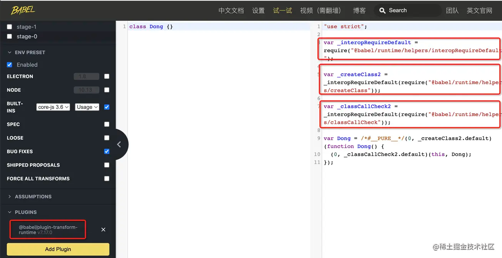

这个逻辑是在 @babel/plugin-transform-runtime 包里实现的。它可以把直接注入全局的方式改成模块化引入。

比如使用 preset-env 的时候是全局引入的：


当引入 @babel/plugin-transform-runtime 就可以模块化引入：


这样就不再污染全局环境了。

babel7 通过 preset-env 实现了按需编译和 polyfill，还可以用 plugin-transform-runtime 来变成从 @babel/runtime 包引入的方式。

但这也不是完美的，还有一些问题：

### babel7 的问题

我们先来试验一下：

看一下 Array.prototype.fill 的环境支持情况：

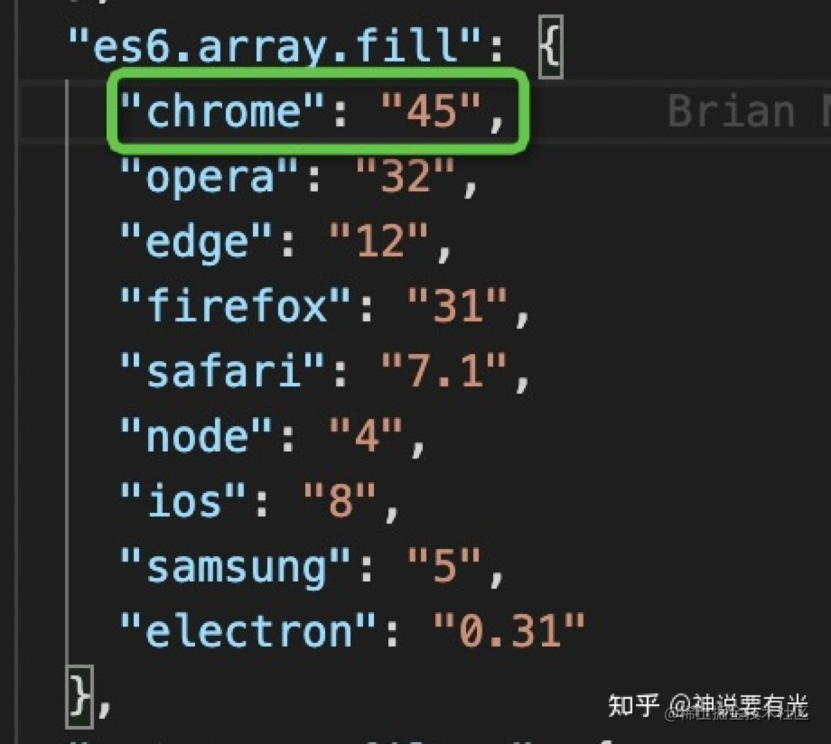

可以看到在 Chrome 45 及以上支持这个特性，而在 Chrome 44 就不支持了。

我们先单独试一下 preset-env：

当指定 targets 为 Chrome 44 时，应该自动引入polyfill：

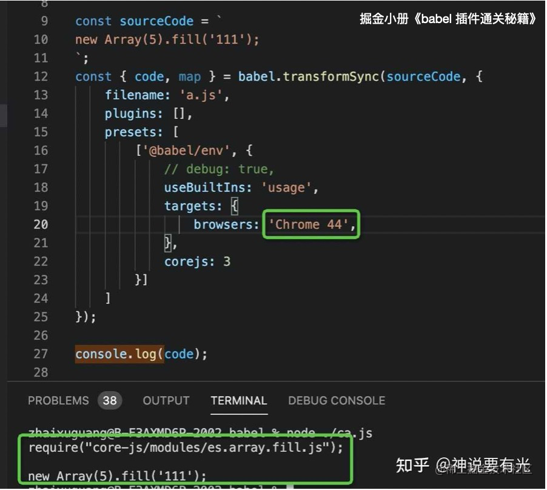

当指定 targets 为 Chrome 45 时，不需要引入polyfill：

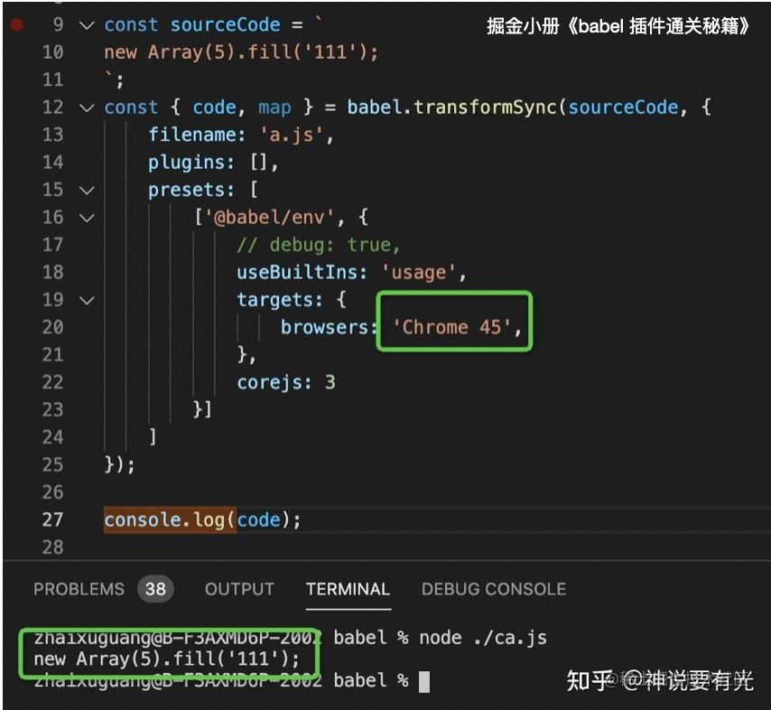

结果都符合预期，44 引入，45 不引入。

我们再来试试 @babel/plugin-transform-runtime：

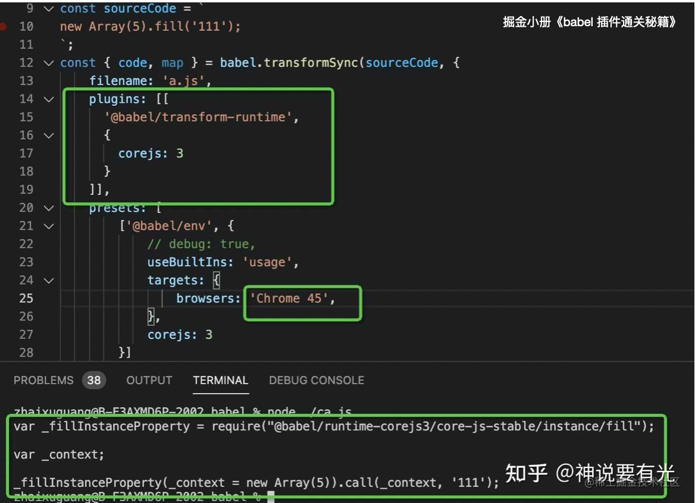

是不是发现问题了，Chrome 45 不是支持 Array.prototype.fill 方法么，为啥还是引入了 polyfill。

因为 babel 中插件的应用顺序是：先 plugin 再 preset，plugin 从左到右，preset 从右到左，这样 plugin-transform-runtime 是在 preset-env 前面的。等 @babel/plugin-transform-runtime 转完了之后，再交给 preset-env 这时候已经做了无用的转换了。而 @babel/plugin-transform-runtime 并不支持 targets 的配置，就会做一些多余的转换和 polyfill。

这个问题在即将到来的 babel8 中得到了解决。

### babel8

babel8 提供了 [一系列 babel polyfill 的包 ](https://github.com/babel/babel-polyfills)  ，解决了 babel7 的 @babel/plugin-transform-runtime 的遗留问题，可以通过 targets 来按需精准引入 polyfill。

babel8 支持配置一个 polyfill provider，也就是说你可以指定 corejs2、corejs3、es-shims 等 polyfill，还可以自定义 polyfil。

有了 polyfill 源之后，使用 polyfill 的方式也把之前 transform-runtime 做的事情内置了，从之前的 useBuiltIns: entry、 useBuiltIns: usage 的两种，变成了 3 种：

- entry-global: 这个和之前的 useBuiltIns: entry 对标，就是全局引入 polyfill。


- usage-entry: 这个和 useBuiltIns: usage 对标，就是具体模块引入用到的 polyfill。


- usage-pure：这个就是之前需要 transform-runtime 插件做的事情，使用不污染全局变量的 pure 的方式引入具体模块用到的 polyfill.


其实这三种方式 babel 7 也支持，但是 babel8 不再需要 transform-runtime 插件了，而且还支持了 polyfill provider 的配置。

babel 的功能都是通过插件完成的，但是直接指定插件太过麻烦，所以设计出了 preset，我们学习 babel 的内置功能基本等价于学习 preset 的使用。主要是 preset-env、preset-typescript 这些。

但是一些 proposal 的插件需要单独引入，并且 @babel/plugin-transform-runtime也要单独引入。

学习内置功能的话 preset 是重点，但是最终完成功能的还是通过插件。

## 总结

上一节我们基于 plugin 和 preset 已经能够完成 esnext 等代码转目标环境 js 代码的功能，但是还不完美。

这一节我们介绍了 @babel/preset-env，它基于每种特性的在不同环境的最低支持版本的数据和配置的 targets 来过滤插件，这样能减少很多没必要的转换和 polyfill。

如果希望把一些公共的 helper、core-js、regenerator 等注入的 runtime 函数抽离出来，并且以模块化的方式引入，那么需要用 @babel/plugin-transform-runtime 这个包。

@babel/plugin-transform-runtime 不支持根据 targets 的过滤，和 @babel/preset-env 配合时有问题，这个在 babel8 中得到了解决。babel8 提供了很多 babel polyfill 包，支持了 polyfill provider 的配置，而且还可以选择注入方式。不再需要 @babel/plugin-transform-runtime 插件了。

学完这一节，我们知道了 babel 如何基于 targets 的配置做到精准的转换，我们平时开发主要是使用 preset，了解下 preset 设计和演变还是很有意义的。 
