# 14.Babel 配置的原理

> 觉得之前写的 babel 内置功能不是很好，所以补充一节 babel 配置的原理，常用的配置也就这些。

babel 是一个 JS、TS 的编译器，它能把新语法写的代码转换成目标环境支持的语法的代码，并且对目标环境不支持的 api 自动 polyfill。

babel 基本每个项目都用，大家可能对 @babel/preset-env 和 @babel/plugin-transform-runtime 都很熟悉了，但是你真的理解它们么？

相信很多同学只是知道它能干什么，但不知道它是怎么实现的，这篇文章我们就来深入下它们的实现原理吧。

首先，我们先来试一下 preset-env 和 plugin-transform-runtime 的功能：
## 功能测试

@babel/preset-env 的作用是根据 targets 的配置引入对应插件来实现编译和 polyfill。

比如这段代码：

```javascript
class Dong {
}
```
在低版本浏览器不支持，会做语法转换。

我们把 targets 指定成比较低版本的浏览器，比如 chrome 30，并且打开 debug 选项，它的作用是会打印用到的 plugin。

```javascript
{
    presets: [
        ['@babel/preset-env', {
            targets: 'chrome 30',
            debug: true,
            useBuiltIns: 'usage',
            corejs: 3
        }]
    ]
}
```
执行 babel 就会发现它用到了这些插件：

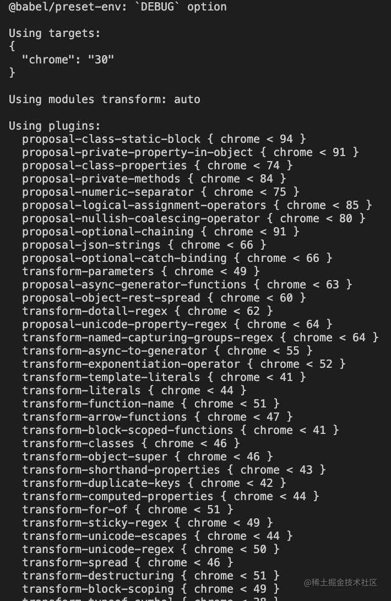

这就是 @babel/preset-env 的意义，自动根据 targets 来引入需要的插件，不然要是手动写这么一堆插件不得麻烦死。

开启 polyfill 功能要指定它的引入方式，也就是 useBuiltIns。设置为 usage 是在每个模块引入用到的，设置为 entry 是统一在入口处引入 targets 需要的。

polyfill 的实现就是 core-js，需要再指定下 corejs 版本，一般是指定 3，这个会 polyfill 实例方法，而 corejs2 不会。

上面一段代码会转换成这样：

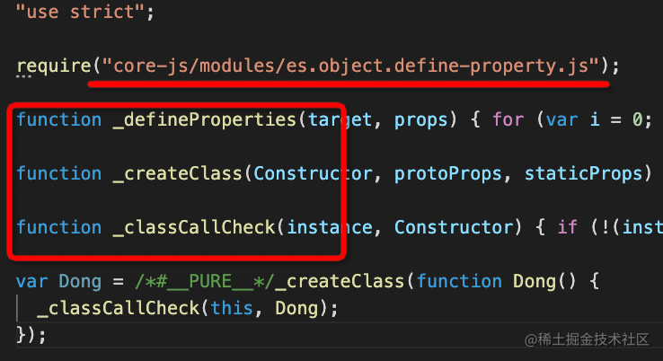

注入了 3 个 helper，也就是 _createClass 这种以下划线开头的辅助方法。

因为 helper 方法里用到了 Object.defineProperty 的 api，这里也会从 core-js 里引入。

我们再测试一下这样一段代码：

```javascript
async function func() {
}
```

会被转换成这样：

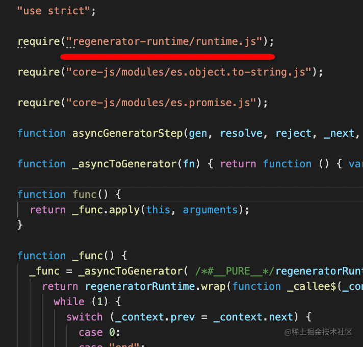

除了注入 core-js、helper 代码外，还注入了 regenerator 代码，这个是 async await 的实现。

综上，**babel runtime 包含的代码就 core-js、helper、regenerator 这三种。**

@babel/preset-env 的处理方式是 helper 代码直接注入、regenerator、core-js 代码全局引入。

这样就会导致多个模块重复注入同样的代码，会污染全局环境。

解决这个问题就要使用 @babel/plugin-transform-runtime 插件了。

我们在配置文件里引入这个插件：

```javascript
{
    presets: [
        ['@babel/preset-env', {
            targets: 'chrome 30',
            debug: true,
            useBuiltIns: 'usage',
            corejs: 3
        }]
    ],
    plugins: [
        ['@babel/plugin-transform-runtime', {
            corejs: 3
        }]
    ]
}
```

注意，这个插件也是处理 polyfill ，也就同样需要指定 corejs 的版本。

然后测试下引入之后有什么变化：

先测试 class 那个案例：

之前是这样的：

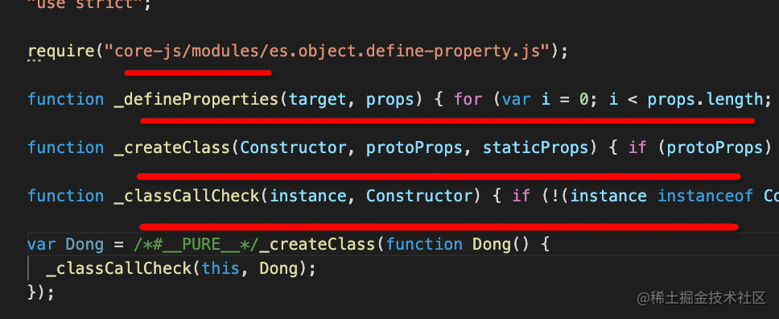

现在变成了这样：

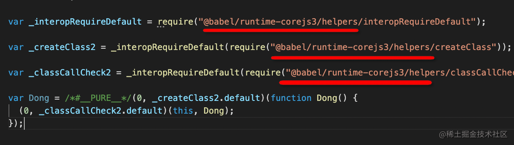

变成了从 @babel/runtime-corejs3 引入的形式，这样就不会多个模块重复注入同样的实现代码了，而且 core-js 的 api 也不是全局引入了，变成了模块化引入。

这样就解决了 corejs 的重复注入和全局引入 polyfill 的两个问题。

再测试 async function 那个案例：

之前是这样的：

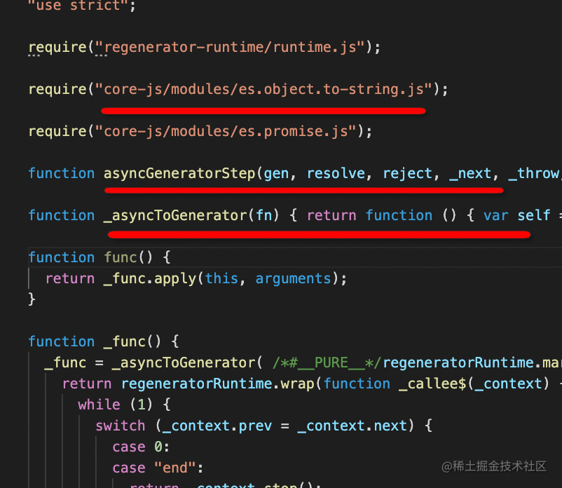

同样有全局引入和重复注入的问题。

引入 transform-runtime 插件之后是这样的：

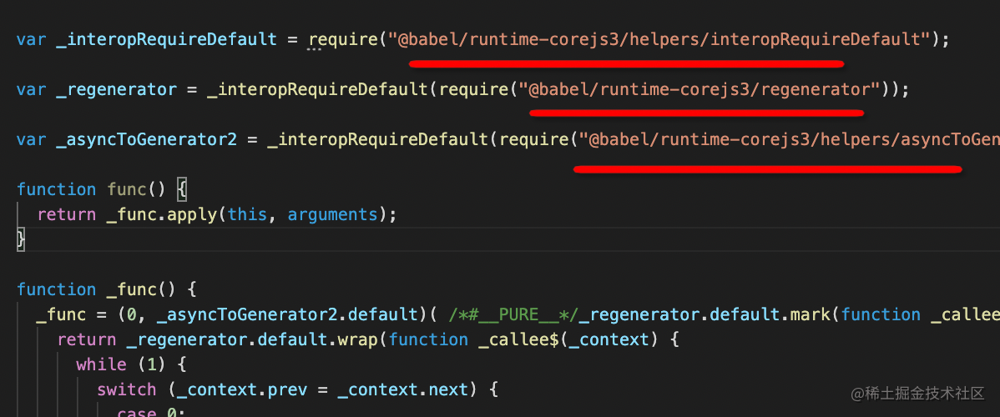

也是同样的方式解决了那两个问题。

再来测试一个 api 的，用这样一段代码：

```javascript
new WeakMap();
```
当只配置 preset-env 时：

```javascript
{
    presets: [
        ['@babel/preset-env', {
            targets: 'chrome 30',
            debug: true,
            useBuiltIns: 'usage',
            corejs: 3
        }]
    ]
}
```
结果是这样的：

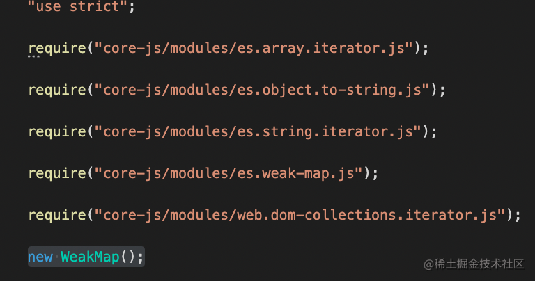

再加上 @babel/plugin-transform-runtime 后：

```javascript
{
    presets: [
        ['@babel/preset-env', {
            targets: 'chrome 30',
            debug: true,
            useBuiltIns: 'usage',
            corejs: 3
        }]
    ],
    plugins: [
        ['@babel/plugin-transform-runtime',
            {
                corejs: 3
            }
        ]
    ]
}
```
结果是这样的：

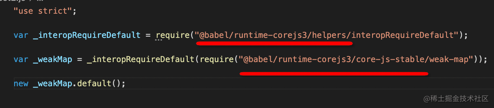

这样我们就清楚了 @babel/plugin-transform-runtime 的功能，把注入的代码和 core-js 全局引入的代码转换成从 @babel/runtime-corejs3 中引入的形式。

@babel/runtime-corejs3 就包含了 helpers、core-js、regenerator 这 3 部分。

功能我们都清楚了，那它们是怎么实现的呢？

## 实现原理

preset-env 的原理之前讲过，就是根据 targets 的配置查询内部的 @babe/compat-data 的数据库，过滤出目标环境不支持的语法和 api，引入对应的转换插件。

targets 使用 browserslist 来解析成具体的浏览器和版本：

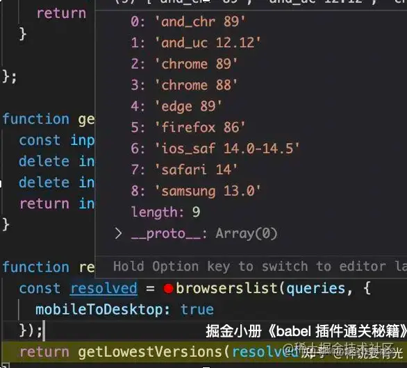

然后根据 @babel/compact-data 的数据来过滤出这些浏览器支持的语法和 api： 

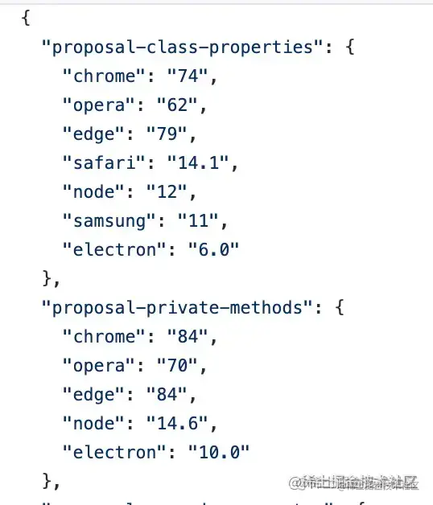

然后去掉这些已经支持的语法和 api 对应的插件，剩下的就是需要用的转换插件：

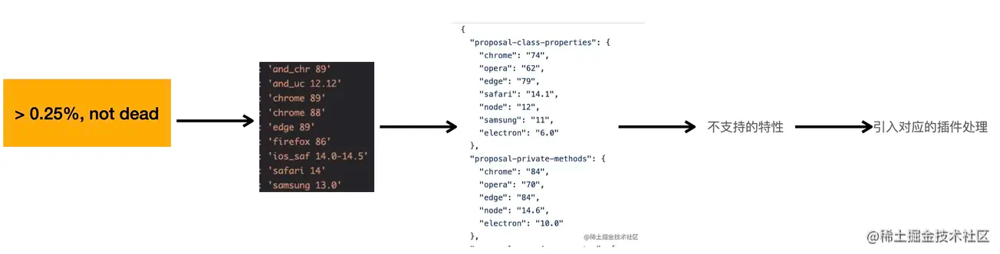

这就是 preset-env 的根据 targtes 来按需转换语法和 polyfill 的原理。

那 @babel/plugin-transform-runtime 呢？它是怎么实现的？

这个插件的原理是因为 babel 插件和 preset 生效的顺序是这样的（下面是官网文档的截图）：


先插件后 preset，插件从左往右，preset 从右往左。

这就导致了 @babel/plugin-transform-runtime 是在 @babel/preset-env 之前调用的，提前做了 api 的转换，那到了 @babel/preset-env 就没什么可转了，也就实现了 polyfill 的抽取。

它的源码是这样的：

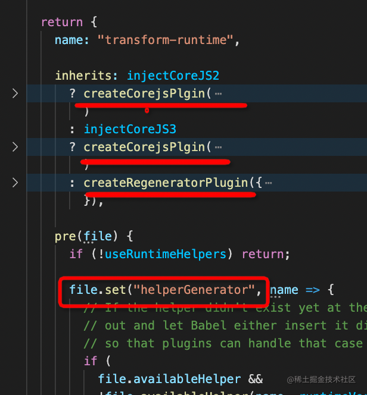

会根据配置来引入 corejs、regenerator 的转换插件，实现 polyfill 注入的功能。

并且还设置了一个 helperGenerator 的函数到全局上下文 file，这样后面 @babel/preset-env 就可以用它来生成 helper 代码。那自然也就是抽离的了。

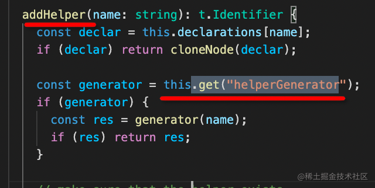

这就是 @babel/plugin-transform-runtime 的原理：

因为插件在 preset 之前调用，所以可以提前把 polyfill 转换了，而且注入了 helpGenerator 来修改 @babel/preset-env 生成 helper 代码的行为。

原理我们理清了，但是大家有没有发现其中的问题：

## 现有方案的问题

我们通过 @babel/plugin-transform-runtime  提前把 polyfill 转换了，但是这个插件里没有 targets 的设置呀，不是按需转换的，那就会多做一些没必要的转换。

这个其实是已知问题，可以在 babel 的项目里找到这个 [issue](https://github.com/babel/babel/issues/10008 )：

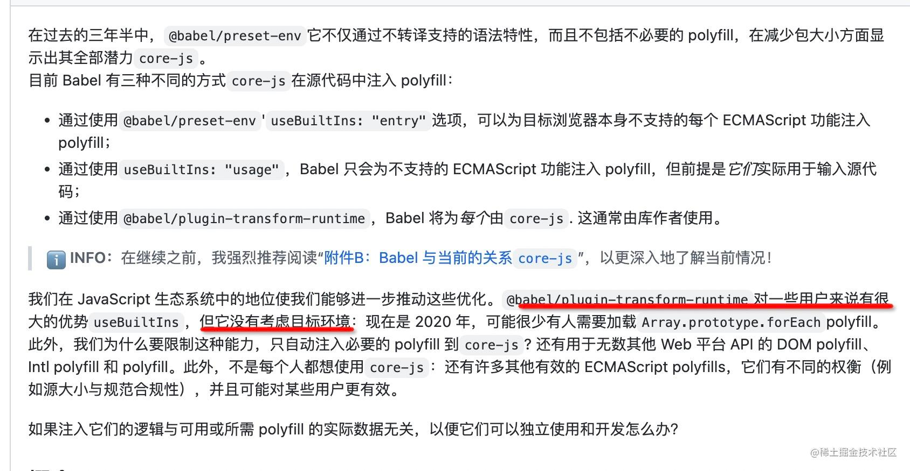

当然官方也提出了解决的方案，只不过这个得等 babel 新版本更新再用了，等 babel8 吧。

## 总结

babel7 以后，我们只需要使用 @babel/preset-env，指定目标环境的 targets，babel 就会根据内部的兼容性数据库查询出该环境不支持的语法和 api，进行对应插件的引入，从而实现按需的语法转换和 polyfill 引入。

但是 @babel/preset-env 转换用到的一些辅助代码（helper）是直接注入到模块里的，没有做抽离，多个模块可能会重复注入。并且用到的 polyfill 代码也是全局引入的，可能污染全局环境。为了解决这两个问题我们会使用 @babel/plugin-transform-runtime 插件来把注入的代码抽离，把全局的引入改为从 @babel/runtime-corejs3 引入的方式。

runtime 包包含 core-js、regenerator、helper 三部分。

@babel/plugin-transform-runtime 能生效的原理是因为插件先于 preset 被调用，提前把那些 api 做了转换，并且设置了 preset-env 生成 helper 的方式。

但是这个转换和 preset-env 是独立的，它没有 targets 的配置，这就导致了不能按需 polyfill，会进行一些不必要的转换。这个是已知的 issue，等 babel 版本更新吧。

看到这里，你对 babel 的配置和这些配置的原理是否有更深的理解了呢。
