# 15.工具介绍：VSCode Debugger 的使用

> 想看懂复杂代码离不开 debugger，它是提升 Node.js 水平必备的能力。因为后面的案例代码都是有一定的复杂度的，建议同学们先学会使用 debugger 再去学后面的案例，结合 debugger 来看。

这一节，我们来学习下 vscode debugger 的使用。

首先，我们把[代码](https://github.com/QuarkGluonPlasma/babel-plugin-exercize)下载下来后，可以看到又一个 .vscode 的目录，里面有个 launch.json 的配置，这里面就是调试的配置。

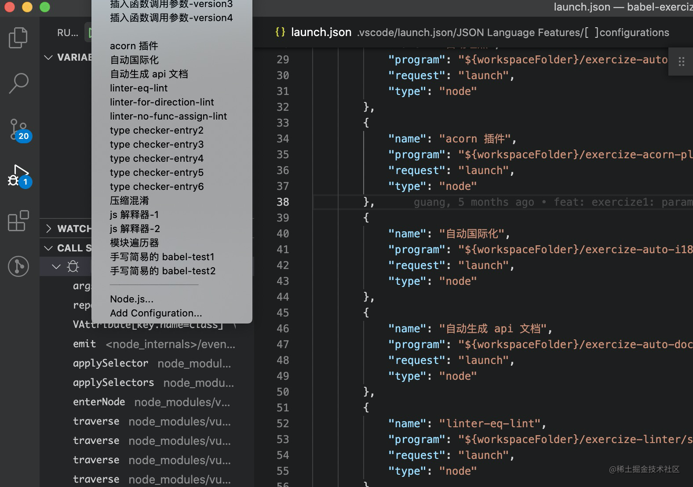

这个文件就是调试的配置，点开 debugger 的窗口，就可以看到启动调试的按钮。

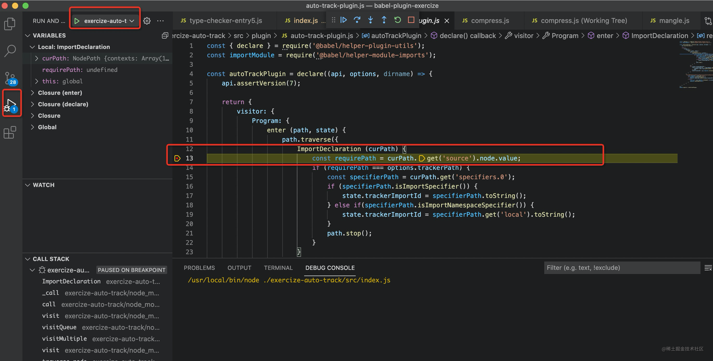

可以在想断住的那一行左边点一下，就会打上断点，然后点击调试，就会以 debug 模式运行，到了断点就会停住，然后可以看到堆栈信息、断点等。

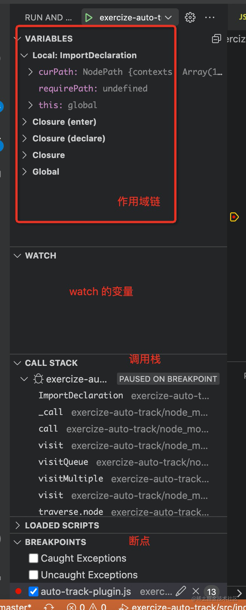

这是 vscode debugger 的使用方式。

## vscode debugger 的配置

会了怎么使用之后，我们来深入讲下怎么配置，希望能够让同学们的 nodejs 调试能力有所提升。

点击这个齿轮，会打开 .vscode/launch.json 的内容来编辑，在这里写各种配置。

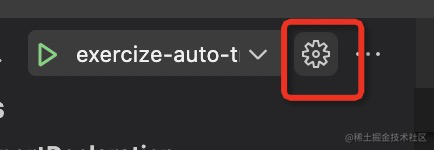

点击右下角的按钮就会有一个菜单来选择配置的模版：

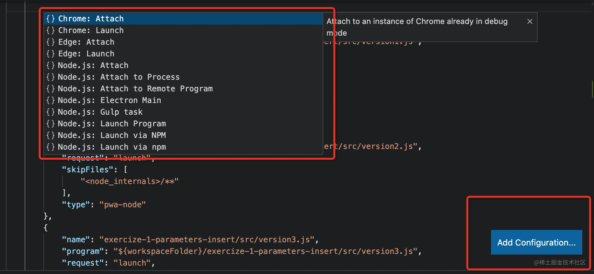

运行环境有很多，比如 chrome、node.js 等，这里我们只需要 node.js 的环境。

然后启动方式分为 launch 和 attach 两种。为什么是这两种呢？

那是因为调试是分为客户端和服务端的，

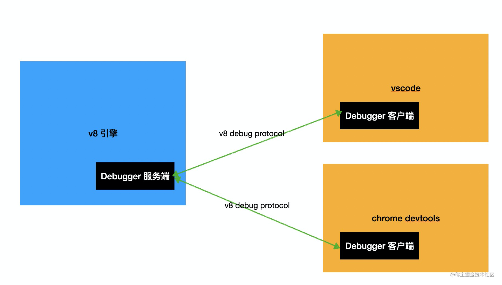

我们如果是启动 node.js 的调试模式，需要加上 --inspect  或者 --inspect-brk（在首行断住）参数，之后会启动一个 websocket server，等待客户端链接。

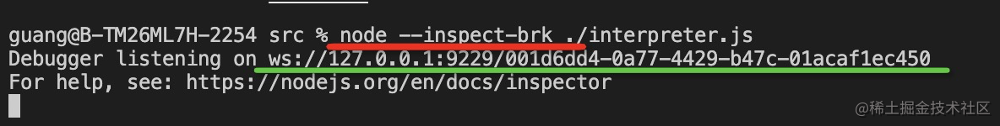

两者之间是通过 v8 debug protocol 来通信的。

比如：
设置断点：
```javascript
{
    "seq":117,
    "type":"request",
    "command":"setbreakpoint",
    "arguments":{
        "type":"function",
        "target":"f"
    }
}
```
去掉断点：
```javascript
{
    "seq":117,
    "type":"request",
    "command":"clearbreakpoint",
    "arguments": {
        "type":"function",
        "breakpoint":1
     }
}
```
手动连接的话可以打开 chrome://inspect 页面，可以用 chrome devtools 的 debugger client 连上来调试。

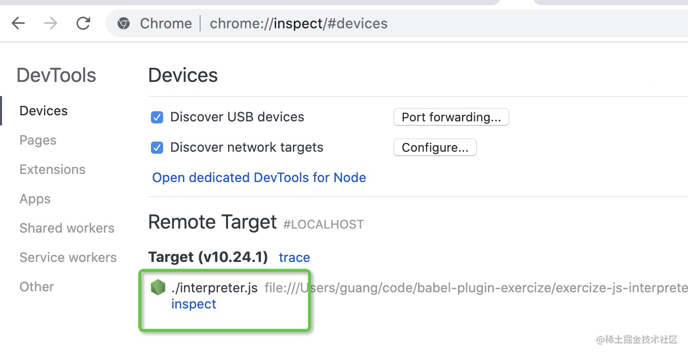

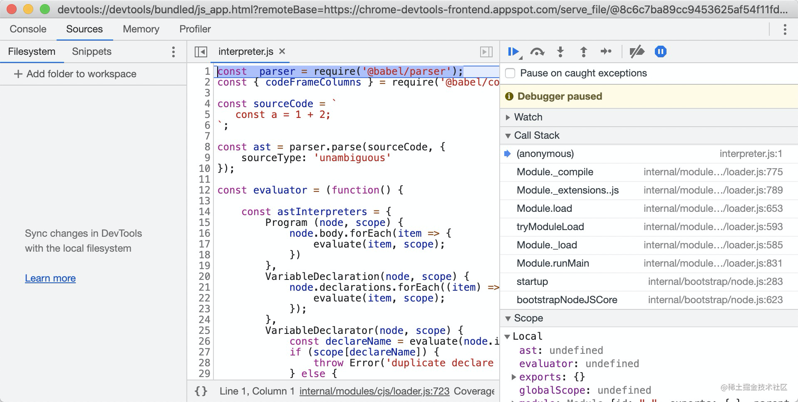

但是，用 vscode 不用这么麻烦，直接在 .vscode/launch.json 里面配置下就可以。

前面提到 vsocde 的 debug 配置分为 launch 和 attach 两种：

- launch： 把 nodejs 代码跑起来，启动 debugger server，然后用 client 来连接
- attach：已经有了 debugger server，只需要启动一个 debugger client 连接上就行

所以就可以看到 launch 的配置要指定运行什么 js 代码：

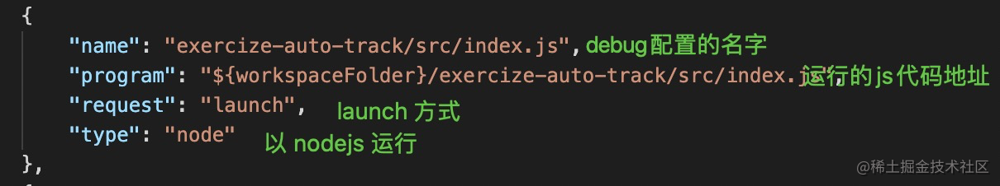

而 attach 则只需要指定 连接到哪个端口：

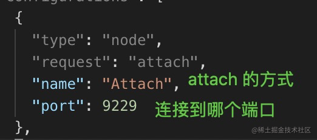

当然，小册里的代码都通过 launch 的配置就可以，如果添加的话也是类似上面的方式添加调试配置，然后就可以调试了。


vscode 提供了这几个控制按键（底层会发送 debug 协议的消息），点击按钮就可以让代码继续运行。

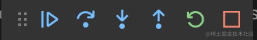


第一个是继续运行，到下一个断点停住

第二个是运行下一步（单步运行）

第三个可以在执行到某个函数调用的时候进入函数内部执行

第四个是跳出当前函数调用，然后往下执行

第五个是重新运行

第六个是终止运行

学会了 debugger 以后，api 不用记，打个断点都能看到：
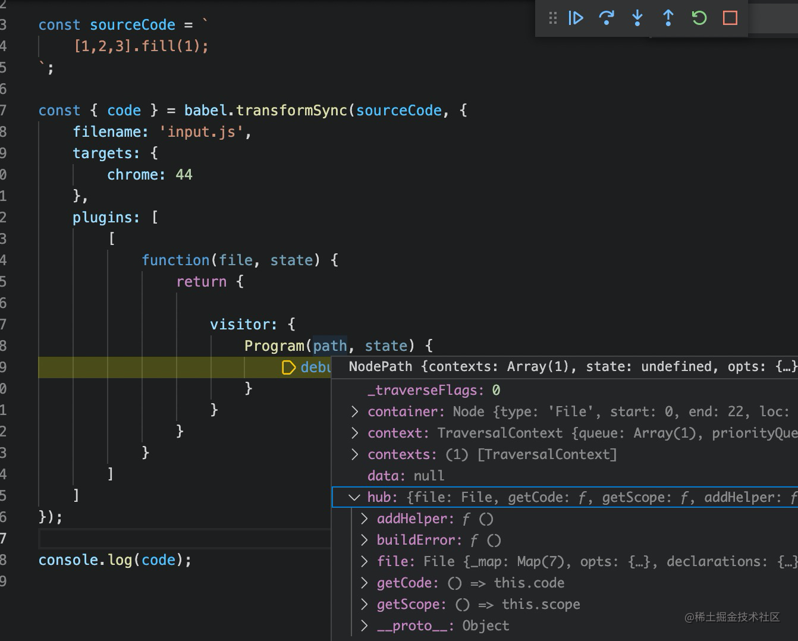

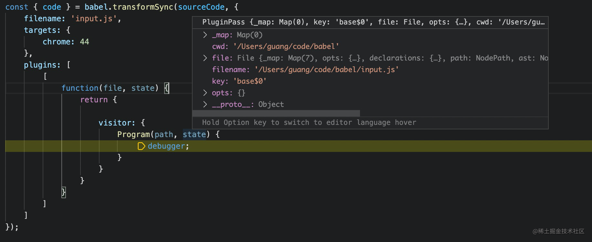

## 总结

debug 能力是一种很重要的能力，比起 console.log 来能精确的知道每一步的运行结果，更容易读懂代码。

小册代码中有 vscode debugger 的配置，但是很多读者不会使用，所以这节来介绍了一下，主要是在 .vscode/launch.json 里面添加配置，然后在 debug 窗口来启动调试，之后就可以打断点和单步运行了。

vscode debugger 的使用分为这几步：
1. 在 .vscode/launch.json 里面添加对应 js 文件的调试配置
2. 在要调试的那行左边打断点
3. 点击调试窗口的调试按钮启动调试
4. 点击下一步、下一个断点、进入函数内部等方式来部分执行代码

debugger 的实现原理是分为一个 debugger server 和一个 debugger client，deubgger server 在 js 引擎里面，debugger client 包括 chrome devtools、vscode debugger 等，他们两者之间通过调试协议通信，比如 v8 debug protocol。

launch 的方式就是启动一个 debugger server（websocket），然后用 debugger client 连接上，发送消息来控制单步执行、打断点等。

而 attach 只是 启动 client，连上已有的 debugger server，后续流程一样。

node --inspect xxx.js 就可以看到 ws://sss:111 的地址，这就是 websocket 的 debugger server 的地址。客户端用 chrome. devtools. 可以，用 vscode 或者其他 ide 都可以，因为他们都实现了 v8 debug protocol 的 websocket client，只是做了各自的 ui。（当然，原理做了解即可，了解原理的目的是为了更好的使用工具）。

掌握 vscode debugger 的使用，对更好的理解案例代码有很大的帮助。

