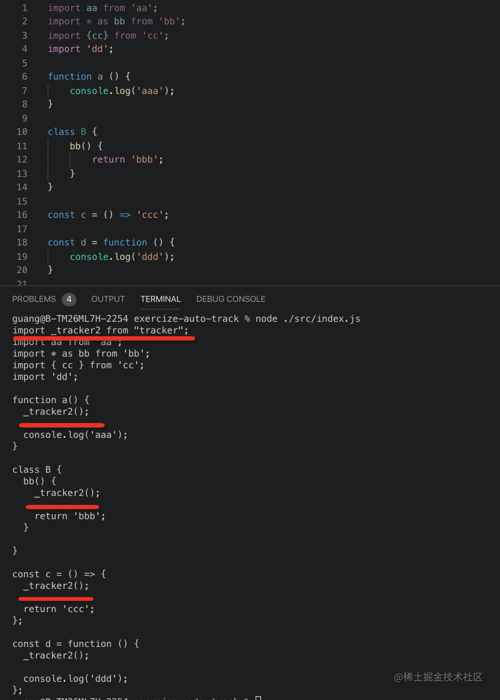

# 16.实战案例：自动埋点

埋点是一个常见的需求，就是在函数里面上报一些信息。像一些性能的埋点，每个函数都要处理，很繁琐。能不能自动埋点呢？

答案是可以的。埋点只是在函数里面插入了一段代码，这段代码不影响其他逻辑，这种函数插入不影响逻辑的代码的手段叫做函数插桩。

我们可以基于 babel 来实现自动的函数插桩，在这里就是自动的埋点。

## 思路分析

比如这样一段代码：

```javascript
import aa from 'aa';
import * as bb from 'bb';
import {cc} from 'cc';
import 'dd';

function a () {
    console.log('aaa');
}

class B {
    bb() {
        return 'bbb';
    }
}

const c = () => 'ccc';

const d = function () {
    console.log('ddd');
}
```

我们要实现埋点就是要转成这样：
```javascript
import _tracker2 from "tracker";
import aa from 'aa';
import * as bb from 'bb';
import { cc } from 'cc';
import 'dd';

function a() {
  _tracker2();

  console.log('aaa');
}

class B {
  bb() {
    _tracker2();

    return 'bbb';
  }

}

const c = () => {
  _tracker2();

  return 'ccc';
};

const d = function () {
  _tracker2();

  console.log('ddd');
};
```

有两方面的事情要做：

- 引入 tracker 模块。如果已经引入过就不引入，没有的话就引入，并且生成个唯一 id 作为标识符
- 对所有函数在函数体开始插入 tracker 的代码

## 代码实现

### 模块引入

引入模块这种功能显然很多插件都需要，这种插件之间的公共函数会放在 helper，这里我们使用 @babel/helper-module-imports。

```javascript
const importModule = require('@babel/helper-module-imports');

// 省略一些代码
importModule.addDefault(path, 'tracker',{
    nameHint: path.scope.generateUid('tracker')
})
```

首先要判断是否被引入过：在 Program 根结点里通过 path.traverse 来遍历 ImportDeclaration，如果引入了 tracker 模块，就记录 id 到 state，并用 path.stop 来终止后续遍历；没有就引入 tracker 模块，用 generateUid 生成唯一 id，然后放到 state。

当然 default import 和 namespace import 取 id 的方式不一样，需要分别处理下。

我们把 tracker 模块名作为参数传入，通过 options.trackerPath 来取。
```javascript
Program: {
    enter (path, state) {
        path.traverse({
            ImportDeclaration (curPath) {
                const requirePath = curPath.get('source').node.value;
                if (requirePath === options.trackerPath) {// 如果已经引入了
                    const specifierPath = curPath.get('specifiers.0');
                    if (specifierPath.isImportSpecifier()) { 
                        state.trackerImportId = specifierPath.toString();
                    } else if(specifierPath.isImportNamespaceSpecifier()) {
                        state.trackerImportId = specifierPath.get('local').toString();// tracker 模块的 id
                    }
                    path.stop();// 找到了就终止遍历
                }
            }
        });
        if (!state.trackerImportId) {
            state.trackerImportId  = importModule.addDefault(path, 'tracker',{
                nameHint: path.scope.generateUid('tracker')
            }).name; // tracker 模块的 id
            state.trackerAST = api.template.statement(`${state.trackerImportId}()`)();// 埋点代码的 AST
        }
    }
}
```

我们在记录 tracker 模块的 id 的时候，也生成调用 tracker 模块的 AST，使用 template.statement.

### 函数插桩

函数插桩要找到对应的函数，这里要处理的有：ClassMethod、ArrowFunctionExpression、FunctionExpression、FunctionDeclaration 这些节点。

当然有的函数没有函数体，这种要包装一下，然后修改下 return 值。如果有函数体，就直接在开始插入就行了。

```javascript
'ClassMethod|ArrowFunctionExpression|FunctionExpression|FunctionDeclaration'(path, state) {
    const bodyPath = path.get('body');
    if (bodyPath.isBlockStatement()) { // 有函数体就在开始插入埋点代码
        bodyPath.node.body.unshift(state.trackerAST);
    } else { // 没有函数体要包裹一下，处理下返回值
        const ast = api.template.statement(`{${state.trackerImportId}();return PREV_BODY;}`)({PREV_BODY: bodyPath.node});
        bodyPath.replaceWith(ast);
    }
}
```

这样我们就实现了自动埋点。

## 效果演示

我们来试下效果：
```javascript
const { transformFromAstSync } = require('@babel/core');
const  parser = require('@babel/parser');
const autoTrackPlugin = require('./plugin/auto-track-plugin');
const fs = require('fs');
const path = require('path');

const sourceCode = fs.readFileSync(path.join(__dirname, './sourceCode.js'), {
    encoding: 'utf-8'
});

const ast = parser.parse(sourceCode, {
    sourceType: 'unambiguous'
});

const { code } = transformFromAstSync(ast, sourceCode, {
    plugins: [[autoTrackPlugin, {
        trackerPath: 'tracker'
    }]]
});

console.log(code);
```

效果如下：



我们实现了自动埋点！

## 扩展思考
上面实现的是一种情况，实际上可能有的函数不需要埋点，这种可以自己做一下过滤，或者在函数上写上注释，然后根据注释来过滤，就像 eslint 支持 /* eslint-disable */ 来配置 rule 的开启关闭，teser 支持 /* @\_\_PURE\_\_*/ 来配置纯函数一样。关于注释的操作，可以看另一个案例“自动生成 API 文档”。

## 总结

函数插桩是在函数中插入一段逻辑但不影响函数原本逻辑，埋点就是一种常见的函数插桩，我们完全可以用 babel 来自动做。

实现思路分为引入 tracker 模块和函数插桩两部分：

引入 tracker 模块需要判断 ImportDeclaration 是否包含了 tracker 模块，没有的话就用 @babel/helper-module-import 来引入。

函数插桩就是在函数体开始插入一段代码，如果没有函数体，需要包装一层，并且处理下返回值。、

（代码在[这里](https://github.com/QuarkGluonPlasma/babel-plugin-exercize)，建议 git clone 下来通过 node 跑一下）