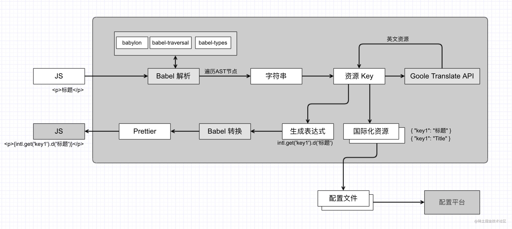
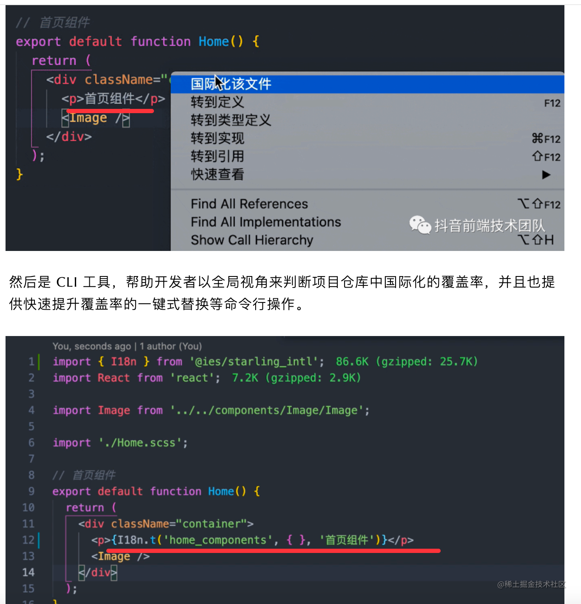

# 17.实战案例_ 自动国际化

互联网产品开发完以后可能会为不同地区的人提供服务，不同地区的语言不同，这就对软件提出了支持国际化的需求。

国际化要把软件中的文字、货币符号、数字等转成当地所支持的格式，对前端代码来说，需要把所有界面上的字符串字面量转成根据 locale 动态获取的。如果代码中有很多需要改动的代码，那工作量还是很大的。

我们知道 babel 可以用于分析代码和转换代码，那么基于 babel 自然可以做到自动的国际化。

## 思路分析

要转换的是字符串，主要是 StringLiteral 和 TemplateLiteral 节点，把它们替换成从资源包取值的形式。

比如：

```javascript
const a = '中文';
```

替换为：

```javascript
import intl from 'intl';

const a = intl.t('intl1');
```

而模版字符串也要做替换

```javascript
const name = 'babel';
const str = `你好 ${name}`;
```

替换为：

```javascript
const name = 'babel';
const str = intl.t('intl2', name);
```

intl.t 是根据 key 从 bundle 中取值的，语言包 bundle 里存储了各种语言环境下 key 对应的文案：

```javascript
// zh_CN.js
module.exports = {
    intl1: '中文',
    intl2: 'hello {placeholder}'
}
```
```javascript
// en_US.js
module.exports = {
    intl1: 'English',
    intl2: 'hello {placeholder}'
}
```

intl.t 是从资源 bundle 中取值，并且用传入的参数替换其中的占位符。

也就是把 {0} {1} {2} 替换为传入的参数。

```javascript
const locale = 'zh-CN';
intl.t = function(key, ...args) {
   let index = 0;
   return bundle[locale][key].replace(/\{placeholder\}/, () => args[index++]);
}
```
要实现这种转换，需要做三件事情：

- 如果没有引入 intl 模块，就自动引入，并且生成唯一的标识符，不和作用域的其他声明冲突
- 把字符串和模版字符串替换为 intl.t 的函数调用的形式
- 把收集到的值收集起来，输出到一个资源文件中

有一点需要注意的是在 jsx 中，必须带 {}

```javascript
const a = <component content="content"></component>;
```
要替换为 {} 包裹的表达式

```javascript
import intl from 'intl';

const a  = <component content={ intl.t('intl2') }></component>;
```
{} 节点叫做 JSXExpressionContainer，顾名思义，就是 jsx 中的表达式容器，用于实现插值语法。

再就是对于模版字符串中的表达式 ${} 要单独处理下。

有的时候，确实不需要转换，我们可以支持通过注释来配置：

```javascript
const a = /*i18n-disable*/'content';
```
带有 /\*i18n-disable\*/ 注释的字符串就忽略掉。

## 代码实现

首先，我们搭好插件的基本结构：

```javascript
const { declare } = require('@babel/helper-plugin-utils');

const autoTrackPlugin = declare((api, options, dirname) => {
    api.assertVersion(7);

    return {
        pre(file) {
        },
        visitor: {
        },
        post(file) {
        }
    }
});
module.exports = autoTrackPlugin;
```

然后，我们实现 intl 的 import，这个可以在 Program 的 enter 阶段判断： 如果没引入 intl 模块，则引入，并且生成唯一 id 记录到 state 中：

```javascript
visitor: {
    Program: {
        enter(path, state) {
            let imported;
            path.traverse({
                ImportDeclaration(p) {
                    const source = p.node.source.value;
                    if(source === 'intl') {
                        imported = true;
                    }
                }
            });
            if (!imported) {
                const uid = path.scope.generateUid('intl');
                const importAst = api.template.ast(`import ${uid} from 'intl'`);
                path.node.body.unshift(importAst);
                state.intlUid = uid;
            }
        }
    }
}
```
然后，还要对所有的有 /\*i18n-disable\*/ 注释的字符串和模版字符串节点打个标记，用于之后跳过处理。然后把这个注释节点从 ast 中去掉。

```javascript
visitor: {
    Program: {
        enter(path, state) {
            path.traverse({
                'StringLiteral|TemplateLiteral'(path) {
                    if(path.node.leadingComments) {
                        path.node.leadingComments = path.node.leadingComments.filter((comment, index) => {
                            if (comment.value.includes('i18n-disable')) {
                                path.node.skipTransform = true;
                                return false;
                            }
                            return true;
                        })
                    }
                    if(path.findParent(p => p.isImportDeclaration())) {
                        path.node.skipTransform = true;
                    }
                }
            });
        }
    }
}
```
之后处理 StringLiteral 和 TemplateLiteral 节点，用 state.intlUid + '.t' 的函数调用语句来替换原节点。

> 注意：替换完以后要用 path.skip 跳过新生成节点的处理，不然就会进入无限循环

比较麻烦的是模版字符串需要吧 ${} 表达式的部分替换为 {placeholder} 的占位字符串。
```javascript

StringLiteral(path, state) {
    if (path.node.skipTransform) {
        return;
    }
    let key = nextIntlKey();
    save(state.file, key, path.node.value);

    const replaceExpression = getReplaceExpression(path, key, state.intlUid);
    path.replaceWith(replaceExpression);
    path.skip();
},
TemplateLiteral(path, state) {
   if (path.node.skipTransform) {
        return;
   }
    const value = path.get('quasis').map(item => item.node.value.raw).join('{placeholder}');
    if(value) {
        let key = nextIntlKey();
        save(state.file, key, value);

        const replaceExpression = getReplaceExpression(path, key, state.intlUid);
        path.replaceWith(replaceExpression);
        path.skip();
    }
},

```
上面用到的 getReplaceExpression 是生成替换节点的一个方法：

要判断是否在 JSXAttribute 下，如果是，则必须要包裹在 JSXExpressionContainer 节点中（也就是{}）

如果是模版字符串字面量(TemplateLiteral)，还要把 expressions 作为参数传入。

```javascript
function getReplaceExpression(path, value, intlUid) {
    const expressionParams = path.isTemplateLiteral() ? path.node.expressions.map(item => generate(item).code) : null
    let replaceExpression = api.template.ast(`${intlUid}.t('${value}'${expressionParams ? ',' + expressionParams.join(',') : ''})`).expression;
    if (path.findParent(p => p.isJSXAttribute()) && !path.findParent(p=> p.isJSXExpressionContainer())) {
        replaceExpression = api.types.JSXExpressionContainer(replaceExpression);
    }
    return replaceExpression;
}
```
intal 的 key 也需要生成唯一的。

```javascript
let intlIndex = 0;
function nextIntlKey() {
    ++intlIndex;
    return `intl${intlIndex}`;
}
```
save 方法则是收集替换的 key 和 value，保存到 file 中
```javascript
function save(file, key, value) {
    const allText = file.get('allText');
    allText.push({
        key, value
    });
    file.set('allText', allText);
}
```
这个是在 pre 初始化的，并且在 post 阶段取出来用于生成 resource 文件，生成位置也是通过插件的 outputDir 参数传入的。
```javascript
pre(file) {
    file.set('allText', []);
},
post(file) {
    const allText = file.get('allText');
    const intlData = allText.reduce((obj, item) => {
        obj[item.key] = item.value;
        return obj;
    }, {});

    const content = `const resource = ${JSON.stringify(intlData, null, 4)};\nexport default resource;`;
    fse.ensureDirSync(options.outputDir);
    fse.writeFileSync(path.join(options.outputDir, 'zh_CN.js'), content);
    fse.writeFileSync(path.join(options.outputDir, 'en_US.js'), content);
}
```
我们来测试一下效果：

当输入为：
```javascript
import intl from 'intl2';
/**
 * App
 */
function App() {
    const title = 'title';
    const desc = `desc`;
    const desc2 = /*i18n-disable*/`desc`;
    const desc3 = `aaa ${ title + desc} bbb ${ desc2 } ccc`;

    return (
      <div className="app" title={"测试"}>
        
        <h1>${title}</h1>
        <p>${desc}</p>  
        <div>
        {
            /*i18n-disable*/'中文'
        }
        </div>
      </div>
    );
  }
```
输出为：

```javascript
import _intl from 'intl';
import intl from 'intl2';
/**
 * App
 */

function App() {
  const title = _intl.t('intl1');

  const desc = _intl.t('intl2');

  const desc2 = `desc`;

  const desc3 = _intl.t('intl3', title + desc, desc2);

  return <div className={_intl.t('intl4')} title={_intl.t('intl5')}>
        
        <h1>${title}</h1>
        <p>${desc}</p>  
        <div>
        {'中文'}
        </div>
      </div>;
}
```
并且生成了相应的资源文件：
```javascript
const resource = {
    "intl1": "title",
    "intl2": "desc",
    "intl3": "aaa {placeholder} bbb {placeholder} ccc",
    "intl4": "app",
    "intl5": "测试"
};
export default resource;
```

其实我们可以更进一步，比如自动对接翻译 api，来生成翻译后的资源文件等，这个案例只是提供思路，大家如果工作中用到了，可以继续扩展和完善。

滴滴、字节等公司都有类似的方案，比如滴滴的 [di18n](https://github.com/didi/di18n)



或者做成 VSCode 插件：




## 总结

这一节我们实现了自动国际化的案例，主要是要替换字符串和模版字符串为对应的函数调用语句，要做模块的自动引入。引入的 id 要生成全局唯一的，注意 jsx 中如果是属性的替换要用 {} 包裹。

自动国际化的方案也是大厂都在用的，原理就是通过 AST 分析出要转换的代码，然后自动转换。

（代码在[这里](https://github.com/QuarkGluonPlasma/babel-plugin-exercize)，建议 git clone 下来通过 node 跑一下）

