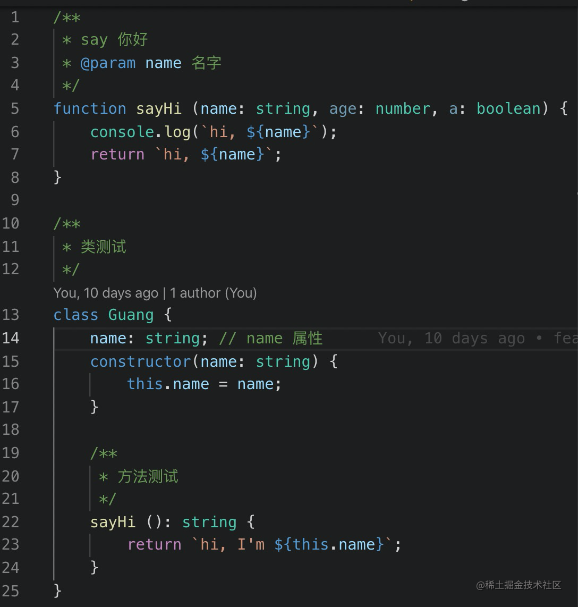
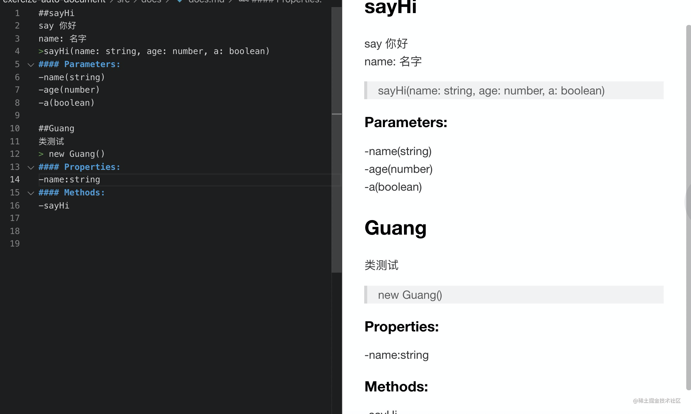

# 18.实战案例:自动生成 API 文档

如果我们提供了一个 sdk 给别人用，那么要把有哪些 api、都有什么参数等等信息写到文档中，并且每次改代码都要同步更新下文档。这件事情很繁琐，靠人来维护也不靠谱，可不可以自动生成呢？

api 文档的生成也是根据源码信息来的，有哪些函数、类、都有啥参数、参数是什么类型，这些都在源码里面，而更多信息一般都会写在注释里。我们可以通过 babel 取到这些信息，那么自然可以自动生成文档。

## 思路分析

比如这样一段代码：
```javascript
/**
 * say 你好
 * @param name 名字
 */
function sayHi (name: string, age: number, a: boolean) {
    console.log(`hi, ${name}`);
    return `hi, ${name}`;
}

/**
 * 类测试
 */
class Guang {
    name: string; // name 属性
    constructor(name: string) {
        this.name = name;
    }

    /**
     * 方法测试
     */
    sayHi (): string {
        return `hi, I'm ${this.name}`;
    }
}
```
我们要处理 FunctionDeclaration 节点和 ClassDelcaration 节点：

可以通过 AST 拿到各种信息，比如：

FunctionDelcaration：

- 函数名： path.get('id').toString()
- 参数： path.get('params')
- 返回值类型： path.get('returnType').getTypeAnnotation()
- 注释信息：path.node.leadingComments

注释可以使用 doctrine 来 parse，支持 @xxx 的解析

ClassDeclaration：

- 类名：path.get('id').toString()
- 方法：travese ClassMethod 节点取信息（包括 constructor 和 method）
- 属性： traverse ClassProperty 节点取信息 
- 注释信息： path.node.leadingComments

有了这些信息之后，就可以打印成文档了，打印就是拼接字符串的过程，可以支持 markdown、html、json 等格式。

我们来写下代码。

## 代码实现

首先搭一个插件的基本结构：

```javascript
const { declare } = require('@babel/helper-plugin-utils');

const autoDocumentPlugin = declare((api, options, dirname) => {
    api.assertVersion(7);

    return {
        pre(file) {
            file.set('docs', []);
        },
        visitor: {
            FunctionDeclaration(path, state) {
            },
            ClassDeclaration (path, state) {
            }
         },
         post(file) {
            const docs = file.get('docs');
        }
    }
}
```
我们在全局的 file 对象中放一个 docs 的数组，用于收集信息。

### FunctionDeclaration 的处理

就像前面说的，通过 AST 可以拿到函数的各种信息：

```javascript
FunctionDeclaration(path, state) {
    const docs = state.file.get('docs');
    docs.push({
        type: 'function',
        name: path.get('id').toString(),
        params: path.get('params').map(paramPath=> {
            return {
                name: paramPath.toString(),
                type: resolveType(paramPath.getTypeAnnotation())
            }
        }),
        return: resolveType(path.get('returnType').getTypeAnnotation()),
        doc: path.node.leadingComments && parseComment(path.node.leadingComments[0].value)
    });
    state.file.set('docs', docs);
},
```

其中要注意的有两点：

- path.getTypeAnnotation() 取到的类型需要做进一步的处理，比如把 TSStringKeyword 换成 string，这样更易读

```javascript
function resolveType(tsType) {
    const typeAnnotation = tsType.typeAnnotation;
    if (!typeAnnotation) {
        return;
    }
    switch (typeAnnotation.type) {
        case 'TSStringKeyword': 
            return 'string';
        case 'TSNumberKeyword':
            return 'number';
        case 'TSBooleanKeyword':
            return 'boolean';
    }
}
```
- 注释信息用 doctrine 来 parse，可以解析注释里的 @xxx 信息

```javascript
const doctrine = require('doctrine');

function parseComment(commentStr) {
    if (!commentStr) {
        return;
    }
    return doctrine.parse(commentStr, {
        unwrap: true
    });
}
```
### ClassDeclaration 的处理

ClassDeclaration 的处理复杂一些，要分别提取 constructor、method、properties 的信息。

首先，收集 class 的整体信息

```javascript
ClassDeclaration (path, state) {
    const docs = state.file.get('docs');
    const classInfo = {
        type: 'class',
        name: path.get('id').toString(),
        constructorInfo: {},
        methodsInfo: [],
        propertiesInfo: []
    };
    if (path.node.leadingComments) {
        classInfo.doc = parseComment(path.node.leadingComments[0].value);
    }
    docs.push(classInfo);
    state.file.set('docs', docs);
}
```
然后遍历 ClassProperty 和 ClassMethod 并提取信息

```javascript
path.traverse({
    ClassProperty(path) {
        classInfo.propertiesInfo.push({
            name: path.get('key').toString(),
            type: resolveType(path.getTypeAnnotation()),
            doc: [path.node.leadingComments, path.node.trailingComments].filter(Boolean).map(comment => {
                return parseComment(comment.value);
            }).filter(Boolean)
        })
    },
    ClassMethod(path) {
        if (path.node.kind === 'constructor') {
            classInfo.constructorInfo = {
                params: path.get('params').map(paramPath=> {
                    return {
                        name: paramPath.toString(),
                        type: resolveType(paramPath.getTypeAnnotation()),
                        doc: parseComment(path.node.leadingComments[0].value)
                    }
                })
            }
        } else {
            classInfo.methodsInfo.push({
                name: path.get('key').toString(),
                doc: parseComment(path.node.leadingComments[0].value),
                params: path.get('params').map(paramPath=> {
                    return {
                        name: paramPath.toString(),
                        type: resolveType(paramPath.getTypeAnnotation())
                    }
                }),
                return: resolveType(path.getTypeAnnotation())
            })
        }
    }
});
```
这样处理完之后，在 post 阶段就能拿到所有的信息了，之后就是文档的生成

### 文档生成

文档生成其实就是对象打印的过程，我们可以通过插件的参数传入 format，然后用不同的 renderer 来渲染，之后写入 docs 目录。

```javascript
post(file) {
    const docs = file.get('docs');
    const res = generate(docs, options.format);
    fse.ensureDirSync(options.outputDir);
    fse.writeFileSync(path.join(options.outputDir, 'docs' + res.ext), res.content);
}
```

renderer 其实就是拼接字符串，我们实现一下 markdown 的（比较简单的实现，大家如果有需求需要继续完善 renderer 和信息的提取，其实这里也可以用模版引擎来做，更易于维护）

function 和 class 分别拼接不同的字符串
```javascript
module.exports = function(docs) {
    let str = '';

    docs.forEach(doc => {
        if (doc.type === 'function') {
            str += '##' + doc.name + '\n';
            str += doc.doc.description + '\n';
            if (doc.doc.tags) {
                doc.doc.tags.forEach(tag => {
                    str += tag.name + ': ' + tag.description + '\n'; 
                })
            }
            str += '>' + doc.name + '(';
            if (doc.params) {
                str += doc.params.map(param => {
                    return param.name + ': ' + param.type;
                }).join(', ');
            }
            str += ')\n';
            str += '#### Parameters:\n';
            if (doc.params) {
                str += doc.params.map(param => {
                    return '-' + param.name + '(' + param.type + ')';
                }).join('\n');
            }
            str += '\n'
        } else if (doc.type === 'class'){
            str += '##' + doc.name + '\n';
            str += doc.doc.description + '\n';
            if (doc.doc.tags) {
                doc.doc.tags.forEach(tag => {
                    str += tag.name + ': ' + tag.description + '\n'; 
                })
            }
            str += '> new ' + doc.name + '(';
            if (doc.params) {
                str += doc.params.map(param => {
                    return param.name + ': ' + param.type;
                }).join(', ');
            }
            str += ')\n';
            str += '#### Properties:\n';
            if (doc.propertiesInfo) {
                doc.propertiesInfo.forEach(param => {
                    str += '-' + param.name + ':' + param.type + '\n';
                });
            }
            str += '#### Methods:\n';
            if (doc.methodsInfo) {
                doc.methodsInfo.forEach(param => {
                    str += '-' + param.name + '\n';
                });
            }
            str += '\n'
        }
        str += '\n'
    })
    return str;
}
```

这样我们就完成了 api 文档的自动生成。

## 测试

处理的代码为：



生成的文档：



可以继续完善，比如生成这样的 html 文档：


## 总结

这一节我们梳理了自动生成 api 文档的实现思路，如果对外提供 sdk 的话，那么自动文档生成是个刚需，不然每次都要人工同步改。

自动文档生成主要是信息的提取和渲染两部分，提取源码信息我们只需要分别处理 ClassDeclaration、FunctionDeclaration 或其他节点，然后从 ast 取出名字、注释等信息，之后通过 renderer 拼接成不同的字符串。

其实这种工具的应用有很多的，各种语言都有。

（代码在[这里](https://github.com/QuarkGluonPlasma/babel-plugin-exercize)，建议 git clone 下来通过 node 跑一下）