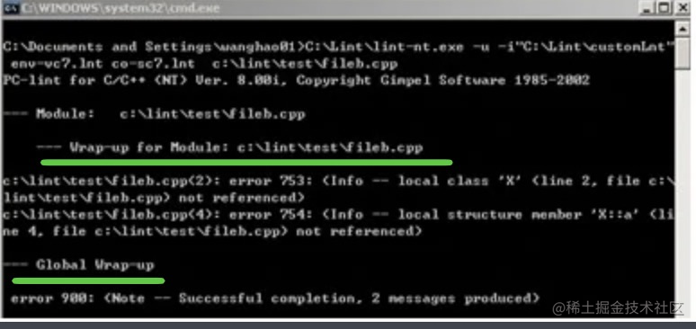
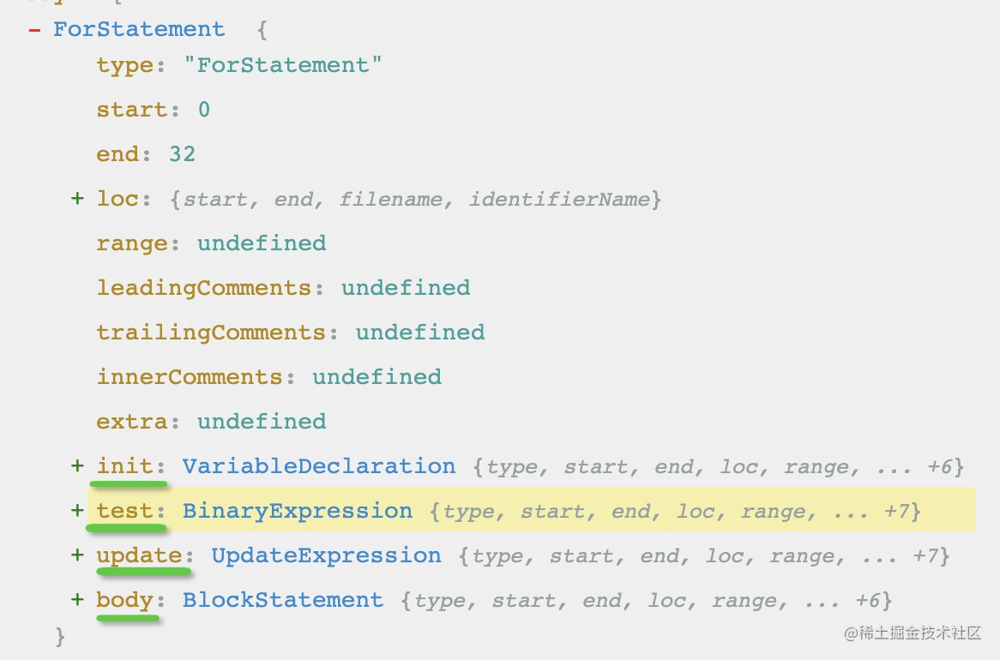
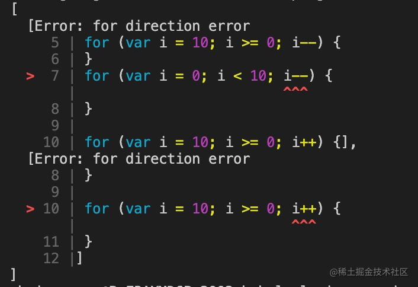
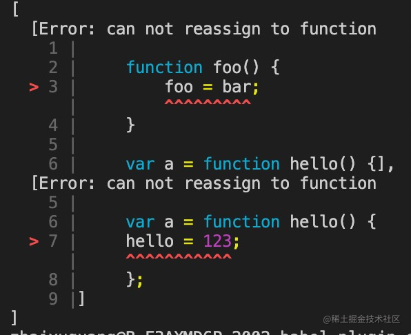
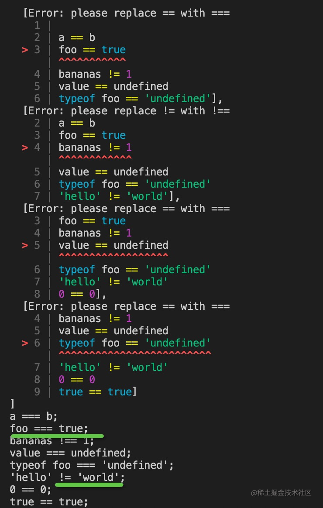
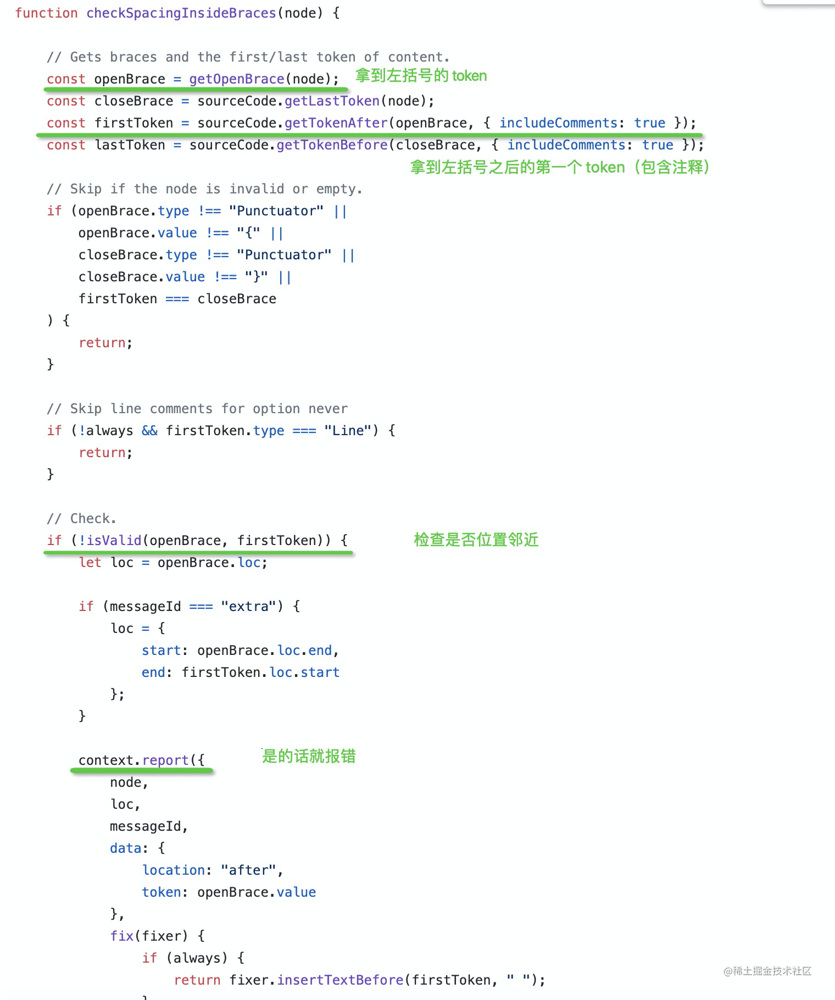

# 19.实战案例: Linter

lint 是什么？ 维基百科中是这样说的

> 在计算机科学中，lint是一种工具程序的名称，它用来标记源代码中，某些可疑的、不具结构性的段落。它是一种静态程序分析工具，最早适用于C语言，在UNIX平台上开发出来。后来它成为通用术语，可用于描述在任何一种计算机程序语言中，用来标记源代码中有疑义段落的工具。




lint 其实是 c 语言中的一个工具，在 1979 年由贝尔实验室发布的。它是通过静态分析代码来检查错误的工具。后来各领域的类似工具都叫做 xx lint。比如前端领域的 eslint、stylelint 等。


lint 通过静态分析源码，对 AST 进行检查，发现其中的一些代码结构的错误，或者代码格式的错误。

代码结构的错误包括两种情况： 代码有逻辑或者语法错误，代码没错误但是不符合代码规范；

代码格式的错误则是：代码结构是对的，但是空格、换行等格式不对。

这些都需要进行 lint。

> 静态分析：静态分析不会运行代码，而是通过编译的方式来分析源代码。它的目的不是为了生成目标代码，而是为了提取一些想要的信息，这是和编译的不同之处。

parse 成 AST，对 AST 进行检查，这个事情用 babel 也可以做，这节我们就用 babel 写一个 lint 插件。

## 检查出错误的代码

代码的错误写法可能很多，就像 eslint 有一系列的 rule，我们只挑两个来实现。

### 错误的 for direction

``` javascript
for (var i = 0; i < 10; i--) {
}

for (var i = 10; i >= 0; i++) {
}
```
上面两种代码遍历方向是错误的，会导致死循环。而开发者写代码的时候一个不注意就有可能写错了，我们希望静态分析出这种错误代码，并进行编译时报错。

#### 思路分析

for 语句的 AST 是 ForStatement，我们在 [astexplorer.net](https://astexplorer.net/#/gist/205be27234373fb4fabfdea74a0fbd84/a637e8eaad728f049da54ccf51dedc9237b66f96) 中来查看一下它的结构




init 部分是一个变量声明语句 VariableDeclaration。

test 部分是一个二元表达式 BinaryExpression，operator 属性为 <。

update 部分是一个一元表达式 UpdateExpression，operator 属性为 --。

body 部分是块语句 BlockStatement。

**我们的目标是检查出遍历方向是否和终止条件的判断一致，也就是说当 update 为 ++ 时，test 应为为 <、<=；当 update 为 -- 时，test 应为 >、>=。如果不一致就报错。**

#### 代码实现


首先，对 ForStatement 的 update 和 test 做检查，如果不一致就报错。
```javascript
visitor: {
    ForStatement(path, state) {
        const testOperator = path.node.test.operator
        const udpateOperator = path.node.update.operator;

        let sholdUpdateOperator;
        if (['<', '<='].includes(testOperator)) {
            sholdUpdateOperator = '++';
        } else if (['>', '>='].includes(testOperator)) {
            sholdUpdateOperator = '--';
        }

        if (sholdUpdateOperator !== udpateOperator) {
            // 报错：遍历方向错误
        }
    }
}
```
报错我们使用 path 的 buildCodeFrameError 方法，他会构造一个 code frame，标记出当前 node 的位置。（第一个参数是错误信息，第二个参数是 Error 对象）
```javascript
throw path.get('update').buildCodeFrameError("for direction error", Error);
```
这样，当发现 for 的遍历方向错误的时候就会报错：


这个报错有点丑，而且也不应该直接 throw，我们改进一下：

- 设置 Error.stackTraceLimit 为 0 ，这样可以去掉 stack 的信息
- 把错误信息收集在全局 file 对象中，在 post 阶段去集中打印错误

```javascript
const { declare } = require('@babel/helper-plugin-utils');

const forDirectionLint = declare((api, options, dirname) => {
    api.assertVersion(7);

    return {
        pre(file) {
            file.set('errors', []);
        },
        visitor: {
            ForStatement(path, state) {
                const errors = state.file.get('errors');
                const testOperator = path.node.test.operator
                const udpateOperator = path.node.update.operator;

                let sholdUpdateOperator;
                if (['<', '<='].includes(testOperator)) {
                    sholdUpdateOperator = '++';
                } else if (['>', '>='].includes(testOperator)) {
                    sholdUpdateOperator = '--';
                }

                if (sholdUpdateOperator !== udpateOperator) {
                    const tmp = Error.stackTraceLimit;
                    Error.stackTraceLimit = 0;
                    errors.push(path.get('update').buildCodeFrameError("for direction error", Error));
                    Error.stackTraceLimit = tmp;
                }
            }
        },
        post(file) {
            console.log(file.get('errors'));
        }
    }
});
```
这样，当输入的代码如下时：
```javascript
for (var i = 0; i < 10; i++) {
}

for (var i = 10; i >= 0; i--) {
}
for (var i = 0; i < 10; i--) {
}

for (var i = 10; i >= 0; i++) {
}
```
会打印报错：



这样，我们就完成了第一个 lint 插件，它可以检查出代码中循环语句遍历方向的错误。
### 函数不能重新赋值

``` javascript
function foo() {}
// xxx
foo = 'guang';
// xxx
foo();

```
函数声明之后有可能被重新赋值，因为函数支持 FunctionDeclaration 和 FunctionExpression 两种方式声明，而第二种声明方式就是赋值语句的形式。
```javascript
function guang(){}   // FunctionDeclaration
const ssh = function () {} // FunctionExpression
```

但是我们通常情况下只希望声明一次，不希望之后被修改，这时候就要通过静态分析找出修改的地方，然后报错。

#### 思路分析

要处理的是赋值表达式，对应的 AST 是 AssignmentExpression（赋值表达式可以独立作为语句，构成表达式语句 ExpressionStatement），要判断 left 属性是否引用的是一个函数。 

获取变量的引用需要用 path.scope.getBinding 的 api，从作用域中查找 binding，然后判断声明的节点是否是一个 FunctionDeclaration 或 FunctionExpression。如果是，说明对函数进行了重新赋值，就报错。

#### 代码实现

```javascript
const { declare } = require('@babel/helper-plugin-utils');

const noFuncAssignLint = declare((api, options, dirname) => {
    api.assertVersion(7);

    return {
        pre(file) {
            file.set('errors', []);
        },
        visitor: {
            AssignmentExpression(path, state) {
                const errors = state.file.get('errors');
 
                const assignTarget = path.get('left').toString()；
                const binding = path.scope.getBinding(assignTarget);
                if (binding) {
                    // 查找到了左值对应的声明，是函数声明
                    if (binding.path.isFunctionDeclaration() || binding.path.isFunctionExpression()) {
                        const tmp = Error.stackTraceLimit;
                        Error.stackTraceLimit = 0;
                        errors.push(path.buildCodeFrameError('can not reassign to function', Error));
                        Error.stackTraceLimit = tmp;
                    }
                }
            }
        },
        post(file) {
            console.log(file.get('errors'));
        }
    }
});
```
当输入为：
```javascript
function foo() {
    foo = bar;
}

var a = function hello() {
    hello = 123;
};
```
效果如下：



会对赋值给函数的语句报错，而其他赋值语句不会报错。

## 检查出没有错误但不符合规范的代码

需要 lint 的可能是代码的错误，但有的时候代码没有错误，只是不符合我们的规范，这种也要检查。比如 == 和 === 的使用。

### 用 === 代替 ==

== 则只比较值，如果类型不一样会尝试自动类型转换， 而 === 运算符会同时比较类型和值，不会进行类型转换。

```javascript
'' == false // true
'' === false // false
```
显然，用 === 运算符更安全一些，所以我们会把它作为代码规范，lint 的时候做检查。

### 思路分析

处理的目标是 BinaryExpression，当 operator 为 == 或者 != 的时候，就进行报错并自动修复（修改 operator 的值为 === 或 !==）。但要排除一种情况：左值和右值类型都为 Literal（字面量）且值的类型也一样，比如 `'guang' == 'ssh'`，两边都是字面量类型，而且类型是一样的，就没必要转成 === 了。


### 代码实现
```javascript
const { declare } = require('@babel/helper-plugin-utils');

const forDirectionLint = declare((api, options, dirname) => {
    api.assertVersion(7);

    return {
        pre(file) {
            file.set('errors', []);
        },
        visitor: {
            BinaryExpression(path, state) {
                const errors = state.file.get('errors');
                if (['==', '!='].includes(path.node.operator)) {
                    const left = path.get('left');
                    const right = path.get('right');
                    // 如果两边都是字面量且值的类型一样
                    if (!(left.isLiteral() && right.isLiteral() 
                    && typeof left.node.value === typeof right.node.value)) {
                        const tmp = Error.stackTraceLimit;
                        Error.stackTraceLimit = 0;
                        errors.push(path.buildCodeFrameError(`please replace ${path.node.operator} with ${path.node.operator + '='}`, Error));
                        Error.stackTraceLimit = tmp;
                        // 自动修复
                        if (state.opts.fix) {
                            path.node.operator = path.node.operator + '=';
                        }
                    }
                }
            }
        },
        post(file) {
            console.log(file.get('errors'));
        }
    }
});
```
这里特殊的地方就是支持自动 fix。eslint 可以通过 --fix 来自动修复一些 rule 的报错，我们也可以做到，因为我们知道怎么修改把 AST 修改成正确的，当用户指定了 fix 参数的时候，就可以自动进行修复。

我们来测试一下这个插件：

```javascript
const { transformFromAstSync } = require('@babel/core');
const  parser = require('@babel/parser');
const eqLintPlugin = require('./plugin/eq-lint');

const sourceCode = `
a == b
foo == true
bananas != 1
value == undefined
typeof foo == 'undefined'
'hello' != 'world'
0 == 0
true == true
`;

const ast = parser.parse(sourceCode, {
    sourceType: 'unambiguous'
});

const { code } = transformFromAstSync(ast, sourceCode, {
    plugins: [[eqLintPlugin, {
        fix: true
    }]],
});

console.log(code);
```
结果如下：




可以看到，正确识别出了 == 和 != 的 BinaryExprssion，并且只对需要转换的进行了自动的修复。

## 检查出格式不对的代码

上面的两种情况都是代码结构有错误，而对于代码格式的错误我们同样需要 lint。

比如下面一段代码
```
function foo() {return true;}
```
在函数体的大括号内侧没有空格，规范的格式应该是要有空格。
```
function foo() { return true; }
```
我们怎么校验这种错误呢？

我们去看看 eslint 是怎么做的：

1. 拿到函数体的左括号的 token
2. 拿到左括号后的第一个 token
3. 对比下两个 token 的位置，如果不在同一行，或者之间有空格就是符合规范的。




但是，babel 并没有获取 AST 关联的 token 的 api，只能获取关联的 comments，通过 leadingComments、tailingComments、innerComments 这三个属性。

所以，babel 无法做这种校验。我们在 js parser 的历史那一节讲过 eslint 有自己的 parser：espree，espree 就做了 AST 和对应的 comments、token 的关联，它做代码格式的检查需要这样的能力。

babel 只提供了关联 comments 的能力，我们可以通过 path.addComment('leading', '@\_\_PURE\_\_', false) 来在节点前添加一个块注释，因为 babel 转译的结果可能还要交给 terser 来压缩，可以通过这样的方式来标识一个函数是无副作用的，如果没有用到就可以放心的删除。


关于为什么 babel 修复不了格式，而 eslint 可以的详细原因可以看这篇文章：[为什么 Eslint 可以检查和修复代码格式，而 Babel 不可以？](https://juejin.cn/post/7054418132491829279)


## 总结

这一节，我们从 lint 这个历史悠久的 c 语言的静态检查工具聊起，介绍了 eslint、stylelint，它们都是通过静态分析的方式发现代码中的错误，当然要 lint 的除了错误，还有规范和格式。

后面我们分别实现了错误的 for 迭代方向、函数重新赋值、替换 == 为 === 等 lint，并支持了 fix。 之后分析了为啥 babel 做不到像 eslint 一样的代码格式的校验和修复，了解了 babel parser（babylon）和 espree 的区别。

lint 工具要分析和修复代码都是基于 AST 的，只不过 babel 没有提供 token 相关的 api，能够检查和修复逻辑错误，但检查和修复不了格式错误。

eslint 也有插件，也是通过 AST 的方式实现检查和修复。

所以，想做 lint 还是用 eslint 吧。

（代码在[这里](https://github.com/QuarkGluonPlasma/babel-plugin-exercize)，建议 git clone 下来通过 node 跑一下）


