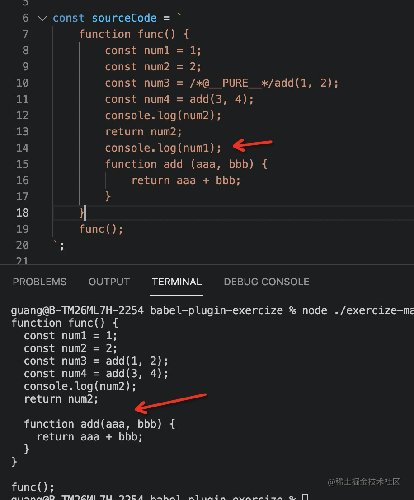
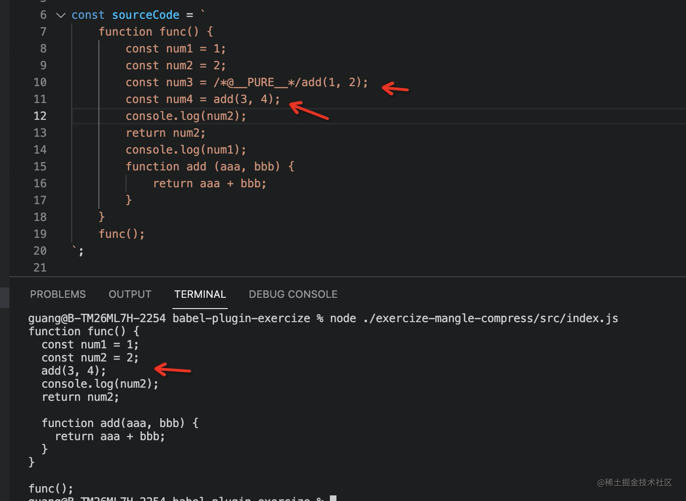
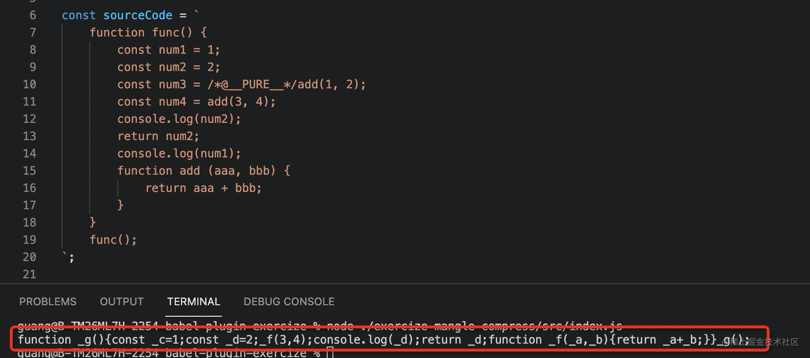

# 21.实战案例: 压缩混淆

压缩混淆工具是前端必用的工具之一，代码在上线之间需要经过压缩来减小体积，并且会做一些简单的混淆来防止源码直接泄漏。前端工程师可能每天都在用这种工具，可你有想过它的实现原理么？

代码的压缩和混淆都是对代码做转换，但是转换前后要保持语义一致，就是不能转完之后代码逻辑改变了。

之所以能做这些转换是因为计算机执行代码并不需要换行、也不需要变量名多么易懂，那都是给人看的，可以简化掉，而且有的不会被执行到的代码也可以删掉。压缩和混淆就是分析代码中的这种代码，进行分析和转换，达到转换前后执行逻辑一致，但是代码体积更小、可读性更差的目的。

我们分别来实现一下压缩和混淆。

## 混淆

### 思路分析

混淆就是把代码变得难以阅读，让怀有恶意目的的人很难通过代码理清逻辑，但是不能改变执行的结果。要做等价转换。

这种转换包括两方面：

- 名字转换。变量名、函数名这些我们会注意命名要有含义，但是编译后的代码就不需要了，可以把各种 identifier 的 name 重命名为没有含义的 abcd，修改作用域中某个变量的名字，同时还要修改用到它的地方，这个可以通过 path.scope.rename 的 api。

- 逻辑转换。if 的逻辑可以用 switch 来代替，for 的逻辑可以用 while 来代替，这都是等价的，把一种方式实现的代码转成另一种等价的形式就可以达到混淆的目的。做混淆工具主要是要找到这种等价的变化，而且后者一定要特别复杂难以分析，然后实现这种转换，就达到了混淆的目的。

这里我们只实现下名字的混淆。

目的是为了找出所有的声明，那就要遍历所有会生成作用域的节点，包括 FunctionDeclaration、BlockStatement 等，而这些节点有一个别名，叫 Scopable（所有的别名可以在[这里](https://github.com/babel/babel/blob/main/packages/babel-types/src/ast-types/generated/index.ts#L2489-L2535)查，详见第七节），然后对每一个声明（binding）都重命名为无意义的名字，并且更新所有引用这个声明的地方，这个逻辑在 path.scope.rename 已经实现了，直接调用这个 api 即可。

### 代码实现

依然先写好插件的结构：

```javascript
const { declare } = require('@babel/helper-plugin-utils');

const mangle = declare((api, options, dirname) => {
    api.assertVersion(7);

    return {
        pre(file) {
            file.set('uid', 0);
        },
        visitor: {
            Scopable: {
               
            }
        }
    }
});

module.exports = mangle;
```
这里在 file 放了一个 uid 是为了获取唯一 id 的，后面会用到。

我们基于这个 uid 来获取唯一的名字，因为不能以数字开头，所以用 A-Z、a-z、$ 和 _ 这 54 个字符来生成。

根据传入的 num 来取对应下标的字符组成字符串：
```javascript
const base54 = (function(){
    var DIGITS = "abcdefghijklmnopqrstuvwxyzABCDEFGHIJKLMNOPQRSTUVWXYZ$_";
    return function(num) {
            var ret = "";
            do {
                    ret = DIGITS.charAt(num % 54) + ret;
                    num = Math.floor(num / 54);
            } while (num > 0);
            return ret;
    };
})();
```
然后就是替换所有的声明（binding） 的名字了：

首先取出 path.scope.bindings，遍历每一个 binding，然后通过 rename 的 api 来进行改名。

并且处理过后的声明加个标记，再次处理到的时候就跳过。

```javascript
Scopable: {
    exit(path, state) {
        let uid = state.file.get('uid');
        Object.entries(path.scope.bindings).forEach(([key, binding]) => {
            if(binding.mangled) return;
            binding.mangled = true;
            const newName = path.scope.generateUid(base54(uid++));
            binding.path.scope.rename(key, newName)
        });
        state.file.set('uid', uid);
    }
}
```

试下效果，当输入代码为：

```javascript
function func() {
    const num1 = 1;
    const num2 = 2;
    const num3 = /*@__PURE__*/add(1, 2);
    const num4 = add(3, 4);
    console.log(num2);
    return num2;
    console.log(num1);
    function add (aaa, bbb) {
        return aaa + bbb;
    }
}
func();
```
输出为：


至此，我们实现了变量名的混淆！

## 压缩

压缩就是要去掉代码中执行不到的部分，比如 return 语句后的一些语句和没有意义的部分，包括注释、换行等。

基于 AST 的转换做压缩要处理的情况特别多，这里我们只实现两种情况的压缩：

- 删除 return 之后的不会执行到的语句
- 删除没有被使用的变量声明（死代码删除 Dead Code Elemation，简称 DCE）

### 删除 return 之后的语句

#### 思路分析

删除 return 之后的语句，就是要找到函数声明 FunctionDeclaration 的函数体，遍历一遍 body 的 AST，如果是 return 之后就打个标记之后删除。

但是要注意，return 之后是可以有函数声明的，会做变量提升，还有如果是 var 声明的变量，也会做提升，所以要去掉这两种情况。

#### 代码实现

拿到 BlockStatement 的 body 中的每一个节点，如果是在 return、throw 等语句之后，就准备删除，但是要排除函数声明语句和 var 的变量声明语句。

```javascript
BlockStatement(path) {
    const statementPaths = path.get('body');
    let purge = false;
    for (let i = 0; i < statementPaths.length; i++) {

        if (statementPaths[i].isCompletionStatement()) {
            purge = true;
            continue;
        }

        if (purge && !canExistAfterCompletion(statementPaths[i])) {
            statementPaths[i].remove();
        } 
    }
}
```

这里的 CompletionStatement 可以通过前面提到的 alias 来查， CompletionStatement 也是一个别名。


然后判断是否可以删除的 canExistAfterCompletion 方法是：

```javascript
function canExistAfterCompletion(path) {
    return path.isFunctionDeclaration() || path.isVariableDeclaration({
        kind: "var"
    });
}
```

测试下效果：



这样就达到了删除不会执行到的代码的目的。

### 删除没被使用的变量声明

#### 思路分析

变量声明也就是 path.scope 中的 binding，可以通过  references 的数量或者 referenced 是否是 true 来判断是否被引用，如果没有被引用，那么就可以删除。

但是这里也有种特殊情况，就是如果初始化的值是函数调用，那么就不能直接删除，因为可能有副作用，比如：

```javascript
function a {
    console.log('a');
    return 'aa';
}

const b = a();
```
这里的 b 没有被用到，但是这个 a() 的函数调用却不能直接删除，因为是有副作用的，只能转成这种：

```javascript
function a {
    console.log('a');
    return 'aa';
}

a();
```
只把声明的变量去掉，但是保留函数调用语句。

那么如果该节点确实没有副作用怎么办呢？

babel 提供了一个 path.scope.isPure 的 api，可以判断一些 AST 节点是否是纯的，也就是是否是没有副作用的，可以判断各种 AST 是否可以放心的删除。

但是函数调用他是分析不了的，可以采用 terser 的方案，通过注释来标注纯函数。

大家可能见到过这样的代码：

```javascript
 /*#__PURE__*/ React.creatElement('div');
```
这里的 pure 注释就是告诉 terser 这个函数没有副作用，如果没用到就直接删除就行。

我们这里也采用相同的方案，如果函数调用之前有 PURE 注释，则直接删除，否则保留。

#### 代码实现

首先拿到每一个 binding，判断下有没有被引用。

如果没有被引用，那就判断下初始化值是否是函数调用语句，如果是，还要判断有没有 PURE 的注释，有就直接删。

然后用 isPure 判断节点是否是没有副作用的，比如 StringLiteral、Identifer 这种就没副作用，可以直接删除。否则就保留右边的部分，把声明删除。

```javascript
Scopable(path) {
      Object.entries(path.scope.bindings).forEach(([key, binding]) => {
            if (!binding.referenced) {//没有被引用
                if (binding.path.get('init').isCallExpression()) {
                    const comments = binding.path.get('init').node.leadingComments;//拿到节点前的注释
                    if(comments && comments[0]) {
                        if (comments[0].value.includes('PURE')) {//有 PURE 注释就删除
                            binding.path.remove();
                            return;
                        }
                    }
                }
                if (!path.scope.isPure(binding.path.node.init)) {//如果是纯的，就直接删除，否则替换为右边部分
                    binding.path.parentPath.replaceWith(api.types.expressionStatement(binding.path.node.init));
                } else {
                    binding.path.remove();
                }
            }
        });
    }
}
```

试下效果：




如图，num3 和 num4 都没有被使用，但是 num3因为标记了 PURE，所以当作纯函数删除了，而 num4 则保留了该函数调用。

## 效果演示

我们把压缩和混淆的功能整体跑一下:
```javascript
const { transformFromAstSync } = require('@babel/core');
const  parser = require('@babel/parser');
const manglePlugin = require('./plugin/mangle');
const compressPlugin = require('./plugin/compress');

const sourceCode = `
    function func() {
        const num1 = 1;
        const num2 = 2;
        const num3 = /*@__PURE__*/add(1, 2);
        const num4 = add(3, 4);
        console.log(num2);
        return num2;
        console.log(num1);
        function add (aaa, bbb) {
            return aaa + bbb;
        }
    }
    func();
`;

const ast = parser.parse(sourceCode, {
    sourceType: 'unambiguous',
    comments: true
});

const { code } = transformFromAstSync(ast, sourceCode, {
    plugins: [
        [manglePlugin], 
        [compressPlugin]
    ],
    generatorOpts: {
        comments: false,
        compact: true
    }
});
console.log(code);
```

通过 generaotrOpts 来让 generator 去掉 comments、去掉空格。

效果如下：




## 总结

压缩混淆也是对代码做转换，但是做的是等价转换，变量名换成无意义的名字，代码结构转成更难读但是执行效果一样的形式，没用到的代码（return 后的、没被引用的声明）删除掉。等等。

具体的 case 可能很多，但是思路和目的都是一致的，就是在等价的前提下，让代码体积更小，可读性更差。

有些要对代码做保护的场景是要自己做混淆的实现的，就是要找各种等价的形式，然后实现转换。除了这个之外，了解压缩混淆的原理也可以让我们更好的使用类似工具，比如 terser。

（代码在[这里](https://github.com/QuarkGluonPlasma/babel-plugin-exercize)，建议 git clone 下来通过 node 跑一下）


