# 25.如何调试 Babel 源码？

这节我们来调试下 Babel 源码，很多疑问大家就可以自己 debug 源码来解决了。

我们知道，Babel 的 API 是这样用的：

```javascript
const parser = require('@babel/parser');
const traverse = require('@babel/traverse').default;
const generate = require('@babel/generator').default;

const source = `
    (async function() {
        console.log('hello guangguang');
    })();
`;

const ast = parser.parse(source);

traverse(ast, {
    StringLiteral(path) {
        path.node.value = path.node.value.replace('guangguang', 'dongdong')
    }
});

const { code, map} = generate(ast, {
    sourceMaps: true
});

console.log(code);
console.log(JSON.stringify(map));
```

parse、traverse、generate 三个步骤。

traverse 过程中要声明对什么 AST 做什么修改， AST 可以在 [astexplorer.net](https://www.astexplorer.net/#/gist/228d4ae6991065e13d9efe353ade9e6c/2772707aa4a88cf45ffa2a5cf24ad4db8bca1451) 来查看。

比如可以看到这部分是 StringLiteral 字符串字面量，修改它的 value 即可。

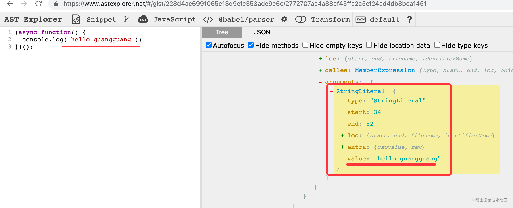

我们安装依赖之后跑一下：

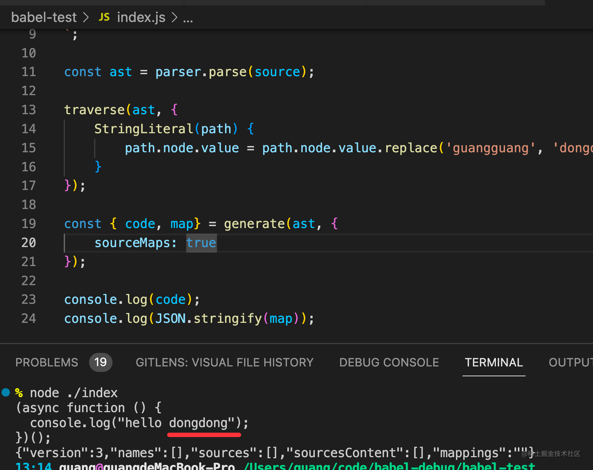

可以看到打印了修改以后的代码和 sourcemap。

我们的目标不是学怎么用 Babel 的 api，而是学怎么调试它的源码。

接下来我们创建个调试配置：

点击这里快速创建 launch.json 调试配置文件：

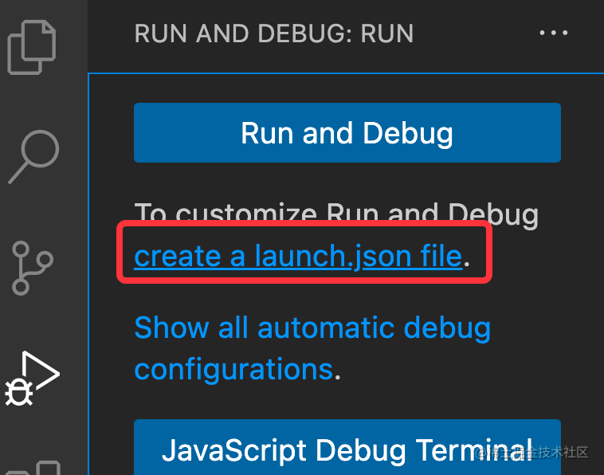

点击 add configuration 创建一个 nodejs 的调试配置：

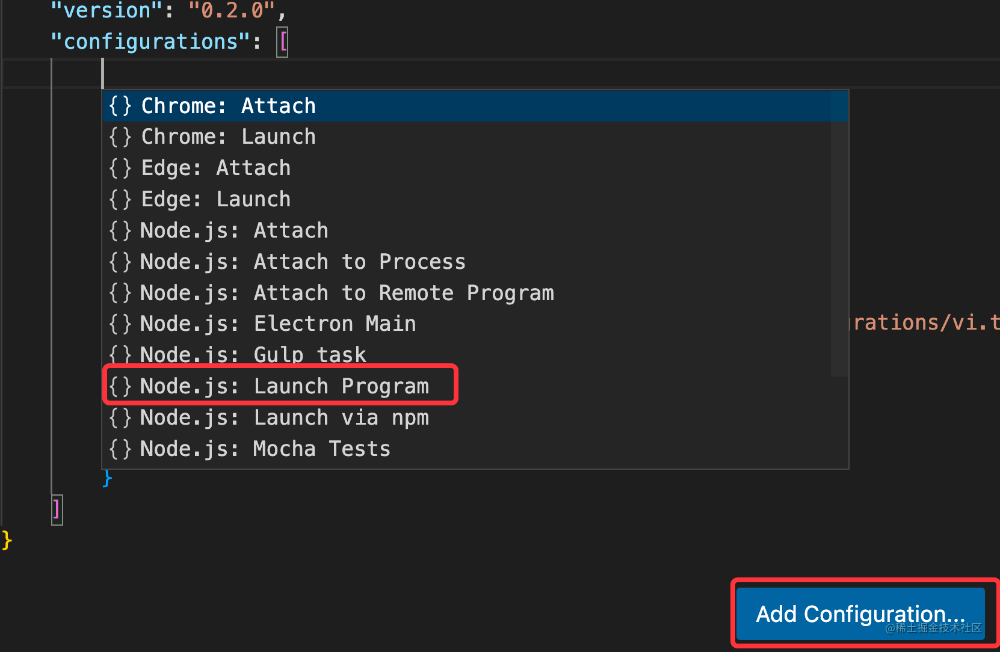

设置 console 为内置的 terminal：

```json
{
    "type": "node",
    "request": "launch",
    "name": "Launch Program",
    "skipFiles": [
        "<node_internals>/**"
    ],
    "console": "integratedTerminal",
    "program": "${workspaceFolder}/index.js"
}
```

这样日志是输出在集成的 Terminal 里的，不然输出在 Debug Console，颜色之类的信息就都没了。

打几个断点，然后跑调试：

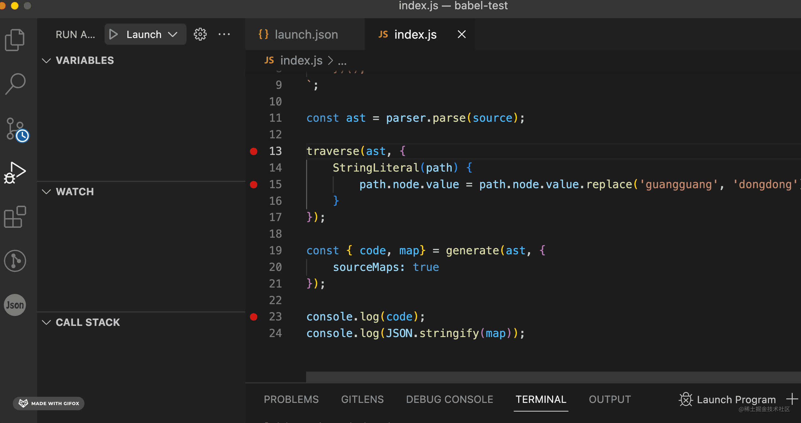

可以看到 parse 之后的 AST，遍历修改时的节点，生成的目标代码。

然后我们进入这几个包内部看下源码。

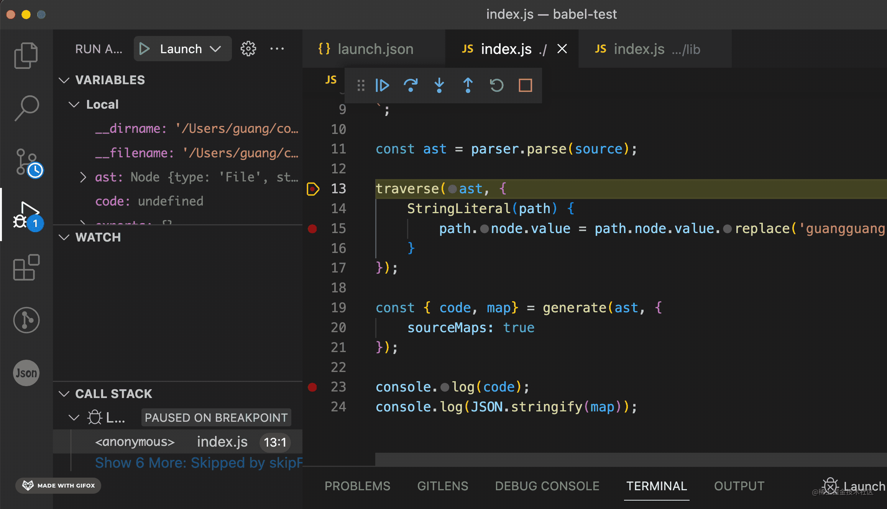

你会发现调试的是这几个包编译之后的代码：


如果有 generator、async await 之类的，调试编译后的代码根本绕不明白。

怎么调试最初的源码呢？

sourcemap！

但是你去 node_modules 下看下这些包，会发现它们已经有 sourcemap 了，而且也关联了：

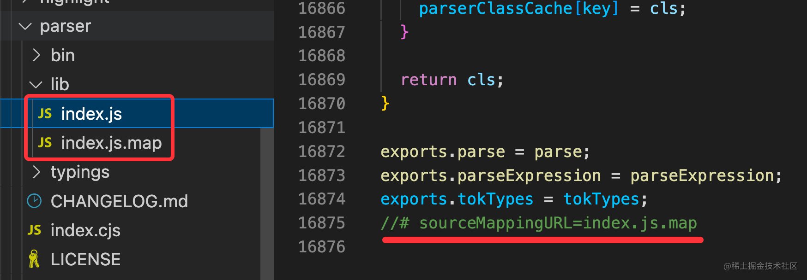

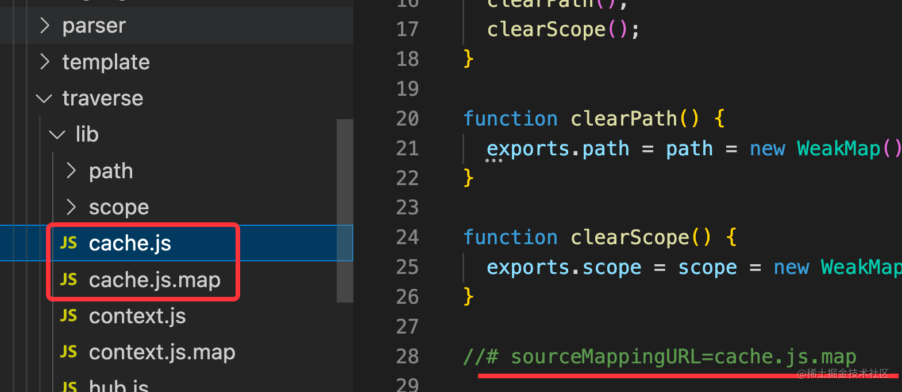

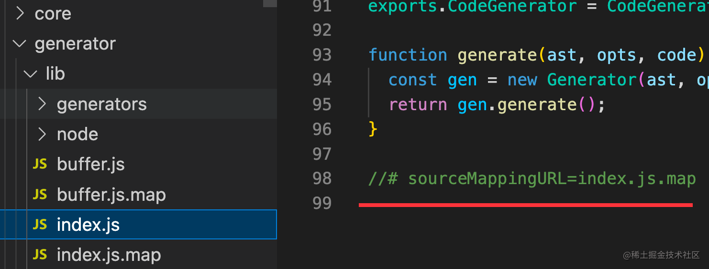

那为什么调试的时候调试的不是源码呢？

这是因为 VSCode 的一个默认配置导致 sourcemap 不会生效。

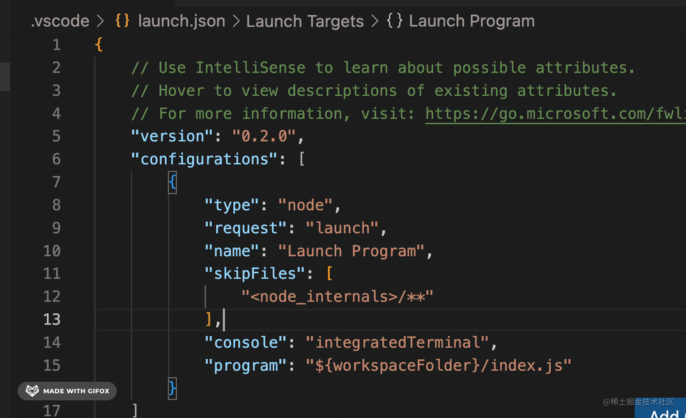

resolveSourceMapLocations 是配置去哪里查找 sourcemap，VSCode Node Debugger 默认不会查找 node_modules 下的 sourcemap。

所以就算 babel 的包里带了 sourcemap 也不会生效。

把它去掉之后再跑一下：

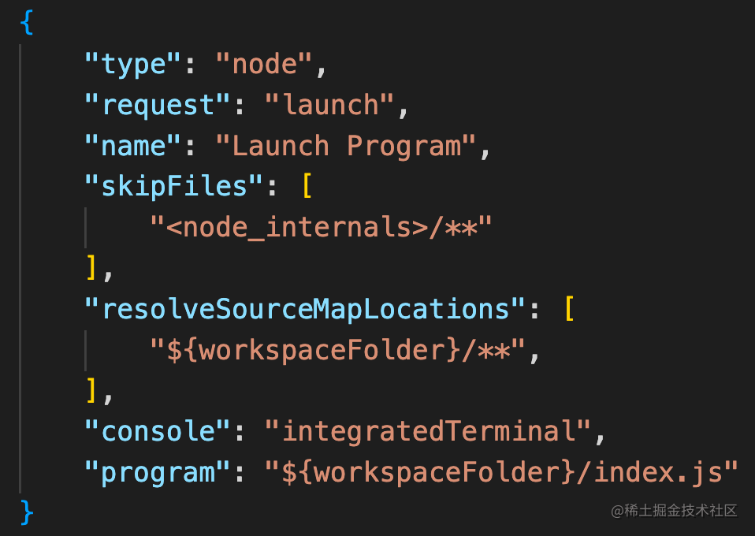

你会发现现在调试的就是 babel 的 ts 源码了。

直接调试可读性更强的 ts 源码，理清它的实现逻辑就简单很多了。

而且，你还可以更进一步，调试 babel 源码的时候让 VSCode 直接定位到源码的目录：

这个只要 sourcemap 到的文件路径在当前 workspace 下就行。

看下现在的路径：

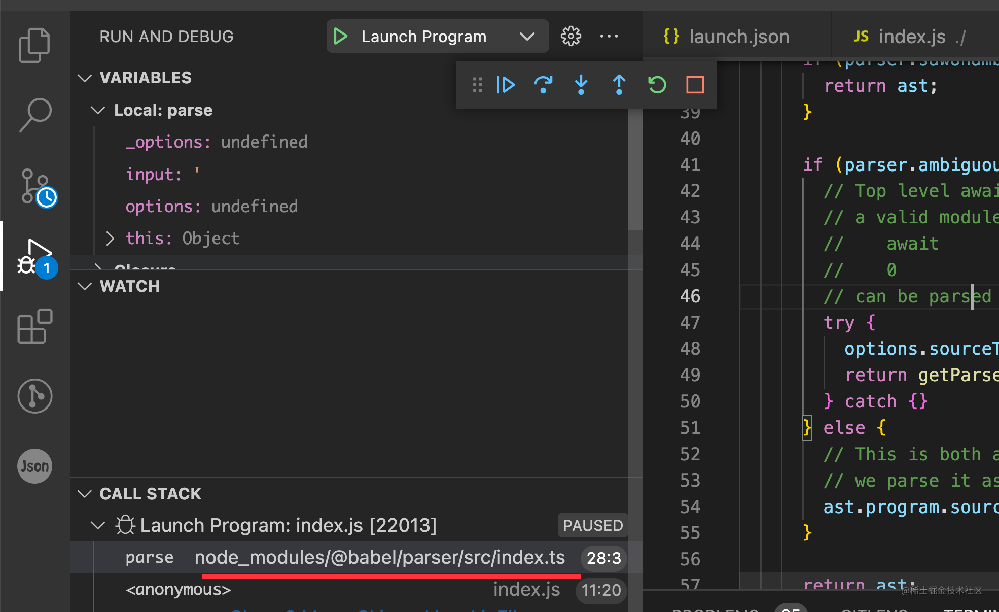

虽然调试的是源码的 ts 了，但是路径是 node_modules 包下的。

我们可以把 babel 项目下下来和测试项目放在一个 workspace 下：

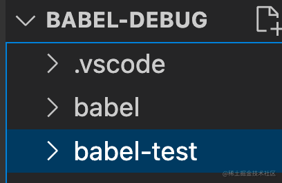

然后去 node_modules 下手动替换下 sourcemap 的 sources 路径：

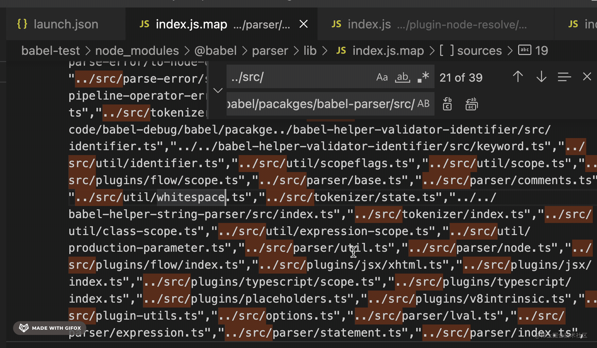

我这里是把 ../src/ 替换成了 /Users/guang/code/babel-debug/babel/packages/babel-parser/src/

然后在新的 workspace 创建个调试配置，这时目录改了，要指定下 cwd：

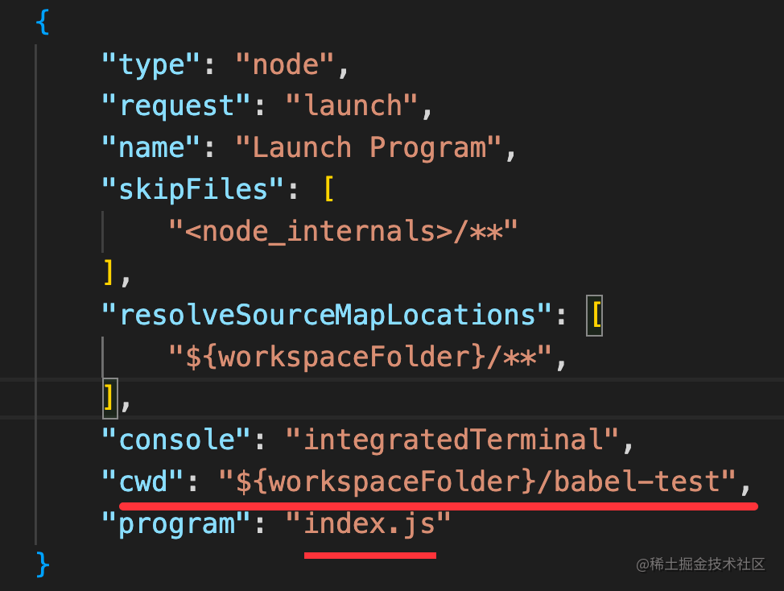

再跑调试：

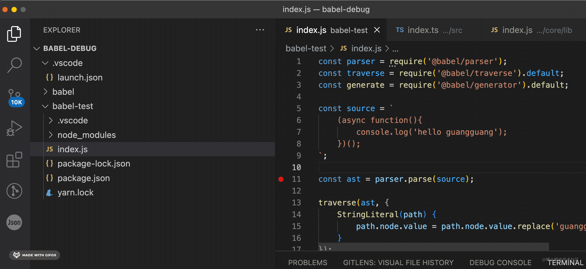

你就会发现现在 sourcemap 到的路径直接是 babel 源码下的文件路径了，然后调试的时候 VSCode 也会直接打开对应文件。

更重要的是，现在你可以直接在 babel 源码里打断点了，代码执行到那里就会断住：

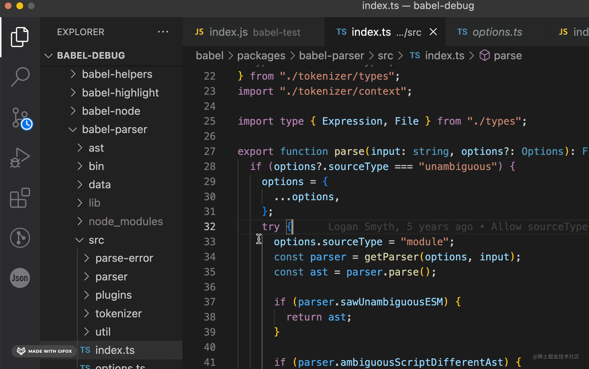

至此，我们就能愉快的调试 babel 源码了。

我们调试了 @babel/parser 包的源码，其余的包也是一样的方式。

## 总结

这节我们调试了 Babel 的源码。

Babel 分为 parse、traverse（或者叫 transform）、generate 三个阶段，分别对应 @babel/parser、@babel/traverse、@babel/generator 的包。

可以用 VSCode Debugger 来调试它。

直接断点调试会发现调试的是编译后的代码，但是 node_modules 下的这几个包都是有 sourcemap 的。

这是因为默认 resolveSourceMapLocations 排除了 node_modules 下的 sourcemap，去掉它重新跑调试，就可以直接调试 ts 源码了。

如果想调试的时候直接调试 babel 源码目录的文件，可以把测试项目和 babel 项目放到一个 workspace，然后改下 sourcemap 文件里的 sources 路径就可以了。这样就可以直接在 babel 源码里打断点。

当你对 babel 某部分功能的实现感兴趣的时候，就可以自己调试源码了！
