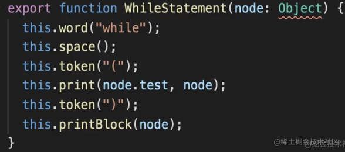
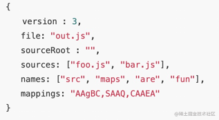

# 31.手写 Babel： generator篇

generator 是打印 AST 为目标代码，并生成 sourcemap。

这节我们实现一下 generator。

## 思路分析

generator 会遍历 AST 进行打印，对于每种 AST 我们是知道如何打印的，比如 while 语句：



先打印 while、再打印空格，再打印 ( ，然后打印 test 部分，之后打印 ），最后打印 block 部分。

那么实现了每种 AST 的打印就可以拼接出目标代码。

而 sourcemap 是记录源码位置和目标代码位置的关联，在打印的记录下当前打印的行列，就是目标代码位置，而源码位置 parse 的时候就有了，这样就生成了一个 mapping。


sourcemap 就是由一个个 mapping 组成的，打印每个 AST 节点的时候添加一下 mapping，最终就生成了 sourcemap。

## 代码实现

我们定义一个 Printer 类做打印，实现每种 AST 的打印逻辑：

```javascript
class Printer {
    constructor (source, fileName) {
        this.buf = '';
        this.printLine = 1;
        this.printColumn = 0;
    }

    addMapping(node) {
        // 待实现
    }

    space() {
        this.buf += ' ';
        this.printColumn ++;
    }

    nextLine() {
        this.buf += '\n';
        this.printLine ++;
        this.printColumn = 0;
    }

    Program (node) {
        this.addMapping(node);
        node.body.forEach(item => {
            this[item.type](item) + ';';
            this.printColumn ++;
            this.nextLine();
        });
    }

    VariableDeclaration(node) {
        if(!node.declarations.length) {
            return;
        }
        this.addMapping(node);

        this.buf += node.kind;
        this.space();
        node.declarations.forEach((declaration, index) => {
            if (index != 0) {
                this.buf += ',';
                this.printColumn ++;
            }
            this[declaration.type](declaration);
        });
        this.buf += ';';
        this.printColumn ++;

    }
    VariableDeclarator(node) {
        this.addMapping(node);
        this[node.id.type](node.id);
        this.buf += '=';
        this.printColumn ++;
        this[node.init.type](node.init);
    }
    Identifier(node) {
        this.addMapping(node);
        this.buf += node.name;
    }
    FunctionDeclaration(node) {
        this.addMapping(node);

        this.buf += 'function ';
        this.buf += node.id.name;
        this.buf += '(';
        this.buf += node.params.map(item => item.name).join(',');
        this.buf += '){';
        this.nextLine();
        this[node.body.type](node.body);
        this.buf += '}';
        this.nextLine();
    }
    CallExpression(node) {
        this.addMapping(node);

        this[node.callee.type](node.callee);
        this.buf += '(';
        node.arguments.forEach((item, index) => {
            if(index > 0 ) this.buf += ', ';
            this[item.type](item);
        })
        this.buf += ')';

    }
    ExpressionStatement(node) {
        this.addMapping(node);

        this[node.expression.type](node.expression);

    }
    ReturnStatement(node) {
       this.addMapping(node);

        this.buf += 'return ';
        this[node.argument.type](node.argument); 

    }
    BinaryExpression(node) {
       this.addMapping(node);

        this[node.left.type](node.left);
        this.buf += node.operator;
        this[node.right.type](node.right);

    }
    BlockStatement(node) {
       this.addMapping(node);

        node.body.forEach(item => {
            this.buf += '    ';
            this.printColumn += 4;
            this[item.type](item);
            this.nextLine();
        });

    }
    NumericLiteral(node) {
       this.addMapping(node);

        this.buf += node.value;

    }
}
```

这样递归进行打印就可以生成完整的目标代码，我们把它记录到了 this.buf 属性。

同时，我们在打印的时候记录了 printLine、printColumn 的信息，也就是当前打印到了第几行，这样在 addMapping 里面就可以拿到 AST 在目标代码中的位置，而源码位置是在 parse 的时候记录到 loc 属性的，有了这两个位置就可以生成一个 mapping。

sourcemap 的生成是使用 source-map 包，这个 mozilla 维护的，因为 sourcemap 的标准也是他们提出来的。

```javascript
const { SourceMapGenerator } = require('source-map');

class Printer {
    constructor (source, fileName) {
        this.buf = '';
  
        this.sourceMapGenerator = new SourceMapGenerator({
            file: fileName + ".map.json",
        });
        this.fileName = fileName;
        this.sourceMapGenerator.setSourceContent(fileName, source);

        this.printLine = 1;
        this.printColumn = 0;
    }
}
```

sourcemap 需要指定源文件名，这也是为什么我们要传入 fileName。



之后实现 addMapping 方法：

```javascript
addMapping(node) {
    if (node.loc) {
        this.sourceMapGenerator.addMapping({
            generated: {
              line: this.printLine,
              column: this.printColumn
            },
            source: this.fileName,
            original: node.loc && node.loc.start
        })
    }
}
```

最后，我们定义 Generator 类，在 generate 方法里面调用 printer 的打印逻辑来生成目标代码，并且调用 this.sourceMapGenerator.toString() 来生成 sourcemap。

```javascript
class Generator extends Printer{

    constructor(source, fileName) {
        super(source, fileName);
    }

    generate(node) {
        this[node.type](node);

        return {
            code: this.buf,
            map: this.sourceMapGenerator.toString()
        }
    }
}

```
然后暴露出 generate 的 api：

```javascript
function generate (node, source, fileName) {
    return new Generator(source, fileName).generate(node);
}
```

这样，我们就实现了 babel generator 的功能，也就是打印目标代码和生成 sourcemap。


可以在生成的代码中添加 sourceMappingURL 就可以映射回源码，可以通过打断点或者运行代码 throw error 的方式来测试 测试 sourcemap的功能。

```
//# sourceMappingURL=./xxx.map.json
```

## 总结

generator 是打印 AST 为目标代码，我们知道每种 AST 是如何打印的，那么递归打印 AST，拼接字符串，就可以生成目标代码。

sourcemap 是调试代码和线上报错定位源码必不可少的功能，我们基于 source-map 包来生成，记录一个个 mapping。

具体的 mapping 就是源代码位置和目标代码位置的关联，AST 在源码的位置记录在 loc 属性，而在目标代码的位置位置可以计算出来。这样就可以生成 sourcemap。

（代码在[这里](https://github.com/QuarkGluonPlasma/babel-plugin-exercize)，建议 git clone 下来通过 node 跑一下）
