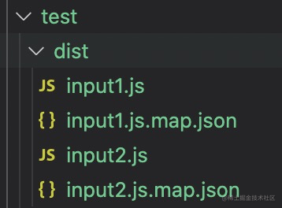

# 33.手写 Babel： cli篇

上节我们实现了完整的编译流程，支持了插件，可以通过引入模块的方式使用，这一节我们实现下命令行的方式。

我们会实现以下功能：

- 支持命令行指定参数，指定要编译的文件、输出目录、是否 watch 等
- 支持配置文件
- 编译文件的路径支持 glob，可以模糊匹配
- 生成 sourcemap，自动添加 sourceMapUrl 到文件内容中
- 支持 watch，文件变动立即重新编译

## 思路分析

命令行工具就是通过命令行启动的，要支持命令行启动需要在 js 文件开头加上
```
#!/usr/bin/env node
```
命令行参数的解析可以使用 [commander](https://www.npmjs.com/package/commander)，它可以解析命令行参数，然后可以直接拿到 parse 之后的结果。

配置文件的指定可以使用 [cosmiconfig](https://www.npmjs.com/package/cosmiconfig)，它支持如下的查找方式：

- `package.json` 的属性
- 扩展名为 rc 的 JSON 或者 YAML
- 扩展名为 `.json`、 `.yaml`、 `.yml`、 `.js`、`.cjs` 、`.config.js`、`.config.cjs` 的 rc 文件
- `.config.js` 或者 `.config.cjs` 的 commonjs 模块

这种配置文件查找机制在 eslint、babel 等很多工具中都有应用，我们也采用这种方式。

文件模糊匹配使用 [glob](https://www.npmjs.com/package/glob) 来匹配，它会返回匹配后的文件路径。

```javascript
glob("**/*.js", options, function (er, files) {})
```

watch 的实现使用 [chokidar](https://www.npmjs.com/package/chokidar)，它会监听文件的变动，包括文件增加、删除、修改、重命名，目录增加、删除等，然后把变动的文件路径传入回调函数。监听的文件也支持通过 glob 字符串来指定。

知道了 watch、命令行参数解析、配置文件查找、文件模糊匹配都怎么做之后，我们来串联下整体流程：

- 通过 commander 解析命令行参数，拿到 outDir（输出目录）、watch（是否监听）以及 glob 字符串
- 解析 glob 字符串，拿到要编译的文件路径
- 查找配置文件，拿到配置信息
- 依次编译每一个文件，传入配置信息，输出到 outDir 目录，并且添加 sourcemap 的关联
- 如果开启了 watch，则监听文件变动，每次变动都重新编译该文件

之后还需要在 package.json 中配置下 bin 属性，这样才可以作为命令行工具来注册。

下面我们实现一下：

## 代码实现：

引入 commander，声明 outDir、watch 等参数：

```javascript
const commander = require('commander');

commander.option('--out-dir <outDir>', '输出目录');
commander.option('--watch', '监听文件变动');

commander.parse(process.argv);
```
对传入的参数 process.argv 做 parse 之后就可以拿到具体的值：

比如我们传入：

```shell
my-babel ./input/*.js --out-dir ./dist --watch
```
在代码里就可以拿到

```javascript
const cliOpts = commander.opts();

cliOptions.outDir;// ./dist
cliOptions.watch // true
commander.args[0] // ./input/*.js
```
我们要对输入的参数做下校验，然后打印提示信息：
```javascript
if (process.argv.length <=2 ) {
    commander.outputHelp();
    process.exit(0);
}

const cliOpts = commander.opts();

if (!commander.args[0]) {
    console.error('没有指定待编译文件');
    commander.outputHelp();
    process.exit(1);
}

if(!cliOpts.outDir) {
    console.error('没有指定输出目录');
    commander.outputHelp();
    process.exit(1);
}
```

这样，我们就完成了对命令行参数的处理。

接下来，我们对 glob 字符串做解析，拿到具体的文件路径：

```javascript
const filenames = glob.sync(commander.args[0]);
```
然后查找配置文件：
```javascript
const explorerSync = cosmiconfigSync('myBabel');
const searchResult = explorerSync.search();
```
我们通过 options 来集中存放命令行参数和解析后的配置文件的参数：
```javascript
const options = {
    babelOptions: searchResult.config,
    cliOptions:  {
        ...cliOpts,
        filenames
    }
}
```

之后，就可以开始编译了。我们定义一个 compile 方法，传入文件路径的数组，然后，对每个文件的内容进行读取，然后进行编译，之后输出到目标目录。

这里要注意的是，如果 outDir 不存在，需要先创建。

```javascript
function compile(fileNames) {
    fileNames.forEach(async filename => {
        const fileContent = await fsPromises.readFile(filename, 'utf-8');
        const baseFileName = path.basename(filename);
        const sourceMapFileName = baseFileName + '.map.json';

        // 编译的过程，后面补充
        
        //如果目录不存在则创建
         try {
            await fsPromises.access(options.cliOptions.outDir);
         } catch(e) {
            await fsPromises.mkdir(options.cliOptions.outDir);
         }
         // 拼接输出的路径
         const distFilePath = path.join(options.cliOptions.outDir, baseFileName);
         const distSourceMapPath = path.join(options.cliOptions.outDir, baseFileName + '.map.json');
 
         await fsPromises.writeFile(distFilePath, generatedFile);
         await fsPromises.writeFile(distSourceMapPath, res.map);
     })
}
```

编译就是使用我们之前实现的 babel core，把生成的 sourcemap 关联到目标代码。

```javascript
const res = myBabel.transformSync(fileContent, {
    ...options.babelOptions,
    fileName: baseFileName
 });
 const generatedFile = res.code + '\n' + '//# sourceMappingURL='\n' + sourceMapFileName;
```

之后，如果指定了 watch，也需要重新编译一次：

```javascript

if(cliOpts.watch) {
    const chokidar = require('chokidar');

    chokidar.watch(commander.args[0]).on('all', (event, path) => {
        console.log('检测到文件变动，编译：' + path);
        compile([path]);
    });
}
```
这样，我们就实现了命令行参数的解析，编译多个文件，watch 文件变动增量编译的功能。

下面我们来测试一下：

## 测试

我们在 test 目录下新建一个配置文件 myBabel.config.js:
```javascript
function plugin2(api, options) {
    return {
        visitor: {
            Program(path) {
                Object.entries(path.scope.bindings).forEach(([id, binding]) => {
                    if (!binding.referenced) {
                        binding.path.remove();
                    }
                });
            },
            FunctionDeclaration(path) {
                Object.entries(path.scope.bindings).forEach(([id, binding]) => {
                    if (!binding.referenced) {
                        binding.path.remove();
                    }
                });
            }
        }
    }
}

module.exports = {
    parserOpts: {
        plugins: ['literal', 'guangKeyword']
    },
    plugins: [
        [
            plugin2
        ]
    ]
}
```

然后添加一个 input 目录，里面放上两个文件：
```javascript
// input1.js
const c = 1;
const d = 2;
const e = 4;

function add(a, b) {
    const tmp = 1;
    return a + b;
}

add(c, d);
```
```javascript
// input2.js
function minus(a, b) {
    return a - b;
}

minus(3, 4);
```

之后我们可以通过下面的方式来测试：
```
node ../src/cli/index.js ./input/*.js --out-dir ./dist --watch
```
也可以用 vscode 的 debugger 来跑，这样能打断点调试，在 .vscode/launch.json 中添加如下配置：
```json
{
    "name": "测试 babel cli",
    "program": "${workspaceFolder}/exercize-babel/src/cli/index.js",//运行的代码
    "request": "launch",
    "type": "node",
    "args": [
        "./input/*.js", "--out-dir", "./dist",
        "--watch",
    ],//命令行参数
    "cwd": "${workspaceFolder}/exercize-babel/test"//运行的目录
},
```
然后点击 debug 按钮就可以跑了。
但是这样测试需要指定路径，我们还可以把这个命令注册到本地的全局目录：

在 cli/index.js 文件开头加上:
```javascript
#!/usr/bin/env node
```
在 package.json 中注册：
```javascript
"bin": {
    "my-babel": "./src/cli/index.js"
}
```
然后执行 npm link，注册到全局，之后就可以直接这样使用了：
```
myBabel ./input/*.js --out-dir ./dist --watch
```
效果如下：



当然，如果是正式的命令行工具，需要发布到 npm 仓库，然后 npm install 的方式来安装和使用。

如果 npm link 之后还是找不到 my-babel 的命令，那么可能是你没有把全局bin 的位置添加到环境变量的 PATH 中，可以这样做：

```
export PATH = $PATH:`npm get prefix`/bin
```
把这行命令添加到 ~/.bashrc 下，然后 source ~/.bashrc 就可以了。

npm get prefix 是查看本地 npm 的全局路径，而 bin 就是命令的路径，添加到 PATH 中就可以查找到了。

## 总结

我们实现了 babel cli 的命令行参数的解析（commander），模糊匹配文件（glob）、配置文件查找（cosmiconfig）、监听文件变动（chokidar）等功能。之后在 package.json 中的 bin 来注册就可以使用了。

本地测试的时候可以 link 到全局目录，当然全局目录需要在 PATH 中，如果不在的话，需要 npm get prefix 看一下全局 npm 路径，然后添加到 PATH。

（代码在[这里](https://github.com/QuarkGluonPlasma/babel-plugin-exercize)，建议 git clone 下来通过 node 跑一下）