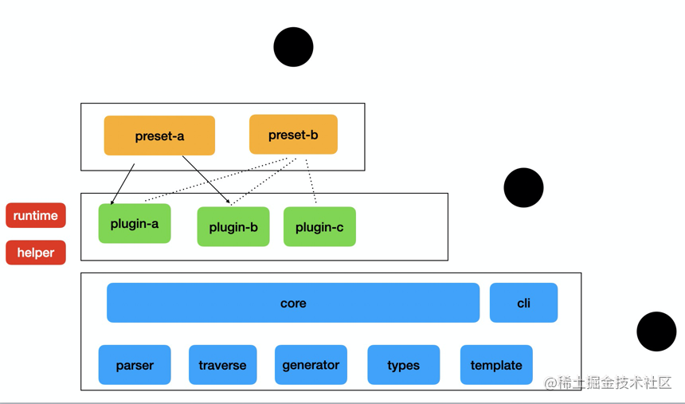

# 34.手写 Babel： 总结

前面的章节我们实现了 parser、traverse、generate 的三步，实现了 types、template 来创建 AST，也支持了 traverse 过程中的 path、scope，然后在 core 包里做了集成，实现了 plugin 和 preset 功能，还实现了 cli 的使用方式。

我们实现的时候做了简化，因为目的本来就不是写一个完整的 babel，而是为了帮助大家深入 babel 的本质。

babel 是一个微内核架构，整体编译流程是内核，支持了源码到源码的转换，而具体做什么转换则是插件定义的。

我们经常用来做 es next 到目标环境代码的转换，typescript 到目标环境代码的转换，这些具体的每一个转换都是在不同的插件里面定义的，为了简化用户的使用，babel 又提供了 preset 功能，集成了不同的插件。

我们实现了内核的部分，支持了插件和 preset，但是并没有做进一步的更上层的东西，这些其实就与设计有关了，比如 babel6 的 preset-es20xx 的 preset， babel7 的 preset-env 的 perset，这些都是基于插件的上层封装。如果内核是最底层，那么插件就是更上一层，而 preset 是直接面向用户的一层，preset 这层是变化最大的，我们也能感受出来 babel 这些年 preset 的变化，但是内核和插件确是万年不变的，因为原理就是那些。

其实还有 helper 包、runtime 包这些没实现，这也是比较上层的东西。

helper 包就是工具包，插件插件之间肯定有一些复用的的代码，比如注入的同样的 ast，这些抽离出来就起名为了 helper 包，可以理解为工具函数库。

runtime 包则是转换代码以后可以通过 runtime 引入的一些 api，比如 regenerator（实现 async、await）、corejs（实现 esnext）这些，因为这些并不是 babel 做的，而是用的第三方的 babel 里面只是引入了下。

而且即将到来的 babel8 来支持了 polyfill provider，也就是可以切换具体的 runtime 实现。

这些东西是偏应用层的东西，我的观点是理解他们都是干什么的，设计理念是什么就可以了，因为他们只是基于内核和已有插件的一层抽象，比较灵活。我们把本质的东西掌握之后，这些东西也很容易理解。

学习 babel 有三个层次：

- 最上面一层是 babel 使用者，基于各种 preset 即可，比如会用了 babel7 的 preset-env 就可以完成 esnext 到目标环境的代码转换。大部分前端开发是这一层。
- 再深入一层是 babel 插件开发者，当需要做各种代码转换的时候，就需要自己写插件了，做各种提效工具的时候经常用到。学完小册能够到这一层。
- 最底层是编译工具开发者，这时候不只要了解插件怎么写，更要知道编译流程的内核是怎么实现的。比如你想用 rust 实现一个 babel 的时候

梳理下每一步我们做了什么：

- parser 就是源码到 ast，babel parser 是 fork 自 acorn，我们也用一样的方式做了下 acorn 的扩展，写了两个 acorn 插件，支持 plugins 的选项来指定语法插件，可以做各种语法的 parse。

- traverse 是遍历 AST，是一个深度优先遍历的过程，要知道不同节点怎么做遍历，可以记录在一个 map 中，遍历到什么节点就去 map 里面查应该遍历什么属性的子节点。

- path 是遍历过程中的路径，关联着父和子两个节点，而 path 和 path 之间也有关联，通过这种方式把遍历路径记录了下来，因为拿到了父子 path，那么还可以提供一些 api 来操作节点，比如 replaceWith、remove 等等。

- scope 也是遍历过程中的信息，是 path 的一部分，只有处理到能够生成作用域的 block 节点（比如函数节点）时才会创建 scope。scope 里有一个 bindings 数组，记录着所有声明的变量，在创建的时候扫描所有子节点（排除子节点中函数节点的扫描）中的 block 节点，然后记录到 bindings 中，并且维护 references 数组，也就是每个 binding 被什么地方引用了。scope和 scope 之间也有关联，串联起来叫做静态作用域链，这个是 js 里面常见的概念。

- types 包就是创建每种类型的节点，这个就是根据不同的结构，传入不同的参数就行了，没啥难度，只是节点比较多，会麻烦一些。

- template 包是传入模版的字符串，然后做 parse，基于 parser 包很容易实现

- generator 是打印 AST 成目标代码并生成 sourcemap，打印AST也就是递归遍历然后拼接字符串。sourcemap 则是使用 source-map 这个Mozilla 官方的包来创建，记录下每个节点的源码位置和打印生成的位置就可以了，所有的 mapping 组成了 sourcemap。

- core 包里面串联了整个编译流程，包括 parse、traverse、generate，然后实现了插件机制，其实也就是把所有插件的 visitor 合并，然后统一遍历。preset 是插件的集合，调用之后返回插件，然后再调用具体插件即可。

- cli 包则是命令行的入口，最终也是基于 core 包，但是要实现命令行参数的解析（commander）、多文件模糊匹配（glob）、配置文件查找（cosmiconfig）、监听文件变动重新编译（chokidar）等功能。

我们实现了 babel 的内核部分，更上层的插件和 preset，比如 preset-env 等我们没有实现，相关联的 runtime 包、helper 包等，这些知道是干什么的即可。

比如 preset-es20xx 等只是简单的插件集合，而 prset-env 则是根据 target 字符串通过 broswerslist 查询出具体浏览器，然后在通过浏览器版本和插件版本的对应关系的数据库来找到应该引入的插件，所以 preset-env 被叫做智能 preset，就是因为可以根据 targets 来决定引入什么插件做代码转换。

其实不只是 babel，像 autoprefixer 等很多别的工具也用到了 browserlist 来动态查询浏览器，然后基于插件和浏览器版本对应关系的数据库来按需引入插件。

手写 babel 的案例集中在核心的不变的编译流程内核的实现，随着版本一直变化的 preset 我们知道是做什么的即可。抓住 babel 的本质来学。
