# 36.加餐：会了 babel 插件，就会写 prettier 插件

最近写了一个 Prettier 插件，可以达到这样的效果：


同事每次保存代码的时候，import 语句的顺序都会随机变。

但是他去 prettier 配置文件里还啥也发现不了。

于是就会一脸懵逼。

那么这个同事发现了会打你的 prettier 插件是怎么实现的呢？

其实底层还是 babel 插件的东西。

## Prettier 的原理

前端的编译工具都是从源码到源码的转换，所以都是 parse、transform、generate 这三步：


parse 是把源码字符串转换成 AST 的对象树，transform 是对 AST 做增删改，而 generate （或者叫 printer）是把转换后的 AST 递归打印成目标代码。

prettier 其实也基于编译实现的，只不过不做中间的转换，只是 parse 和 print（也可以叫 generate），所以分为两步：


它主要的格式化功能都是在 print 阶段做的。

整个流程还是比较简单的，那它是怎么支持那么多语言的呢？

当然是每种语言有各自的 parser 和 printer 呀！

比如它内置了这些 parser：

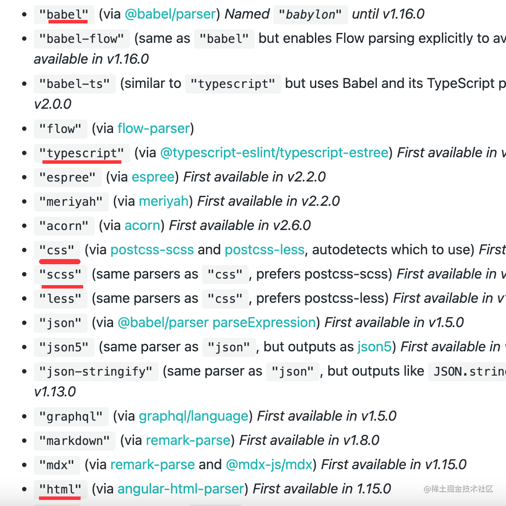

ts、js、css、scss、html 等都支持，就是因为不同的后缀名会启用不同的 parser 和 printer。

而且，它是支持插件的，你完全可以通过 prettier 插件来实现任何一种语言的格式化。

很容易想到，插件自然也是指定什么后缀名的文件，用什么 parser 和 printer，所以是这样的格式：

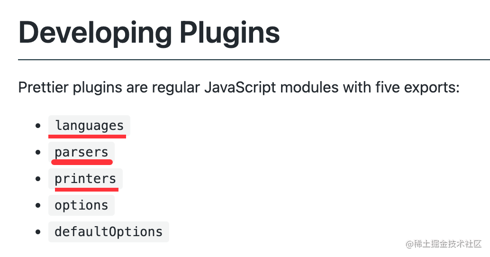

我们看一个真实的插件，格式化 nginx 配置文件的 prettier 插件 prettier-plugin-nginx：

languages 部分就是指定这个语言的名字，什么后缀名的文件，用什么 parser。

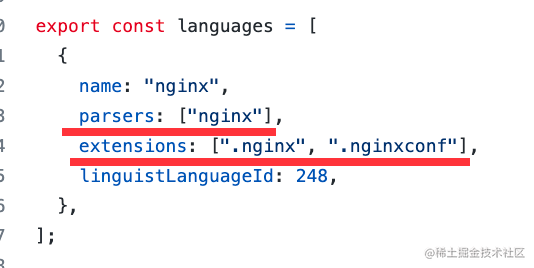

然后 parser 部分就是实现字符串到 AST 的 parse：

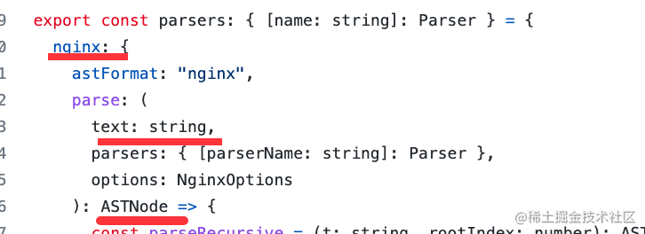

printer 部分就是把 AST 打印成代码：

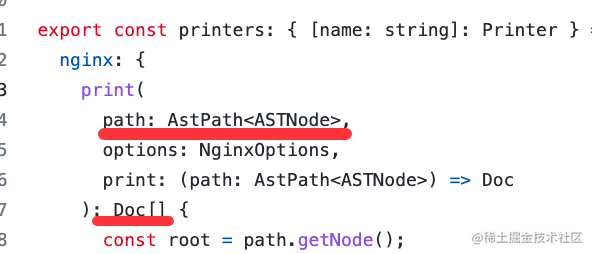

当然，prettier 插件里的 printer 不是直接打印成字符串，而是打印成一种 Doc 的格式，便于 prettier 再做一层格式控制。

总之，想扩展一种新的语言的格式化，只要实现 parser 和 printer 就好了。

但前面那个修改 imports 的插件也不是新语言呀，不是 js/ts 代码么？这种怎么写 prettier 插件？


其实 parser 还可以指定一个预处理器：


在 parse 之前对内容做一些修改：

所以完整的 prettier 流程应该是这样的：


那我们写一个 prettier 插件，对 js/ts/vue/flow 的代码都做下同样的预处理，不就能实现随机打乱 imports 的效果么～

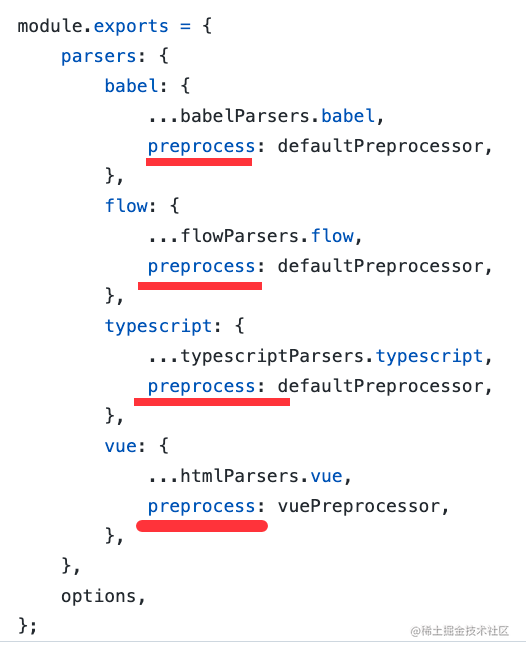

我们来写一下：

只需要对 prettier 默认的 babel 和 typescript 的 parser 做修改就可以了。

其他配置保持不变，只是修改下 preprocess 部分：

```javascript
const babelParsers = require("prettier/parser-babel").parsers;
const typescriptParsers = require("prettier/parser-typescript").parsers;

function myPreprocessor(code, options) {
  return code + 'guangguangguang';
}

module.exports = {
  parsers: {
    babel: {
      ...babelParsers.babel,
      preprocess: myPreprocessor,
    },
    typescript: {
      ...typescriptParsers.typescript,
      preprocess: myPreprocessor,
    },
  },
};
```

我在代码后加了一个 guangguangguang。

在 prettier 配置文件里引入这个插件：

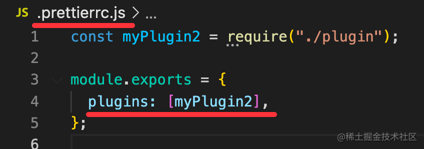

然后我们跑下 prettier：

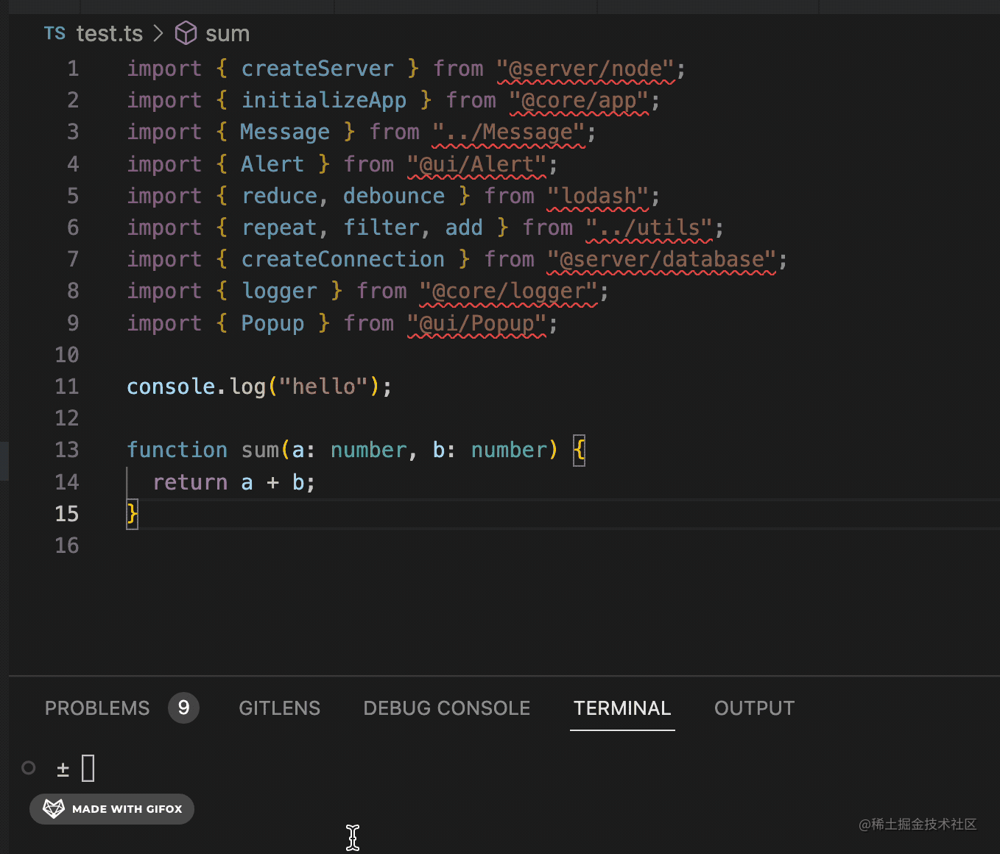

我们写的第一个 prettier 插件生效了！

而且除了 js、ts，在 vue 文件里也会生效：

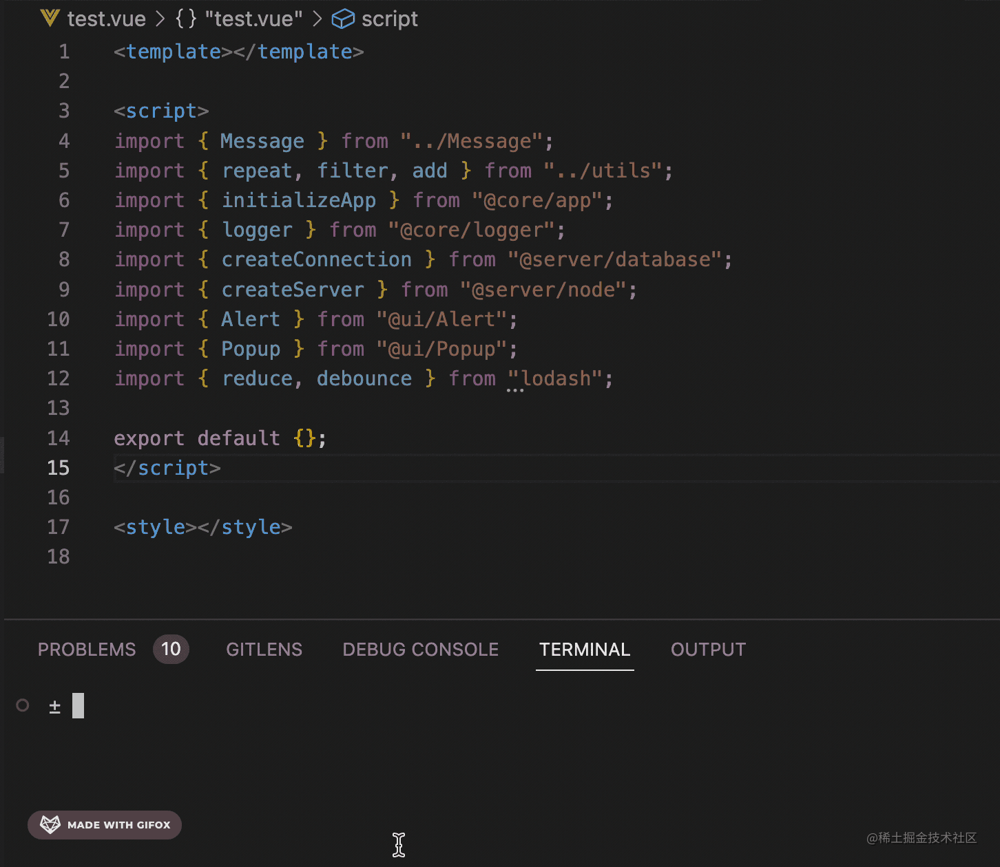

这是因为在 parse vue 的 sfc 的时候，script 的部分还是用 babel 或者 tsc 的。

当然，一般我们会配置 vscode 在保存的时候自动调用 prettier 来格式化。

这需要安装 prettier 插件：

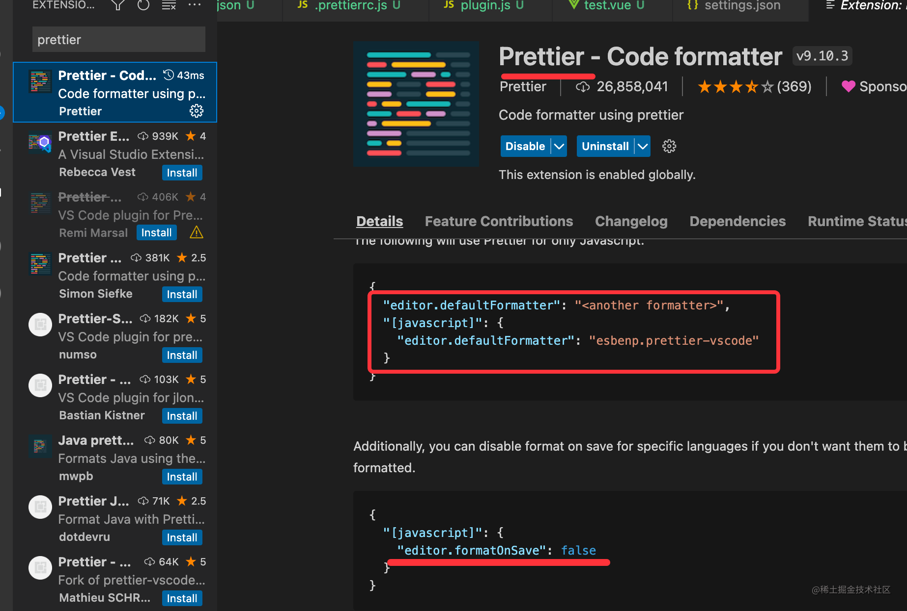

然后按照它的文档来配置 settings：


直接这样配就行：
```json
{
  "editor.defaultFormatter": "esbenp.prettier-vscode",
  "editor.formatOnSave": true
}
```
然后就每次保存自动用 prettier 格式化了：

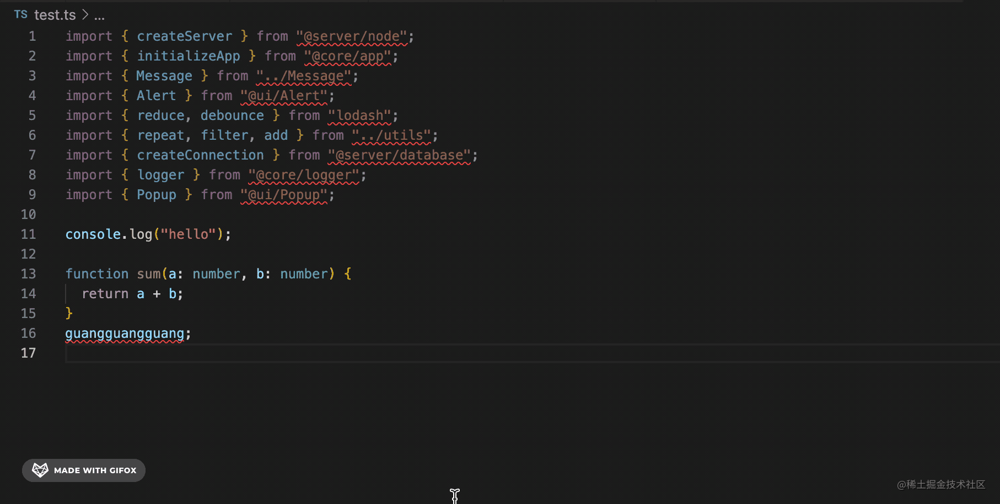

然后我们开始实现打乱 imports 的功能。

要找到 imports 的代码，然后做一些修改，自然会想到通过 babel 的 api。

所以我们可以这样写：

先引入这几个包：
```javascript
const parser = require("@babel/parser");
const traverse = require("@babel/traverse").default;
const generate = require("@babel/generator").default;
const types = require("@babel/types");

const _ = require("lodash");
```
parser、traverse、generate 这几个包都很好懂，就是对应 babel 编译的 3 个步骤的。

types 包是用于创建 AST 的。

因为有的包是 esm 导出的，所以用 commonjs 的方式导入需要取 .default 属性。

然后引入 lodash，一些工具函数。

**第一步，调用 parser.parse 把代码转成 AST。**

```javascript
function myPreprocessor(code, options) {
  const ast = parser.parse(code, {
    plugins: ["typescript", "jsx"],
    sourceType: "module",
  });
}
```
如果 parse ts 和 jsx 代码，需要分别指定 typescript 和 jsx 插件。

sourceType 为 module 代表是有 import 或者 export 的模块代码。

**第二步，把 imports 节点找出来。**

```javascript
const importNodes = [];

traverse(ast, {
    ImportDeclaration(path) {
      importNodes.push(_.clone(path.node));

      path.remove();
    }
});

```

遍历 AST，声明对 import 语句的处理。

具体什么代码是什么 AST 可以在 http://astexplorer.net 可视化查看：

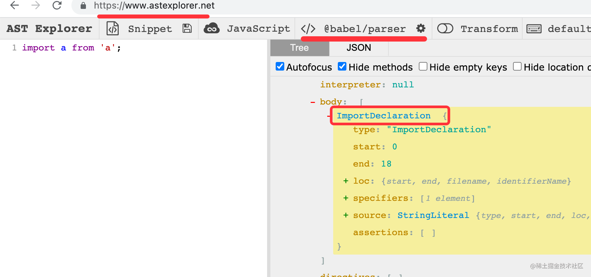

把 AST 节点用 lodash的 clone 函数复制一份，放到数组里。

然后把原 AST 的 import 节点删掉。

**第三步，对 imports 节点排序。**

这一步就用 lodash 的 shuffle 函数就行：

```javascript 
const newImports = _.shuffle(importNodes);
```
**第四步，打印成目标代码。**

修改完 AST，把它打印成目标代码就好了，只不过现在是两部分代码，分别 generate，然后拼接起来：

```javascript
const newAST = types.file({
    type: "Program",
    body: newImports,
});

const newCode =  generate(newAST).code +
    "\n" +
    generate(ast, {
      retainLines: true,
    }).code;

```
import 语句需要包裹一层 file 的根结点，用 @babel/types 包的 api 创建：

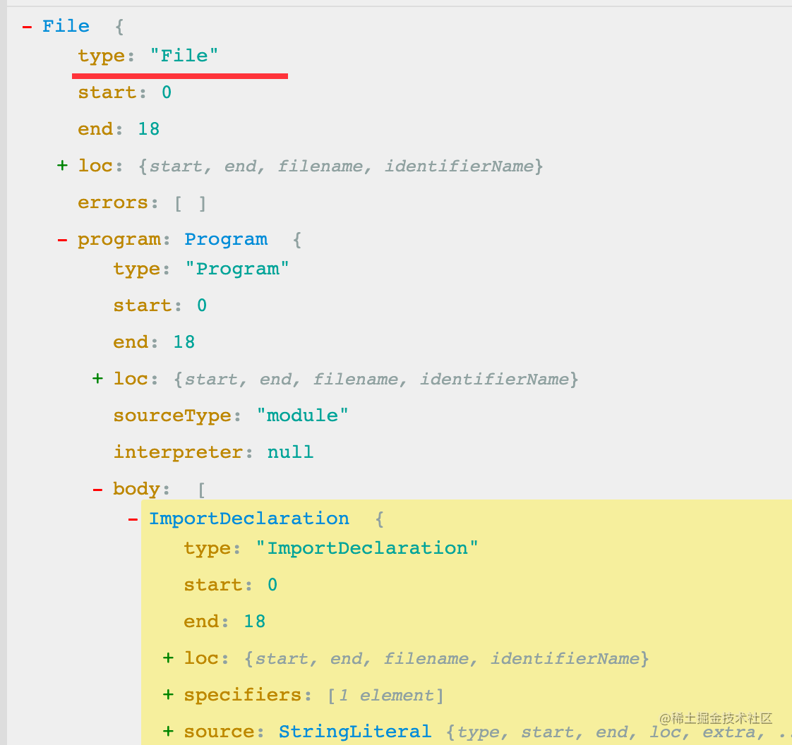

generate 的时候可以加一个 retainLines 为 true，也就是打印的时候保留在源码中的行数，这样打印完了行数不会变。

至此，这个随机打乱 imports 顺序的 prettier 插件我们就完成了。

完整代码如下：

```javascript
const babelParsers = require("prettier/parser-babel").parsers;
const typescriptParsers = require("prettier/parser-typescript").parsers;

const parser = require("@babel/parser");
const traverse = require("@babel/traverse").default;
const generate = require("@babel/generator").default;
const types = require("@babel/types");

const _ = require("lodash");

function myPreprocessor(code, options) {
  const ast = parser.parse(code, {
    plugins: ["typescript", "jsx"],
    sourceType: "module",
  });

  const importNodes = [];

  traverse(ast, {
    ImportDeclaration(path) {
      importNodes.push(_.clone(path.node));

      path.remove();
    },
  });

  const newImports = _.shuffle(importNodes);

  const newAST = types.file({
    type: "Program",
    body: newImports,
  });

  const newCode =  generate(newAST).code +
    "\n" +
    generate(ast, {
      retainLines: true,
    }).code;

  return newCode;
}

module.exports = {
  parsers: {
    babel: {
      ...babelParsers.babel,
      preprocess: myPreprocessor,
    },
    typescript: {
      ...typescriptParsers.typescript,
      preprocess: myPreprocessor,
    },
  },
};
```

我们来试一下。

在 js/ts 文件中：

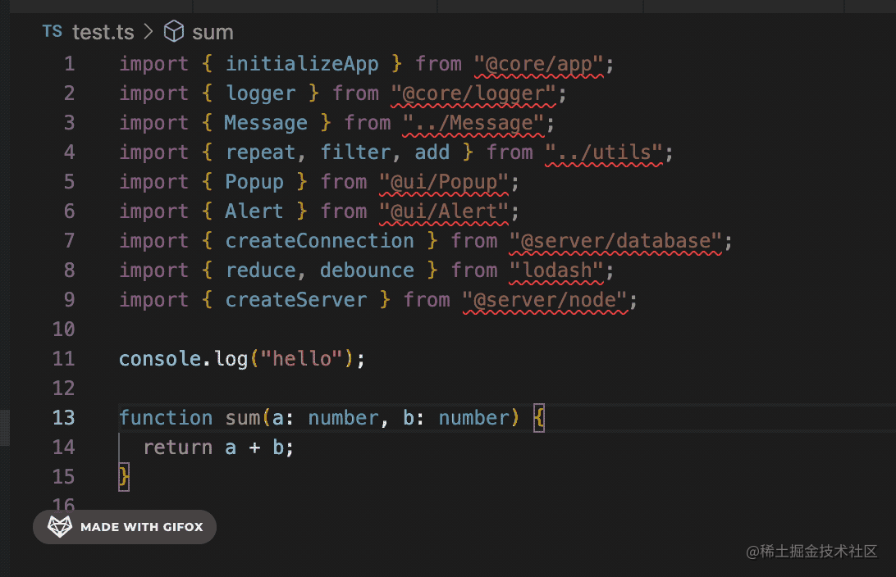

在 vue 文件中：

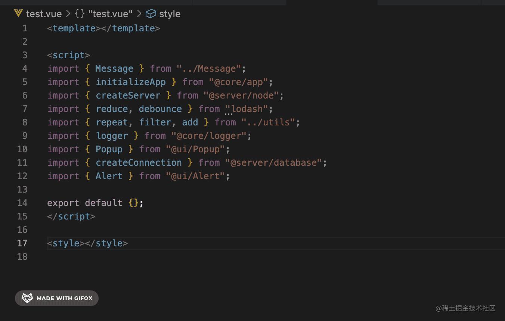

都生效了！（因为 prettier 插件有缓存，不生效的话关掉再打开编辑器就好了）

至此，我们这个同事发现了会打你的插件完成了！

有的同学说，但是在配置文件里会引入呀，这个也太明显了吧。


其实不是的。默认 prettier 会加载 node_modules 下的所有 prettier-plugin-xx 的或者 @xxx/prettier-plugin-yy 的插件，不需要手动指定 plugins，这个只有我们本地开发的时候需要这样指定。

比如社区有 prettier-plugin-sort-import 这个插件，用于 import 排序的：

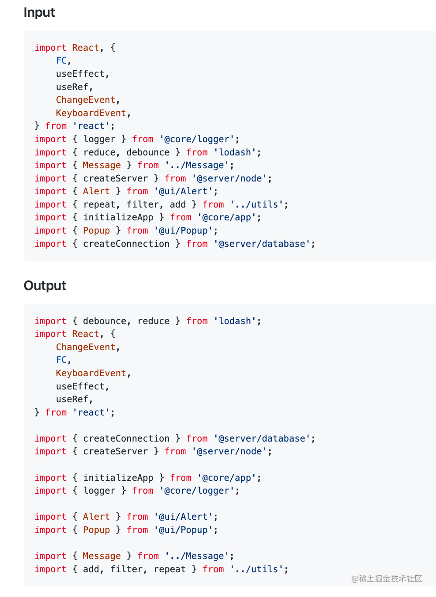

就不需要自己引入就可以直接做配置了：

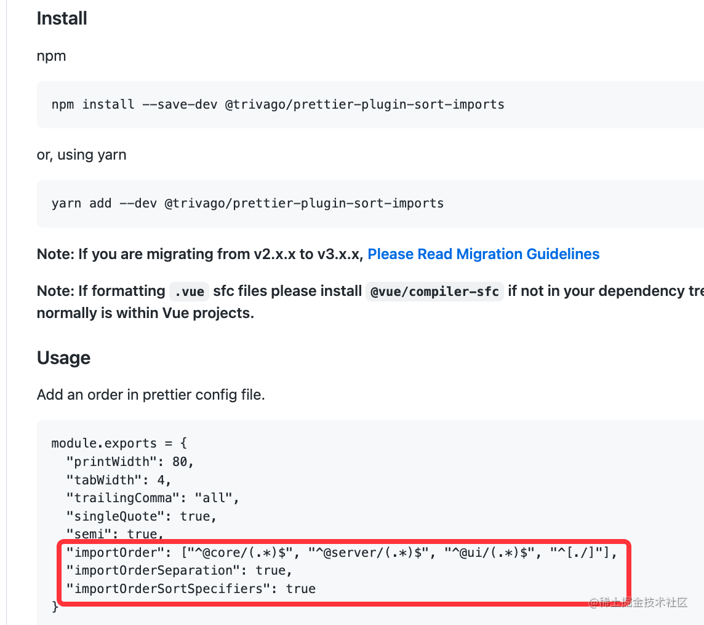

所以，只要安装这个打乱 imports 的 prettier 插件的依赖，prettier 就会自动应用，同事不看 package.json 就很难发现。

## 总结

prettier 是基于编译技术实现的，前端的编译都是 parse、transform、generate 这三个步骤，prettier 也是，只不过不需要中间的 transform。

它只包含 parser 和 printer 这两部分，但是支持很多 language。每种 language 都有自己的 parser 和 printer。

写一个支持新的语言的格式化的 prettier 插件，只需要一个导出 languages、parsers、pritners 配置的文件：

- languages 部分指定语言的名字，文件后缀名，用什么 parser 等。
- parsers 部分实现字符串到 AST 的 parse，还可以指定预处理函数 preprocess。
- printers 部分实现 AST 到 doc 的打印，doc 是 prettier 的一种中间格式，便于 prettier 再做一层统一的格式控制，之后再打印为字符串

今天我们写的 prettier 插件并不是实现新语言的支持，所以只用到了 preprocess 对代码做了预处理，通过 babel 的 api 来对代码做了 imports 的处理。

所以，会了 babel 插件就会写 prettier 插件对 js/ts 做预处理，同理，会了 postcss、posthtml 等也可以用来对 css、scss、less、html 等做预处理，**在格式化代码时加入一些自定义逻辑**。

最后，文中的 prettier 插件的案例只是学习用，不建议大家把这种插件引入项目，否则后果自负[旺柴]。
