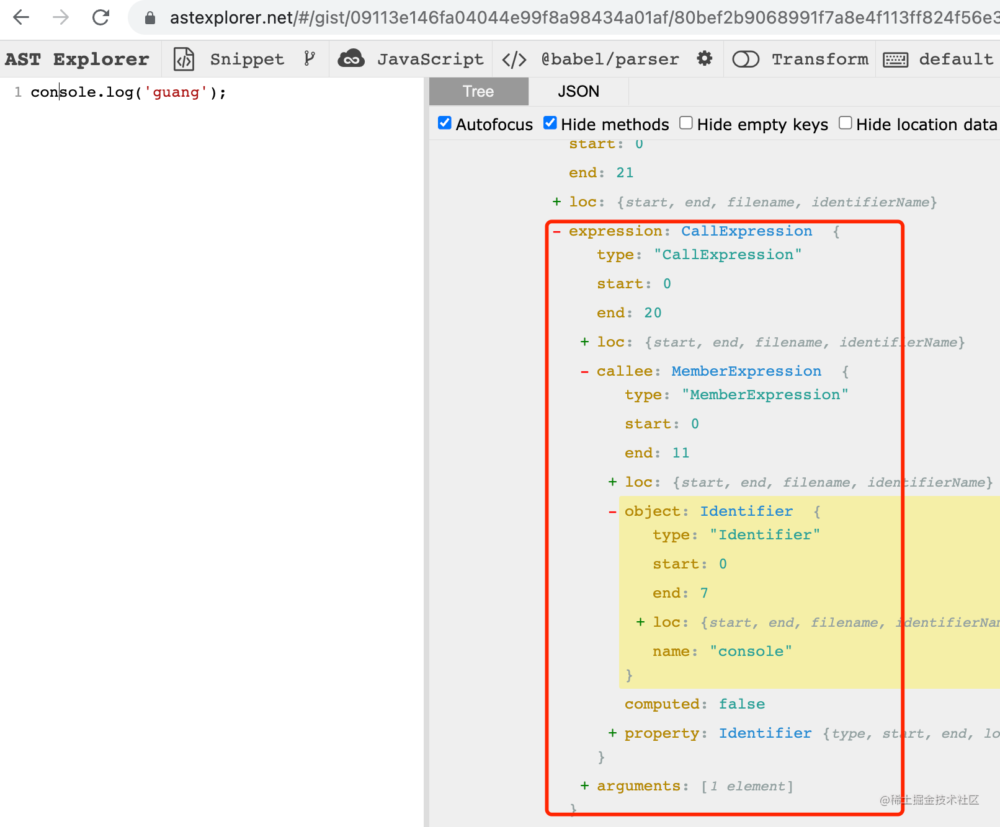
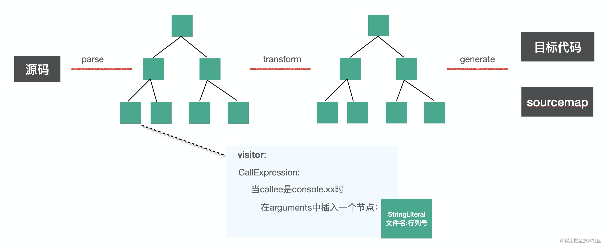
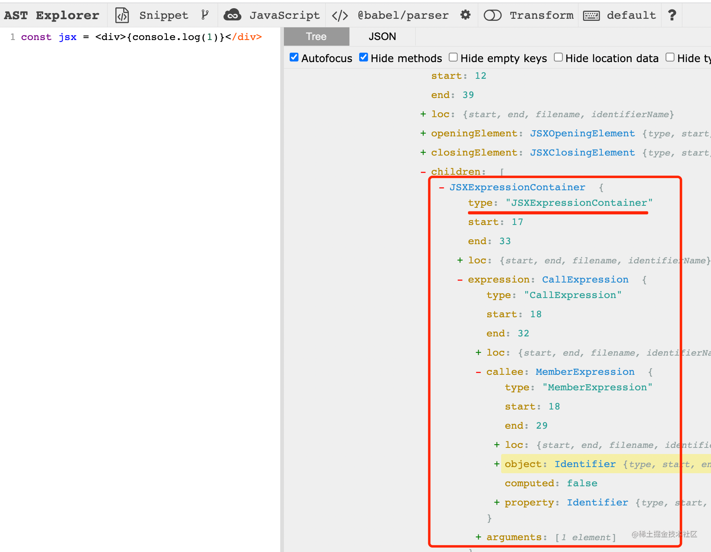

# 5.实战案例：插入函数调用参数

学习完了 babel 的编译流程、AST、api 之后，我们已经可以做一些有趣的事情了。

我们先做一个简单的功能练练手：

## 需求描述

我们经常会打印一些日志来辅助调试，但是有的时候会不知道日志是在哪个地方打印的。希望通过 babel 能够自动在 console.log 等 api 中插入文件名和行列号的参数，方便定位到代码。

也就是把这段代码：
```javascript
console.log(1);
```
转换为这样：
```javascript
console.log('文件名（行号，列号）：', 1);
```

## 实现思路分析

我们用 astexplorer.net 查看下 [console.log 的 AST](https://astexplorer.net/#/gist/09113e146fa04044e99f8a98434a01af/80bef2b9068991f7a8e4f113ff824f56e3292253)：



函数调用表达式的 AST 是 CallExpression。

那我们要做的是在遍历 AST 的时候对 console.log、console.info 等 api 自动插入一些参数，也就是要通过 visitor 指定对 CallExpression 的 AST 做一些修改。

CallExrpession 节点有两个属性，callee 和 arguments，分别对应调用的函数名和参数， 所以我们要判断当 callee 是 console.xx 时，在 arguments 的数组中中插入一个 AST 节点。



## 代码实现

编译流程是 parse、transform、generate，我们先把整体框架搭好：

```javascript
const parser = require('@babel/parser');
const traverse = require('@babel/traverse').default;
const generate = require('@babel/generator').default;

const sourceCode = `console.log(1);`;

const ast = parser.parse(sourceCode, {
  sourceType: 'unambiguous'
});

traverse(ast, {
    CallExpression(path, state) {

    }
});

const { code, map } = generate(ast);
console.log(code);
```

（因为 `@babel/parser` 等包都是通过 es module 导出的，所以通过 commonjs 的方式引入有的时候要取 default 属性。）

parser 需要知道代码是不是 es module 规范的，需要通过 parser options 指定 sourceType 位 module 还是 script，我们直接设置为 unambiguous，让 babel 根据内容是否包含 import、export 来自动设置。

搭好框架之后，我们先设计一下要转换的代码：

```javascript
const sourceCode = `
    console.log(1);

    function func() {
        console.info(2);
    }

    export default class Clazz {
        say() {
            console.debug(3);
        }
        render() {
            return <div>{console.error(4)}</div>
        }
    }
`;
```

AST 可以通过[这个链接](https://astexplorer.net/#/gist/09113e146fa04044e99f8a98434a01af/0ff37c4d88c90f10a71897a8ebf021c55e1f3334)查看。

代码没啥具体含义，主要是用于测试功能。

这里用到了 jsx 的语法，所以 parser 要开启 jsx 的 plugin。

我们按照前面分析的思路来写一下代码：

```javascript
const parser = require('@babel/parser');

const ast = parser.parse(sourceCode, {
    sourceType: 'unambiguous',
    plugins: ['jsx']
});
```

我们要修改 CallExpression 的 AST，如果是 console.xxx 的 api，那就在 arguments 中插入行列号的参数：

```javascript
const parser = require('@babel/parser');
const traverse = require('@babel/traverse').default;
const types = require('@babel/types');

const ast = parser.parse(sourceCode, {
    sourceType: 'unambiguous',
    plugins: ['jsx']
});

traverse(ast, {
    CallExpression (path, state) {
        if ( types.isMemberExpression(path.node.callee) 
            && path.node.callee.object.name === 'console' 
            && ['log', 'info', 'error', 'debug'].includes(path.node.callee.property.name) 
           ) {
            const { line, column } = path.node.loc.start;
            path.node.arguments.unshift(types.stringLiteral(`filename: (${line}, ${column})`))
        }
    }
});
```

判断当 callee 部分是成员表达式，并且是 console.xxx 时，那在参数中插入文件名和行列号，行列号从 AST 的公共属性 loc 上取。

然后跑一下试试：

```javascript
console.log("filename: (2, 4)", 1);

function func() {
  console.info("filename: (5, 8)", 2);
}

export default class Clazz {
  say() {
    console.debug("filename: (10, 12)", 3);
  }

  render() {
    return <div>{console.error("filename: (13, 25)", 4)}</div>;
  }

}
```
结果是符合预期的。

但是现在 if 判断的条件写的太长了，可以简化一下，比如把 callee 的 AST 打印成字符串，然后再去判断：


现在判断条件比较复杂，要先判断 path.node.callee 的类型，然后一层层取属性来判断，其实我们可以用 generator 模块来简化.

```javascript 
const parser = require('@babel/parser');
const traverse = require('@babel/traverse').default;
const generate = require('@babel/generator').default;
const types = require('@babel/types');

const ast = parser.parse(sourceCode, {
    sourceType: 'unambiguous',
    plugins: ['jsx']
});

const targetCalleeName = ['log', 'info', 'error', 'debug'].map(item => `console.${item}`);

traverse(ast, {
    CallExpression(path, state) {
        const calleeName = generate(path.node.callee).code;
        
        if (targetCalleeName.includes(calleeName)) {
            const { line, column } = path.node.loc.start;
            path.node.arguments.unshift(types.stringLiteral(`filename: (${line}, ${column})`))
        }
    }
});
```
其实这里不用自己调用 generate，path 有一个 toString 的 api，就是把 AST 打印成代码输出的。

所以上面的代码可以改成 const calleeName = path.get('callee').toString() 来进一步的简化。

## 需求变更

后来我们觉得在同一行打印会影响原本的参数的展示，所以想改为在 console.xx 节点之前打印的方式

比如之前是
```javascript
console.log(1);
```
转换为 
```javascript
console.log('文件名（行号，列号）：', 1);
```
现在希望转换为：
```javascript
console.log('文件名（行号，列号）：');
console.log(1);
```

## 思路分析

这个需求的改动只是从插入一个参数变成了在当前 console.xx 的 AST 之前插入一个 console.log 的 AST，整体流程还是一样。

这里有两个注意的点：

- JSX 中的 console 代码不能简单的在前面插入一个节点，而要把整体替换成一个数组表达式，因为 JSX 中只支持写单个表达式。

也就是
```javascript
<div>{console.log(111)}</div>
```
要替换成数组的形式

```javascript
<div>{[console.log('filename.js(11,22)'), console.log(111)]}</div>
```
因为 {} 里只能是表达式，这个 AST 叫做 JSXExpressionContainer，表达式容器。见名知意。


AST 可以在[这个链接](https://astexplorer.net/#/gist/f8da7e10bd8c334a03fe65db94f5abd6/c6e4b87ae96d5f40ce2fd550b7f831e7c5737d37)查看。



- 用新的节点替换了旧的节点之后，插入的节点也是 console.log，也会进行处理，这是没必要的，所以要跳过新生成的节点的处理。

## 代码实现

这里需要插入 AST，会用到  path.insertBefore 的 api。

也需要替换整体的 AST，会用到  path.replaceWith 的 api。

然后还要判断要替换的节点是否在 JSXElement 下，所以要用 findParent 的 api 顺着 path 查找是否有 JSXElement 节点。

还有，replace 后，要调用 path.skip 跳过新节点的遍历。

也就是这样：

```javascript
if (path.findParent(path => path.isJSXElement())) {
    path.replaceWith(types.arrayExpression([newNode, path.node]))
    path.skip();// 跳过子节点处理
} else {
    path.insertBefore(newNode);
}
```

要跳过新的节点的处理，就需要在节点上加一个标记，如果有这个标记的就跳过。

整体代码如下
```javascript
const parser = require('@babel/parser');
const traverse = require('@babel/traverse').default;
const generate = require('@babel/generator').default;
const types = require('@babel/types');
const template = require('@babel/template').default;

const ast = parser.parse(sourceCode, {
    sourceType: 'unambiguous',
    plugins: ['jsx']
});

const targetCalleeName = ['log', 'info', 'error', 'debug'].map(item => `console.${item}`);

traverse(ast, {
    CallExpression(path, state) {
        if (path.node.isNew) {
            return;
        }
        const calleeName = generate(path.node.callee).code;
         if (targetCalleeName.includes(calleeName)) {
            const { line, column } = path.node.loc.start;

            const newNode = template.expression(`console.log("filename: (${line}, ${column})")`)();
            newNode.isNew = true;

            if (path.findParent(path => path.isJSXElement())) {
                path.replaceWith(types.arrayExpression([newNode, path.node]))
                path.skip();
            } else {
                path.insertBefore(newNode);
            }
        }
    }
});
```
至此，在 console.log 中插入文件名和行列号的需求就完成了。

我们试一下怎么把它改造成 babel 插件：

## 改造成babel插件

如果想复用上面的转换功能，那就要把它封装成插件的形式。

babel 支持 transform 插件，大概这样：

```javascript
module.exports = function(api, options) {
  return {
    visitor: {
      Identifier(path, state) {},
    },
  };
}
```
babel 插件的形式就是函数返回一个对象，对象有 visitor 属性。

函数的第一个参数可以拿到 types、template 等常用包的 api，这样我们就不需要单独引入这些包了。

而且作为插件用的时候，并不需要自己调用 parse、traverse、generate，这些都是通用流程，babel 会做，我们只需要提供一个 visitor 函数，在这个函数内完成转换功能就行了。

函数的第二个参数 state 中可以拿到插件的配置信息 options 等，比如 filename 就可以通过 state.filename 来取。

上面的代码很容易可以改造成插件：

```javascript
const targetCalleeName = ['log', 'info', 'error', 'debug'].map(item => `console.${item}`);

module.exports = function({types, template}) {
    return {
        visitor: {
            CallExpression(path, state) {
                if (path.node.isNew) {
                    return;
                }
  
                const calleeName = generate(path.node.callee).code;

                 if (targetCalleeName.includes(calleeName)) {
                    const { line, column } = path.node.loc.start;
                    
                    const newNode = template.expression(`console.log("${state.filename || 'unkown filename'}: (${line}, ${column})")`)();
                    newNode.isNew = true;

                    if (path.findParent(path => path.isJSXElement())) {
                        path.replaceWith(types.arrayExpression([newNode, path.node]))
                        path.skip();
                    } else {
                        path.insertBefore(newNode);
                    }
                }
            }
        }
    }
}
```

然后通过 `@babel/core` 的 transformSync 方法来编译代码，并引入上面的插件：

```javascript
const { transformFileSync } = require('@babel/core');
const insertParametersPlugin = require('./plugin/parameters-insert-plugin');
const path = require('path');

const { code } = transformFileSync(path.join(__dirname, './sourceCode.js'), {
    plugins: [insertParametersPlugin],
    parserOpts: {
        sourceType: 'unambiguous',
        plugins: ['jsx']       
    }
});

console.log(code);
```

这样我们成功就把前面调用 parse、traverse、generate 的代码改造成了 babel 插件的形式，只需要提供一个转换函数，traverse 的过程中会自动调用。

## 总结

这一节我们通过一个在 console.xxx 中插入参数的实战案例练习了下 babel 的 api。

首先通过 `@babel/parser`、`@babel/traverse`、`@babel/generator` 来组织编译流程，通过`@babel/types` 创建AST，通过 path 的各种 api 对 AST 进行操作。

后来需求改为在前面插入 console.xxx 的方式，我们引入了 `@babel/template` 包，通过 path.replaceWith 和 path.insertBefore 来对 AST 做插入和替换，需要通过 path.findParent 来判断 AST 的父元素是否包含 JSXElement 类型的 AST。子节点的 AST 要用 path.skip 跳过遍历，而且要对新的 AST 做标记，跳过对新生成的节点的处理。

之后我们把它改造成了 babel 插件，也就是一个函数返回一个对象的格式，函数的第一个参数可以拿到各种 babel 常用包的 api，比如 types、template。 插件不需要调用 parse、traverse、generate 等 api，只需要提供 visitor 函数。最后我们通过 @babel/core 的 api 使用了下这个插件。

学完这一节，我们对前 3 节学习的编译流程、AST、api 都做了一些实践，有了更具体的理解。

（代码在[这里](https://github.com/QuarkGluonPlasma/babel-plugin-exercize)，建议 git clone 下来跑一下）
