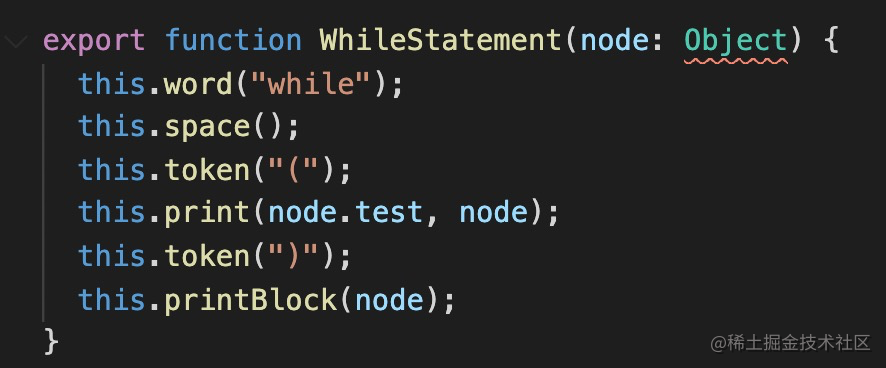
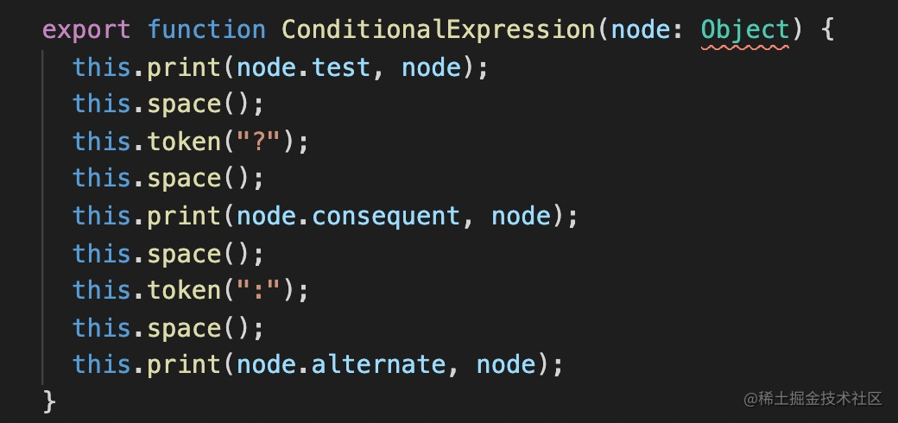
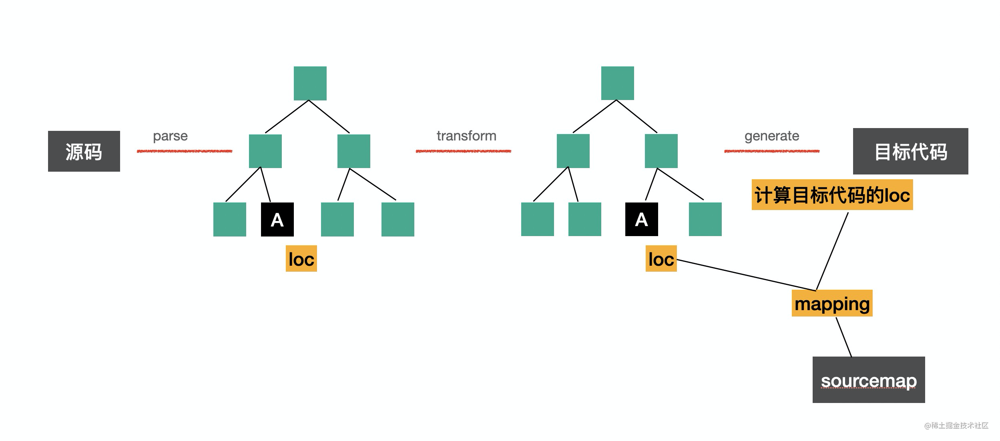

# 8.Generator 和 SourceMap 的奥秘

AST 转换完之后就到了 generate 阶段，genenrate 是怎么生成目标代码和 sourcemap 的呢？sourcemap 有啥作用呢？

本节就来探索一下 generate 的奥秘。

## generate

generate 是把 AST 打印成字符串，是一个从根节点递归打印的过程，对不同的 AST 节点做不同的处理，在这个过程中把抽象语法树中省略掉的一些分隔符重新加回来。

比如 while 语句 WhileStatement 就是先打印 while，然后打印一个空格和 '('，然后打印 node.test 属性的节点，然后打印 ')'，之后打印 block 部分



比如条件表达式 ConditionExpression 就是分别打印 node.test、node.consequent、node.alternate 属性，中间插入 `?` `:` 和空格。



通过这样的方式递归打印整个 AST，就可以生成目标代码。

@babel/generator 的 [src/generators](https://github.com/babel/babel/tree/main/packages/babel-generator/src/generators) 下定义了每一种AST节点的打印方式，感兴趣的话可以看一下每种 AST 都是怎么打印的。


## sourcemap

我们知道可以在 generate 的时候选择是否生成 sourcemap，那为什么要生成 sourcemap 呢？

#### sourcemap 的作用

babel 对源码进行了修改，生成的目标代码可能改动很大，如果直接调试目标代码，那么可能很难对应到源码里。所以需要一种自动关联源码的方式，就是 sourcemap。

我们平时用 sourcemap 主要用两个目的：

##### 调试代码时定位到源码

chrome、firefox 等浏览器支持在文件末尾加上[一行注释](https://developer.mozilla.org/zh-CN/docs/Tools/Debugger/How_to/Use_a_source_map)

```
//# sourceMappingURL=http://example.com/path/to/your/sourcemap.map
```
可以通过 url 的方式或者转成 base64 内联的方式来关联 sourcemap。调试工具（浏览器、vscode 等会自动解析 sourcemap，关联到源码。这样打断点、错误堆栈等都会对应到相应源码。

##### 线上报错定位到源码

开发时会使用 sourcemap 来调试，但是生产可不会，要是把 sourcemap 传到生产算是大事故了。但是线上报错的时候确实也需要定位到源码，这种情况一般都是单独上传 sourcemap 到错误收集平台。

比如 sentry 就提供了一个 [@sentry/webpack-plugin](https://www.npmjs.com/package/@sentry/webpack-plugin) 支持在打包完成后把 sourcemap 自动上传到 sentry 后台，然后把本地 sourcemap 删掉。还提供了 [@sentry/cli](https://www.npmjs.com/package/@sentry/cli) 让用户可以手动上传。

平时我们至少在这两个场景（开发时调试源码，生产时定位错误）下会用到 sourcemap。

#### sourcemap的格式

```javascript
{
　　version : 3,
   file: "out.js",
   sourceRoot : "",
   sources: ["foo.js", "bar.js"],
   names: ["src", "maps", "are", "fun"],
   mappings: "AAgBC,SAAQ,CAAEA"
}
```
比如上面就是一个 sourcemap 文件，对应字段的含义如下：

- version：source map的版本，目前为3。
- file：转换后的文件名。

- sourceRoot：转换前的文件所在的目录。如果与转换前的文件在同一目录，该项为空。

- sources：转换前的文件。该项是一个数组，因为可能是多个源文件合并成一个目标文件。

- names：转换前的所有变量名和属性名，把所有变量名提取出来，下面的 mapping 直接使用下标引用，可以减少体积。

- mappings：转换前代码和转换后代码的映射关系的集合，用分号代表一行，每行的 mapping 用逗号分隔。

重点看 mappping 部分

```javascript
　　mappings:"AAAAA,BBBBB;;;;CCCCC,DDDDD"
```

每一个分号 `;` 表示一行，多个空行就是多个 `;`，mapping 通过 `,` 分割。

mapping有五位：

```
 第一位是目标代码中的列数
 第二位是源码所在的文件名
 第三位是源码对应的行数
 第四位是源码对应的列数
 第五位是源码对应的 names，不一定有
```
每一位是通过 VLQ 编码的，一个字符就能表示行列数，具体 VLQ 的编码的实现就不展开了，感兴趣可以查一下相关资料。

sourcemap 通过 `names` 和 `;` 的设计省略掉了一些变量名和行数所占的空间，又通过 VLQ 编码使得一个字符就可以表示行列数等信息。通过不大的空间占用完成了源码到目标代码的映射。

**那么 sourcemap 的源码和目标代码的行列数是怎么来的呢？**

其实我们在 parse 的时候就在 AST 节点中保存了 loc 属性，这就是源码中的行列号，在后面 transform 的过程中，并不会去修改它，所以转换完以后节点中仍然保留有源码中的行列号信息，在 generate 打印成目标代码的时候会计算出新的行列号，这样两者关联就可以生成 sourcemap。 



具体生成 sourcemap 的过程是用 mozilla 维护的 [source-map](https://www.npmjs.com/package/source-map) 这个包，其他工具做 sourcemap 的解析和生成也是基于这个包。

## soruce-map

[source-map](https://www.npmjs.com/package/source-map) 可以用于生成和解析 sourcemap，需要手动操作 sourcemap 的时候可以用。我们通过它的 api 来感受下 babel 是怎么生成 sourcemap 的。

source-map 暴露了 SourceMapConsumer、SourceMapGenerator、SourceNode 3个类，分别用于消费 sourcemap、生成 sourcemap、创建源码节点。

##### 生成 sourcemap

生成 sourcemap 的流程是：
1. 创建一个 SourceMapGenerator 对象
2. 通过 addMapping 方法添加一个映射
3. 通过 toString 转为 sourcemap 字符串

```javascript
var map = new SourceMapGenerator({
  file: "source-mapped.js"
});

map.addMapping({
  generated: {
    line: 10,
    column: 35
  },
  source: "foo.js",
  original: {
    line: 33,
    column: 2
  },
  name: "christopher"
});

console.log(map.toString());
// '{"version":3,"file":"source-mapped.js",
//   "sources":["foo.js"],"names":["christopher"],"mappings":";;;;;;;;;mCAgCEA"}'
```

##### 消费sourcemap

SourceMapConsumer.with 的回调里面可以拿到 consumer 的 api，调用 originalPositionFor 和 generatedPositionFor 可以分别用目标代码位置查源码位置和用源码位置查目标代码位置。还可以通过 eachMapping 遍历所有 mapping，对每个进行处理。
```javascript
const rawSourceMap = {
  version: 3,
  file: "min.js",
  names: ["bar", "baz", "n"],
  sources: ["one.js", "two.js"],
  sourceRoot: "http://example.com/www/js/",
  mappings: "CAAC,IAAI,IAAM,SAAUA,GAClB,OAAOC,IAAID;CCDb,IAAI,IAAM,SAAUE,GAClB,OAAOA"
};

const whatever = await SourceMapConsumer.with(rawSourceMap, null, consumer => {
   // 目标代码位置查询源码位置
  consumer.originalPositionFor({
    line: 2,
    column: 28
  })
  // { source: 'http://example.com/www/js/two.js',
  //   line: 2,
  //   column: 10,
  //   name: 'n' }
  
  // 源码位置查询目标代码位置
  consumer.generatedPositionFor({
    source: "http://example.com/www/js/two.js",
    line: 2,
    column: 10
  })
  // { line: 2, column: 28 }
  
  // 遍历 mapping
  consumer.eachMapping(function(m) {
    // ...
  });

  return computeWhatever();
});
```
babel 就是用这些 api 来生成 sourcemap 的。

## 总结

这一节我们探索了下 generator 和 sourcemap 的原理，generate 就是递归打印 AST 成字符串，在递归打印的过程中会根据源码位置和计算出的目标代码的位置来生成 mapping，加到 sourcemap 中。 sourcemap 是源码和目标代码的映射，用于开发时调试源码和生产时定位线上错误。 babel 通过 source-map 这个包来生成的 sourcemap，我们使用了下 source-map 包的 api，对 sourcemap 的生成和消费有了一个直观的认识。

学完这一节之后，我们知道了 AST 是怎么生成目标代码和 sourcemap的，加上前两节的内容，把整个 babel 的编译流程串联了起来。

