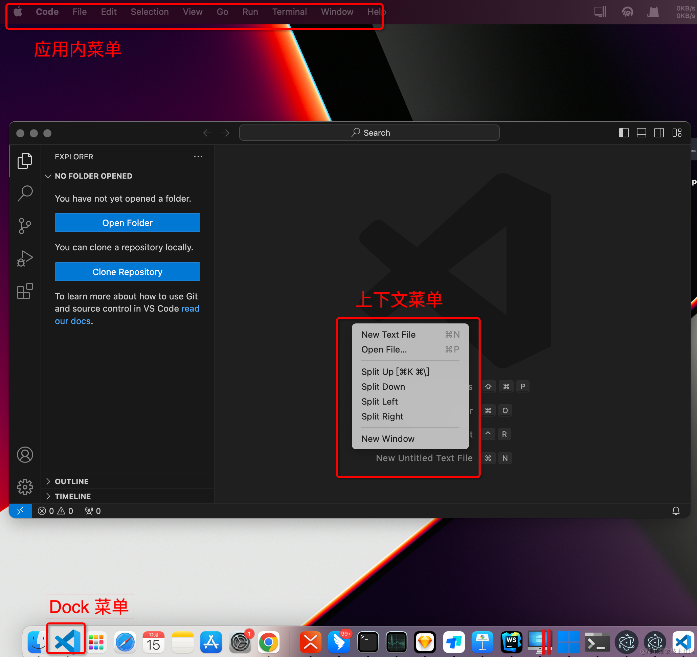

# 第06章—基础篇：Electron菜单和托盘

## 前言

菜单、托盘是桌面端应用必备的功能之一，我们通常会在菜单上配置应用常用的：偏好设置、显示隐藏、打开文件等功能，在托盘内设置：退出、重启、帮助等辅助性功能，帮助用户方便快捷地控制应用的一些系统功能。系统托盘实际上也是一个菜单，通过点击鼠标触发。

本小节会通过一个个使用示例对菜单和托盘进行详细介绍。


## 应用菜单（Menu）

Electron 里的菜单大体上分为三类：应用菜单、上下文菜单和 Dock 菜单（仅针对 OSX 系统）。这里以 `VSCode` 为例，来分别介绍这几种菜单的含义。打开 VSCode 编辑器，可以通过下图，很清晰地发现 3 个菜单所处的位置。

**MacOS**：



**Windows**：


### 1. 应用内菜单

原生应用菜单可以理解为应用窗口菜单，在 `MacOS` 上，选中应用后，应用内菜单出现在桌面的左上方。在 Windows 和 Linux 上，`Menu` 将会被设置成窗口顶部菜单。在 Electron 中，通常会使用 `Menu.setApplicationMenu(menu)` 函数来设置应用内菜单：

```js
import { Menu } from 'electron'

function createMenu () {
  const template = [
    {
      label: '菜单一',
      submenu: [
        {
          label: '功能一'
        },
        {
          label: '功能二'
        }
      ]
    },
    {
      label: '菜单二',
      submenu: [
        {
          label: '功能一'
        },
        {
          label: '功能二'
        }
      ]
    }
  ];
  const menu = Menu.buildFromTemplate(template);
  Menu.setApplicationMenu(menu);
}
```
通过以上代码设置完成一个应用菜单后，在 `macOS` 下的效果如下：

<p align=center></p>

可以看到第一个菜单的标题是 `Electron` 而不是我们设置的标题 `菜单一`。这是因为：在 macOS 中应用程序菜单的第一个项目的标签总是你的应用程序的名字，无论你设置什么标签。如果你想展示成自己的标题，Electron 官方给了一种修改 `Info.plist` 的方法：[About Information Property List Files](https://developer.apple.com/library/ios/documentation/general/Reference/InfoPlistKeyReference/Articles/AboutInformationPropertyListFiles.html)。除此之外，你也可以重新修改一下 `template` 的格式：

```js
if (process.platform === 'darwin') {
  template.unshift({
    label: app.getName(),
    submenu: [
      {
        label: 'Quit',
        click() {
          app.quit();
        }
      }
    ]
  });
}
```
这样，其实我们就相当于设置了三个菜单，同时，菜单一和菜单二都可以展示出来：

<p align=center></p>

上述代码中，对于 `template` [菜单项](https://www.electronjs.org/zh/docs/latest/api/menu-item)字段内有很多配置项，具体的字段也可以直接阅读官方文档，针对每个字段都有详细的解释。


### 2. 上下文菜单

上下文菜单（context menu）就是我们通常说的右键菜单，需要注意的是：上下文菜单，需要在渲染进程中进行实现，可以通过 `IPC` 发送所需的信息到主进程，并让主进程代替渲染进程显示菜单：

```js
// 主进程 main/index.js
ipcMain.on('show-context-menu', (event) => {
  const template = [
    {
      label: '菜单一',
      click: () => {
        // 发送点击菜单一事件到渲染进程
        event.sender.send('context-menu-command', 'menu-item-1')
      }
    },
    { type: 'separator' },
    {
      label: '菜单二',
      type: 'checkbox',
      checked: true
    }
  ]
  const menu = Menu.buildFromTemplate(template)
  menu.popup({
    window: BrowserWindow.fromWebContents(event.sender)
  })
})
```

```js
// 渲染进程 renderer/main.js
window.addEventListener("contextmenu", (e) => {
  e.preventDefault();
  electron.ipcRenderer.send("show-context-menu");
});
electron.ipcRenderer.on("context-menu-command", (e, command) => {
  // todo
});
```


<p align=center></p>

### 3. Dock 菜单（仅 MacOS 可用）

Dock 的菜单实现也是在主进程中，可以通过 `app.dock.setMenu` 这个 API 来直接创建：

```js
// main.js
const createDockMenu = () => {
  const dockTempalte = [
    {
      label: '菜单一',
      click () {
        console.log('New Window');
      }
    }, {
      label: '菜单二',
      submenu: [
        { label: 'Basic' },
        { label: 'Pro' }
      ]
    },
    {
      label: '其他...'
    }
  ];

  const dockMenu = Menu.buildFromTemplate(dockTempalte);
  app.dock.setMenu(dockMenu);
}
```

<p align=center></p>


## 应用托盘（Tray）

实现应用托盘主要依托于 Electron 的 [Tray](https://www.electronjs.org/zh/docs/latest/api/tray) 模块，在 MacOS 和 Ubuntu，托盘将位于屏幕右上角上，靠近你的电池和 wifi 图标。在 Windows 上，托盘通常位于右下角。


通过以上图片可以清晰地看到创建一个托盘需要准备一个图标用于显示，以及一个[菜单项](https://www.electronjs.org/zh/docs/latest/api/menu-item)用于呈现所需的功能菜单，关于托盘图标，我们在[《Electron 跨平台兼容性措施》](https://juejin.cn/book/7302990019642261567/section/7304648624460759081)章节已经有所介绍，这里就不再赘述。

我们来看一下 `Windows` 下一个简单的应用托盘的实现方式：

```js
// 主进程
import {app, Menu, Tray} from 'electron';

let tray = new Tray('public/icon.ico');
const contextMenu = Menu.buildFromTemplate([
  {
    label: '退出',
    click: function(){
      app.quit();
    }
  }
]);
tray.setToolTip('应用标题');
tray.setContextMenu(contextMenu);
```

在 Rubick 中，应用托盘实现的源码见：https://github.com/rubickCenter/rubick/blob/master/src/main/common/tray.ts

## 总结

本小节我们通过一些简单的示例介绍了 Electorn 中如何通过 `Menu 模块` 和 `Tray 模块` 来实现菜单和托盘的功能。作为一款桌面端应用，菜单和托盘属于基础的功能模块，希望通过本章的学习你可以学会使用这两个最基础模块。
