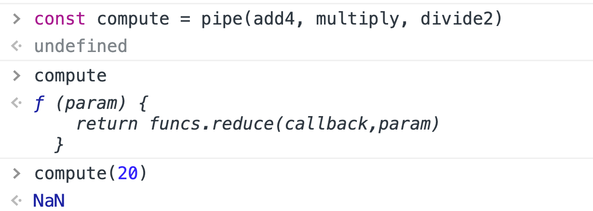

# 15 “多元函数”解决方案：从编码工具视角看偏函数&柯里化

偏函数和柯里化堪称面试场上的“老八股”了，结合近两年面试的“行情”来看，大部分 3-5 年经验的前端同学都能够对这两者的概念进行充分的阐释和辨析，但却常常在 code test 环节折戟。

截止目前，当偏函数和柯里化出现在大家视野里的时候，它更多地是作为一道“名词解释题”，而非一个“编码工具”。

然而，要想理解偏函数和柯里化，最简单的姿势其实恰恰是从“编码工具”这个角度切入。

本节，我们就将从“编码工具”的角度来认识它们。

**认识一个锤子，我们首先要知道它可以被用来对付哪些钉子。**

**认识一个编码工具，我们首先要知道它可以被用来解决哪些问题。**

  


偏函数和柯里化解决的最核心的问题有两个，分别是：

-   函数组合链中的多元参数问题
-   函数逻辑复用的问题

  


## 函数组合链中的多元参数问题

### 理解函数中的“元数(Arity)”

函数参数里的“元数”，指的其实就是函数参数的数量。

在数学里，我们管**只包含一个自变量的函数方程式**叫“一元函数”，比如这种：

```js
y = x + 1   
y = f(x)
```

相应地，**包含两个自变量的函数方程式**就叫二元函数，比如这种：

```js
z = x + y  
z = f(x, y)
```

类比到 JS 函数里来说，单个入参的函数就是一元函数，像这种：

```js
function double(x) {
  return x*2
}
```

两个入参的函数就是二元函数，像这种：

```js
function add(x, y) {
  return x+y
}
```

显然，“多元函数”指的就是有多个（n个）入参的函数，像这种：

```js
function multiple(x,y........n) {
  return ....
}
```

  


### 函数组合链中的参数对齐问题

函数组合虽好，但各种限制少不了。现在请大家简单回顾一下上一节我们徒手撸过的 Pipe 函数：

```js
// 使用展开符来获取数组格式的 pipe 参数
function pipe(...funcs) {
  function callback(input, func) {
    return func(input)
  }  

  return function(param) {
    return funcs.reduce(callback,param)
  }
}
```

当时我们给出的调用示例是这样的：

```js
const compute = pipe(add4, multiply3, divide2)
```

仔细一看，调用链的三个函数齐刷刷都是一元函数：

```js
// 一元函数，一个入参
function add4(num) {
  return num + 4
}  

// 一元函数，一个入参
function multiply3(num) {
  return num*3
}  

// 一元函数，一个入参
function divide2(num) {
  return num/2
}
```

这个属于是理想情况了。有的时候，一个调用链中的函数彼此之间可能并没有这么和谐。

举个例子，假如说我做乘法的时候，手边并没有一个 multiply3， 只有一个乘数和被乘数都可以自定义的函数，如下：

```js
function multiply(x, y) {
  return x*y
}
```

一元函数 multiply3 变成了二元函数 multiply，此时咱们若是把 multiply 直接丢回 pipe 链中去，那指定是要倒沫子的：

```js
const compute = pipe(add4, multiply, divide2)
// 输出 NaN
compute(20)
```

这段代码的执行结果如图：



竟然输出 NaN 了，为啥呢？当然是因为咱的 reduce callback 只能消化一个入参啦：

```js
function callback(input, func) {
  return func(input)
}  
```

当执行到 ` callback(input, multiply)  `时，multiply 函数期望可以接收 2 个 number 类型的入参，但实际调用时却只传入了一个 number 类型的入参：

```js
multiply(input)
```

这个调用等价于：

```js
multiply(input, undefined)
```

一个数字乘以 `undefined`，结果自然是 `NaN` 啦。

对于函数组合链来说，它总是预期链上的函数是一元函数：函数吃进一个入参，吐出一个出参，然后这个出参又会作为下一个一元函数的入参......参数个数的对齐，是组合链能够运转的前提。

一旦链上乱入了多元函数，那么多元函数的入参数量就无法和上一个函数的出参数量对齐，进而导致执行错误。

这也就是我们小标题中所说的“参数对齐”问题。

> tips：函数组合链上的函数总是一元函数，这是一个通用且广泛的约定，但并不是一个“死规矩”。  
有时候，我们可以通过适当的改造，使组合链接受多元函数。比如 ramda.js 中的 pipe 函数，就允许链上的第一个函数有任意多个参数（注意，仅仅是第一个函数有此“特权”，其余函数仍然必须是一元函数）。

  


这可咋办呢？

**任何时候，只要我们想要对函数的入参数量进行改造，必须先想到偏函数&柯里化。**

### 求解多元参数问题

#### 柯里化的概念与实现

为了确保知识的完整性，这里我还是不能免俗地要做一下名词解释。

先来说说柯里化，维基百科中对柯里化有着这样的定义：    

> 在计算机科学中，柯里化（英语：Currying），又译为卡瑞化或加里化，是把接受多个参数的函数变换成接受一个单一参数（最初函数的第一个参数）的函数，并且返回接受余下的参数而且返回结果的新函数的技术。

通俗来讲，它是这个意思： 柯里化是把 **1 个 n 元函数**改造为 **n 个相互嵌套的一元函数**的过程。

再具体一点，就是说柯里化是一个把 `fn(a, b, c)`转化为`fn(a)(b)(c)`的过程。

举个例子，我有一个函数，可以将任意三个数相加：

```js
function addThreeNum(a, b, c) {
  return a+b+c
}
```

正常调用的话就是 `addThreeNum(1, 2, 3)` 这样的。

但是通过柯里化，我可以把调用姿势改造为 `addThreeNum(1)(2)(3)`。

如何做到呢？ 一个最直接的想法是在原有的函数上做改造，像这样（解析见注释）：

```js
// 将原函数改造为三个嵌套的一元函数
function addThreeNum(a) {
  // 第一个函数用于记住参数a
  return function(b) {
    // 第二个函数用于记住参数b
    return function(c) {
      // 第三个函数用于执行计算
      return a+b+c
    }
  }
}

// 输出6，输出结果符合预期
addThreeNum(1)(2)(3)
```

但是，我们在[设计模式](https://juejin.cn/book/6844733790204461070)中强调过“开放封闭”原则——**对拓展开放，对修改封闭**。

直接修改现有函数，显然违背了这一原则。

有没有什么姿势，可以允许我在**保留原有函数的基础上，单纯通过增量代码来实现柯里化**呢？

当然有啦！高阶函数不就是干这个的么！

下面我就针对加法这个场景，创建了一个名为 curry 的高阶函数（解析在注释里）：

```js
// 定义高阶函数 curry
function curry(addThreeNum) {
  // 返回一个嵌套了三层的函数
  return function addA(a) {
    // 第一层“记住”参数a
    return function addB(b) {
      // 第二层“记住”参数b
      return function addC(c) {
        // 第三层直接调用现有函数 addThreeNum
        return addThreeNum(a, b, c)
      }
    }
  }
}

// 借助 curry 函数将 add
const curriedAddThreeNum = curry(addThreeNum)
// 输出6，输出结果符合预期
curriedAddThreeNum(1)(2)(3)
```

#### 偏函数 VS 柯里化

在理解了柯里化的基础上，理解偏函数就是小菜一碟了。

这里为了体现对专业术语的respect，我仍然是象征性地先放一段维基百科的解释：

> 在计算机科学中，**部分应用**（或部分函数应用）指的是将一些参数固定在一个函数上，产生另一个较小元的函数的过程。

> tips: 偏函数英文是 partial application， 直译过来就是“部分应用”。

元的概念我们开篇就捋清楚了。所以这个定义其实并不难懂，通俗来说：

偏函数是指通过**固定函数的一部分参数**，生成一个**参数数量更少的函数**的过程。

咱来捋捋啊：

柯里化说的是一个 n 元函数变成 n 个一元函数。

偏函数说的是一个 n 元函数变成一个 m(m < n） 元函数。

对于柯里化来说，不仅函数的元发生了变化，函数的数量也发生了变化（1个变成n个）。

对于偏函数来说，仅有函数的元发生了变化（减少了），函数的数量是不变的。

也就是说对于一个调用姿势长这样的四元函数来说：

```js
func(a, b, c, d)
```

我们可以固定第一个入参，使其缩减为一个三元函数：

```js
func(b, c, d)
```

也可以固定前两个入参，使其缩减为一个二元函数：

```js
func(c, d)
```

总之，只要它的元比之前小，就满足了偏函数的要求。

#### 偏函数求解组合链中的参数对齐问题

对于开篇提到的组合链的“参数对齐”问题来说，偏函数就是一个不错的解法。

偏函数的实现思路是固定一部分函数参数，这里我仍然延续高阶函数的思路，对现有函数进行一定的“包装”来达到目的：

```js
// 定义一个包装函数，专门用来处理偏函数逻辑
function wrapFunc(func, fixedValue) {
  // 包装函数的目标输出是一个新的函数
  function wrappedFunc(input){
    // 这个函数会固定 fixedValue，然后把 input 作为动态参数读取
    const newFunc = func(input, fixedValue)
    return newFunc
  }
  return wrappedFunc
}
const multiply3 = wrapFunc(multiply, 3)

// 输出6
multiply3(2)
```

这样就成功固定了 `multiply` 函数的第一个入参 x，得到了一个一元函数 `multiply3`，这完全符合组合链对函数元的预期。

## 函数逻辑复用问题

当我们看到偏函数和柯里化的实现分别都借助了**高阶函数**后，“逻辑复用”几乎是一件不言而喻的事情了。

### 参数固定-复用存量逻辑

在 multiply3 这个例子中，偏函数除了解决了**函数的元的问题**，还充分地**对现有逻辑进行了复用**。

multiply 函数是一个存量函数，我们的目标函数 **multiply3 其实可以看作是 multiply 函数功能的一个子集**。

这种情况下，与其单独定义一个 `multiply3`，不如试着通过偏函数处理实现对存量逻辑 **`multiply`** 的定制。

`multiply3`、`multiply` 两个函数的逻辑都不算复杂，复用带来的利好体现得还不算特别明显。

但在实际的应用中，我们的存量函数逻辑可以是非常复杂的。

比如我曾经在业务逻辑中，见到一个处理订单数据的函数：

```js
function generateOrderData(type, area, settlement) {
  // 省略数十行难以理解的业务逻辑......
}
```

`generateOrderData` 通过读取订单类型、订单地区、订单结算信息等参数，对订单信息进行重构，最终输出一套能够供 UI 层直接消化的渲染数据。

这样一个函数的改造成本是很高的。

如果我们遇到一个场景，期望能够针对某一个特定区域、特定类型的订单数据进行计算（也就是固定 `type`、`area` 这两个参数），对应函数名为 `generateSpecOrderData(settlement)`。

相比于参考 `generateOrderData` 的具体逻辑重新写一个 `generateSpecOrderData` 出来，直接在 `generateOrderData` 的基础上做偏函数处理不仅可以帮助我们避免大量的重复代码，同时也省去了读函数、理解函数的时间成本——毕竟，做偏函数处理只需要我们了解函数的入参规则就可以了。

### 缩小函数的元数-减少重复传参

偏函数不仅仅可以帮我们减少定义函数时的重复代码，还可以帮我们减少调用函数时的重复传参。

在 `generateSpecOrderData` 函数被定义出来之前，我在项目里见到了大量这样的代码：

```js
// 文件 a
const res = generateOrderData('food', 'hunan', normalSettlement)

// 文件 b
const UIData = generateOrderData('food', 'hunan', orderSettlement)  

// 文件 c  
const result = generateOrderData('food', 'hunan', couponSettlement)  
```

不同的调用，重复的传参，重复的 `food` + `hunan`。

而偏函数恰恰就可以把 `food` 和 `hunan` “记忆”下来，帮助我们避免这些重复。

实际上，通用函数为了确保其自身的灵活性，往往都具备“多元参数”的特征。但在一些特定的业务场景下，真正需要动态变化的只是其中的一部分的参数。这时候函数的一部分灵活性对我们来说是多余的，我们反而希望它的功能具体一点。

比如 `generateSpecOrderData` 函数，就对 `type` 和 `area` 并不感冒，只是想动态传入 `settlement` 而已。

这种场景下，偏函数出来扛大旗就再合适不过了。

至此，我们已经通过一些实例理解了偏函数和柯里化两者的概念和用途，并且结合函数组合链的例子，对偏函数解决问题的方式有了具体的认知。

开篇我们说过，偏函数和柯里化是一脉相承，它们解决的其实是同一类问题。

也就是说函数组合链的参数对不齐问题，用柯里化也是可以解决的，并且柯里化也能够协助我们更好地复用函数逻辑。

如何证明这一点呢？这里先留作思考题给大家，我在下一节会给出答案，并且带大家一起实现一个通用的柯里化函数。  
  
   （阅读过程中有任何想法或疑问，或者单纯希望和笔者交个朋友啥的，欢迎大家添加我的微信xyalinode与我交流哈~）