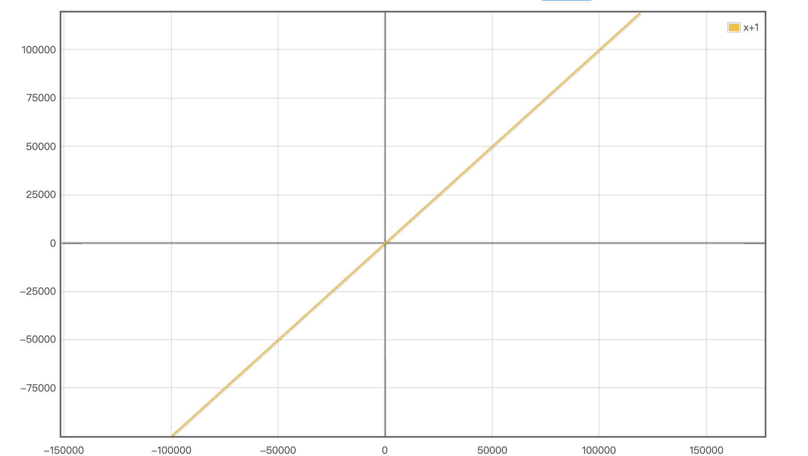
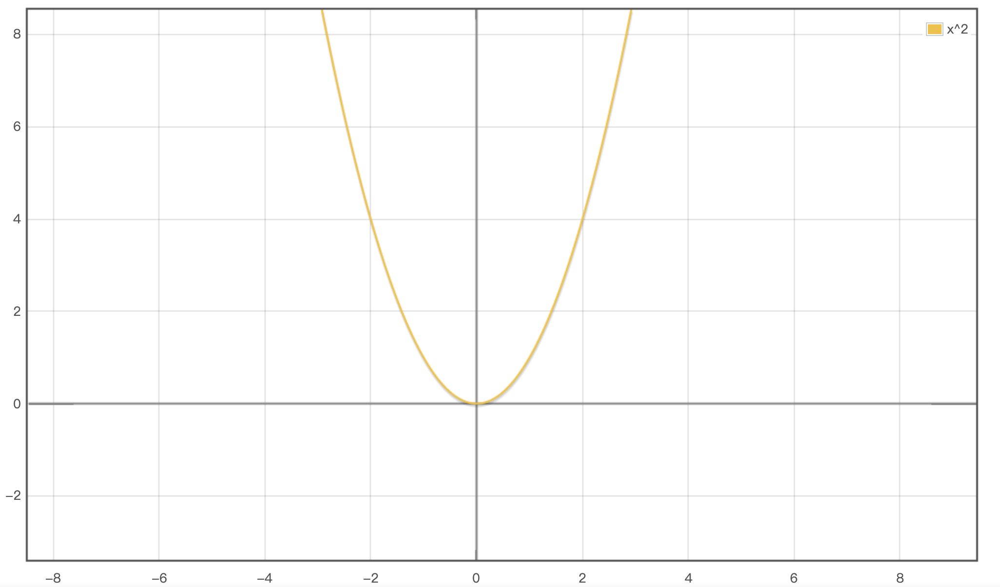
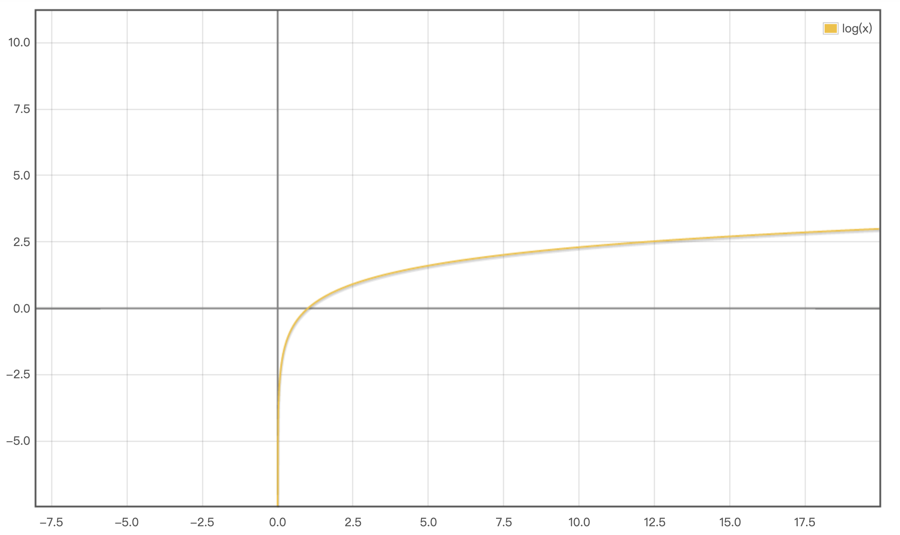

# 4 思考：函数为何非“纯”不可？

函数为何非“纯”不可？这我们就要从函数式编程的数学背景说起了。

若我们试着对“函数式编程”思想追根溯源，会发现它最早正是从数学理论中推导出来的。

> 其中一个最关键的理论叫做“范畴论”，它也是本册的一个重点，我把它放在 [第17节](https://juejin.cn/book/7173591403639865377/section/7175422979646423098) - [21](https://juejin.cn/book/7173591403639865377/section/7175421412075634725) 节进行讲解。

数学家的工作和计算机工程师的工作其实是很相似的。数学家们同样需要处理大量的抽象、以及抽象与抽象之间的关系。

而数学和计算机科学的发展，总是相互影响、相互成就的。

在漫长的相互影响的过程中，它们之间重叠出了许多有趣的交集，其中一个关键的交集，就是“函数”。

## 非“纯“不可的数学背景

### 数学世界的函数 VS 程序世界的函数

众所周知，数学中的函数，和计算机语言中的函数之间，并不能简单地画上等号。

数学中的函数总是遵循着这样的原则：**同一个输入，同一个输出。**

不管是长这样的函数：



还是长这样的函数：



抑或是长这样的函数：



**对于一个给定的自变量 x，总是会有且仅有一个因变量 y 与它对应。**

而计算机科学中的函数，相比之下要灵活的多。

以 JS 为例，如下的函数在 JS 看来是极度正常的：

```js
let a = 1  

function add(x) {
  return a + x
}    

// 输出 3
add(2)   

a = 10

// 输出 12
add(2)
```

对于 add 函数来说，给定一个指定的自变量 `x = 1`，JS 并不能给你保证 `add(x)` 每次的输出都是一致的。

再看一个获取当天日期的函数：

```js
function getToday() {
  return (new Date()).getDate()
}
```

今天是 22 号，我调用 `getToday()`，它自然会返回 22 给我。

如果我明天、后天、大后天再来分别调用一次 `getToday()`，尽管输入都是 `void`，但输出却分别是 23、24、25。

如果人在洛杉矶、刚下飞机的同事赵二狗在他的电脑上运行了这个函数，那么由于时区不同，即便我们都在同一个时刻执行 `getToday()`，两台电脑的输出也是截然不同的。

由此我们可以看出，能够影响 JS 函数输出的因素太多了，函数入参只是众多因素中的一个。

执行上下文中某个外部变量的变化、函数执行宿主的变化、系统时区的变化......甚至空气中温度、湿度的变化（JS 是可以调用传感器 API 的），都会影响 JS 函数的输出。

程序相对于数学来说，是个实实在在的“花花世界”。

JS 允许函数读写外部变量，允许函数引入副作用。这强化了程序的能力，却弱化了程序的数学性。

  


### 数学化的 JS 函数 === 纯函数

既然函数式编程起源于数学，那要想实践函数式编程，咱的函数自然得先能表现出一种“**类似数学**”的行为。

“类似数学”的函数行为是什么样的？就如我们上文所说的，对于一个给定的的输入，它总是给到你相同的输出。

  


说白了，就是**函数除了纯纯的计算，啥也不干**。

而这，恰恰就是我们对纯函数的预期。

“纯函数”本质上是一套规则，是一种约束。

这层约束存在的背景，就是为了让 JS 函数和数学函数的行为对齐。

在这个基础上，JS 语言就可以站在“巨人”的肩膀上，充分汲取数学世界的养分了。

  


## 非“纯”不可的现实意义

如果你打开搜索引擎，检索“纯函数的好处/优势”，然后将所能够检索到结果一一罗列，你会发现这东西的好处似乎有巨大的一箩筐，仿佛它能解决所有的问题——难道纯函数就是传说中的“银弹”吗？

答案当然是否定的。

社区对纯函数优势的见解存在多样性，更多是因为人们看待它的视角不同。

从不同的视角出发，我们确实会发现纯函数能够解决不少具体的小问题。

而它之所以能够解决这些小问题，归根结底还是因为它解决了两个大问题，那就是“**不确定性**”和“**副作用**”。

### 纯函数，高度确定的函数

不纯的函数（Impure function）最直接的问题，就是不确定性——Impure function 的行为是难以预测的；对于同样的输入，Impure function 不能够保证同样的输出。

以测试过程为例：单元测试的主要判断的依据就是函数的输入和输出。如果对于同样的输入，函数不能够给到确定的输出，测试的难度将会陡然上升。

不确定性也会导致我们的代码难以被调试、数据变化难以被追溯、计算结果难以被复用等等。

总而言之一句话：不确定性意味着风险，而风险是万恶之源。

### 纯函数，没有副作用的函数

消除副作用，足以解决函数中大多数的不确定性。

此外，副作用的消除还解决了并行计算带来的竞争问题。

因为不纯的函数有可能访问同一块资源，进而相互影响，引发意想不到的混乱结果。

试想这样一种场景，A函数和B函数都需要向某个文件写入信息，一旦我们先后调用了A、B两个函数，就将触发两个并行的写入过程，进入混乱的竞争态。

而纯函数则不存在这种问题，纯函数的计算完全发生在函数的内部，它不会对外部资源产生任何影响，因此纯函数的并行计算总是安全的。

  


### 纯函数，更加灵活的函数

无论是引入了外部变量的 `add()`函数，还是依赖了 JS 内置对象的 `getToday()` 函数，它们的执行都严重地依赖了函数的运行环境。

更确切地说，这些函数是被**困在了特定的上下文**里。

假如我们将 `add()` 函数导出到一个没有 `a` 变量，或者 `a` 变量类型不为数字的上下文里，那么这个函数将当场失控。

同理，假如我想调用 `getToday()`函数，那我必须先确认当前上下文里的 `Date` 类没有被篡改过。

（当然啦，正常的业务开发里，侵入式地篡改 JS 内置 Class 是非常罕见、也极不推荐大家做的事情）。

这里我想要强调的是，这些不纯的函数是不灵活的。

它们只能在某一个特定的上下文里运行，一旦脱离了这个上下文，就会失去预期中的效用。

纯函数则完全不存在这个弊端，因为它太简单了，它除了入参谁也不认，除了计算啥也不干。

因此，**纯函数是高度灵活的函数，它的计算逻辑在任何上下文里都是成立的。**

### 纯函数可以改善代码质量

从研发效率上来看，纯函数的实践，实际上是将程序的“外部影响”和“内部计算”解耦了。

这间接地促成了程序逻辑的分层，将会使得模块的功能更加内聚。

作为程序员，我们在开发的过程中，不再需要去关注函数可能会造成的外部影响，只需要关注函数本身的运算逻辑。

这和我们之前在《设计模式》中提及的“单一职责”原则有异曲同工之妙——设计模式中，我们强调将“**变与不变**”分离，而纯函数强调将**计算与副作用**分离。

计算是确定性的行为，而副作用则充满了不确定性。这一实践，本质上也是在贯彻“变与不变分离”的设计原则。

这样的逻辑分层将会使得我们的程序更加健壮和灵活，也会促成更加专注、高效的协作。

  

## 副作用不是毒药

对于纯函数来说，副作用无疑是地雷、是毒药。

但对于一个完整的程序来说，副作用却至关重要。

函数生产的是数据，这些数据要想作用于外部世界、创造一些真正的改变，就必须借助副作用。

试想，公司为什么要花钱雇程序员？

因为要做网页，这需要程序员操作DOM；因为要 CRUD，这需要程序员操作DB；因为要读写文件，这需要程序员执行 IO…… 如果我们试图把一个业务程序员的简历用一句话概括，那无外乎“精通实现各种副作用”。

老板和客户不会关心你的代码是否优雅，只会关心那些肉眼可见的副作用——页面渲染、网络请求、数据读写等等是否符合预期。

**会关注代码本身的，有且仅有我们程序员自己。**

对于我们程序员来说，实践纯函数的目的并不是消灭副作用，而是将计算逻辑与副作用做合理的分层解耦，从而提升我们的编码质量和执行效率。

  


## 总结

纯函数是函数式编程的一个最大的前提，也是这坨知识体系的根基。

学习至此，你已经明白了纯函数机制的内涵，也理解了这套机制存在的要义——纯函数的这些规则并不是为了约束而约束，而是为了追求更高的确定性；同时引导我们做更加合理的逻辑分层，写出更加清晰、更善于应对变化的代码。

小册开篇我们讲过，认识函数式编程，需要从特征入手。

函数式编程的三大特征，我们到现在认识了第一个，这一个也是最重要、最容易劝退新手的一个。征服了这座小山包之后，相信足以建立起你对函数式编程的学习自信。

> 作者注：如果你读到这里，惊觉自己还不知道”三大特征“是啥，想必你是跳过了本册的导读部分啦！请狠狠地[戳这里](https://juejin.cn/book/7173591403639865377/section/7173990352116776992)补齐上下文吧！(*^▽^*)

下一节我们仍将延续对特征的分析，解读“函数是一等公民”这一特征的内涵。  


  （阅读过程中有任何想法或疑问，或者单纯希望和笔者交个朋友啥的，欢迎大家添加我的微信xyalinode与我交流哈~）