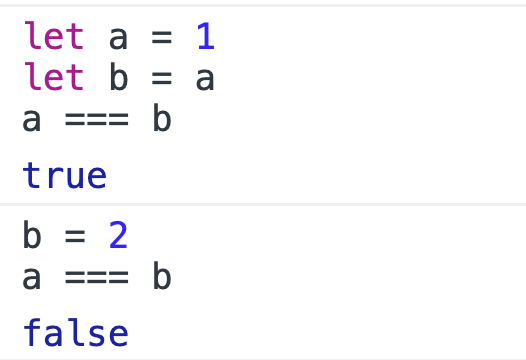
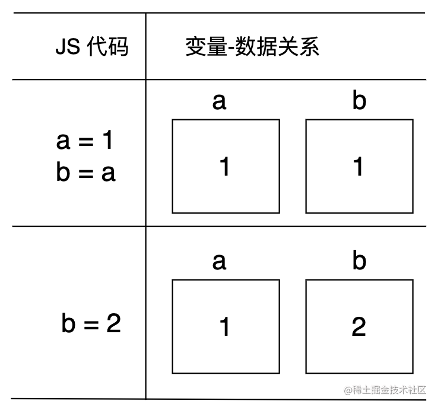
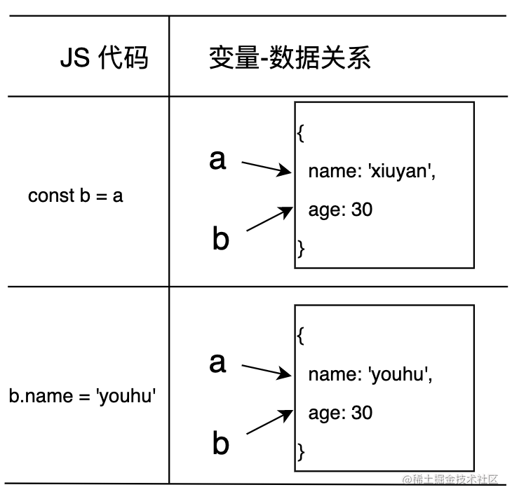
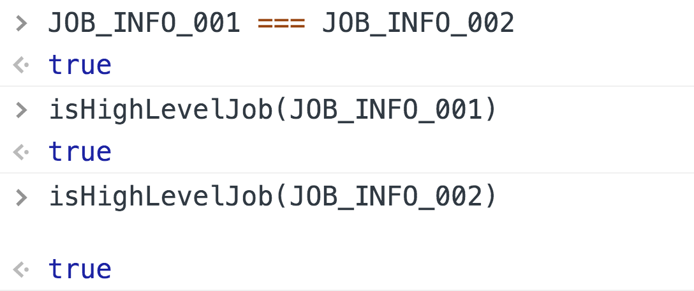

# 6 不可变数据：函数纯度的“安全帽”

## JS 世界的“不可变数据”

### 值类型与引用类型

“不可变”是对数据特征的描述，既然说到数据，咱们不妨再回头看一下 JS 世界里的 7 个数据类型：

-   String
-   Number
-   Boolean
-   null
-   undefined
-   Symbol
-   Object

> 作者注：7种数据类型出自 《JavaScript 高级程序设计》第4版 ，截止小册发行日，ES 标准还新增了一个新的数据类型 BigInt，不过这个不影响我们后续的讨论
  


JS中的数据类型，整体上来说只有两类：值类型（也称基本类型/原始值）和引用类型（也称复杂类型/引用值）。

其中值类型包括：String、Number、Boolean、null、undefined、Symbol。这类型的数据最明显的特征是**大小固定、体积轻量、相对简单。** 

而排除掉值类型，剩下的 Object 类型就是**引用类型（复杂类型）** 。这类数据相对**复杂、占用空间较大、且大小不定。**

保存值类型的变量是按值访问的， 保存引用类型的变量是按引用访问的。这两类数据之间最大的区别，在于**变量保存了数据之后，我们还能对这个数据做什么**。   

### 不可变的值，可变的引用内容

**值类型的数据无法被修改**，当我们修改值类型变量的时候，本质上会创建一个新的值。

我们一起来看看下面这个例子：

```js
let a = 1
let b = a

// true
a === b

b = 2

// false
a === b
```

这段代码对应的控制台执行结果如下图所示：



当我把 `a` 赋值给 `b` 的时候，相当于在内存里开辟了一个新的坑位，然后将此时此刻的 a 值拷贝了一份、塞了进去。

从这一刻开始，**`a` 和 `b` 各据一坑，界限分明**，谁也不会再影响谁。


当我修改 `b` 值的时候，相当于解除了 `b` 变量和旧的 `b` 值（也就是 `1`）之间的关联关系，然后建立了 `b` 变量和新的 `b` 值（也就是 `2`）之间的关联关系。此时 `b` 的值已经发生了变化，但 `a` 坑里的 `1` 纹丝不动。




在这整个过程中，出现的值有三个：**a 值 = 1、b 值（初始值） = 1、b 值（修改后） = 2**。

试想，我们能够把数字 `1` 修改为数字 `2` 吗？当然是不行的，1 就是 1，2 就是 2。我们最多只能调整数字 `1`、`2` 和变量 `b` 之间的映射关系。

也就是说，1、1、2 这三个数字**从创建开始就不会再发生任何改变**。

我们修改 b 值的时候，其实是在**修改数字 1、2 与“b 变量”之间的关系**，而并不是在修改数字本身。

**像数字类型这样，自创建起就无法再被修改的数据，我们称其为“不可变数据**”。

对应到 JS 的数据分类上，“值类型”数据均为不可变数据。

但引用类型就没有那么好对付了。

在引用本身不变的情况下，引用所指向的内容是可以发生改变的。

请大家看下面这段代码：

```js
const a = {
  name: 'xiuyan',
  age: 30
}

const b = a


// true 
a === b 

b.name = 'youhu'   
 
// true
a === b 
```

对于引用类型来说，当我把 a 对象赋值给 b 时，并不会发生“开辟一个新的 b 对象坑位、放入一份 a 对象的副本”这种事——JS 会直接把 a 的引用赋值给 b（如下图）。


引用类型的赋值过程，本质上是给同一块数据内容起一个新的名字。    
赋值结束后，a 和 b 都会指向内存中的同一块数据。而这个数据，是可以被修改的（如下图）：




`b.name` 被修改后，a、b 两个引用的指向没有发生任何变化——坑还是那个坑，但是坑里存的对象的内容却不一样了。  
对于引用类型来说，我们总是可以像楼上这样，在数据被创建后，随时修改数据的内容。     
**像这种创建后仍然可以被修改的数据，我们称其为“可变数据”。**

  


  


## 为什么函数式编程不喜欢可变数据

我们首先来看一个简单的例子。

### 编码实例：可变数据如何“偷袭”我们的程序

假如你和你的好兄弟老王共同维护公司的招聘网站。在基础层，老王负责开发一系列的工具函数；在业务层，你负责将基础层的工具函数进行组装，以实现具体的业务需求。

老王的写模块里有这样一个函数，它可以修改招聘需求中的“Level（层级）”信息：

```js
function changeJobLevel(jobInfo, level) {
    const newLevelJob = jobInfo
    newLevelJob.level = level
    return newLevelJob  
}    
```

而你的模块里有这样一个函数，它可以通过检验招聘需求中的层级信息，来检验这是否是一则面向高管群体的招聘。函数编码如下：

```js
function isHighLevelJob(jobInfo) {
    return jobInfo.level >= 9
}   
```

这个检验结果非常关键，它直接决定了这一条招聘需求的去向。

若 `isHighLevelJob()`判断某需求为高管需求，则此需求在发布时不会进入公司的招聘池，而是会直接被转发到猎头公司的招聘池。 相关的发布函数示意如下：

```js
function releaseJobs(jobList) {
  jobList.forEach((job)=>{
    if(isHighLevelJob(job)){
      // 转发给猎头公司
    } else {
      // 转发到公司内部的池子里去
    }
  })
}
```

假设现存的招聘数据中已经有这样一条需求描述：

```js
const JOB_INFO_001 = {level: 7, workTime:2 , type:'engineer', city:'New York'} 
```

这天你接到一个新的需求，内容是：    
想要创建一条各方面条件都和 `JOB_INFO_001` 一致，但是 level 为 10 的招聘需求 `JOB_INFO_002`。随后，将 `JOB_INFO_001` 和 `JOB_INFO_002` 一起发布。

于是你刷刷两下子，迅速组装出了这样一坨业务代码：

```js
import { changeJobLevel } from '老王的模块'
import { isHighLevelJob, releaseJobs} from '我自己的模块'   

const JOB_INFO_001 = {level: 7, workTime:2 , type:'engineer', city:'New York'} 

// 基于 JOB_INFO_001，生成一个 level 为 10 的 JOB_INFO_002
const JOB_INFO_002 = changeJobLevel(JOB_INFO_001, 10)   

// 组装两条数据为一个发布数组
const releaseList = [JOB_INFO_001, JOB_INFO_002]

// 发布两条数据
releaseJobs(releaseList, isHighLevelJob)
```

一段危险的业务代码就此完工。你兴冲冲地发布上线，结果却发现酿成大错——`JOB_INFO_001` 和 `JOB_INFO_002` 这两条需求竟然都被转发进了猎头需求池，公司的猎头预算瞬间翻了一倍。

经过上文对值类型和引用类型特性的回顾，相信许多同学早就看出了问题的所在——`changeJobLevel()` **函数直接修改了入参** `jobInfo` **的内容**，这导致 `JOB_INFO_001` 也发生了改变。

尽管 `changeJobLevel()` 在函数的第一行就象征性地把入参赋值给了一个新的变量“`newLevelJob`”，但这并没有什么卵用——正如我们在上文所分析的那样，对于 `Object` 类型来说，这样的赋值动作仅仅是把 `jobInfo` 的引用赋值给了 `newLevelJob` ，本质上相当于给同一个对象起了两个名字。

因此，`changeJobLevel()` 函数修改 `newLevelJob`，其实就是在修改 `JOB_INFO_001`。

同理，将 `JOB_INFO_001` 以传参的形式赋值给 `jobInfo` 的过程、以及将 `changeJobLevel()` 返回的对象赋值给 `JOB_INFO_002` 的过程，也都仅仅是“取新名字”的过程。

也就是说，在整段代码中，`jobInfo`、`newLevelJob`、`JOB_INFO_001` 和 `JOB_INFO_002` 这四个“名字”指向的对象其实是同一个。

因此，当 `changeJobLevel()` 执行完毕时，`JOB_INFO_001` 和 `JOB_INFO_002` 是严格等于的关系，它们共同指向一条 level 为 10 的招聘需求：



相应地，这两个变量都将会被校验为“高管需求”，并被转发至猎头需求池。

  


这就是一个典型的由可变数据所酿成的惨案。

### 思考：可变数据的危险之处

我们当然可以说，这个惨案是由老王一手造成的——他的函数编码不够规范，导致我们在上层的业务层进行调用时，无法达到预期的结果。

确实，老王跪了，他跪给了 JS 语言的灵活性，跪给了可变数据的不可捉摸。

他或许也曾经想过，要把外部变量和函数变量隔绝开，否则，他也没有必要在函数的第一行就重新做了一遍对象赋值。

只是，智者千虑也必有一失。他忘了，给对象穿个新马甲根本解决不了问题。如果可以，他一定会重新好好审视一遍**可变数据的危险之处**，那么他就会清醒地意识到，可变数据总是存在以下问题：

#### 可变数据使函数行为变得难以预测

  
在上面这个案例中， `isHighLevelJob()` 方法是你写的，`changeJobLevel()` 方法是隔壁老王写的。  
你俩开发函数时各占用了一个分支，你本地自测如丝般顺滑，甚至老王自己的本地自测也如丝般顺滑（他很有可能只会校验 `changeJobLevel()` 本身的功能，而无法察觉到函数对外部环境的影响）。

当且仅当你们的代码一起进入主分支时，问题才会被暴露出来。  
也就是说，开发者对两个函数的行为的预测，在合入主分支后就失效了。

这正是可变数据带来的最根本的问题——**不确定性**。

可变数据会使数据的变化变得隐蔽，进而使函数的行为变得难以预测。

在函数式编程这种范式下，我们校验一个函数有效性的关键依据，永远是“**针对已知的输入，能否给出符合预期的输出**”，这样的校验非常清晰、且容易实现。

而可变数据的出现则将会使函数的作用边界变得模糊，进而导致使用者、甚至开发者自身都难以预测它的行为最终会指向什么样的结果。

毫无疑问，这也会大大增加测试的难度。

  


#### 可变数据使函数复用成本变高

可变数据的存在，要求我们不得不在调用一个函数之前，先去了解它的逻辑细节、定位它对外部数据的依赖情况和影响情况，由此来确保调用动作的安全性。

但很多情况下，当我们使用某一个函数的时候，我们会默认它是一个黑盒——无论是我今天去 npm 上拉下来一个第三方包，还是说我去其他业务的文件夹下借隔壁老王写的函数来用，我们关注的都是这个**函数的效用、函数的输入与输出，而不会去关注它的实现细节**。

就好像我们使用酸奶机之前，最多读一下说明书，而不会拆开它的壳子研究一下它装了几根电阻丝一样。

因此，我们有必要确保，这个黑盒是可靠的、受控的。

**一个可靠、受控的黑盒，应该总是将变化控制在盒子的内部，而不去改变盒子外面的任何东西**。   
这就像我们往酸奶机里倒入了酵母和牛奶，只期望它能产出酸奶，而不希望它引燃旁边的烤箱一样。

  


要想做到这一点，就必须**把可变数据从我们的函数代码里铲除干净。**


## 不可变数据的本质：函数纯度的“安全帽”

行文至此，大家可能已经发现了一个华点—— **“可变数据”带来的这些麻烦，和“副作用”带来的麻烦，长得还挺像。**

实际上，在我们编写函数的过程中，“可变数据”是最容易引发副作用的因素之一。强调“不可变数据”，实际上仍然是在强调函数的纯度—— **“坚持纯函数，避免副作用**”，这是函数式编程的实践**宗旨**。

  


“不可变数据”正如一顶牢牢扣在我们程序员脑袋上的**安全帽**，它从实践的角度，对我们的编码行为作出了更加具体的约束，确保我们能够最大限度地输出纯净、安全的代码。

  


在下一节，我们就将更进一步地探讨不可变数据，并掌握在 JS 世界里应用不可变数据的几种主要姿势。  
  
 （阅读过程中有任何想法或疑问，或者单纯希望和笔者交个朋友啥的，欢迎大家添加我的微信xyalinode与我交流哈~）