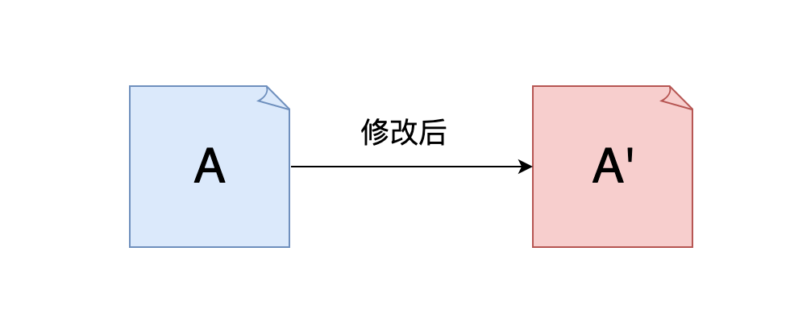
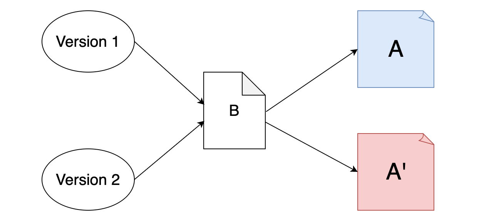
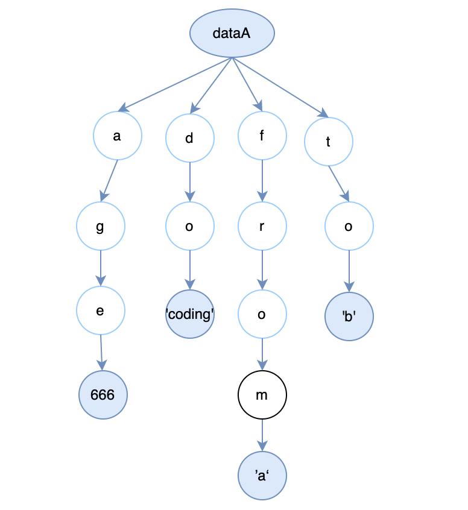
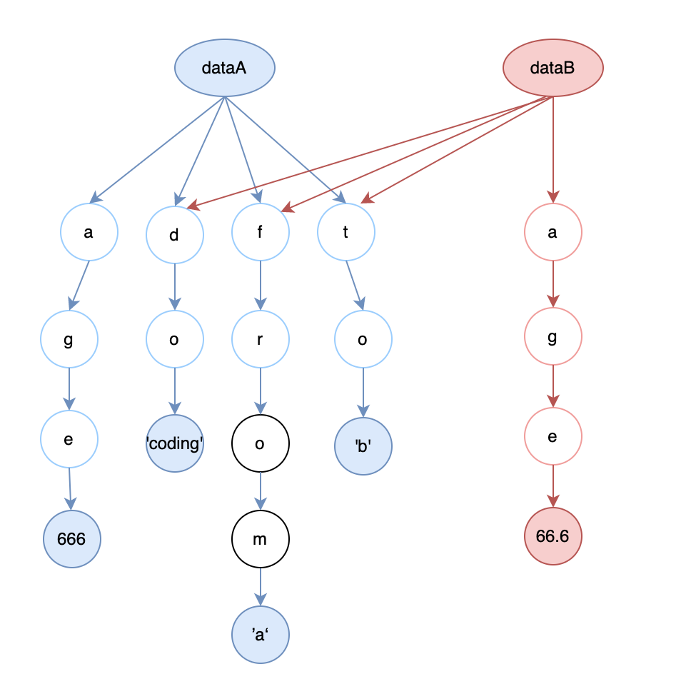

# 8 掌握“快照”思维——如何像创建一个 git commit 一样创建数据变更？

## 拷贝不是万能解药

通过上一节的学习，大家已经知道，用拷贝代替修改，是确保引用类型数据不可变性的一剂良药。

然而，拷贝并非一个万能的解法。拷贝意味着重复，而重复往往伴随着冗余。

试想，如果某一个函数的入参是一个极为庞大的对象，比如说——某一个 PC Admin在启动时拉取的 `MetaData` （应用元信息）可能多达数千个字段。

我们就假设总的字段数有 1000 个，一般来说，常规的状态变更也就只会调整其中一两个字段。

如果我们为此拷贝整个 MetaData，那么每次变更冗余的字段量就高达九百多条，**数据冗余率接近百分之百**。

  


又或者，我们面对的是一个状态变更相当密集的应用，比如说——某一个营销活动的 H5 小游戏。

用户看似不经意地在游戏页面上划拉几下子，背后可能伴随着几十上百个状态的变化，而这些变化往往需要在极为短暂的时间里完成、并且触发相应的渲染反馈。

这种情况下，数据的**拷贝行为是非常高频的，** 每次拷贝都会多多少少伴随一些冗余数据。

**当数据规模大、数据拷贝行为频繁时，拷贝将会给我们的应用性能带来巨大的挑战。**

拷贝出来的冗余数据将盘踞大量的内存，挤占其它任务的生存**空间**；此外，拷贝行为本身也是需要吃 CPU 的，持续而频繁的拷贝动作，无疑将拖慢应用程序的反应**速度**。

因此，对于**状态简单、逻辑轻量**的应用来说，拷贝确实是一剂维持数据不可变性的良药。

但是对于**数据规模巨大、数据变化频繁**的应用来说，拷贝意味着一场性能灾难。

有没有什么办法，能够既保住拷贝的效果，又避开拷贝的弊端呢?

当然有啦！

我们接下来就将会从持久化数据结构开始，探讨“安全帽”的进阶玩法。

## 回顾 Immutable.js

首先我想要和大家讨论的，是“immutable.js”这个东西。

我想许多同学、尤其是 React 开发者对它应该不会感到陌生。

即便如此，我还是想在这里为入门阶段的同学做一个快速的科普，如果你已经对它熟稔于心，完全可以跳过这个小节。

Immutable 直译过来是“不可变的”，正如上文所说，ImmutableJS 是对“不可变值”这一思想的贯彻实践。它在 2014 年被 Facebook 团队推出，Facebook 给它的定位是“实现持久化数据结构的库”。

Immutable.js !== 持久化数据结构，但 Immutable.js 毫无疑问是持久化数据结构在前端领域影响最深远的一次实践。

对于许多人来说，正是 Immutable.js 带他们走入了函数式编程的世界。

还记得 2016 年前后，我圈最流行的事情似乎就是为各种 React 应用引入 Immutable.js，因为 React 不喜欢可变数据，而 Immutable.js 恰好实现了不可变数据。

具体如何做到的呢？我这里用 Immutable.js 写了一个 demo，大家可以简单感受一下：

```js
// 引入 immutable 库里的 Map 对象，它用于创建对象
import { Map } from 'immutable'

// 初始化一个对象 baseMap
const originData = Map({
  name: 'xiuyan',
  hobby: 'coding',
  age: 666
})

// 使用 immutable 暴露的 Api 来修改 baseMap 的内容
const mutatedData = originData.set({
  age: 66.6
})

// 我们会发现修改 baseMap 后将会返回一个新的对象，这个对象的引用和 baseMap 是不同的
console.log('originData === mutatedData', originData === mutatedData)
```

Immutable.js 提供了一系列的 Api，这些 Api 将帮助我们确保数据的不可变性。

从代码上来看，它省掉了我们手动拷贝的麻烦。

从效率上来说，它在底层应用了持久化数据结构，解决了暴力拷贝带来的各种问题。

那么持久化数据结构到底是何方神圣，它又凭什么能解决暴力拷贝带来的问题呢？

其实，我们在日常工作中，经常接触一个和它很像的东西，那就是 git commit。

## 应对变化的艺术——Git “快照”是如何工作的

想必大家多少都听说过，在创建 commit 时，git 会对整个项目的所有文件做一个“快照”。

但“快照”究竟是什么？

一些同学认为，所谓“快照”仅仅是对当前所有文件的一次拷贝而已。

这显然是经不起推敲的——若是每次 commit 都为当前文件创建一次完整的拷贝，那么纵使电脑有再大的存储空间，也顶不住咱维护一个 monorepo 呀。

事实上，“快照”记录的并不是文件的内容，而是文件的索引。

当 commit 发生时， git 会保存当前版本所有文件的索引。

对于那些没有发生变化的文件，git 保存他们原有的索引；对于那些已经发生变化的文件，git 会保存变化后的文件的索引。

假设一个项目中有 A、B 两个文件，其中 A 文件被修改了，而 B 文件保持不变。

我们将修改后的新的 A 文件的索引记为 A'（如下图）。



在变化发生后，A 和 A' 是共存的，变化前的那一次快照指向 A，变化后的这一次快照指向 A'。

而未被修改到的 B 文件，将会原封不动地呆在原地，被新版本的快照所复用，如下图所示：



也就是说，git 记录“变更”的粒度是文件级别的。

它会同时保有新老两份文件，不同的 version，指向不同的文件。

  


这里我们简单总结一下：

**快照的本质是对索引的记录。**

在生成快照的过程中，对于那些没有发生变化的文件，git 会沿用他们固有的索引。

对于那些已经发生变化的文件，变化前、变化后实际上对应着内存里的两个文件，也就相应地有新、老两个不同的索引，本次快照将会记录那个新文件对应的索引。

如果我们尝试给快照进行编号和记录，那么我们就能够通过这些编号定位到任何一个快照，也就可以定位到任何一个版本的项目文件全集。

我们之所以可以通过切换 git commit 来查看不同版本的文件，也正是因为 commit 中记录了快照的信息。

讲 git 讲到现在，只希望大家能记住一个核心的思想：

**Git 快照保存文件索引，而不会保存文件本身。**

**变化的文件将拥有新的存储空间+新的索引，不变的文件将永远呆在原地。**

这是 git 应对变化的艺术，也是持久化数据结构的核心思想。

## 理解“数据共享”：从“快照”到“安全帽”

和 git “快照”一样，持久化数据结构的精髓同样在于“**数据共享**”。

数据共享意味着将“变与不变”分离，确保只有变化的部分被处理，而不变的部分则将继续留在原地、被新的数据结构所复用。

不同的是，在 git 世界里，这个“变与不变”的区分是文件级别的；而在 Immutable.js 的世界里，这个“变与不变”可以细化到数组的某一个元素、对象的某一个字段。

举个例子：

假如我借助 Immutable.js 基于 A 对象创建出了 B 对象。

A 对象有 4 个字段：

```
const dataA = Map({
  do: 'coding',
  age: 666,
  from: 'a',
  to: 'b'
})
```

B 对象在 A 对象的基础上修改了其中的某一个字段(age)：

```
// 使用 immutable 暴露的 Api 来修改 baseMap 的内容
const dataB = dataA.set({
  age: 66.6
})
```

那么 Immutable.js 仅仅会创建变化的那部分（也就是创建一个新的 age 给 B)，并且为 B 对象生成一套指回 A 对象的指针，从而复用 A 对象中不变的那 3 个字段。

就像这样：


看上去很棒对不对？

那么 Immutable.js 是如何做到这一点的呢？

## 如何实现数据共享

为了达到这种“数据共享”的效果，持久化数据结构在底层依赖了一种经典的基础数据结构，那就是 Trie(字典树）。

> 作者注：
> 
> 无论你有没有听说过这玩意儿，都不影响你阅读本文。不用慌，不要跑，继续往下读就行了。

如果你确实对 Trie 数据结构本身有浓厚兴趣，请狠狠地点击本文末尾的推荐阅读链接。

在 Trie 的加持下，我们存储一个对象的姿势可以是这样的：



当我们创建对象 B 的时候，我们可以只针对发生变化的 age 字段创建一条新的数据，并将对象 B 剩余的指针指回 A 去，，如下图：



  


在图示中，B显然已经区别于A，是一个新的对象、具备一个新的索引。B 通过和 A 共享不变的那部分数据，成功地提升了管理数据的效率。

## 总结

通过本节的学习，我们不仅理解了 Immutable.js 的工作机制，也见识了 git 快照的索引管理艺术。

正如开篇所言，对于许多前端开发者来说，是 Immutable.js 带他们走入了函数式思想的世界。

作为一本函数式编程小册，本文在剖析 Immutable.js 时，着力点在于“数据共享”、“变与不变”这些与 **Immutability** 密切相关的思想。

但作为一个优秀的前端库，它值得我们学习的地方远不止于此。

这里强烈推荐大家去阅读一下它的源码，你将会学到非常多的数据结构和算法知识，包括但不限于字典树、位分区及树压缩算法等。

## 推荐阅读

[ImmutableJS Docs](https://immutable-js.com/)

[ImmutableJS Source Code](https://github.com/immutable-js/immutable-js)

[Trie in Wiki](https://zh.m.wikipedia.org/zh-hans/Trie)

[Trie Datastructure in Javascript](https://learnersbucket.com/tutorials/data-structures/trie-data-structure-in-javascript/)

[10 Best JavaScript Trie Libraries](https://openbase.com/categories/js/best-javascript-trie-libraries)


 （阅读过程中有任何想法或疑问，或者单纯希望和笔者交个朋友啥的，欢迎大家添加我的微信xyalinode与我交流哈~）