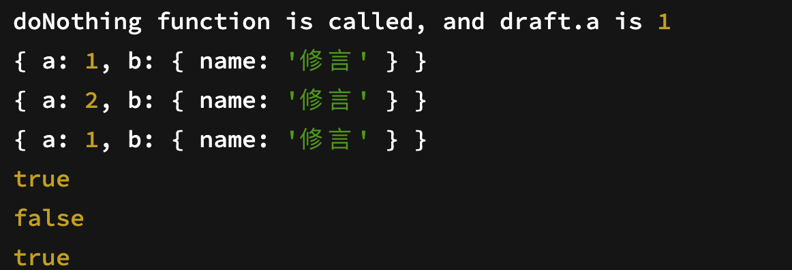
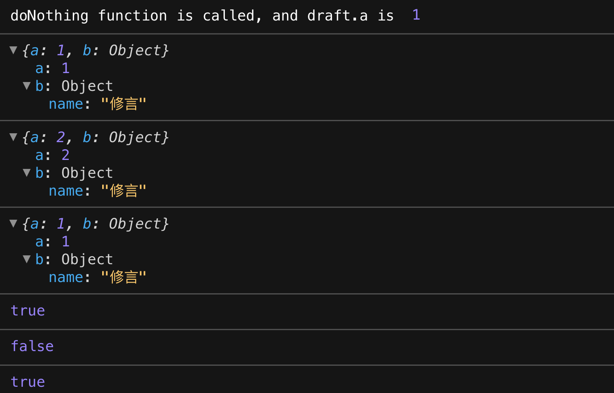

# 9 思考：持久化数据结构，是 Immutability 的唯一答案吗？

## React 与函数式编程

我所在的团队使用 React 作为主要技术栈已经有超过五年的时间了。因此，我们在招聘前端工程师时会格外注意 React 能力的考察。

而 React，它生来自带函数式光环。

无论是`  UI = f(data)  `的宏观设计，还是 `setState` API 对“不可变值”的预期，抑或是好基友 Redux 中以纯函数形态存在的 `reducer`...... 这些无一不彰显着它和函数式思想的暧昧关系。

当然，不得不提的还有随着 React16+ 逐渐普及开来的函数式组件+ Hooks 等等。


> 函数式编程对现代前端框架、对前端生态的影响，我们在小册的后半程会单开章节来讨论。此处不多赘述。

  


我相信，对许多前端工程师来说，React 才是大家入门函数式思想的起点。

也正因为如此，我们非常喜欢在 React 系列的问题结束后，和候选人聊一聊函数式编程。

## 关于 Immutablility（不可变性） 的刻板印象

在许多团队的函数式编程题库里，“数据不可变性如何在前端业务中落地”都是一道高频考题。

遗憾的是，这道题目的答案多年来也几乎是“固定”的，八成左右的候选人的答案都有且仅有一个——Immutable.js/持久化数据结构。

如果是在 2016 年，这个答案确实足以成为问题的终点。

但在今天，很多时候面试官们会忍不住追问：Immutable.js/持久化数据结构是唯一的答案吗？

不少同学仍然会回答“是”，尽管这个“是”里夹带了那么些许的不确定，但它足以反映社区对 Immutability 的刻板印象。

这一节我希望大家学到的东西，就是如何对这个问题说“不”。

Immutable.js 对于前端函数式编程来说，有划时代的意义。许多同学正是通过它才了解到“不可变数据”、“持久化数据结构”等概念。

但它终究也只是实现 Immutability 的一种途径。在活跃的函数式社区中，优秀的 Immutability 实践还有很多——比如，Immer.js。

## Immer.js，一个傻瓜式的 Immutability 解决方案

Immer.js 是我在 2019 年最喜欢的前端库之一。在理解了 Immer.js 的设计思想和工作方式之后，我将团队主要仓库的不可变数据的解决方案全部从 Immutable.js 迭代为了 Immer.js。

作为一个实用主义者，我至今没有后悔这个决定。

因为用 Immer.js 写代码，真的是太爽啦！(*^▽^*)

不需要操心深拷贝浅拷贝的事儿，更不需要背诵记忆 Immutable.js 定义的一大堆 API，你所需要做的，仅仅是在项目里轻轻地 Import 一个 produce（请看下文代码，解析在注释里）：

  


```js
import produce from "immer"

// 这是我的源数据
const baseState = [
    {
        name: "修言",
        age: 99
    },
    {
        name: "秀妍",
        age: 100
    }
]

// 定义数据的写逻辑
const recipe = draft => {
    draft.push({name: "xiuyan", age: 101})
    draft[1].age = 102
}

// 借助 produce，执行数据的写逻辑
const nextState = produce(baseState, recipe)
```

这个 API 里有几个要素：

-   (base)state：源数据，是我们想要修改的目标数据
-   recipe：一个函数，我们可以在其中描述数据的写逻辑
-   draft：recipe 函数的默认入参，它是对源数据的代理，我们可以把想要应用在源数据的变更应用在 draft 上
-   produce：入口函数，它负责把上述要素串起来。具体逻辑请看下文分解。

记住上述要素的基本特性，我们接下来要冲一波源码了xdm！

## Immer.js 是如何工作的

Immer.js 实现 Immutability 的姿势非常有趣——它使用 Proxy，对目标对象的行为进行“元编程”。

### 回顾 Proxy

Proxy 是 ES6 中引入的一个概念。这里为了确保所有知识层次的同学都具备足够清晰的上下文，我们先快速地对 Proxy 相关的要点做一个回顾。
>  Proxy 对象用于创建一个对象的代理，从而实现基本操作的拦截和自定义（如属性查找、赋值、枚举、函数调用等）。
                                                   ——MDN


Proxy 是 JS 语言中少有的“元编程”工具。

所谓“元编程”，指的是对编程语言进行再定义。

借助 ES6 暴露给我们的 Proxy 构造函数，我们可以创建一个 Proxy 实例，并借助这个实例对目标对象的一些行为进行再定义。

举个例子（解析在注释里）：

```js
// 定义一个 programmer 对象
const programmer = {
  name: 'xiuyan',
  age: 30
}

// 定义这个对象的拦截逻辑
const proxyHandler = {
  // obj 是目标对象， key 是被访问的键名
  get(obj, key) {
    if(key === 'age')
      return 100
    return obj[key]
  }
}

// 借助 Proxy，将这个对象使用拦截逻辑包起来
const wrappedProgrammer = new Proxy(programmer, proxyHandler)

// 'xiuyan'
console.log(wrappedProgrammer.name)
// 100
console.log(wrappedProgrammer.age)
```

如这段代码所示， Proxy 接收两个参数，第一个参数是你需要处理的目标对象，第二个参数同样是一个对象，在这个对象里，描述了你希望对目标对象应用的拦截/代理行为。

在这个例子里，我借助 `proxyHandler` 拦截了目标对象（`programmer`）的 `getter` 方法，代理了 `programmer` 对象的访问行为。

每次访问 `wrappedProgrammer` 时，JS 不会执行 `programmer` 对象的默认行为（返回 `obj[key]`），而是会执行 `proxyHandler.get()` 方法所定义的行为：若访问的 key 是 `age`，则固定返回 100，否则返回 `obj[key]`。

（同理，我们也可以对目标对象的 `setter` 方法进行拦截，此处不再赘述）。

总结一下：借助 Proxy，我们可以给目标对象创建一个代理（拦截）层、拦截原生对象的某些默认行为，进而实现对目标行为的自定义。

那么 Proxy 是如何帮助 Immer.js 实现 Immutability 的呢？

### Produce 关键逻辑抽象

正如上文所说，使用 Immer.js，你只需要在项目里轻轻地 Import 一个名为 `produce` 的 API。

Immer.js 的一切奥秘都蕴含在 `produce` 里，包括其对 Proxy 的运用。

那么 `produce` 是如何工作的呢？

Immer.js 的源代码虽然简洁，但整个读完也是个力气活。这里我们只关注 `produce` 函数的核心逻辑，我将其提取为如下的极简版本（解析在注释里）：

```js
function produce(base, recipe) {
  // 预定义一个 copy 副本
  let copy
  // 定义 base 对象的 proxy handler
  const baseHandler = {
    set(obj, key, value) {
      // 先检查 copy 是否存在，如果不存在，创建 copy
      if (!copy) {
        copy = { ...base }
      }
      // 如果 copy 存在，修改 copy，而不是 base
      copy[key] = value
      return true
    }
  }

  // 被 proxy 包装后的 base 记为 draft
  const draft = new Proxy(base, baseHandler)
  // 将 draft 作为入参传入 recipe
  recipe(draft)
  // 返回一个被“冻结”的 copy，如果 copy 不存在，表示没有执行写操作，返回 base 即可
  // “冻结”是为了避免意外的修改发生，进一步保证数据的纯度
  return Object.freeze(copy || base)
}
```

接下来我尝试对这个超简易版的 producer 进行一系列的调用（解析在注释里）：

```
// 这是我的源对象
const baseObj = {
  a: 1,
  b: {
    name: "修言"
  }
}

// 这是一个执行写操作的 recipe
const changeA = (draft) => {
  draft.a = 2
}


// 这是一个不执行写操作、只执行读操作的 recipe
const doNothing = (draft) => {
  console.log("doNothing function is called, and draft is", draft)
}

// 借助 produce，对源对象应用写操作，修改源对象里的 a 属性
const changedObjA = produce(baseObj, changeA)

// 借助 produce，对源对象应用读操作
const doNothingObj = produce(baseObj, doNothing)

// 顺序输出3个对象，确认写操作确实生效了
console.log(baseObj)
console.log(changedObjA)
console.log(doNothingObj)

// 【源对象】 和 【借助 produce 对源对象执行过读操作后的对象】 还是同一个对象吗？
// 答案为 true
console.log(baseObj === doNothingObj)
// 【源对象】 和 【借助 produce 对源对象执行过写操作后的对象】 还是同一个对象吗？
// 答案为 false
console.log(baseObj === changedObjA)
// 源对象里没有被执行写操作的 b 属性，在 produce 执行前后是否会发生变化？
// 输出为 true，说明不会发生变化
console.log(baseObj.b === changedObjA.b)
```

下图为上述代码的执行结果 `console` ：



如果你想使用 `produce` 本体验证上述用例，你只需要在项目里引入 `produce` 后，注释掉我们自定义的 `produce` 即可。

`produce` 本体运行该测试用例的执行结果 `console` 如下：



两边的输出完全一致，也就是说至少对这个基础用例来说，我们的极简版 `produce` 是可以复刻 `produce` 本体的表现的。

而 Immer.js 对 Proxy 的巧思，恰恰就藏在这个极简 `produce` 里。

欲知巧思何在，且看下回分解~

（阅读过程中有任何想法或疑问，或者单纯希望和笔者交个朋友啥的，欢迎大家添加我的微信xyalinode与我交流哈~）