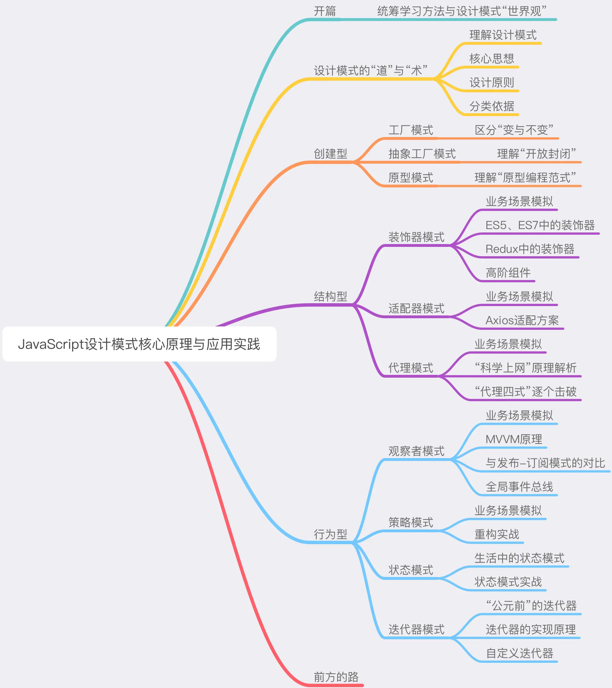

# 1.开篇：前端工程师的成长论

即使是在瞬息万变的前端领域，也存在一些具备“一次学习，终生受用”特性的知识，比如[前端性能优化](https://juejin.cn/book/6844733750048210957/section/6844733750031417352#heading-4)的核心思路，再比如我们这次要展开来讲的JavaScript设计模式。   

> 在软件工程中，设计模式（Design Pattern）是对软件设计中普遍存在（反复出现）的各种问题，所提出的解决方案。                  ——维基百科    

烹饪有菜谱，游戏有攻略，每个领域都存在一些能够让我们又好又快地达成目标的“套路”。在程序世界，编程的“套路”就是设计模式。

授人以鱼，不如授人以渔。在尝试学习一门知识之前，最重要的事情是搞清楚这块知识本身的意义（为什么要学？）、作用（学了它能干嘛？）和特性（怎么学比较好？），从而建立起自己的全局观。这个过程和知识本身同样重要，也正是这一节我们要着重解决的几个问题。

此外，作为小册作者，更作为大家的同行，我也想借这个机会，跟大家聊一些更实在的东西，比如聊聊我们前端工程师怎么~~变秃~~变强的话题。这部分内容位于本节的“前言”部分，如需跳读，大家直接往下拉到第二小节即可。

## 前言

下定决心写这本小册，是在2018年的年末。    

相信 18 年下半年到现在（19年初）这段时间，大家都对这样一个事情深有体会： **贩卖焦虑的人越来越多了**。    

许多技术公众号频繁以带有“危机”“寒冬”这样的标题 po 文，技术社区也开始反复出现类似于“前脚对需求后脚被解约”这样不太好的消息。伴随这些声音而来的，是同行们数不清的自我怀疑：
- 互联网的风口要没了，要不要先走为敬；
- 写前端/写后端/写客户端/写算法没前途了，要不要趁早转行；
- 程序员市场是不是已经饱和了，我还能不能分到一杯羹
- ······

一夜之间，有更多的人开始思考是向前走还是向后退的问题。   

职业选择也好、人生规划也罢，这些东西都因人而异，每个人的想法都值得我们去尊重。咱们今天不聊焦虑，也不灌鸡汤，我就想简单地和大家说说我所看到的。

可能和很多同学想的不一样，我所体验到的现实是：**前端团队真的很缺人；前端，真的太难招了。**

单说 18 年这一年，我所了解到的前团队、现团队和兄弟团队都在招人：用人这个需求就没断过。所以说缺人，是真缺；说招不到，也是真招不到。很多情况下，受试者的**编码能力、设计思维和计算机基础**都不那么经得起推敲，纵使有再多的 HC 也白搭。行业没有以前那么“景气”了，这不假，但情况远没有糟糕到人人自危的程度。

当下的这波寒潮，带来的主要问题是曾经站在风口上就能飞起来的猪，现在飞不起来了。但没关系，努力修炼修炼，做鹰就不怕了。

从目前我所了解到的、肉眼可见的巨大的前端工程师的数量缺口来看，**前端领域距离人才饱和还有很长很长一段路要走**。所以说操心行业的未来意义不大，大家更应该去思考如何练下扎实的基本功、过硬的业务素质和灵活的适配能力，这样就能不畏变化（小册第二节我们会提到，设计模式的根本目的是为了使我们的代码具备更强的**应对变化**的能力）。

面对变幻莫测的需求，代码尚且有23式，更何况我们写代码的人呢？）。

话说回来，有缺口却招不到人，这是个非常麻烦的事情。这一点，除了需求方和受试者双方的问题，和前端这个行业的特性也有着密不可分的关系。

我知道很多同学入行差不多是这样的顺序：JavaScript 基础-> jQuery（现在很多人可能没写过 jQuery）->热门框架->仿站->找工作。首先要说这个过程它没有错，前端这门课大学不开，也不存在什么规范的系统化教程能够作为金科玉律，大家都是野路子出身，野路子入行不这么搞还能怎么搞？能够把这样一个过程完完整整走下来的同学，足以证明其对编程的兴趣和够格的执行力！所以说这么搞没错，**错的是把这些东西当作了一个合格前端需要/应该掌握的全部**。

## 变与不变

前端这个职业确实不轻松，尤其是移动互联网大热的这几年，技术革命就没消停过。单说框架/库吧，我相信屏幕前一定有跟我一样从原生 JavaScript 开始写，然后写 jQuery、写 zepto、写 Angular，写写写，一直写到现在的 Vue/React 等等。就算是刚刚入行、没有经历过技术变革摧残的新同学，也能被当下纷繁复杂的前端生态给迷了眼。很多同学刚刚掌握了一门技术，以为settle down了、可以沉淀一下了，结果又冒出一个新玩意儿，没办法，继续追！所以说我没见过哪个前端写代码、学东西是不卖力的，因为不卖力早掉队了。

但大家现在需要冷静下来思考这么一个问题：我很拼，别人也很拼，**所有人都在拼的时候，我特别的地方、或者准确地说——我的核心竞争力在哪里**？    

能够决定一个前端工程师的本质的，不是那些瞬息万变的技术点，而是那些**不变的东西**。     

什么是不变的东西？    

我给大家举个例子。两年前某厂有个团队发了一则招聘广告，说重金求 Node 玩家，愿意给很高的 P 级，薪资什么的不用说自然非常丰厚。但是没过几天，这则招聘信息的截图竟然出现在了一个培训机构的招生广告里，附的文案是“ BAT 砸 xx 万招 Node 工程师，而你却还在学 PHP？！”。这事儿作为一个段子流传了很久，因为它足够滑稽——大家想想，Node 的语法难不难？不难，准确地说，足够友好了！我相信每个团队都不缺会用 Node，或者说用任何一门语言去写 Hello World 的同学，缺的是能够驾驭这门语言，能凭借自己深刻的架构思想和工程思想去支配这门语言，利用它去创造牛逼产出的人。   

所谓“不变的东西”，说的就是这种**驾驭技术的能力**。

具体来说，它分为以下三个层次：

- 能用健壮的代码去解决具体的问题；
- 能用抽象的思维去应对复杂的系统；
- 能用工程化的思想去规划更大规模的业务。

这三种能力在你的成长过程中是层层递进的关系，其中后两种能力可以说是对架构师的要求。事实上，在我入行以来接触过的工程师里，能做到第一点并且把它做到扎实、做到娴熟的人，已经**堪称同辈楷模**。

## 前端工程师，首先是软件工程师   

 > 基础理论知识是一个人的基线，理论越强基线越高。再为自己定一个目标和向上攀附的阶梯，那么达到目标就是时间问题，而很多野路子工程师搞了半辈子也未达到优秀工程师的基线，很多他们绞尽脑汁得出的高深学问，不过是正规工程师看起来很自然的东西。—— 吴军    

过去，人们对软件工程的理解比较狭隘，认为前端就是页面，和软件是两回事儿。随着前端应用复杂度的日新月异，如今的前端应用也妥妥地成为了软件思想的一种载体，而前端工程师，也被要求在掌握多重专业技能之余，具备最基本的软件理论知识。

技术人之间的口水战，每次但凡想上升一点高度，便要拿”架构“这样高大上的话题出来晃晃眼。但事实上，**很多人缺乏的并不是这种高瞻远瞩的激情，而是我们前面提到的“不变能力”中最基本的那一点——用健壮的代码去解决具体的问题的能力**。这个能力在软件工程领域所对标的经典知识体系，恰恰就是设计模式。

所以说，**想做靠谱开发，先掌握设计模式**。  

## 设计模式的学习之道    

我们整本小册的知识体系与格局，用思维导图展示如下：

“橘生淮南则为橘,橘生淮北则为枳”——一些在服务端应用场景下看似合理、好用又酷炫的操作，生搬硬套到前端的场景里可能就会弄巧成拙。本册的目的并不是做传统设计模式书籍的“译本”，而是面向前端工程师，讲有利于前端的技术。因此在正式的实战章节里，我们权衡每种模式对前端的价值、对 23 种设计模式做了取舍，保留下来的这些设计模式，具备这两个共性：  

1. 前端能用，而且好用；
2. 面试会考，而且常考。

通过学习这部分设计模式，我们至少可以达到三个目的：  

1. 充分理解前端设计模式的核心思想和基本理念，在具体的场景中掌握抽象的设计原则  
2. 会写代码，会写好代码；
3. 会面试，能言之有物。    

### 其实不难

设计模式的“难”，在于其令人望而生畏的**抽象性**和知识点的**分散性**。这带来了本册要着重解决的问题——**帮助大家摆脱枯燥乏味的技术恐惧感**。

抽象性几乎是所有理论性知识共有的特性，它带来最直观的问题就是可能一段话你**每个字都认识，但连在一起不知道它在说啥**：）。于是产生了“这块知识看起来好牛逼，我一定学不会吧”这样的错觉。  

其实设计模式并不高大上，它是一个非常接地气、非常实际的东西——因为它本身就是一帮非常苦逼的程序员在自己的职业生涯里实打实地踩坑踩出来的。解决知识抽象性带来的理解障碍，重要的不是反复的陈述、解释，而是**把自己放到一个正确的场景里，去体会这个模式的好**。在学习具体设计模式的过程中，我们每个章节都以原理->实践->总结这样的流程来走，也希望大家不要随意跳读，确保自己不仅是跟着看了，更是跟着做了。设计模式说起来是理论知识，但它**毕竟是人们在实践过程中总结、提炼出来的**，掌握它的意义，正是为了把它**还原到我们日常的实践中去**。   

分散性则是因为设计模式本身就是一套**解决不同问题**的方案的集合，这些方案之间乍一看好像没有什么关联，故而很容易使学习者陷入边学边忘的窘境。  

但所谓“分散性”其实也是纸老虎——深入了解设计模式后，大家会发现模式与模式间存在着不可忽略的共性与关联——在下一小节《设计模式的道与术》中，我们将会学习设计模式中几个重要的设计原则和核心的设计思想；接下来学习具体的设计模式时，小册会在具体的应用场景里把这些设计原则掰碎嚼烂了还原给大家。在这个过程中大家会发现，不同的设计模式并非是一座座的孤岛，他们之间彼此呼应、相互成就，共同构建起了一套完整而经典的软件思想体系。   

此外，设计模式中有几个特别重要、特别好使、特别受面试官关注的，我们在讲解的过程中会有针对性地穿插一些**高频面试真题**（注意面试题不一定会单开小节，有的面试题就穿插于原理讲解之中~）。具体是哪几个，可能要等大家读到了那一节才知道了哈哈（所以不要随便跳读：））。   

设计模式中最核心的理念和思想有哪些，如何将设计模式从传统的 C++、Java 语言迁移到 JavaScript、从服务端业务场景迁移到现代化的前端应用场景，如何把握本书的重点难点 —— 在进入实战环节之前，我们首先需要走进《设计模式的道与术》中，对以上问题一窥究竟。

