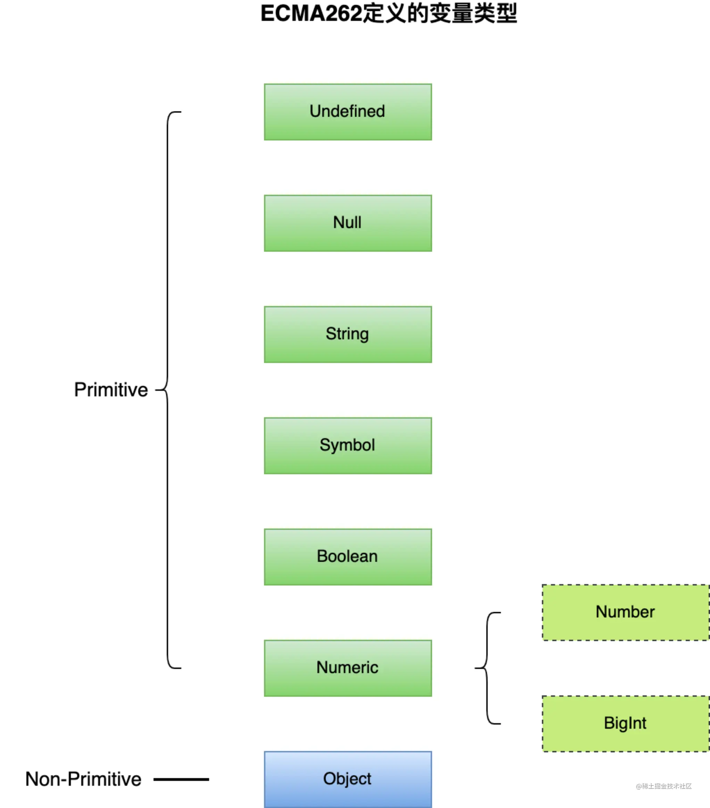
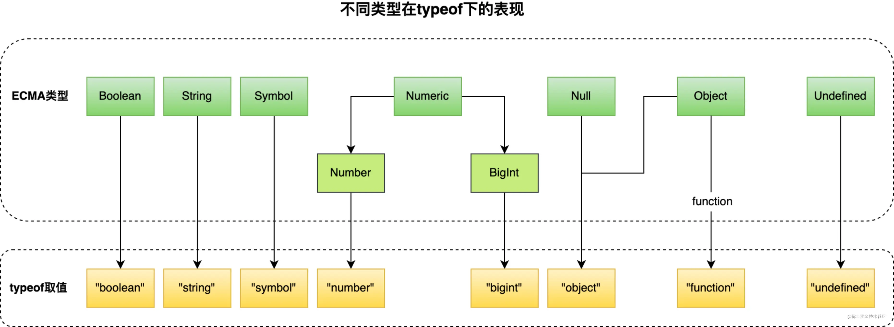

# 3 基础篇｜如何合理地判断变量的类型？

作为动态语言，JavaScript 在变量声明时无需指定类型，因此你可以编写非常灵活的代码。但“不需要”不代表“没有”，在使用时肯定免不了要判断变量的类型，比如实现一个加法函数 `add(a, b)`，变量是数字还是字符串，显然最后的结果就很不一样。更多的时候我们要做的是对输入数据的合法性校验，不合法直接抛出错误。

**类型判断**在面试活动中，很可能影响到面试官对你表现的判断，比如一些题目的边界问题、健壮性问题等加分项；在日常开发中，影响到的是你编写业务代码的质量，最终体现的是你的 Bug 数量，甚至是领导对你能力高低的判断。

大家可能觉得危言耸听，既然如此，是不是用 TypeScript 就变成强类型语言了呢？

这显然是一个误解。没错，TypeScript 是带有类型系统，其实不仅仅 TypeScript，Facebook 也有一个更早实现的类型注解系统：[flow](https://flow.org/)，用在 React 项目中。无论哪一个，都没有把 JavaScript 变成强类型语言，它们只是对变量做一个约束，提醒你应该处理哪些种类型，比如 TypeScript 中的一个变量，依然可以声明成多类型混合的：


```ts
let foo: string | number;
```

在运行时仍然需要判断它是 string 还是 number 的，如果是 string，那么就可以调用 concat 方法；如果是 number，就可以调用 toFixed 方法。

本章我们就来探讨 JavaScript 中如何判断变量的类型，大家一定先想到了 `typeof`，不过不要着急，我们先来明确一共有哪些类型需要判断，然后再去看 typeof 是不是我们期望的判断方法。

## ECMA262 中的类型

到 ES2023 为止，规范一共定义了 7 种变量类型：**Undefined、Null、Boolean、String、Symbol、Numeric 和 Object**。除了 Object 之外，其他都称为 `Primitive` 类型。


怎么理解 Primitive 呢？简单来说就是可以用字面量一眼能看出其值的，比如 null、undefined、100、"中国"、false。虽然 Object 有的可以用 JSON 结构来表示，但是稍微复杂一点，比如函数、原型链、循环引用等这些特性是无法表述的。另一种理解 Primitive 的方式是值与引用。在作为函数参数传递时，Primitive 变量都是通过拷贝的方式传递的，修改一处，另一处不会被影响；而 Object 类型是传递引用的，一处修改，全局可见。

Numeric 又可以向下划分成 `Number` 和 `BigInt`，所以我们也可以说 ECMA262 定义了 8 种类型，如下图所示：



这可能和大家的印象中的认知有冲突，一定有人会问：“我经常要判断的函数 Function 不是一种类型吗？”

答案是，ECMA262 规范中的函数确实不是独立的类型，而是一类特殊的 Object，能执行（execute）。不但函数不是一种独立类型，我们经常使用的数组 Array、日期 Date、参数 Arguments、正则 RegExp 等都不是，它们通通都只是 Object。

所以，这里就引出了一个矛盾：`规范中定义的类型不一定是我们想要的，而我们想要的，规范中也并不一定做了区分`。这就需要我们开发者来自行实现，本章的重点就是**通过理论联系实践，面向日常的真正需求来实现尽可能可靠的类型判断逻辑，提升大家编写更安全、更健壮代码的能力**。

一般来说，我们最常需要做类型判断的是未定义 undefined、空 null、字符串 string、数字 number 或 bigint、布尔 boolean、符号 symbol、数组 Array、函数 Function、正则 RegExp，除此之外，都可归类为普通对象。

## typeof 的能力

typeof 是做类型判断绝对避不开的一个概念，应该说大家在入门 JavaScript 最开始都会接触到它。然而我相信还有很多同学都对它有误解，把它当作一个函数，写作：

```ts
typeof(foo)
```

这样在语法虽然是合法的，不过 **typeof 却不是函数，而是一个操作符**，你不可以声明一个叫做 typeof 的变量：

```ts
var typeof = 3 // ❌ Uncaught SyntaxError: Unexpected token 'typeof'
typeof typeof  // ❌ Uncaught SyntaxError: Unexpected end of input
```

typeof 返回值一定是这 8 种字符串之一："undefined"、"string"、"boolean"、"number"、"bigint"、"symbol"、"object" 或 "function"。

可见这 8 种类型和前面我们讲到的规范定义的 8 种类型并不是一一对应的。

**首先是空类型 null 用 typeof 判断不出来，这是 Primitive 类型中唯一一种 typeof 不支持** **的**。据说这是 JavaScript 当年的设计者引入的一个 Bug，由于兼容性的考虑一代代传承了下来，以至于 20 多年后我们编写下面的代码仍然是不安全的：

```ts
if ("object" === typeof variable) {}
```

好在不使用 typeof 也可以安全、简单地判断 null：

```ts
 if (foo === null) {}
```

**其次，函数 Function 类型得到了 typeof 的单独支持，极大方便了我们日常使用。**

明确了以上两点之后，我们就可以清晰地得到下面这张图，牢记这张图，你可以非常灵活地运用 typeof。



总体来说，除了 null 有点特殊以外，typeof 在判断 Primitive 类型变量上的能力还是可圈可点的。其实，在日常使用中，undefined 也有一些额外的故事。

## undefined 的特殊之处

一般来说，在我们的认知当中，只有`typeof undefined`才会返回`"undefined"`：

```ts
if ("undefined" === typeof variable) {}
```

有人可能会问到，和`undefined`做全等判断岂不是更简单：

```ts
if (undefined === variable) {}
```

大部分场景下是可以的，但有例外。

在 ES5 之前的 ES3 时代，全局的 undefined 是能被重写的，比如`undefined=1`是可以被正确执行的。

这一现象从 ES5 开始得到了改进，你现在可以打开 Chrome 的开发者工具，在控制台中输入`undefined=1`，然后用`console.log(undefined)`打印出来，会发现 undefined 的值并没有变化。事实上，在 strict 模式（后面章节会讲到）下，下面的代码会直接抛出 TypeError 错误，告诉你 undefined 是只读的：

```ts
"use strict";
undefined = 1; // ❌ Uncaught TypeError: Cannot assign to read only property 'undefined' of object '#<Window>'
```

虽然现代浏览器已经没有了这个顾虑，但是 undefined 还不是关键字，它依然可以作为变量名在局部上下文中声明：

```ts
{
    const undefined = 1;
    console.log(typeof undefined); // "number"
}
```

显然在这个上下文中用全等`===`来判断，是不可以得出期望的结果的。因此，为了保守起见，我们在判断一个变量是否是 undefined 的时候，推荐的写法还是`"undefined" === typeof variable`。ESLint 有一条规则 [no-undefined](https://eslint.org/docs/latest/rules/no-undefined) 就是应对这件事的。

戏剧性的是，在这个例外之中，还有例外。

ECMA262 自 1999 年发布 ES3 到 2009 年发布 ES5 一共有接近 10 年时间的断层，在这期间微软的 IE 浏览器占据了绝大部分市场份额，其 JavaScript 的 API 实现了很多标准之外的特性，现在我们就遇到了这样一个例子。

IE 在`document`对象上有一个属性`all`，会返回当前页面中的所有元素，它是可遍历的：

```ts
for (const element of document.all) {
    console.log(element.tagName);
}
```

然而它在早年间却有着更重要的使命——判断是否是 IE 浏览器：

```ts
if (document.all) {
    // IE
} else {
    // not IE
}
```

因为只有 IE 浏览器实现了这样一个非 W3C 标准的 API。后面的浏览器虽然实现了`document.all`的数据结构，但是却有着完全不一样的 typeof 表现和布尔值表现：

```ts
typeof document.all // "undefined"

if (document.all) {
    // never enter
}
```

是的，虽然 document.all 不是 undefined，但它在 typeof 下却表现得像 undefined，而且在逻辑上是假值。这一切都是为了不破坏过去编写的网站代码，ECMA262 专门为其抽象了一个叫做 [[[IsHTMLDDA]]](https://tc39.es/ecma262/#sec-IsHTMLDDA-internal-slot) 的概念。

## 典型对象的判断

typeof 基本能解决 Primitive 变量的判断，我们还有几个典型对象类型的判断需求，比如数组 Array 和正则 RegExp。

先来看数组。

在早年间，由于 IE 环境下跨 iframe 调用时，`[] instanceof Array`不成立，所以业界普遍推荐的判断方法是`Object.prototype.toString.call(variable) === "[object Array]"`，其实你也可以使用`variable.constructor === Array`。

后面，ES5 引入了 `Array.isArray` 静态方法，如果不考虑 IE 环境的话，它又有什么优势呢？

答案是 **Array.isArray 比 instanceof 或者 constructor 能胜任对 Proxy 的判定工作**。我们不妨看下面一段代码：

```ts
const proxy = new Proxy([], {
    get(target, p) {
        if ('constructor' === p) return String;
        return Reflect.get(target, p);
    },
    getPrototypeOf() {
        return null;
    }
});

console.log(`Array.isArray(proxy)`, Array.isArray(proxy)); // true
console.log(`proxy instanceof Array`, proxy instanceof Array); // false
console.log(`proxy.constructor === Array`, proxy.constructor === Array); // false
```

Proxy 的知识在后面的章节中还会讲到。在上面的例子中，我们篡改了 Proxy 对象的 constructor 和原型链，这使得通过 constructor 或者 instanceof 的方式判断类型的尝试都失效了，唯独 `Array.isArray` 仍然能正常工作，这就是它的优势。

因此，**无论是从使用便利性上来说，还是从能力范围上来讲，都更建议使用 `Array.isArray` 来判断数组类型**。

其他对象类型就没有这种待遇了，比如我们常用的正则 RegExp。除了它有自己独立的字面量语法之外，RegExp 没有其他任何特别之处。假设我们声明一个自定义类：

```ts
class Animal {}
```

那么，实现 isAnimal 的原理和实现 isRegExp 的原理是等价的。那我这里使用 Animal 来代指任意对象类型，包括 RegExp、Date、Arguments，也包括 Window、Document。

通常有两种方法来做判断。

第一种办法，判别其构造函数，不过对象的 constructor 属性一般是可以被覆写的，因此有被伪造的可能：

```ts
function isAnimal(variable) {
    return variable?.constructor === Animal;
}
```

第二种办法，用 instanceof 做原型链判别，不过对象的原型链也是可以被篡改的：

```ts
function isAnimal(variable) {
    return variable instanceof Animal;
}
```

如果你在类中定义了这样一个特殊属性：

```ts
class Animal {
    get [Symbol.toStringTag]() {
        return 'Animal';
    }
}
```

那么也有第三种办法，使用对象基类的 toString 方法：

```ts
function isAnimal(variable) {
    return Object.prototype.toString.call(variable) === "[object Animal]";
}
```

Array、RegExp、Date、Arguments、Window、Document 甚至 undefined、null 都可以应用这种办法。不过显然字符串对比的方式更容易被篡改，你可以轻松定义一个伪装类来骗过这个判断。

以上三种办法都可以被骗过，那是不是没有完美的办法来判断对象变量类型呢？我认为是的，“animal 是 Animal 类型”这句话本身就是需要被定义的，什么样叫做是，一定是需要条件的，是被 Animal 构造出来就是，还是原型链相关就是呢？

遗憾的是，JavaScript 中的构造函数，甚至 class 语法本身都是语法糖，原型链基本上可以被任意修改，因此可以说，在对象类型的判断上，本身就没有严格的定义，只要不涉及安全攻防，按照你自己认可的方式实现即可，不必在完备性上过于执着。

这种不完美也会传导到 Primitive 类型的变量上。

## Primitive 的对象封装

除了 null 和 undefined 外，其余的 Primitive 类型都可以封装成 Object：

```ts
Object(123)             // 等价于 new Number(123)
Object(123n)            // 等价于 new BigInt(123n)
Object("str")           // 等价于 new String("str")
Object(true)            // 等价于 new Boolean(true)
Object(Symbol("sym"))
```

> 有 Java 语言背景的同学应该对装箱/拆箱的概念不陌生，和这相比是极其类似的。

虽然这些值在 typeof 下一定都返回 “object”，但是却仍然有着原本的语义，比如：

```ts
new Number(3) + new Number(4) // 7
new String("a") + new String("b") // "ab"
```

如果你想实现一个 `concatString(a, b)` 函数，a 和 b 除了应该是 string 类型之外，也许你也想兼容一下字符串对象，这是非常常见的需求，那么 `isString` 函数的逻辑就应该分成两个部分：

```ts
function isString(str) {
    return "string" === typeof str || Object.prototype.toString.call(str) === "[object String]";
}
```

这也是著名的 lodash.isString 实现的主要原理。同样的道理，对于 number、boolean、symbol 也是适用的，唯一需要特别关注的是，布尔对象在逻辑语义上始终为真：

```ts
if (new Boolean(false)) {
    // enter
}

if (new Boolean(true)) {
    // enter
}

new Boolean(new Boolean(false)).valueOf() // true
```

## 小结

到此为止，我们了解了 JavaScript 类型系统的关键知识，ECMA262 定义的 8 种变量类型，和我们日常开发常常需要分辨的并不完全一致，typeof 也不能满足，所以必须增加对特定对象类型的判定。

总结来看，根据不同的目标类型，可以采取如下的判定方法：

1.  用全等`===`来判断 null 类型；
1.  用 `typeof` 来判断其他 Primitive 类型，注意 `document.all` 的例外；
1.  用 `Array.isArray`来判断数组类型；
1.  没有完美的特定对象类型判断方法，可以酌情选择 constructor、instanceof 或者 toString。

Primitive 的对象封装类型也可以被使用，以增加代码的兼容性和能力范畴，但是也需要额外添加像上面第 4 点的对象类型判断逻辑才行，注意这个逻辑是可以被绕过的。