# 10. AOP 架构有什么好处？

后端框架基本都是 MVC 的架构。

MVC 是 Model View Controller 的简写。MVC 架构下，请求会先发送给 Controller，由它调度 Model 层的 Service 来完成业务逻辑，然后返回对应的 View。

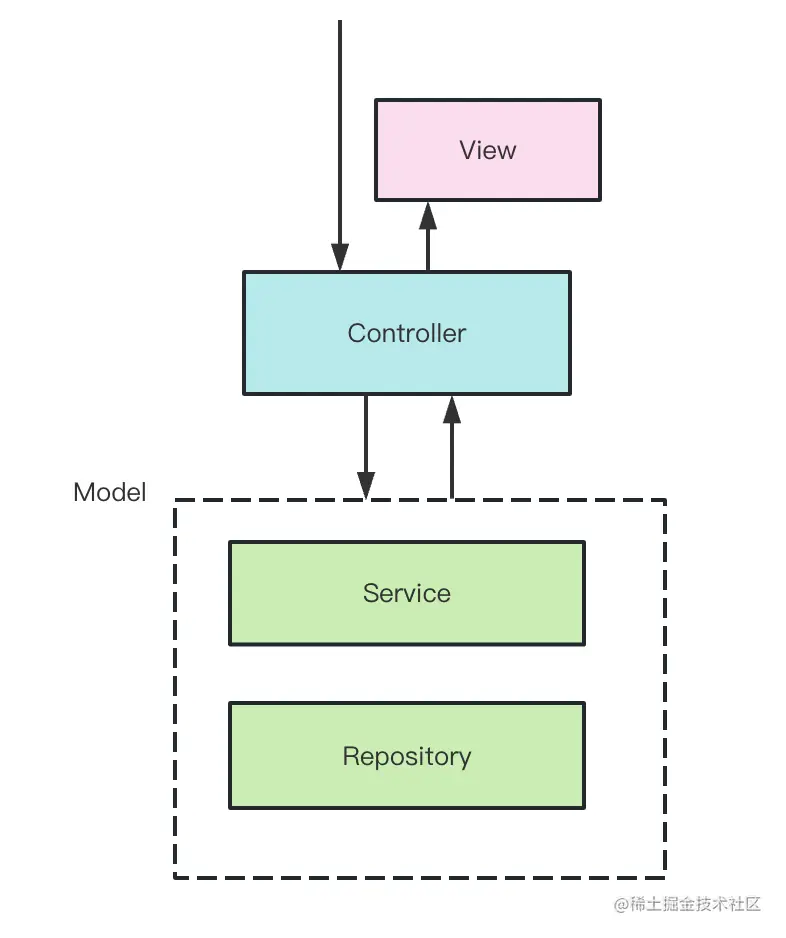

在这个流程中，Nest 还提供了 AOP （Aspect Oriented Programming）的能力，也就是面向切面编程的能力。

AOP 是什么意思呢？什么是面向切面编程呢？

一个请求过来，可能会经过 Controller（控制器）、Service（服务）、Repository（数据库访问） 的逻辑：

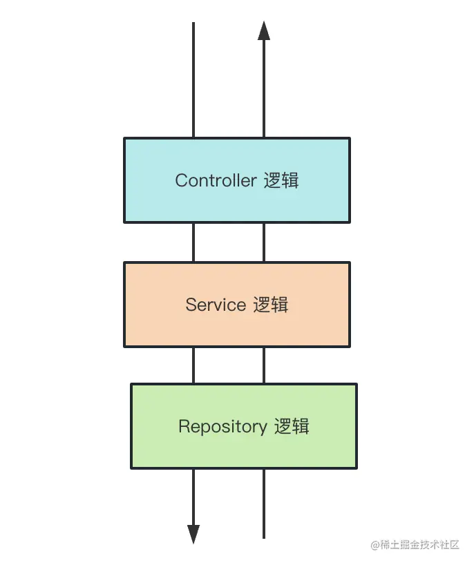

如果想在这个调用链路里加入一些通用逻辑该怎么加呢？比如日志记录、权限控制、异常处理等。

容易想到的是直接改造 Controller 层代码，加入这段逻辑。

这样可以，但是不优雅，因为这些通用的逻辑侵入到了业务逻辑里面。能不能透明的给这些业务逻辑加上日志、权限等处理呢？

那是不是可以在调用 Controller 之前和之后加入一个执行通用逻辑的阶段呢？

比如这样：

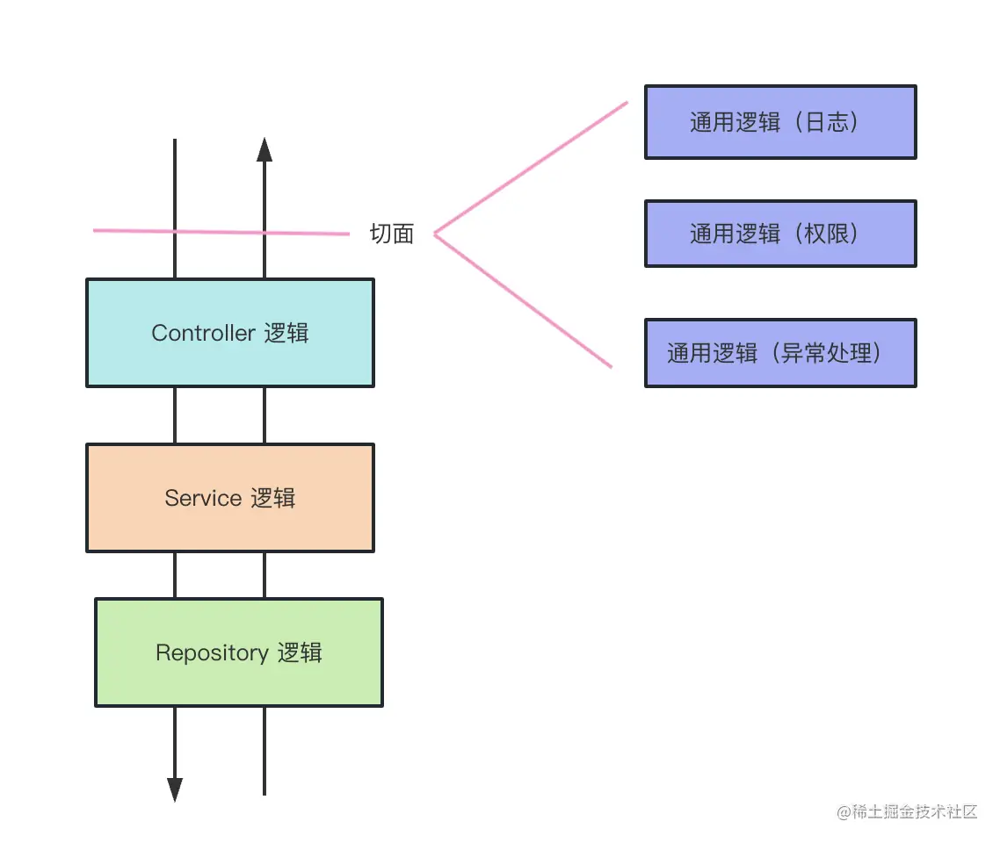

是不是就和切了一刀一样？

这样的横向扩展点就叫做切面，这种透明的加入一些切面逻辑的编程方式就叫做 AOP （面向切面编程）。

**AOP 的好处是可以把一些通用逻辑分离到切面中，保持业务逻辑的纯粹性，这样切面逻辑可以复用，还可以动态的增删。**

其实 Express 的中间件的洋葱模型也是一种 AOP 的实现，因为你可以透明的在外面包一层，加入一些逻辑，内层感知不到。

而 Nest 实现 AOP 的方式更多，一共有五种，包括 Middleware、Guard、Pipe、Interceptor、ExceptionFilter。

新建个 nest 项目，我们挨个试一下：

```
nest new aop-test
```

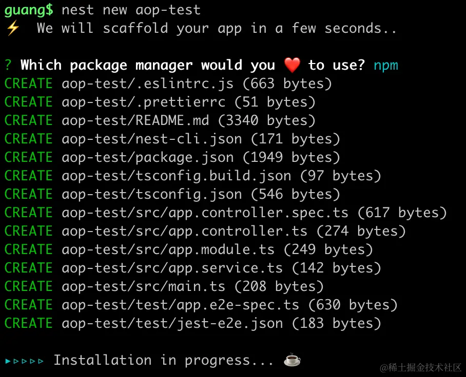

### 中间件 Middleware

中间件是 Express 里的概念，Nest 的底层是 Express，所以自然也可以使用中间件，但是做了进一步的细分，分为了全局中间件和路由中间件。

全局中间件就是这样：

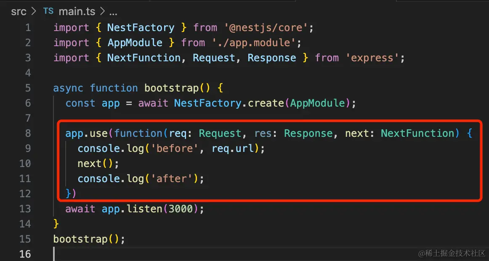

在 main.ts 里通过 app.use 使用：

```javascript
app.use(function(req: Request, res: Response, next: NextFunction) {
    console.log('before', req.url);
    next();
    console.log('after');
})
```

在 AppController 里也加个打印：

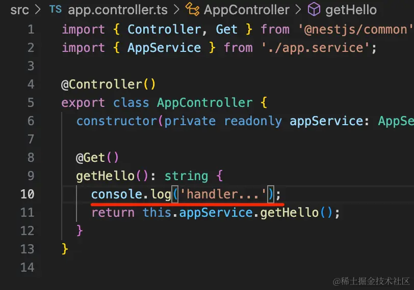

把服务跑起来：

```
npm run start:dev
```
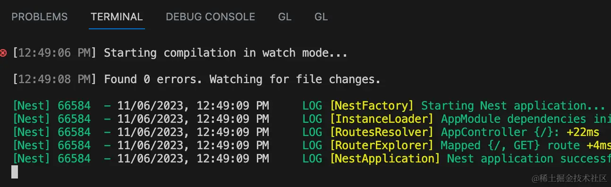

浏览器访问下：


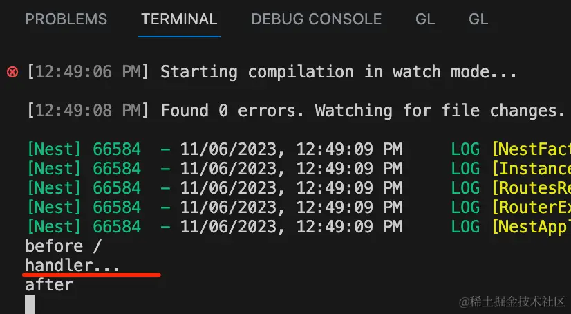

可以看到，在调用 handler 前后，执行了中间件的逻辑。

我们再添加几个路由：

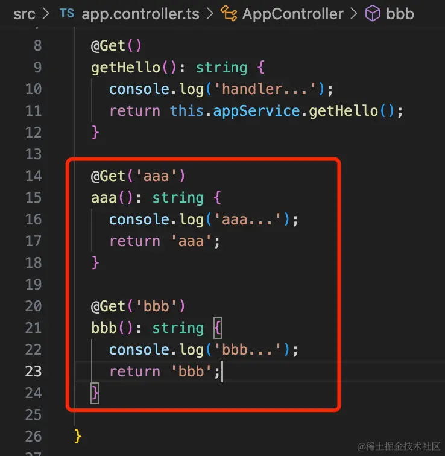

```javascript
@Get('aaa')
aaa(): string {
    console.log('aaa...');
    return 'aaa';
}

@Get('bbb')
bbb(): string {
    console.log('bbb...');
    return 'bbb';
}
```
然后浏览器访问下：


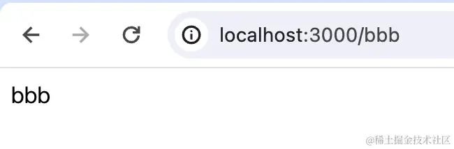

可以看到，中间件逻辑都执行了：

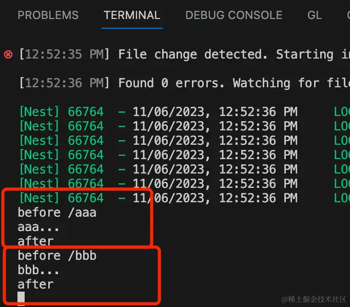


也就是说，可以在多个 handler 之间复用中间件的逻辑：

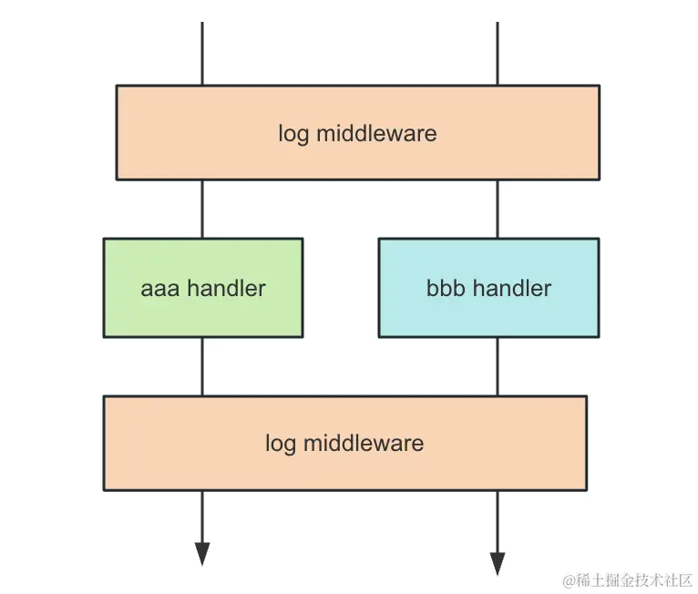

这种可以给在 handler 前后动态增加一些可复用的逻辑，就是 AOP 的切面编程的思想。

除了全局中间件，Nest 还支持路由中间件。

用 nest cli 创建一个路由中间件：

```
nest g middleware log --no-spec --flat
```

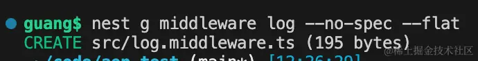

--no-spec 是不生成测试文件，--flat 是平铺，不生成目录。

生成的代码是这样的：

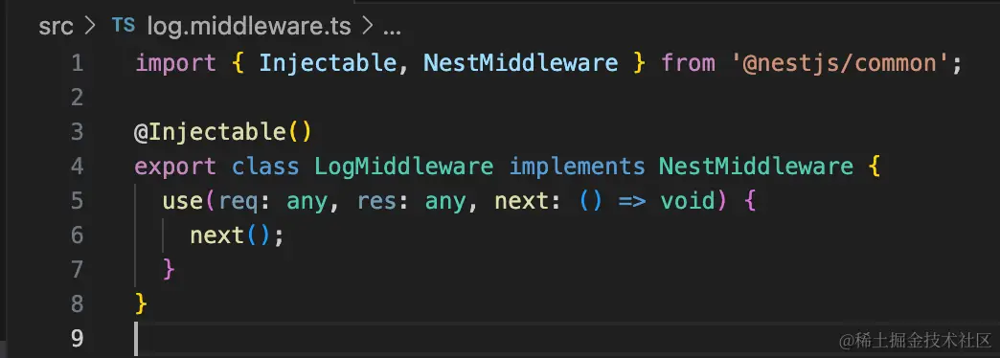

在前后打印下日志：

```javascript
import { Injectable, NestMiddleware } from '@nestjs/common';
import { Request, Response } from 'express';

@Injectable()
export class LogMiddleware implements NestMiddleware {
  use(req: Request, res: Response, next: () => void) {
    console.log('before2', req.url);

    next();

    console.log('after2');
  }
}

```
然后在 AppModule 里启用：

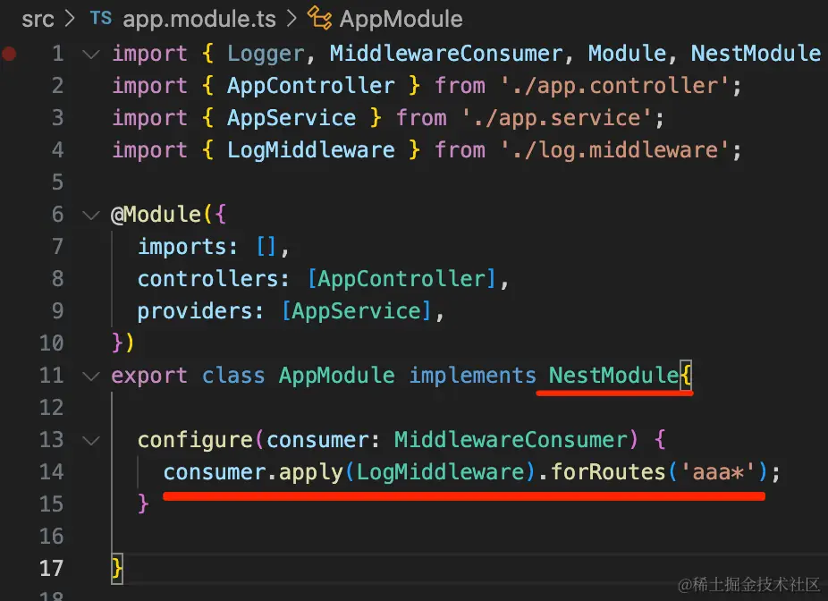

```javascript
import { MiddlewareConsumer, Module, NestModule } from '@nestjs/common';
import { AppController } from './app.controller';
import { AppService } from './app.service';
import { LogMiddleware } from './log.middleware';

@Module({
  imports: [],
  controllers: [AppController],
  providers: [AppService],
})
export class AppModule implements NestModule{

  configure(consumer: MiddlewareConsumer) {
    consumer.apply(LogMiddleware).forRoutes('aaa*');
  }

}

```

在 configure 方法里配置 LogMiddleware 在哪些路由生效。

然后测试下：


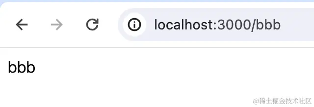

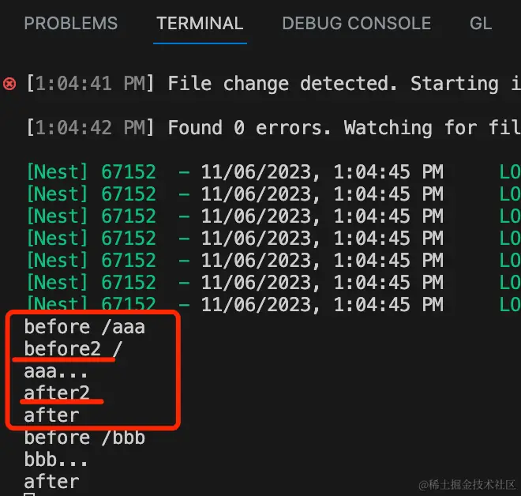

可以看到，只有 aaa 的路由，中间件生效了。

这就是全局中间件和路由中间件的区别。

### Guard

Guard 是路由守卫的意思，可以用于在调用某个 Controller 之前判断权限，返回 true 或者 false 来决定是否放行：

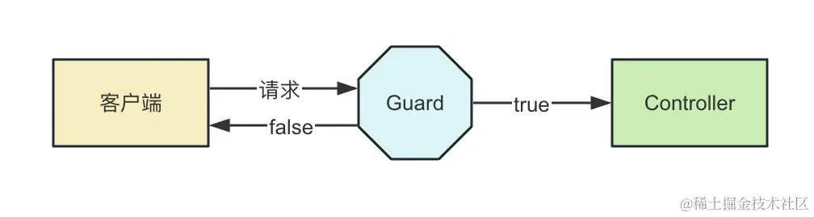

我们创建个 Guard：

```
nest g guard login --no-spec --flat
```

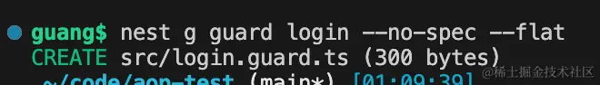

生成的 Guard 代码是这样的：

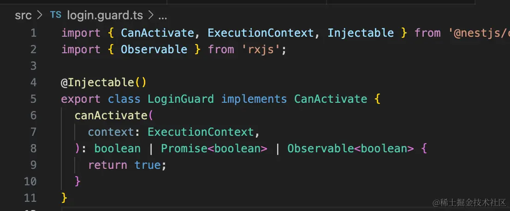

Guard 要实现 CanActivate 接口，实现 canActivate 方法，可以从 context 拿到请求的信息，然后做一些权限验证等处理之后返回 true 或者 false。

我们加个打印语句，然后返回 false：

```javascript
import { CanActivate, ExecutionContext, Injectable } from '@nestjs/common';
import { Observable } from 'rxjs';

@Injectable()
export class LoginGuard implements CanActivate {
  canActivate(
    context: ExecutionContext,
  ): boolean | Promise<boolean> | Observable<boolean> {
    console.log('login check')
    return false;
  }
}

```

之后在 AppController 里启用：

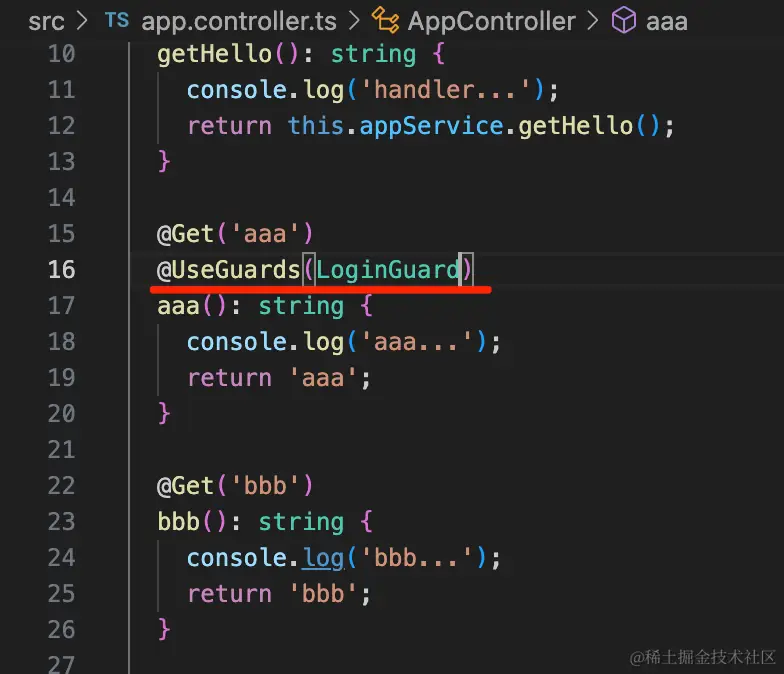

然后再访问下：

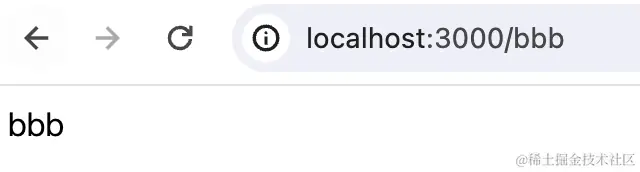

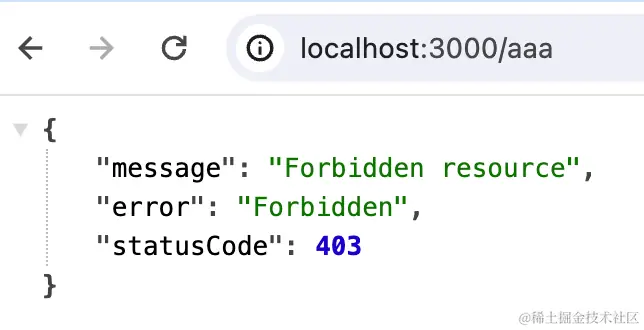

aaa 没有权限，返回了 403。

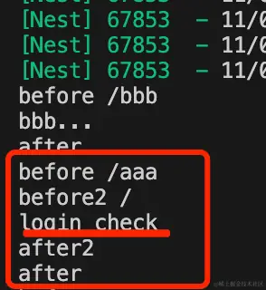

Controller 本身不需要做啥修改，却透明的加上了权限判断的逻辑，这就是 AOP 架构的好处。

而且，就像 Middleware 支持全局级别和路由级别一样，Guard 也可以全局启用：

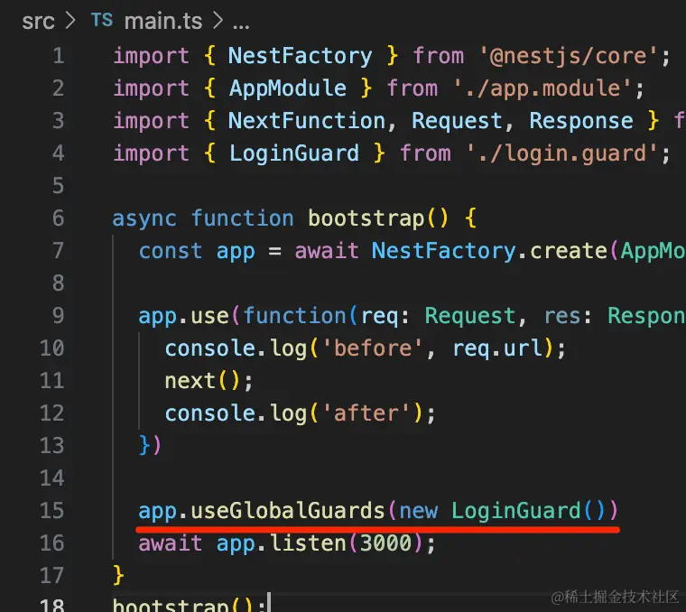

这样每个路由都会应用这个 Guard：

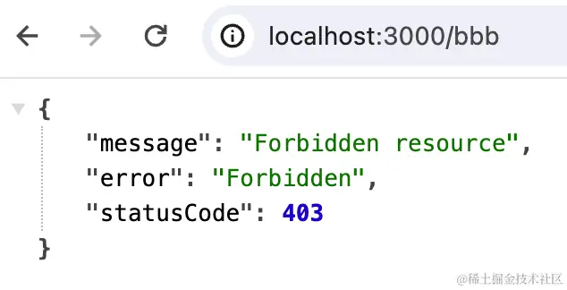

还有一种全局启用的方式，是在 AppModule 里这样声明：

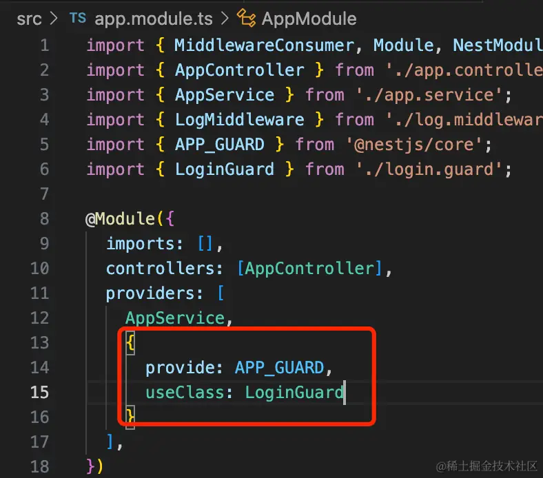

```javascript
{
  provide: APP_GUARD,
  useClass: LoginGuard
}
```
把 main.ts 里的 useGlobalGuards 注释掉：

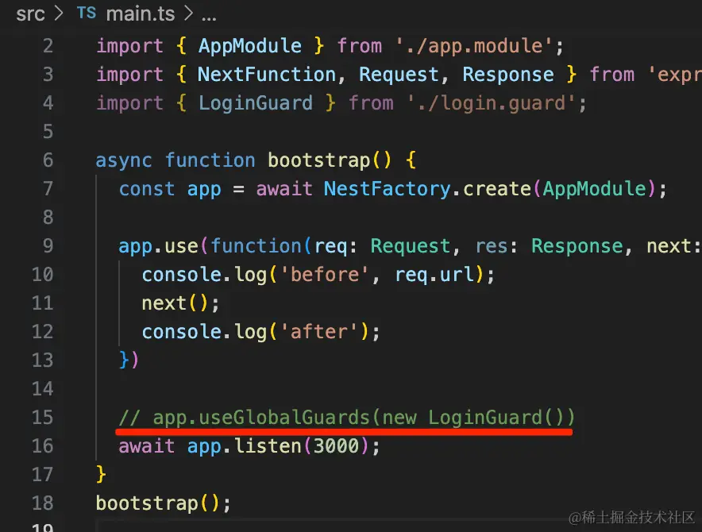

再试下：

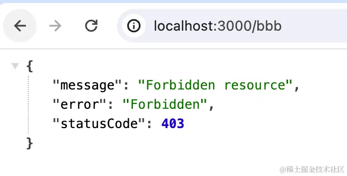

可以看到，Guard 依然是生效的。

那为什么都是声明全局 Guard，需要有两种方式呢？

因为之前这种方式是手动 new 的 Guard 实例，不在 IoC 容器里：

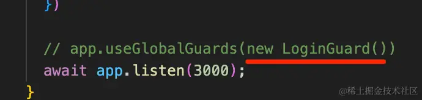

而用 provider 的方式声明的 Guard 是在 IoC 容器里的，可以注入别的 provider：

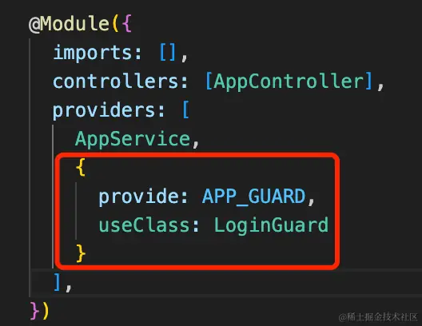

我们注入下 AppService 试试：

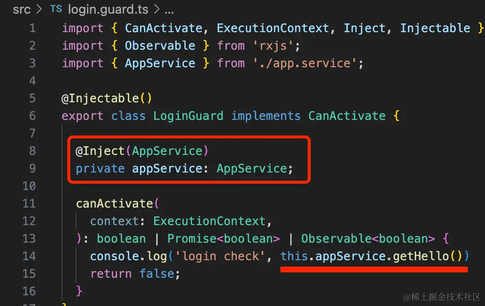

```javascript
@Inject(AppService)
private appService: AppService;
```
浏览器访问下：

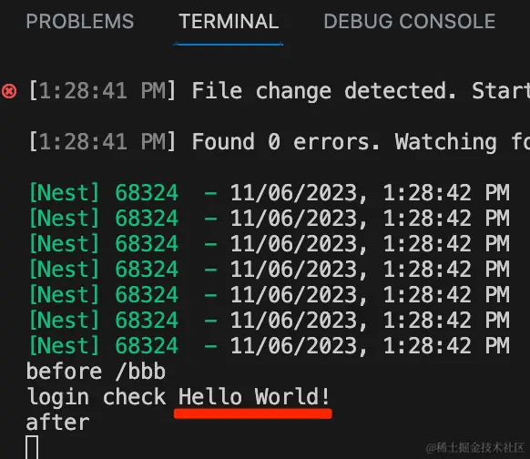

可以看到，注入的 AppService 生效了。

所以，当需要注入别的 provider 的时候，就要用第二种全局 Guard 的声明方式。

### Interceptor

Interceptor 是拦截器的意思，可以在目标 Controller 方法前后加入一些逻辑：

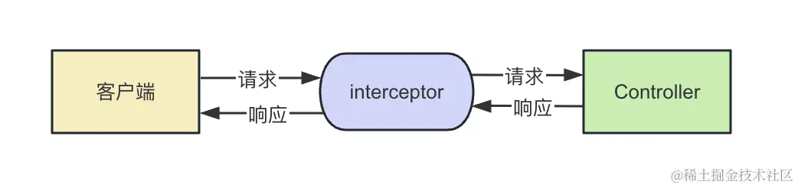

创建个 interceptor：

```
nest g interceptor time --no-spec --flat
```

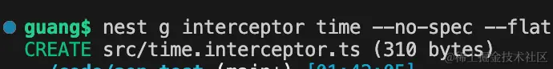

生成的 interceptor 是这样的：

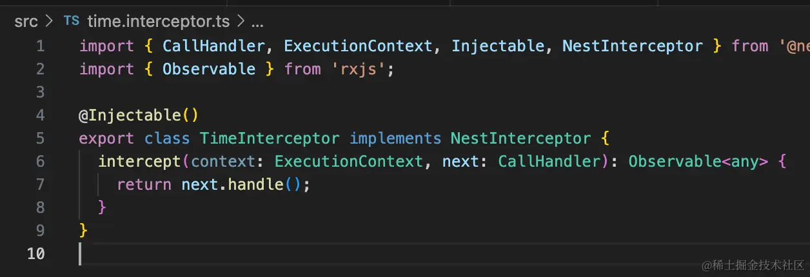

Interceptor 要实现 NestInterceptor 接口，实现 intercept 方法，调用 next.handle() 就会调用目标 Controller，可以在之前和之后加入一些处理逻辑。

Controller 之前之后的处理逻辑可能是异步的。Nest 里通过 rxjs 来组织它们，所以可以使用 rxjs 的各种 operator。

```javascript
import { CallHandler, ExecutionContext, Injectable, NestInterceptor } from '@nestjs/common';
import { Observable, tap } from 'rxjs';

@Injectable()
export class TimeInterceptor implements NestInterceptor {
  intercept(context: ExecutionContext, next: CallHandler): Observable<any> {

    const startTime = Date.now();

    return next.handle().pipe(
      tap(() => {
        console.log('time: ', Date.now() - startTime)
      })
    );
  }
}
```

把之前那个 LoginGuard 注掉：

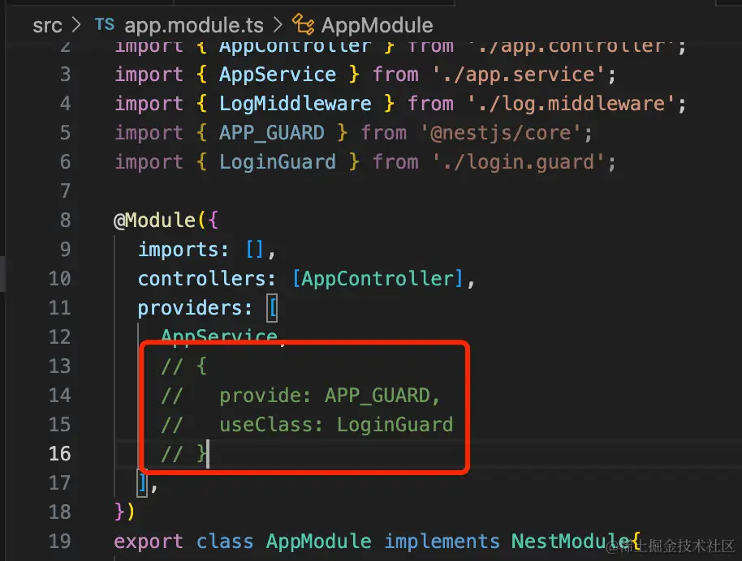

然后启用这个 interceptor：

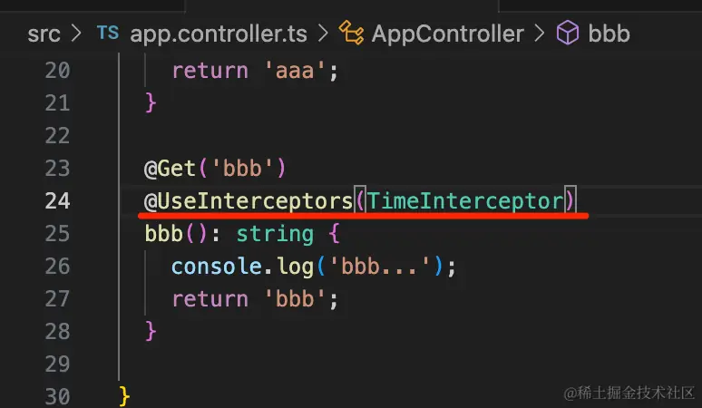

跑一下：

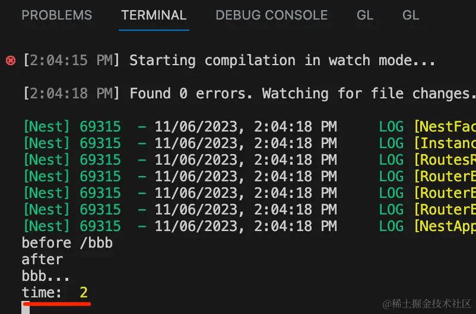

可以看到，interceptor 生效了。

有的同学可能会觉得 Interceptor 和 Middleware 差不多，其实是有区别的，主要在于参数的不同。

interceptor 可以拿到调用的 controller 和 handler：

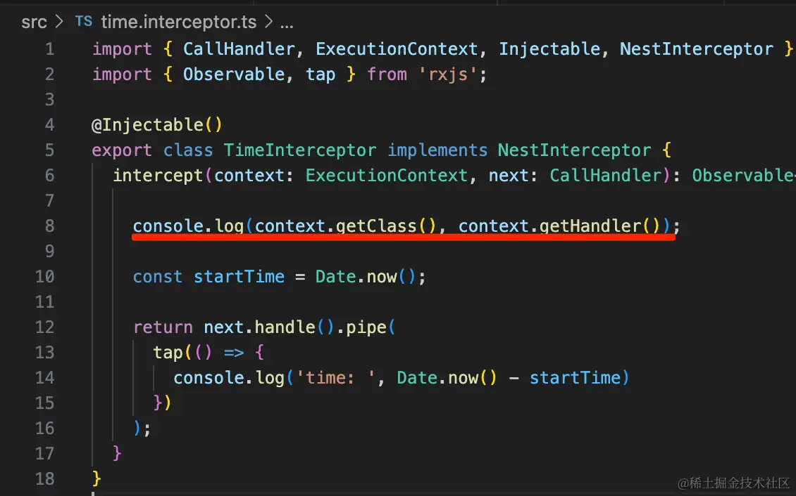

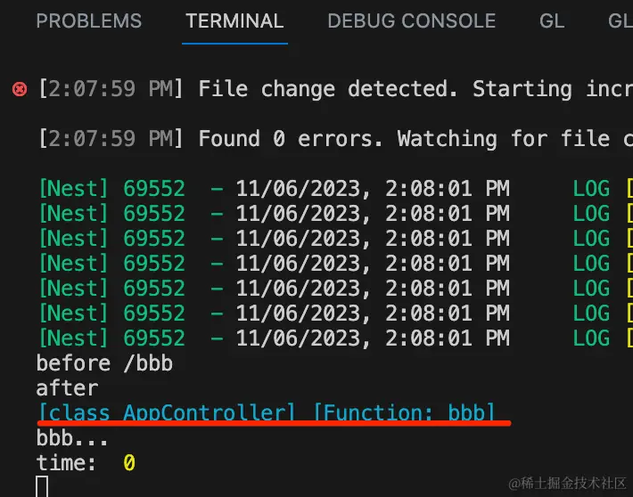

后面我们会在 controller 和 handler 上加一些 metadata，这种就只有 interceptor或者 guard 里可以取出来，middleware 不行。

Interceptor 支持每个路由单独启用，只作用于某个 handler：

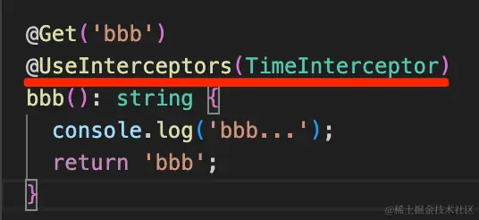

也可以在 controller 级别启动，作用于下面的全部 handler：

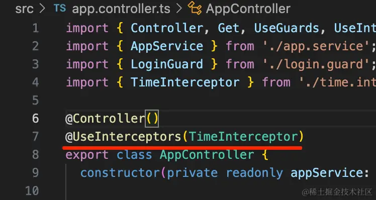

也同样支持全局启用，作用于全部 controller：

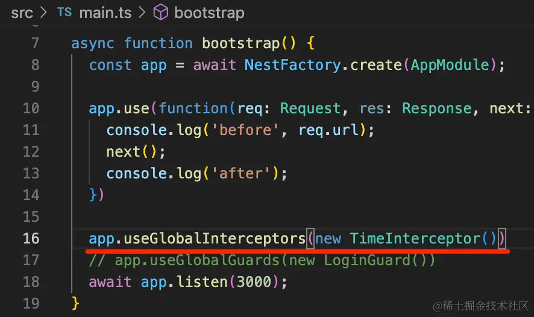

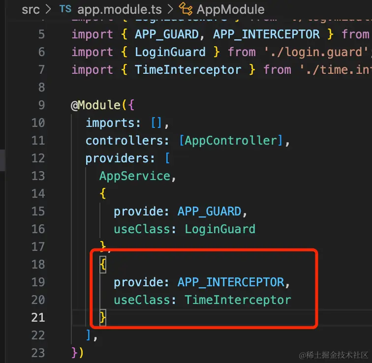

两种全局启用方式的区别和 guard 的一样，就不测试了。

除了路由的权限控制、目标 Controller 之前之后的处理这些都是通用逻辑外，对参数的处理也是一个通用的逻辑，所以 Nest 也抽出了对应的切面，也就是 Pipe：

### Pipe

Pipe 是管道的意思，用来对参数做一些检验和转换：


用 nest cli 创建个 pipe：
```
nest g pipe validate --no-spec --flat
```

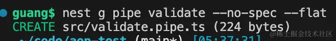

生成的代码是这样的：

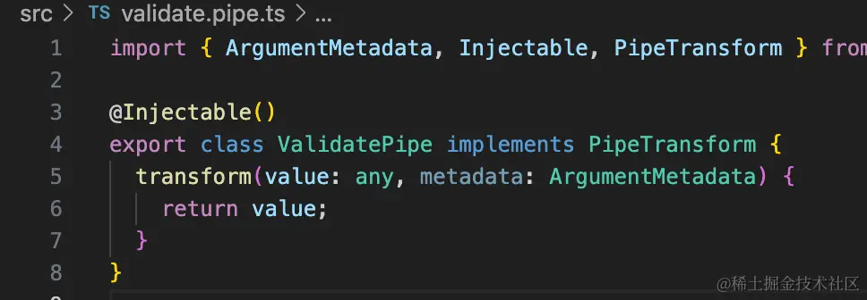

Pipe 要实现 PipeTransform 接口，实现 transform 方法，里面可以对传入的参数值 value 做参数验证，比如格式、类型是否正确，不正确就抛出异常。也可以做转换，返回转换后的值。

我们实现下：

```javascript
import { ArgumentMetadata, BadRequestException, Injectable, PipeTransform } from '@nestjs/common';

@Injectable()
export class ValidatePipe implements PipeTransform {
  transform(value: any, metadata: ArgumentMetadata) {

    if(Number.isNaN(parseInt(value))) {
      throw new BadRequestException(`参数${metadata.data}错误`)
    }

    return typeof value === 'number' ? value * 10 : parseInt(value) * 10;
  }
}
```
这里的 value 就是传入的参数，如果不能转成数字，就返回参数错误，否则乘 10 再传入 handler：

在 AppController 添加一个 handler，然后应用这个 pipe：

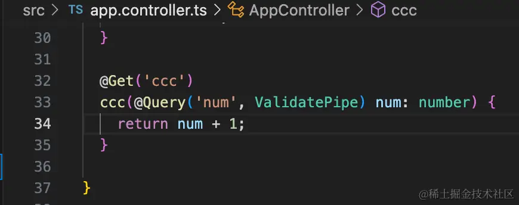

```javascript
@Get('ccc')
ccc(@Query('num', ValidatePipe) num: number) {
    return num + 1;
}
```
访问下：


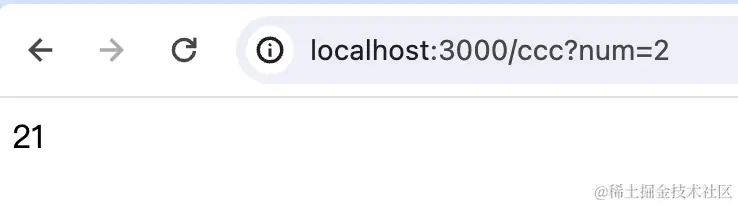

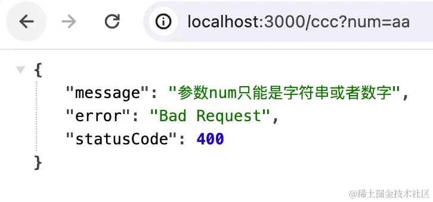

可以看到，参数错误的时候返回了 400 响应，参数正确的时候也乘 10 传入了 handler。

这就是 Pipe 的作用。

Nest 内置了一些 Pipe，从名字就能看出它们的意思：

*   ValidationPipe
*   ParseIntPipe
*   ParseBoolPipe
*   ParseArrayPipe
*   ParseUUIDPipe
*   DefaultValuePipe
*   ParseEnumPipe
*   ParseFloatPipe
*   ParseFilePipe

同样，Pipe 可以只对某个参数生效，或者整个 Controller 都生效：

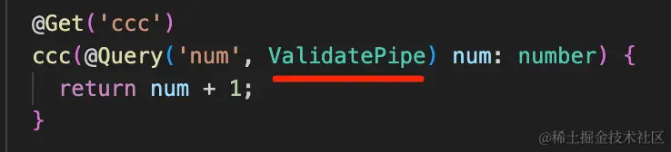

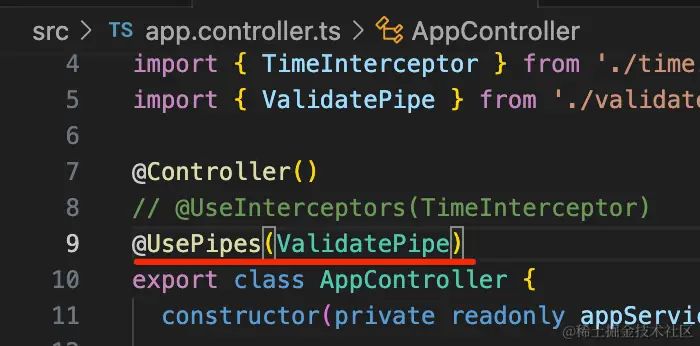


或者全局生效：

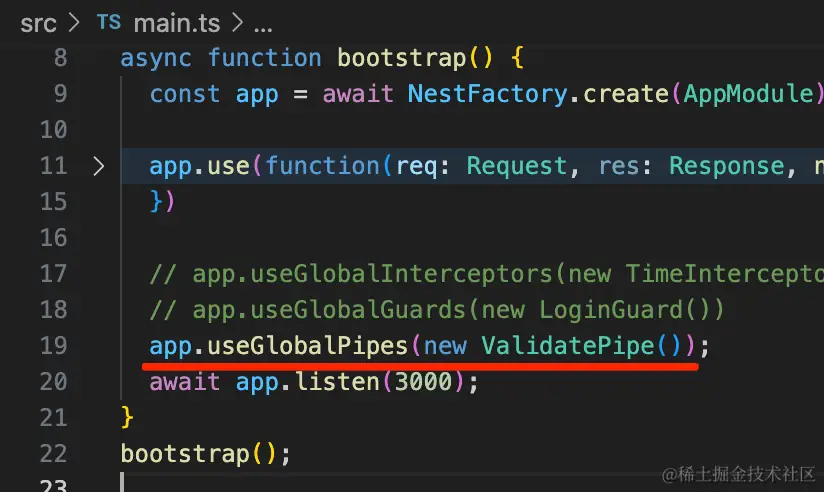

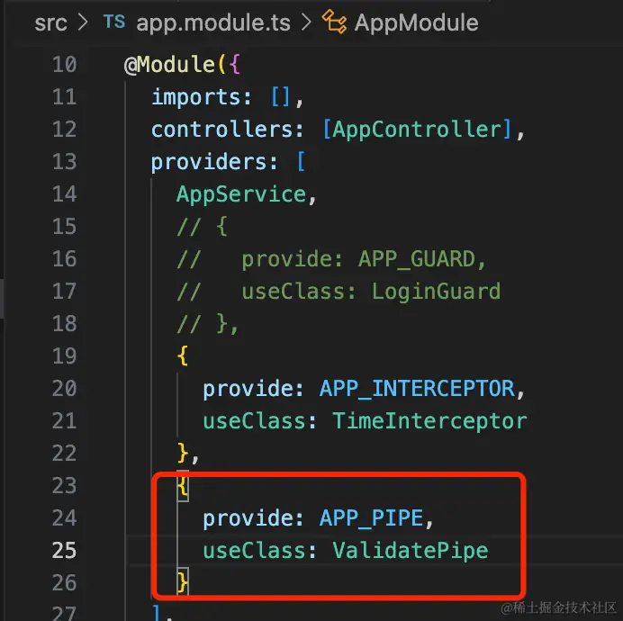

不管是 Pipe、Guard、Interceptor 还是最终调用的 Controller，过程中都可以抛出一些异常，如何对某种异常做出某种响应呢？

这种异常到响应的映射也是一种通用逻辑，Nest 提供了 ExceptionFilter 来支持：

### ExceptionFilter

ExceptionFilter 可以对抛出的异常做处理，返回对应的响应：

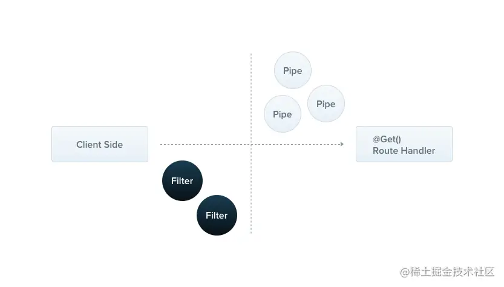

其实我们刚刚在 pipe 里抛的这个错误，能够返回 400 的响应，就是 Exception Filter 做的：

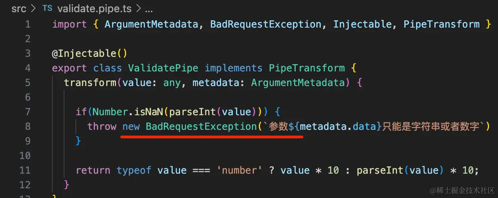


创建一个 filter：

```
nest g filter test --no-spec --flat
```

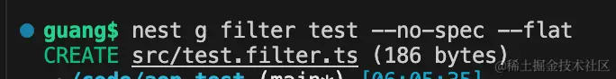

生成的代码是这样的：

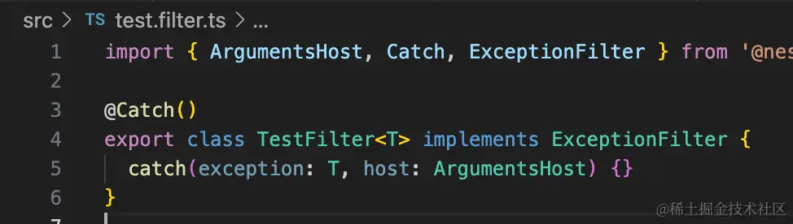

改一下：

```javascript
import { ArgumentsHost, BadRequestException, Catch, ExceptionFilter } from '@nestjs/common';
import { Response } from 'express';

@Catch(BadRequestException)
export class TestFilter implements ExceptionFilter {
  catch(exception: BadRequestException, host: ArgumentsHost) {

    const response: Response = host.switchToHttp().getResponse();

    response.status(400).json({
      statusCode: 400,
      message: 'test: ' + exception.message
    })
  }
}
```

实现 ExceptionFilter 接口，实现 catch 方法，就可以拦截异常了。

拦截什么异常用 @Catch 装饰器来声明，然后在 catch 方法返回对应的响应，给用户更友好的提示。

用一下：

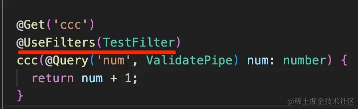

再次访问，异常返回的响应就变了：

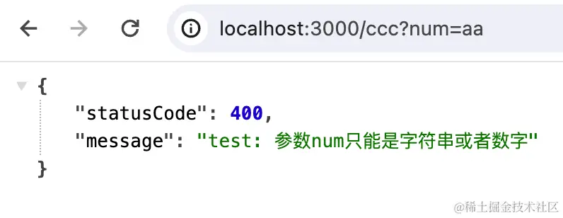
Nest 内置了很多 http 相关的异常，都是 HttpException 的子类：

*   BadRequestException
*   UnauthorizedException
*   NotFoundException
*   ForbiddenException
*   NotAcceptableException
*   RequestTimeoutException
*   ConflictException
*   GoneException
*   PayloadTooLargeException
*   UnsupportedMediaTypeException
*   UnprocessableException
*   InternalServerErrorException
*   NotImplementedException
*   BadGatewayException
*   ServiceUnavailableException
*   GatewayTimeoutException

当然，也可以自己扩展：

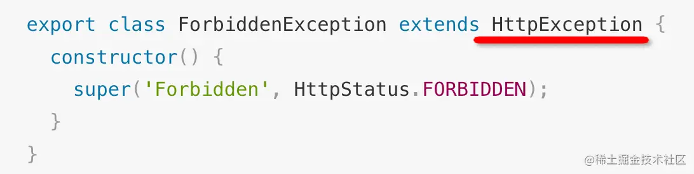

**Nest 通过这样的方式实现了异常到响应的对应关系，代码里只要抛出不同的异常，就会返回对应的响应，很方便。**

同样，ExceptionFilter 也可以选择全局生效或者某个路由生效：

某个 handler：


某个 controller：

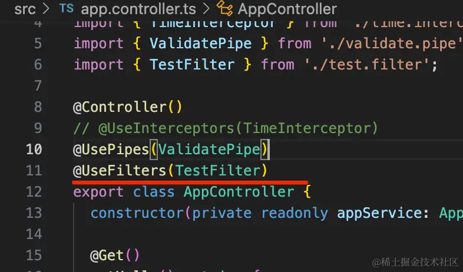

全局：
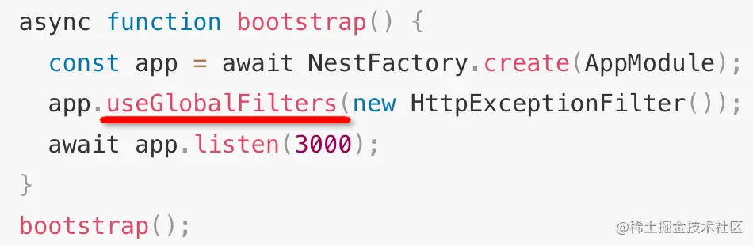

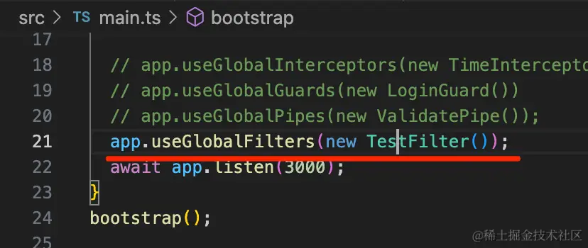

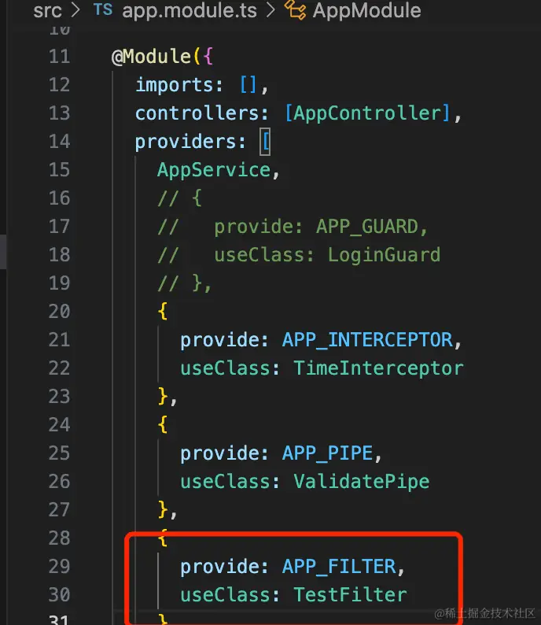
我们了解了 Nest 提供的 AOP 的机制，但它们的顺序关系是怎样的呢？

### 几种 AOP 机制的顺序

Middleware、Guard、Pipe、Interceptor、ExceptionFilter 都可以透明的添加某种处理逻辑到某个路由或者全部路由，这就是 AOP 的好处。

但是它们之间的顺序关系是什么呢？

调用关系这个得看源码了。

对应的源码是这样的：

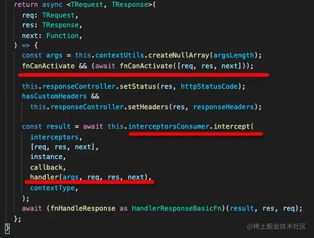

很明显，进入这个路由的时候，会先调用 Guard，判断是否有权限等，如果没有权限，这里就抛异常了：

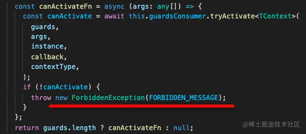

抛出的 ForbiddenException 会被 ExceptionFilter 处理，返回 403 状态码。

如果有权限，就会调用到拦截器，拦截器组织了一个链条，一个个的调用，最后会调用的 controller 的方法：

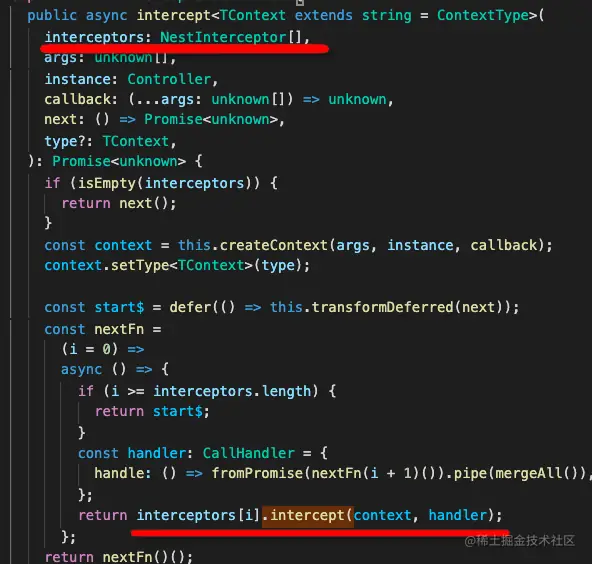

调用 controller 方法之前，会使用 pipe 对参数做处理：

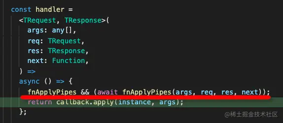

会对每个参数做转换：

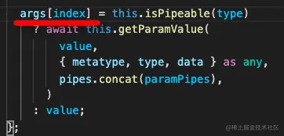

ExceptionFilter 的调用时机很容易想到，就是在响应之前对异常做一次处理。

而 Middleware 是 express 中的概念，Nest 只是继承了下，那个是在最外层被调用。

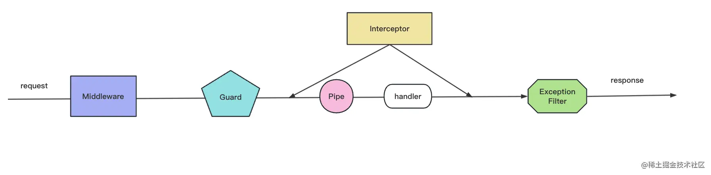

这就是这几种 AOP 机制的调用顺序。把这些理清楚，就知道什么逻辑放在什么切面里了。

案例代码在[小册仓库](https://github.com/QuarkGluonPlasma/nestjs-course-code/tree/main/aop-test)。

## 总结

Nest 基于 express 这种 http 平台做了一层封装，应用了 MVC、IOC、AOP 等架构思想。

MVC 就是 Model、View Controller 的划分，请求先经过 Controller，然后调用 Model 层的 Service、Repository 完成业务逻辑，最后返回对应的 View。

IOC 是指 Nest 会自动扫描带有 @Controller、@Injectable 装饰器的类，创建它们的对象，并根据依赖关系自动注入它依赖的对象，免去了手动创建和组装对象的麻烦。

AOP 则是把通用逻辑抽离出来，通过切面的方式添加到某个地方，可以复用和动态增删切面逻辑。

Nest 的 Middleware、Guard、Interceptor、Pipe、ExceptionFilter 都是 AOP 思想的实现，只不过是不同位置的切面，它们都可以灵活的作用在某个路由或者全部路由，这就是 AOP 的优势。

我们通过源码来看了它们的调用顺序，Middleware 是 Express 的概念，在最外层，到了某个路由之后，会先调用 Guard，Guard 用于判断路由有没有权限访问，然后会调用 Interceptor，对 Contoller 前后扩展一些逻辑，在到达目标 Controller 之前，还会调用 Pipe 来对参数做检验和转换。所有的 HttpException 的异常都会被 ExceptionFilter 处理，返回不同的响应。

Nest 就是通过这种 AOP 的架构方式，实现了松耦合、易于维护和扩展的架构。

AOP 架构的好处，你感受到了么？
