# 101. 大文件如何实现流式下载？

文件上传、文件下载都是常见的需求。

大文件上传我们会通过分片上传来优化。

比如[阿里云 OSS 的大文件分片上传](https://help.aliyun.com/zh/oss/user-guide/multipart-upload)：


那大文件下载如何优化呢？

答案也是分片下载，或者叫流式传输。

我们试一下：

```
nest new download-test
```

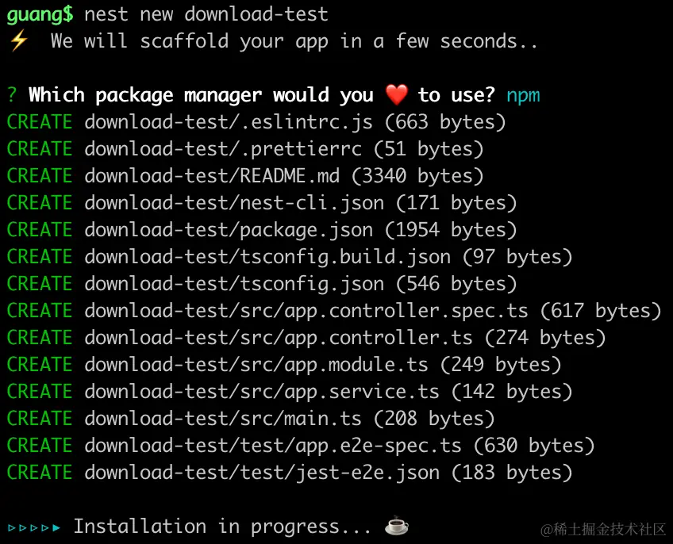

创建个 Nest 项目。

在 AppController 里添加个 download 的路由：

```javascript
import { Controller, Get, Res } from '@nestjs/common';
import { AppService } from './app.service';
import { Response } from 'express';
import * as fs from 'fs';

@Controller()
export class AppController {
  constructor(private readonly appService: AppService) {}

  @Get()
  getHello(): string {
    return this.appService.getHello();
  }

  @Get('download')
  download(@Res() res: Response) {
    const content = fs.readFileSync('package.json');

    res.set('Content-Disposition', `attachment; filename="guang.json"`);

    res.end(content);
  }
}
```
把服务跑起来：

```
npm run start:dev
```
浏览器访问下：

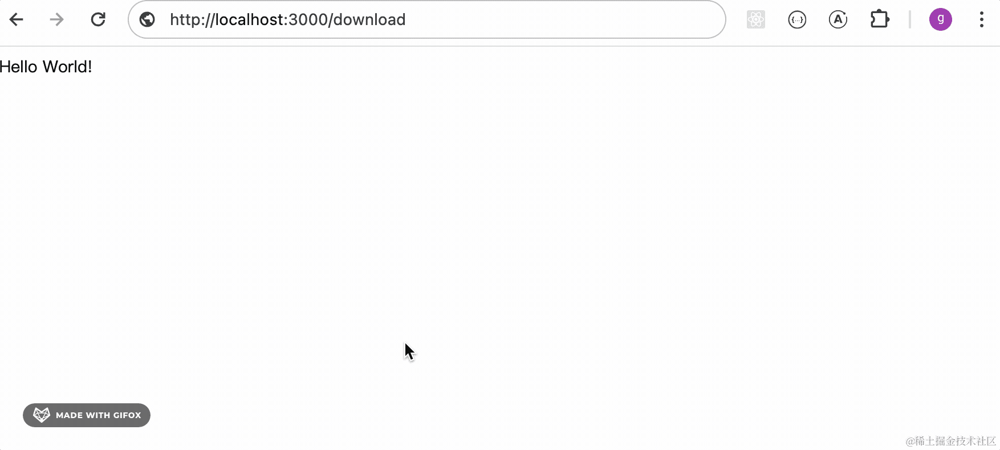

可以看到，触发了下载。

在 devtools 里可以看到正确设置了 header：

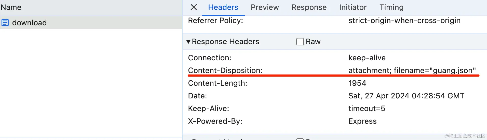

header 通过 @Header 装饰器加也可以：

```javascript
@Get('download')
@Header('Content-Disposition', `attachment; filename="guang.json"`)
download(@Res() res: Response) {
    const content = fs.readFileSync('package.json');

    res.end(content);
}
```

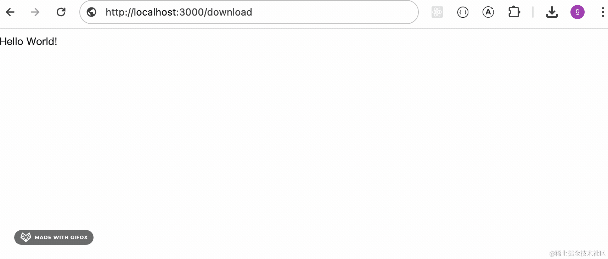

效果一样。

但是，这样文件是全部读取出来返回，如果文件大了，比如好几个 G，会占用很大的内存。

当大文件下载的时候，能不能读出一部分返回一部分，也就是流式的下载呢？

可以的，http 有这个功能。

就是 transfer-encoding:chunked

这个是面试常考题。

从服务器下载一个文件的时候，如何知道文件下载完了呢？

有两种方式：

一种是 header 里带上 Content-Length，浏览器下载到这个长度就结束。

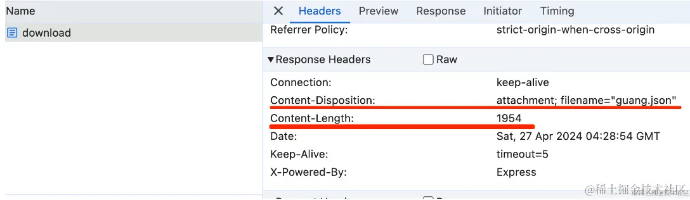

另一种是设置 transfer-encoding:chunked，它是不固定长度的，服务器不断返回内容，直到返回一个空的内容代表结束。

比如这样：
```
5
Hello
1
,
5
World
1
!
0
```
这里分了 “Hello”  “,” “World”“!” 这 4 个块，长度分别为 5、1、5、1

最后以一个长度为 0 的块代表传输结束。

这样，不管内容多少都可以分块返回，就不用指定 Content-Length 了。

这就是大文件的流式传输的原理，就是 transfer-encoding:chunked。

然后我们在代码里实现下：

```javascript
@Get('download2')
@Header('Content-Disposition', `attachment; filename="guang.json"`)
download2(@Res() res: Response) {
    const stream = fs.createReadStream('package.json');

    stream.pipe(res);
}
```
node 的 stream 本来就是分块读取内容的，这里配合流式返回数据很合适。

现在就不再返回 Content-Length 了，而是返回了 Transfer-Encoding:chunked：

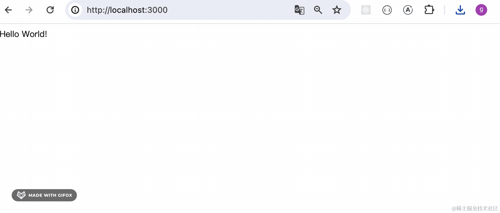

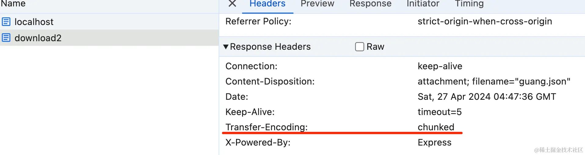

这就是流式传输。

不过在 nest 里最好不要直接用 node 的 stream api。

因为它有很多事件，比如 data、error、end 等，自己处理还是挺麻烦的。

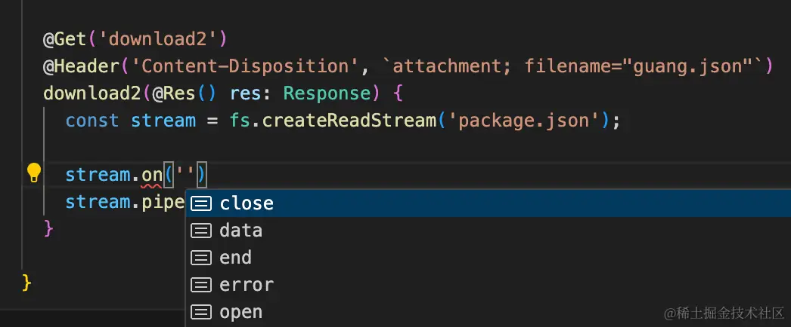

可以直接用 Nest 封装的一个类 StreamableFile：

```javascript
@Get('download3')
download3() {
    const stream = fs.createReadStream('package.json');

    return new StreamableFile(stream, {
      disposition: `attachment; filename="guang.json"`
    });
}
```

试一下：

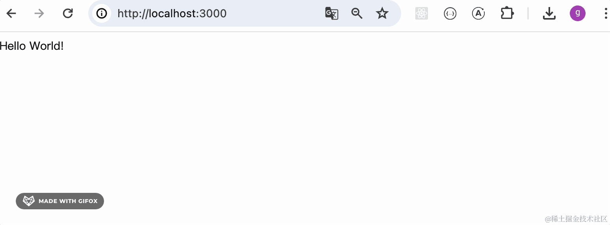

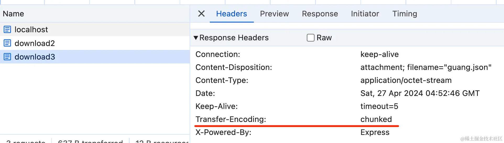

效果一样。

只是这里的 Content-Type 默认是 application/octet-stream 二进制流：

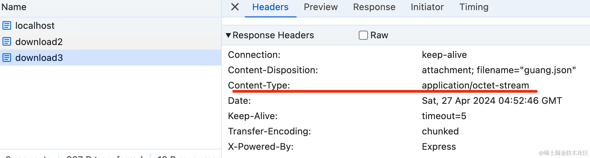

你也可以改一下：

```javascript
@Get('download3')
download3() {
    const stream = fs.createReadStream('package.json');

    return new StreamableFile(stream, {
      type: 'text/plain',
      disposition: `attachment; filename="guang.json"`
    });
}
```

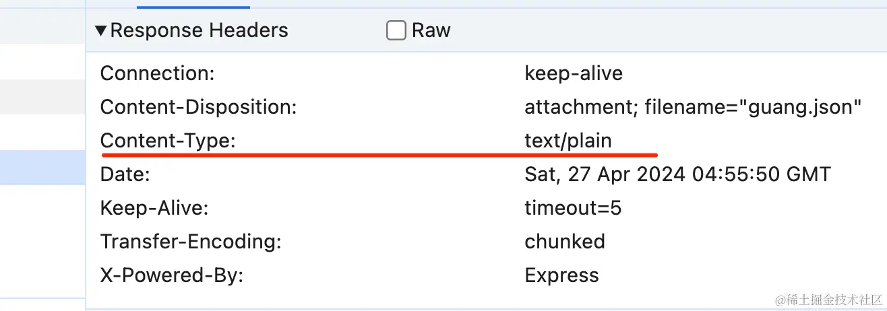

这样就实现了流式传输了。

相比大文件上传需要自己实现分片，大文件下载这个，浏览器和 http 内置了支持，直接指定对应 header 就行，自己不用做很多事情。

然后具体的 http 响应体是什么样的呢？

我们用 wireshark 抓包看一下：

在 [wireshark 官网](https://www.wireshark.org/)下载安装包：


安装后把它跑起来：


选择 loopback 这个网卡，本地回环地址，可以抓到 localhost 的包：

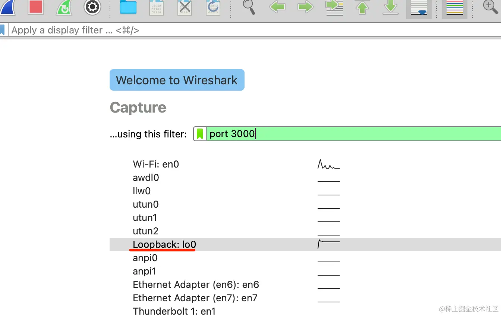

输入过滤器 port 3000，也就是过滤 3000 端口的数据包。

然后回车就会进入抓包界面：


这时候再访问下 http://localhost:3000/download3


可以看到抓到了几个 tcp 的包：


这两个分别是请求和响应：

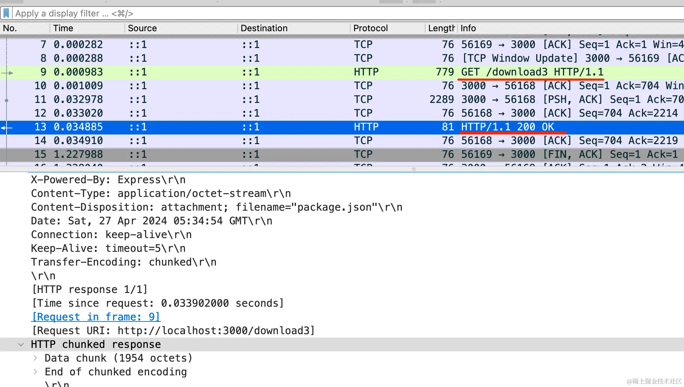

如果多了找不到，点一下 protocal 会排序：
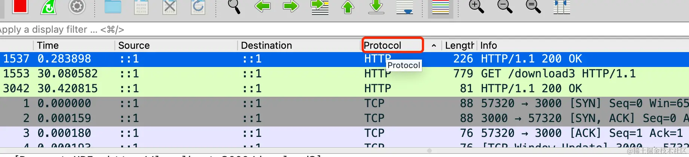


可以看到，确实是分块传输的：

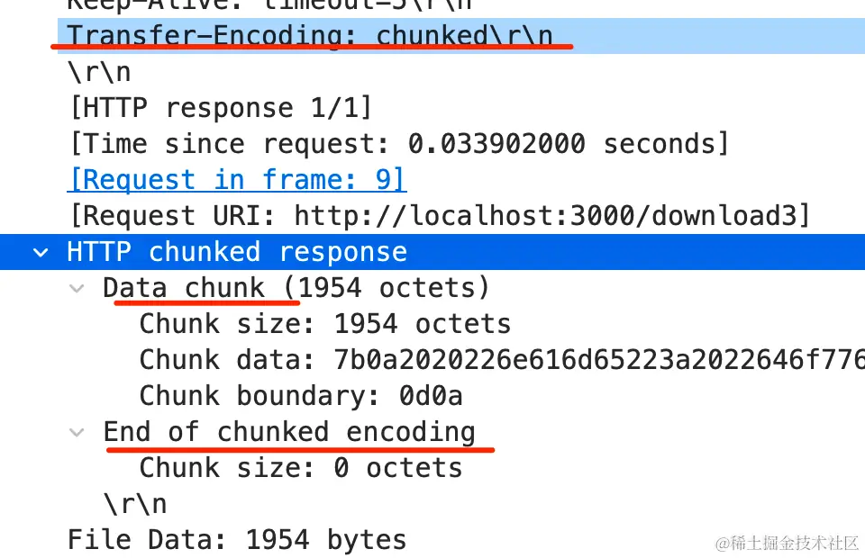

这里有一个数据块，然后一个空块结尾。

再访问下 http://localhost:3000/download 接口对比下：

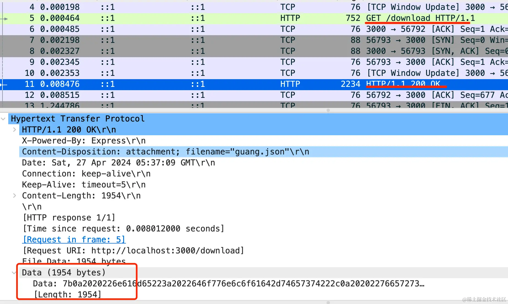

和上面的对比下，这就是没有分块的响应。

当然，现在的文件比较小，可以找一个大一点的文件试一下：

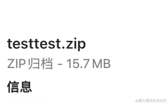

可以看到，现在分片就多了：

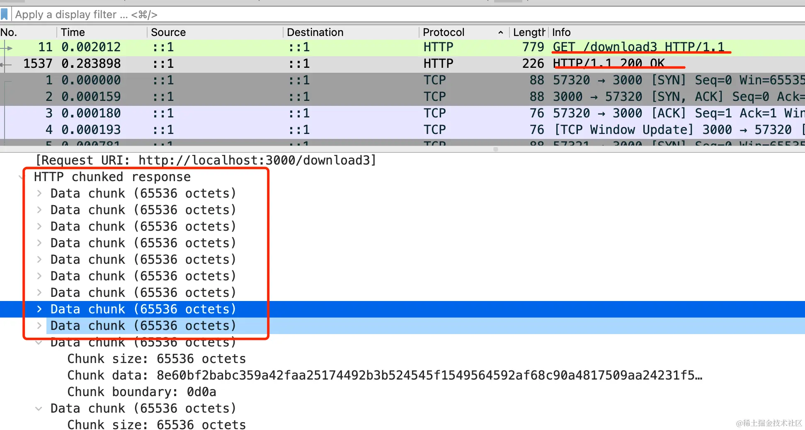

大概是 65536 一个分块，也就是 64k。

每个分块都有 chunk size 和 chunk data：

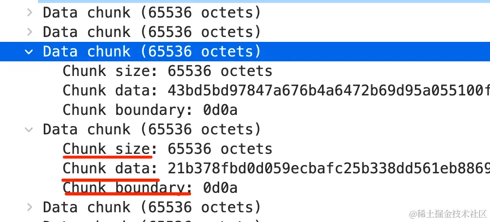

确实是分块了。

案例代码上传了 [Nest 小册仓库](https://github.com/QuarkGluonPlasma/nestjs-course-code/tree/main/download-test)。

## 总结

大文件上传的优化是分片上传，大文件下载的优化是分片下载。

只不过这个分片下载 http 帮你做了，你只要指定 transfer-encoding:chunked 就行，也叫流式传输。

在 Nest 里可以用 fs.createReadStream 获取文件流，然后返回 StreamableFile 的对象就可以了。

返回的响应就是流式的，我们通过 wireshark 抓包证实了这点。

每个分块都有 chunk size、chunk data 的信息。

以后面试官再问你大文件下载优化或者问 transfer-encoding:chunked，你就可以大胆的说你用 wireshark 抓包验证过了。