# 104. Nest 的 REPL 模式

我们写过很多 Module、Service、Controller，但这些都要服务跑起来之后在浏览器里访问对应的 url，通过 get 或者 post 的方式传参来测试。

这个还是挺麻烦的，能不能像 node 的 repl 那样，直接在控制台测试呢？

repl 是 read-eval-paint-loop，也就是这个：

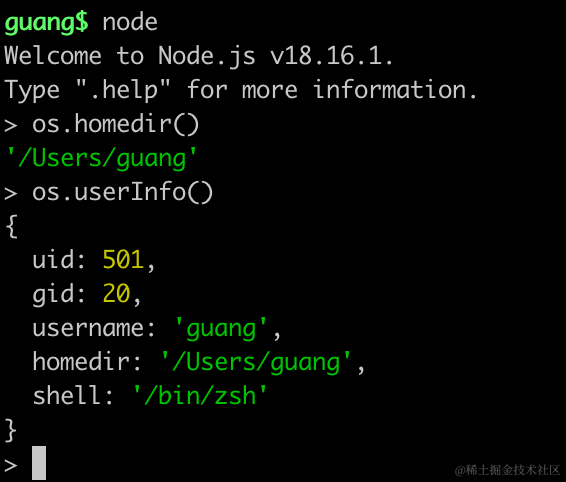

Nest 能不能这样来测试呢？

可以的，Nest 支持 repl 模式。

我们创建个 Nest 项目：

```
nest new repl-test
```

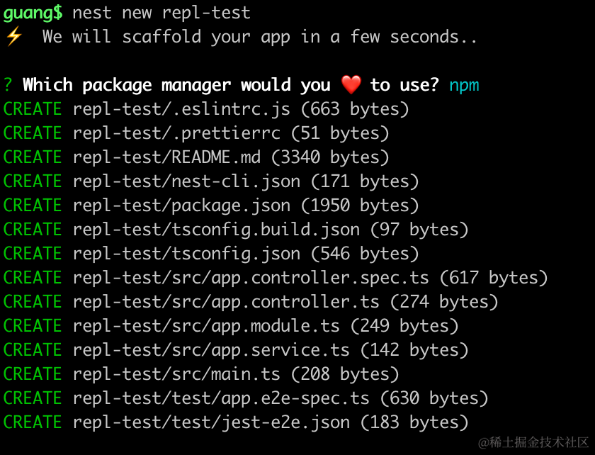

然后创建两个模块：

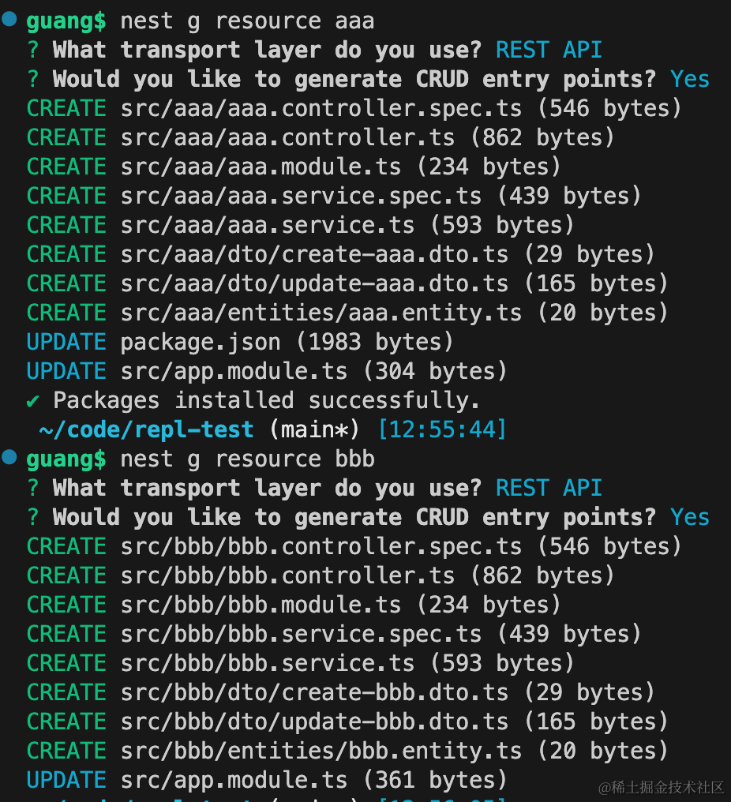

把服务跑起来：

```
npm run start:dev
```
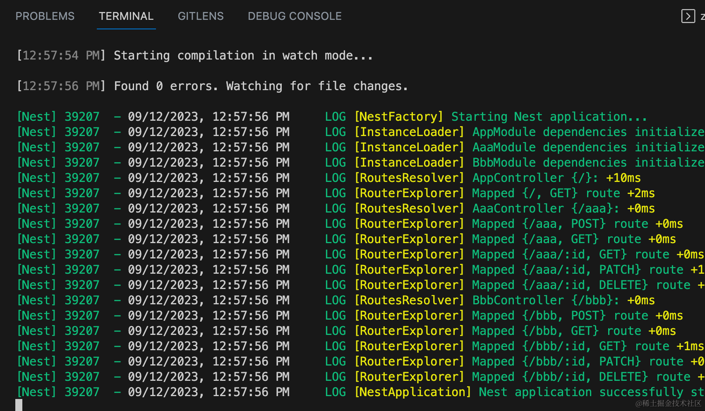

浏览器访问下：

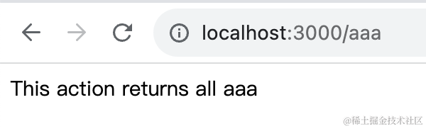

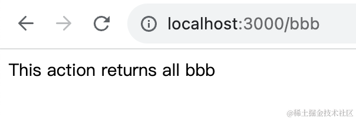

我们前面都是这么测试接口的。

其实还可以用 repl 模式。

在 src 下创建个 repl.ts，写入如下内容：

```javascript
import { repl } from '@nestjs/core';
import { AppModule } from './app.module';

async function bootstrap() {
  await repl(AppModule);
}
bootstrap();
```
然后把服务停掉，通过这种方式跑：

```
npm run start:dev -- --entryFile repl
```

这里的 --entryFile 是指定入口文件是 repl.ts

前面带了个 -- 是指后面的参数不是传给 npm run start:dev 的，要原封不动保留。

也就是会传给 nest start

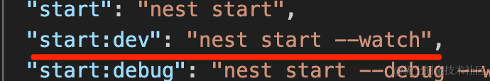

当然，你直接执行 nest start 也可以：

```
nest start --watch --entryFile repl
```

跑起来后，执行 debug()，会打印所有的 module 和 module 下的 controllers 和 providers。

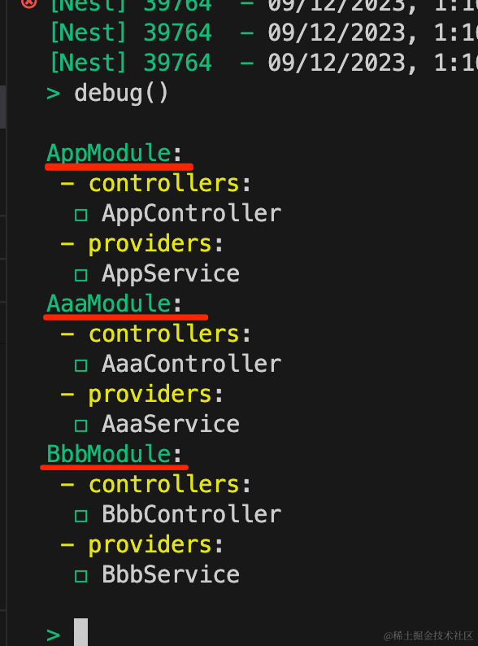

而且，你可以 get() 来取对应的 providers 或者 controllers 调用：

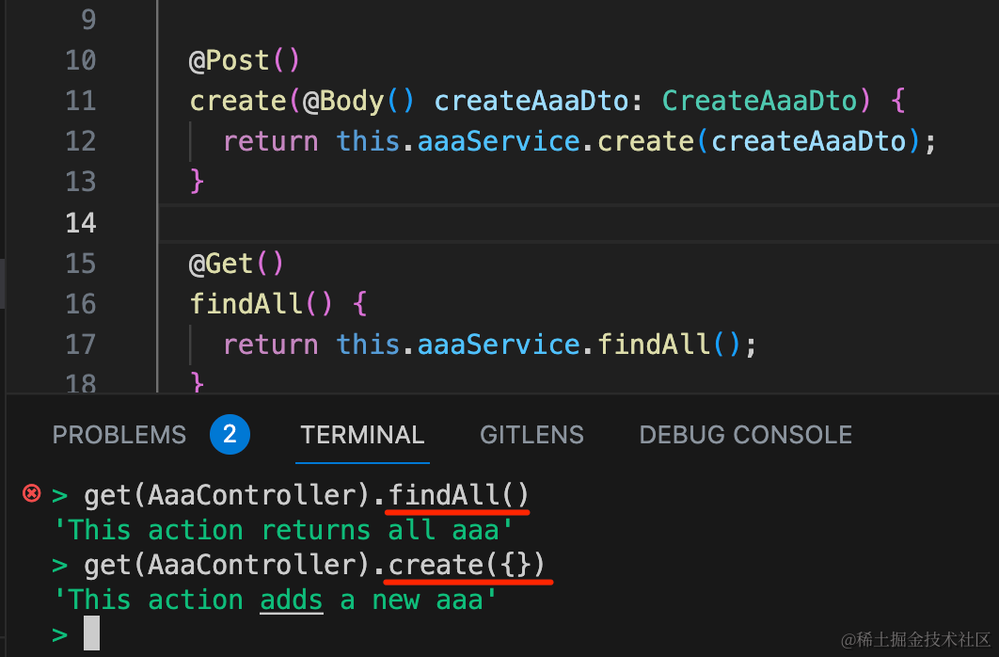

get、post 方法都可以调用。

有的同学说，你这个 post 方法没有参数啊。

那我们加一些：

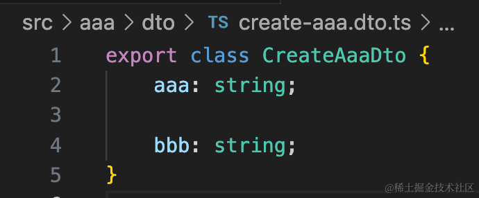

然后添加 ValidationPipe：

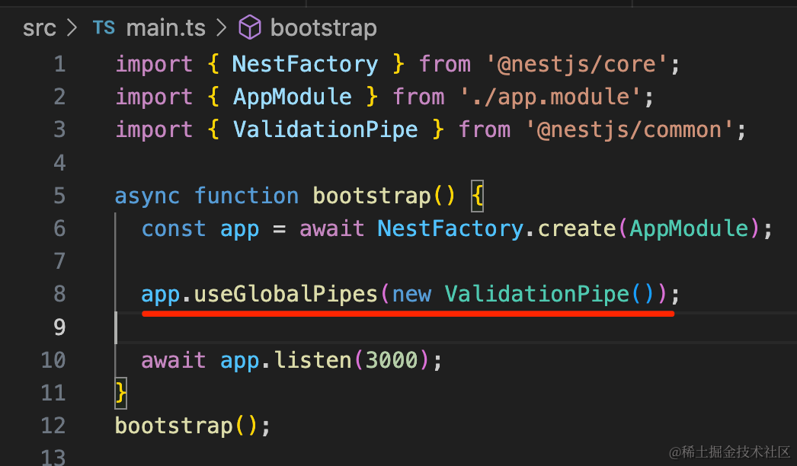

安装校验相关的包：

```
npm install class-validator class-transformer
```

在 dto 添加约束：

```javascript
import { IsEmail, IsNotEmpty } from "class-validator";

export class CreateAaaDto {
    @IsNotEmpty()
    aaa: string;

    @IsEmail()
    bbb: string;
}
```

我们先正常跑下服务：

```
npm run start:dev
```
然后 postman 里测试下：

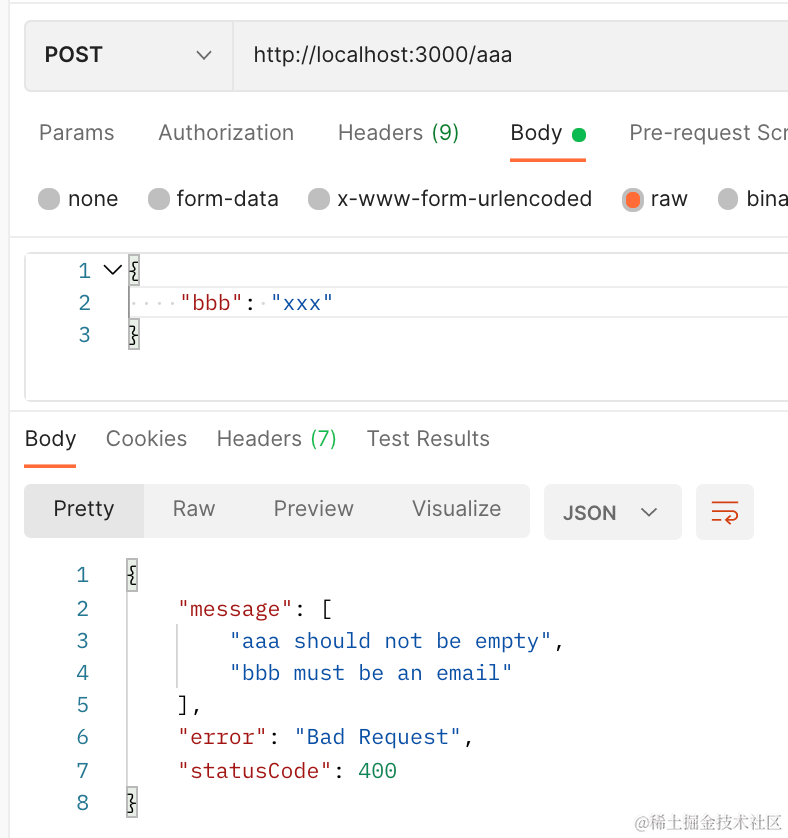

可以看到，ValidationPipe 生效了。

那 repl 里是不是一样呢？

我们再跑下 repl 模式：

```
npm run start:dev -- --entryFile repl
```

可以看到，并没有触发 pipe：

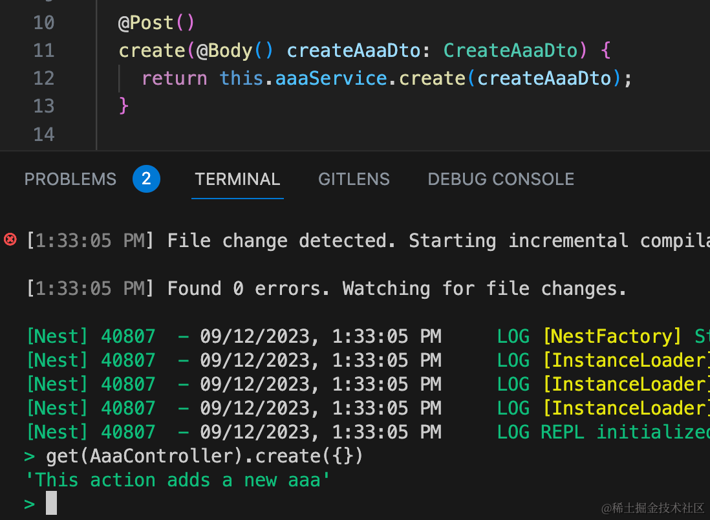

也就是说，它只是单纯的传参调用这个函数，不会解析装饰器。

所以测试 controller 的话，repl 的方式是有一些限制的。

但是测试 service 很不错：

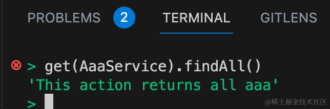

比如测试某个项目的 UserService 的 login 方法：

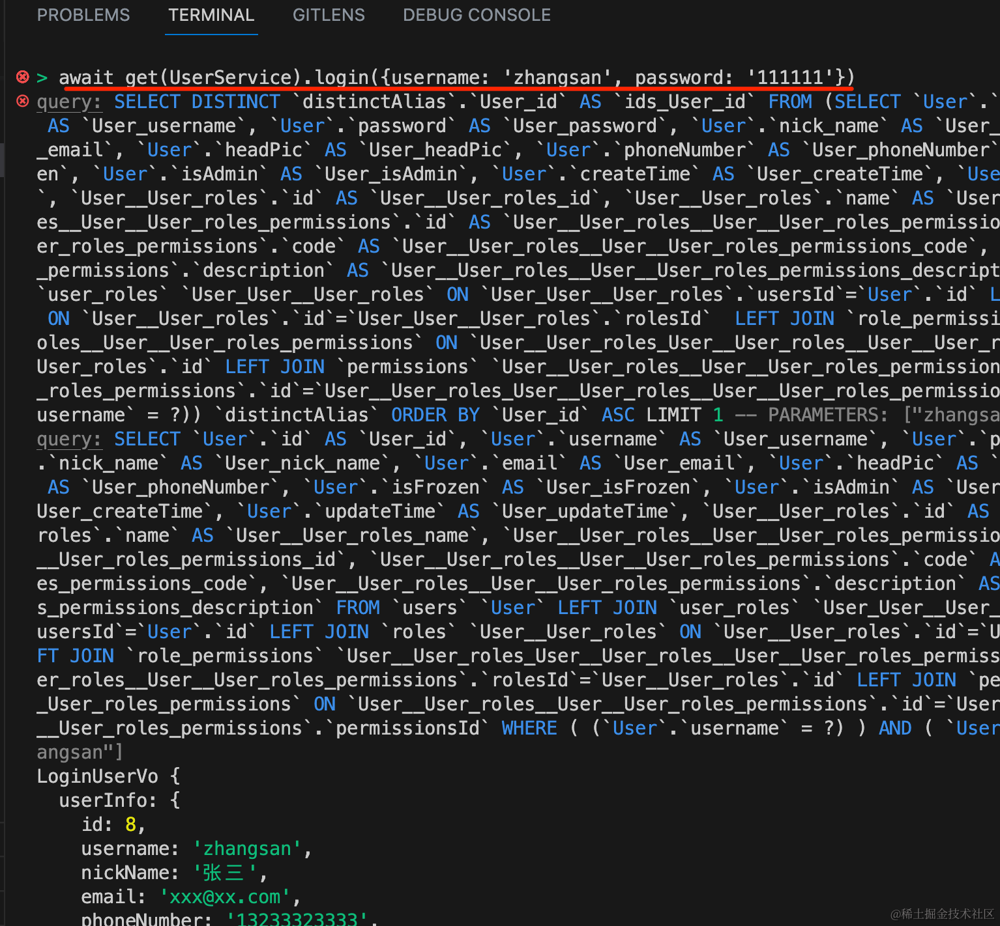

就很方便。

大概知道 repl 模式是做啥的之后，我们过一下常用的 api：

debug() 可以查看全部的 module 或者某个 module 下的 cotrollers、providers：

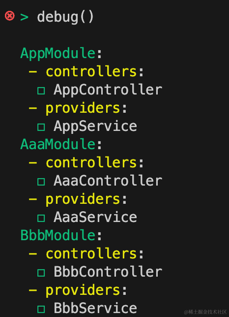

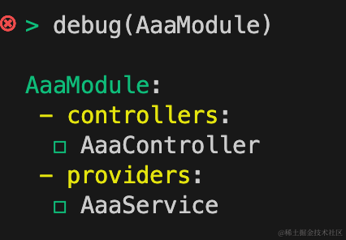

methods() 可以查看某个 controller 或者 provider 的方法：

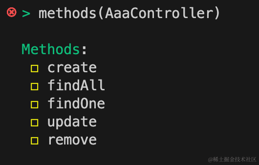

get() 或者 $() 可以拿到某个 controller 或者 provider 调用它的方法：

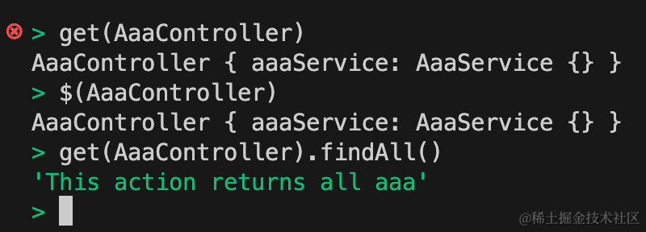

常用的 api 就这些。

此外，按住上下键可以在历史命令中导航：

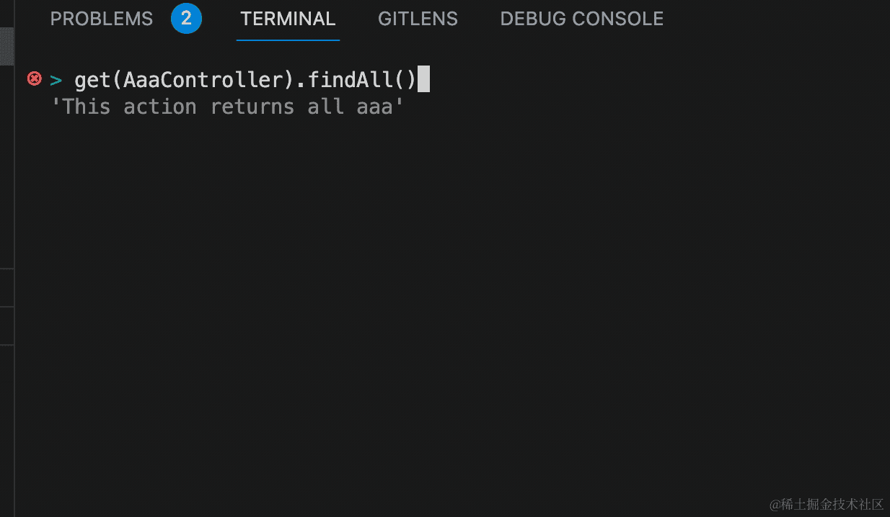

但有个问题。

当你重新跑之后，这些命令历史就消失了，再按上下键也没有历史。

可以改一下 repl.ts：

```javascript
import { repl } from '@nestjs/core';
import { AppModule } from './app.module';

async function bootstrap() {
    const replServer = await repl(AppModule);
    replServer.setupHistory(".nestjs_repl_history", (err) => {
        if (err) {
            console.error(err);
        }
    });
}
bootstrap();

```
再跑的时候也是有历史的：

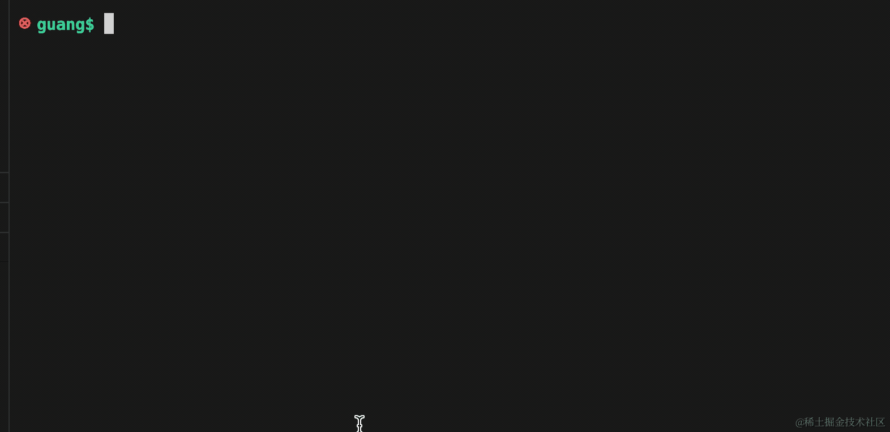

其实就是 nest 会把历史命令写入文件里，下一次跑就可以用它恢复历史了：

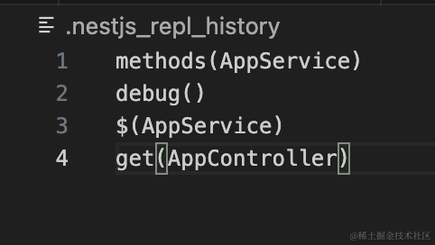

你还可以把这个命令配到 npm scripts 里：

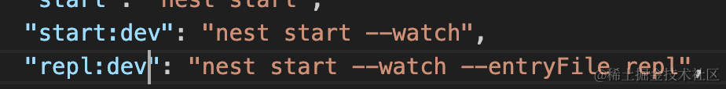

然后直接 npm run repl:dev 来跑。

案例代码上传了[小册仓库](https://github.com/QuarkGluonPlasma/nestjs-course-code/tree/main/repl-login)。

## 总结

这节我们学了 nest 的 repl 模式。

repl 模式下可以直接调用 controller 或者 provider 的方法，但是它们并不会触发 pipe、interceptor 等，只是传参测试函数。

可以使用 debug() 拿到 module、controller、provider 的信息，methods() 拿到方法，然后 get() 或者 $() 拿到 controller、provider 然后调用。

repl 模式对于测试 service 或者 contoller 的功能还是很有用的。
