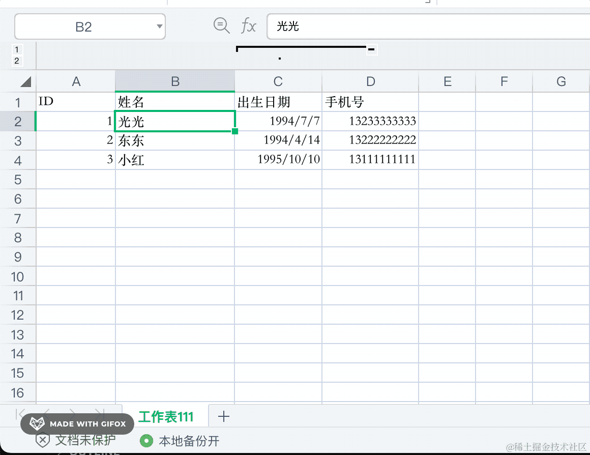

# 105. 实现 Excel 导入导出

Excel 是常用的办公软件，我们会用它来做数据的整理。


后台管理系统一般都会支持从 Excel 导入数据，或者导出数据到 Excel 文件：


那这种功能是如何实现的呢？

在 Node 和浏览器里，如何解析、生成 Excel 文件呢？

一般我们会用 [exceljs](https://www.npmjs.com/package/exceljs) 这个包来做。

在 npm 官网可以看到，这个包每周有 30w+ 的下载量，用的还是很多的：


我们具体写代码试试：

```
mkdir exceljs-test
cd exceljs-test
npm init -y
```


安装 exceljs：

```
npm install --save exceljs
```
把刚才这个 excel 文件复制过来：


我们在代码里读取出来看看：

```javascript
const { Workbook } = require('exceljs');

async function main(){
    const workbook = new Workbook();

    const workbook2 = await workbook.xlsx.readFile('./data.xlsx');

    workbook2.eachSheet((sheet, index1) => {
        console.log('工作表' + index1);

        sheet.eachRow((row, index2) => {
            const rowData = [];
    
            row.eachCell((cell, index3) => {
                rowData.push(cell.value);
            });

            console.log('行' + index2, rowData);
        })
    })
}

main();
```
工作表就是这个东西：



每个工作表下都是独立的表格。

也就是 workbook（工作簿） > worksheet（工作表） > row（行） > cell（列）这样的层级关系。

每一层都可以遍历：


所以我们遍历 sheet、row、cell 这几层，就能拿到所有的数据。

跑下看看：


确实都拿到了。

这样就是数据导入，我们从 excel 文件里解析出数据，然后存入数据库。

exceljs 还提供了简便的方法，可以直接调用 worksheet 的 getSheetValues 来拿到表格数据，不用自己遍历：


解析 excel 文件还是很简单的。

导入数据的时候，按照格式从中解析数据然后存入数据库就行。

有同学可能会说，那如果 excel 的格式不符合要求呢？


一般我们都会提供一个 excel 模版，用这个模版来填数据，然后再导入。

excel 解析我们会了，再来看下 excel 的生成：

```javascript
const { Workbook } = require('exceljs');

async function main(){
    const workbook = new Workbook();

    const worksheet = workbook.addWorksheet('guang111');

    worksheet.columns = [
        { header: 'ID', key: 'id', width: 20 },
        { header: '姓名', key: 'name', width: 30 },
        { header: '出生日期', key: 'birthday', width: 30},
        { header: '手机号', key: 'phone', width: 50 }
    ];

    const data = [
        { id: 1, name: '光光', birthday: new Date('1994-07-07'), phone: '13255555555' },
        { id: 2, name: '东东', birthday: new Date('1994-04-14'), phone: '13222222222' },
        { id: 3, name: '小刚', birthday: new Date('1995-08-08'), phone: '13211111111' }
    ]
    worksheet.addRows(data);

    workbook.xlsx.writeFile('./data2.xlsx');    
}

main();
```
相当简单，也是按照层次结构，先 addWorkSheet、然后 addRows，之后写入文件。


可以看到 worksheet 的名字，还有每行的数据都是对的。

右边手机号那一列最宽，因为我们设置了 width 是 50。

excel 是可以设置格式的，比如字体、背景色等，在代码里同样可以。


就是遍历 row、cell，根据行数设置 style 就好了：
```javascript
worksheet.eachRow((row, rowIndex) => {
    row.eachCell(cell => {
        if(rowIndex === 1) {
            cell.style = {
                font: {
                    size: 10,
                    bold: true,
                    color: { argb: 'ffffff' }
                },
                alignment: { vertical: 'middle', horizontal: 'center' },
                fill: {
                    type: 'pattern',
                    pattern: 'solid',
                    fgColor: { argb: '000000' }
                },
                border: {
                    top: { style: 'dashed', color: { argb: '0000ff' } },
                    left: { style: 'dashed', color: { argb: '0000ff' } },
                    bottom: { style: 'dashed', color: { argb: '0000ff' } },
                    right: { style: 'dashed', color: { argb: '0000ff' } }
                }
            }
        } else {
            cell.style = {
                font: {
                    size: 10,
                    bold: true,
                },
                alignment: { vertical: 'middle', horizontal: 'left' },
                border: {
                    top: { style: 'dashed', color: { argb: '0000ff' } },
                    left: { style: 'dashed', color: { argb: '0000ff' } },
                    bottom: { style: 'dashed', color: { argb: '0000ff' } },
                    right: { style: 'dashed', color: { argb: '0000ff' } }
                }
            }
        }
    })
})
```
style 可以设置 font、fill、border、alignment 这些。

跑下看看：


这样，就完成了数据的导出。

而且，exceljs 这个库可以直接在浏览器里用。

我们试试：


创建 index.html，引入 exceljs 包。

添加一个 file 类型的 input，onchange 的时候解析其中的内容，解析逻辑和之前一样，只是从 readFile 换成 load。

```html
<!DOCTYPE html>
<html lang="en">
<head>
    <meta charset="UTF-8">
    <meta name="viewport" content="width=device-width, initial-scale=1.0">
    <title>Document</title>
    <script src="https://unpkg.com/exceljs@4.4.0/dist/exceljs.min.js"></script>
</head>
<body>
    <input id="fileInput" type="file"/>
    <script>
        const fileInput = document.getElementById('fileInput');
        fileInput.onchange = async () => {
            const file = fileInput.files[0];

            const { Workbook } = ExcelJS;

            const workbook = new Workbook();

            const workbook2 = await workbook.xlsx.load(file);

            workbook2.eachSheet((sheet, index1) => {
                console.log('工作表' + index1);

                const value = sheet.getSheetValues();

                console.log(value);
            })
        }
    </script>
</body>
</html>
```
起个静态服务：

```
npx http-server .
```


浏览器访问下：


可以看到，同样解析出了 excel 的内容。

然后再试试生成 excel：


前面的逻辑一样，只是把 writeFile 换成了 writeBuffer。

这里我创建了一个 10M 的 ArrayBuffer 来写入数据，之后再读取。

```html
<!DOCTYPE html>
<html lang="en">
<head>
    <meta charset="UTF-8">
    <meta name="viewport" content="width=device-width, initial-scale=1.0">
    <title>Document</title>
    <script src="https://unpkg.com/exceljs@4.4.0/dist/exceljs.min.js"></script>
</head>
<body>
    <script>
        const { Workbook } = ExcelJS;

        async function main(){
            const workbook = new Workbook();

            const worksheet = workbook.addWorksheet('guang111');

            worksheet.columns = [
                { header: 'ID', key: 'id', width: 20 },
                { header: '姓名', key: 'name', width: 30 },
                { header: '出生日期', key: 'birthday', width: 30},
                { header: '手机号', key: 'phone', width: 50 }
            ];

            const data = [
                { id: 1, name: '光光', birthday: new Date('1994-07-07'), phone: '13255555555' },
                { id: 2, name: '东东', birthday: new Date('1994-04-14'), phone: '13222222222' },
                { id: 3, name: '小刚', birthday: new Date('1995-08-08'), phone: '13211111111' }
            ]
            worksheet.addRows(data);

            worksheet.eachRow((row, rowIndex) => {
                row.eachCell(cell => {
                    if(rowIndex === 1) {
                        cell.style = {
                            font: {
                                size: 10,
                                bold: true,
                                color: { argb: 'ffffff' }
                            },
                            alignment: { vertical: 'middle', horizontal: 'center' },
                            fill: {
                                type: 'pattern',
                                pattern: 'solid',
                                fgColor: { argb: '000000' }
                            },
                            border: {
                                top: { style: 'dashed', color: { argb: '0000ff' } },
                                left: { style: 'dashed', color: { argb: '0000ff' } },
                                bottom: { style: 'dashed', color: { argb: '0000ff' } },
                                right: { style: 'dashed', color: { argb: '0000ff' } }
                            }
                        }
                    } else {
                        cell.style = {
                            font: {
                                size: 10,
                                bold: true,
                            },
                            alignment: { vertical: 'middle', horizontal: 'left' },
                            border: {
                                top: { style: 'dashed', color: { argb: '0000ff' } },
                                left: { style: 'dashed', color: { argb: '0000ff' } },
                                bottom: { style: 'dashed', color: { argb: '0000ff' } },
                                right: { style: 'dashed', color: { argb: '0000ff' } }
                            }
                        }
                    }
                })
            })

            const arraybuffer = new ArrayBuffer(10 * 1024 * 1024);
            const res = await workbook.xlsx.writeBuffer(arraybuffer);

            console.log(res.buffer);
        }

        main();
    </script>
</body>
</html>
```
跑下试试：


可以看到，确实有数据了。

那有了 arraybuffer 的数据，如何触发下载呢？

创建一个 a 标签，设置 download 属性，然后触发点击就可以了。

也就是这样：


```javascript
function download(arrayBuffer) {
    const link = document.createElement('a');

    const blob = new Blob([arrayBuffer]);
    const url = URL.createObjectURL(blob);
    link.href = url;
    link.download = 'guang.xlsx';

    document.body.appendChild(link);

    link.click();
    link.addEventListener('click', () => {
        link.remove();
    });
}
```
跑一下：


可以看到，生成了 excel 并且触发了下载。


打开文件，可以看到和 node 里生成的一样。

案例代码上传了 github：https://github.com/QuarkGluonPlasma/nestjs-course-code/tree/main/exceljs-test

## 总结

Excel 的导入导出是后台管理系统的常见功能，我们一般用 exceljs 来实现。

excel 文件分为 workbook、worksheet、row、cell 这 4 层，解析和生成都是按照这个层次结构来。

解析就是 readFile 之后，遍历 worksheet、row，拿到 cell 中的数据 。

生成就是 addWorkSheet、addRow 添加数据，然后 writeFile 来写入文件。

如果是在浏览器里，就把 readFile 换成 load，把 writeFile 换成 writeBuffer 就好了。

浏览器里生成 excel 之后，可以通过 a 标签触发下载，设置 download 属性之后，触发点击就好了。

这样，我们就分别在 node 和浏览器里完成了 excel 的解析和生成。