# 107. 如何拿到服务器 CPU、内存、磁盘状态

在很多系统中，会有展示服务器信息的页面。

比如 CPU、内存、磁盘等：

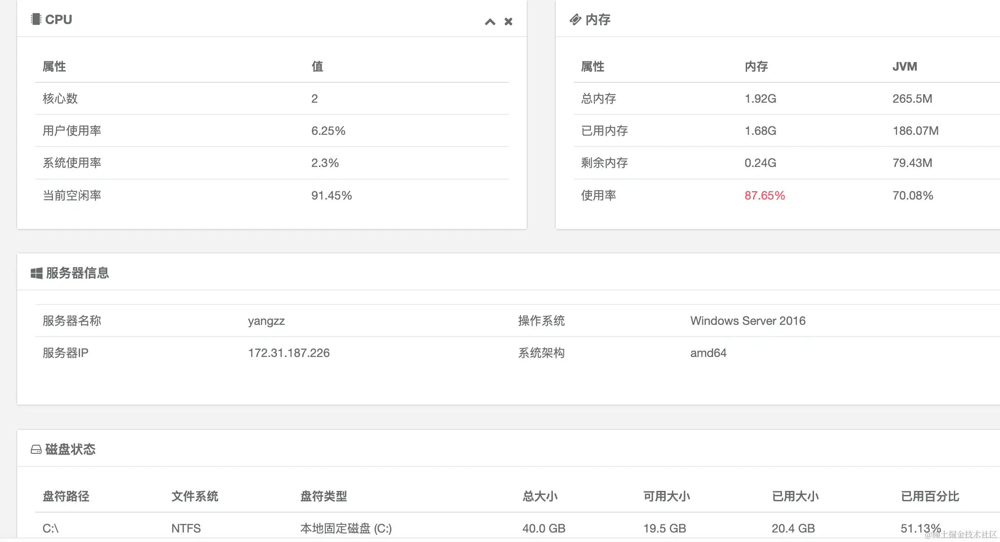

这是怎么实现的呢？

其实通过 node 的原生 api 就可以做到。

我们还是用 Nest 写个接口来返回这些信息：

```
nest new server-status
```

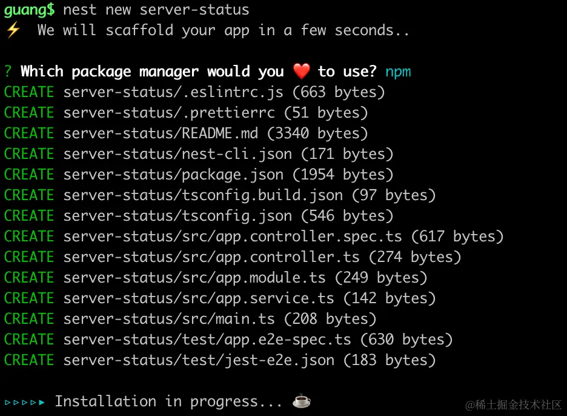

在 AppController 加个接口，用 os.cpus 拿到 cpu 的信息：

```javascript
import { Controller, Get } from '@nestjs/common';
import { AppService } from './app.service';
import * as os from 'os';

@Controller()
export class AppController {
  constructor(private readonly appService: AppService) {}

  @Get()
  getHello(): string {
    return this.appService.getHello();
  }

  @Get('status')
  status() {
    return os.cpus();
  }
}
```
把服务跑起来：

```
npm run start:dev
```

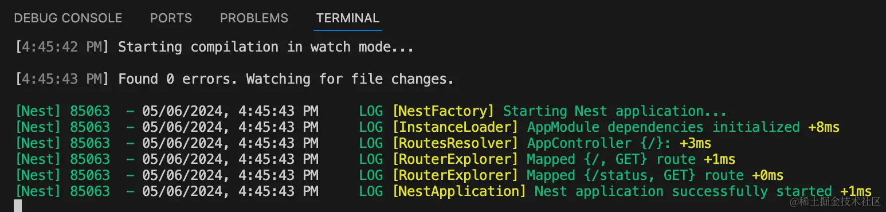

浏览器访问下：

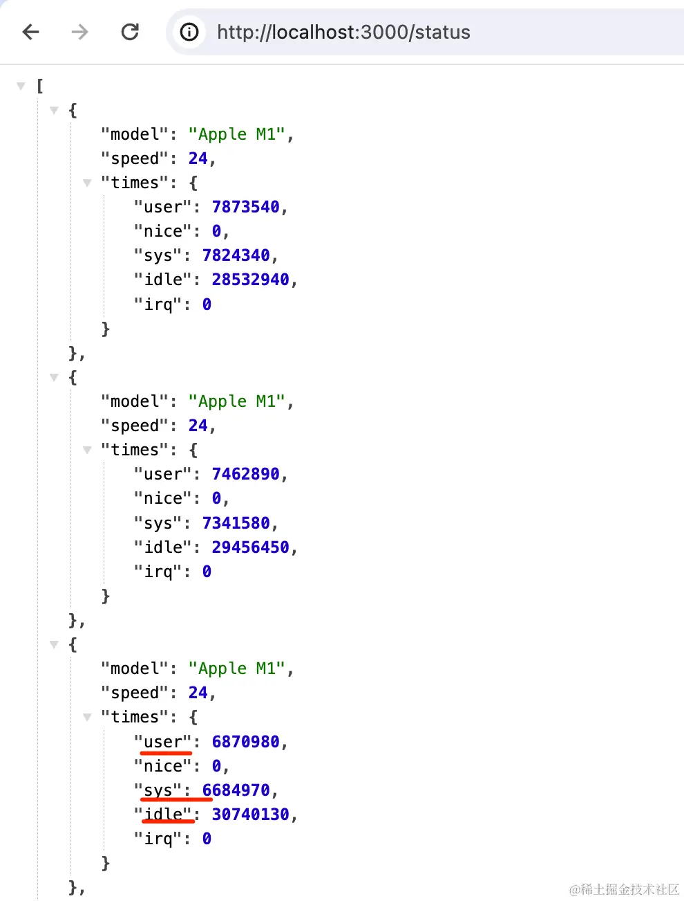

返回的数组元素个数就是 cpu 数。

那具体的属性是什么意思呢？


可以看到，times.user、times.sys、times.idle 分别代表用户代码占用的 cpu 时间、系统代码占用的 cpu 时间，空闲的 cpu 时间：

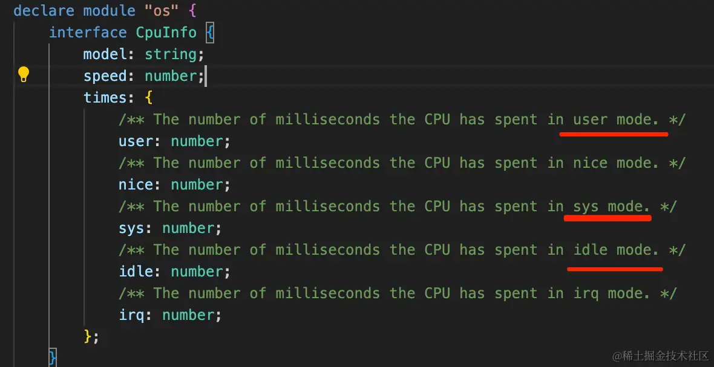

基于这些就能算出 cpu 的使用率、空置率来。

```javascript
@Get('status')
status() {
    const cpus = os.cpus();
    const cpuInfo = cpus.reduce(
      (info, cpu) => {
        info.cpuNum += 1;
        info.user += cpu.times.user;
        info.sys += cpu.times.sys;
        info.idle += cpu.times.idle;
        info.total += cpu.times.user + cpu.times.sys + cpu.times.idle;
        return info;
      },
      { user: 0, sys: 0, idle: 0, total: 0, cpuNum: 0 },
    );
    const cpu = {
      cpuNum: cpuInfo.cpuNum,
      sys: ((cpuInfo.sys / cpuInfo.total) * 100).toFixed(2),
      used: ((cpuInfo.user / cpuInfo.total) * 100).toFixed(2),
      free: ((cpuInfo.idle / cpuInfo.total) * 100).toFixed(2),
    };
    return cpu;
}
```
用 reduce 方法累加 cpu 的数量、user、sys、idle 以及总的 cpu 时间。

然后 cpu 的系统使用率就是 sys/total，用户使用率是 user/total 而空置率就是 idle/total。


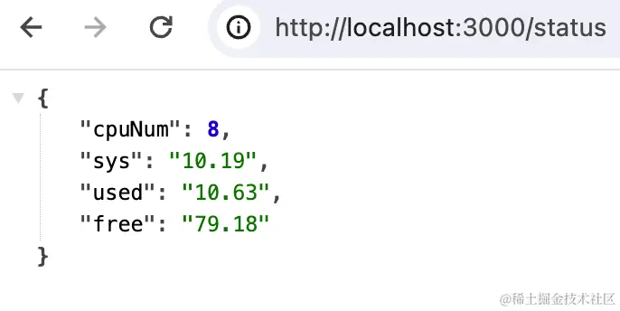

对应的就是这部分信息：

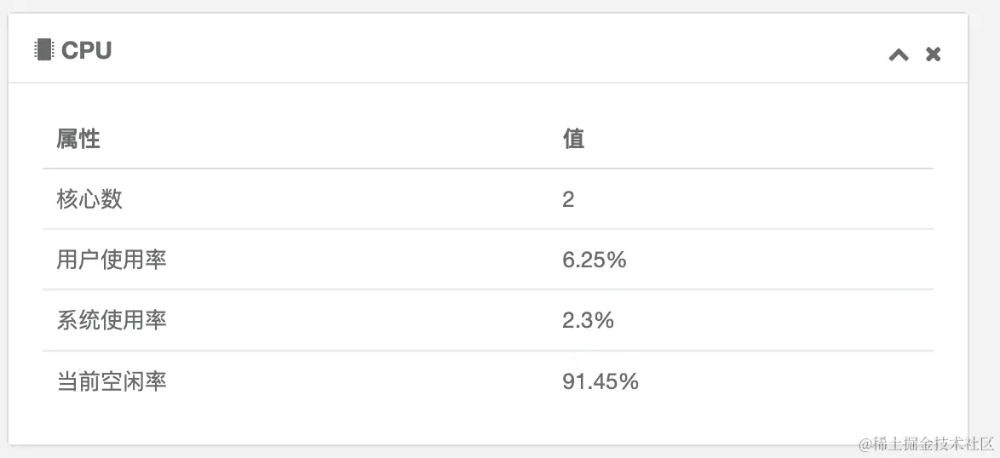

然后继续拿内存信息：

```javascript
import { Controller, Get } from '@nestjs/common';
import { AppService } from './app.service';
import * as os from 'os';

@Controller()
export class AppController {
  constructor(private readonly appService: AppService) {}

  @Get()
  getHello(): string {
    return this.appService.getHello();
  }

  @Get('status')
  status() {
    return {
      cpu: this.getCpuInfo(),
      mem: this.getMemInfo()
    }
  }

  getMemInfo() {
    const totalMemory = os.totalmem();
    const freeMemory = os.freemem();
    const usedMemory = totalMemory - freeMemory;
    const memoryUsagePercentage = (((totalMemory - freeMemory) / totalMemory) * 100).toFixed(2);
    const mem = {
      total: totalMemory,
      used: usedMemory,
      free: freeMemory,
      usage: memoryUsagePercentage,
    };
    return mem;
  }

  getCpuInfo() {
    const cpus = os.cpus();
    const cpuInfo = cpus.reduce(
      (info, cpu) => {
        info.cpuNum += 1;
        info.user += cpu.times.user;
        info.sys += cpu.times.sys;
        info.idle += cpu.times.idle;
        info.total += cpu.times.user + cpu.times.sys + cpu.times.idle;
        return info;
      },
      { user: 0, sys: 0, idle: 0, total: 0, cpuNum: 0 },
    );
    const cpu = {
      cpuNum: cpuInfo.cpuNum,
      sys: ((cpuInfo.sys / cpuInfo.total) * 100).toFixed(2),
      used: ((cpuInfo.user / cpuInfo.total) * 100).toFixed(2),
      free: ((cpuInfo.idle / cpuInfo.total) * 100).toFixed(2),
    };
    return cpu;
  }
}
```

os.totalmem 是总内存，os.freemem 是空闲内存，那差值就是已使用的内存。

这样也可以求出内存使用率。

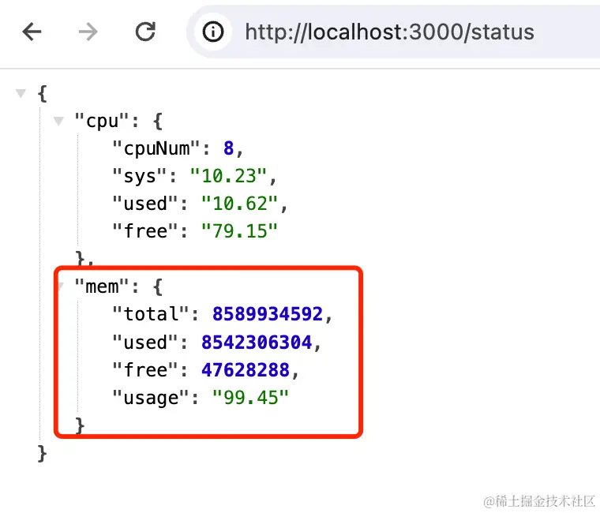

我们把它转成 GB 单位的数值返回：

```javascript
bytesToGB(bytes) {
    const gb = bytes / (1024 * 1024 * 1024);
    return gb.toFixed(2);
}

getMemInfo() {
    const totalMemory = os.totalmem();
    const freeMemory = os.freemem();
    const usedMemory = totalMemory - freeMemory;
    const memoryUsagePercentage = (((totalMemory - freeMemory) / totalMemory) * 100).toFixed(2);
    const mem = {
      total: this.bytesToGB(totalMemory),
      used: this.bytesToGB(usedMemory),
      free: this.bytesToGB(freeMemory),
      usage: memoryUsagePercentage,
    };
    return mem;
}
```

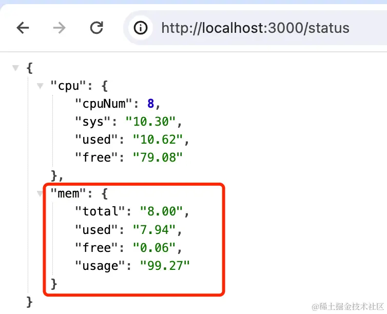

对应的是这部分信息：

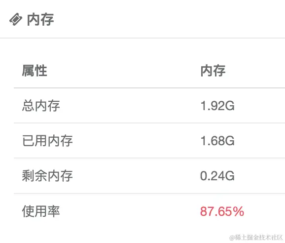

然后是磁盘信息：

这里用到 [node-disk-info](https://www.npmjs.com/package/node-disk-info) 这个包：

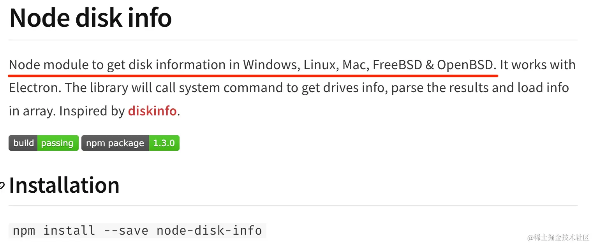

安装下：

```
npm install --save node-disk-info
```

调用下：

```javascript
import { Controller, Get } from '@nestjs/common';
import { AppService } from './app.service';
import * as os from 'os';
import * as nodeDiskInfo from 'node-disk-info';

@Controller()
export class AppController {
  constructor(private readonly appService: AppService) {}

  @Get()
  getHello(): string {
    return this.appService.getHello();
  }

  @Get('status')
  async status() {
    return {
      cpu: this.getCpuInfo(),
      mem: this.getMemInfo(),
      dist: await this.getDiskStatus()
    }
  }

  async getDiskStatus() {
    const disks = await nodeDiskInfo.getDiskInfoSync();

    const sysFiles = disks.map((disk: any) => {
      return {
        dirName: disk._mounted,
        typeName: disk._filesystem,
        total: this.bytesToGB(disk._blocks) + 'GB',
        used: this.bytesToGB(disk._used) + 'GB',
        free: this.bytesToGB(disk._available) + 'GB',
        usage: ((disk._used / disk._blocks || 0) * 100).toFixed(2),
      };
    });
    return sysFiles;
  }

  bytesToGB(bytes) {
    const gb = bytes / (1024 * 1024 * 1024);
    return gb.toFixed(2);
  }

  getMemInfo() {
    const totalMemory = os.totalmem();
    const freeMemory = os.freemem();
    const usedMemory = totalMemory - freeMemory;
    const memoryUsagePercentage = (((totalMemory - freeMemory) / totalMemory) * 100).toFixed(2);
    const mem = {
      total: this.bytesToGB(totalMemory),
      used: this.bytesToGB(usedMemory),
      free: this.bytesToGB(freeMemory),
      usage: memoryUsagePercentage
    };
    return mem;
  }

  getCpuInfo() {
    const cpus = os.cpus();
    const cpuInfo = cpus.reduce(
      (info, cpu) => {
        info.cpuNum += 1;
        info.user += cpu.times.user;
        info.sys += cpu.times.sys;
        info.idle += cpu.times.idle;
        info.total += cpu.times.user + cpu.times.sys + cpu.times.idle;
        return info;
      },
      { user: 0, sys: 0, idle: 0, total: 0, cpuNum: 0 },
    );
    const cpu = {
      cpuNum: cpuInfo.cpuNum,
      sys: ((cpuInfo.sys / cpuInfo.total) * 100).toFixed(2),
      used: ((cpuInfo.user / cpuInfo.total) * 100).toFixed(2),
      free: ((cpuInfo.idle / cpuInfo.total) * 100).toFixed(2),
    };
    return cpu;
  }
}
```
这里拿到的就是本地所有的磁盘信息：

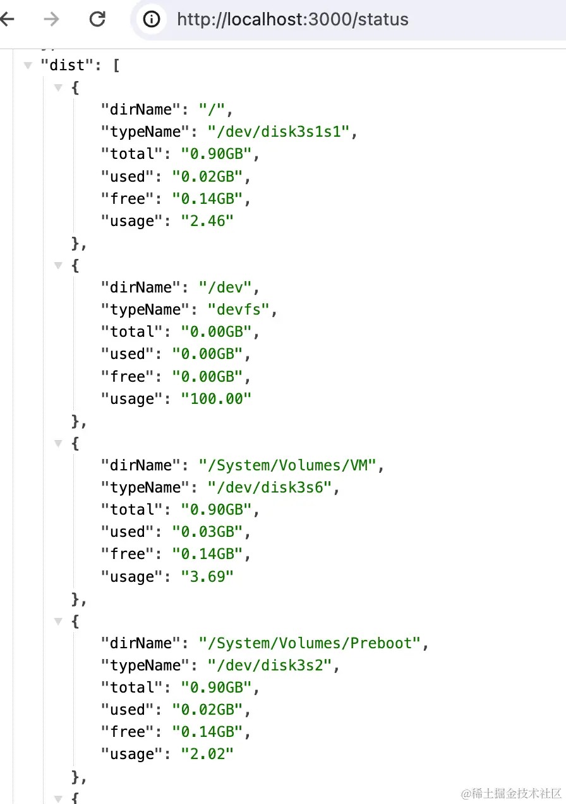

分别是路径、文件系统、总大小、已用大小、可用大小、已用百分比：


最后，我们还要返回其他的服务器信息：

```javascript
@Get('status')
async status() {
    return {
      cpu: this.getCpuInfo(),
      mem: this.getMemInfo(),
      dist: await this.getDiskStatus(),
      sys: this.getSysInfo()
    }
}

getSysInfo() {
    return {
      computerName: os.hostname(),
      computerIp: this.getServerIP(),
      osName: os.platform(),
      osArch: os.arch(),
    };
}

getServerIP() {
    const nets = os.networkInterfaces();
    for (const name of Object.keys(nets)) {
      for (const net of nets[name]) {
        if (net.family === 'IPv4' && !net.internal) {
          return net.address;
        }
      }
    }
}
```
这里的 os.networkInterfaces 是拿到所有网卡信息：

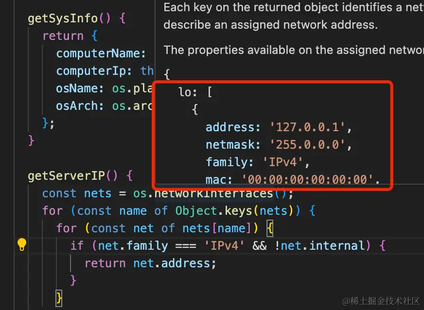

从中过滤出非 IPv4 的外部网卡的 ip 来返回。

此外，我们还通过 os.homename、os.platform、os.arch 分别拿到了主机名、操作系统、操作系统架构等信息。

试一下：

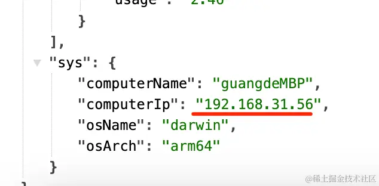

和我系统设置里的 ip 一样：

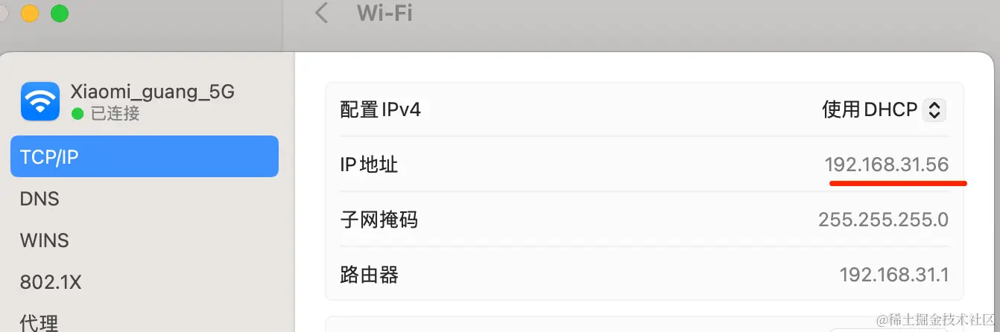

对应这部分信息：

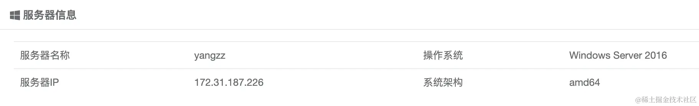

这样，服务器的状态数据就都拿到了。

可以实现这样的服务监控页面：

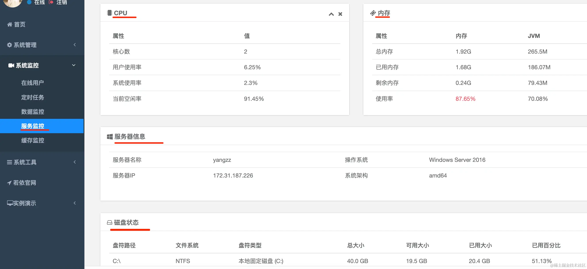

案例代码上传了[小册仓库](https://github.com/QuarkGluonPlasma/nestjs-course-code/tree/main/server-status)
## 总结

这节我们拿到了服务器的 cpu、内存、磁盘、ip 等信息。

通过 node 的 os 模块的 api 以及 node-disk-info 这个包。

可以在后台管理系统加一个页面来展示这些信息。
