# 111. 会议室预订系统：用户管理模块--用户注册

前两节我们理清了需求、画了原型图，并且确定了技术选型、设计了数据库，划分了接口和模块。

这节我们正式开始写代码。

首先创建个 nest 项目：

```
nest new meeting_room_booking_system_backend
```
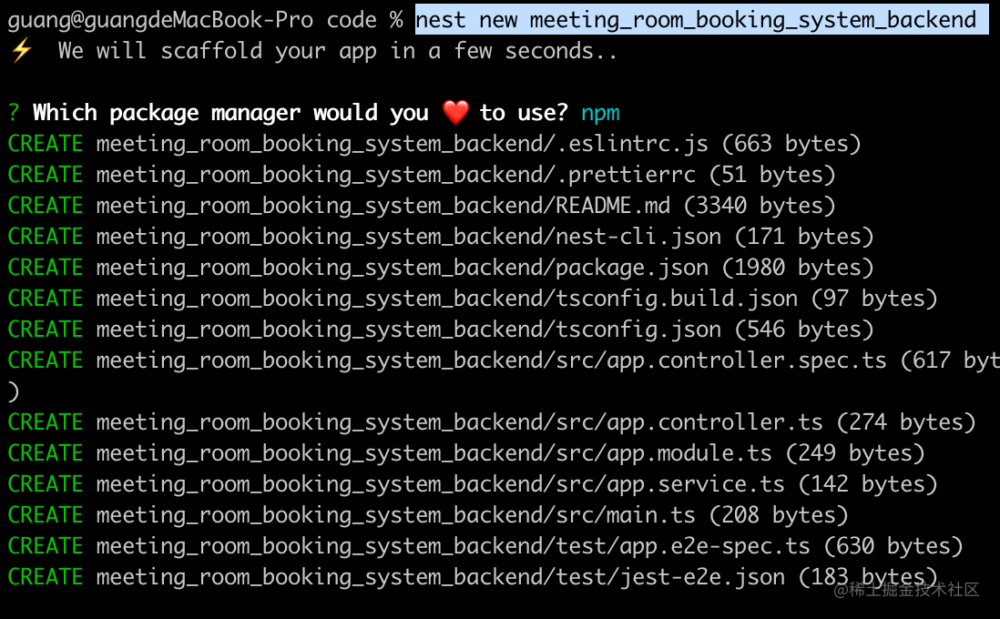

在 docker desktop 里把 mysql 的容器跑起来：


详细过程可以看 [mysql 的第一篇](https://juejin.cn/book/7226988578700525605/section/7228944127025479738)。

安装 typeorm 相关的包：

```
npm install --save @nestjs/typeorm typeorm mysql2
```

在 AppModule 引入 TypeOrmModule：

```javascript
import { Module } from '@nestjs/common';
import { TypeOrmModule } from '@nestjs/typeorm';
import { AppController } from './app.controller';
import { AppService } from './app.service';

@Module({
  imports: [ 
    TypeOrmModule.forRoot({
      type: "mysql",
      host: "localhost",
      port: 3306,
      username: "root",
      password: "guang",
      database: "meeting_room_booking_system",
      synchronize: true,
      logging: true,
      entities: [],
      poolSize: 10,
      connectorPackage: 'mysql2',
      extra: {
          authPlugin: 'sha256_password',
      }
    }),
  ],
  controllers: [AppController],
  providers: [AppService],
})
export class AppModule {}
```
在 mysql workbench 里创建这个 database

```
CREATE DATABASE meeting_room_booking_system DEFAULT CHARACTER SET utf8mb4;
```

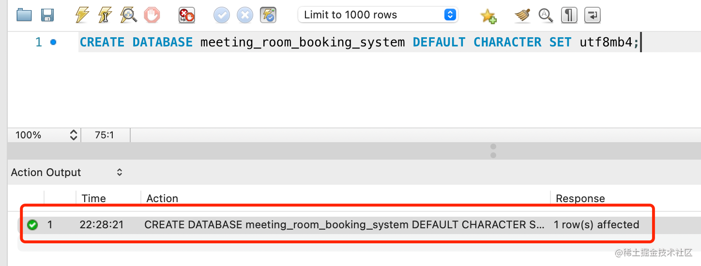

刷新可以看到这个 database

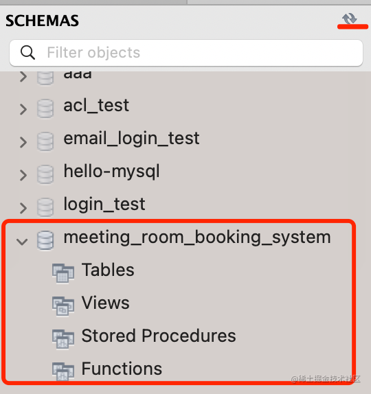

用户模块涉及到这些表：

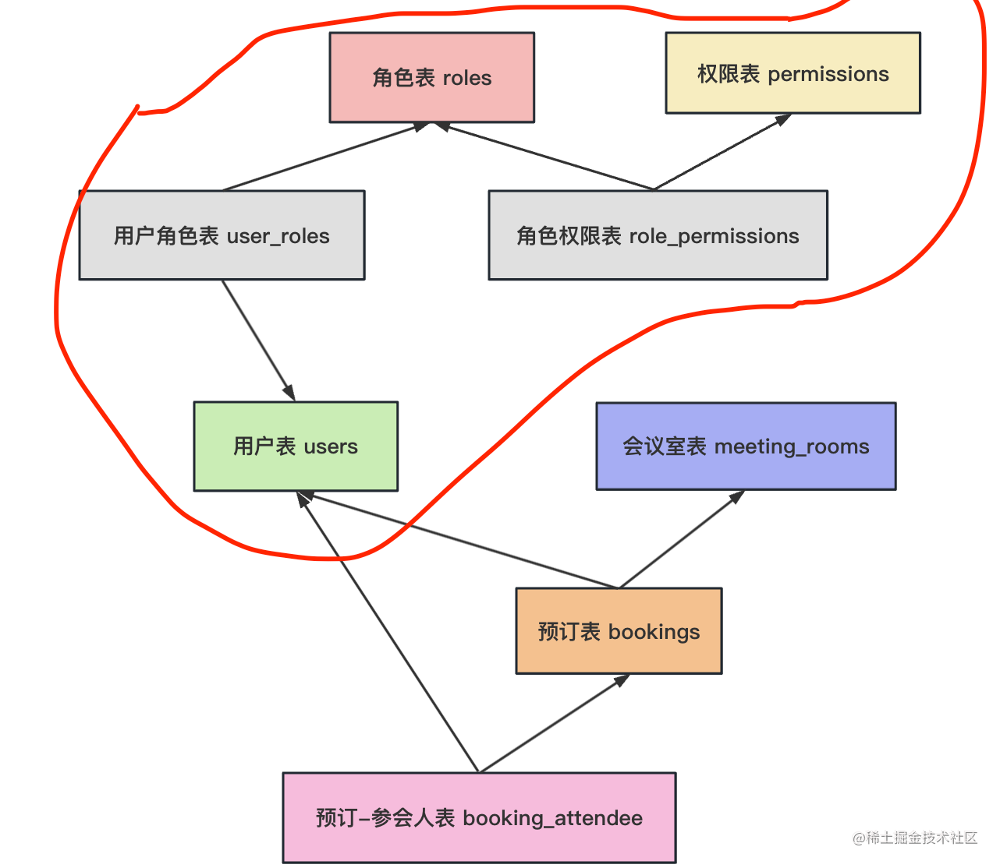

我们创建下它们的 entity：

先在 nest-cli.json 里添加 generateOptions，设置 spec 为 false

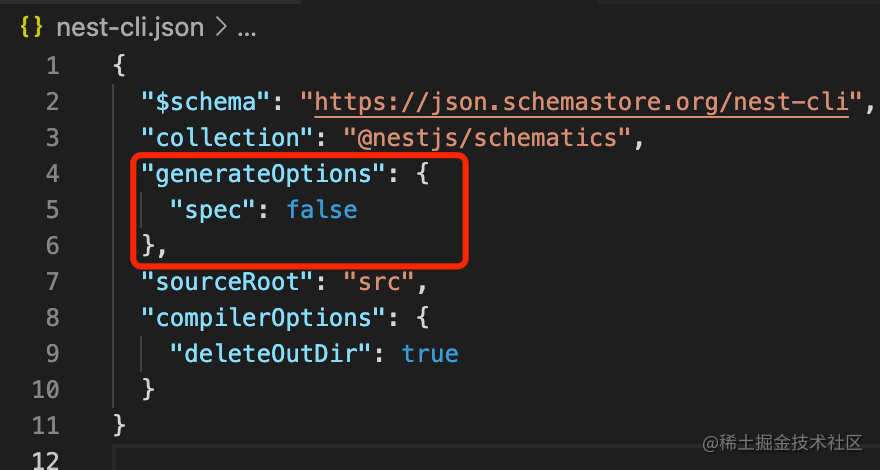

这样生成代码的时候不会生成测试代码，和 nest g xxx --no-spec 效果一样

生成 user 模块：

```
nest g resource user
```

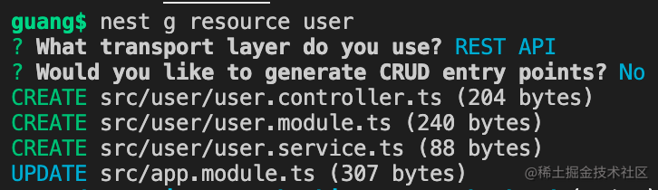

确实没有生成测试代码。

然后我们添加个 src/user/entities 目录，新建 3 个实体 User、Role、Permission。

按照上节的表格来创建就好：

用户表：

| 字段名 | 数据类型 | 描述 |
| --- | --- | --- |
| id | INT | 用户ID |
| username | VARCHAR(50) |用户名 |
| password | VARCHAR(50) |密码 |
| nick_name | VARCHAR(50) |昵称 |
| email | VARCHAR(50) | 邮箱 |
| head_pic| VARCHAR(100) | 头像 |
| phone_number| VARCHAR(20) | 手机号 |
| is_frozen| BOOLEAN | 是否被冻结 |
| is_admin| BOOLEAN | 是否是管理员 |
| create_time | DATETIME | 创建时间 |
| update_time | DATETIME | 更新时间 |
角色表 roles

| 字段名 | 数据类型 | 描述 |
| --- | --- | --- |
| id | INT |  ID |
| name | VARCHAR(20) | 角色名 |

权限表 permissions

| 字段名 | 数据类型 | 描述 |
| --- | --- | --- |
| id | INT |  ID |
| code | VARCHAR(20) | 权限代码 |
| description | VARCHAR(100) | 权限描述 |

用户-角色中间表 user_roles

| 字段名 | 数据类型 | 描述 |
| --- | --- | --- |
| id | INT |  ID |
| user_id | INT | 用户 ID |
| role_id | INT | 角色 ID |

角色-权限中间表 role_permissions

| 字段名 | 数据类型 | 描述 |
| --- | --- | --- |
| id | INT |  ID |
| role_id | INT | 角色 ID |
| permission_id | INT | 权限 ID |

也就是这样：

```javascript
import { Column, CreateDateColumn, Entity, JoinTable, ManyToMany, PrimaryGeneratedColumn, UpdateDateColumn } from "typeorm";
import { Role } from "./role.entity";

@Entity({
    name: 'users'
})
export class User {

    @PrimaryGeneratedColumn()
    id: number;

    @Column({
        length: 50,
        comment: '用户名'
    })
    username: string;

    @Column({
        length: 50,
        comment: '密码'
    })
    password: string;

    @Column({
        name: 'nick_name',
        length: 50,
        comment: '昵称'
    })
    nickName: string;


    @Column({
        comment: '邮箱',
        length: 50
    })
    email: string;


    @Column({
        comment: '头像',
        length: 100,
        nullable: true
    })
    headPic: string;

    @Column({
        comment: '手机号',
        length: 20,
        nullable: true
    })
    phoneNumber: string;

    @Column({
        comment: '是否冻结',
        default: false
    })
    isFrozen: boolean;

    @Column({
        comment: '是否是管理员',
        default: false
    })
    isAdmin: boolean;

    @CreateDateColumn()
    createTime: Date;

    @UpdateDateColumn()
    updateTime: Date;

    @ManyToMany(() => Role)
    @JoinTable({
        name: 'user_roles'
    })
    roles: Role[] 
}

```

```javascript
import { Column, CreateDateColumn, Entity, JoinTable, ManyToMany, PrimaryGeneratedColumn, UpdateDateColumn } from "typeorm";
import { Permission } from "./permission.entity";

@Entity({
    name: 'roles'
})
export class Role {
    @PrimaryGeneratedColumn()
    id: number;

    @Column({
        length: 20,
        comment: '角色名'
    })
    name: string;

    @ManyToMany(() => Permission)
    @JoinTable({
        name: 'role_permissions'
    })
    permissions: Permission[] 
}
```
```javascript
import { Column, CreateDateColumn, Entity, PrimaryGeneratedColumn, UpdateDateColumn } from "typeorm";

@Entity({
    name: 'permissions'
})
export class Permission {
    @PrimaryGeneratedColumn()
    id: number;

    @Column({
        length: 20,
        comment: '权限代码'
    })
    code: string;

    @Column({
        length: 100,
        comment: '权限描述'
    })
    description: string;
}
```

在 entities 里引入下：

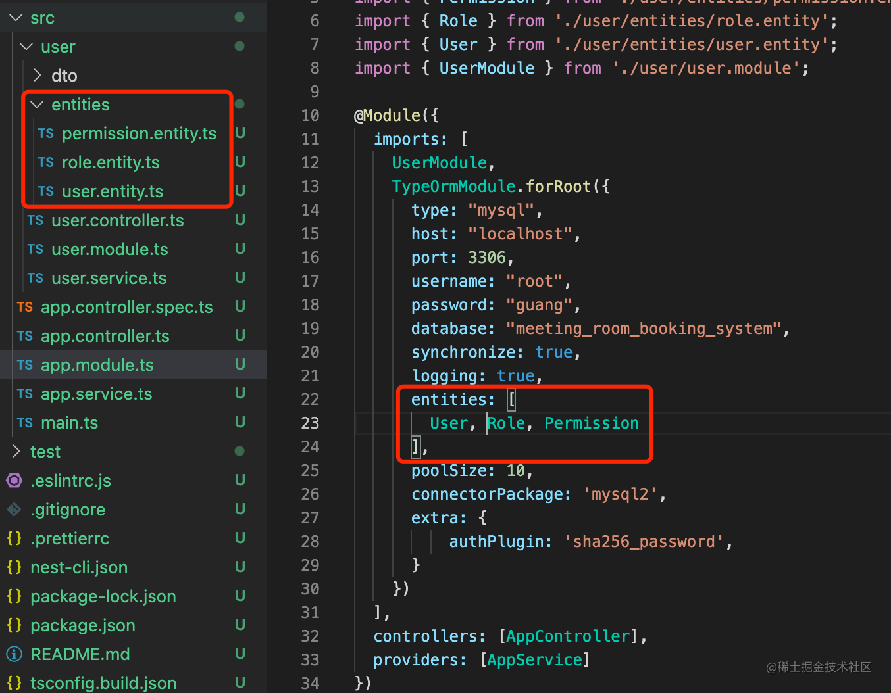

然后把项目跑起来：

```
npm run start:dev
```
正好是 5 条建表 sql：

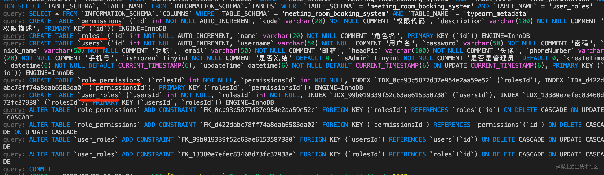

我们去数据库看下：

users 表没啥问题：

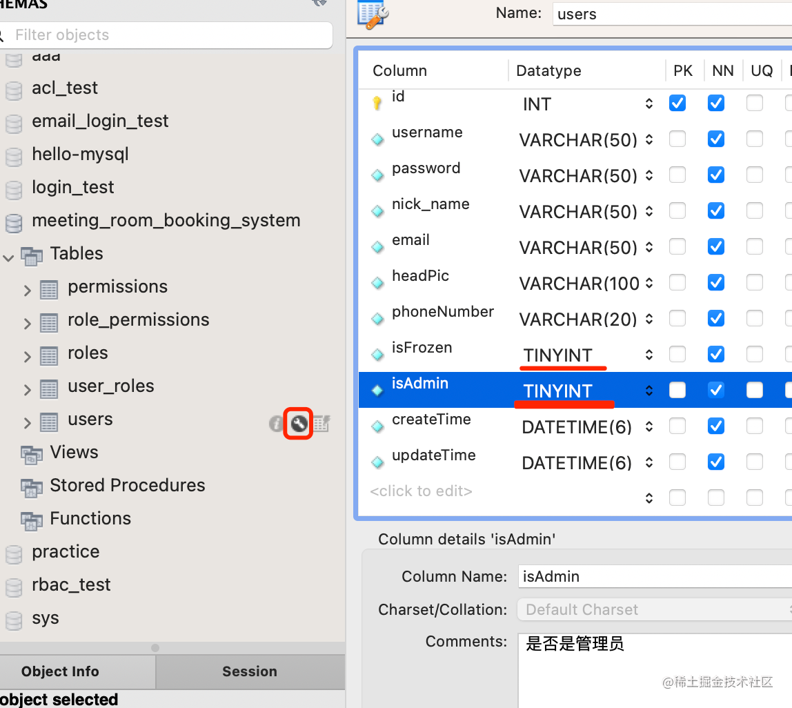

要注意的是 mysql 里没有 boolean 类型，使用 TINYINT 实现的，用 1、0 存储 true、false。

typeorm 会自动把它映射成 true、false。

然后是 roles 表：

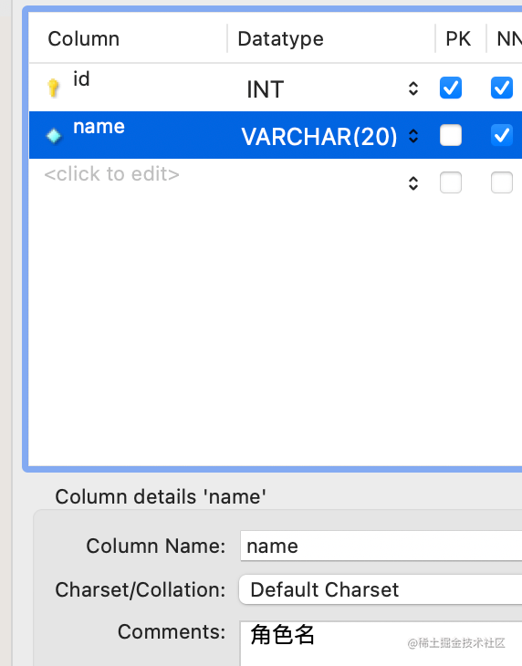

permissions 表：

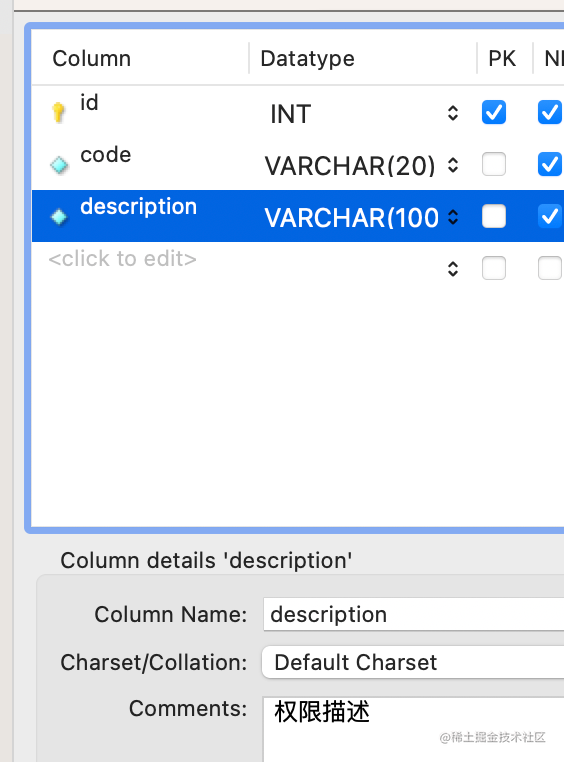

还有两个中间表：

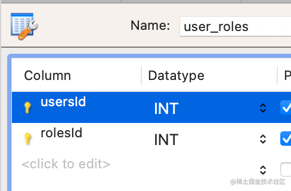

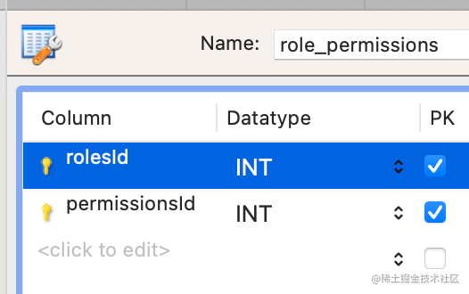

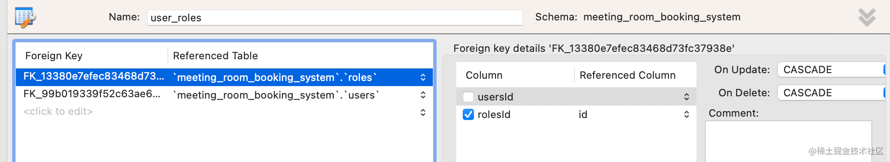

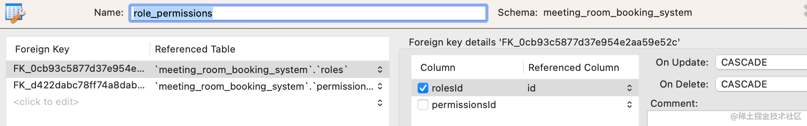

没啥问题，外键也都是对的。

接下来就可以实现接口了。

上节我们列了 user 模块有这些接口：

| 接口路径 | 请求方式 | 描述 |
| -- |-- |-- |
| /user/login | POST | 普通用户登录 |
| /user/register | POST | 普通用户注册 |
| /user/update | POST | 普通用户个人信息修改|
| /user/update_password | POST |普通用户修改密码|
| /user/admin/login | POST | 管理员登录|
| /user/admin/update_password| POST |管理员修改密码|
| /user/admin/update | POST | 管理员个人信息修改|
| /user/list | GET |用户列表|
| /user/freeze | GET | 冻结用户|

我们分别来实现下。

先实现下注册：

在 UserController 增加一个 post 接口：

```javascript
@Post('register')
register(@Body() registerUser: RegisterUserDto) {
    console.log(registerUser);
    return "success"
}
```
dto 是封装 body 里的请求参数的，根据界面上要填的信息，创建 RegisterUserDto：

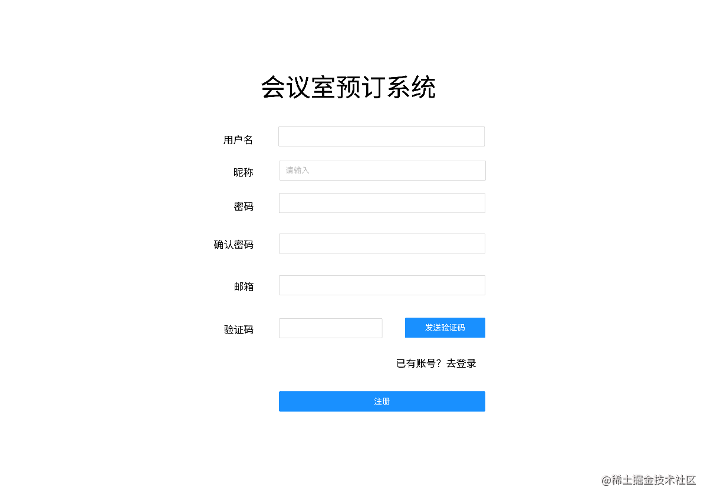

```javascript
export class RegisterUserDto {

    username: string;
    
    nickName: string;
    
    password: string;
    
    email: string;
    
    captcha: string;
}

```

在 postman 里调用下试试：

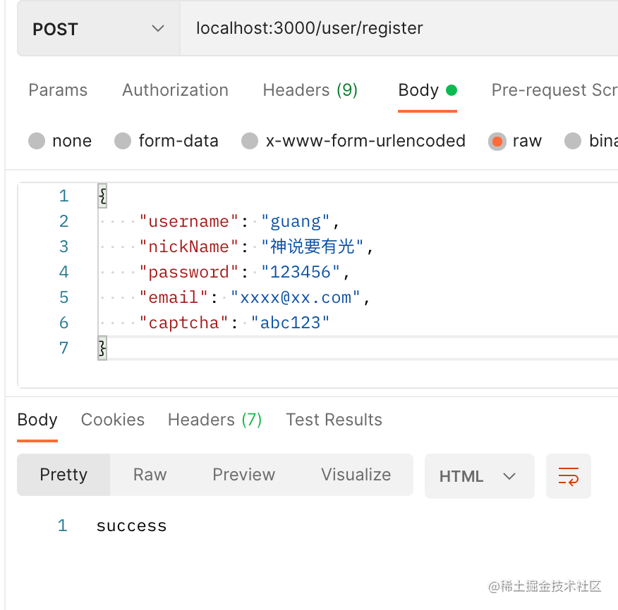
```javascript
{
    "username": "guang",
    "nickName": "神说要有光",
    "password": "123456",
    "email": "xxxx@xx.com",
    "captcha": "abc123"
}
```
服务端也接收到了 body 里的数据，并创建了对应的 dto 对象：

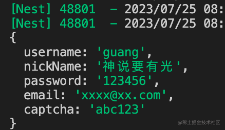

然后加一下 ValidationPipe，来对请求体做校验。

安装用到的包：

```
npm install --save class-validator class-transformer
```

全局启用 ValidationPipe：

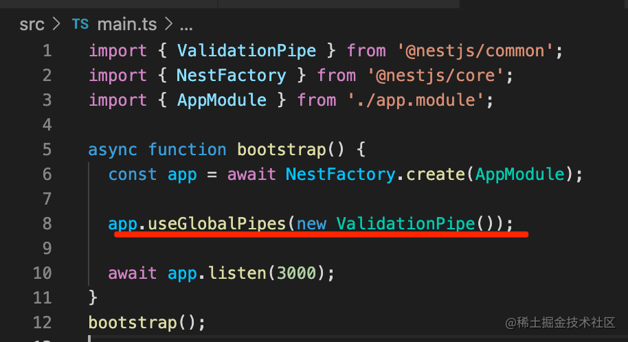

然后加一下校验规则：

```javascript
import { IsEmail, IsNotEmpty, MinLength } from "class-validator";

export class RegisterUserDto {

    @IsNotEmpty({
        message: "用户名不能为空"
    })
    username: string;
    
    @IsNotEmpty({
        message: '昵称不能为空'
    })
    nickName: string;
    
    @IsNotEmpty({
        message: '密码不能为空'
    })
    @MinLength(6, {
        message: '密码不能少于 6 位'
    })
    password: string;
    
    @IsNotEmpty({
        message: '邮箱不能为空'
    })
    @IsEmail({}, {
        message: '不是合法的邮箱格式'
    })
    email: string;
    
    @IsNotEmpty({
        message: '验证码不能为空'
    })
    captcha: string;
}
```
测试下：

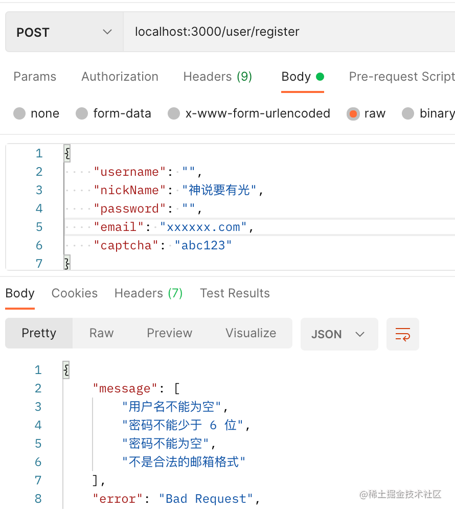

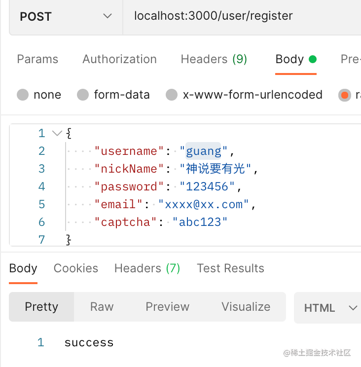

没啥问题。

然后实现注册的逻辑。

在 userService 里添加 register 方法：

```javascript
import { Injectable, Logger } from '@nestjs/common';
import { InjectRepository } from '@nestjs/typeorm';
import { md5 } from 'src/utils';
import { Repository } from 'typeorm';
import { RegisterUserDto } from './dto/register-user.dto';
import { User } from './entities/user.entity';

@Injectable()
export class UserService {
    private logger = new Logger();

    @InjectRepository(User)
    private userRepository: Repository<User>;

    async register(user: RegisterUserDto) {
        
    }
}
```

创建 logger 对象，注入 Repository\<User>。
    
这里注入 Repository 需要在 UserModule 里引入下 TypeOrm.forFeature

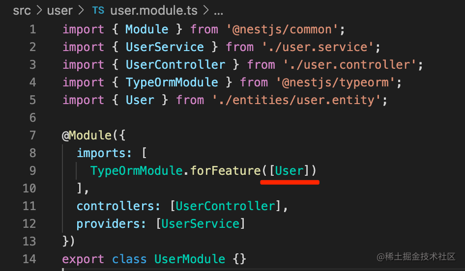

注册的逻辑是这样的：


我们需要先封装个 redis 模块。

```
nest g module redis
nest g service redis
```

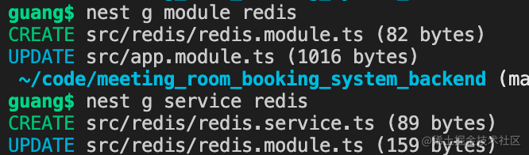

安装 redis 的包：

```
npm install --save redis
```
确保 redis 的 docker 容器是启动的：

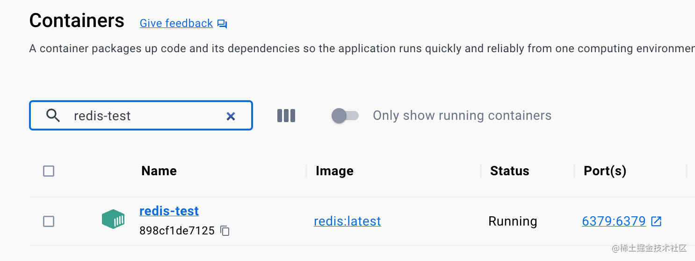

添加连接 redis 的 provider

```javascript
import { Global, Module } from '@nestjs/common';
import { RedisService } from './redis.service';
import { createClient } from 'redis';

@Global()
@Module({
  providers: [
    RedisService,
    {
      provide: 'REDIS_CLIENT',
      async useFactory() {
        const client = createClient({
            socket: {
                host: 'localhost',
                port: 6379
            },
            database: 1
        });
        await client.connect();
        return client;
      }
    }
  ],
  exports: [RedisService]
})
export class RedisModule {}
```
这里用 @Global() 把它声明为全局模块，这样只需要在 AppModule 里引入，别的模块不用引入也可以注入 RedisService 了。

database 指定为 1，因为我们之前都是用的默认的 0

redis 的 database 就是一个命名空间的概念：

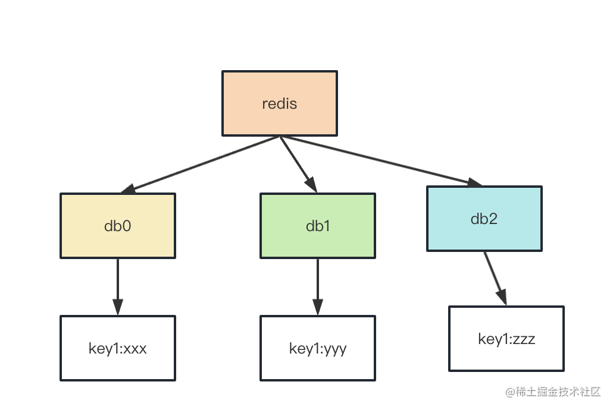

把存储的 key-value 的数据放到不同命名空间下，避免冲突。

然后写下 RedisService

```javascript
import { Inject, Injectable } from '@nestjs/common';
import { RedisClientType } from 'redis';

@Injectable()
export class RedisService {

    @Inject('REDIS_CLIENT') 
    private redisClient: RedisClientType;

    async get(key: string) {
        return await this.redisClient.get(key);
    }

    async set(key: string, value: string | number, ttl?: number) {
        await this.redisClient.set(key, value);

        if(ttl) {
            await this.redisClient.expire(key, ttl);
        }
    }
}
```

注入 redisClient，实现 get、set 方法，set 方法支持指定过期时间。

然后回过头来继续实现 register 方法。


```javascript
@Inject(RedisService)
private redisService: RedisService;

async register(user: RegisterUserDto) {
    const captcha = await this.redisService.get(`captcha_${user.email}`);

    if(!captcha) {
        throw new HttpException('验证码已失效', HttpStatus.BAD_REQUEST);
    }

    if(user.captcha !== captcha) {
        throw new HttpException('验证码不正确', HttpStatus.BAD_REQUEST);
    }

    const foundUser = await this.userRepository.findOneBy({
      username: user.username
    });

    if(foundUser) {
      throw new HttpException('用户已存在', HttpStatus.BAD_REQUEST);
    }

    const newUser = new User();
    newUser.username = user.username;
    newUser.password = md5(user.password);
    newUser.email = user.email;
    newUser.nickName = user.nickName;

    try {
      await this.userRepository.save(newUser);
      return '注册成功';
    } catch(e) {
      this.logger.error(e, UserService);
      return '注册失败';
    }
}
```
根据流程图，很容易写出注册的实现逻辑。

这里的 md5 方法放在 src/utils.ts 里，用 node 内置的 crypto 包实现。
```javascript
import * as crypto from 'crypto';

export function md5(str) {
    const hash = crypto.createHash('md5');
    hash.update(str);
    return hash.digest('hex');
}
```
在 controller 里调用下：

```javascript
@Post('register')
async register(@Body() registerUser: RegisterUserDto) {    
    return await this.userService.register(registerUser);
}
```

然后 postman 里测试下：

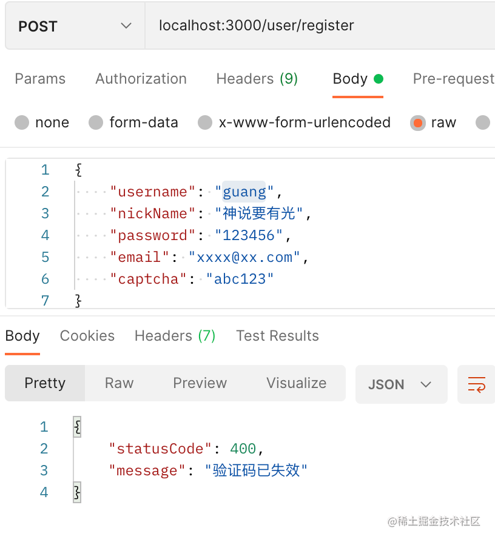

因为还没实现发送邮箱验证码的逻辑，这里我们手动在 redis 添加一个 key：

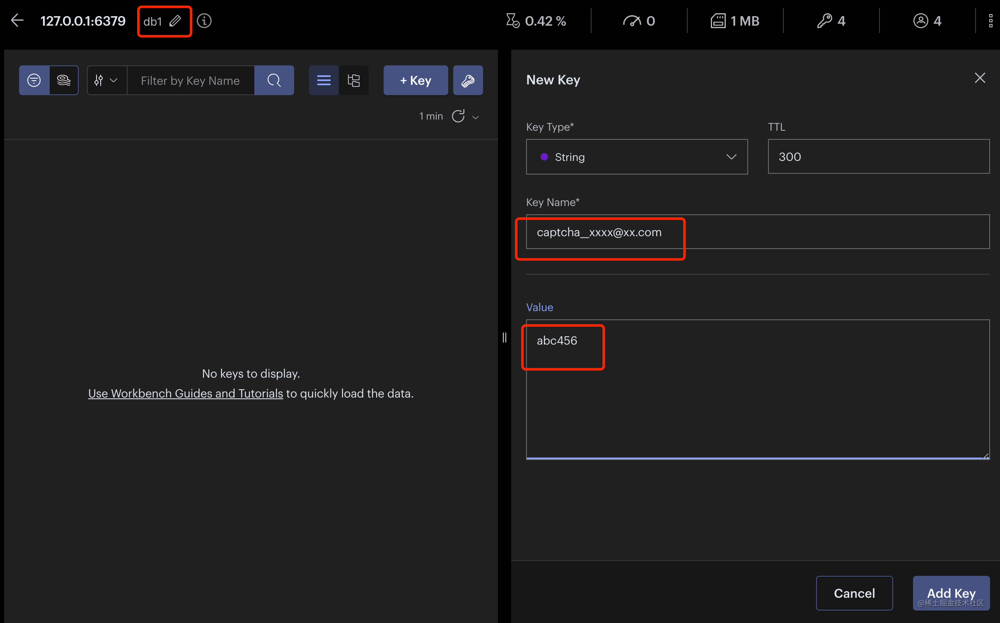

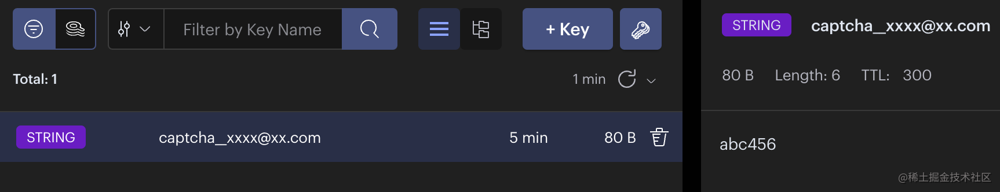

测试下：

带上错误的验证码，返回验证码不正确；

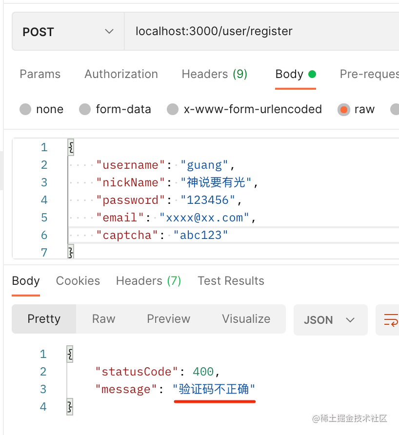

带上正确的验证码，返回注册成功：

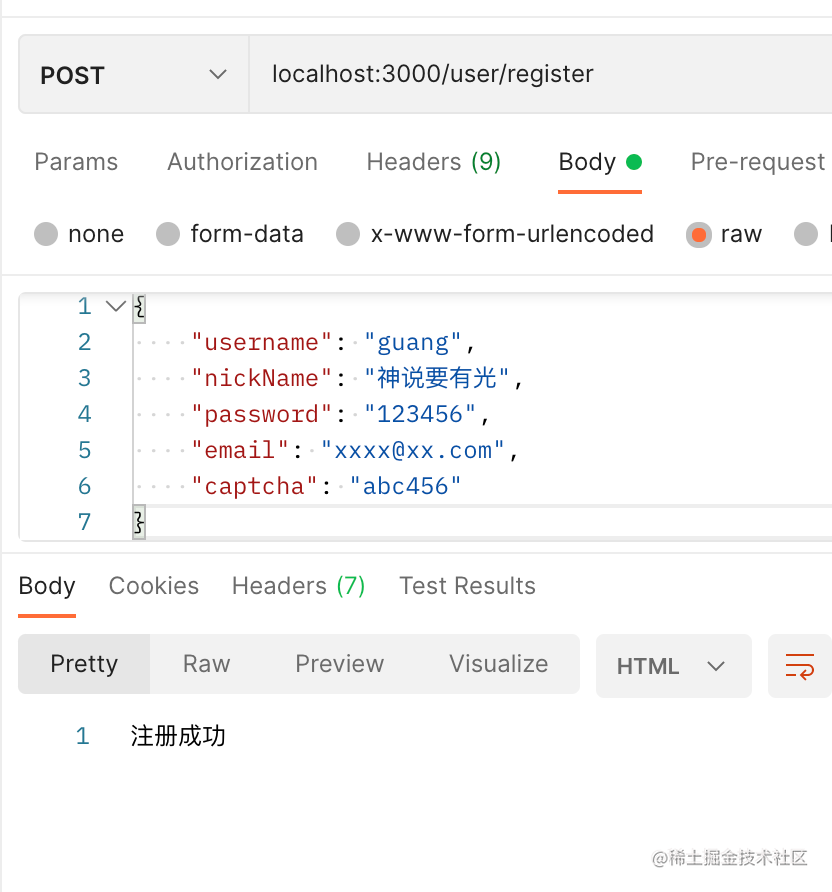

这时可以在数据库里看到这条记录：

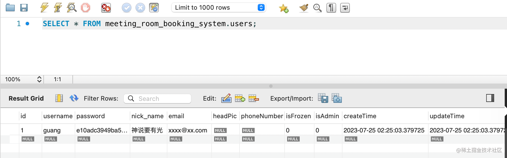

这就代表注册成功了。

然后我们来实现发送邮箱验证码的功能。

封装个 email 模块：

```
nest g resource email
```
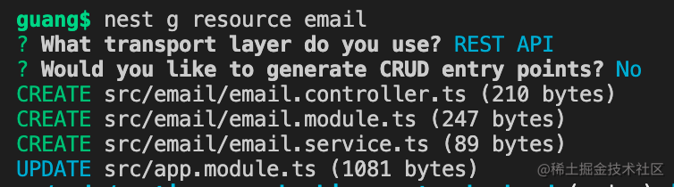

安装发送邮件用的包：

```
npm install nodemailer --save
```
在 EmailService 里实现 sendMail 方法

```javascript
import { Injectable } from '@nestjs/common';
import { createTransport, Transporter} from 'nodemailer';

@Injectable()
export class EmailService {

    transporter: Transporter
    
    constructor() {
      this.transporter = createTransport({
          host: "smtp.qq.com",
          port: 587,
          secure: false,
          auth: {
              user: '你的邮箱地址',
              pass: '你的授权码'
          },
      });
    }

    async sendMail({ to, subject, html }) {
      await this.transporter.sendMail({
        from: {
          name: '会议室预定系统',
          address: '你的邮箱地址'
        },
        to,
        subject,
        html
      });
    }
}
```
把邮箱地址和授权码改成你自己的。

这里用的 qq 邮箱，你也可以换成别的邮箱，填写对应的 smtp 服务的域名和端口就好了。

或者你也可以买专门发邮件的服务。


比如阿里云的[邮件推送服务](https://help.aliyun.com/document_detail/29421.html)：

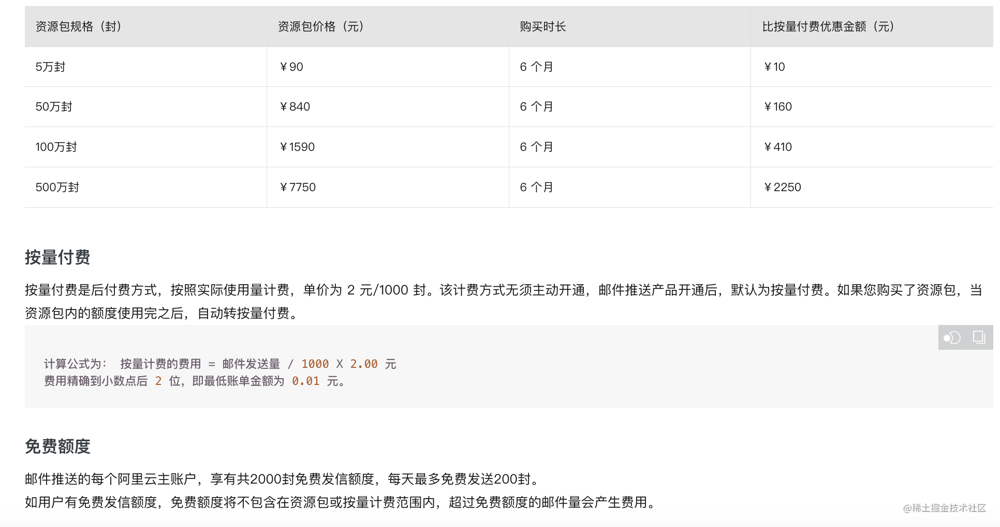

线上要买这种邮件推送服务来发邮件的，但这里我们还是用 nodemailer 自己发邮件。

把 EmailModule 声明为全局的，并且导出 EmailService

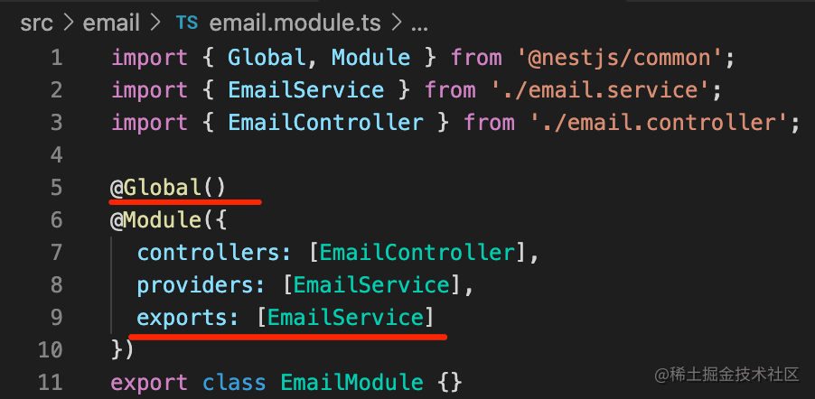

然后在 UserController 里添加一个 get 接口：

```javascript
@Inject(EmailService)
private emailService: EmailService;

@Inject(RedisService)
private redisService: RedisService;

@Get('register-captcha')
async captcha(@Query('address') address: string) {
    const code = Math.random().toString().slice(2,8);

    await this.redisService.set(`captcha_${address}`, code, 5 * 60);

    await this.emailService.sendMail({
      to: address,
      subject: '注册验证码',
      html: `<p>你的注册验证码是 ${code}</p>`
    });
    return '发送成功';
}
```

测试下：


邮件发送成功：

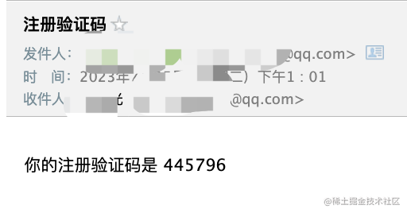

redis 里也保存了邮箱地址对应的验证码：


这样整个注册的流程就完成了。


代码在[小册仓库](https://github.com/QuarkGluonPlasma/nestjs-course-code/tree/main/meeting_room_booking_system_backend)。

## 总结

这节我们创建了 nest 项目，并引入了 typeorm 和 redis。

创建了 User、Role、Permission 的 entity，通过 typeorm 的自动建表功能，在数据库创建了对应的 3 个表和 2 个中间表。

引入了 nodemailer 来发邮件，如果是线上可以买阿里云或者其他平台的邮件推送服务。

实现了 /user/register 和 /user/register-captcha 两个接口。

/user/register-captcha 会向邮箱地址发送一个包含验证码的邮件，并在 redis 里存一份。

/user/register 会根据邮箱地址查询 redis 中的验证码，验证通过会把用户信息保存到表中。

这样，注册功能就完成了。
