上节我们实现了用户注册的功能，这节继续实现登录认证鉴权。

在那之前，我们把配置抽离一下，现在的 mysql、redis、nodemailer 等配置都直接写在代码里，不好维护。

安装 config 的包：

```
npm install --save @nestjs/config
```
在 AppModule 引入下：

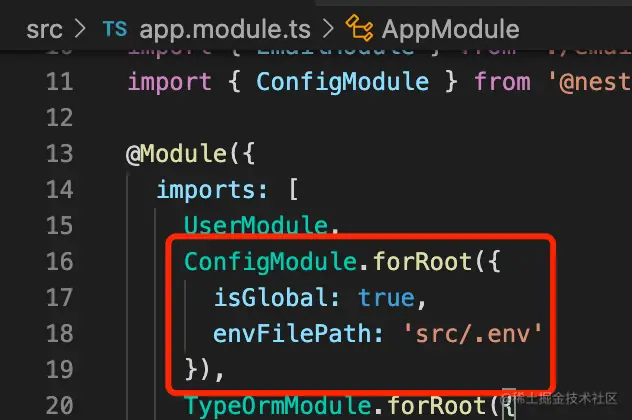

```javascript
ConfigModule.forRoot({
  isGlobal: true,
  envFilePath: 'src/.env'
})
```
设置为全局模块，指定 env 文件的位置。

然后在 src 下添加一个 .env 文件：

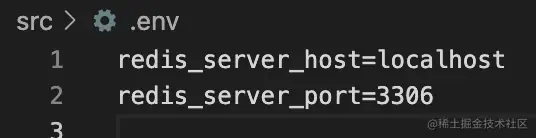

```
redis_server_host=localhost
redis_server_port=3306
```
然后在 RedisModule 里注入 ConfigService 来读取配置：

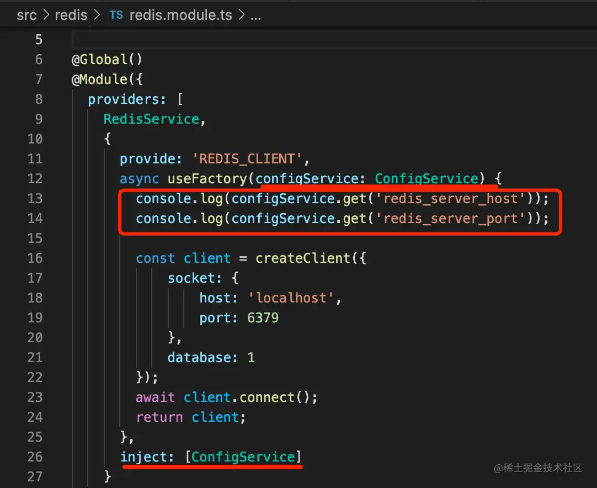

跑一下试试：
```
npm run start:dev
```

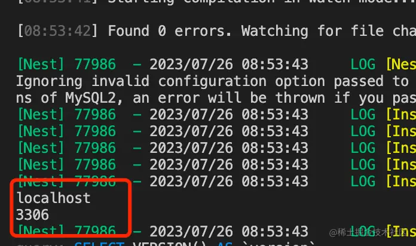

正确读取到了 .env 的配置。

有的同学会问为什么 .env 不放在根目录呢？

因为根目录下的配置文件不会自动复制到 dist 目录。

我们在 nest-cli.json 里加一下 assets 的配置：

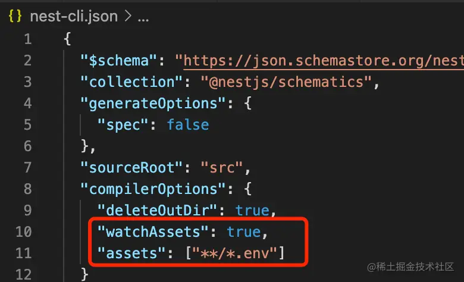

asssets 是指定 build 时复制的文件，watchAssets 是在 assets 变动之后自动重新复制。

把 dist 删掉，跑下 npm run build。

你会发现 .env 确实复制过去了：

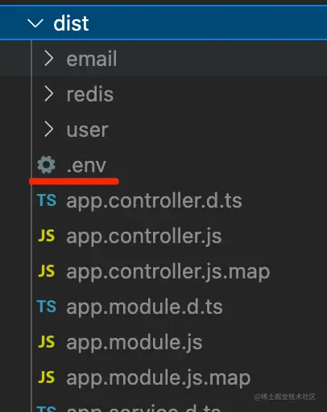

然后我们把 .env 移动到根目录，再删掉 dist，重新跑 npm run build。

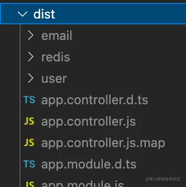

并没有自动复制 .env 过去。

如果你就是想把 .env 放在根目录，那可以手动加一下复制逻辑：

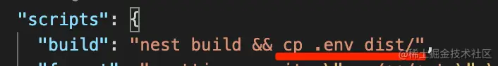

这样再跑 npm run build，就会把 .env 复制过去了：

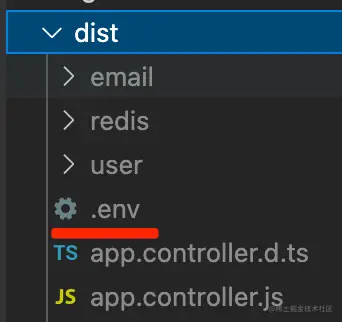

为了用到 nest cli 的复制 assets 的功能，我们还是把它放在 src 下。

在 .env 里添加 redis、mysql、nodemailer 和 nest 服务的配置：

```
# 112. 会议室预订系统：用户管理模块--配置抽离、登录认证鉴权
redis_server_host=localhost
redis_server_port=6379
redis_server_db=1

# nodemailer 相关配置
nodemailer_host=smtp.qq.com
nodemailer_port=587
nodemailer_auth_user=你的邮箱
nodemailer_auth_pass=你的授权码

# mysql 相关配置
mysql_server_host=localhost
mysql_server_port=3306
mysql_server_username=root
mysql_server_password=guang
mysql_server_database=meeting_room_booking_system

# nest 服务配置
nest_server_port=3000
```
然后把代码里的这些地方都改成读配置的方式：

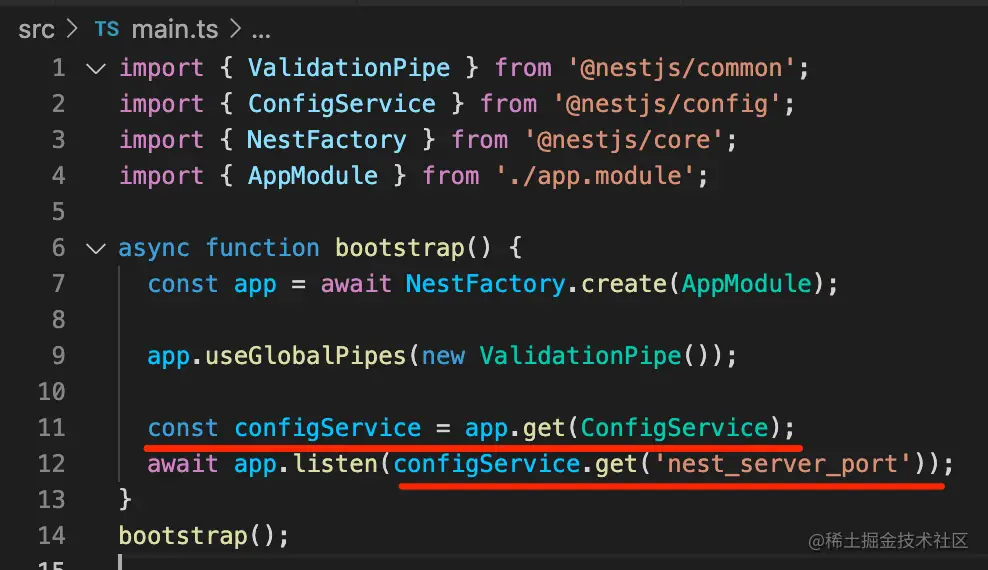

```javascript
const configService = app.get(ConfigService);
await app.listen(configService.get('nest_server_port'));
```
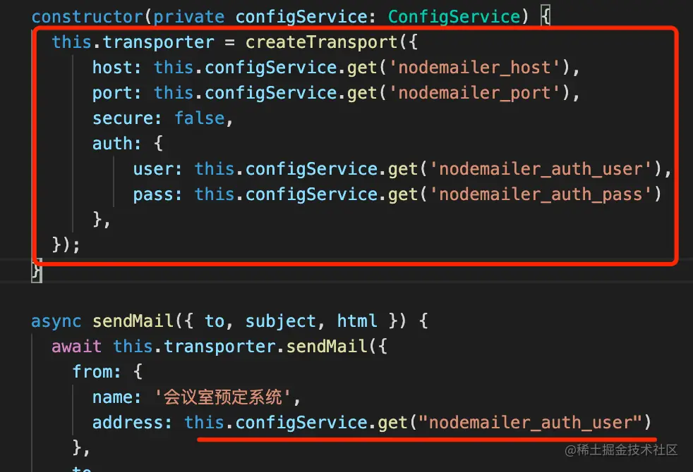

```javascript
constructor(private configService: ConfigService) {
  this.transporter = createTransport({
      host: this.configService.get('nodemailer_host'),
      port: this.configService.get('nodemailer_port'),
      secure: false,
      auth: {
          user: this.configService.get('nodemailer_auth_user'),
          pass: this.configService.get('nodemailer_auth_pass')
      },
  });
}
```
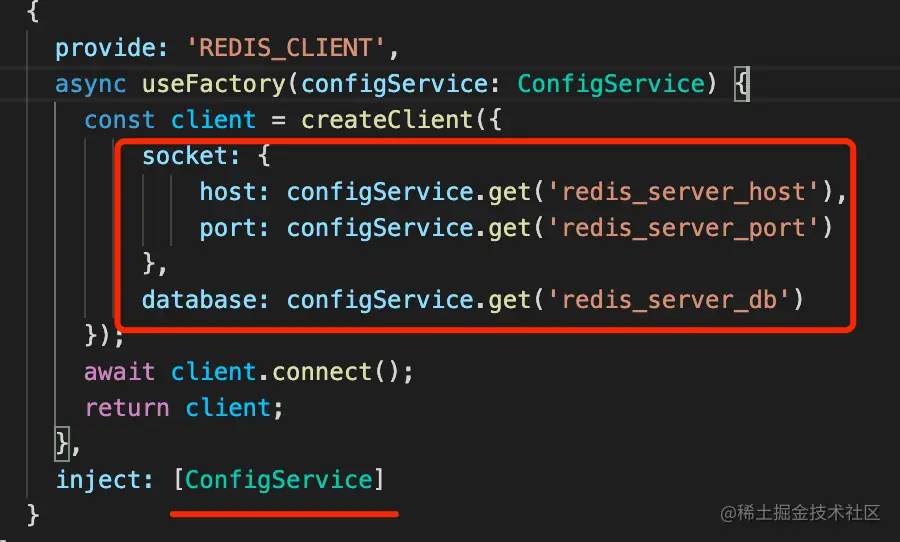
```javascript
{
  provide: 'REDIS_CLIENT',
  async useFactory(configService: ConfigService) {
    const client = createClient({
        socket: {
            host: configService.get('redis_server_host'),
            port: configService.get('redis_server_port')
        },
        database: configService.get('redis_server_db')
    });
    await client.connect();
    return client;
  },
```

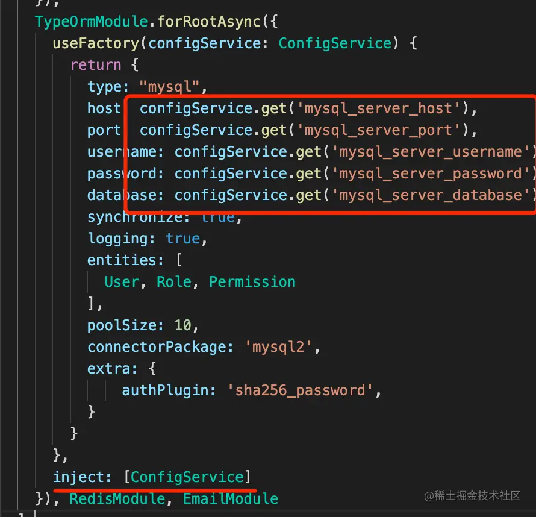

```javascript
TypeOrmModule.forRootAsync({
  useFactory(configService: ConfigService) {
    return {
      type: "mysql",
      host: configService.get('mysql_server_host'),
      port: configService.get('mysql_server_port'),
      username: configService.get('mysql_server_username'),
      password: configService.get('mysql_server_password'),
      database: configService.get('mysql_server_database'),
      synchronize: true,
      logging: true,
      entities: [
        User, Role, Permission
      ],
      poolSize: 10,
      connectorPackage: 'mysql2',
      extra: {
          authPlugin: 'sha256_password',
      }
    }
  },
  inject: [ConfigService]
})
```
然后测试下现在的功能是否正常：

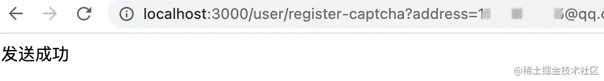


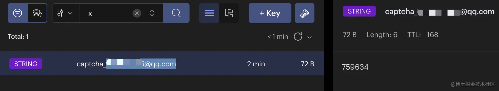

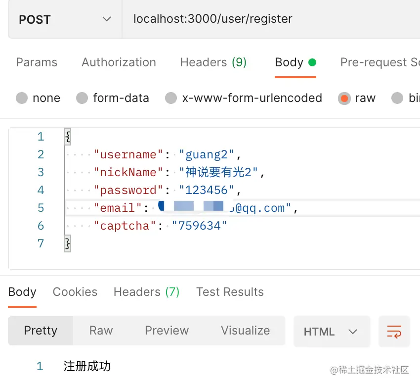

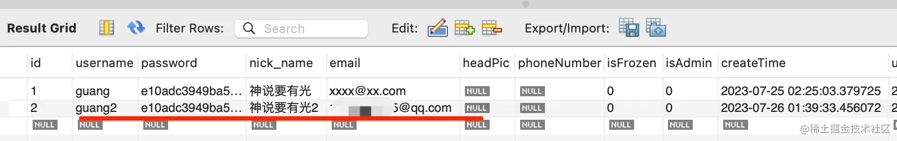

没啥问题。

这样我们配置抽取就成功了。

接下来继续实现登录功能。

我们先初始化用户、角色、权限的数据。

在 UserService 注入 Role 和 Permission 的 Repository：

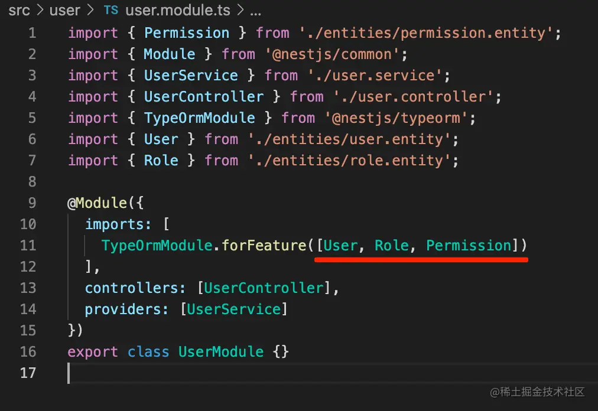

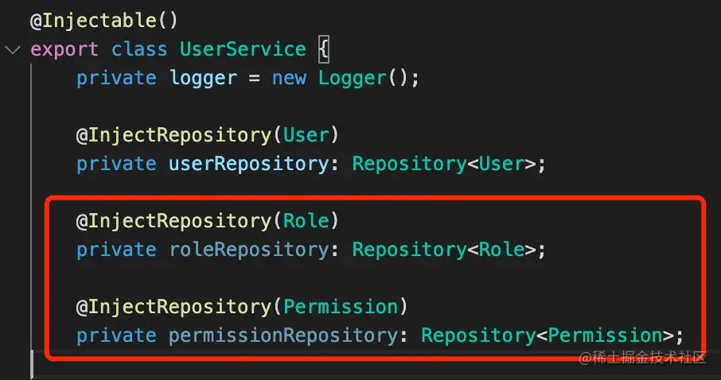

写个初始化数据的方法：
```javascript
async initData() {
    const user1 = new User();
    user1.username = "zhangsan";
    user1.password = md5("111111");
    user1.email = "xxx@xx.com";
    user1.isAdmin = true;
    user1.nickName = '张三';
    user1.phoneNumber = '13233323333';

    const user2 = new User();
    user2.username = 'lisi';
    user2.password = md5("222222");
    user2.email = "yy@yy.com";
    user2.nickName = '李四';

    const role1 = new Role();
    role1.name = '管理员';

    const role2 = new Role();
    role2.name = '普通用户';

    const permission1 = new Permission();
    permission1.code = 'ccc';
    permission1.description = '访问 ccc 接口';

    const permission2 = new Permission();
    permission2.code = 'ddd';
    permission2.description = '访问 ddd 接口';

    user1.roles = [role1];
    user2.roles = [role2];

    role1.permissions = [permission1, permission2];
    role2.permissions = [permission1];

    await this.permissionRepository.save([permission1, permission2]);
    await this.roleRepository.save([role1, role2]);
    await this.userRepository.save([user1, user2]);
}
```
张三是管理员，有 ccc 和 ddd 接口访问权限。

李四是普通用户，只有 ccc 接口的访问权限。

然后在 UserController 添加个 handler：

```javascript
@Get("init-data") 
async initData() {
    await this.userService.initData();
    return 'done';
}
```
浏览器访问下：

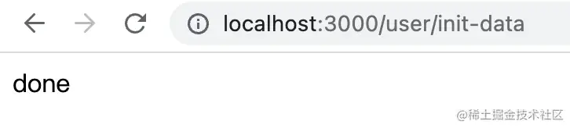

服务端打印了包裹在事务里的 insert 语句：

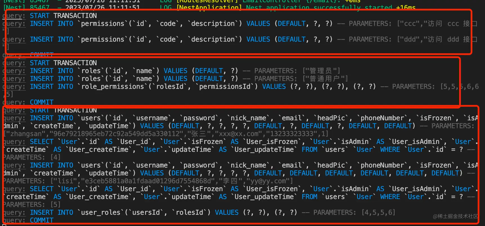

在 mysql workbench 里看下：

users 表：

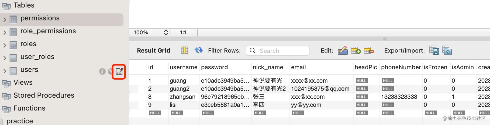

roles 表：
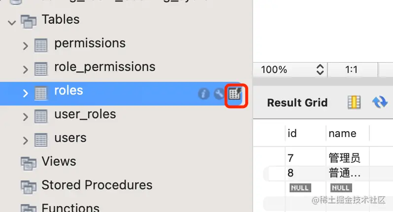

permissions 表：
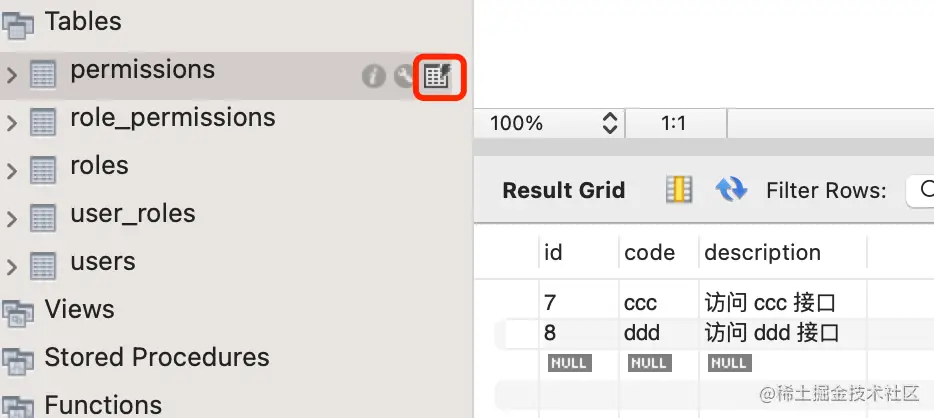

user_roles 表：
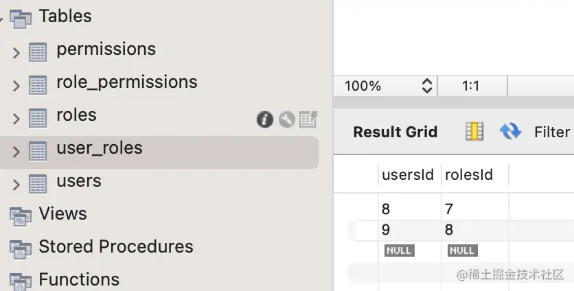

role_permissions 表：
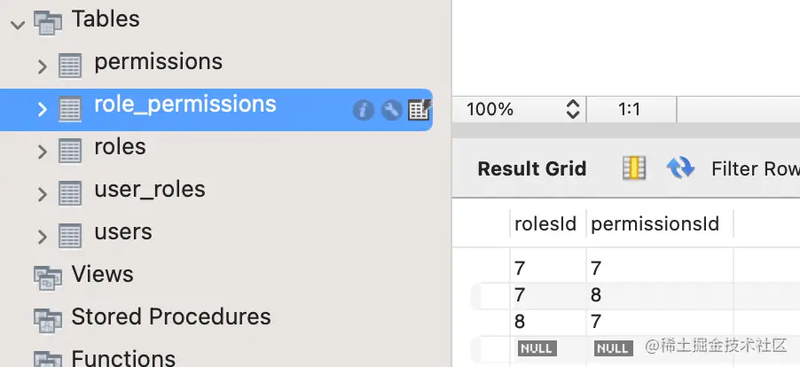

都插入成功了。

有的同学问，在生产环境也这么初始化数据么？

那肯定不会啊，开发环境可以用代码来初始化数据，然后把数据导出为 sql，生产环境可以用这个 sql 文件来初始化。

在 mysql workbench 里这样导出数据：

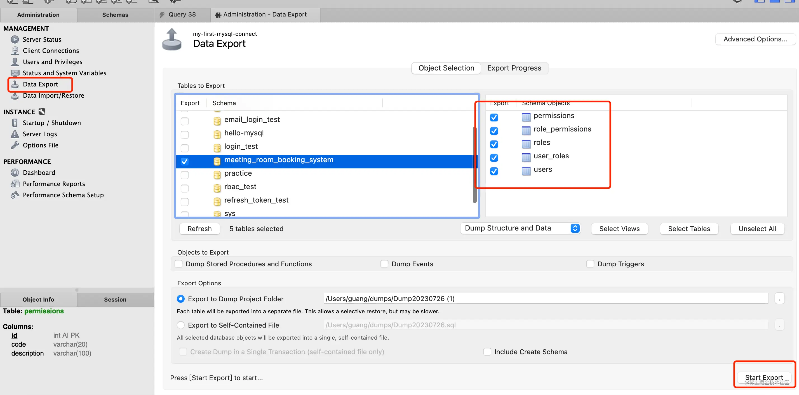

你可以修改生成的 sql 文件位置：

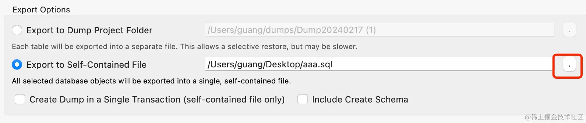

然后我们来实现登录：

后台管理的登录和用户端的登录是分开的：

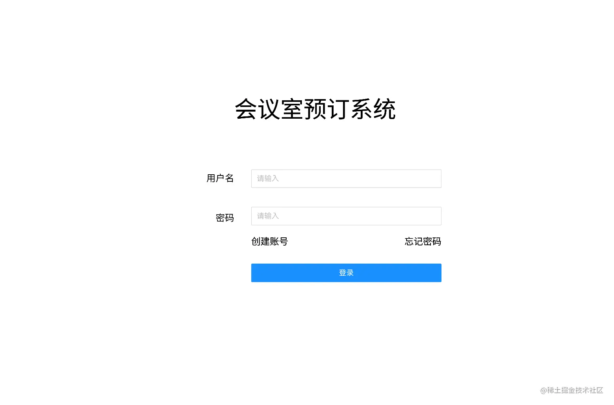

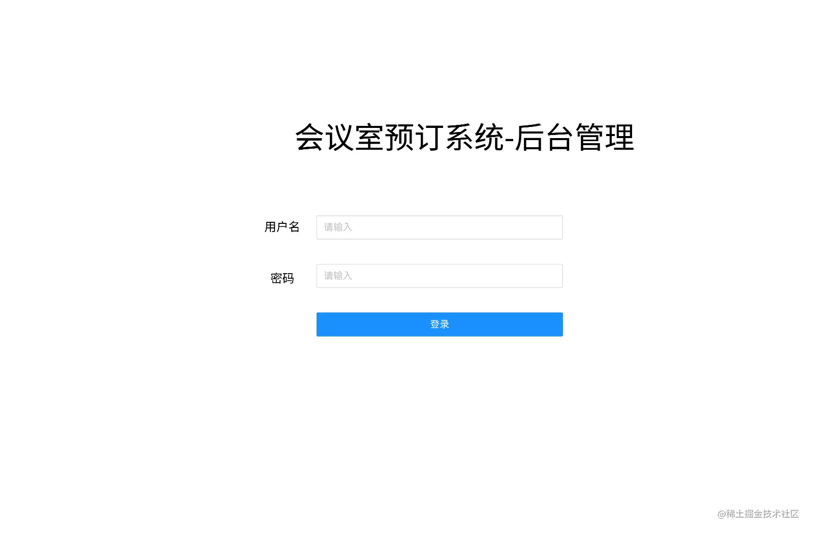

但实现起来差别不大，我们一起来实现下。

在 UserController 添加两个接口：
```javascript
@Post('login')
async userLogin(@Body() loginUser: LoginUserDto) {
    console.log(loginUser);
    return 'success';
}

@Post('admin/login')
async adminLogin(@Body() loginUser: LoginUserDto) {
    console.log(loginUser);
    return 'success';
}
```
添加 src/user/dto/login-user.dto.ts：

```javascript
import { IsNotEmpty } from "class-validator";

export class LoginUserDto {

    @IsNotEmpty({
        message: "用户名不能为空"
    })
    username: string;
    
    @IsNotEmpty({
        message: '密码不能为空'
    })
    password: string;    
}
```

测试下：

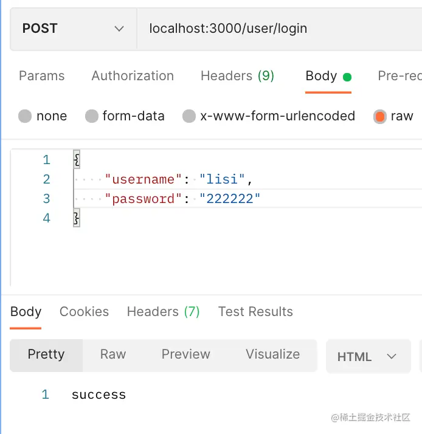

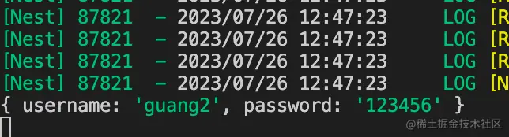

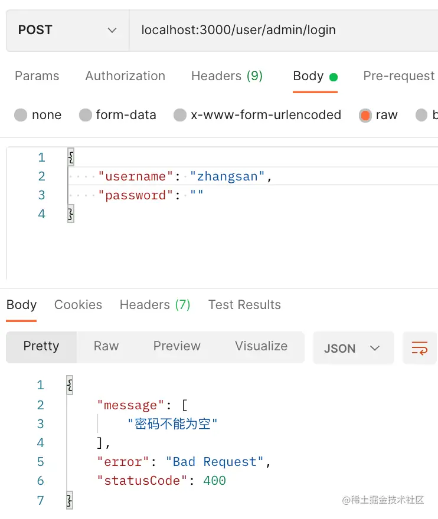

然后在 UserService 实现 login 方法：

```javascript
async login(loginUserDto: LoginUserDto, isAdmin: boolean) {
    const user = await this.userRepository.findOne({
        where: {
            username: loginUserDto.username,
            isAdmin
        },
        relations: [ 'roles', 'roles.permissions']
    });

    if(!user) {
        throw new HttpException('用户不存在', HttpStatus.BAD_REQUEST);
    }

    if(user.password !== md5(loginUserDto.password)) {
        throw new HttpException('密码错误', HttpStatus.BAD_REQUEST);
    }

    return user;
}
```
根据 username 和 isAdmin 查询数据库，设置级联查询 roles 和 roles.permissions。

如果没有找到用户，返回 400 响应提示用户不存在。

如果密码不对，返回 400 响应，提示密码错误。

在 UserController 里调用下：

```javascript
@Post('login')
async userLogin(@Body() loginUser: LoginUserDto) {
    const user = await this.userService.login(loginUser, false);

    return 'success';
}

@Post('admin/login')
async adminLogin(@Body() loginUser: LoginUserDto) {
    const user = await this.userService.login(loginUser, true);

    return 'success';
}
```

我们创建个 vo （view object）对象来封装返回的数据。

dto 是接收参数的，vo 是封装返回的数据的，entity 是和数据库表对应的。

创建  src/user/vo/login-user.vo.ts

```typescript
interface UserInfo {
    id: number;

    username: string;

    nickName: string;

    email: string;

    headPic: string;

    phoneNumber: string;

    isFrozen: boolean;

    isAdmin: boolean;

    createTime: number;

    roles: string[];

    permissions: string[]
}
export class LoginUserVo {

    userInfo: UserInfo;

    accessToken: string;

    refreshToken: string;
}

```

返回用户信息和两个 token。

在 UserService 的 login 方法里封装返回的数据：

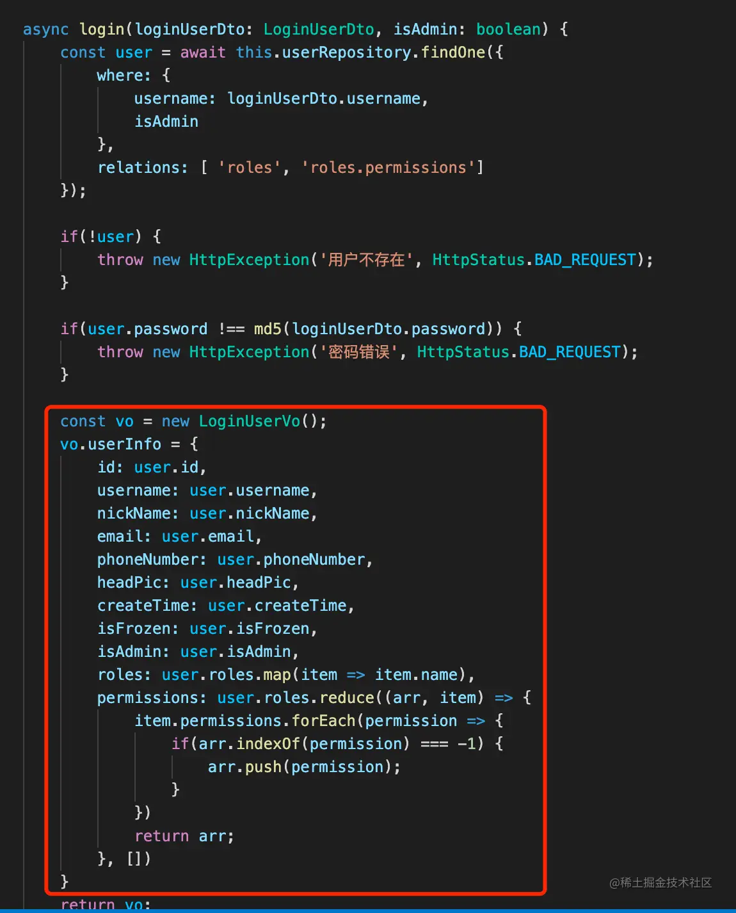

permissions 是所有 roles 的 permissions 的合并，要去下重。

```javascript
const vo = new LoginUserVo();
vo.userInfo = {
    id: user.id,
    username: user.username,
    nickName: user.nickName,
    email: user.email,
    phoneNumber: user.phoneNumber,
    headPic: user.headPic,
    createTime: user.createTime.getTime(),
    isFrozen: user.isFrozen,
    isAdmin: user.isAdmin,
    roles: user.roles.map(item => item.name),
    permissions: user.roles.reduce((arr, item) => {
        item.permissions.forEach(permission => {
            if(arr.indexOf(permission) === -1) {
                arr.push(permission);
            }
        })
        return arr;
    }, [])
}
```

在 UserController 里返回 vo：

```javascript
@Post('login')
async userLogin(@Body() loginUser: LoginUserDto) {
    const vo = await this.userService.login(loginUser, false);

    return vo;
}

@Post('admin/login')
async adminLogin(@Body() loginUser: LoginUserDto) {
    const vo = await this.userService.login(loginUser, true);

    return vo;
}
```
测试下:

/user/login

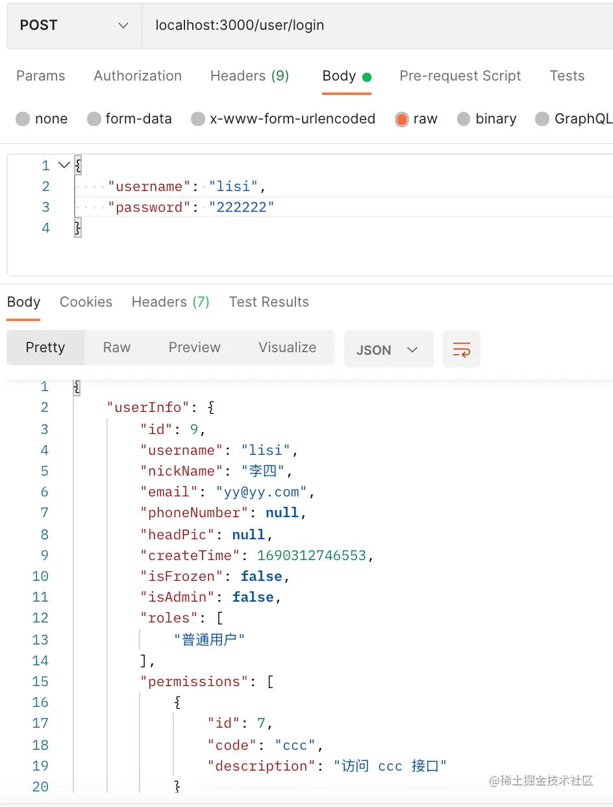

/user/admin/login

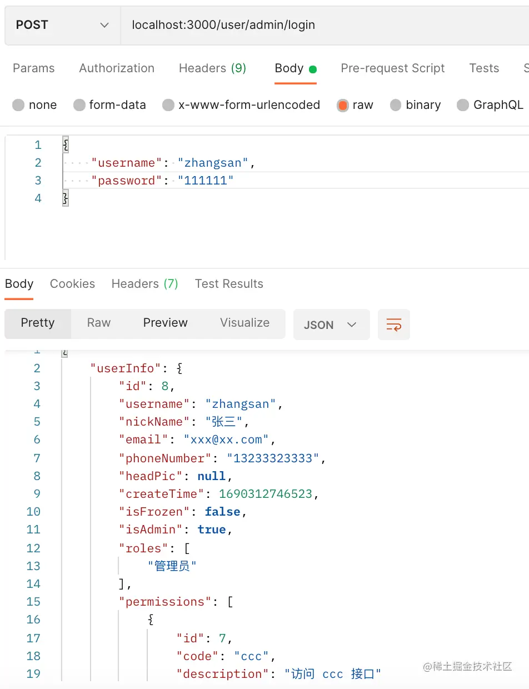

然后引入 jwt 模块：

```
npm install --save @nestjs/jwt
```

在 AppModule 里引入：

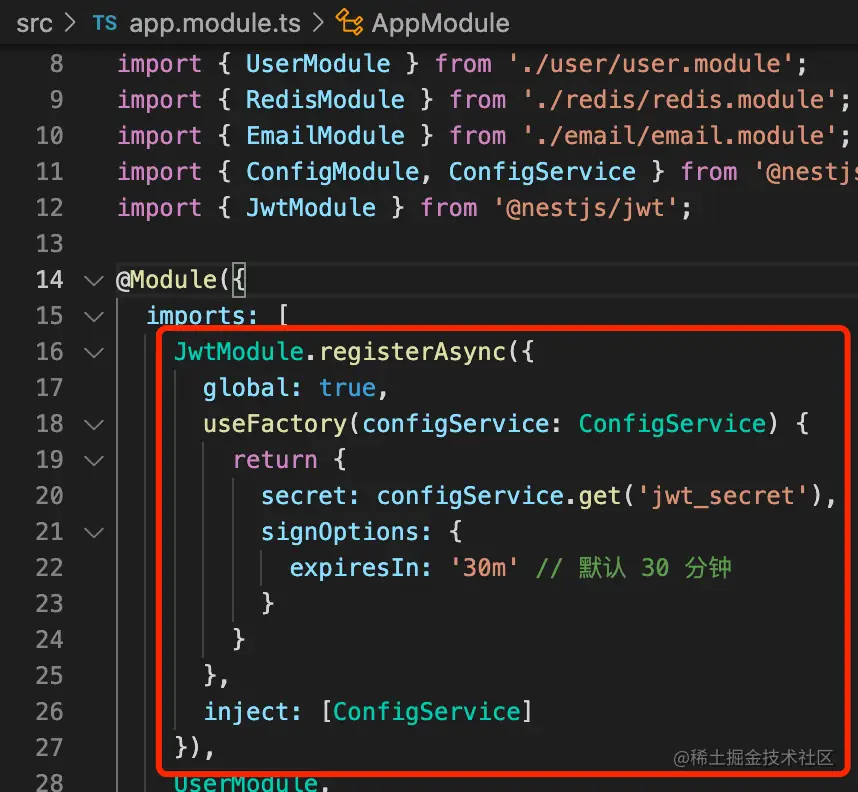
```javascript
JwtModule.registerAsync({
  global: true,
  useFactory(configService: ConfigService) {
    return {
      secret: configService.get('jwt_secret'),
      signOptions: {
        expiresIn: '30m' // 默认 30 分钟
      }
    }
  },
  inject: [ConfigService]
}),
```
这里的密钥放到 .env 里配置：

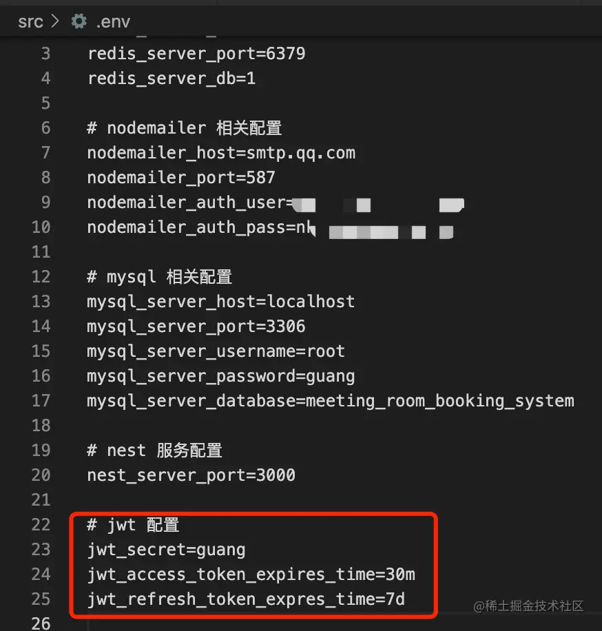

```
# jwt 配置
jwt_secret=guang
jwt_access_token_expires_time=30m
jwt_refresh_token_expres_time=7d
```
这里 jwt 过期时间的语法可以看[这个文档](https://github.com/vercel/ms#examples)。

然后登录认证通过之后返回 access_token 和 refresh_token：

```javascript
@Inject(JwtService)
private jwtService: JwtService;

@Inject(ConfigService)
private configService: ConfigService;

@Post('login')
async userLogin(@Body() loginUser: LoginUserDto) {
    const vo = await this.userService.login(loginUser, false);

    vo.accessToken = this.jwtService.sign({
      userId: vo.userInfo.id,
      username: vo.userInfo.username,
      roles: vo.userInfo.roles,
      permissions: vo.userInfo.permissions
    }, {
      expiresIn: this.configService.get('jwt_access_token_expires_time') || '30m'
    });

    vo.refreshToken = this.jwtService.sign({
      userId: vo.userInfo.id
    }, {
      expiresIn: this.configService.get('jwt_refresh_token_expres_time') || '7d'
    });

    return vo;
}
```

另一个接口同样的处理。

然后再增加一个 refresh_token 的接口用来刷新 token：
```javascript
@Get('refresh')
async refresh(@Query('refreshToken') refreshToken: string) {
    try {
      const data = this.jwtService.verify(refreshToken);

      const user = await this.userService.findUserById(data.userId, false);

      const access_token = this.jwtService.sign({
        userId: user.id,
        username: user.username,
        roles: user.roles,
        permissions: user.permissions
      }, {
        expiresIn: this.configService.get('jwt_access_token_expires_time') || '30m'
      });

      const refresh_token = this.jwtService.sign({
        userId: user.id
      }, {
        expiresIn: this.configService.get('jwt_refresh_token_expres_time') || '7d'
      });

      return {
        access_token,
        refresh_token
      }
    } catch(e) {
      throw new UnauthorizedException('token 已失效，请重新登录');
    }
}
```
在 UserService 实现这个 findUserById 方法：

```javascript
async findUserById(userId: number, isAdmin: boolean) {
    const user =  await this.userRepository.findOne({
        where: {
            id: userId,
            isAdmin
        },
        relations: [ 'roles', 'roles.permissions']
    });

    return {
        id: user.id,
        username: user.username,
        isAdmin: user.isAdmin,
        roles: user.roles.map(item => item.name),
        permissions: user.roles.reduce((arr, item) => {
            item.permissions.forEach(permission => {
                if(arr.indexOf(permission) === -1) {
                    arr.push(permission);
                }
            })
            return arr;
        }, [])
    }
}
```

同样的方式再实现一个后台管理的 refresh 接口：

```javascript
@Get('admin/refresh')
async adminRefresh(@Query('refreshToken') refreshToken: string) {
    try {
      const data = this.jwtService.verify(refreshToken);

      const user = await this.userService.findUserById(data.userId, true);

      const access_token = this.jwtService.sign({
        userId: user.id,
        username: user.username,
        roles: user.roles,
        permissions: user.permissions
      }, {
        expiresIn: this.configService.get('jwt_access_token_expires_time') || '30m'
      });

      const refresh_token = this.jwtService.sign({
        userId: user.id
      }, {
        expiresIn: this.configService.get('jwt_refresh_token_expres_time') || '7d'
      });

      return {
        access_token,
        refresh_token
      }
    } catch(e) {
      throw new UnauthorizedException('token 已失效，请重新登录');
    }
}
```

整体测试下：

POST /user/login

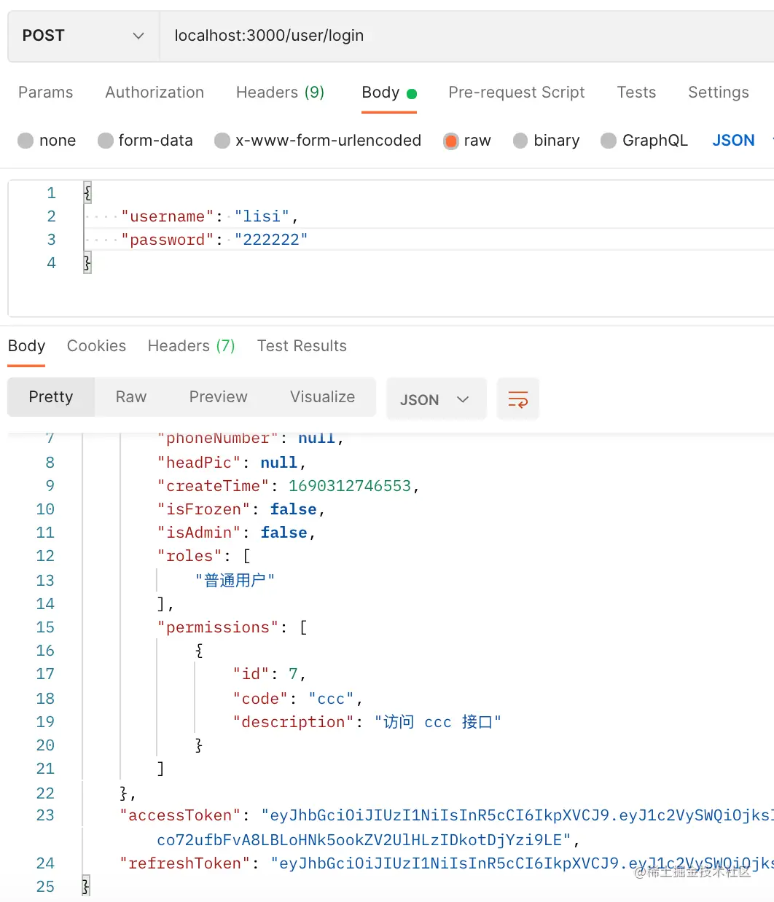

GET /user/refresh

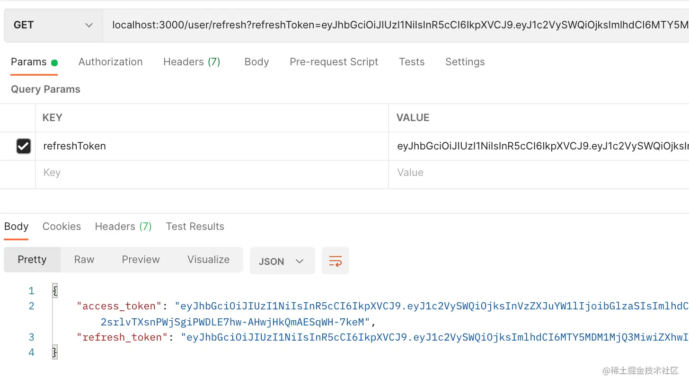

POST /user/admin/login

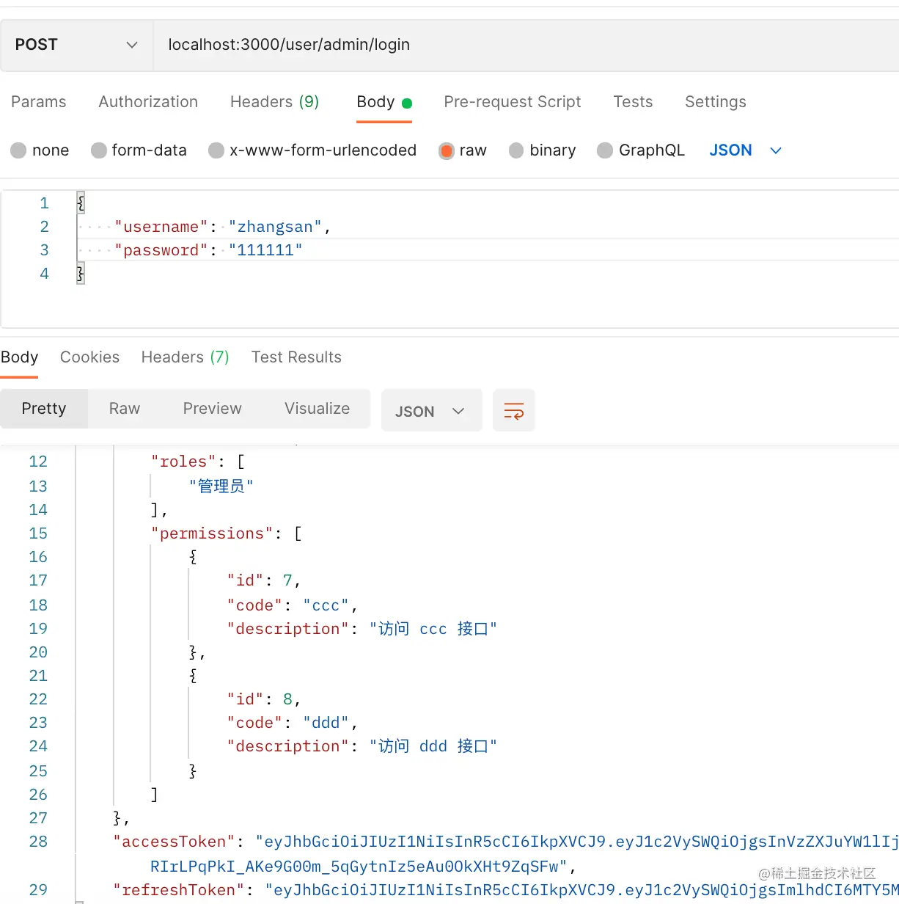

GET /user/admin/refresh

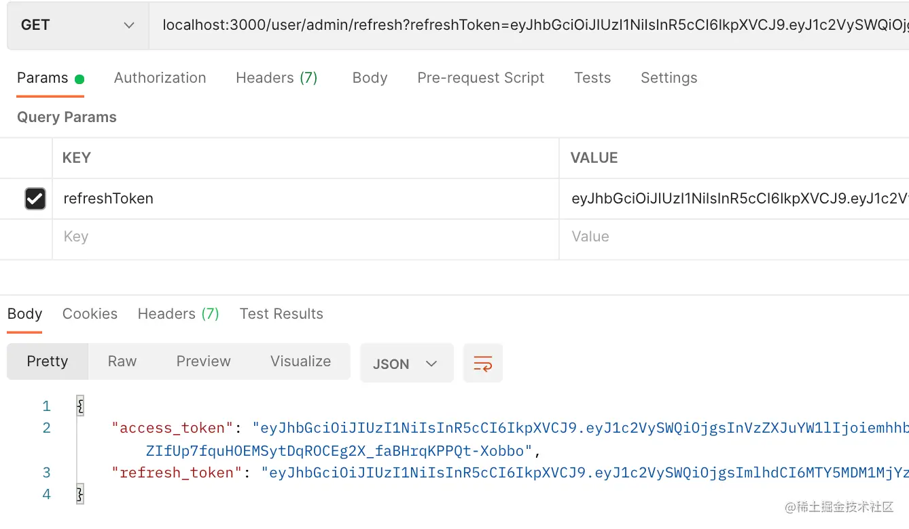

都没啥问题。

其实现在 controller 里有很多重复代码，比如多次生成 jwt 的代码，这个大家可以自己重构下，抽一个方法出来。

然后我们加上 LoginGuard 和 PermissionGuard 来做鉴权：

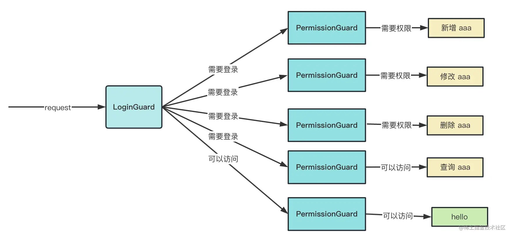

```
nest g guard login --flat --no-spec
nest g guard permission --flat --no-spec
```

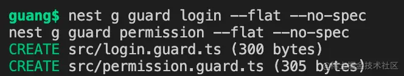

LoginGuard 的实现代码如下：

```javascript
import { CanActivate, ExecutionContext, Inject, Injectable, UnauthorizedException } from '@nestjs/common';
import { Reflector } from '@nestjs/core';
import { JwtService } from '@nestjs/jwt';
import { Request } from 'express';
import { Observable } from 'rxjs';
import { Permission } from './user/entities/permission.entity';

interface JwtUserData {
  userId: number;
  username: string;
  roles: string[];
  permissions: Permission[]
}

declare module 'express' {
  interface Request {
    user: JwtUserData
  }
}

@Injectable()
export class LoginGuard implements CanActivate {
  
  @Inject()
  private reflector: Reflector;

  @Inject(JwtService)
  private jwtService: JwtService;
  
  canActivate(
    context: ExecutionContext,
  ): boolean | Promise<boolean> | Observable<boolean> {
    const request: Request = context.switchToHttp().getRequest();
    
    const requireLogin = this.reflector.getAllAndOverride('require-login', [
      context.getClass(),
      context.getHandler()
    ]);


    if(!requireLogin) {
      return true;
    }
    
    const authorization = request.headers.authorization;

    if(!authorization) {
      throw new UnauthorizedException('用户未登录');
    }

    try{
      const token = authorization.split(' ')[1];
      const data = this.jwtService.verify<JwtUserData>(token);

      request.user = {
        userId: data.userId,
        username: data.username,
        roles: data.roles,
        permissions: data.permissions
      }
      return true;
    } catch(e) {
      throw new UnauthorizedException('token 失效，请重新登录');
    }
  }
}
```
用 reflector 从目标 controller 和 handler 上拿到 require-login 的 metadata。

如果没有 metadata，就是不需要登录，返回 true 放行。

否则从 authorization 的 header 取出 jwt 来，把用户信息设置到 request，然后放行。

如果 jwt 无效，返回 401 响应，提示 token 失效，请重新登录。

（这段代码看不懂的话，回头去看下 RBAC 权限控制那节）

然后全局启用这个 Guard，在 AppModule 里添加这个 provider：

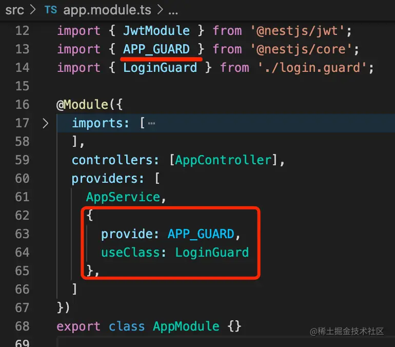

```javascript
{
  provide: APP_GUARD,
  useClass: LoginGuard
}
```

然后在 AppController 添加 aaa、bbb 两个接口：

```javascript
@Get('aaa')
aaaa() {
    return 'aaa';
}

@Get('bbb')
bbb() {
    return 'bbb';
}
```
访问下：

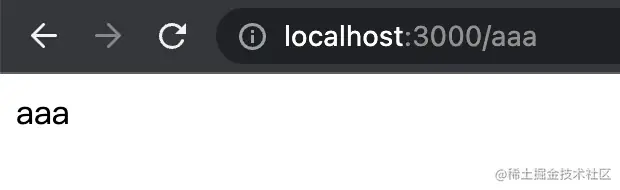

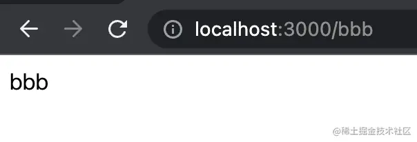

然后在 aaa 加上 require-login 的 matadata

```javascript
@Get('aaa')
@SetMetadata('require-login', true)
aaaa() {
    return 'aaa';
}
```
会提示用户未登录：

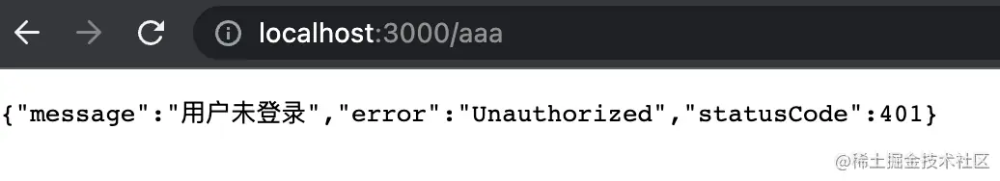

而 bbb 还是可以直接访问的：

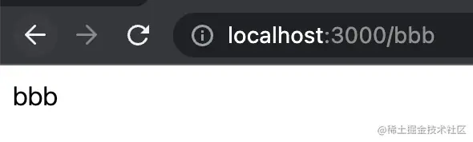

在 postman 里登录下，拿到 access_token：

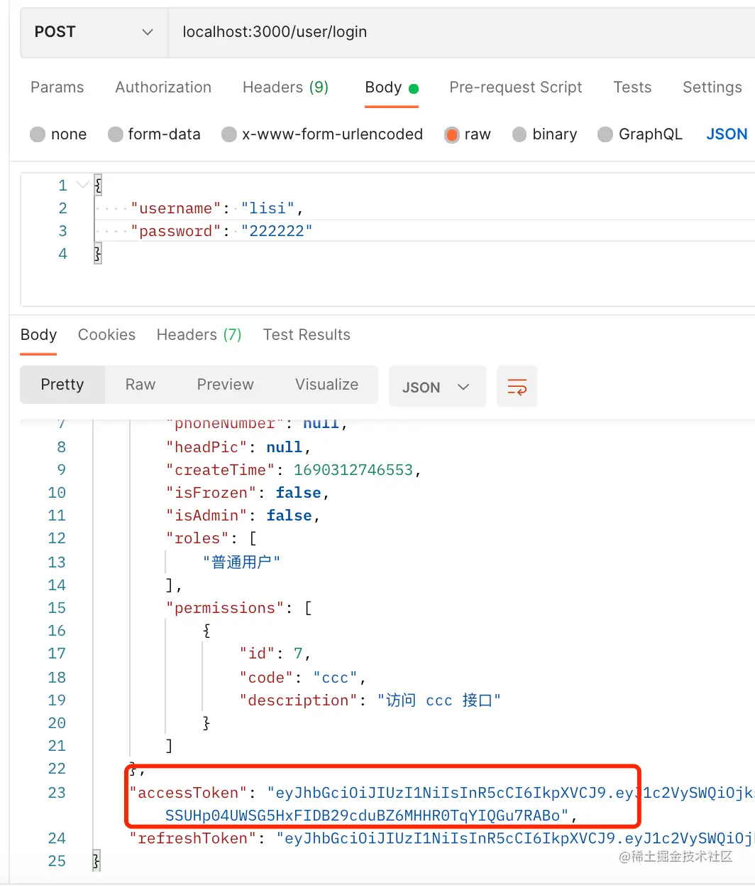

添加到 authorization 的 header 里，就可以访问了：

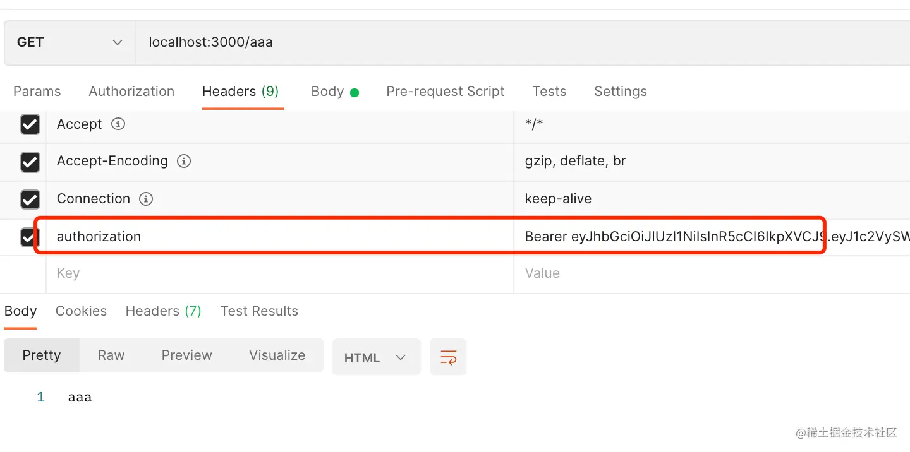

然后我们继续实现 PermissionGuard：

```javascript
import { CanActivate, ExecutionContext, Inject, Injectable, UnauthorizedException } from '@nestjs/common';
import { Reflector } from '@nestjs/core';
import { Request } from 'express';

@Injectable()
export class PermissionGuard implements CanActivate {

  @Inject(Reflector)
  private reflector: Reflector;

  async canActivate(
    context: ExecutionContext,
  ): Promise<boolean> {
    const request: Request = context.switchToHttp().getRequest();

    if(!request.user) {
      return true;
    }

    const permissions = request.user.permissions;

    const requiredPermissions = this.reflector.getAllAndOverride<string[]>('require-permission', [
      context.getClass(),
      context.getHandler()
    ])
    
    if(!requiredPermissions) {
      return true;
    }
    
    for(let i = 0; i < requiredPermissions.length; i++) {
      const curPermission = requiredPermissions[i];
      const found = permissions.find(item => item.code === curPermission);
      if(!found) {
        throw new UnauthorizedException('您没有访问该接口的权限');
      }
    }

    return true;
  }
}
```
同样是用 reflector 取出 handler 或者 controller 上的 require-permission 的 metadata。

如果没有，就是不需要权限，直接放行，返回 true。

对于需要的每个权限，检查下用户是否拥有，没有的话就返回 401，提示没权限。

否则就放行，返回 true。

同样是全局启用这个 PermissionGuard

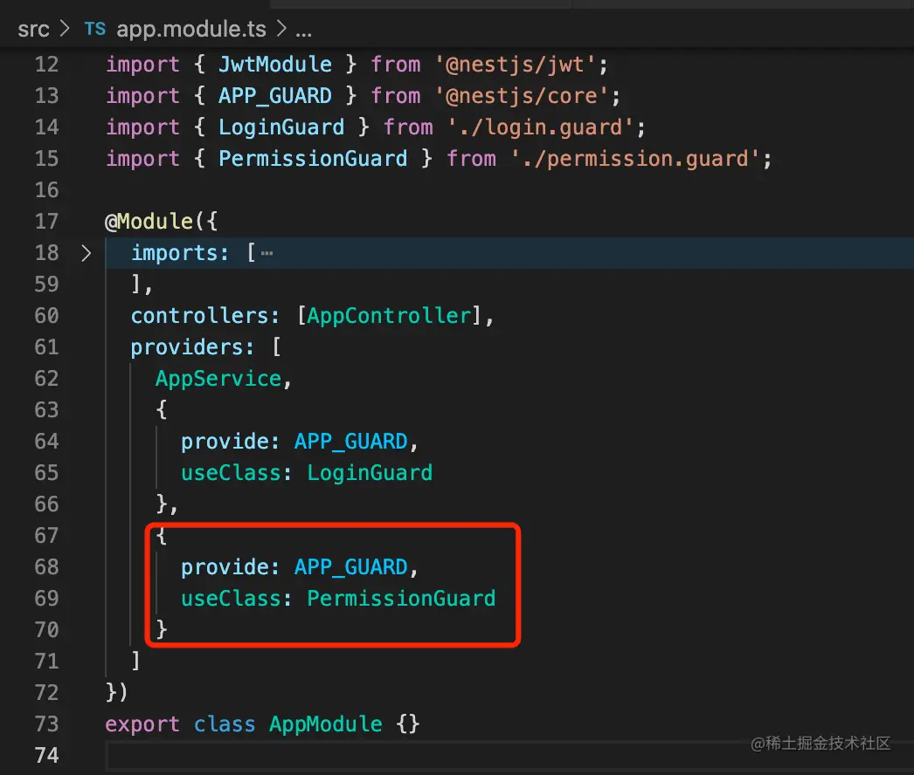

```javascript
{
  provide: APP_GUARD,
  useClass: PermissionGuard
}  
```
然后在 aaa 方法上声明需要的权限：

```javascript
@Get('aaa')
@SetMetadata('require-login', true)
@SetMetadata('require-permission', ['ddd'])
aaaa() {
    return 'aaa';
}
```
测试下：

访问 /user/admin/login 登录 zhangsan 账号，拿到 accessToken

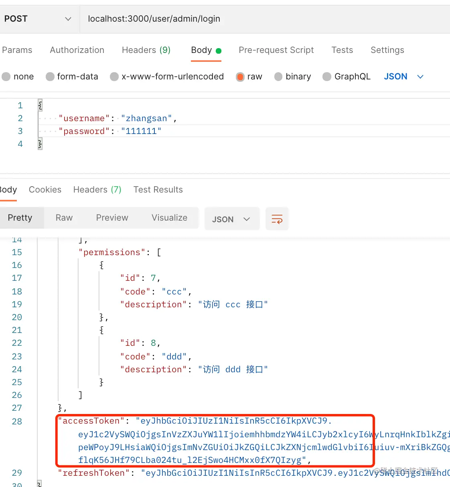

带上 accessToken，是可以访问 aaa 接口的，因为 zhangsan 有这个权限

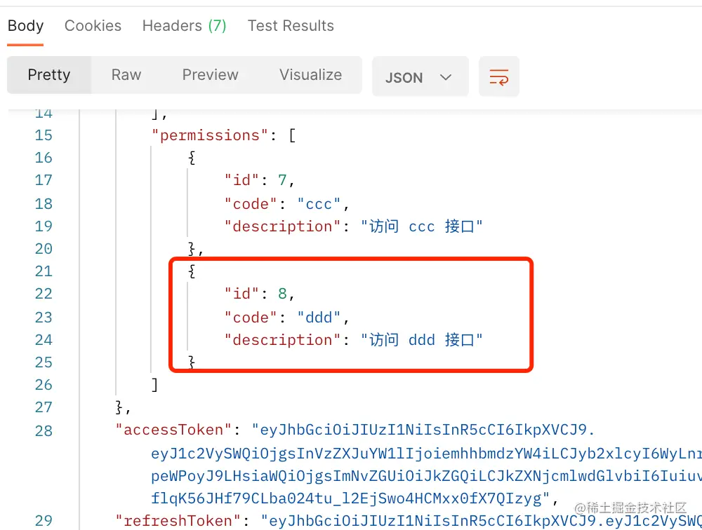

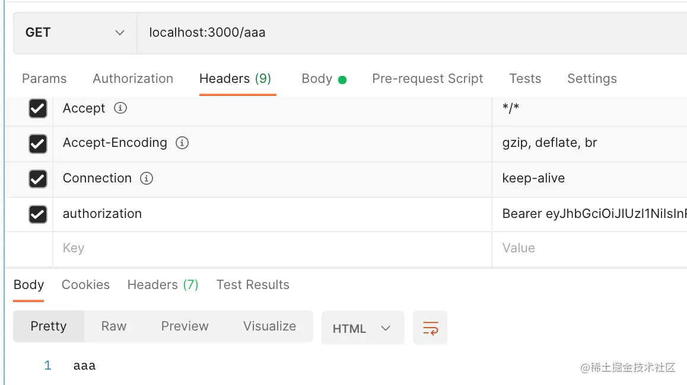

访问 /user/login 登录 lisi 账号，拿到 accessToken

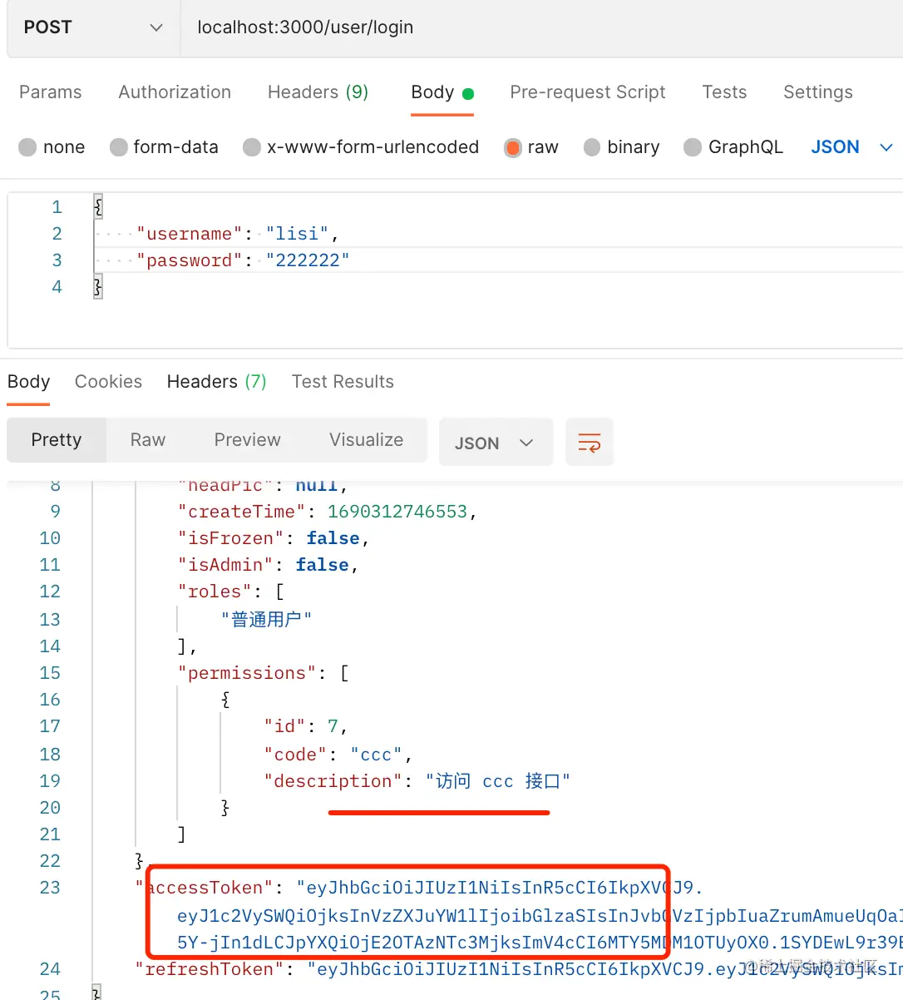

带上 accessToken，就不能访问 aaa 接口的，因为 lisi 没有这个权限

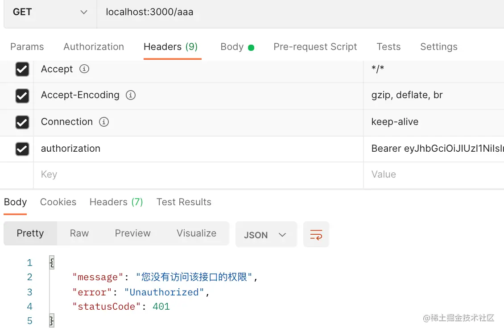

这样，接口鉴权就完成了。

最后我们把这两个 @SetMetadata 封装成自定义装饰器

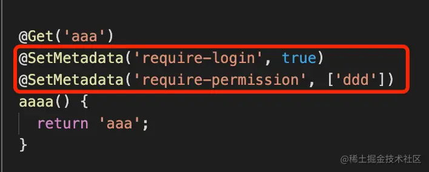

新建 src/custom.decorator.ts

```javascript
import { SetMetadata } from "@nestjs/common";

export const  RequireLogin = () => SetMetadata('require-login', true);

export const  RequirePermission = (...permissions: string[]) => SetMetadata('require-permission', permissions);
```
然后给接口添加鉴权就可以这样写了：

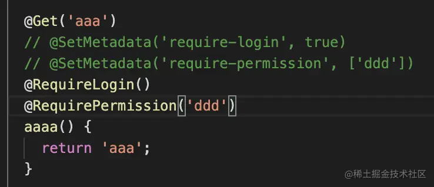

此外还可以创建个自定义参数装饰器：

```javascript
import { SetMetadata } from "@nestjs/common";
import { createParamDecorator, ExecutionContext } from '@nestjs/common';
import { Request } from "express";

export const  RequireLogin = () => SetMetadata('require-login', true);

export const  RequirePermission = (...permissions: string[]) => SetMetadata('require-permission', permissions);

export const UserInfo = createParamDecorator(
  (data: string, ctx: ExecutionContext) => {
    const request = ctx.switchToHttp().getRequest<Request>();

    if(!request.user) {
        return null;
    }
    return data ? request.user[data] : request.user;
  },
)
```
UserInfo 装饰器是用来取 user 信息传入 handler 的。

传入属性名的时候，返回对应的属性值，否则返回全部的 user 信息。

我们在 aaa 方法里测试下：

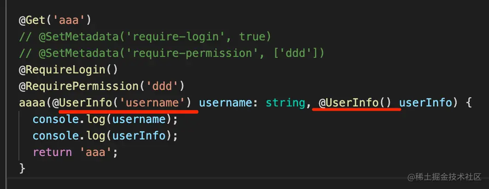

拿到 zhangsan 的 accessToken 来访问下 aaa 接口：

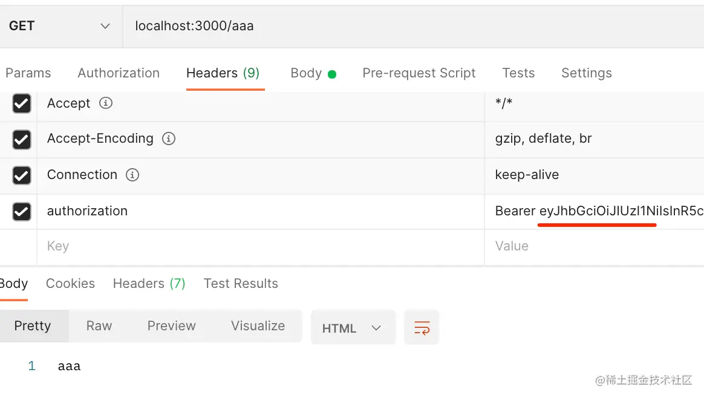

可以看到，服务端从 request 取出了 user 的值传入了 handler：

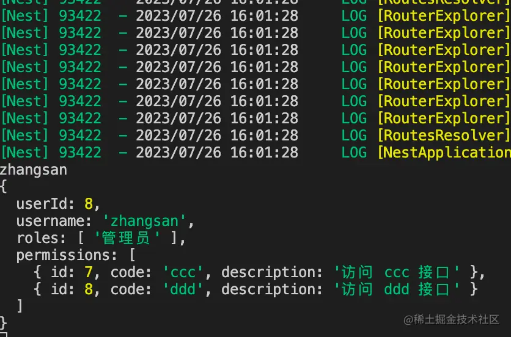

而这个 request.user 是在 LoginGuard 里设置的。

这样，就完成了鉴权和拿到用户信息的功能。

代码在[小册仓库](https://github.com/QuarkGluonPlasma/nestjs-course-code/tree/main/meeting_room_booking_system_backend)。

## 总结

这节我们实现了配置抽离、基于 jwt 登录、鉴权功能。

配置抽离使用 @nestjs/config 包，把配置放在 src 下的 .env 文件里，然后代码里从 configService 读取配置。

这样可以配置 nest-cli.json 的 assets 和 watchAssets 来自动把 env 文件复制到 dist 目录下。

我们使用代码做的数据初始化，线上要删掉这个接口，用导出的 sql 文件来初始化。

登录成功之后，返回 access_token、refresh_token 还有用户信息、roles、permissions 等。

并支持使用 refreshToken 来刷新 token。

之后使用 LoginGuard、PermissionGuard 来做登录和权限的鉴权，根据 handler 上的 metadata 来确定要不要做鉴权、需要什么权限。

我们还封装了几个自定义装饰器，用于方便的设置 metadata，从 request 取数据注入 handler。

至此，注册、登录、鉴权、配置抽离等功能就完成了。
