# 113. 会议室预订系统：用户管理模块-- interceptor、修改信息接口

用户管理模块我们实现了登录、注册、认证鉴权，还剩下一些列表、更新等接口：

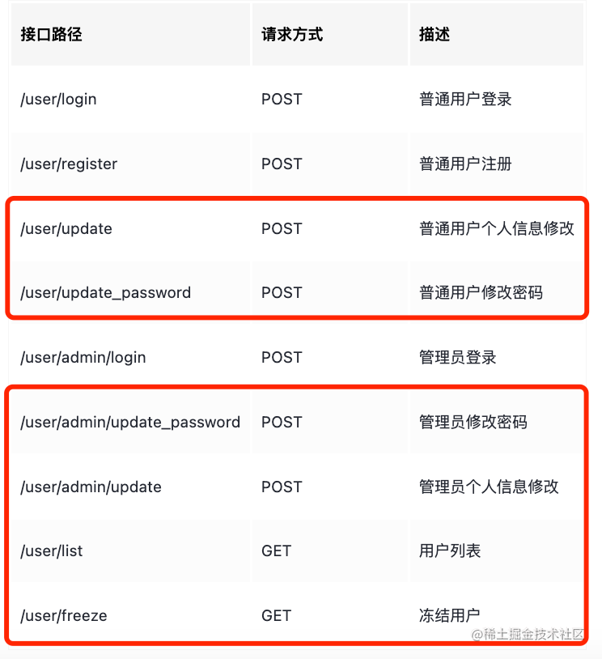

这节把修改密码、修改信息的接口写完。

在那之前，我们先加一个修改响应内容的拦截器。把响应的格式改成 {code、message、data} 这种。

```
nest g interceptor format-response --flat
```
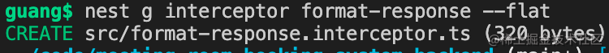

使用 map 操作符来修改响应：

```javascript
import { CallHandler, ExecutionContext, Injectable, NestInterceptor } from '@nestjs/common';
import { Response } from 'express';
import { map, Observable } from 'rxjs';

@Injectable()
export class FormatResponseInterceptor implements NestInterceptor {
  intercept(context: ExecutionContext, next: CallHandler): Observable<any> {
    const response = context.switchToHttp().getResponse<Response>();

    return next.handle().pipe(map((data) => {
      return {
        code: response.statusCode,
        message: 'success',
        data
      }
    }));
  }
}

```
全局启用它：

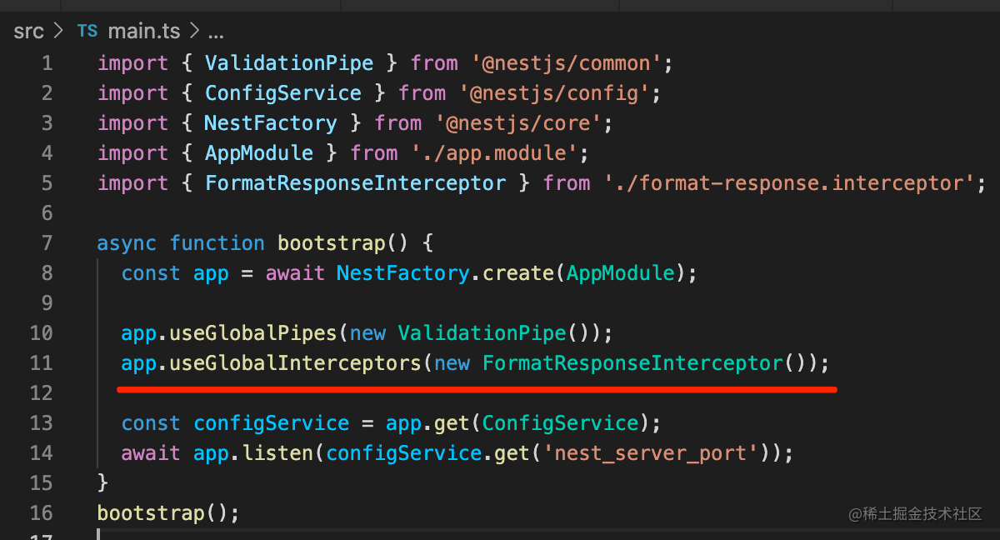

这时候访问 http://localhost:3000 ，可以看到响应格式变了：

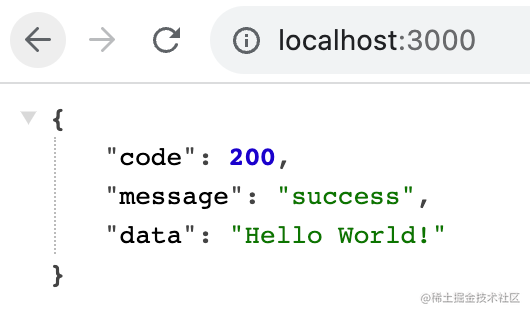

这里我用了一个 [JSON Formatter](https://chrome.google.com/webstore/detail/json-formatter/bcjindcccaagfpapjjmafapmmgkkhgoa?utm_source=ext_sidebar&hl=zh-CN) 的 chrome 插件来格式化。

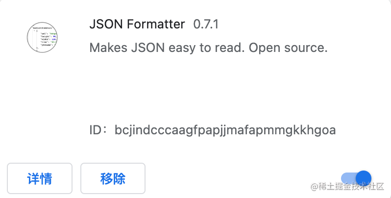

然后再试下其它接口：

响应格式确实变了：

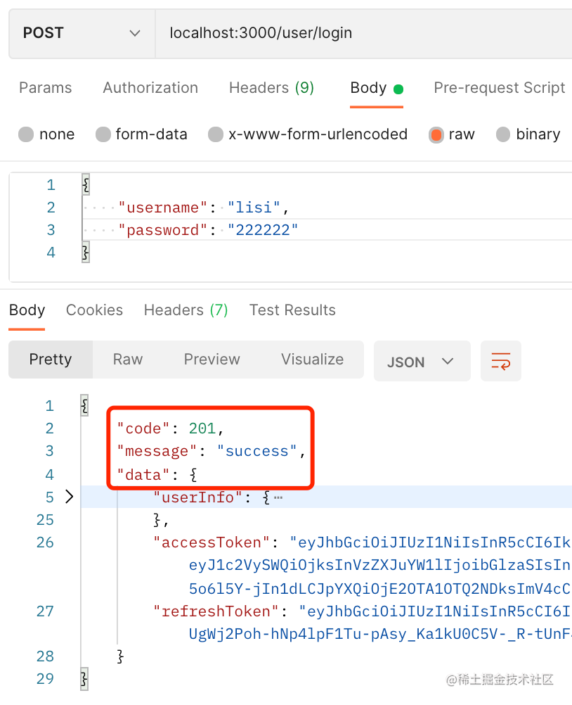

抛出的异常还是由内置的 Exception Filter 来处理，返回响应：

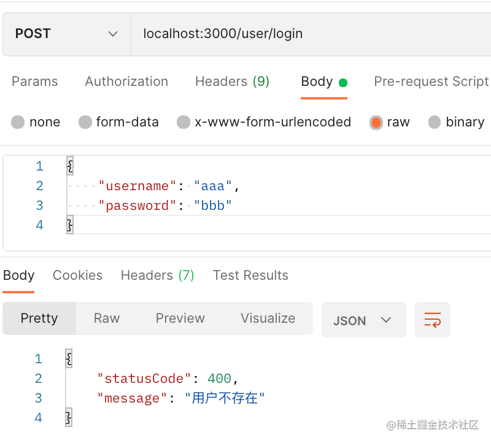

然后再加一个接口访问记录的 interceptor：

```
nest g interceptor invoke-record --flat
```
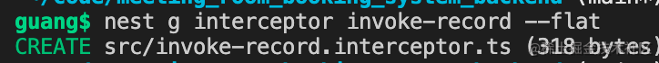

记录下访问的 ip、user agent、请求的 controller、method，接口耗时、响应内容，当前登录用户等信息。

```javascript
import { CallHandler, ExecutionContext, Injectable, Logger, NestInterceptor } from '@nestjs/common';
import { Response } from 'express';
import { Request } from 'express';
import { Observable, tap } from 'rxjs';

@Injectable()
export class InvokeRecordInterceptor implements NestInterceptor {
  private readonly logger = new Logger(InvokeRecordInterceptor.name);

  intercept(
    context: ExecutionContext,
    next: CallHandler<any>,
  ): Observable<any> | Promise<Observable<any>> {
    const request = context.switchToHttp().getRequest<Request>();
    const response = context.switchToHttp().getResponse<Response>();

    const userAgent = request.headers['user-agent'];

    const { ip, method, path } = request;

    this.logger.debug(
      `${method} ${path} ${ip} ${userAgent}: ${
        context.getClass().name
      } ${
        context.getHandler().name
      } invoked...`,
    );
  
    this.logger.debug(`user: ${request.user?.userId}, ${request.user?.username}`);

    const now = Date.now();

    return next.handle().pipe(
      tap((res) => {
        this.logger.debug(
          `${method} ${path} ${ip} ${userAgent}: ${response.statusCode}: ${Date.now() - now}ms`,
        );
        this.logger.debug(`Response: ${JSON.stringify(res)}`);
      }),
    );
  }
}

```
全局启用这个 interceptor：

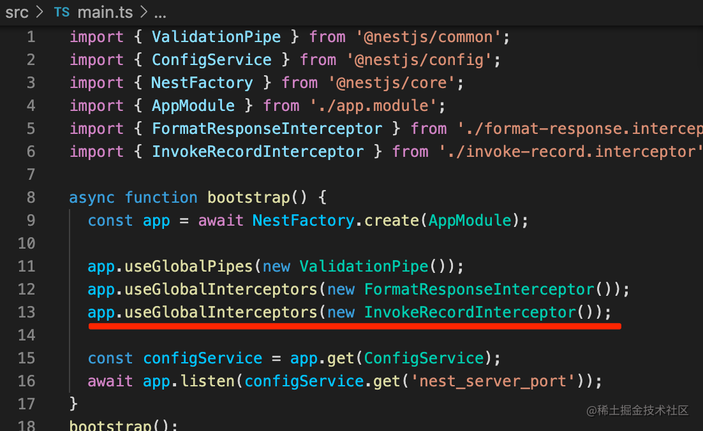

试一下：

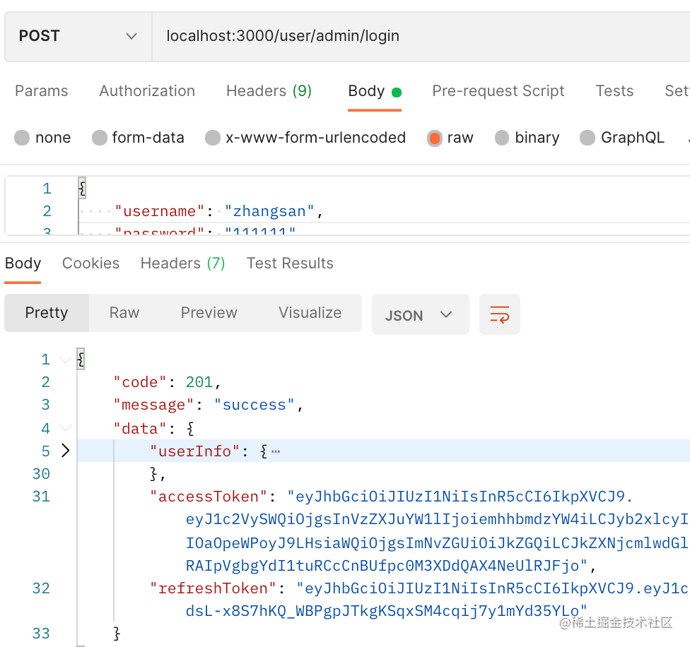

访问管理员的登录的接口。

可以看到控制台打印了请求的路径、请求方法、controller、handler 等信息：

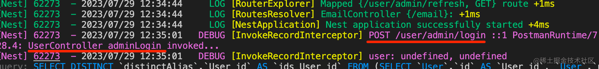

这里因为是本地访问，所以是 ::1 的 ip，相当于 localhost。

user 因为当前还没有，所以是 undefined

响应之后打印了接口耗时以及接口返回的数据：

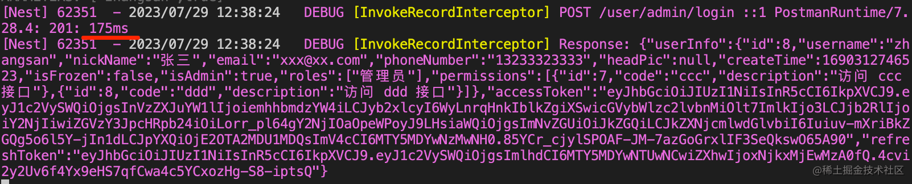

我们拿着个 access_token 放在 header 来访问 /aaa 接口试下：

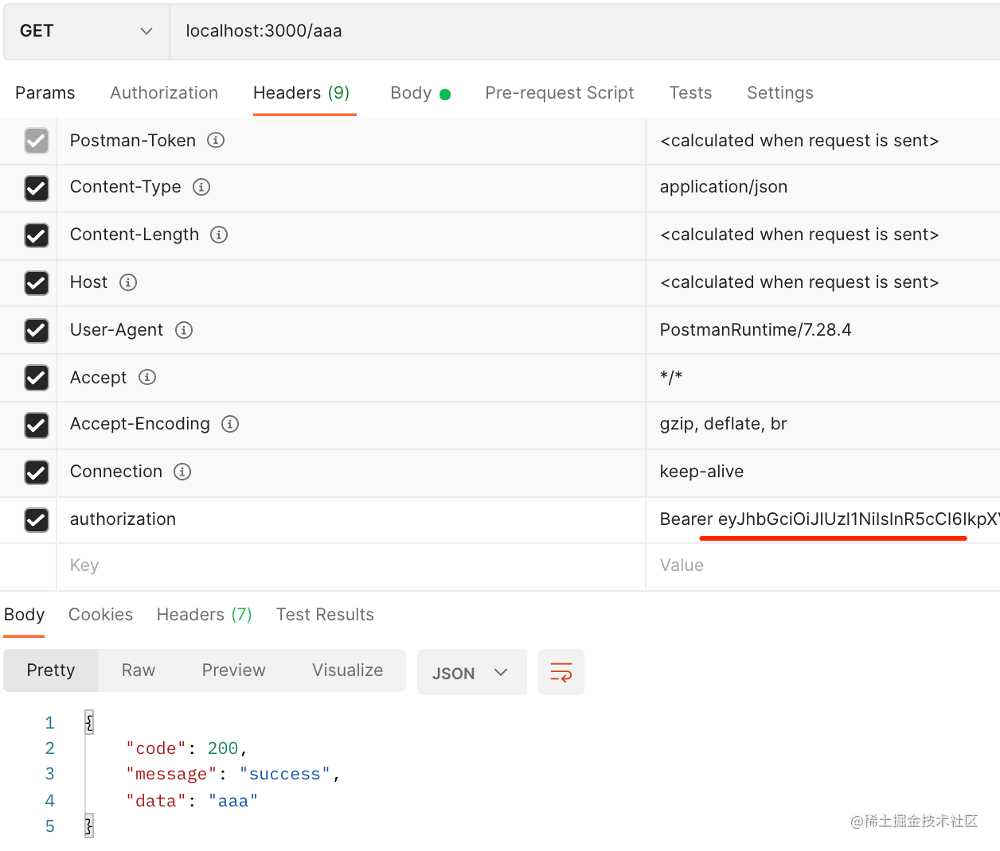

可以看到，请求之前打印了访问的 controller、handler、user等信息：

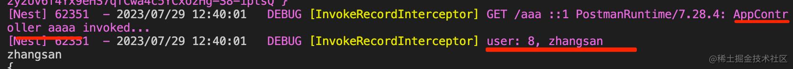

响应之后打印了接口耗时和响应内容等信息：

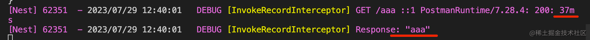

为什么 interceptor 里能拿到 user 信息呢？

因为这是在 LoginGuard 里从 jwt 取出来放到  request.user 的，而 Guard 在 interceptor 之前调用：

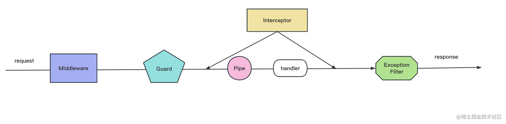

然后实现普通用户和管理员修改密码、修改信息的接口。

涉及到这 4 个页面：

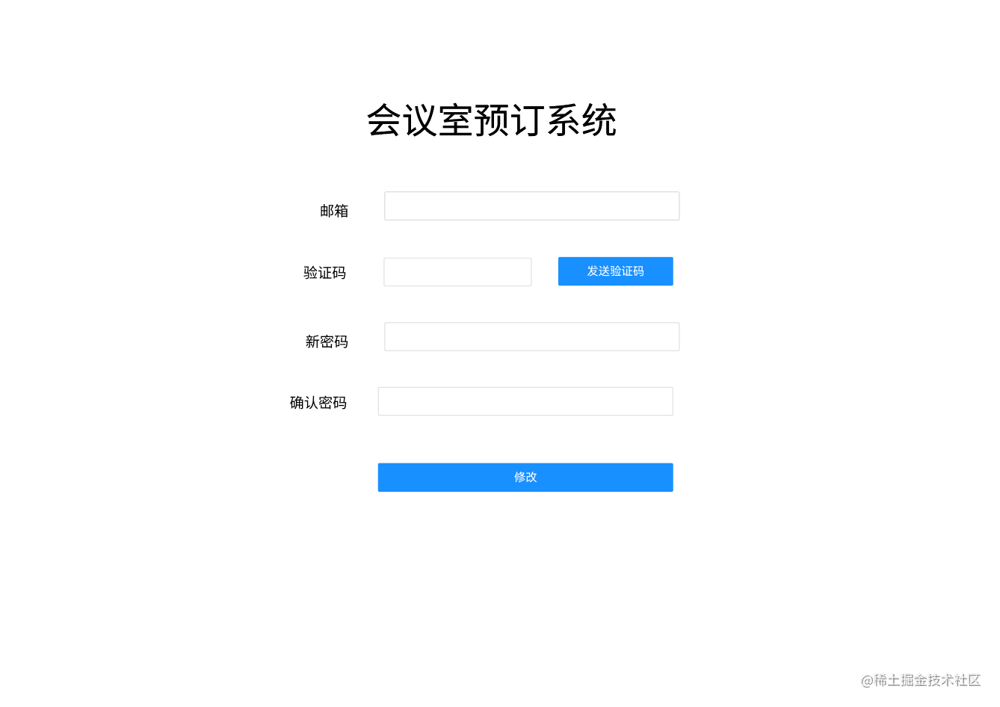

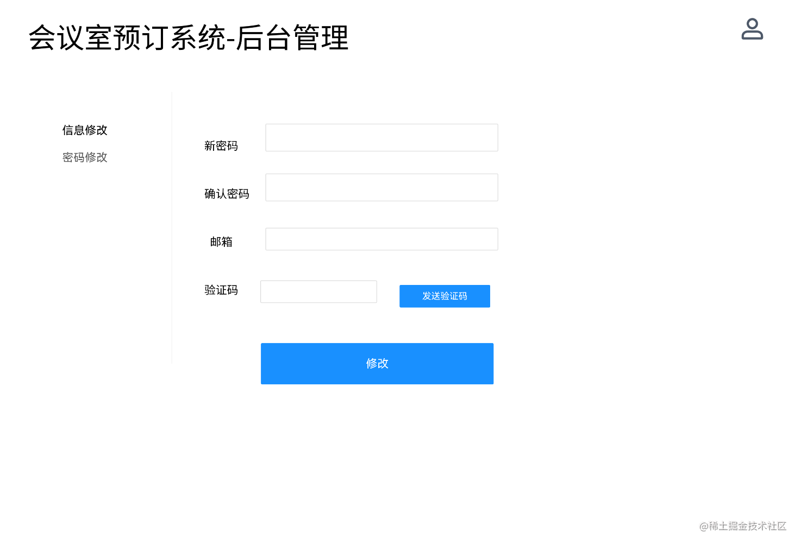

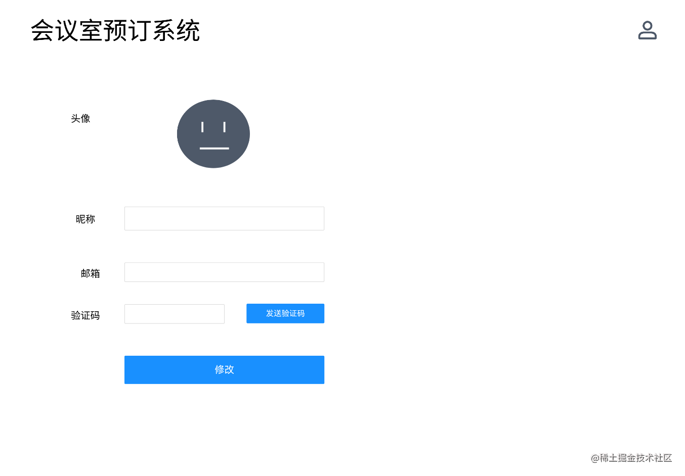

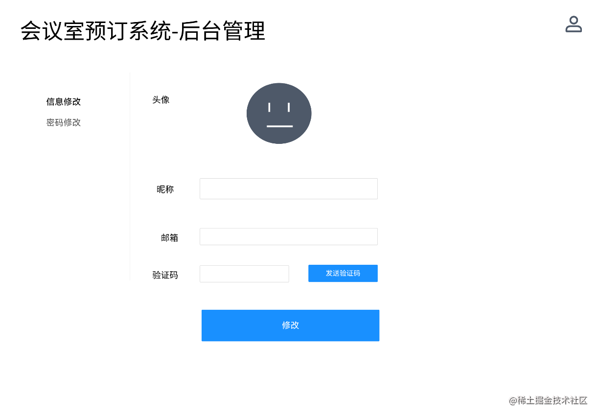

分别是 /user/update_password 和 /user/admin/update_password、/user/update、/user/admin/update

不过在修改信息之前，需要先实现查询用户信息的接口，用来回显数据。

在 UserController 添加一个 /user/info 接口：

```javascript
@Get('info')
@RequireLogin()
async info(@UserInfo('userId') userId: number) {
  return await this.userService.findUserDetailById(userId);
}
```
加上 @RequireLogin 装饰，这样 LoginGuard 就会对 /user/info 的请求做登录检查，并把 user 信息放到 request 上。

然后用前面封装的自定义装饰器 @UserInfo 从 reqeust.user 取 userId 注入 handler。

在 UserService  实现 findUserDetailById 方法：

```javascript
async findUserDetailById(userId: number) {
    const user =  await this.userRepository.findOne({
        where: {
            id: userId
        }
    });

    return user;
}
```
我们测试下：

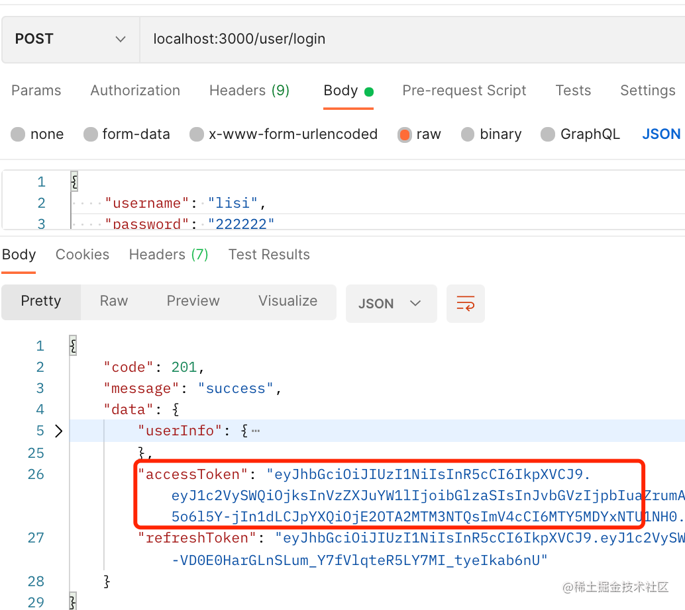

登录用户端，拿到 access_token。

然后加到 header 里访问 /user/info

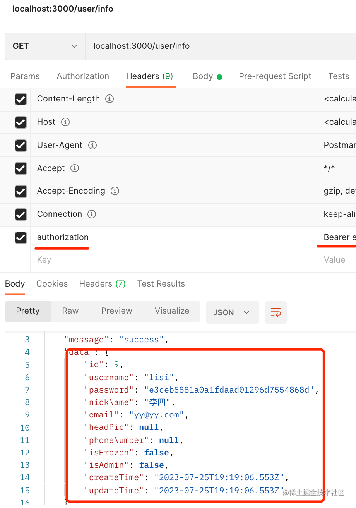

成功拿到了 user 的信息。

但这些信息并不是全都需要，比如密码就不需要返回。

我们创建个 vo 来封装返回的结果：

创建 /user/vo/user-info.vo.ts

```javascript
export class UserDetailVo {
    id: number;

    username: string;

    nickName: string;

    email: string;

    headPic: string;

    phoneNumber: string;

    isFrozen: boolean;

    createTime: Date;
}
```
然后把 controller 里的返回值封装成 vo：

```javascript
@Get('info')
@RequireLogin()
async info(@UserInfo('userId') userId: number) {
  const user = await this.userService.findUserDetailById(userId);

  const vo = new UserDetailVo();
  vo.id = user.id;
  vo.email = user.email;
  vo.username = user.username;
  vo.headPic = user.headPic;
  vo.phoneNumber = user.phoneNumber;
  vo.nickName = user.nickName;
  vo.createTime = user.createTime;
  vo.isFrozen = user.isFrozen;

  return vo;
}
```
测试下：

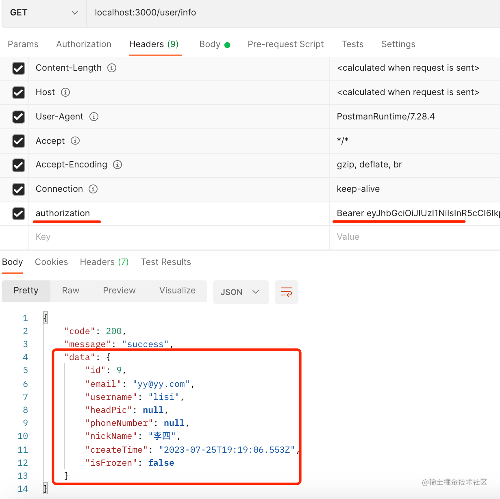

现在返回的内容就是合理的了。

然后实现修改密码的接口：

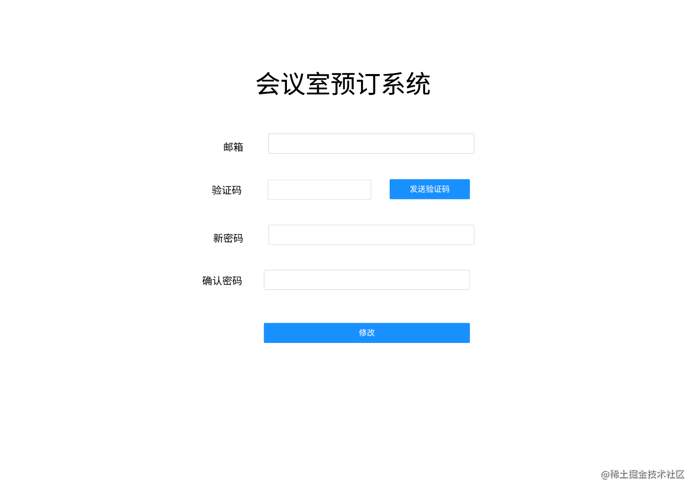


管理员和用户修改密码的页面是一样的，我们就用一个接口就好了。

```javascript
@Post(['update_password', 'admin/update_password'])
@RequireLogin()
async updatePassword(@UserInfo('userId') userId: number, @Body() passwordDto: UpdateUserPasswordDto) {
    console.log(passwordDto);
    return 'success';
}
```

@Post 写个数组，就代表数组里的这两个路由是同一个 handler 处理。

这个接口同样是需要登录的，所以加上 @RequireLogin 的装饰器。

用 @UserInfo 从 request.user 取 userId，其余的通过 dto 传。

创建 src/user/dto/update-user-password.dto.ts

```javascript
import { IsEmail, IsNotEmpty, MinLength } from "class-validator";

export class UpdateUserPasswordDto {    
    @IsNotEmpty({
        message: '密码不能为空'
    })
    @MinLength(6, {
        message: '密码不能少于 6 位'
    })
    password: string;
    
    @IsNotEmpty({
        message: '邮箱不能为空'
    })
    @IsEmail({}, {
        message: '不是合法的邮箱格式'
    })
    email: string;
    
    @IsNotEmpty({
        message: '验证码不能为空'
    })
    captcha: string;
}
```
需要传的是邮箱、密码、验证码。

确认密码在前端和密码对比就行，不需要传到后端。

测试下：

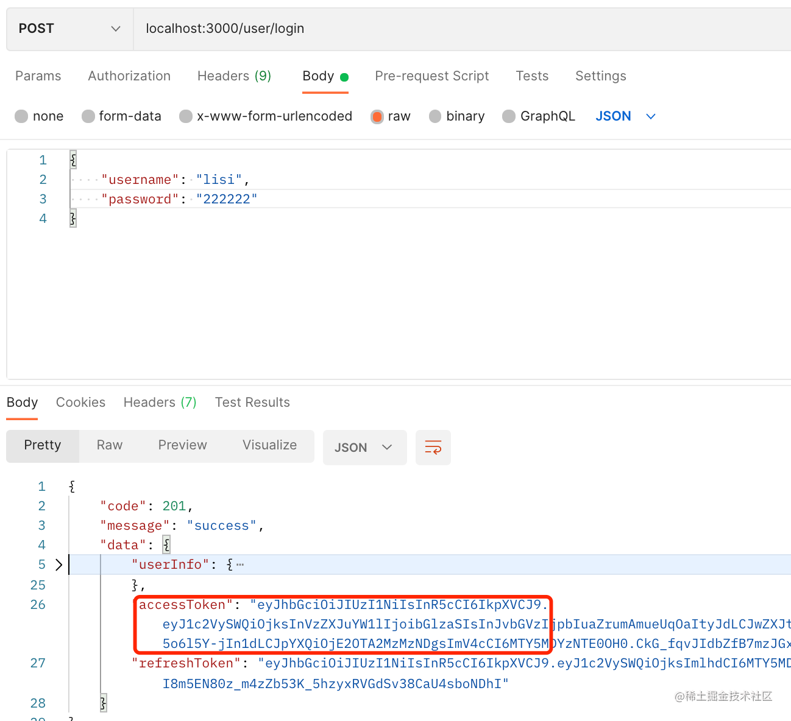

登录用户端，拿到 access_token，然后访问 /user/update_password 和 /user/admin/update_password 接口：

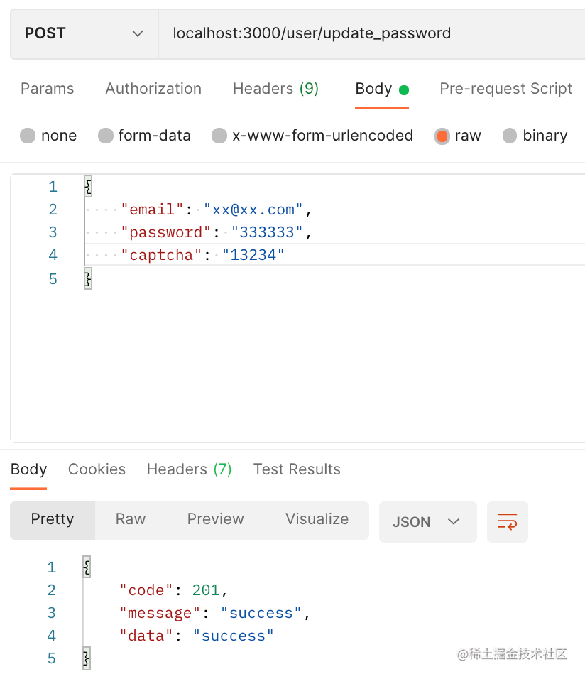

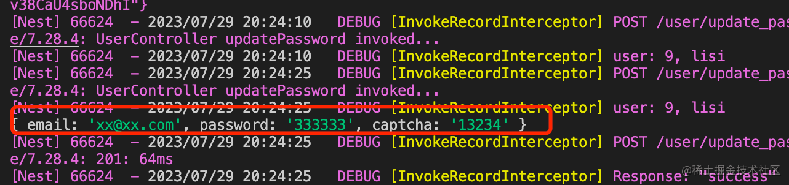

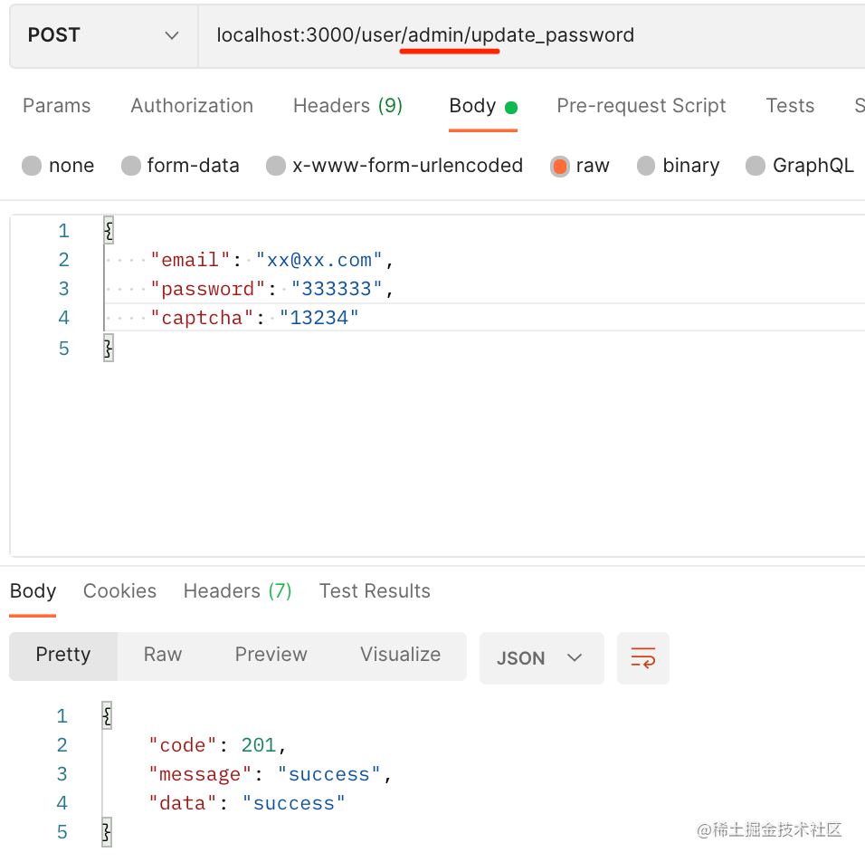

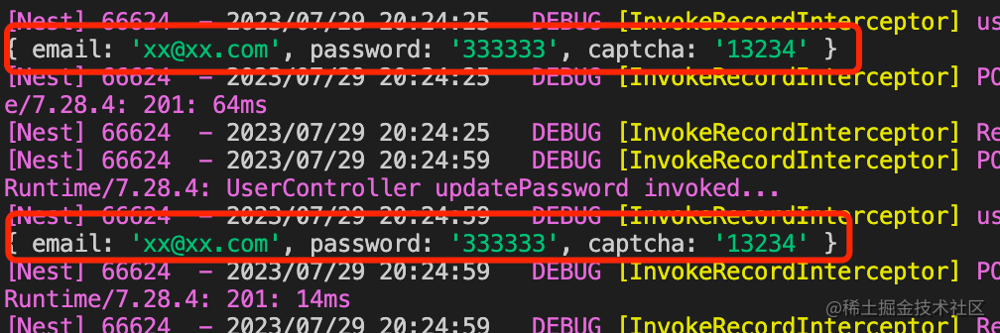

都能正常接收到数据。

然后实现下具体的更新密码的逻辑：

先查询 redis 中有没有邮箱对应的验证码，没有的话就返回验证码不存在或者不正确。

查到的话再调用 Repository 去更新数据库中的用户密码。

也就是这样的：

在 UserController 里调用 UserService 的方法：

```javascript
@Post(['update_password', 'admin/update_password'])
@RequireLogin()
async updatePassword(@UserInfo('userId') userId: number, @Body() passwordDto: UpdateUserPasswordDto) {
    return await this.userService.updatePassword(userId, passwordDto);
}
```
UserService 实现具体的逻辑：
```javascript
async updatePassword(userId: number, passwordDto: UpdateUserPasswordDto) {
    const captcha = await this.redisService.get(`update_password_captcha_${passwordDto.email}`);

    if(!captcha) {
        throw new HttpException('验证码已失效', HttpStatus.BAD_REQUEST);
    }

    if(passwordDto.captcha !== captcha) {
        throw new HttpException('验证码不正确', HttpStatus.BAD_REQUEST);
    }

    const foundUser = await this.userRepository.findOneBy({
      id: userId
    });

    foundUser.password = md5(passwordDto.password);

    try {
      await this.userRepository.save(foundUser);
      return '密码修改成功';
    } catch(e) {
      this.logger.error(e, UserService);
      return '密码修改失败';
    }
}
```
先查询 redis 中有相对应的验证码，检查通过之后根据 id 查询用户信息，修改密码之后 save。

测试下：

登录 lisi 账号，拿到 access_token

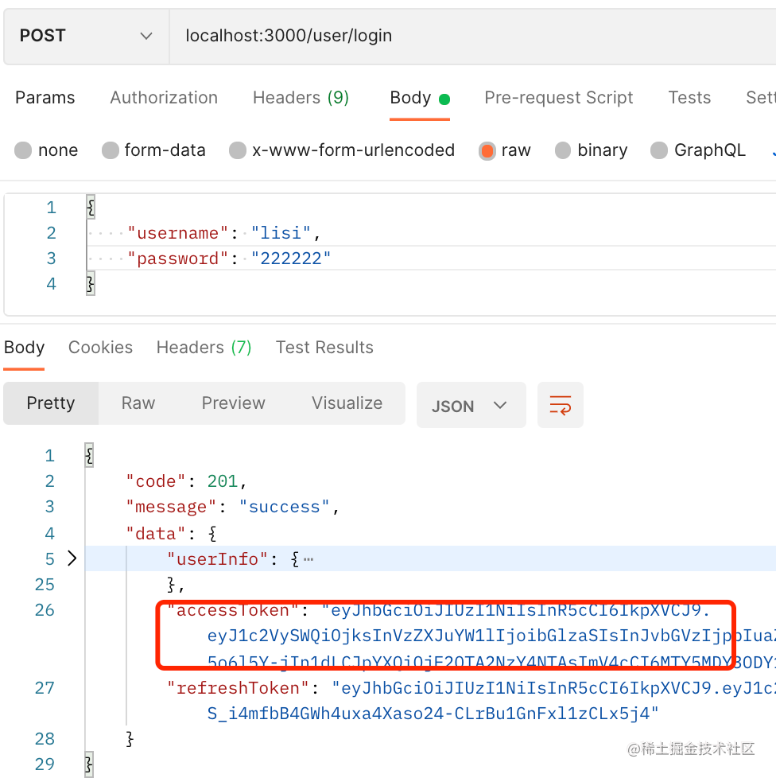

数据库中可以查到 lisi 的邮箱：

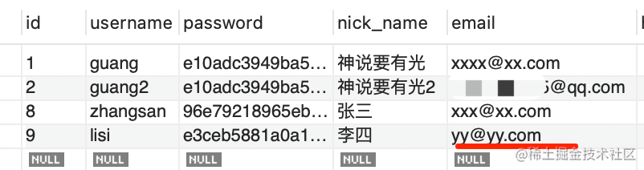

带上 access_token 访问更新密码接口：

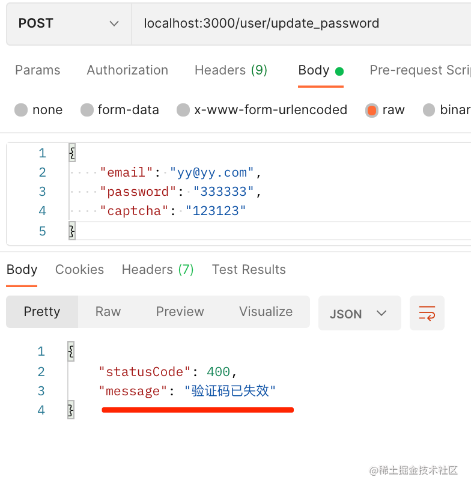

先手动去 redis 里添加 update_password_captcha_yy@yy.com 的 key，值为 123123（注意，我们现在用的是 redis 的 db1）

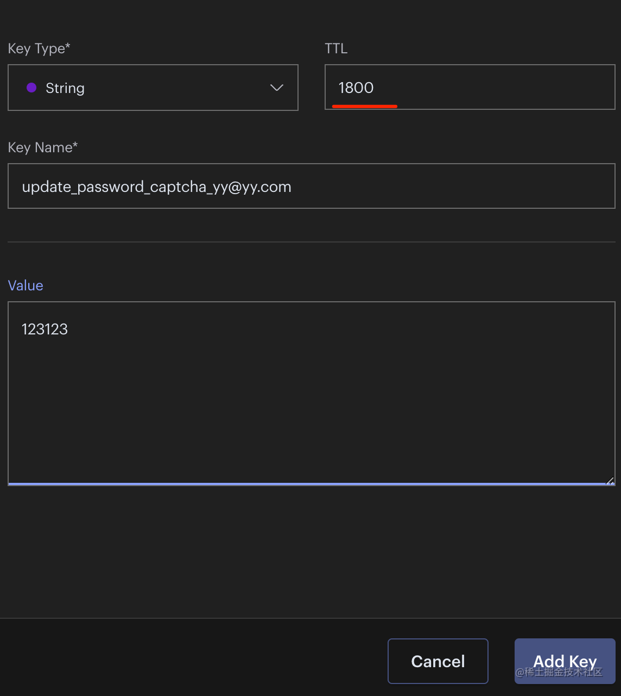

半小时过期。

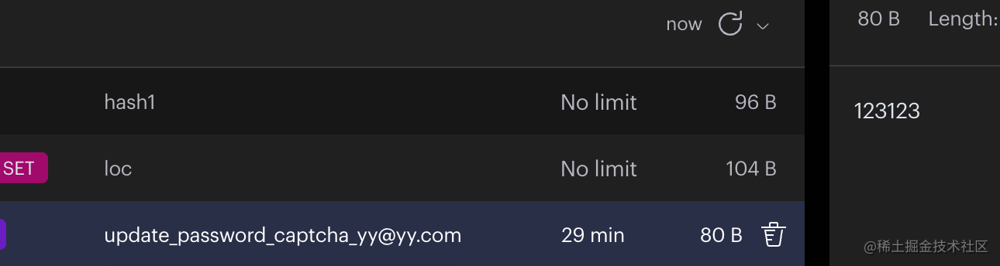

然后再试下：

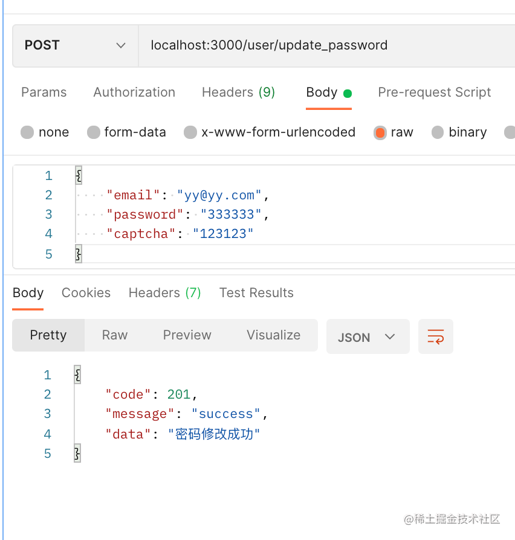

修改成功。

数据库里看不到具体的密码，但也能看出确实变了：

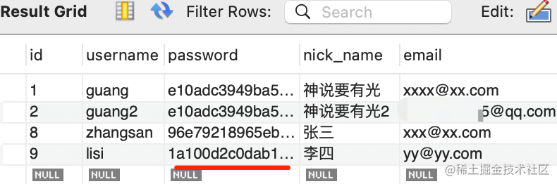

之前是这样的：


然后我们登录下试试就知道了：


用之前的密码登录，会提示密码错误。

换成新密码就好了：

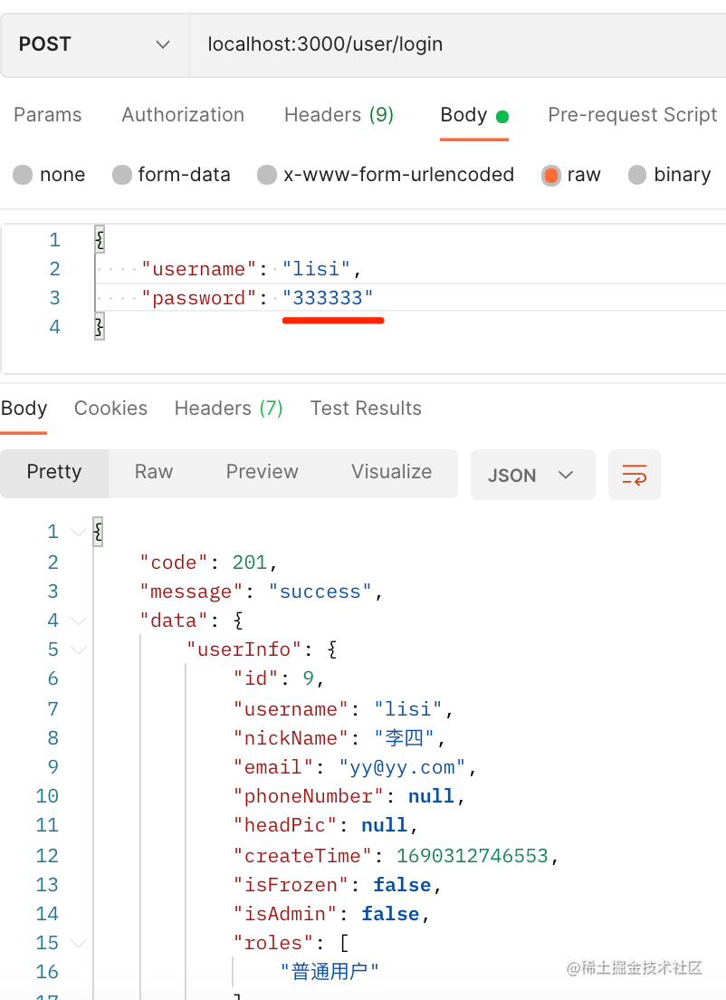

然后再加上这个发送邮箱验证码的接口：
```javascript
@Get('update_password/captcha')
async updatePasswordCaptcha(@Query('address') address: string) {
    const code = Math.random().toString().slice(2,8);

    await this.redisService.set(`update_password_captcha_${address}`, code, 10 * 60);

    await this.emailService.sendMail({
      to: address,
      subject: '更改密码验证码',
      html: `<p>你的更改密码验证码是 ${code}</p>`
    });
    return '发送成功';
}
```
和之前注册验证码的逻辑一样。

然后还有修改个人信息的：


对应 /user/udpate 和 /user/admin/update 接口。

回显数据的接口就用 /user/info 这个。

实现流程和修改密码的差不多：

```javascript
@Post(['update', 'admin/update'])
@RequireLogin()
async update(@UserInfo('userId') userId: number, @Body() updateUserDto: UpdateUserDto) {
    return await this.userService.update(userId, updateUserDto); 
}
```
在 UserController 定义两个 post 接口。

创建 src/user/dto/udpate-user.dto.ts

```javascript
import { IsEmail, IsNotEmpty } from "class-validator";

export class UpdateUserDto {

    headPic: string;

    nickName: string;
    
    @IsNotEmpty({
        message: '邮箱不能为空'
    })
    @IsEmail({}, {
        message: '不是合法的邮箱格式'
    })
    email: string;
    
    @IsNotEmpty({
        message: '验证码不能为空'
    })
    captcha: string;
}
```
这里 headPic 和 nickName 就不做非空约束了，也就是说可以不改。

对应的 UserService 里的逻辑和修改密码的差不多：

```javascript
async update(userId: number, updateUserDto: UpdateUserDto) {
    const captcha = await this.redisService.get(`update_user_captcha_${updateUserDto.email}`);

    if(!captcha) {
        throw new HttpException('验证码已失效', HttpStatus.BAD_REQUEST);
    }

    if(updateUserDto.captcha !== captcha) {
        throw new HttpException('验证码不正确', HttpStatus.BAD_REQUEST);
    }

    const foundUser = await this.userRepository.findOneBy({
      id: userId
    });

    if(updateUserDto.nickName) {
        foundUser.nickName = updateUserDto.nickName;
    }
    if(updateUserDto.headPic) {
        foundUser.headPic = updateUserDto.headPic;
    }

    try {
      await this.userRepository.save(foundUser);
      return '用户信息修改成功';
    } catch(e) {
      this.logger.error(e, UserService);
      return '用户信息修改成功';
    }
}
```
只不过现在是传了的属性才会修改，没传的不修改。

测试下：

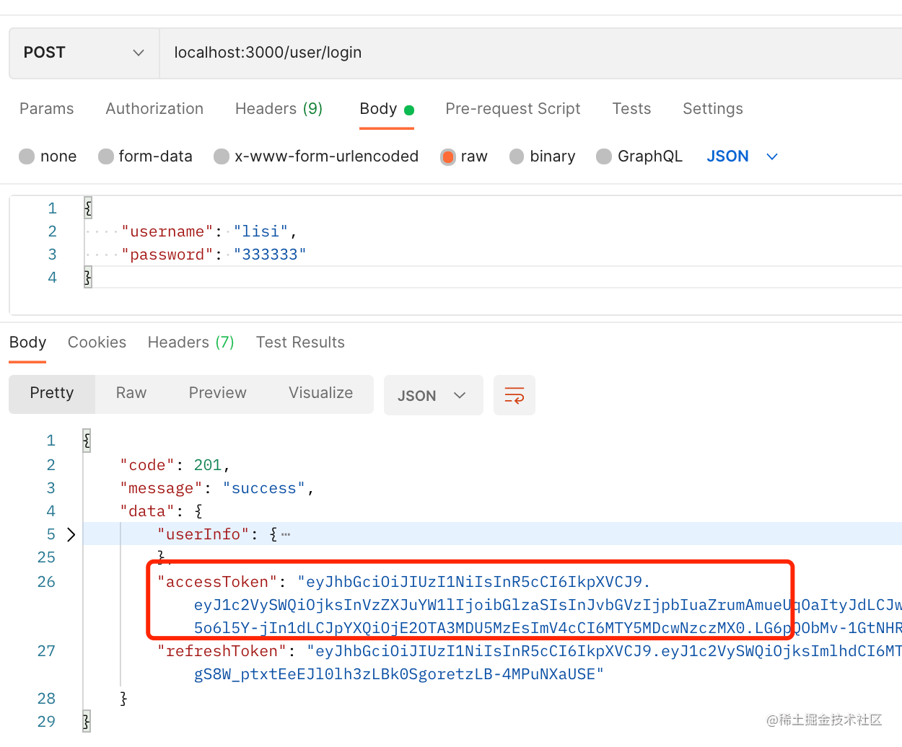

登录 lisi 账号拿到 token

带上 token 访问 /user/update 接口：

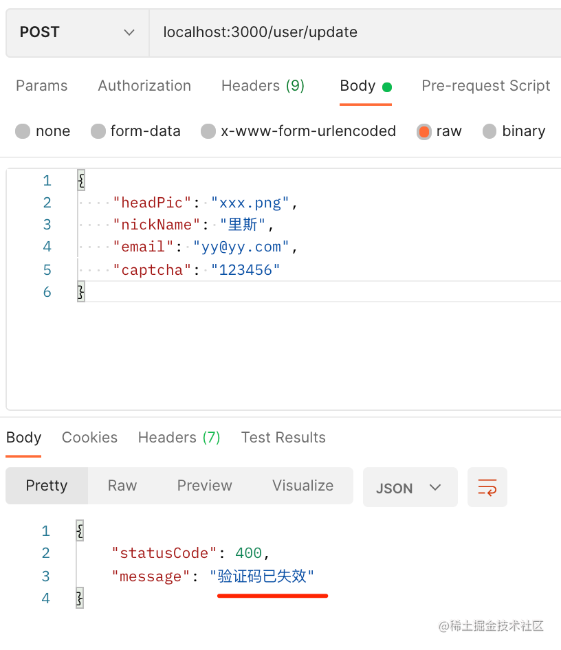

提示验证码失效，在 redis 里添加 update_user_captcha_yy@yy.com 的 key，值为 123456

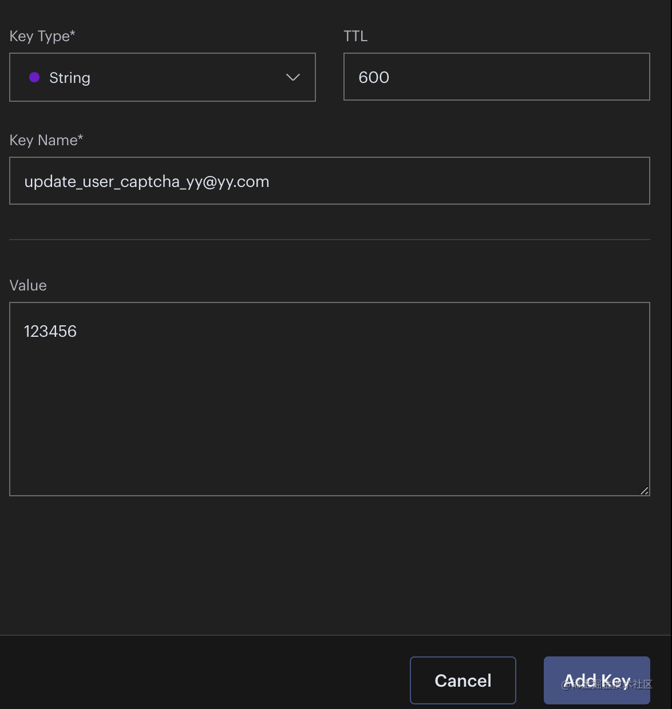

然后再试下：

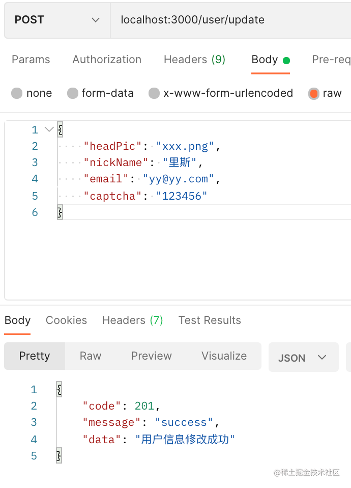

用户信息修改成功了，在数据库里也可以看到确实修改了：

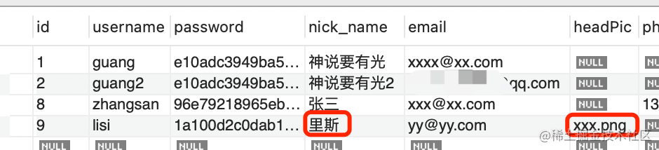

这样，修改接口就完成了。

然后还要加一个发验证码的接口，这个和别的发验证码的逻辑一样：

```javascript
@Get('update/captcha')
async updateCaptcha(@Query('address') address: string) {
    const code = Math.random().toString().slice(2,8);

    await this.redisService.set(`update_user_captcha_${address}`, code, 10 * 60);

    await this.emailService.sendMail({
      to: address,
      subject: '更改用户信息验证码',
      html: `<p>你的验证码是 ${code}</p>`
    });
    return '发送成功';
}
```
代码在[小册仓库](https://github.com/QuarkGluonPlasma/nestjs-course-code/tree/main/meeting_room_booking_system_backend)。
## 总结

这节我们添加了 interceptor 用来对响应格式做转换，改成 {code、message、data} 的格式，用到了 map 操作符。

并且还用 interceptor 实现了接口访问的日志记录，用到 tap 操作符。

然后实现了修改信息、修改密码的接口。

这些流程都差不多，首先实现一个查询的接口用来回显数据，通过 vo 封装返回的数据。

然后提交数据进行更新，用到的 userId 通过之前封装的 @UserInfo 装饰器从 request.user 来取。

还剩个列表接口，我们下节再写。
