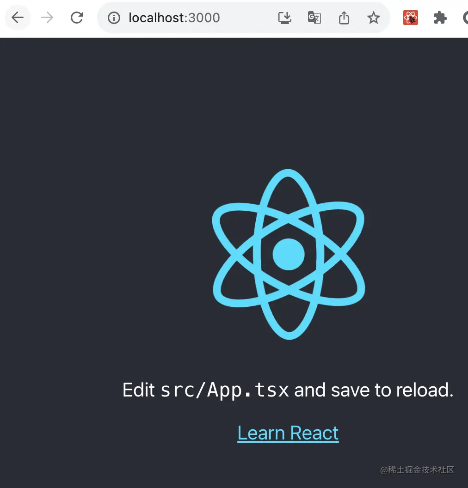

# 116. 会议室预订系统：用户管理模块-- 用户端登录注册页面

用户模块接口写完之后，这节我们开始写页面。

先写下用户端页面，涉及到到登录、注册、修改密码、修改个人信息这 4 个：


先新建个 react 项目：

```
npx create-react-app --template=typescript meeting_room_booking_system_frontend_u
ser
```


进入项目目录，把开发服务跑起来：

```
npm run start
```
浏览器访问 http://localhost:3000 可以看到这个界面：



就说明 react 项目成功跑起来了。

然后我们添加 router：

```
npm install --save react-router-dom
```
在 index.tsx 加上路由的配置：

```javascript
import ReactDOM from 'react-dom/client';
import './index.css';
import { RouterProvider, createBrowserRouter, Link, Outlet } from 'react-router-dom';

function Aaa() {
  return <div>aaa</div>;
}

function Bbb(){
  return <div>bbb</div>;
}

function Layout() {
  return <div>
    <div><Link to="/aaa">to aaa</Link></div>
    <div><Link to="/bbb">to bbb</Link></div>
    <div>
      <Outlet/>
    </div>
  </div>
}

function ErrorPage() {
  return <div>error</div>;
}

const routes = [
  {
    path: "/",
    element: <Layout/>,
    errorElement: <ErrorPage/>,
    children: [
      {
        path: "aaa",
        element: <Aaa />,
      },
      {
        path: "bbb",
        element: <Bbb />,
      }    
    ],
  }
];
const router = createBrowserRouter(routes);

const root = ReactDOM.createRoot(
  document.getElementById('root') as HTMLElement
);

root.render(<RouterProvider router={router}/>);
```

配置了 3 个路由：

访问 / 的时候，渲染 Layout 组件。

访问 /aaa 的时候，渲染 Aaa 组件。

访问 /bbb 的时候，渲染 Bbb 组件。

以及出错的时候，渲染 ErrorPage 组件。

其中，aaa 和 bbb 是 / 的子路由，渲染在 Layout 组件的 Outlet 的地方。

这就是 React Router 的基本用法。

测试下：


都没问题。

然后创建 3 个组件：Login、Register、UpdatePassword

把 src 目录下其余文件去掉：


然后添加这 3 个组件还有 ErrorPage 组件：

Login.tsx

```javascript
export function Login() {
    return <div>login</div>   
}
```

Register.tsx

```javascript
export function Register() {
    return <div>register</div>
}
```

UpdatePassword.tsx

```javascript
export function UpdatePassword() {
    return <div>UpdatePassword</div>
}
```
ErrorPage.tsx

```javascript
export function ErrorPage() {
    return <div>ErrorPage</div>
}
```

改下 index.tsx 配置对应的路由：

```javascript
import ReactDOM from 'react-dom/client';
import './index.css';
import { RouterProvider, createBrowserRouter, Link, Outlet } from 'react-router-dom';
import { Register } from './Register';
import { Login } from './Login';
import { UpdatePassword } from './UpdatePassword';
import { ErrorPage } from './ErrorPage';

const routes = [
  {
    path: "/",
    element: <div>index</div>,
    errorElement: <ErrorPage />,
  },
  {
    path: "login",
    element: <Login />,
  },
  {
    path: "register",
    element: <Register />,
  },
  {
    path: "update_password",
    element: <UpdatePassword />,
  }
];
const router = createBrowserRouter(routes);

const root = ReactDOM.createRoot(
  document.getElementById('root') as HTMLElement
);

root.render(<RouterProvider router={router}/>);

```
测试下：


都没啥问题。

然后来写 Login 页面，也就是这个：


引入 Ant Design 组件库：

```
npm install antd --save
```
在 Login 组件引入 DatePicker 组件：

```javascript
import { DatePicker } from "antd";

export function Login() {
    return <div><DatePicker/></div>   
}
```


没啥问题，说明 antd 引入成功了。

然后我们把登录页面写一下：

```javascript
import { Button, Checkbox, Form, Input } from 'antd';
import './login.css';

interface LoginUser {
    username: string;
    password: string;
}

const onFinish = (values: LoginUser) => {
    console.log(values);
};


const layout1 = {
    labelCol: { span: 4 },
    wrapperCol: { span: 20 }
}

const layout2 = {
    labelCol: { span: 0 },
    wrapperCol: { span: 24 }
}

export function Login() {
    return <div id="login-container">
        <h1>会议室预订系统</h1>
        <Form
            {...layout1}
            onFinish={onFinish}
            colon={false}
            autoComplete="off"
        >
            <Form.Item
                label="用户名"
                name="username"
                rules={[{ required: true, message: '请输入用户名!' }]}
            >
                <Input />
            </Form.Item>

            <Form.Item
                label="密码"
                name="password"
                rules={[{ required: true, message: '请输入密码!' }]}
            >
                <Input.Password />
            </Form.Item>

            <Form.Item
                {...layout2}
            >
                <div className='links'>
                    <a href=''>创建账号</a>
                    <a href=''>忘记密码</a>
                </div>
            </Form.Item>

            <Form.Item
                {...layout2}
            >
                <Button className='btn' type="primary" htmlType="submit">
                    登录
                </Button>
            </Form.Item>
        </Form>
    </div>   
}
```

其中，layout 是 label 和 wrapper 的比例分配，antd 的栅格系统一共分了 24 份。

上面两个 Form.Item 是 label 4 份，wrapper 20 份。

下面两个 Form.Item 是 label 0 份，wrapper 24 份。


colon 为 false 是去掉 label 后的冒号

然后 css 部分如下：

```css
#login-container {
    width: 400px;
    margin: 100px auto 0 auto;
    text-align: center;
}
#login-container .links {
    display: flex;
    justify-content: space-between;
}
#login-container .btn {
    width: 100%;
}
```
访问 /login，可以看到现在的登录页面：


输入用户名、密码，点击登录：


控制台打印了拿到的表单值。

我们在前端项目安装下 axios：

```
npm install --save axios
```
然后把服务端跑起来：

跑之前先把端口配置改为 3005，因为前端开发服务用了 3000 端口：


然后在后端项目执行：

```
npm run start:dev
```
登录接口有哪些参数呢？

可以看 swagger 接口文档：

访问 http://localhost:3005/api-doc


在 postman 里测试下登录接口：


然后在点击登录按钮之后，用 axios 调用它：

在前端项目创建个 interfaces.ts

```javascript
import axios from "axios";

const axiosInstance = axios.create({
    baseURL: 'http://localhost:3005/',
    timeout: 3000
});

export async function login(username: string, password: string) {
    return await axiosInstance.post('/user/login', {
        username, password
    });
}
```

在这里集中管理接口。

然后 onFinish 里调用：

```javascript
const onFinish = async (values: LoginUser) => {
    const res = await login(values.username, values.password);

    if(res.status === 201 || res.status === 200) {
        message.success('登录成功');

        console.log(res.data);
    } else {
        message.error(res.data.data || '系统繁忙，请稍后再试');
    }
};
```

登录下：


提示跨域错误：


我们在服务端开启下跨域支持：


再试下：


因为这个时候接口返回 400


axios 对于 400 多、500 多的请求，都会抛出错误。

所以我们加一个响应的拦截器处理下：

在 interface.ts 添加：

```javascript
axiosInstance.interceptors.response.use(
    (response) => {
        return response;
    },
    async (error) => {
        return error.response;
    }
);
```

再次调用，就能正常处理了：


如果你把返回的值改为 Promise.reject

```javascript
axiosInstance.interceptors.response.use(
    (response) => {
        return response;
    },
    async (error) => {
        return Promise.reject(error.response);
    }
);
```
就又恢复原样了：


因为 axios 默认就是这样处理的，400 多和 500 多的请求，会返回 reject。

把它改回来，然后测试下正常的请求：


提示登录成功，并且返回了用户信息和 token。

再输入错误的用户名、密码试试：


会返回 400 和具体的错误。

然后完善下 onFinish 方法：

```javascript
const onFinish = async (values: LoginUser) => {
    const res = await login(values.username, values.password);

    const { code, message: msg, data} = res.data;
    if(res.status === 201 || res.status === 200) {
        message.success('登录成功');

        localStorage.setItem('access_token', data.accessToken);
        localStorage.setItem('refresh_token', data.refreshToken);
        localStorage.setItem('user_info', JSON.stringify(data.userInfo));
    } else {
        message.error(data || '系统繁忙，请稍后再试');
    }
};
```

返回 success 的时候，把 access_token、refresh_token、user_info 存入 localStorage

否则，提示错误。

测试下：


登录成功之后，在 Application > Local Storage 里就可以看到这三个值


用户不存在或者密码错误的时候，也提示了对应的错误：


这样，登录的前后端功能就都完成了。

然后来写下注册：


实现下 Register 页面组件：

```javascript
import { Button, Form, Input, message } from 'antd';
import './register.css';
import { useForm } from 'antd/es/form/Form';

export interface RegisterUser {
    username: string;
    nickName: string;
    password: string;
    confirmPassword: string;
    email: string;
    captcha: string;
}

const onFinish = async (values: RegisterUser) => {
    console.log(values);
};


const layout1 = {
    labelCol: { span: 6 },
    wrapperCol: { span: 18 }
}

const layout2 = {
    labelCol: { span: 0 },
    wrapperCol: { span: 24 }
}

export function Register() {
    const [form] = useForm();

    return <div id="register-container">
        <h1>会议室预订系统</h1>
        <Form
            form={form}
            {...layout1}
            onFinish={onFinish}
            colon={false}
            autoComplete="off"
        >
            <Form.Item
                label="用户名"
                name="username"
                rules={[{ required: true, message: '请输入用户名!' }]}
            >
                <Input />
            </Form.Item>

            <Form.Item
                label="昵称"
                name="nickName"
                rules={[{ required: true, message: '请输入昵称!' }]}
            >
                <Input />
            </Form.Item>

            <Form.Item
                label="密码"
                name="password"
                rules={[{ required: true, message: '请输入密码!' }]}
            >
                <Input.Password />
            </Form.Item>

            <Form.Item
                label="确认密码"
                name="confirmPassword"
                rules={[{ required: true, message: '请输入确认密码!' }]}
            >
                <Input.Password />
            </Form.Item>

            <Form.Item
                label="邮箱"
                name="email"
                rules={[
                    { required: true, message: '请输入邮箱!' },
                    { type: "email", message: '请输入合法邮箱地址!'}
                ]}
            >
                <Input />
            </Form.Item>

            <div className='captcha-wrapper'>
                <Form.Item
                    label="验证码"
                    name="captcha"
                    rules={[{ required: true, message: '请输入验证码!' }]}
                >
                    <Input />
                </Form.Item>
                <Button type="primary">发送验证码</Button>
            </div>

            <Form.Item
                {...layout2}
            >
                <div className='links'>
                    已有账号？去<a href=''>登录</a>
                </div>
            </Form.Item>

            <Form.Item
                {...layout1}
                label=" "
            >
                <Button className='btn' type="primary" htmlType="submit">
                    注册
                </Button>
            </Form.Item>
        </Form>
    </div>   
}
```

和登录页面差不多，只不过多了一个验证码。

对应的 register.css 如下：

```css
#register-container {
    width: 400px;
    margin: 100px auto 0 auto;
    text-align: center;
}
#register-container .links {
    display: flex;
    justify-content: flex-end;
}
#register-container .btn {
    width: 100%;
}
#register-container .captcha-wrapper {
    display: flex;
    justify-content: flex-end;
}

```

浏览器访问下 http://localhost:3000


填入信息，点击注册，控制台会打印表单值：


然后来调用下注册接口和发送验证码的接口。

在 swagger 文档看下这俩接口：


同样，我们先在 postman 里调用下：

调用发送验证码接口：


邮箱收到了对应的邮件：


然后调用注册接口：


注册成功，数据库也多了一条记录：


我们在页面是实现这个流程：

在 interface.tsx 里添加这两个接口：

```javascript
export async function registerCaptcha(email: string) {
    return await axiosInstance.get('/user/register-captcha', {
        params: {
            address: email
        }
    });
}

export async function register(registerUser: RegisterUser) {
    return await axiosInstance.post('/user/register', registerUser);
}
```
先调用发送验证码接口：


绑定点击事件。


使用 useForm 来拿到 form 的 api

```javascript
async function sendCaptcha() {
    const address = form.getFieldValue('email');
    if(!address) {
        return message.error('请输入邮箱地址');
    }

    const res = await registerCaptcha(address);
    if(res.status === 201 || res.status === 200) {
        message.success(res.data.data);
    } else {
        message.error(res.data.data || '系统繁忙，请稍后再试');
    }
}
```
在 sendCaptcha 里调用接口发送验证码。

测试下：


没啥问题。

我们可以用 useCallback 包裹下：

```javascript
const sendCaptcha = useCallback(async function () {
    const address = form.getFieldValue('email');
    if(!address) {
        return message.error('请输入邮箱地址');
    }

    const res = await registerCaptcha(address);
    if(res.status === 201 || res.status === 200) {
        message.success(res.data.data);
    } else {
        message.error(res.data.data || '系统繁忙，请稍后再试');
    }
}, []);
```
这是减少不必要渲染的一种性能优化。

然后再来调用注册接口：

```javascript
const onFinish = async (values: RegisterUser) => {
    if(values.password !== values.confirmPassword) {
        return message.error('两次密码不一致');
    }
    const res = await register(values);

    if(res.status === 201 || res.status === 200) {
        message.success('注册成功');

    } else {
        message.error(res.data.data || '系统繁忙，请稍后再试');
    }
}
```
测试下：

填入信息，点击发送验证码：


去邮箱里看一下验证码：


填入验证码，点击注册：


注册成功，数据库里也看到了这条记录：


这样，注册的前后端流程就走完了。

然后我们给它加上跳转逻辑：


把 onFinish 移到组件内，使用 useCallback 包裹。

然后调用 useNavigate 的 navigate 方法，注册成功后导航到登录页：

```javascript
const navigate = useNavigate();

    const onFinish = useCallback(async (values: RegisterUser) => {
        if(values.password !== values.confirmPassword) {
            return message.error('两次密码不一致');
        }
        const res = await register(values);
    
        if(res.status === 201 || res.status === 200) {
            message.success('注册成功');
            setTimeout(() => {
                navigate('/login');
            }, 1500);
        } else {
            message.error(res.data.data || '系统繁忙，请稍后再试');
        }
    }, []);
```


登录也要加上导航，登录成功后导航到首页：


```javascript
const navigate = useNavigate();

const onFinish = useCallback(async (values: LoginUser) => {
    const res = await login(values.username, values.password);

    const { code, message: msg, data} = res.data;
    if(res.status === 201 || res.status === 200) {
        message.success('登录成功');

        localStorage.setItem('access_token', data.accessToken);
        localStorage.setItem('refresh_token', data.refreshToken);
        localStorage.setItem('user_info', JSON.stringify(data.userInfo));

        setTimeout(() => {
            navigate('/');
        }, 1000);
    } else {
        message.error(data || '系统繁忙，请稍后再试');
    }
}, []);
```
还有这几个链接也要改成 router 的 Link：


测试下：


最后，我们再来重构下代码：


现在的代码都是平级放的，我们分几个目录：


添加 page 目录和 interface 目录，把对应的文件移动过去，然后修改下引用它的路径。

这样，登录和注册的前后端功能就都完成了。

案例代码在小册仓库：

[用户端前端代码](https://github.com/QuarkGluonPlasma/nestjs-course-code/tree/main/meeting_room_booking_system_frontend_user)

[后端代码](https://github.com/QuarkGluonPlasma/nestjs-course-code/tree/main/meeting_room_booking_system_backend)

## 总结

这节我们打通了前后端，加上了登录、注册、首页等页面。

首先，引入了 React Router 来做路由，引入了 antd 来做 UI 组件库。

然后，引入了 axios 来发请求。

我们先在 postman 里测试了一遍接口，之后在页面里用 axios 调用了下。

经测试，发送邮件验证码正常，注册之后数据库也多了记录，登录成功之后 localStorage 也有了用户信息。

这样，注册登录就实现了完整的前后端功能。

下节，我们继续写其他页面。
