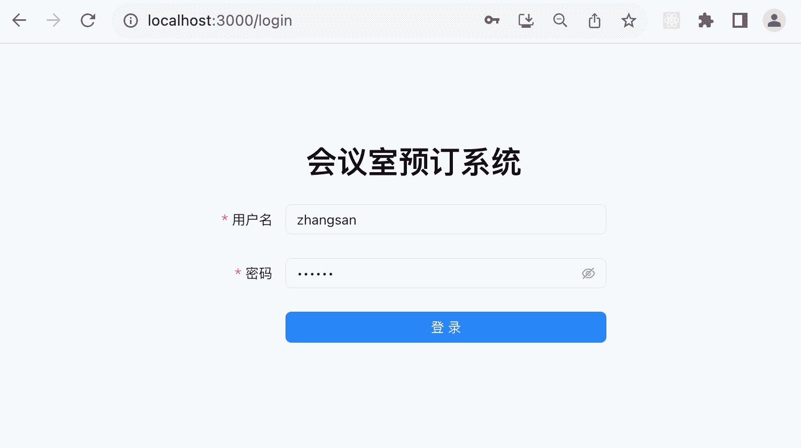

# 119. 会议室预订系统：用户管理模块-- 管理端用户列表页面

前面我们写了用户端的一些页面，这节继续来写管理端的。

涉及到这些页面：


这节我们来写前两个。

先新建个 react 项目：

```
npx create-react-app --template=typescript meeting_room_booking_system_frontend_admin
```


进入项目目录，把开发服务跑起来：

```
npm run start
```
浏览器访问 http://localhost:3000 可以看到这个界面：


就说明 react 项目成功跑起来了。

然后我们添加 router：

```
npm install --save react-router-dom
```
在 index.tsx 加上路由的配置：

```javascript
import ReactDOM from 'react-dom/client';
import './index.css';
import { RouterProvider, createBrowserRouter, Link, Outlet } from 'react-router-dom';

function Index() {
  return <div>index<Outlet></Outlet></div>
}
function ErrorPage() {
  return <div>Error Page</div>
}

function UserManage() {
  return <div>user manage</div>
}

function Login() {
  return <div>login</div>
}

const routes = [
  {
    path: "/",
    element: <Index></Index>,
    errorElement: <ErrorPage />,
    children: [
      {
        path: 'user_manage',
        element: <UserManage/>
      }
    ]
  },
  {
    path: "login",
    element: <Login />,
  }
];
const router = createBrowserRouter(routes);

const root = ReactDOM.createRoot(
  document.getElementById('root') as HTMLElement
);

root.render(<RouterProvider router={router}/>);
```

配置了 4 个路由：

访问 /login 的时候，渲染 Login 组件。

访问 / 的时候，渲染 Index 组件。

访问 /user_manage 的时候，渲染 / 和 user_manage 的二级路由，也就是 Index + UserManage 组件。

以及出错的时候，渲染 ErrorPage 组件。

测试下：


都没问题。

把 src 目录下其余文件去掉：


然后创建 4 个组件：

src/pages/Login/Login.tsx

```javascript
export function Login() {
    return <div>login</div>   
}
```

src/pages/Index/Index.tsx

```javascript
import { Outlet } from "react-router-dom";

export function Index() {
    return <div>Index<Outlet></Outlet></div>   
}
```

src/pages/UserManage/UserManage.tsx
```javascript
export function UserManage() {
    return <div>UserManage</div>
}
```

src/pages/ErrorPage/ErrorPage.tsx

```javascript
export function ErrorPage() {
    return <div>Error Page</div>
}
```
改下 index.tsx 配置对应的路由：


```javascript
import ReactDOM from 'react-dom/client';
import './index.css';
import { RouterProvider, createBrowserRouter, Link, Outlet } from 'react-router-dom';
import { Index } from './pages/Index/Index';
import { ErrorPage } from './pages/ErrorPage/ErrorPage';
import { UserManage } from './pages/UserManage/UserManage';
import { Login } from './pages/Login/Login';

const routes = [
  {
    path: "/",
    element: <Index></Index>,
    errorElement: <ErrorPage />,
    children: [
      {
        path: 'user_manage',
        element: <UserManage/>
      }
    ]
  },
  {
    path: "login",
    element: <Login />,
  }
];
const router = createBrowserRouter(routes);

const root = ReactDOM.createRoot(
  document.getElementById('root') as HTMLElement
);

root.render(<RouterProvider router={router}/>);
```
测试下：


都没啥问题。

然后来写 Login 页面：


引入 Ant Design 组件库：

```
npm install antd --save
```
在 Login 组件引入 DatePicker 组件：

```javascript
import { DatePicker } from "antd";

export function Login() {
    return <div><DatePicker/></div>   
}
```


没啥问题，说明 antd 引入成功了。

然后我们把登录页面写一下：

```javascript
import { Button, Checkbox, Form, Input } from 'antd';
import './login.css';
import { useCallback } from 'react';

interface LoginUser {
    username: string;
    password: string;
}

const layout1 = {
    labelCol: { span: 4 },
    wrapperCol: { span: 20 }
}

export function Login() {

    const onFinish = useCallback((values: LoginUser) => {
        console.log(values);
    }, []);

    return <div id="login-container">
        <h1>会议室预订系统</h1>
        <Form
            {...layout1}
            onFinish={onFinish}
            colon={false}
            autoComplete="off"
        >
            <Form.Item
                label="用户名"
                name="username"
                rules={[{ required: true, message: '请输入用户名!' }]}
            >
                <Input />
            </Form.Item>

            <Form.Item
                label="密码"
                name="password"
                rules={[{ required: true, message: '请输入密码!' }]}
            >
                <Input.Password />
            </Form.Item>

            <Form.Item label=" ">
                <Button className='btn' type="primary" htmlType="submit">
                    登录
                </Button>
            </Form.Item>
        </Form>
    </div>   
}
```

这里和用户端差不多.

login.css 如下：

```css
#login-container {
    width: 400px;
    margin: 100px auto 0 auto;
    text-align: center;
}
#login-container .links {
    display: flex;
    justify-content: space-between;
}
#login-container .btn {
    width: 100%;
}
```
访问 /login，可以看到现在的登录页面：


然后看一下接口文档 http://localhost:3005/api-doc


传入用户名、密码、返回用户信息和 token。

在 postman 里测试下登录接口：


然后在点击登录按钮之后，用 axios 调用它：

安装 axios：

```
npm install axios
```

在前端项目创建个 src/interfaces/interfaces.ts

```javascript
import axios from "axios";

const axiosInstance = axios.create({
    baseURL: 'http://localhost:3005/',
    timeout: 3000
});

export async function login(username: string, password: string) {
    return await axiosInstance.post('/user/admin/login', {
        username, password
    });
}
```

在这里集中管理接口。

然后 onFinish 里调用：

```javascript
const navigate = useNavigate();

const onFinish = useCallback(async (values: LoginUser) => {
    const res = await login(values.username, values.password);

    const { code, message: msg, data} = res.data;
    if(res.status === 201 || res.status === 200) {
        message.success('登录成功');

        localStorage.setItem('access_token', data.accessToken);
        localStorage.setItem('refresh_token', data.refreshToken);
        localStorage.setItem('user_info', JSON.stringify(data.userInfo));

        setTimeout(() => {
            navigate('/');
        }, 1000);
    } else {
        message.error(data || '系统繁忙，请稍后再试');
    }
}, []);
```

这里和用户端一摸一样。

登录下：


提示 400 错误没处理。

因为接口返回 400 的时候，axios 会抛异常：


我们加一个响应的 interceptor，返回 error.response 而不是 Promise.reject(error.response)

```javascript
axiosInstance.interceptors.response.use(
    (response) => {
        return response;
    },
    async (error) => {
        return error.response;
    }
);
```
再测试下：

当用户不存在时：


当密码错误时：


登录成功时：




都没啥问题。

这样，管理员登录的前后端功能就都完成了。

然后是用户管理的页面： 


修改下 Index.tsx

```javascript
import { UserOutlined } from "@ant-design/icons";
import { Outlet } from "react-router-dom";
import './index.css';

export function Index() {
    return <div id="index-container">
        <div className="header">
            <h1>会议室预定系统-后台管理</h1>
            <UserOutlined className="icon"/>
        </div>
        <div className="body">
            <Outlet></Outlet>
        </div>
    </div>
}
```

这里用到了 antd 的 icon 组件，需要安装用到的包：

```
npm install @ant-design/icons --save
```

css 如下：

```css
#index-container{
    height: 100vh;
    display: flex;
    flex-direction: column;
}
#index-container .header{
    height: 80px;
    border-bottom: 1px solid #aaa;
    line-height: 80px;
    display: flex;
    justify-content: space-between;
    padding: 0 20px;
}
#index-container h1{
    margin: 0;
}

#index-container .icon {
    font-size: 40px;
    margin-top: 20px;
}
#index-container .body{
    flex: 1;
}
```

测试下：


没啥问题。

不知道同学们有没有发现，其实这个页面应该是三级路由：


因为左边这部分也是要多个页面共用的。

我们改一下路由配置：

```javascript
const routes = [
  {
    path: "/",
    element: <Index></Index>,
    errorElement: <ErrorPage />,
    children: [
      {
        path: "/",
        element: <Menu></Menu>,
        children: [
          {
            path: 'user_manage',
            element: <UserManage/>
          }
        ]
      }
    ]
  },
  {
    path: "login",
    element: <Login />,
  }
];
```
添加 src/pages/Menu/Menu.tsx

```javascript
import { Outlet } from "react-router-dom";

export function Menu() {
    return <div>
        menu <Outlet></Outlet>
    </div>
}
```

渲染出来是这样的：


我们来写一下 Menu 组件：
```javascript
import { Outlet } from "react-router-dom";
import { Menu as AntdMenu, MenuProps } from 'antd';
import './menu.css';

const items: MenuProps['items'] = [
    {
        key: '1',
        label: "会议室管理"
    },
    {
        key: '2',
        label: "预定管理"
    },
    {
        key: '3',
        label: "用户管理"
    },
    {
        key: '4',
        label: "统计"
    }
];

export function Menu() {
    return <div id="menu-container">
        <div className="menu-area">
            <AntdMenu
                defaultSelectedKeys={['3']}
                items={items}
            />
        </div>
        <div className="content-area">
            <Outlet></Outlet>
        </div>
    </div>
}
```
menu.css 如下：

```css
#menu-container {
    display: flex;
    flex-direction: row;
}
#menu-container .menu-area {
    width: 200px;
}
```
渲染出来是这样的：


然后来写 UserManage 组件：


可以分为 2 部分，上面的搜索表单、下面的结果表格。

我们来写一下：

```javascript
import { Button, Form, Input, Table } from "antd";
import { useCallback } from "react";
import './UserManage.css';

interface SearchUser {
    username: string;
    nickName: string;
    email: string;
}

export function UserManage() {

    const searchUser = useCallback(async (values: SearchUser) => {
        console.log(values);
    }, []);

    return <div id="userManage-container">
        <div className="userManage-form">
            <Form
                onFinish={searchUser}
                name="search"
                layout='inline'
                colon={false}
            >
                <Form.Item label="用户名" name="username">
                    <Input />
                </Form.Item>

                <Form.Item label="昵称" name="nickName">
                    <Input />
                </Form.Item>

                <Form.Item label="邮箱" name="email" rules={[
                    { type: "email", message: '请输入合法邮箱地址!'}
                ]}>
                    <Input/>
                </Form.Item>

                <Form.Item label=" ">
                    <Button type="primary" htmlType="submit">
                        搜索用户
                    </Button>
                </Form.Item>
            </Form>
        </div>
        <div className="userManage-table">
                
        </div>
    </div>
}
```
UserManage.css

```css
#userManage-container {
    padding: 20px;
}
```
先把 form 部分写完。

测试下：


然后再写 table 部分：
```javascript
import { Button, Form, Input, Table } from "antd";
import { useCallback } from "react";
import './UserManage.css';
import { ColumnsType } from "antd/es/table";

interface SearchUser {
    username: string;
    nickName: string;
    email: string;
}

interface UserSearchResult {
    username: string;
    nickName: string;
    email: string;
    headPic: string;
    createTime: Date;
}
const columns: ColumnsType<UserSearchResult> = [
    {
        title: '用户名',
        dataIndex: 'username'
    },
    {
        title: '头像',
        dataIndex: 'headPic'
    },
    {
        title: '昵称',
        dataIndex: 'nickName'
    },
    {
        title: '邮箱',
        dataIndex: 'email'
    },
    {
        title: '注册时间',
        dataIndex: 'createTime'
    }   
];

const data = [
    {
        key: '1',
        username: 'xx',
        headPic: 'xxx.png',
        nickName: 'xxx',
        email: 'xx@xx.com',
        createTime: new Date()
    },
    {
        key: '12',
        username: 'yy',
        headPic: 'yy.png',
        nickName: 'yyy',
        email: 'yy@yy.com',
        createTime: new Date()
    }
]


export function UserManage() {

    const searchUser = useCallback(async (values: SearchUser) => {
        console.log(values);
    }, []);

    return <div id="userManage-container">
        <div className="userManage-form">
            <Form
                onFinish={searchUser}
                name="search"
                layout='inline'
                colon={false}
            >
                <Form.Item label="用户名" name="username">
                    <Input />
                </Form.Item>

                <Form.Item label="昵称" name="nickName">
                    <Input />
                </Form.Item>

                <Form.Item label="邮箱" name="email" rules={[
                    { type: "email", message: '请输入合法邮箱地址!'}
                ]}>
                    <Input/>
                </Form.Item>

                <Form.Item label=" ">
                    <Button type="primary" htmlType="submit">
                        搜索用户
                    </Button>
                </Form.Item>
            </Form>
        </div>
        <div className="userManage-table">
            <Table columns={columns} dataSource={data} pagination={ {
                pageSize: 10
            }}/>
        </div>
    </div>
}
```

渲染出来是这样的：


然后我们调用下搜索接口。

看下接口文档：


在 postman 里调用下：


这个接口是需要登录的。

我们先登录一下：


带上 access_token 再访问：


返回了 8 条数据。

然后我们在页面里调用下：

先把之前写的 axios 的 interceptors 自动添加 authorization 的 header，自动 refresh token 的逻辑拿过来：

```javascript
axiosInstance.interceptors.request.use(function (config) {
    const accessToken = localStorage.getItem('access_token');

    if(accessToken) {
        config.headers.authorization = 'Bearer ' + accessToken;
    }
    return config;
})

axiosInstance.interceptors.response.use(
    (response) => {
        return response;
    },
    async (error) => {
        let { data, config } = error.response;

        if (data.code === 401 && !config.url.includes('/user/admin/refresh')) {
            
            const res = await refreshToken();

            if(res.status === 200 || res.status === 201) {
                return axiosInstance(config);
            } else {
                message.error(res.data);

                setTimeout(() => {
                    window.location.href = '/login';
                }, 1500);
            }
            
        } else {
            return error.response;
        }
    }
)

async function refreshToken() {
    const res = await axiosInstance.get('/user/admin/refresh', {
        params: {
          refresh_token: localStorage.getItem('refresh_token')
        }
    });
    localStorage.setItem('access_token', res.data.access_token);
    localStorage.setItem('refresh_token', res.data.refresh_token);
    return res;
}
```
然后添加一个接口：

```javascript
export async function userSearch(username: string, nickName: string, email: string, pageNo: number, pageSize: number) {
    return await axiosInstance.get('/user/list', {
        params: {
            username,
            nickName,
            email,
            pageNo,
            pageSize
        }
    });
}
```
在页面调用下：

```javascript
const [pageNo, setPageNo] = useState<number>(1);
const [pageSize, setPageSize] = useState<number>(10);
const [userResult, setUserResult] = useState<UserSearchResult[]>();

const searchUser = useCallback(async (values: SearchUser) => {
    const res = await userSearch(values.username,values.nickName, values.email, pageNo, pageSize);

    const { data } = res.data;
    if(res.status === 201 || res.status === 200) {
        setUserResult(data.users.map((item: UserSearchResult) => {
            return {
                key: item.username,
                ...item
            }
        }))
    } else {
        message.error(data || '系统繁忙，请稍后再试');
    }
}, []);
```

使用 useState 创建 pageNo、pageSize、userResult 这三个状态。

请求接口，成功后把数据设置到 userResult。

然后修改下 table 的 dataSource：


测试下：


先登录。

然后访问 http://localhost:3000/user_manage


搜索接口对接成功。

然后再对接下分页：

```javascript
<Table columns={columns} dataSource={userResult} pagination={ {
    current: pageNo,
    pageSize: pageSize,
    onChange: changePage
}}/>
```
设置 pageNo 和 pageSize，并监听 onChange 事件

```javascript
useEffect(() => {
    searchUser({
        username: '',
        email: '',
        nickName: ''
    });
}, [pageNo, pageSize]);

const changePage = useCallback(function(pageNo: number, pageSize: number) {
    setPageNo(pageNo);
    setPageSize(pageSize);
}, []);
```

分页设置改变的时候，设置 pageNo 和 pageSize。

并且 useEffect 监听这两个 state，在变化的时候，重新发送请求。
 
这样，刚进入页面的时候，就会触发一次渲染，并且在分页设置改变时也会触发：


然后修改下 headPic，改为图片：
```javascript
const columns: ColumnsType<UserSearchResult> = [
    {
        title: '用户名',
        dataIndex: 'username'
    },
    {
        title: '头像',
        dataIndex: 'headPic',
        render: value => {
            return value ? <Image
                    width={50}
                    src={`http://localhost:3005/${value}`}
            /> : '';
        }
    },
    {
        title: '昵称',
        dataIndex: 'nickName'
    },
    {
        title: '邮箱',
        dataIndex: 'email'
    },
    {
        title: '注册时间',
        dataIndex: 'createTime'
    }   
];
```
这里用的是 antd 的 Image 组件，有预览的功能：


原型图还有个冻结功能：


看下接口文档：


很简单，就是个 get 接口。

我们在表格里加一列：


```javascript
{
    title: '操作',
    render: (_, record) => (
        <a href="#" onClick={() => {freezeUser(record.id)}}>冻结</a>
    )
}
```
这里用到了 id，我们在类型里加一下：


然后在 interfaces.tsx 添加这个接口：

```javascript
export async function freeze(id: number) {
    return await axiosInstance.get('/user/freeze', {
        params: {
            id
        }
    });
}
```
在组件里创建 freezeUser 方法：

```javascript
async function freezeUser(id: number) {
    const res = await freeze(id);

    const { data } = res.data;
    if(res.status === 201 || res.status === 200) {
        message.success('冻结成功');
    } else {
        message.error(data || '系统繁忙，请稍后再试');
    }
}
```

测试下：


然后我们还要把冻结状态显示出来：

这部分数据是返回了的：


需要添加一列：


```javascript
{
    title: '状态',
    dataIndex: 'isFrozen',
    render: (_, record) => (
        record.isFrozen ? <Badge status="success">已冻结</Badge> : ''
    )
},
```

在类型部分也要添加下：


测试下：


冻结之后，刷新页面，会显示已冻结。

这里我们在冻结之后自动刷新下。

这需要把逻辑移到组件内：

把 columns 移到组件内，用 useMemo 包裹，这样只会创建一次：


freeezeUser 也是：


```javascript
const freezeUser = useCallback(async (id: number) => {
    const res = await freeze(id);

    const { data } = res.data;
    if(res.status === 201 || res.status === 200) {
        message.success('冻结成功');
    } else {
        message.error(data || '系统繁忙，请稍后再试');
    }
}, []);
```
添加一个 num 的 state，冻结之后设置一个随机值：


把它添加到 useEffect 的依赖里，这样就能触发重新搜索：


测试下：


但其实现在这个重新搜索有问题：


我搜索之后再冻结，然后刷新就丢失了搜索条件了。

这里需要搜索的时候带上当前的条件：

用 useForm 拿到 form 的 api：


然后在搜索的时候拿到最新的表单值：


```javascript
useEffect(() => {
    searchUser({
        username: form.getFieldValue('username'),
        email: form.getFieldValue('email'),
        nickName: form.getFieldValue('nickName')
    });
}, [pageNo, pageSize, num]);
```
这样就可以了：


这样，用户管理页面就写完了。
 
全部代码如下：

```javascript
import { Badge, Button, Form, Image, Input, Table, message } from "antd";
import { useCallback, useEffect, useMemo, useState } from "react";
import './UserManage.css';
import { ColumnsType } from "antd/es/table";
import { freeze, userSearch } from "../../interfaces/interfaces";
import { useForm } from "antd/es/form/Form";

interface SearchUser {
    username: string;
    nickName: string;
    email: string;
}

interface UserSearchResult {
    id: number,
    username: string;
    nickName: string;
    email: string;
    headPic: string;
    createTime: Date;
    isFrozen: boolean;
}


export function UserManage() {
    const [pageNo, setPageNo] = useState<number>(1);
    const [pageSize, setPageSize] = useState<number>(10);
    const [userResult, setUserResult] = useState<UserSearchResult[]>();
    const [num, setNum] = useState(0);

    const columns: ColumnsType<UserSearchResult> = useMemo(() => [
        {
            title: '用户名',
            dataIndex: 'username'
        },
        {
            title: '头像',
            dataIndex: 'headPic',
            render: value => {
                return value ? <Image
                        width={50}
                        src={`http://localhost:3005/${value}`}
                /> : '';
            }
        },
        {
            title: '昵称',
            dataIndex: 'nickName'
        },
        {
            title: '邮箱',
            dataIndex: 'email'
        },
        {
            title: '注册时间',
            dataIndex: 'createTime'
        },
        {
            title: '状态',
            dataIndex: 'isFrozen',
            render: (_, record) => (
                record.isFrozen ? <Badge status="success">已冻结</Badge> : ''
            )
        },
        {
            title: '操作',
            render: (_, record) => (
                <a href="#" onClick={() => {freezeUser(record.id)}}>冻结</a>
            )
        }
    ], []);
    
    const freezeUser = useCallback(async (id: number) => {
        const res = await freeze(id);
    
        const { data } = res.data;
        if(res.status === 201 || res.status === 200) {
            message.success('冻结成功');
            setNum(Math.random())
        } else {
            message.error(data || '系统繁忙，请稍后再试');
        }
    }, []);

    const searchUser = useCallback(async (values: SearchUser) => {
        const res = await userSearch(values.username,values.nickName, values.email, pageNo, pageSize);

        const { data } = res.data;
        if(res.status === 201 || res.status === 200) {
            setUserResult(data.users.map((item: UserSearchResult) => {
                return {
                    key: item.username,
                    ...item
                }
            }))
        } else {
            message.error(data || '系统繁忙，请稍后再试');
        }
    }, []);

    const [form ]  = useForm();

    useEffect(() => {
        searchUser({
            username: form.getFieldValue('username'),
            email: form.getFieldValue('email'),
            nickName: form.getFieldValue('nickName')
        });
    }, [pageNo, pageSize, num]);

    const changePage = useCallback(function(pageNo: number, pageSize: number) {
        setPageNo(pageNo);
        setPageSize(pageSize);
    }, []);


    return <div id="userManage-container">
        <div className="userManage-form">
            <Form
                form={form}
                onFinish={searchUser}
                name="search"
                layout='inline'
                colon={false}
            >
                <Form.Item label="用户名" name="username">
                    <Input />
                </Form.Item>

                <Form.Item label="昵称" name="nickName">
                    <Input />
                </Form.Item>

                <Form.Item label="邮箱" name="email" rules={[
                    { type: "email", message: '请输入合法邮箱地址!'}
                ]}>
                    <Input/>
                </Form.Item>

                <Form.Item label=" ">
                    <Button type="primary" htmlType="submit">
                        搜索用户
                    </Button>
                </Form.Item>
            </Form>
        </div>
        <div className="userManage-table">
            <Table columns={columns} dataSource={userResult} pagination={ {
                current: pageNo,
                pageSize: pageSize,
                onChange: changePage
            }}/>
        </div>
    </div>
}
```
案例代码上传了[小册仓库](https://github.com/QuarkGluonPlasma/nestjs-course-code/tree/main/meeting_room_booking_system_frontend_admin)。

## 总结

这节我们实现了管理端的登录和用户管理页面。

和用户端的一样，都是通过 axios interceptor 自动添加 header 和自动 refresh token。

这里涉及到三级路由，第一级展示上面的 header，第二级展示左侧的 menu，第三级才是具体的页面。

使用 table 组件来渲染列表，通过 useEffect 在 pageNo、pageSize 改变的时候自动重发请求。

这样，这两个页面的前后端代码都完成了。
