# 121. 会议室预订系统：会议室管理模块-后端开发

用户相关的功能，后端代码、用户端前端代码、管理端前端代码都写完了。

这节我们开始写下一个模块：会议室管理。

看下当时分析的需求：

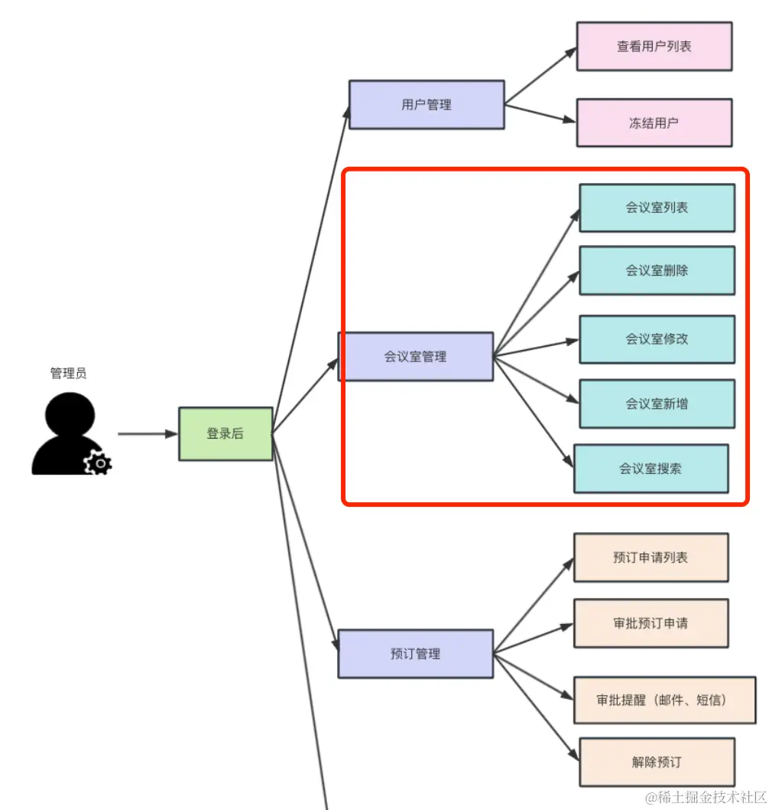

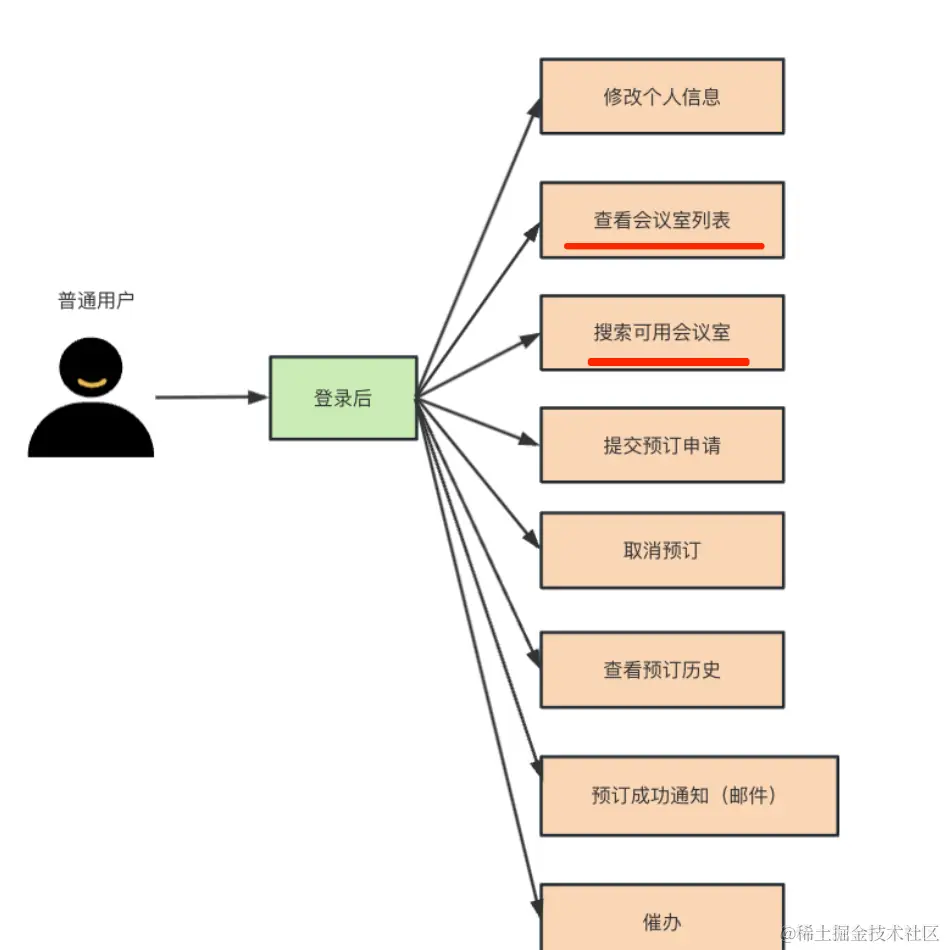

以及我们分析出来的接口：

| 接口路径 | 请求方式 | 描述 |
| -- | -- | -- |
| /meeting_room/list | GET | 会议室列表 |
| /meeting_room/delete/:id | DELETE | 会议室删除 |
| /meeting_room/update/:id | PUT |会议室更新|
| /meeting_room/create | POST |会议室新增|
| /meeting_room/search | GET |会议室搜索|

一共 5 个接口。

在后端项目下创建一个 meeting-room 模块：

```
nest g resource meeting-room
```
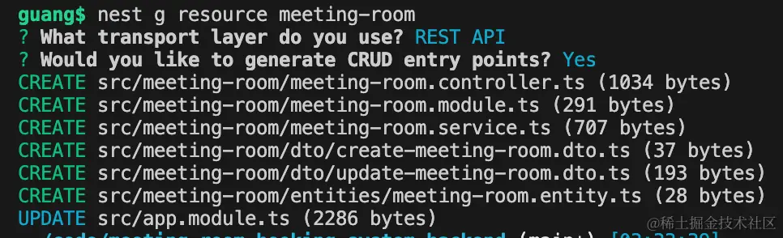

修改下 meeting-room.entity.ts

```javascript
import { Column, CreateDateColumn, Entity, PrimaryGeneratedColumn, UpdateDateColumn } from "typeorm";

@Entity()
export class MeetingRoom {
    
    @PrimaryGeneratedColumn({
        comment: '会议室ID'
    })
    id: number;

    @Column({
        length: 50,
        comment: '会议室名字'
    })
    name: string;

    @Column({
        comment: '会议室容量'
    })
    capacity: number;

    @Column({
        length: 50,
        comment: '会议室位置'
    })
    location: string;

    @Column({
        length: 50,
        comment: '设备',
        default: ''
    })
    equipment: string;

    @Column({
        length: 100,
        comment: '描述',
        default: ''
    })
    description: string;

    @Column({
        comment: '是否被预订',
        default: false
    })
    isBooked: boolean;

    @CreateDateColumn({
        comment: '创建时间'
    })
    createTime: Date;

    @UpdateDateColumn({
        comment: '更新时间'
    })
    updateTime: Date;
}
```
这个是根据当时我们的数据库设计来的：

| 字段名 | 数据类型 | 描述 |
| --- | --- | --- |
| id | INT | 会议室ID |
| name | VARCHAR(50) |会议室名字 |
| capacity | INT |会议室容量 |
| location | VARCHAR(50) |会议室位置 |
| equipment | VARCHAR(50) | 设备 |
| description | VARCHAR(100) | 描述 |
| is_booked | BOOLEAN | 是否被预订 |
| create_time | DATETIME | 创建时间 |
| update_time | DATETIME | 更新时间 |

在 entities 里引入下：

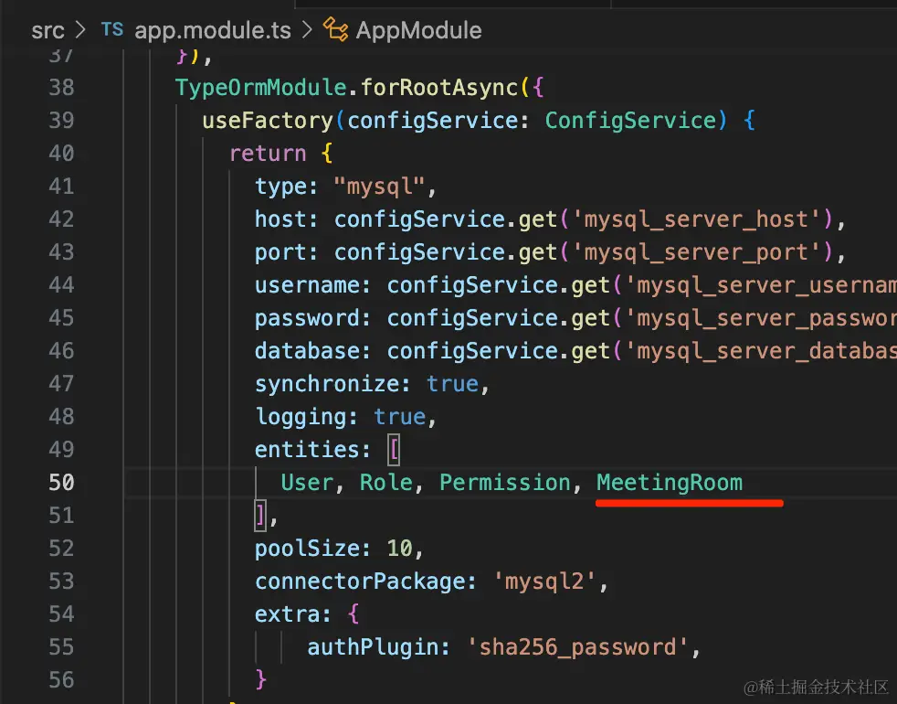

把服务跑起来：

```
npm run start:dev
```
会生成建表语句：

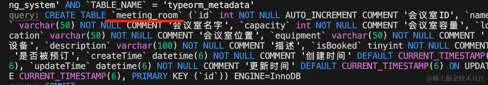

在 mysql workbench 里点击刷新就可以看到这个表：

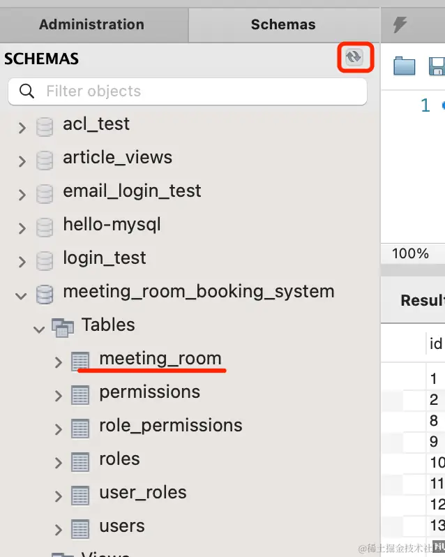

点击第二个图标，查看表定义：

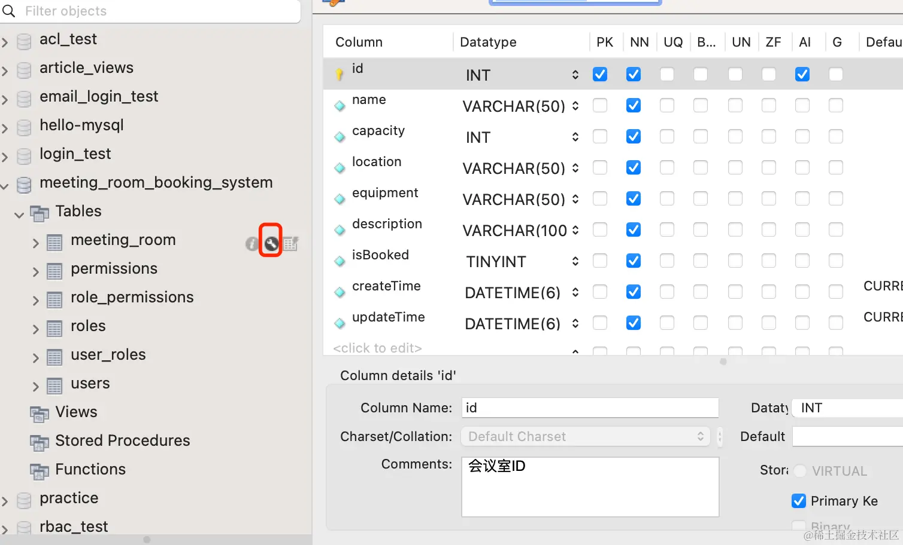

没啥问题。

然后我们先来初始化下数据：

在 MeetingRoomModule 引入 MeetingRoom 的 Repository：

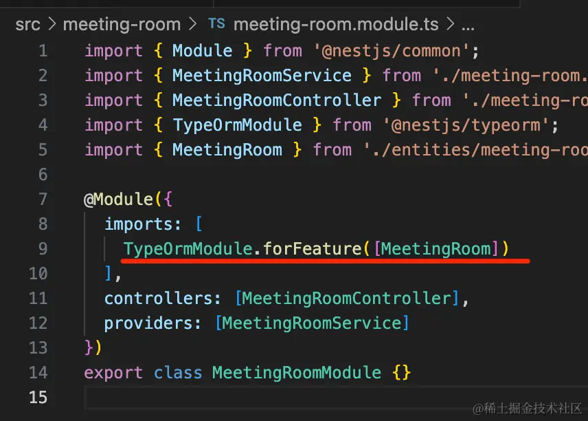

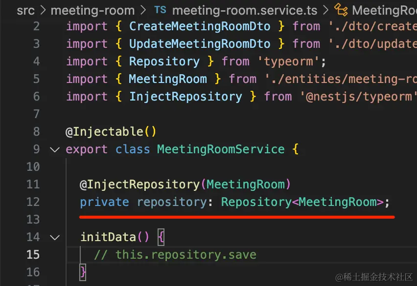

```javascript
@InjectRepository(MeetingRoom)
private repository: Repository<MeetingRoom>;

initData() {
}
```
然后来写初始化数据的逻辑：

```javascript
initData() {
    const room1 = new MeetingRoom();
    room1.name = '木星';
    room1.capacity = 10;
    room1.equipment = '白板';
    room1.location = '一层西';

    const room2 = new MeetingRoom();
    room2.name = '金星';
    room2.capacity = 5;
    room2.equipment = '';
    room2.location = '二层东';

    const room3 = new MeetingRoom();
    room3.name = '天王星';
    room3.capacity = 30;
    room3.equipment = '白板，电视';
    room3.location = '三层东';

    this.repository.save([room1, room2, room3])
}
```
还需要像 user 模块那样，添加一个 init-data 的路由，浏览器访问么？

不用，可以用 repl 的模式来跑：

添加 src/repl.ts

```javascript
import { repl } from '@nestjs/core';
import { AppModule } from './app.module';

async function bootstrap() {
    const replServer = await repl(AppModule);
    replServer.setupHistory(".nestjs_repl_history", (err) => {
        if (err) {
            console.error(err);
        }
    });
}
bootstrap();
```
然后在 package.json 里添加一个 scripts

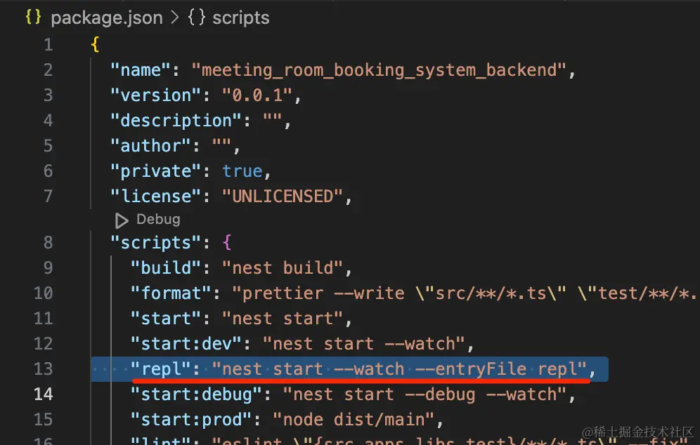

```
"repl": "nest start --watch --entryFile repl",
```
把服务停掉，执行：

```
npm run repl
```
先查看下 MeetingRoomService 的方法：
```
methods(MeetingRoomService)
```
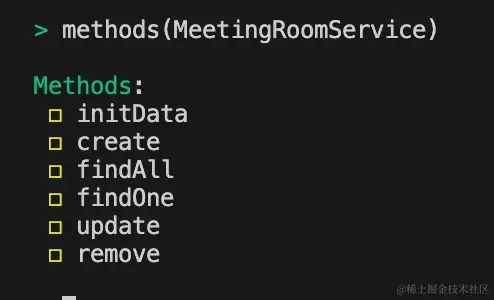

然后调用下：

```
get(MeetingRoomService).initData()
```
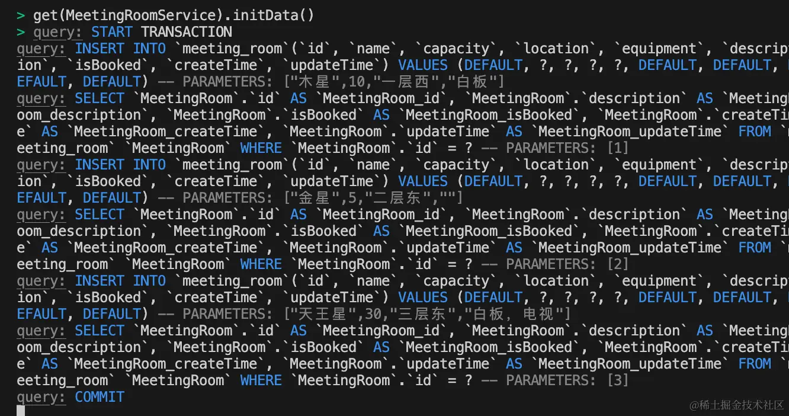

打印了 3 条 insert 语句，之后又把它 select 出来返回：

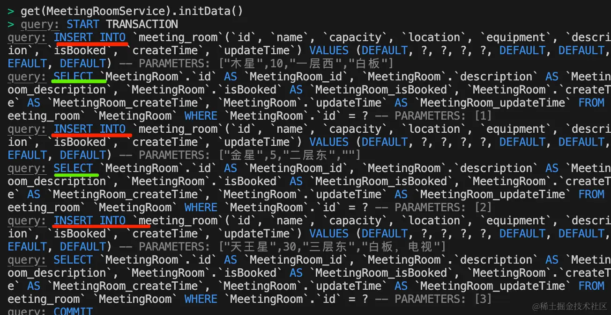

数据库里也可以看到插入的三条数据：

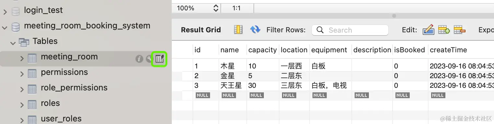

我们很多地方都是用的 repository.save，但如果你确定是 insert 或者 update 的时候，直接用 repository.insert  或者 repository.update 更好。

先 truncate table 清空数据：

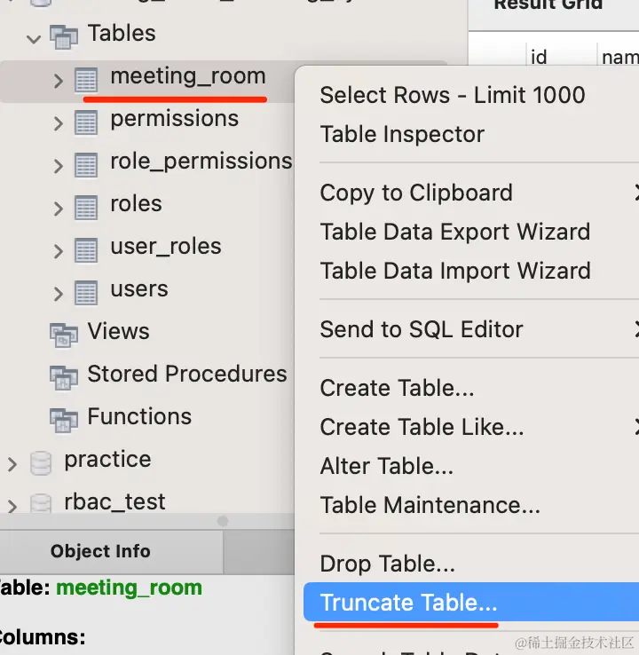

刷新可以看到，确实清空了：

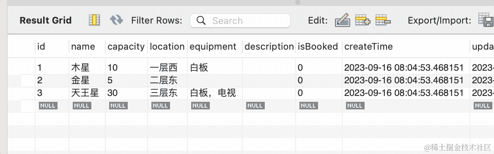

把 save 换成 insert：

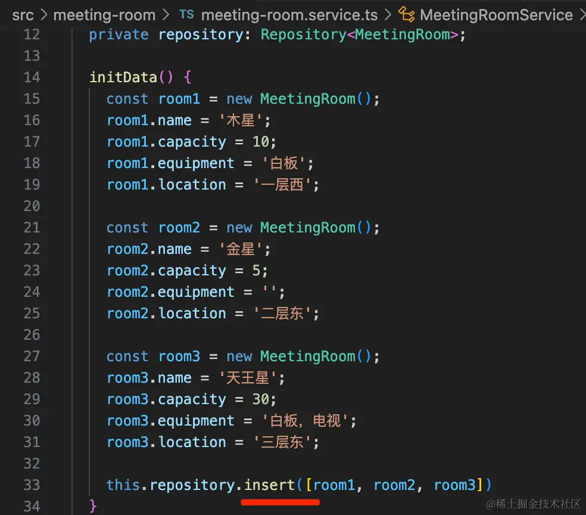

重新跑一下：
```
get(MeetingRoomService).initData()
```
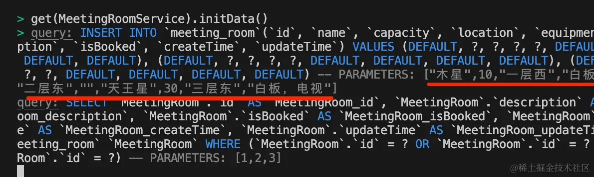

现在是批量插入了 3 条数据。

所以说确定是 insert 的时候 用 insert 比用 save 更好，能够批量插入数据。

同理，确定是 update 的时候，也不要用 save，因为它会先 select 一次，再确定是 udpate 还是 insert。

然后我们写一下 CRUD 的接口：

| 接口路径 | 请求方式 | 描述 |
| -- | -- | -- |
| /meeting_room/list | GET | 会议室列表 |
| /meeting_room/delete/:id | DELETE | 会议室删除 |
| /meeting_room/update/:id | PUT |会议室更新|
| /meeting_room/create | POST |会议室新增|
| /meeting_room/search | GET |会议室搜索|

在 MeetingRoomtController 增加一个 list 接口：

```javascript
import { Controller, Get, Post, Body, Patch, Param, Delete, Query, DefaultValuePipe } from '@nestjs/common';
import { MeetingRoomService } from './meeting-room.service';
import { generateParseIntPipe } from 'src/utils';

@Controller('meeting-room')
export class MeetingRoomController {
  constructor(private readonly meetingRoomService: MeetingRoomService) {}

  @Get('list')
  async list(
    @Query('pageNo', new DefaultValuePipe(1), generateParseIntPipe('pageNo')) pageNo: number,
    @Query('pageSize', new DefaultValuePipe(2), generateParseIntPipe('pageSize')) pageSize: number,
  ) {
    return await this.meetingRoomService.find(pageNo, pageSize);
  }
}
```

然后在 MeetingRoomService 添加 find 方法：
```javascript
async find(pageNo: number, pageSize: number) {
    if(pageNo < 1) {
      throw new BadRequestException('页码最小为 1');
    }
    const skipCount = (pageNo - 1) * pageSize;

    const [meetingRooms, totalCount] = await this.repository.findAndCount({
        skip: skipCount,
        take: pageSize
    });

    return {
        meetingRooms,
        totalCount
    }
}
```
重新跑下服务：

```
npm run start:dev
```
测试下：

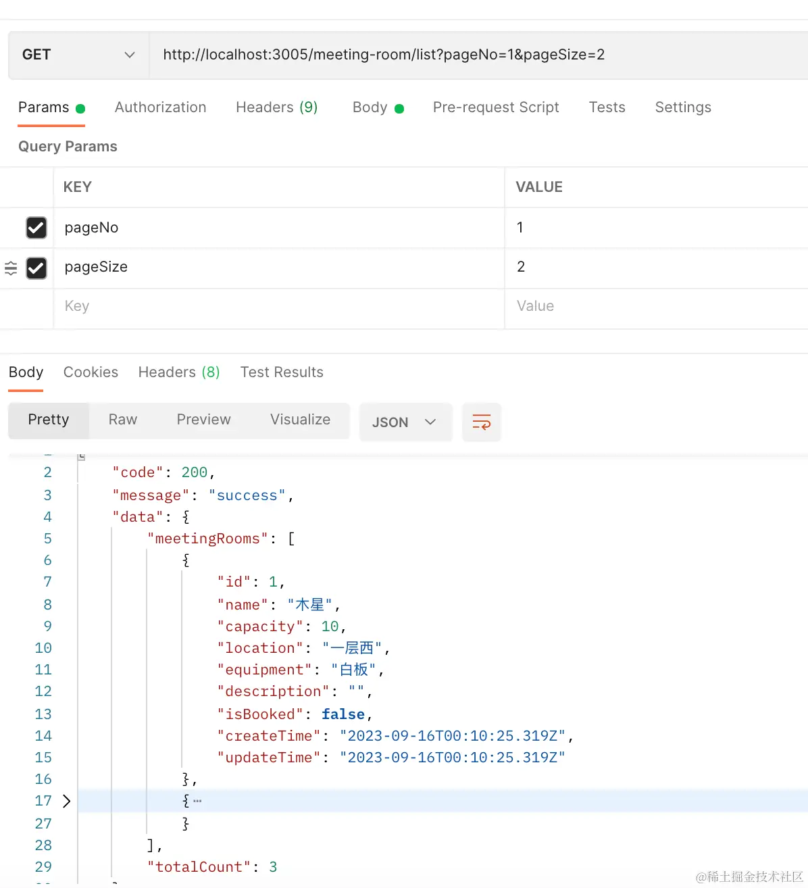

没啥问题。

然后是 create 接口：

```javascript
@Post('create')
async create(@Body() meetingRoomDto: CreateMeetingRoomDto) {
    return await this.meetingRoomService.create(meetingRoomDto);
}
```

修改下 create-meeting-room.dto.ts
```javascript
import { IsNotEmpty, MaxLength } from "class-validator";

export class CreateMeetingRoomDto {

    @IsNotEmpty({
        message: '会议室名称不能为空'
    })
    @MaxLength(10, {
        message: '会议室名称最长为 10 字符'
    })
    name: string;

    @IsNotEmpty({
        message: '容量不能为空'
    })
    capacity: number;

    @IsNotEmpty({
        message: '位置不能为空'
    })
    @MaxLength(50, {
        message: '位置最长为 50 字符'
    })
    location: string;

    @IsNotEmpty({
        message: '设备不能为空'
    })
    @MaxLength(50, {
        message: '设备最长为 50 字符'
    })
    equipment: string;

    @IsNotEmpty({
        message: '描述不能为空'
    })
    @MaxLength(100, {
        message: '描述最长为 100 字符'
    })
    description: string;

}
```
 
在 MeetingRoomService 里添加 create 方法：

```javascript
async create(meetingRoomDto: CreateMeetingRoomDto) {
    return await this.repository.insert(meetingRoomDto);
}
```
测试下：

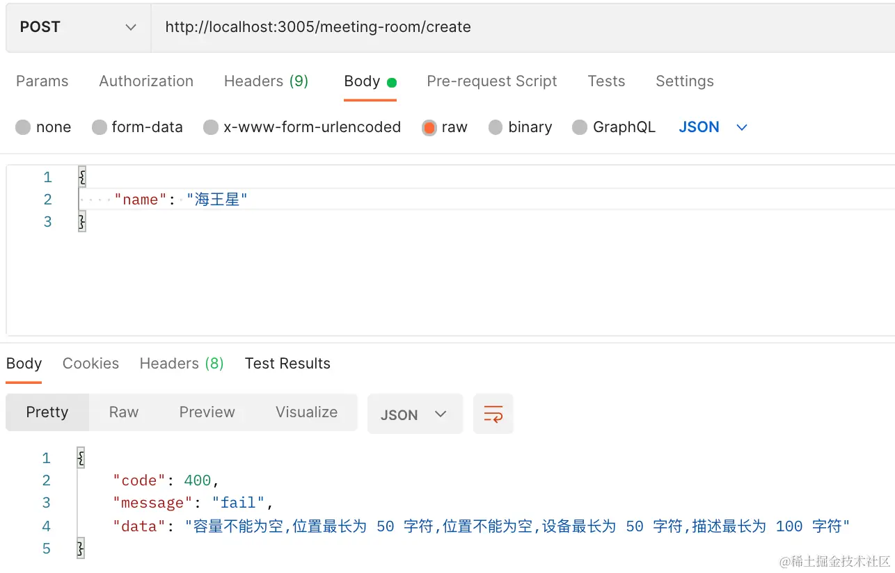

这个错误的格式是我们在 exception filter 里自定义的。

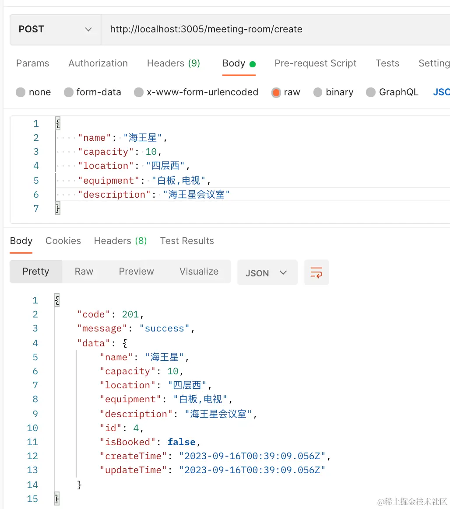

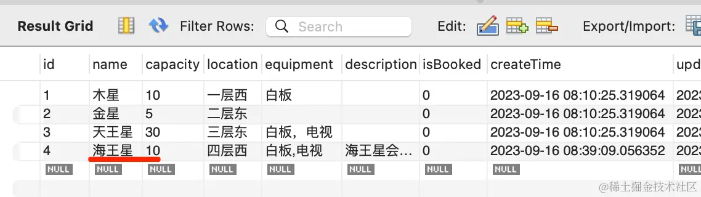

创建成功时会返回创建成功的会议室信息。

这个会议室名其实应该保持唯一，我们加一下校验逻辑：
```javascript
async create(meetingRoomDto: CreateMeetingRoomDto) {
    const room = await this.repository.findOneBy({
      name: meetingRoomDto.name
    });

    if(room) {
      throw new BadRequestException('会议室名字已存在');
    }

    return await this.repository.save(meetingRoomDto);
}
```

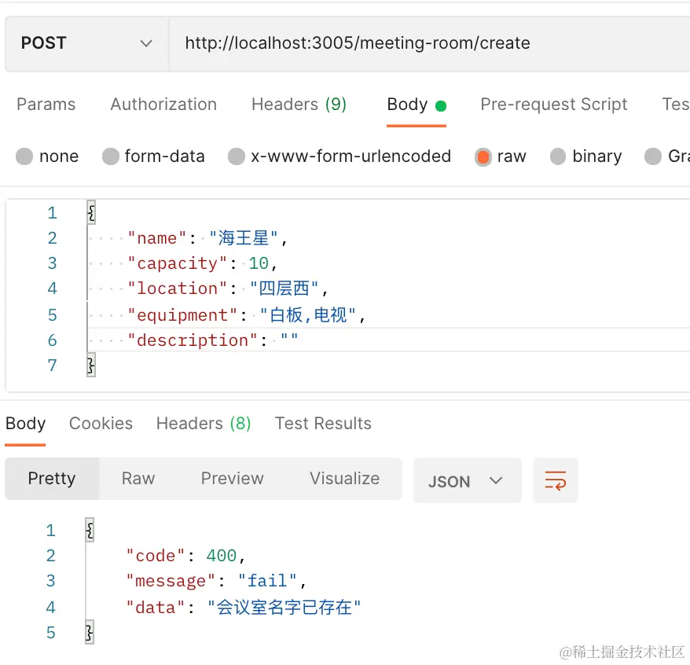

这样就能保证会议室名字不会重复。

然后实现下 update 接口：

```javascript
@Put('update')
async update(@Body() meetingRoomDto: UpdateMeetingRoomDto) {
    return await this.meetingRoomService.update(meetingRoomDto);
}
```

这里的 UpdateMeetingRoomDto 和 CreateMeetingRoomDto 差不多，我们用 PartialType 来复用它的字段：

```javascript
import { ApiProperty, PartialType } from '@nestjs/swagger';
import { CreateMeetingRoomDto } from './create-meeting-room.dto';
import { IsNotEmpty } from 'class-validator';

export class UpdateMeetingRoomDto extends PartialType(CreateMeetingRoomDto) {

    @ApiProperty()
    @IsNotEmpty({
        message: 'id 不能为空'
    })
    id: number;
}

```

然后在 MeetingRoomService 实现 update 方法：

```javascript
async update(meetingRoomDto: UpdateMeetingRoomDto) {
    const meetingRoom = await this.repository.findOneBy({
      id: meetingRoomDto.id
    })

    if(!meetingRoom) {
      throw new BadRequestException('会议室不存在');
    }

    meetingRoom.capacity = meetingRoomDto.capacity;
    meetingRoom.location = meetingRoomDto.location;
    meetingRoom.name = meetingRoomDto.name;

    if(meetingRoomDto.description) {
      meetingRoom.description = meetingRoomDto.description;
    }
    if(meetingRoomDto.equipment) {
      meetingRoom.equipment = meetingRoomDto.equipment;
    }

    await this.repository.update({
      id: meetingRoom.id
    } , meetingRoom);
    return 'success';
}
```
先查询一下，如果查不到就返回会议室不存在。

否则，更新会议室信息。

这里的 description 和 equipment 因为可以不传，所以要判断下，传了才更新。

测试下：

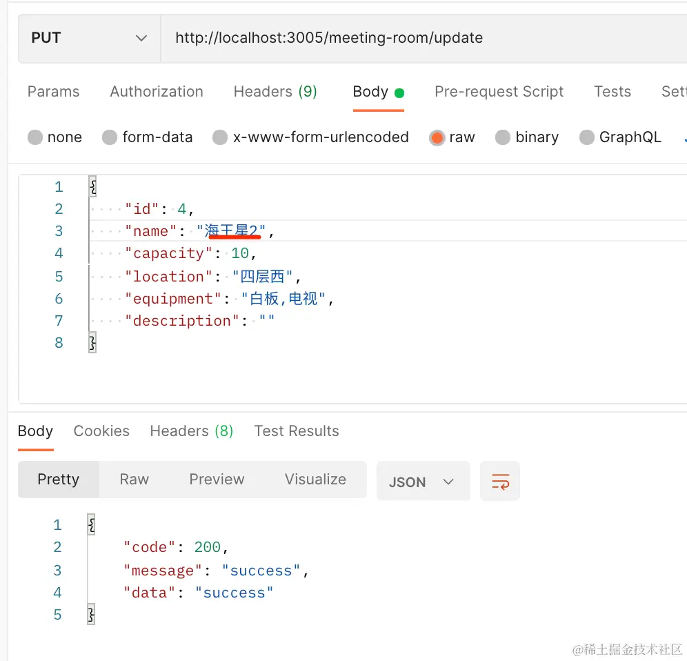

服务端打印了 select 和 update 的 sql：

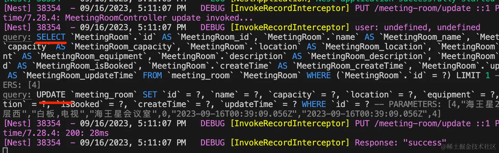

数据库中也更新了：

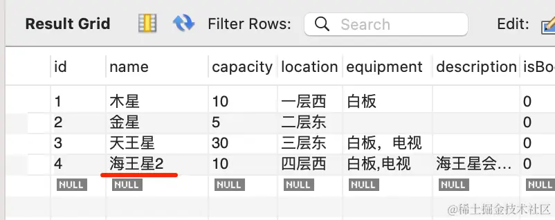

然后还需要一个回显的接口，用在修改的时候回显数据：

添加一个 :id 接口：

```javascript
@Get(':id')
async find(@Param('id') id: number) {
    return await this.meetingRoomService.findById(id);
}
```

然后在 service 实现这个方法：

```javascript
async findById(id: number) {
    return this.repository.findOneBy({
      id
    }); 
}
```
测试下：

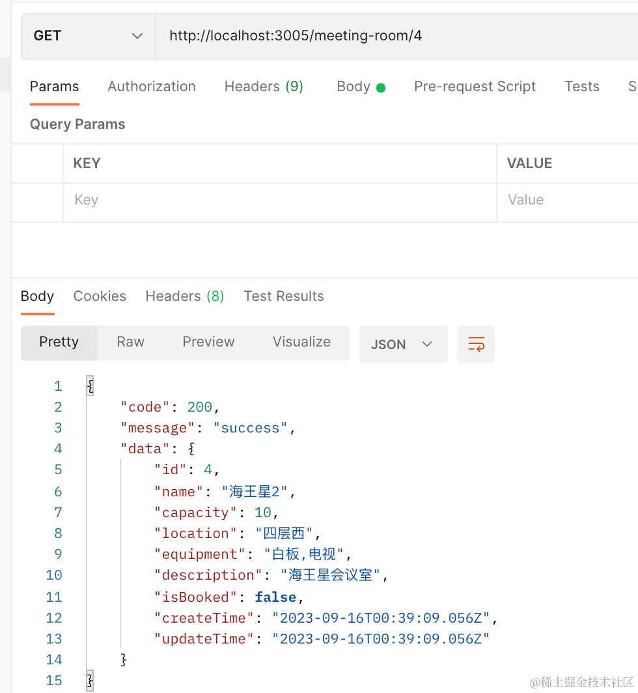

然后是 delete 接口：

```javascript
@Delete(':id')
async delete(@Param('id') id: number) {
    return await this.meetingRoomService.delete(id);
}
```
在 service 实现 delete 方法：

```javascript
@InjectEntityManager()
entityManager: EntityManager;

async delete(id: number) {
    const bookings = await this.entityManager.findBy(Booking, {
      room: {
        id: id
      }
    });

    for(let i = 0; i< bookings.length; i++) {
      this.entityManager.delete(Booking, bookings[i].id);
    }
    await this.repository.delete(id);
    return 'success';
}

```
注意，因为 booking 表关联了 meeting-room 表，有外键约束，所以要删除所有的预定之后再去删除会议室。

测试下：

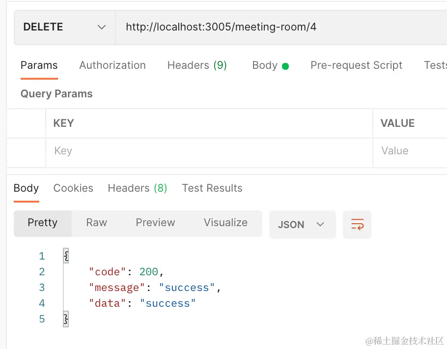

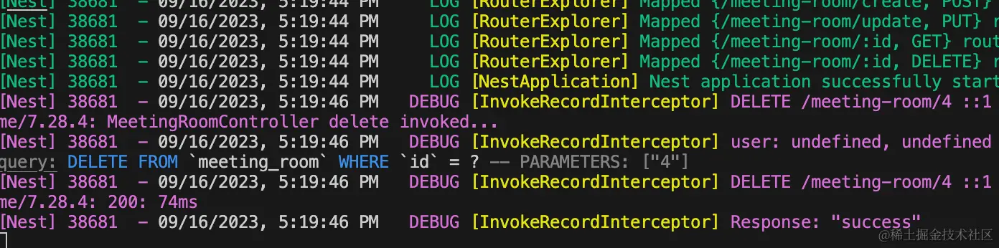

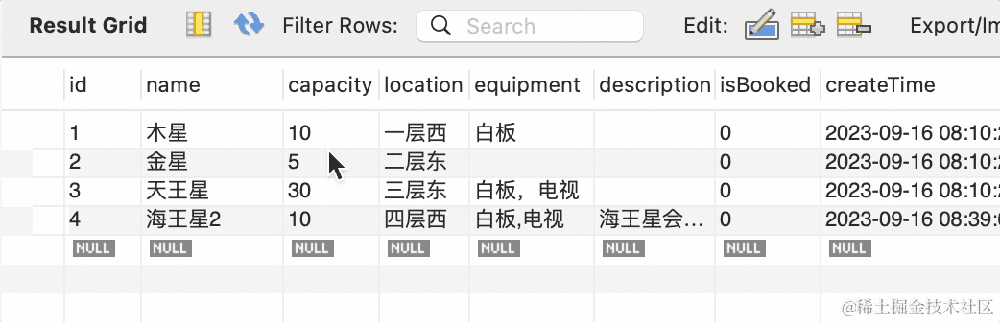

确实删除了。

最后，还有个搜索接口：

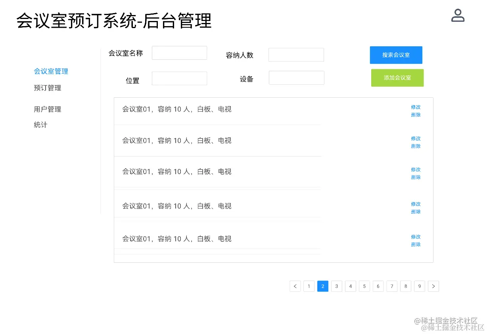

我们没必要单独新建个接口，直接改下 list 接口就行：

```javascript
@Get('list')
async list(
    @Query('pageNo', new DefaultValuePipe(1), generateParseIntPipe('pageNo')) pageNo: number,
    @Query('pageSize', new DefaultValuePipe(2), generateParseIntPipe('pageSize')) pageSize: number,
    @Query('name') name: string,
    @Query('capacity') capacity: number,
    @Query('equipment') equipment: string
) {
    return await this.meetingRoomService.find(pageNo, pageSize, name, capacity, equipment);
}
```
添加 3 个参数。

service 里的 find 方法也要添加 3 个参数：

```javascript
async find(pageNo: number, pageSize: number, name: string, capacity: number, equipment: string) {
    if(pageNo < 1) {
      throw new BadRequestException('页码最小为 1');
    }
    const skipCount = (pageNo - 1) * pageSize;

    const condition: Record<string, any> = {};

    if(name) {
        condition.name = Like(`%${name}%`);   
    }
    if(equipment) {
        condition.equipment = Like(`%${equipment}%`); 
    }
    if(capacity) {
        condition.capacity = capacity;
    }

    const [meetingRooms, totalCount] = await this.repository.findAndCount({
        skip: skipCount,
        take: pageSize,
        where: condition
    });

    return {
        meetingRooms,
        totalCount
    }
}
```

如果传了这三个参数，就添加查询的 where 条件。

测试下：

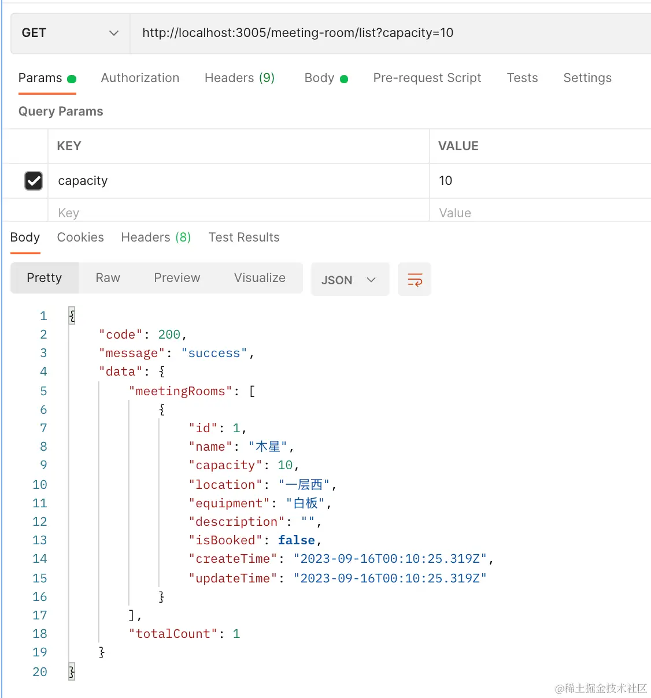

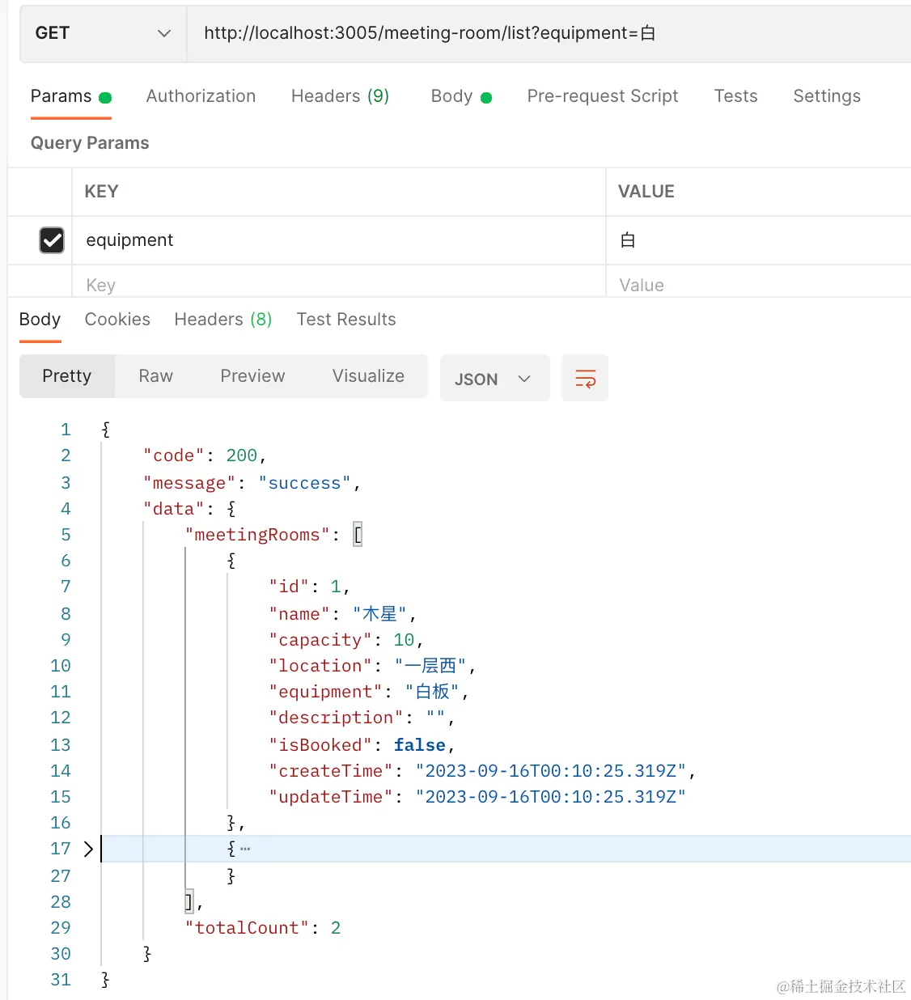

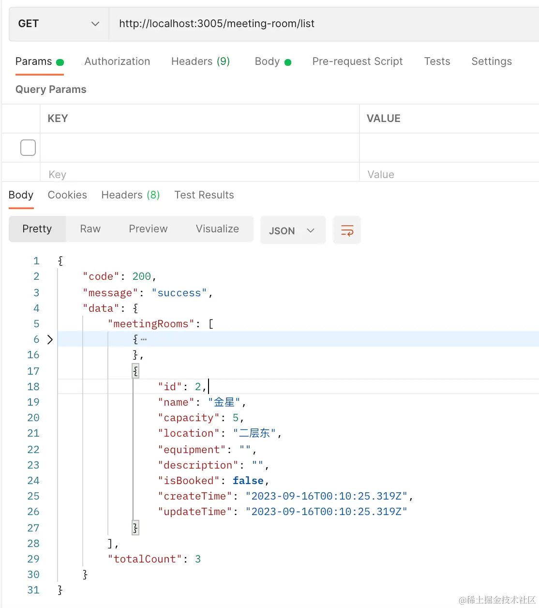

没啥问题。

这样，会议室管理模块的接口就写完了。

案例代码上传了[小册仓库](https://github.com/QuarkGluonPlasma/nestjs-course-code/tree/main/meeting_room_booking_system_backend)。
## 总结

这节，我们实现了会议室管理模块。

首先添加了 entity，然后实现了 CRUD 方法。

其中，我们在 list 接口实现了分页和搜索。

这些接口我们在用户模块都写过。

其实很多模块的功能都是差不多的，都是 CRUD 的复合。
