# 124. 会议室预订系统：预定管理模块-后端开发

这节我们来实现预定管理模块的后端。

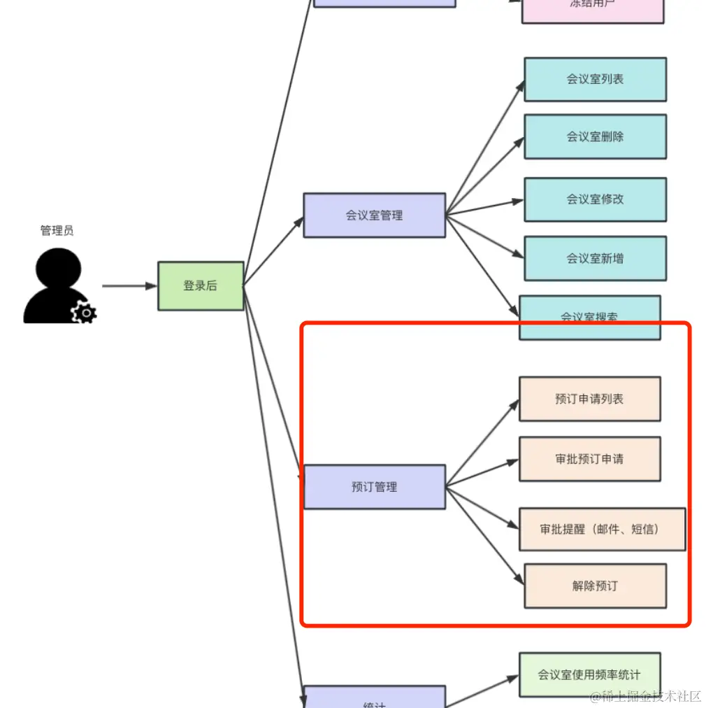

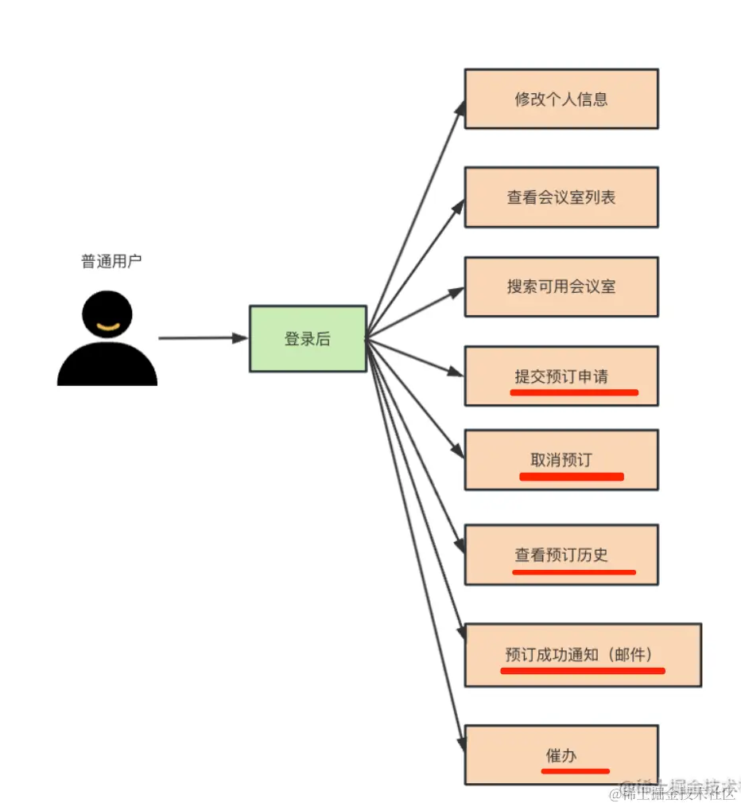

涉及到这些接口：

| 接口路径 | 请求方式 | 描述 |
| -- | -- | -- |
| /booking/list | GET | 预订列表 |
| /booking/approve | POST| 审批预订申请 |
| /booking/add | POST |申请预订|
| /booking/apply/:id | GET |通过预订|
| /booking/reject/:id | GET |取消预订|
| /booking/unbind/:id | GET |解除预订|
| /booking/history | GET|预订历史 |
| /booking/urge | GET |催办 |

我们来写一下。

先创建 Booking 的 entity。

在后端项目下创建一个 meeting-room 模块：

```
nest g resource booking
```
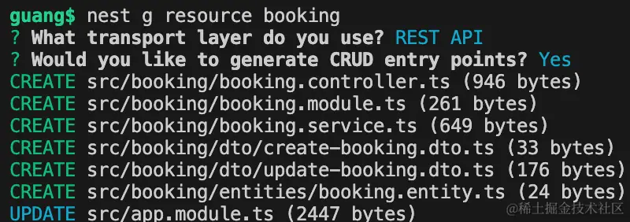

然后修改 booking.entity.ts

根据当时设计的表来写：

| 字段名 | 数据类型 | 描述 |
| --- | --- | --- |
| id | INT | 预订ID |
| user_id | INT |预订用户ID |
| room_id | INT |会议室ID |
| start_time | DATETIME | 会议开始时间 |
| end_time | DATETIME | 会议结束时间 |
| status | VARCHAR(20) | 状态（申请中、审批通过、审批驳回、已解除） |
| note | VARCHAR(100) | 备注 |
| create_time | DATETIME | 创建时间 |
| update_time | DATETIME | 更新时间 |

```javascript
import { MeetingRoom } from "src/meeting-room/entities/meeting-room.entity";
import { User } from "src/user/entities/user.entity";
import { Column, CreateDateColumn, Entity, JoinColumn, ManyToOne, PrimaryGeneratedColumn, UpdateDateColumn } from "typeorm";

@Entity()
export class Booking {

    @PrimaryGeneratedColumn()
    id: number;

    @Column({
        comment: '会议开始时间'
    })
    startTime: Date;

    @Column({
        comment: '会议结束时间'
    })
    endTime: Date;

    @Column({
        length: 20,
        comment: '状态（申请中、审批通过、审批驳回、已解除）',
        default: '申请中'
    })
    status: string;

    @Column({
        length: 100,
        comment: '备注',
        default: ''
    })
    note: string;

    @ManyToOne(() => User)
    user: User;

    @ManyToOne(() => MeetingRoom)
    room: MeetingRoom;

    @CreateDateColumn({
        comment: '创建时间'
    })
    createTime: Date;

    @UpdateDateColumn({
        comment: '更新时间'
    })
    updateTime: Date;
}
```

这里 Booking 和 User、MeetingRoom 是多对一的关系：


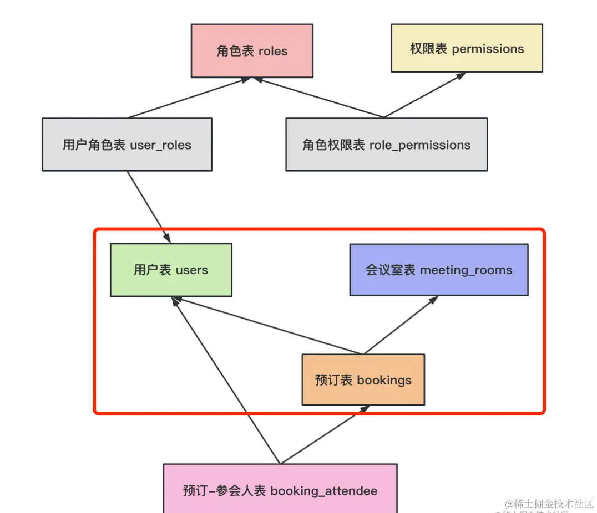

我们在 entities 引入：

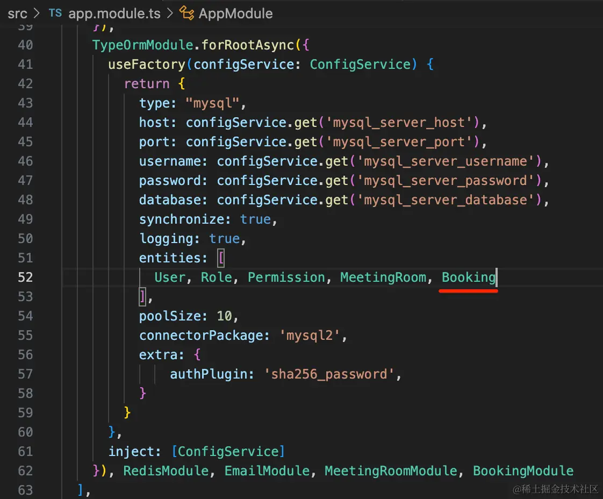

typeorm 会自动建表和创建外键：

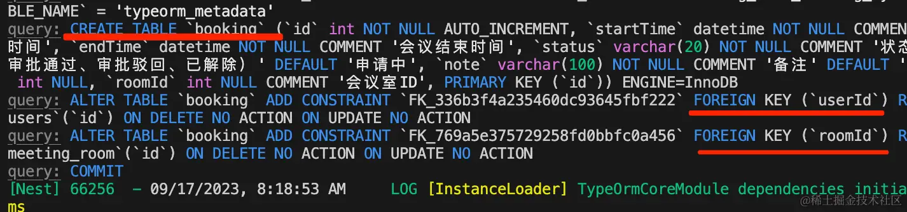

在 mysql workbench 里可以看到这个表：

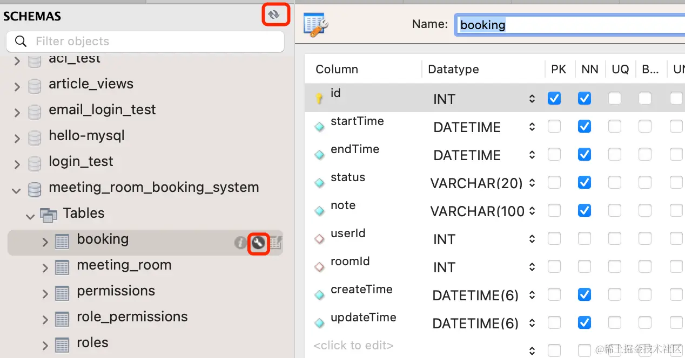

这两个外键都是 restrict 的约束：

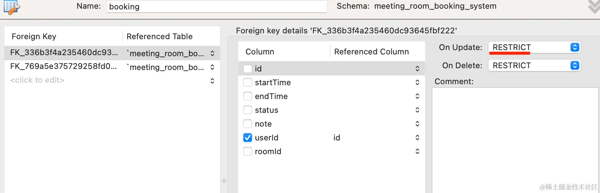

restrict 是只有从表没有相关记录，才可以删除主表记录。

但我们会议室是支持删除的，怎么办呢？

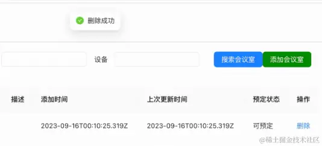

可以在删除失败时提示有预定记录，然后手动取消预订后再删除。

这个后面再处理。

我们先插入一些数据：

在 BookingService 增加一个 initData 方法：

```javascript
@InjectEntityManager()
private entityManager: EntityManager;

async initData() {
    const user1 = await this.entityManager.findOneBy(User, {
      id: 1
    });
    const user2 = await this.entityManager.findOneBy(User, {
      id: 2
    });

    const room1 = await this.entityManager.findOneBy(MeetingRoom, {
      id: 3
    });
    const room2 = await await this.entityManager.findOneBy(MeetingRoom, {
      id: 6
    });

    const booking1 = new Booking();
    booking1.room = room1;
    booking1.user = user1;
    booking1.startTime = new Date();
    booking1.endTime = new Date(Date.now() + 1000 * 60 * 60);

    await this.entityManager.save(Booking, booking1);

    const booking2 = new Booking();
    booking2.room = room2;
    booking2.user = user2;
    booking2.startTime = new Date();
    booking2.endTime = new Date(Date.now() + 1000 * 60 * 60);

    await this.entityManager.save(Booking, booking2);

    const booking3 = new Booking();
    booking3.room = room1;
    booking3.user = user2;
    booking3.startTime = new Date();
    booking3.endTime = new Date(Date.now() + 1000 * 60 * 60);

    await this.entityManager.save(Booking, booking3);

    const booking4 = new Booking();
    booking4.room = room2;
    booking4.user = user1;
    booking4.startTime = new Date();
    booking4.endTime = new Date(Date.now() + 1000 * 60 * 60);

    await this.entityManager.save(Booking, booking4);
}
```
我们先查询出 2 个 User ，2 个 MeetingRoom，然后创建 4 个 Booking。

用 save 把 4 条记录保存到数据库。

用 repl 的方式跑起来：

```
npm run repl
```
调用 initData 方法：
```
await get(BookingService).initData()
```
会有一系列 insert 语句：

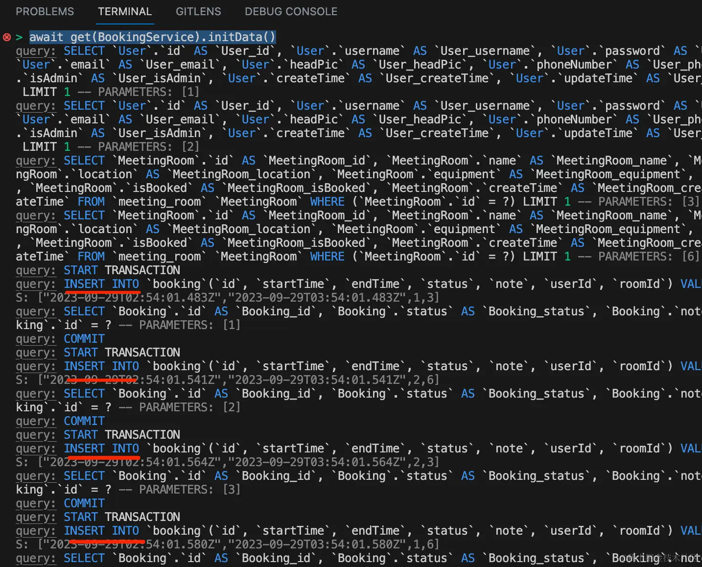

在数据库的 booking 表可以看到插入了 4 条记录：

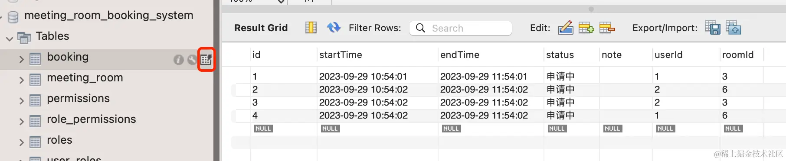

然后来写 booking 模块的接口：

首先是 list 接口。

它支持根据条件搜索，并且可以分页：

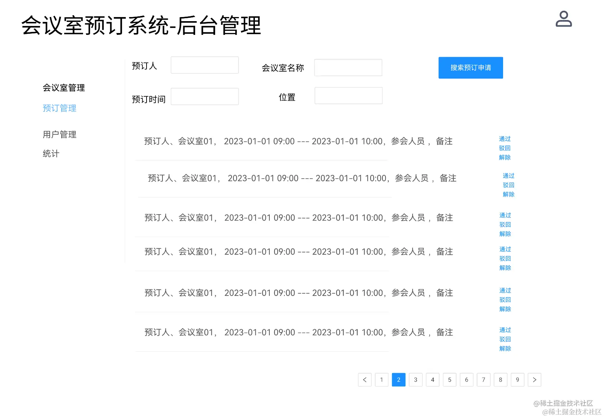

我们来写一下：

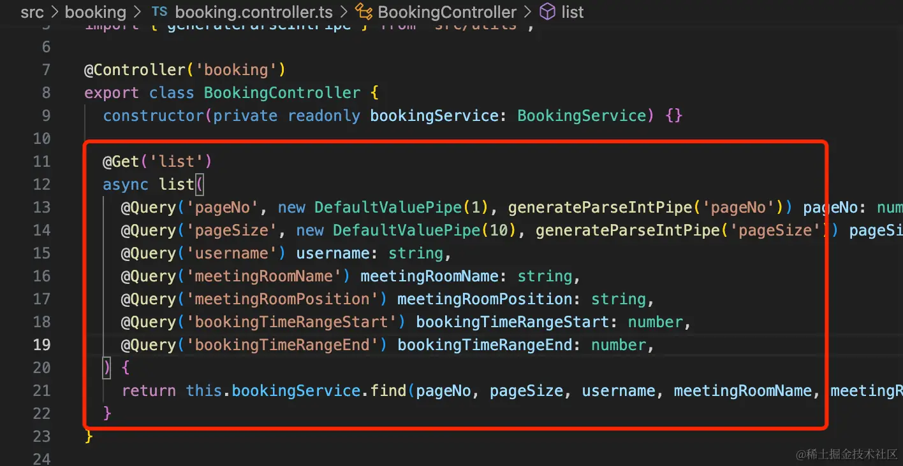

```javascript
@Get('list')
async list(
    @Query('pageNo', new DefaultValuePipe(1), generateParseIntPipe('pageNo')) pageNo: number,
    @Query('pageSize', new DefaultValuePipe(10), generateParseIntPipe('pageSize')) pageSize: number,
    @Query('username') username: string,
    @Query('meetingRoomName') meetingRoomName: string,
    @Query('meetingRoomPosition') meetingRoomPosition: string,
    @Query('bookingTimeRangeStart') bookingTimeRangeStart: number,
    @Query('bookingTimeRangeEnd') bookingTimeRangeEnd: number,
) {
    return this.bookingService.find(pageNo, pageSize, username, meetingRoomName, meetingRoomPosition, bookingTimeRangeStart, bookingTimeRangeEnd);
}
```
这种列表接口我们写过，就是传入分页参数、搜索参数，然后在 service 里把它们查出来返回。

这里的时间用 number 来接收。

我们去 BookingService 里实现下这个方法：

```javascript
async find(pageNo: number, pageSize: number, username: string, meetingRoomName: string, meetingRoomPosition: string, bookingTimeRangeStart: number, bookingTimeRangeEnd: number ) {
    const skipCount = (pageNo - 1) * pageSize;

    const [bookings, totalCount] = await this.entityManager.findAndCount(Booking, {
      where: {
        user: {
          username: Like(`%${username}%`)
        },
        room: {
          name: Like(`%${meetingRoomName}%`),
          location: Like(`%${meetingRoomPosition}%`)
        },
        startTime: Between(new Date(bookingTimeRangeStart), new Date(bookingTimeRangeEnd))
      },
      relations: {
        user: true,
        room: true,
      },
      skip: skipCount,
      take: pageSize
    });

    return {
      bookings,
      totalCount
    }
}
```
很容易看懂，就是接个 where 条件，还有分页。

要注意下日期的范围查询使用 between and 语法，这里使用 Between 操作符。

先测试下。

停掉服务，我们用 repl 的方式测：

```
npm run repl
```

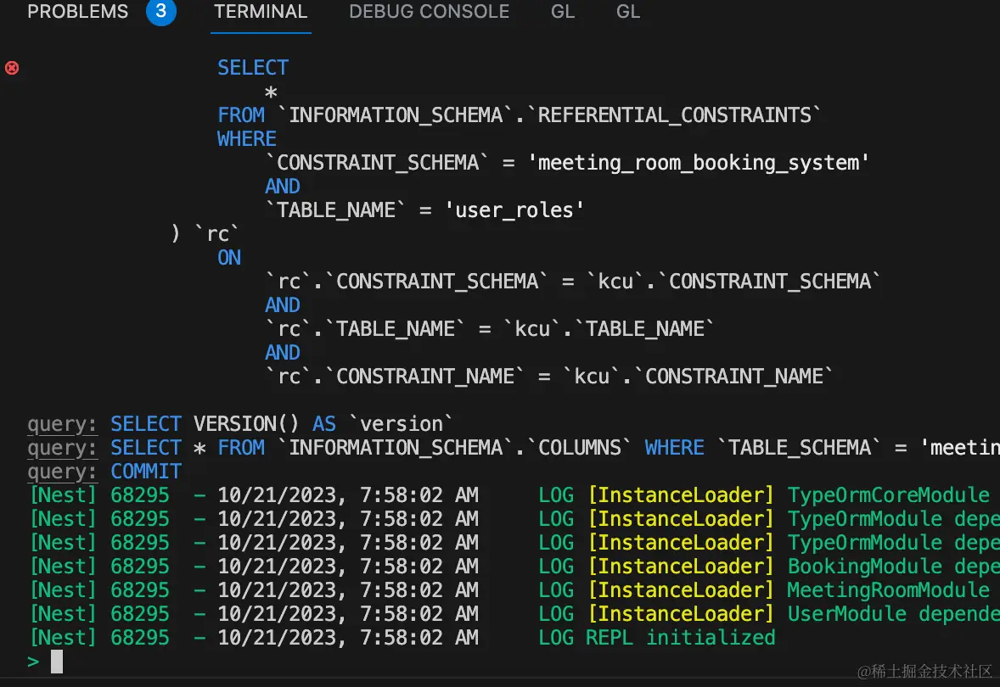

先看下有啥数据：

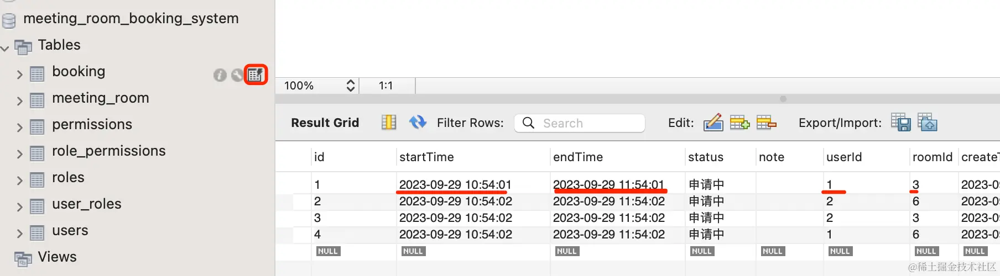

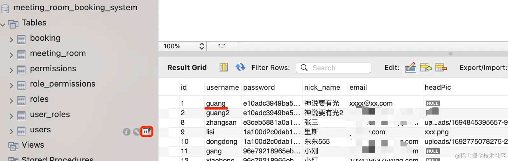

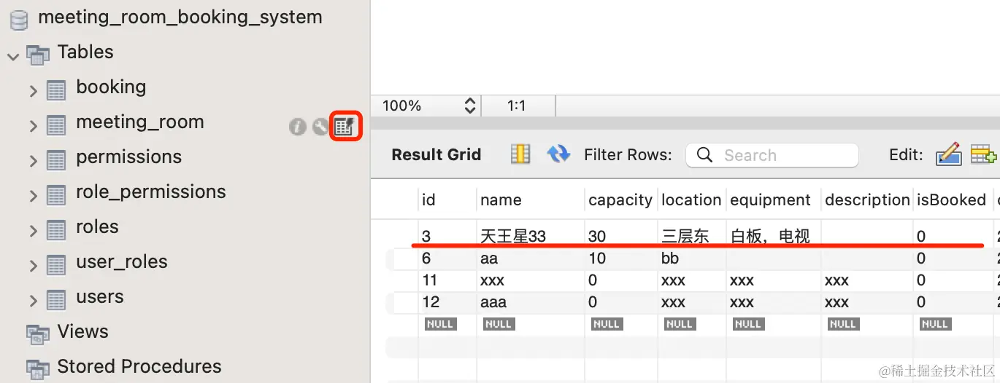

然后测试下：

在 repl 拿到两个时间戳：

```javascript
new Date('2023-09-29').getTime()
```
```javascript
new Date('2023-09-30').getTime()
```
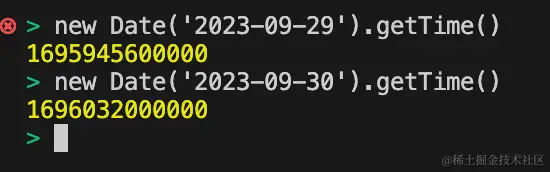

调用下这个方法：

```javascript
await get(BookingService).find(1, 10, 'guang', '天王', '三层', 1695945600000, 1696032000000)
```

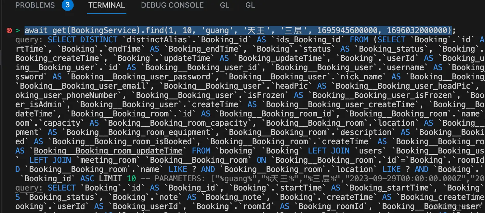

打印了一堆 sql，下面有查询的结果：

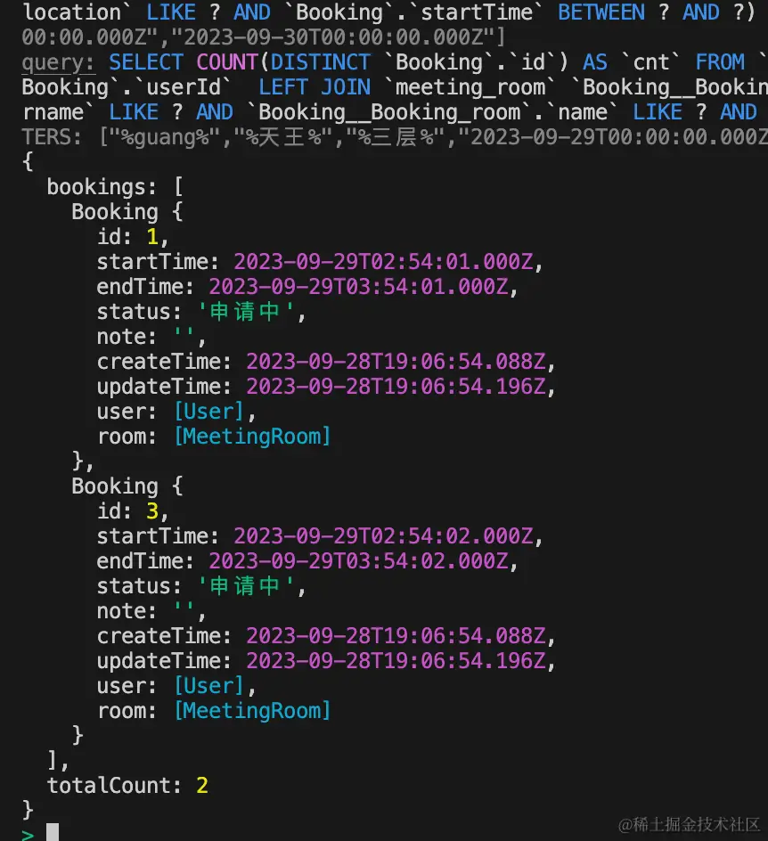

查询出来的是 id 为 1 和 3 的记录。

因为条件是 user.name 包含 guang：

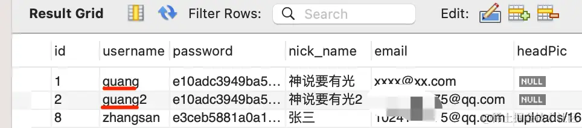

room.name 包含天王：

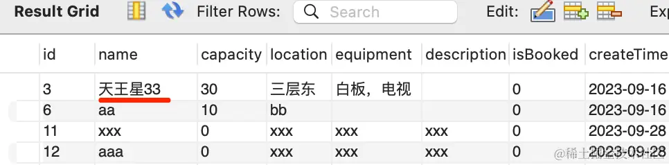

所以查出这两条是对的：

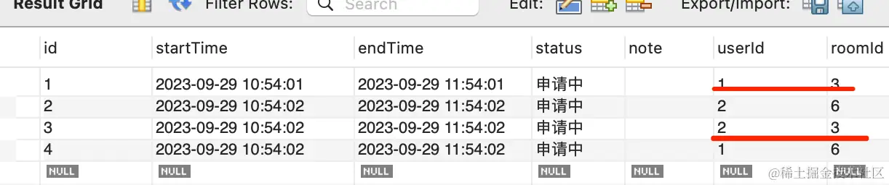

查询逻辑写完了，我们还得优化下。

因为这些参数是可选的，我们要处理下没有传入的情况：

```javascript
async find(pageNo: number, pageSize: number, username: string, meetingRoomName: string, meetingRoomPosition: string, bookingTimeRangeStart: number, bookingTimeRangeEnd: number ) {
    const skipCount = (pageNo - 1) * pageSize;

    const condition: Record<string, any> = {};

    if(username) {
      condition.user = {
        username: Like(`%${username}%`)
      }
    }

    if(meetingRoomName) {
      condition.room =  {
        name: Like(`%${meetingRoomName}%`)
      }
    }

    if(meetingRoomPosition) {
      if (!condition.room) {
        condition.room = {}
      }
      condition.room.location = Like(`%${meetingRoomPosition}%`)
    }

    if(bookingTimeRangeStart) {
      if(!bookingTimeRangeEnd) {
        bookingTimeRangeEnd = bookingTimeRangeStart + 60 * 60 * 1000
      }
      condition.startTime = Between(new Date(bookingTimeRangeStart), new Date(bookingTimeRangeEnd))
    }

    const [bookings, totalCount] = await this.entityManager.findAndCount(Booking, {
      where: condition,
      relations: {
        user: true,
        room: true,
      },
      skip: skipCount,
      take: pageSize
    });

    return {
      bookings,
      totalCount
    }
}
```
就是如果传入了，就加到 condition 上。

其中，如果 endTime 没传入，那就用 startTime + 一小时 来搜索。

此外，这里查询出来 user 信息是包含密码的，其实应该把它去掉：

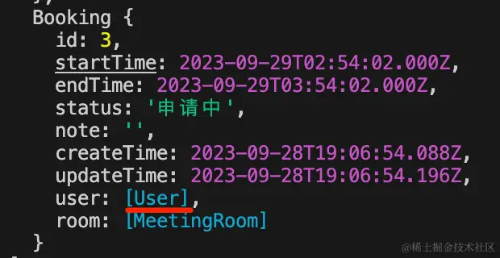

可以在这里指定 select 的字段：

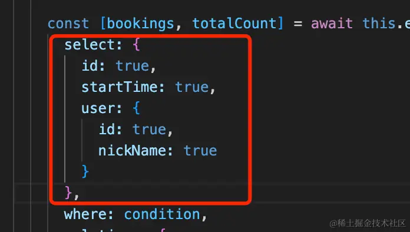

但这样有点麻烦。

我们直接查出来之后把它删掉就好了：

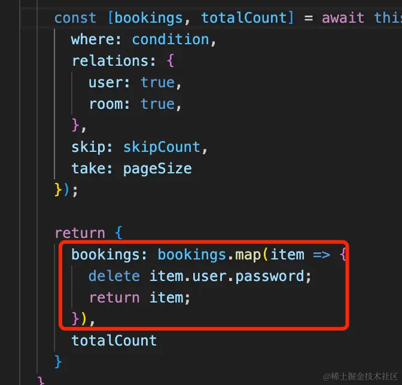

```javascript
bookings.map(item => {
    delete item.user.password;
    return item;
})
```

把 repl 停掉，把服务跑起来：

```
npm run start:dev
```
我们在 postman 里测试下：

```
http://localhost:3005/booking/list?meetingRoomName=天王&username=guang
```

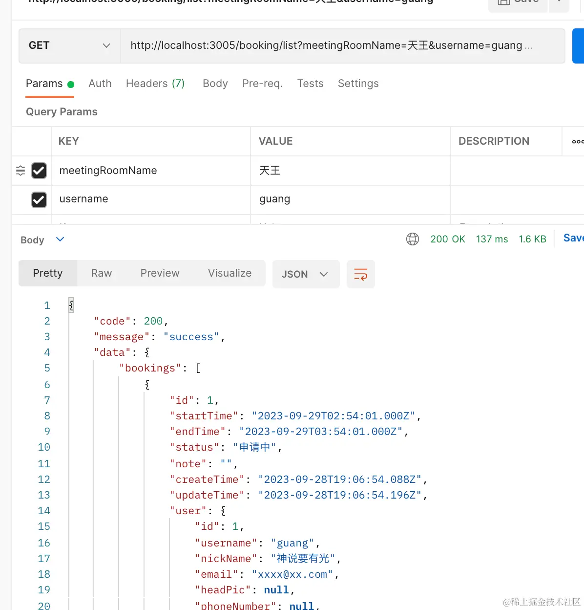

没啥问题。

接下来是申请预定的接口

| 接口路径 | 请求方式 | 描述 |
| -- | -- | -- |
| /booking/list | GET | 预订列表 |
| /booking/add | POST |申请预订|

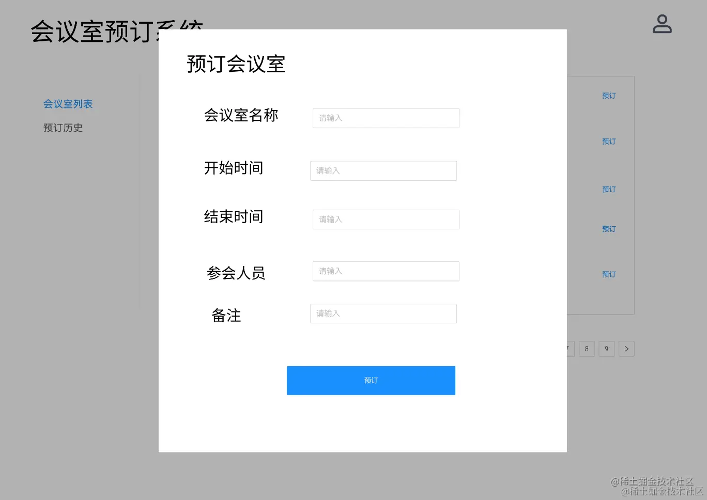

在 BookingController 添加一个接口：

```javascript
@Post('add')
@RequireLogin()
async add(@Body() booking: CreateBookingDto, @UserInfo('userId') userId: number) {
    await this.bookingService.add(booking, userId);
    return 'success'
}
```
这里需要用 @UserInfo 拿到 userId。

从 request.user 拿到 userId 的信息，需要登录，所以添加 @RequireLogin 装饰器。

因为我们在 LoginGuard 里做了判断，只有有这个装饰器的 handler 才会从 header 中解析出用户信息放在 reqeust.user 上：

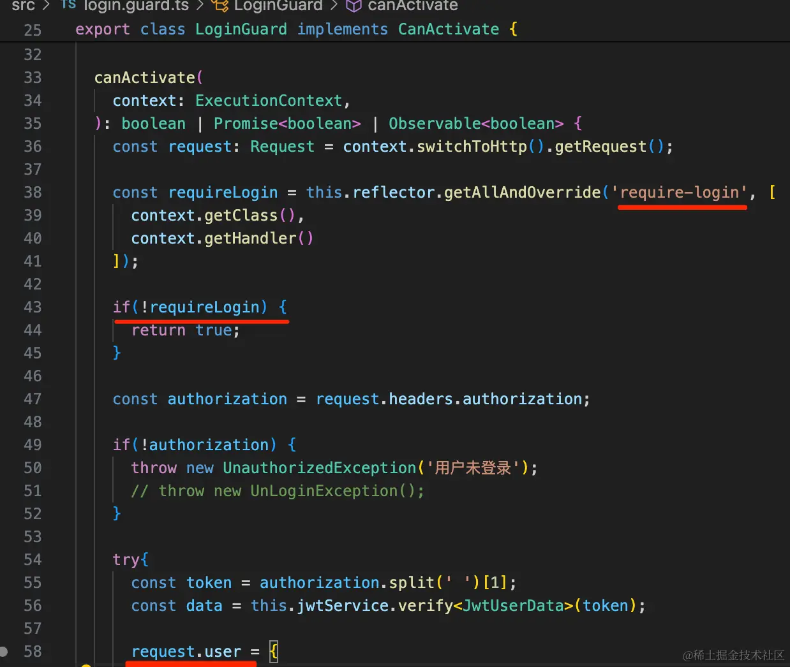

创建用到的 dto：

```javascript
import { IsNotEmpty, IsNumber } from "class-validator";

export class CreateBookingDto {
    @IsNotEmpty({ message: '会议室名称不能为空'})
    @IsNumber()
    meetingRoomId: number;

    @IsNotEmpty({ message: '开始时间不能为空' })
    @IsNumber()
    startTime: number;

    @IsNotEmpty({ message: '结束时间不能为空' })
    @IsNumber()
    endTime: number;

    note: string;
}
```
然后在 BookingService 实现下 add 方法：

```javascript
async add(bookingDto: CreateBookingDto, userId: number) {
    const meetingRoom = await this.entityManager.findOneBy(MeetingRoom, {
      id: bookingDto.meetingRoomId
    });

    if(!meetingRoom) {
      throw new BadRequestException('会议室不存在');
    }

    const user = await this.entityManager.findOneBy(User, {
      id: userId
    });

    const booking = new Booking();
    booking.room = meetingRoom;
    booking.user = user;
    booking.startTime = new Date(bookingDto.startTime);
    booking.endTime = new Date(bookingDto.endTime);

    await this.entityManager.save(Booking, booking);
}
```
就是根据 id 查询出 meeetingRoom 和 user，然后创建 booking，保存。

测试下：

先登录拿到 token：

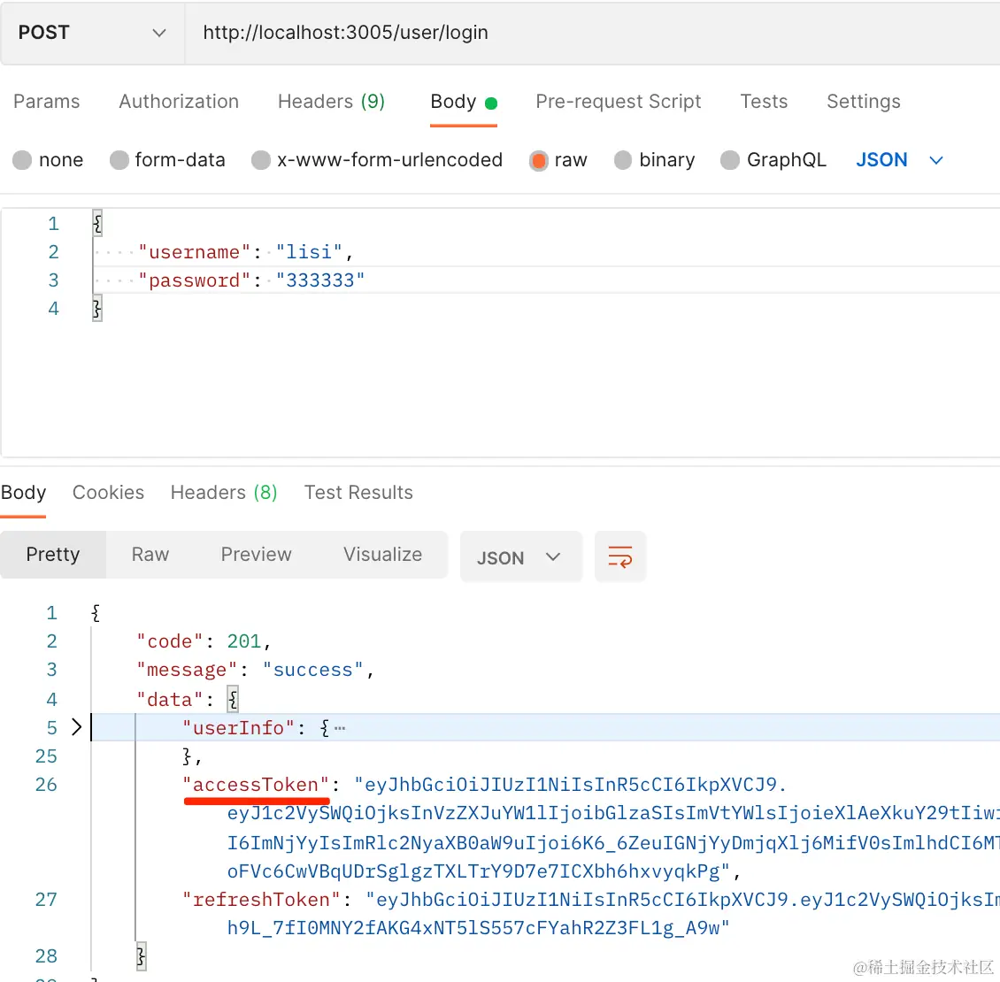

带在 Aothrization 的 header 上访问 add 接口：

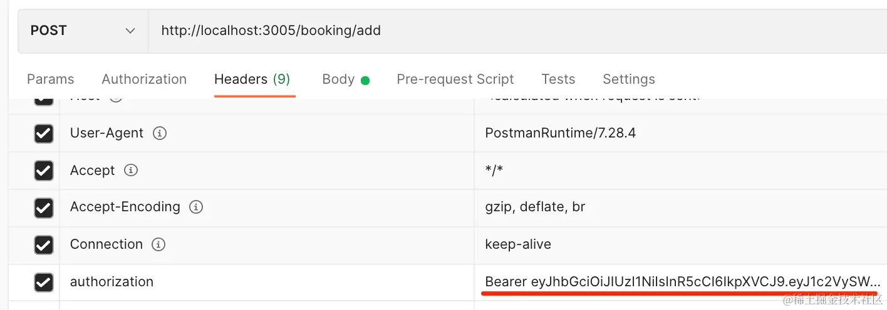

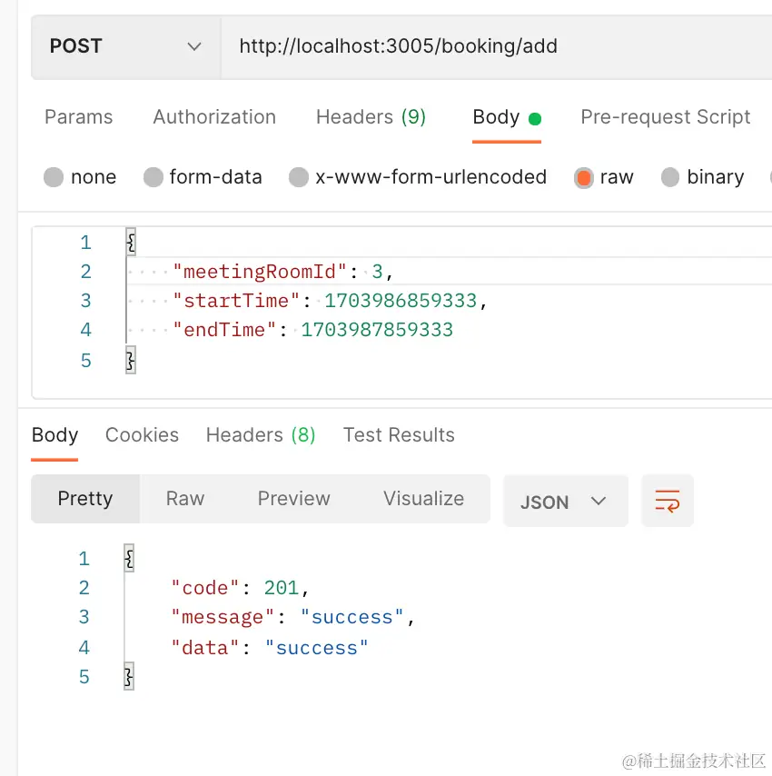
```json
{
    "meetingRoomId": 3,
    "startTime": 1703986859333,
    "endTime": 1703987859333
}
```

在 mysql workbench 查询下，可以看到记录成功插入了：

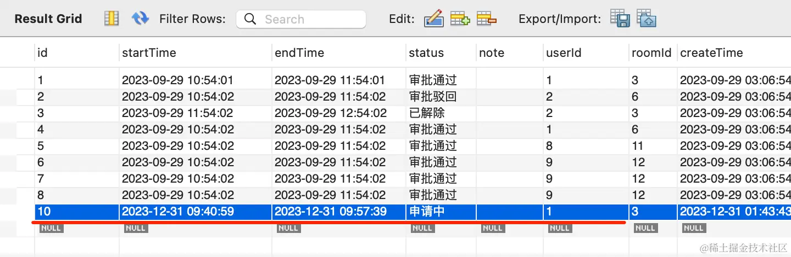

当然，现在的接口还是有问题的，我们得限制下，同一个会议室一段时间内只能被预定一次。

那怎么保证预定的时间不会冲突呢？

其实一般的会议室预订系统都是这样做的：

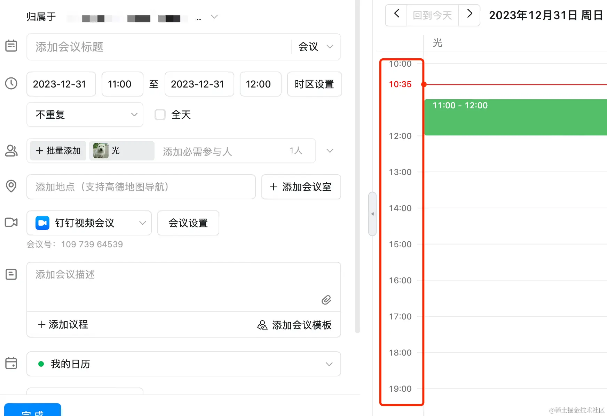

在右边列出来会议室在一天之内哪些时间可用，哪些时间被预定了。

然后只能在没有被预定的时间内选择。

这里我们就简化一下，查询下已经预定的记录里有没有包含这段时间的就好了。

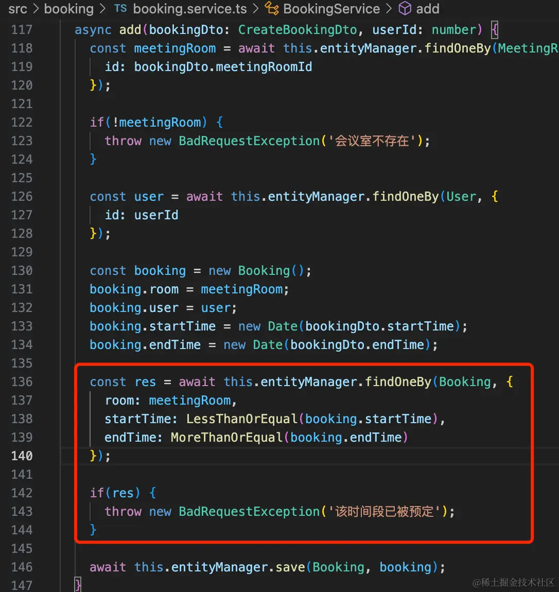

```javascript
async add(bookingDto: CreateBookingDto, userId: number) {
    const meetingRoom = await this.entityManager.findOneBy(MeetingRoom, {
      id: bookingDto.meetingRoomId
    });

    if(!meetingRoom) {
      throw new BadRequestException('会议室不存在');
    }

    const user = await this.entityManager.findOneBy(User, {
      id: userId
    });

    const booking = new Booking();
    booking.room = meetingRoom;
    booking.user = user;
    booking.startTime = new Date(bookingDto.startTime);
    booking.endTime = new Date(bookingDto.endTime);

    const res = await this.entityManager.findOneBy(Booking, {
      room: {
        id: meetingRoom.id
      },
      startTime: LessThanOrEqual(booking.startTime),
      endTime: MoreThanOrEqual(booking.endTime)
    });

    if(res) {
      throw new BadRequestException('该时间段已被预定');
    }
    
    await this.entityManager.save(Booking, booking);
  }
```
测试下：

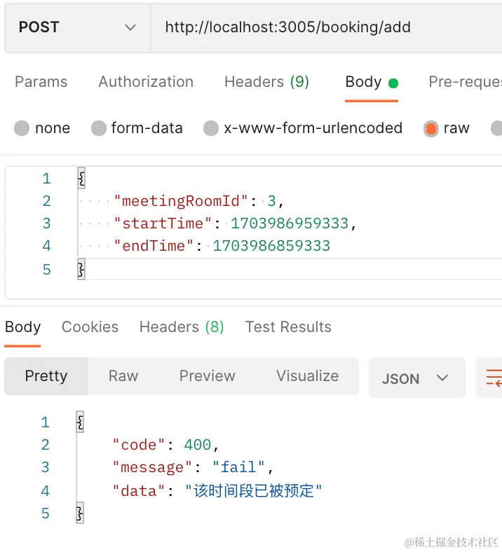

```json
{
    "meetingRoomId": 3,
    "startTime": 1703986959333,
    "endTime": 1703986859333
}
```
当预定一个已经被预定的时间段时，会提示已被预定。

然后继续写后面接口：

| 接口路径 | 请求方式 | 描述 |
| -- | -- | -- |
| /booking/list | GET | 预订列表 |
| /booking/add | POST |申请预订|
| /booking/apply/:id | GET |通过预订|
| /booking/reject/:id | GET |取消预订|
| /booking/unbind/:id | GET |解除预订|

接下来写修改预定状态的这三个接口。

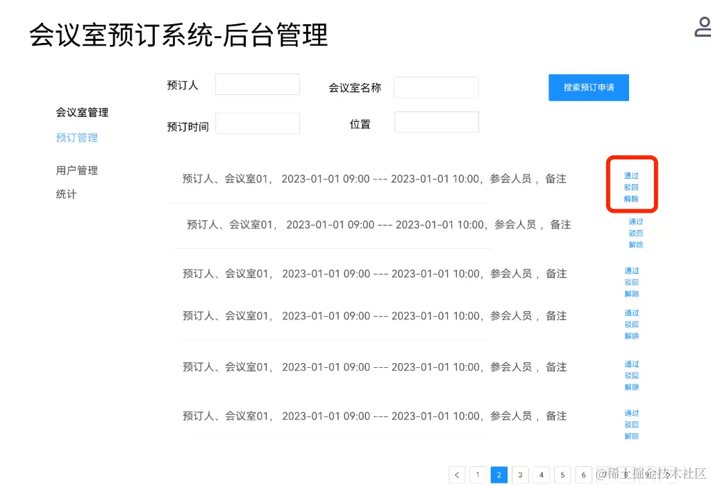

状态有这 4 种：

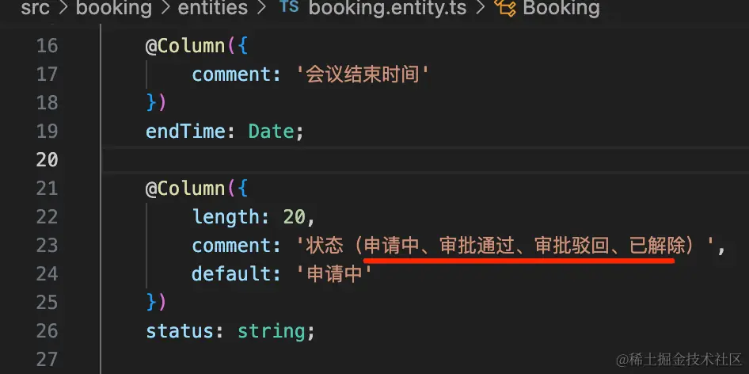

在 BookingController 添加三个路由：

```javascript
@Get("apply/:id")
async apply(@Param('id') id: number) {
    return this.bookingService.apply(id);
}

@Get("reject/:id")
async reject(@Param('id') id: number) {
    return this.bookingService.reject(id);
}

@Get("unbind/:id")
async unbind(@Param('id') id: number) {
    return this.bookingService.unbind(id);
}
```
然后在 BookingService 里实现这三个方法：

```javascript
async apply(id: number) {
    await this.entityManager.update(Booking, {
      id
    }, {
      status: '审批通过'      
    });
    return 'success'
}

async reject(id: number) {
    await this.entityManager.update(Booking, {
      id
    }, {
      status: '审批驳回'      
    });
    return 'success'
}

async unbind(id: number) {
    await this.entityManager.update(Booking, {
      id
    }, {
      status: '已解除'      
    });
    return 'success'
}
```
postman 里测试下：

```
http://localhost:3005/booking/apply/1
```
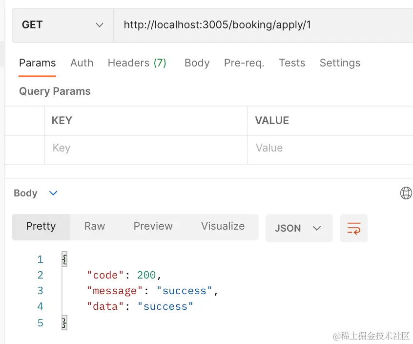

```
http://localhost:3005/booking/reject/2
```
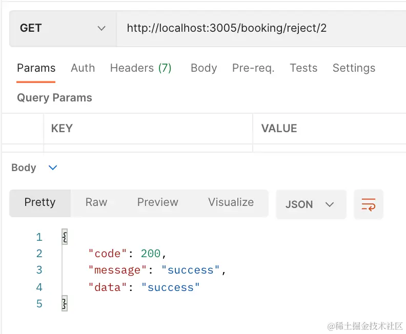

```
http://localhost:3005/booking/reject/3
```

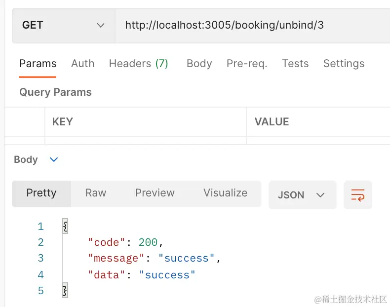

在 mysql workbench 里可以看到状态成功被修改了：

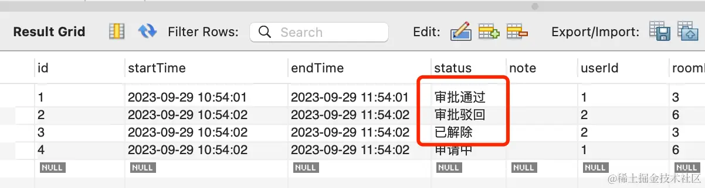

接下来是催办的接口：

| 接口路径 | 请求方式 | 描述 |
| -- | -- | -- |
| /booking/list | GET | 预订列表 |
| /booking/apply/:id | GET |通过预订|
| /booking/reject/:id | GET |取消预订|
| /booking/unbind/:id | GET |解除预订|
| /booking/urge | GET |催办 |

按当时的设计，催办要发送邮件和短信，不过我们没买短信服务，这里就发邮件好了。

但也不是每次催办都会发邮件，我们在 redis 里加个标识，半小时内只发一次邮件。

我们在 BookingController 添加一个 urge 接口：

```javascript
@Get('urge/:id')
async urge(@Param('id') id: number) {
    return this.bookingService.urge(id);
}
```
然后在 BookingService 添加实现逻辑：

```javascript
@Inject(RedisService)
private redisService: RedisService;

@Inject(EmailService)
private emailService: EmailService;

async urge(id: number) {
    const flag = await this.redisService.get('urge_' + id);

    if(flag) {
      return '半小时内只能催办一次，请耐心等待';
    }

    let email = await this.redisService.get('admin_email');

    if(!email) { 
      const admin = await this.entityManager.findOne(User, {
        select: {
          email: true
        },
        where: {
          isAdmin: true
        }
      });

      email = admin.email

      this.redisService.set('admin_email', admin.email);
    }

    this.emailService.sendMail({
      to: email,
      subject: '预定申请催办提醒',
      html: `id 为 ${id} 的预定申请正在等待审批`
    });
    
    this.redisService.set('urge_' + id, 1, 60 * 30);
}
```

我们注入了 EmailService 和 RedisService。

先用 redisService 查询 flag，查到的话就提醒半小时内只能催办一次。

然后用 redisService 查询 admin 的邮箱，没查到的话到数据库查，然后存到 redis。

之后发催办邮件，并且在 redis 里存一个 30 分钟的 flag。

测试下：

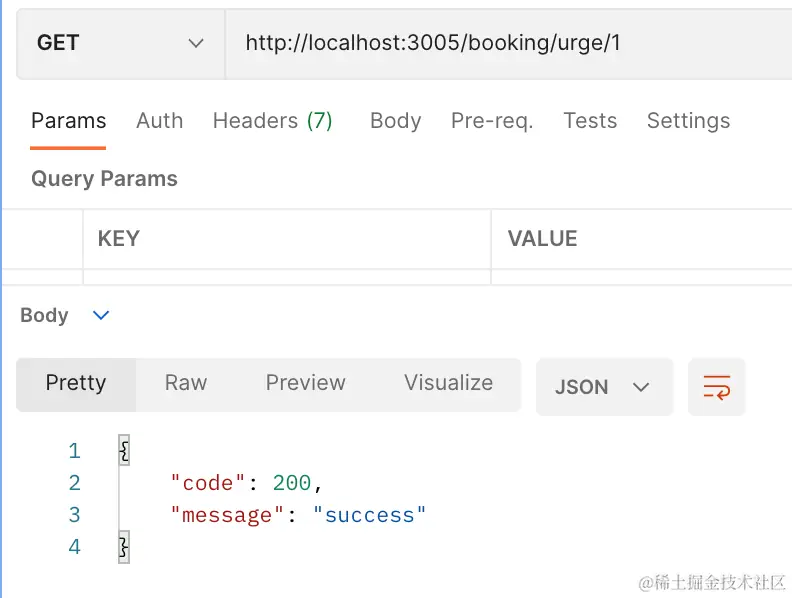

第一次催办，管理员会收到邮件：


第二次催办，会提示半小时只能催办一次：

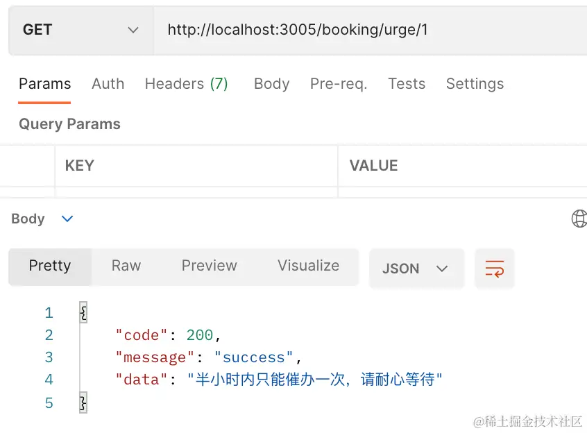

在 RedisInsight 里可以看到这两个 key：

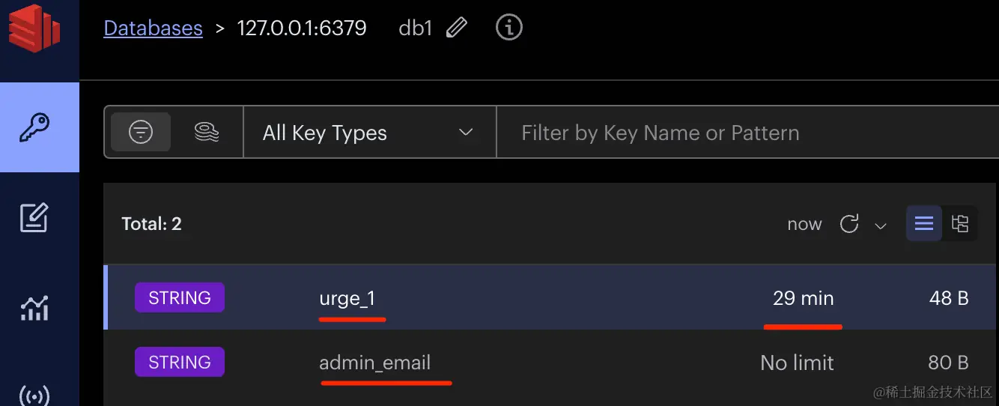

这样，催办接口就完成了。

当然，这里最好是在邮件里带一个具体的链接，点击可以直接打开对应的页面来处理申请。

等后面写完这个页面再改。

案例代码上传了[小册仓库](https://github.com/QuarkGluonPlasma/nestjs-course-code/tree/main/meeting_room_booking_system_backend)

## 总结

这节我们完成了预定管理模块的后端代码，包括列表、添加预定、审批、催办等。

后端代码完成了，下节我们来写前端部分的代码。