# 128. 会议室预订系统：统计管理模块-前端开发

上节写了统计用的两个接口，这节来加一下 swagger 文档，然后写下前端部分。

这个接口有 2 个 query 参数，返回值是一个对象，所以这样写：

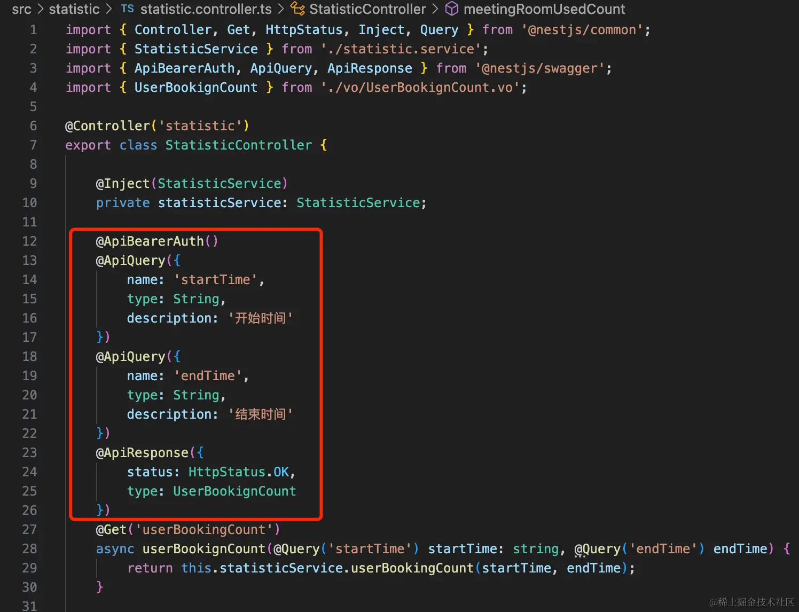

```javascript
@ApiBearerAuth()
@ApiQuery({
    name: 'startTime',
    type: String,
    description: '开始时间'
})
@ApiQuery({
    name: 'endTime',
    type: String,
    description: '结束时间'
})
@ApiResponse({
    status: HttpStatus.OK,
    type: UserBookignCount
})
```
涉及到的 vo 在 src/statistic/vo/UserBookignCount.vo.ts

```javascript
import { ApiProperty } from "@nestjs/swagger";

export class UserBookignCount {

    @ApiProperty()
    userId: string;

    @ApiProperty()
    username: string;

    @ApiProperty()
    bookingCount: string;
}
```

访问下 http://localhost:3005/api-doc

可以看到这个接口的文档：

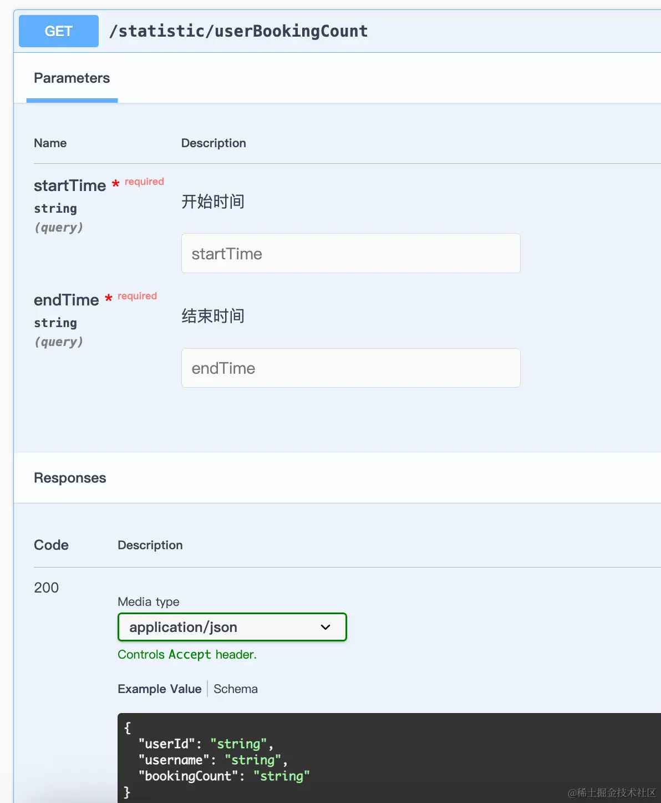

没啥问题。

然后添加另一个接口的：

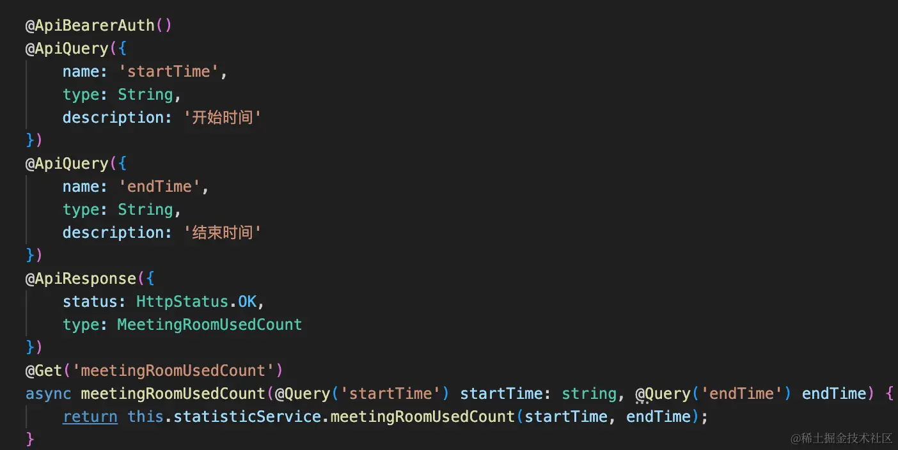

```javascript
@ApiBearerAuth()
@ApiQuery({
    name: 'startTime',
    type: String,
    description: '开始时间'
})
@ApiQuery({
    name: 'endTime',
    type: String,
    description: '结束时间'
})
@ApiResponse({
    status: HttpStatus.OK,
    type: MeetingRoomUsedCount
})
```
src/statistic/MeetingRoomUsedCount.vo.ts

```javascript
import { ApiProperty } from "@nestjs/swagger";

export class MeetingRoomUsedCount {

    @ApiProperty()
    meetingRoomId: string;

    @ApiProperty()
    meetingRoomName: string;

    @ApiProperty()
    usedCount: string;
}
```

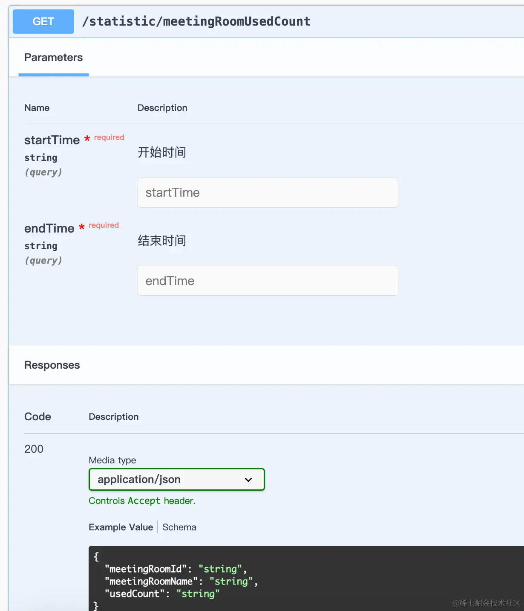

然后再加个 @ApiTags 把这俩接口文档分成一组：

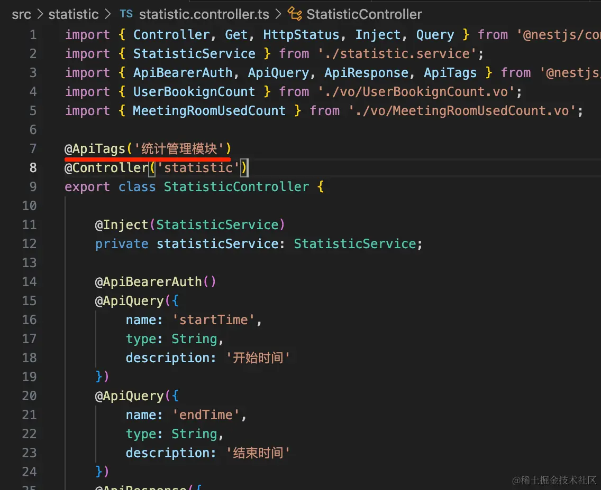

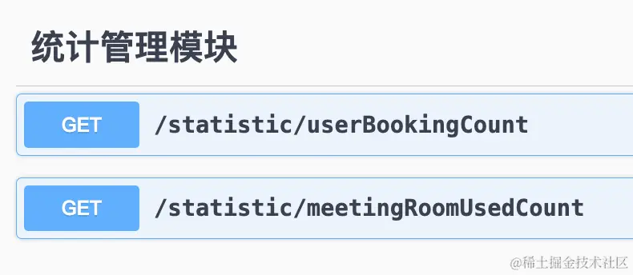

这样，swagger 文档就完成了。

然后来写前端代码：

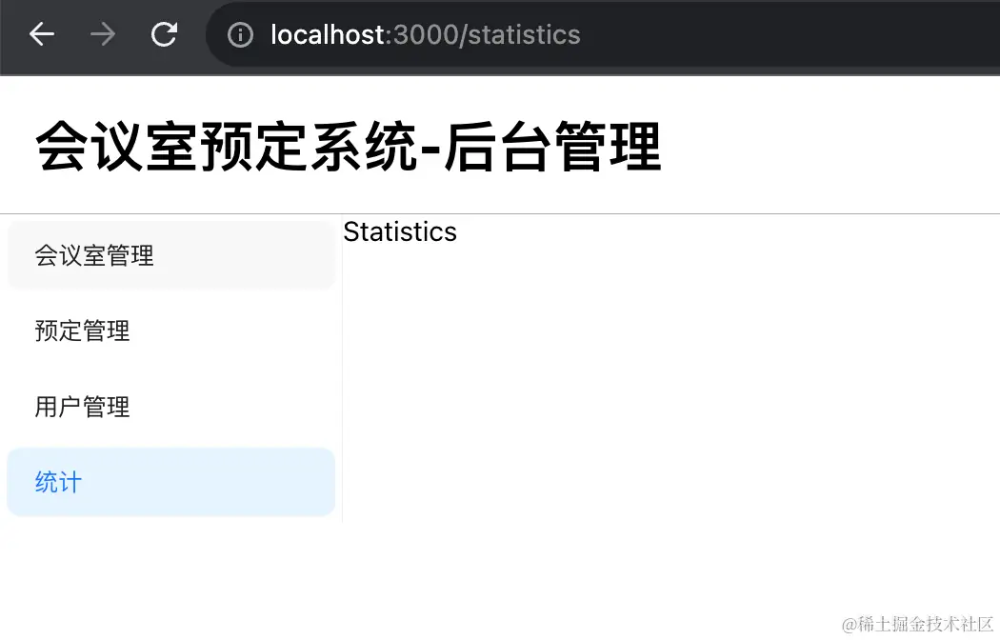

统计的路由我们已经写过了，只要填内容就行。

原型图是这样的：

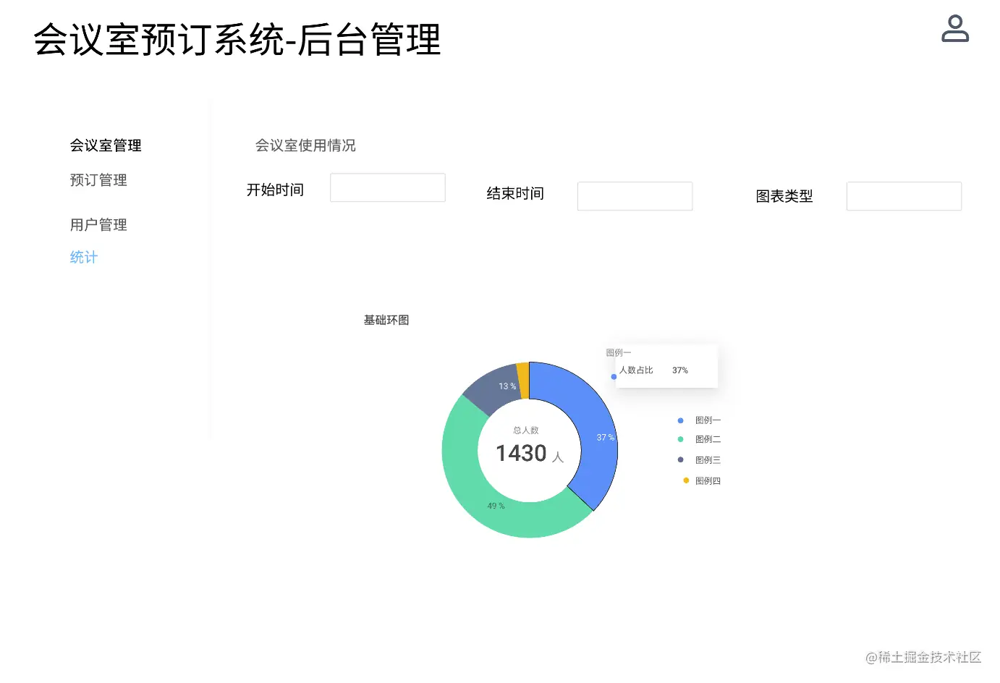

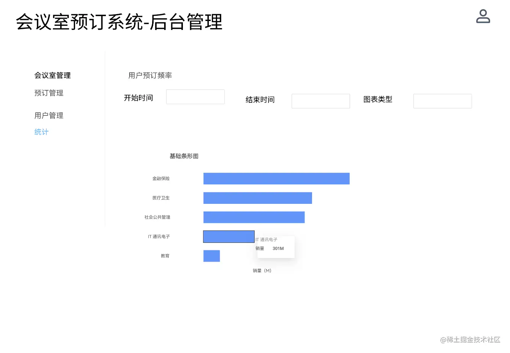

加个 antd 的 Form，然后再用 echarts 的图表展示下数据就好了。

先加下 form：

```javascript
import { Button, DatePicker, Form, Select } from "antd";
import "./statistics.css";

export function Statistics() {

    function getStatisticData(values: { startTime: string; endTime: string; }) {
        console.log(values);
    }

    return <div id="statistics-container">
        <div className="statistics-form">
            <Form
                onFinish={getStatisticData}
                name="search"
                layout='inline'
                colon={false}
            >
                <Form.Item label="开始日期" name="startTime">
                    <DatePicker />
                </Form.Item>

                <Form.Item label="结束日期" name="endTime">
                    <DatePicker />
                </Form.Item>

                <Form.Item label="图表类型" name="chartType" initialValue={"bar"}>
                    <Select>
                        <Select.Option value="pie">饼图</Select.Option>
                        <Select.Option value="bar">柱形图</Select.Option>
                    </Select>
                </Form.Item>

                <Form.Item>
                    <Button type="primary" htmlType="submit">
                        查询
                    </Button>
                </Form.Item>
            </Form>
        </div>
        <div className="statistics-chart">
            图表
        </div>
    </div>
}
```
css：

```css
#statistics-container {
    padding: 20px;
}
#statistics-container .statistics-form {
    margin-bottom: 40px;
}
#statistics-container .statistics-chart {
    width: 800px;
    height: 600px;
}
```

点击查询，会打印 form 的值：

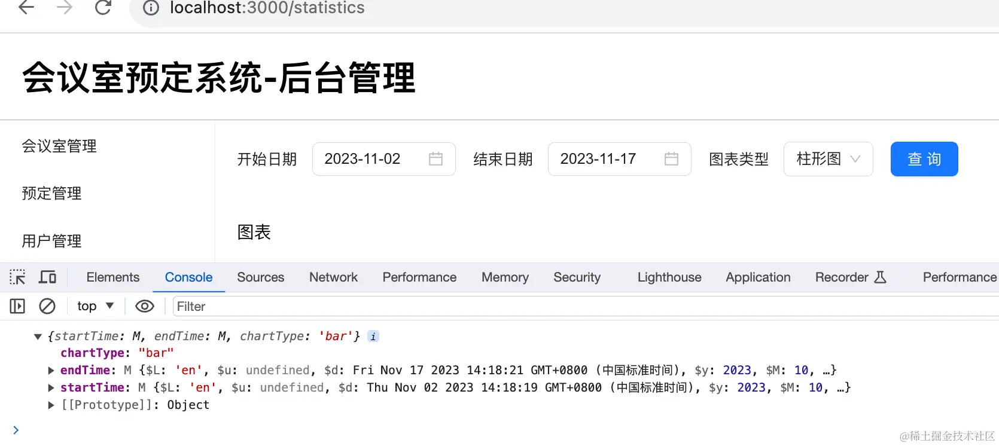

然后安装 echarts：

```
npm install echarts --save
```

然后通过 useRef 拿到 dom 元素，再初始化下 echarts 的柱状图：

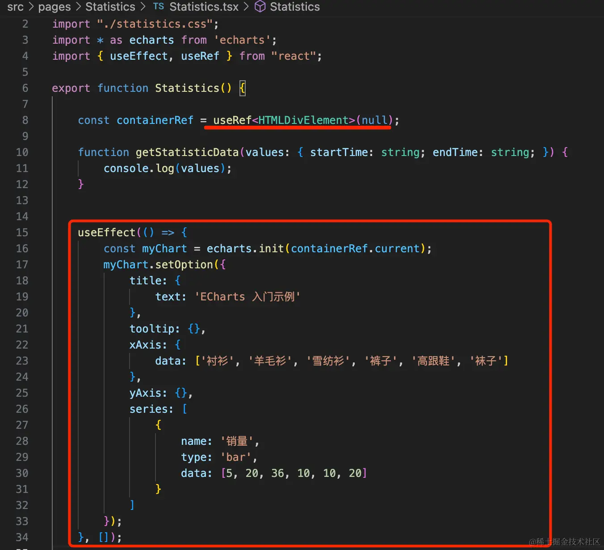

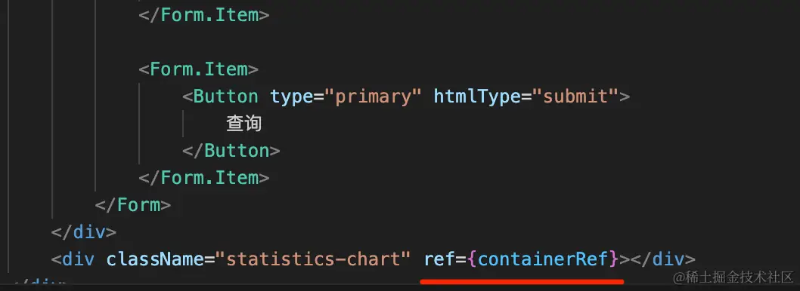

```javascript
import { Button, DatePicker, Form, Select } from "antd";
import "./statistics.css";
import * as echarts from 'echarts';
import { useEffect, useRef } from "react";

export function Statistics() {

    const containerRef = useRef<HTMLDivElement>(null);

    function getStatisticData(values: { startTime: string; endTime: string; }) {
        console.log(values);
    }


    useEffect(() => {
        const myChart = echarts.init(containerRef.current);
        myChart.setOption({
            title: {
                text: 'ECharts 入门示例'
            },
            tooltip: {},
            xAxis: {
                data: ['衬衫', '羊毛衫', '雪纺衫', '裤子', '高跟鞋', '袜子']
            },
            yAxis: {},
            series: [
                {
                    name: '销量',
                    type: 'bar',
                    data: [5, 20, 36, 10, 10, 20]
                }
            ]
        });
    }, []);

    return <div id="statistics-container">
        <div className="statistics-form">
            <Form
                onFinish={getStatisticData}
                name="search"
                layout='inline'
                colon={false}
            >
                <Form.Item label="开始日期" name="startTime">
                    <DatePicker />
                </Form.Item>

                <Form.Item label="结束日期" name="endTime">
                    <DatePicker />
                </Form.Item>

                <Form.Item label="图表类型" name="chartType" initialValue={"bar"}>
                    <Select>
                        <Select.Option value="pie">饼图</Select.Option>
                        <Select.Option value="bar">柱形图</Select.Option>
                    </Select>
                </Form.Item>

                <Form.Item>
                    <Button type="primary" htmlType="submit">
                        查询
                    </Button>
                </Form.Item>
            </Form>
        </div>
        <div className="statistics-chart" ref={containerRef}></div>
    </div>
}
```
这样 echarts 就成功引入了：

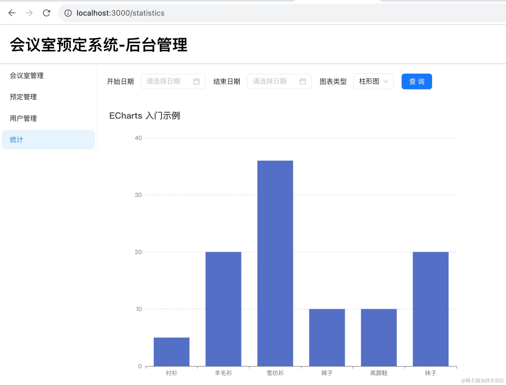

然后我们加一下接口：

在 src/interface/interfaces.ts 里加一下：

```javascript
export async function meetingRoomUsedCount(startTime: string, endTime: string) {
    return await axiosInstance.get('/statistic/meetingRoomUsedCount', {
        params: {
            startTime,
            endTime
        }
    });
}

export async function userBookingCount(startTime: string, endTime: string) {
    return await axiosInstance.get('/statistic/userBookingCount', {
        params: {
            startTime,
            endTime
        }
    });
}
```
我们加一个 state 来存储返回的数据，然后点击查询的时候请求接口：

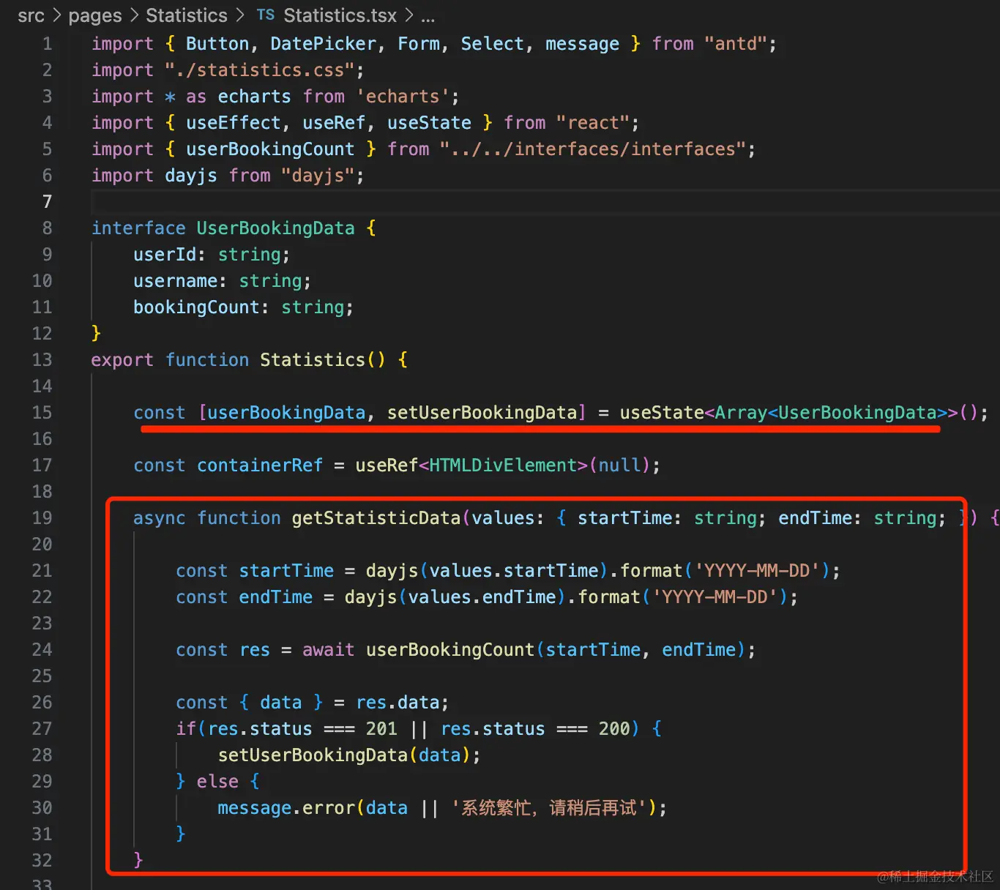

当数据变化的时候，渲染图表：

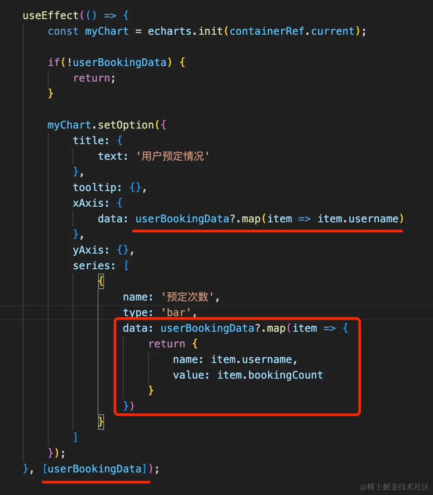

```javascript
import { Button, DatePicker, Form, Select, message } from "antd";
import "./statistics.css";
import * as echarts from 'echarts';
import { useEffect, useRef, useState } from "react";
import { userBookingCount } from "../../interfaces/interfaces";
import dayjs from "dayjs";

interface UserBookingData {
    userId: string;
    username: string;
    bookingCount: string;
}
export function Statistics() {

    const [userBookingData, setUserBookingData] = useState<Array<UserBookingData>>();

    const containerRef = useRef<HTMLDivElement>(null);

    async function getStatisticData(values: { startTime: string; endTime: string; }) {

        const startTime = dayjs(values.startTime).format('YYYY-MM-DD');
        const endTime = dayjs(values.endTime).format('YYYY-MM-DD');

        const res = await userBookingCount(startTime, endTime);
        
        const { data } = res.data;
        if(res.status === 201 || res.status === 200) {
            setUserBookingData(data);
        } else {
            message.error(data || '系统繁忙，请稍后再试');
        }
    }

    useEffect(() => {
        const myChart = echarts.init(containerRef.current);

        if(!userBookingData) {
            return;
        }
    
        myChart.setOption({
            title: {
                text: '用户预定情况'
            },
            tooltip: {},
            xAxis: {
                data: userBookingData?.map(item => item.username)
            },
            yAxis: {},
            series: [
                {
                    name: '预定次数',
                    type: 'bar',
                    data: userBookingData?.map(item => {
                        return {
                            name: item.username,
                            value: item.bookingCount
                        }
                    })
                }
            ]
        });
    }, [userBookingData]);

    return <div id="statistics-container">
        <div className="statistics-form">
            <Form
                onFinish={getStatisticData}
                name="search"
                layout='inline'
                colon={false}
            >
                <Form.Item label="开始日期" name="startTime">
                    <DatePicker />
                </Form.Item>

                <Form.Item label="结束日期" name="endTime">
                    <DatePicker />
                </Form.Item>

                <Form.Item label="图表类型" name="chartType" initialValue={"bar"}>
                    <Select>
                        <Select.Option value="pie">饼图</Select.Option>
                        <Select.Option value="bar">柱形图</Select.Option>
                    </Select>
                </Form.Item>

                <Form.Item>
                    <Button type="primary" htmlType="submit">
                        查询
                    </Button>
                </Form.Item>
            </Form>
        </div>
        <div className="statistics-chart" ref={containerRef}></div>
    </div>
}
```
这样，点击查询的时候就会根据返回的数据渲染柱形图：

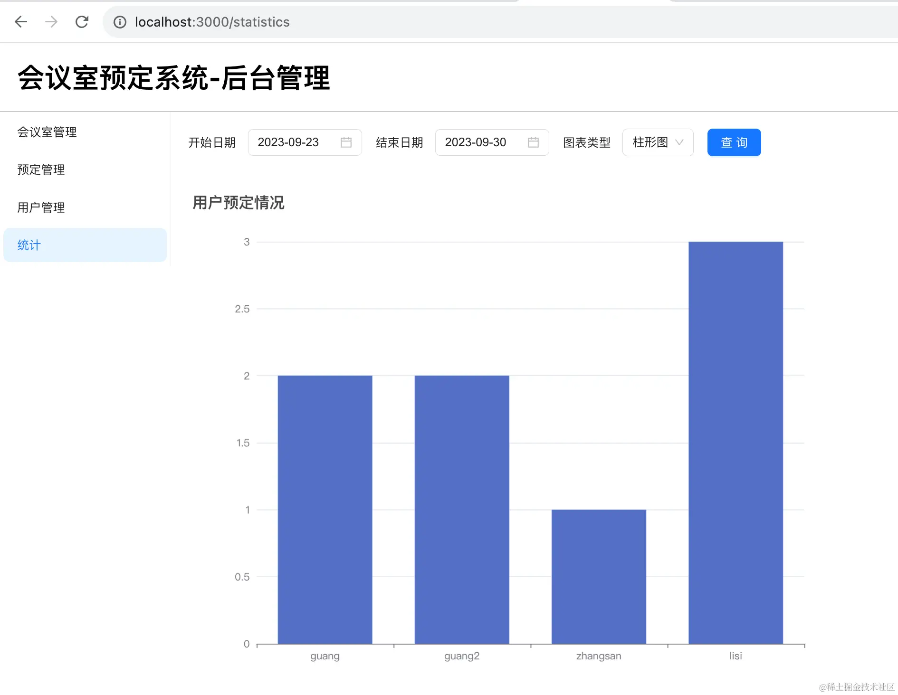

然后我们再加上饼图的部分：

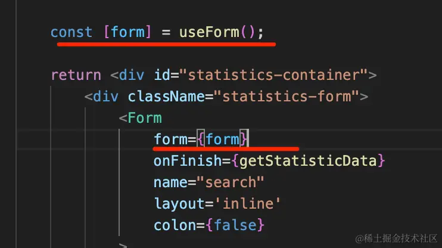

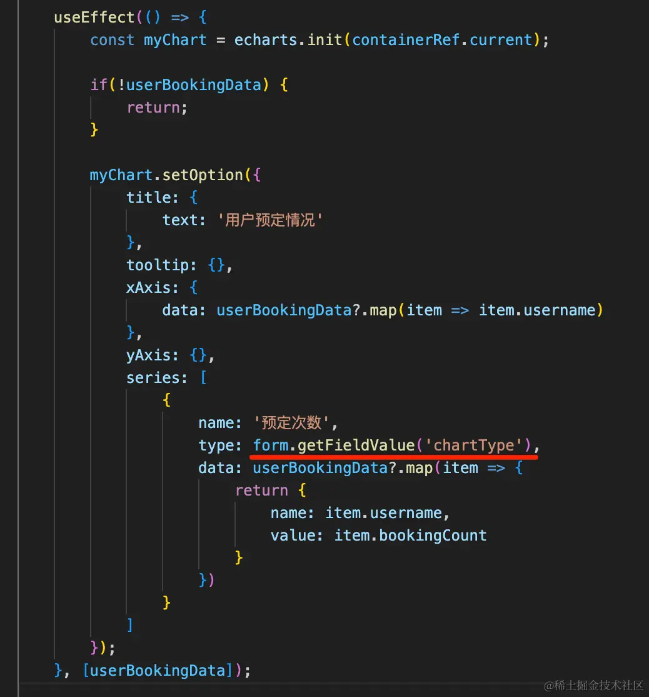

这样，统计的图表就完成了：


我们在下面再加一个会议室使用情况的图表。

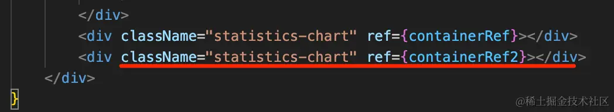

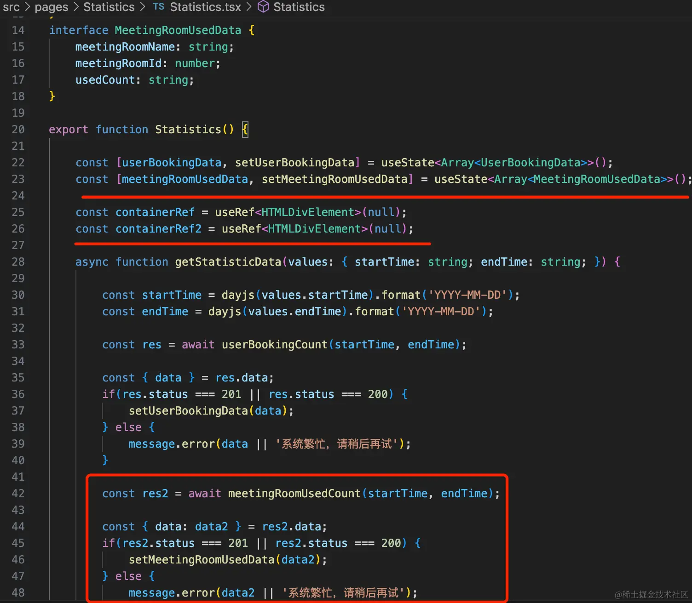

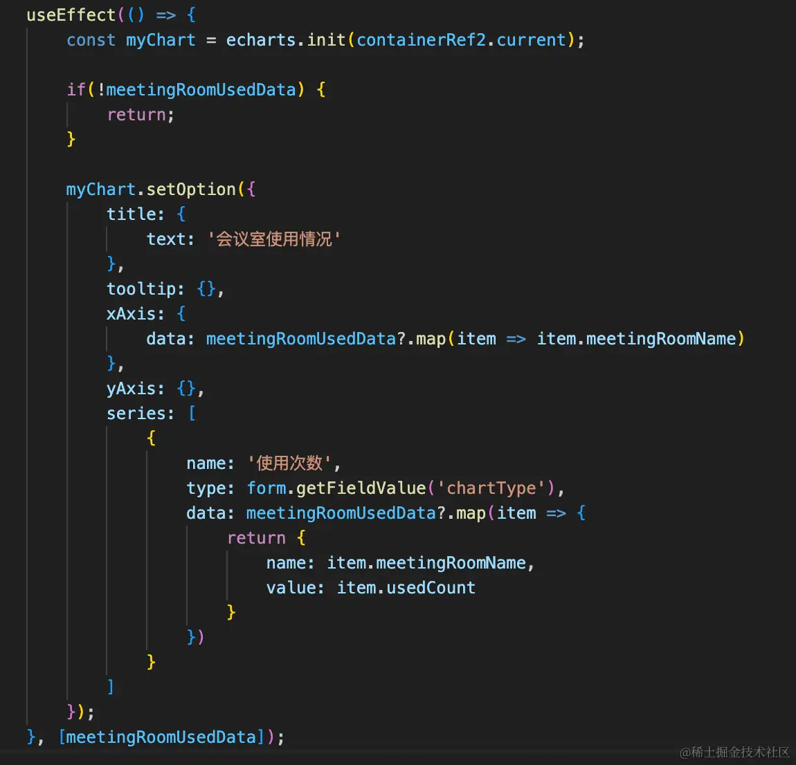

过程一摸一样。

```javascript
import { Button, DatePicker, Form, Select, message } from "antd";
import "./statistics.css";
import * as echarts from 'echarts';
import { useEffect, useRef, useState } from "react";
import { meetingRoomUsedCount, userBookingCount } from "../../interfaces/interfaces";
import dayjs from "dayjs";
import { useForm } from "antd/es/form/Form";

interface UserBookingData {
    userId: string;
    username: string;
    bookingCount: string;
}
interface MeetingRoomUsedData {
    meetingRoomName: string;
    meetingRoomId: number;
    usedCount: string;
}

export function Statistics() {

    const [userBookingData, setUserBookingData] = useState<Array<UserBookingData>>();
    const [meetingRoomUsedData, setMeetingRoomUsedData] = useState<Array<MeetingRoomUsedData>>();

    const containerRef = useRef<HTMLDivElement>(null);
    const containerRef2 = useRef<HTMLDivElement>(null);

    async function getStatisticData(values: { startTime: string; endTime: string; }) {

        const startTime = dayjs(values.startTime).format('YYYY-MM-DD');
        const endTime = dayjs(values.endTime).format('YYYY-MM-DD');

        const res = await userBookingCount(startTime, endTime);
        
        const { data } = res.data;
        if(res.status === 201 || res.status === 200) {
            setUserBookingData(data);
        } else {
            message.error(data || '系统繁忙，请稍后再试');
        }

        const res2 = await meetingRoomUsedCount(startTime, endTime);
        
        const { data: data2 } = res2.data;
        if(res2.status === 201 || res2.status === 200) {
            setMeetingRoomUsedData(data2);
        } else {
            message.error(data2 || '系统繁忙，请稍后再试');
        }
    }

    useEffect(() => {
        const myChart = echarts.init(containerRef.current);

        if(!userBookingData) {
            return;
        }
    
        myChart.setOption({
            title: {
                text: '用户预定情况'
            },
            tooltip: {},
            xAxis: {
                data: userBookingData?.map(item => item.username)
            },
            yAxis: {},
            series: [
                {
                    name: '预定次数',
                    type: form.getFieldValue('chartType'),
                    data: userBookingData?.map(item => {
                        return {
                            name: item.username,
                            value: item.bookingCount
                        }
                    })
                }
            ]
        });
    }, [userBookingData]);

    useEffect(() => {
        const myChart = echarts.init(containerRef2.current);

        if(!meetingRoomUsedData) {
            return;
        }
    
        myChart.setOption({
            title: {
                text: '会议室使用情况'
            },
            tooltip: {},
            xAxis: {
                data: meetingRoomUsedData?.map(item => item.meetingRoomName)
            },
            yAxis: {},
            series: [
                {
                    name: '使用次数',
                    type: form.getFieldValue('chartType'),
                    data: meetingRoomUsedData?.map(item => {
                        return {
                            name: item.meetingRoomName,
                            value: item.usedCount
                        }
                    })
                }
            ]
        });
    }, [meetingRoomUsedData]);

    const [form] = useForm();

    return <div id="statistics-container">
        <div className="statistics-form">
            <Form
                form={form}
                onFinish={getStatisticData}
                name="search"
                layout='inline'
                colon={false}
            >
                <Form.Item label="开始日期" name="startTime">
                    <DatePicker />
                </Form.Item>

                <Form.Item label="结束日期" name="endTime">
                    <DatePicker />
                </Form.Item>

                <Form.Item label="图表类型" name="chartType" initialValue={"bar"}>
                    <Select>
                        <Select.Option value="pie">饼图</Select.Option>
                        <Select.Option value="bar">柱形图</Select.Option>
                    </Select>
                </Form.Item>

                <Form.Item>
                    <Button type="primary" htmlType="submit">
                        查询
                    </Button>
                </Form.Item>
            </Form>
        </div>
        <div className="statistics-chart" ref={containerRef}></div>
        <div className="statistics-chart" ref={containerRef2}></div>
    </div>
}
```


代码在[小册仓库](https://github.com/QuarkGluonPlasma/nestjs-course-code/tree/main/meeting_room_booking_system_backend)。

## 总结

这节我们加了 swagger 文档并且写了统计管理模块的前端代码。

前端部分主要是 echarts 的图表，这个根据返回的数据调整下格式，然后设置到 echarts 的 options 就行。

至此，所有模块的钱后端代码就都完成了。
