# 13. Metadata 和 Reflector

不知道大家有没有感觉很神奇，只是通过装饰器声明了一下，然后启动 Nest 应用，这时候对象就给创建好了，依赖也给注入了。

那它是怎么实现的呢？

大家如果就这样去思考它的实现原理，还真不一定能想出来，因为缺少了一些前置知识。也就是实现 Nest 最核心的一些 api： Reflect 的 metadata 的 api。

有的同学会说，Reflect 的 api 我很熟呀，就是操作对象的属性、方法、构造器的一些 api：

比如 Reflect.get 是获取对象属性值

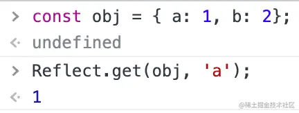

Reflect.set 是设置对象属性值

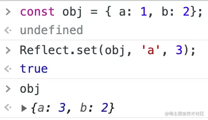

Reflect.has 是判断对象属性是否存在

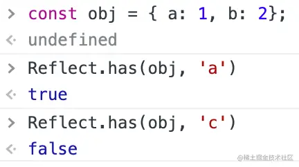

Reflect.apply 是调用某个方法，传入对象和参数

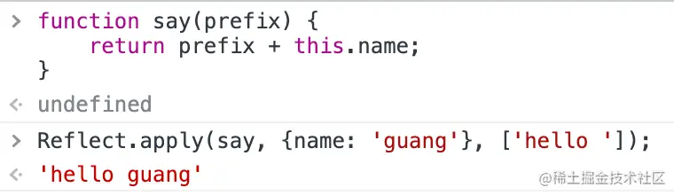

Reflect.construct 是用构造器创建对象实例，传入构造器参数

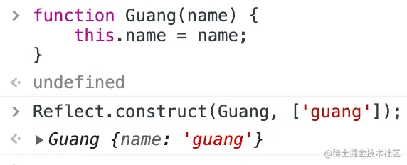

这些 api 在 [MDN 文档](https://developer.mozilla.org/en-US/docs/Web/JavaScript/Reference/Global_Objects/Reflect)里可以查到，因为它们都已经是 es 标准了，也被很多浏览器实现了。

但是实现 Nest 用到的 api 还没有进入标准，还在草案阶段，也就是 [metadata 的 api](https://rbuckton.github.io/reflect-metadata/)：

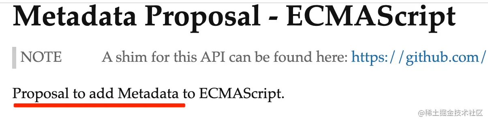

它有这些 api：

```typescript
Reflect.defineMetadata(metadataKey, metadataValue, target);

Reflect.defineMetadata(metadataKey, metadataValue, target, propertyKey);


let result = Reflect.getMetadata(metadataKey, target);

let result = Reflect.getMetadata(metadataKey, target, propertyKey);
```

Reflect.defineMetadata 和 Reflect.getMetadata 分别用于设置和获取某个类的元数据，如果最后传入了属性名，还可以单独为某个属性设置元数据。

那元数据存在哪呢？

存在类或者对象上呀，如果给类或者类的静态属性添加元数据，那就保存在类上，如果给实例属性添加元数据，那就保存在对象上，用类似 \[\[metadata]] 的 key 来存的。

这有啥用呢？

看上面的 api 确实看不出啥来，但它也支持装饰器的方式使用：

```javascript
@Reflect.metadata(metadataKey, metadataValue)
class C {

  @Reflect.metadata(metadataKey, metadataValue)
  method() {
  }
}

```

Reflect.metadata 装饰器当然也可以再封装一层：

```typescript
function Type(type) {
    return Reflect.metadata("design:type", type);
}
function ParamTypes(...types) {
    return Reflect.metadata("design:paramtypes", types);
}
function ReturnType(type) {
    return Reflect.metadata("design:returntype", type);
}

@ParamTypes(String, Number)
class Guang {
  constructor(text, i) {
  }

  @Type(String)
  get name() { return "text"; }

  @Type(Function)
  @ParamTypes(Number, Number)
  @ReturnType(Number)
  add(x, y) {
    return x + y;
  }
}
```

然后我们就可以通过 Reflect metadata 的 api 获取这个类和对象的元数据了：

```typescript
let obj = new Guang("a", 1);

let paramTypes = Reflect.getMetadata("design:paramtypes", obj, "add"); 
// [Number, Number]
```

这里我们用 Reflect.getMetadata 的 api 取出了 add 方法的参数的类型。

看到这里，大家是否明白 nest 的原理了呢？

我们再看下 nest 的源码：

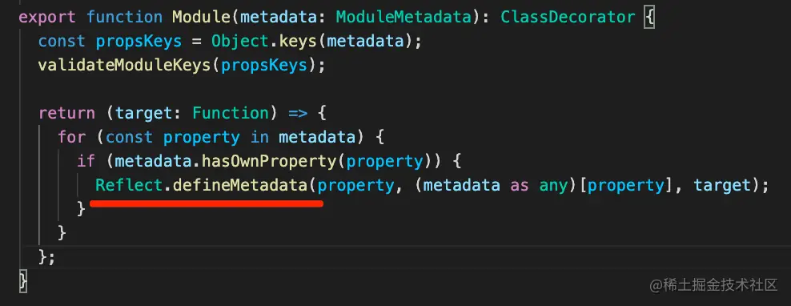

上面就是 @Module 装饰器的实现，里面就调用了 Reflect.defineMetadata 来给这个类添加了一些元数据。

所以我们这样用的时候：

    import { Module } from '@nestjs/common';
    import { CatsController } from './cats.controller';
    import { CatsService } from './cats.service';

    @Module({
      controllers: [CatsController],
      providers: [CatsService],
    })
    export class CatsModule {}

其实就是给 CatsModule 添加了 controllers 的元数据和 providers 的元数据。

后面创建 IOC 容器的时候就会取出这些元数据来处理：

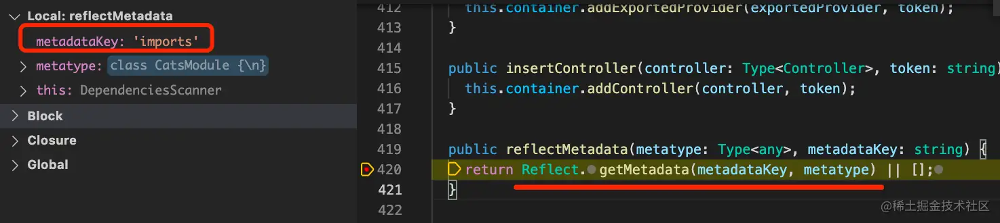

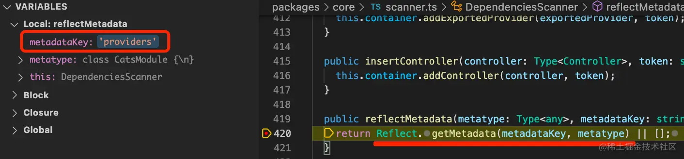

而且 @Controller 和 @Injectable 的装饰器也是这样实现的：

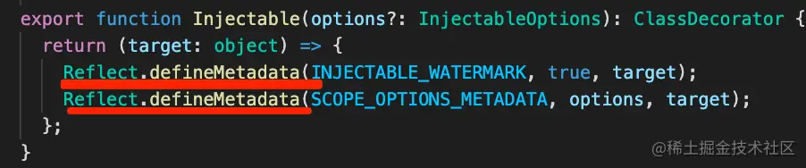

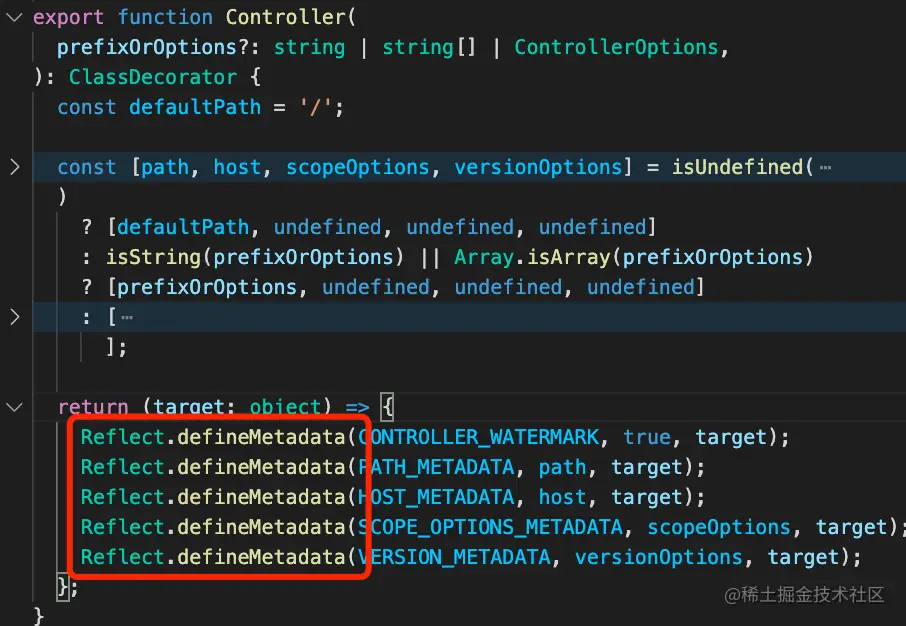

Nest 的实现原理就是通过装饰器给 class 或者对象添加元数据，然后初始化的时候取出这些元数据，进行依赖的分析，然后创建对应的实例对象就可以了。

所以说，nest 实现的核心就是 Reflect metadata 的 api。

当然，现在 metadata 的 api 还在草案阶段，需要使用 reflect-metadata 这个 polyfill 包才行。

其实还有一个疑问，依赖的扫描可以通过 metadata 数据，但是创建的对象需要知道构造器的参数，现在并没有添加这部分 metadata 数据呀：

比如这个 CatsController 依赖了 CatsService，但是并没有添加 metadata 呀：

```typescript
import { Body, Controller, Get, Param, Post } from '@nestjs/common';
import { CatsService } from './cats.service';
import { CreateCatDto } from './dto/create-cat.dto';

@Controller('cats')
export class CatsController {
  constructor(private readonly catsService: CatsService) {}

  @Post()
  async create(@Body() createCatDto: CreateCatDto) {
    this.catsService.create(createCatDto);
  }

  @Get()
  async findAll(): Promise<Cat[]> {
    return this.catsService.findAll();
  }
}
```

这就不得不提到 TypeScript 的优势了，TypeScript 支持编译时自动添加一些 metadata 数据：

比如这段代码：

    import "reflect-metadata";
     
    class Guang {
      @Reflect.metadata("名字", "光光")
      public say(a: number): string {
        return '加油鸭';
      }
    }

按理说我们只添加了一个元数据，生成的代码也确实是这样的：

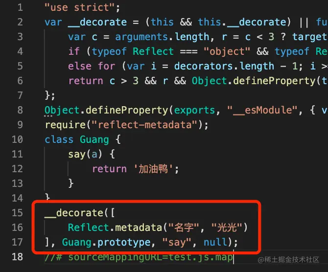

但是呢，ts 有一个编译选项叫做 emitDecoratorMetadata，开启它就会自动添加一些元数据。

开启之后再试一下：

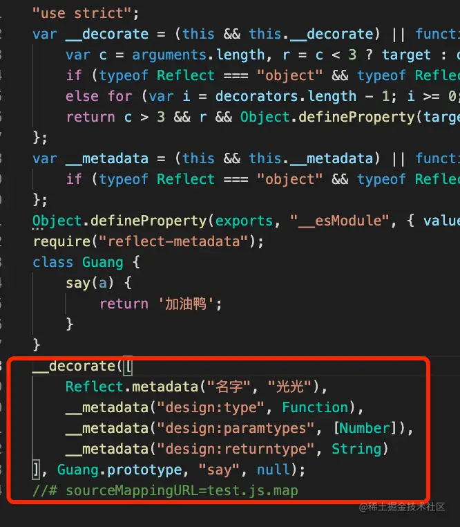

你会看到多了三个元数据：

design:type 是 Function，很明显，这个是描述装饰目标的元数据，这里装饰的是函数

design:paramtypes 是 \[Number]，很容易理解，就是参数的类型

design:returntype 是 String，也很容易理解，就是返回值的类型

所以说，只要开启了这个编译选项，ts 生成的代码会自动添加一些元数据。

然后创建对象的时候就可以通过 design:paramtypes 来拿到构造器参数的类型了，那不就知道怎么注入依赖了么？

所以，nest 源码里你会看到这样的代码：

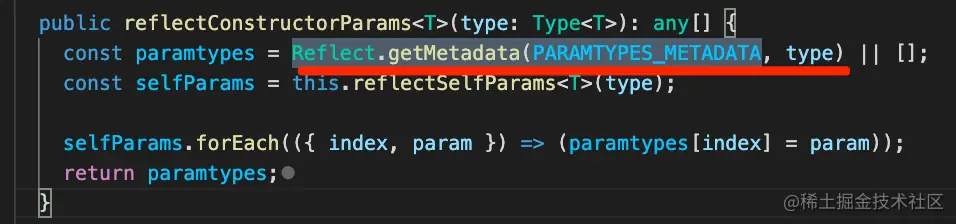

就是获取构造器的参数类型的。这个常量就是我们上面说的那个：

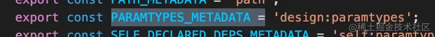

这也是为什么 nest 会用 ts 来写，因为它很依赖这个 emitDecoratorMetadata 的编译选项。

你用 cli 生成的代码模版里也都默认开启了这个编译选项：

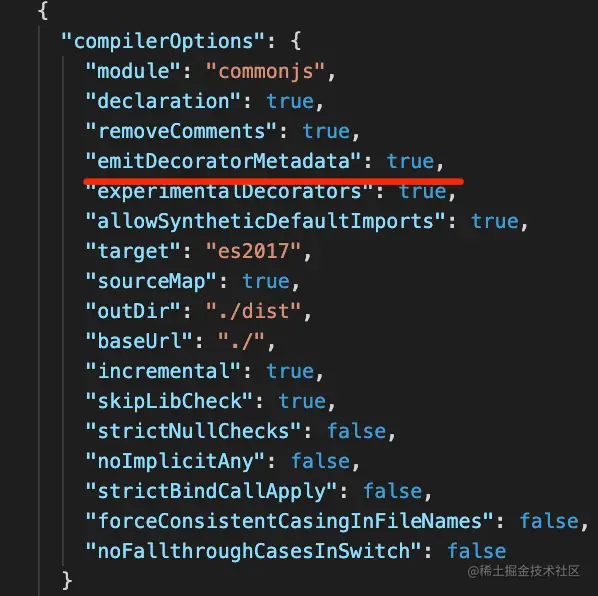

这就是 nest 的核心实现原理：**通过装饰器给 class 或者对象添加 metadata，并且开启 ts 的 emitDecoratorMetadata 来自动添加类型相关的 metadata，然后运行的时候通过这些元数据来实现依赖的扫描，对象的创建等等功能。**

Nest 的装饰器都是依赖 reflect-metadata 实现的，而且还提供了一个 @SetMetadata 的装饰器让我们可以给 class、method 添加一些 metadata：

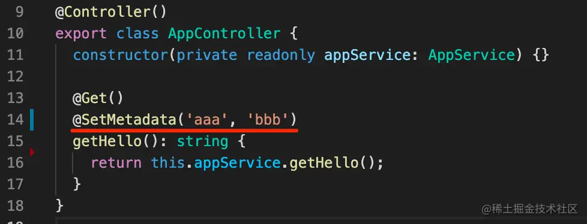

这个装饰器的底层实现自然是 Reflect.defineMetadata：

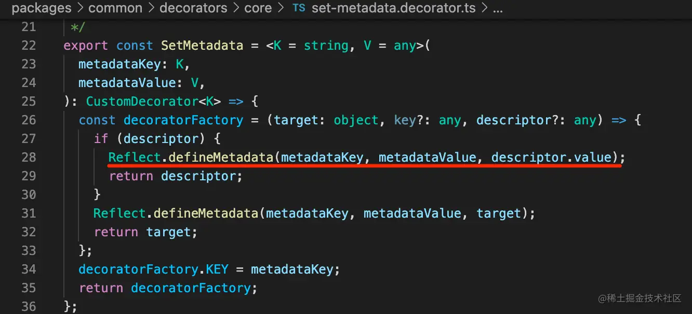

Nest 为什么暴露这样一个底层的 metadata api 出来呢？

因为这个 metadata 是可以在代码里取出来用的：

我们创建新项目来测试下：

    nest new metadata-and-reflector -p npm

创建 guard 和 interceptor：

    nest g interceptor aaa --flat --no-spec
    nest g guard aaa --flat --no-spec

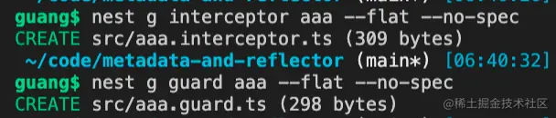

在路由级别应用：

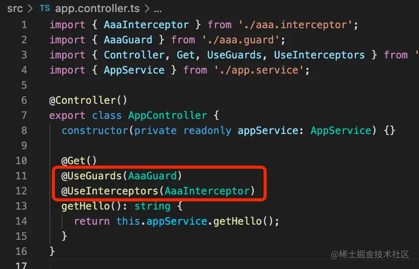

加个打印语句：

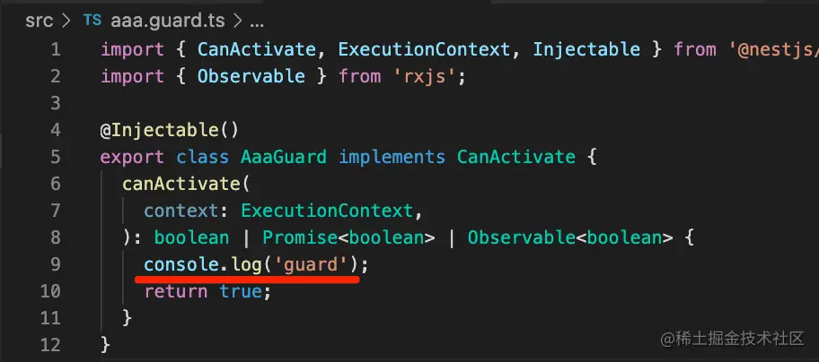

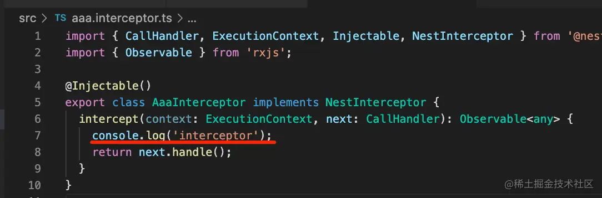

然后 nest start --watch 把服务跑起来。

浏览器访问：


可以看到 guard 和 interceptor 成功执行了：

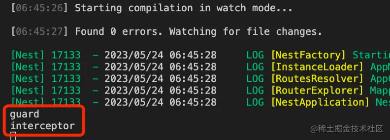

然后我们用 @SetMetadata 在 controller 上加个 metadata：

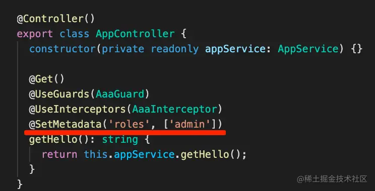

在 guard 和 interceptor 就就可以这样取出来：

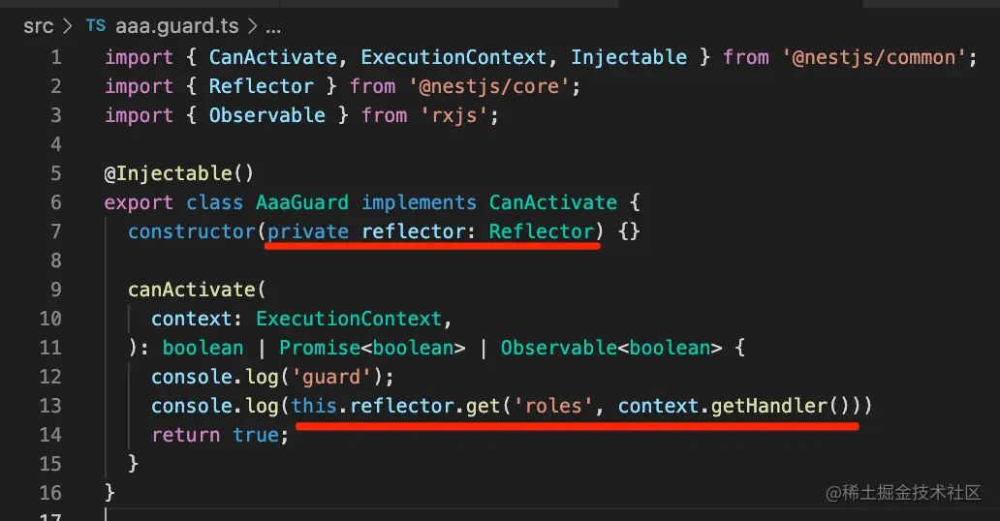

通过 ExecutationContext 取到目标 handler，然后注入 reflector，通过 reflector.get 取出 handler 上的 metadata。

interceptor 里也是这样，这里换种属性注入方式：

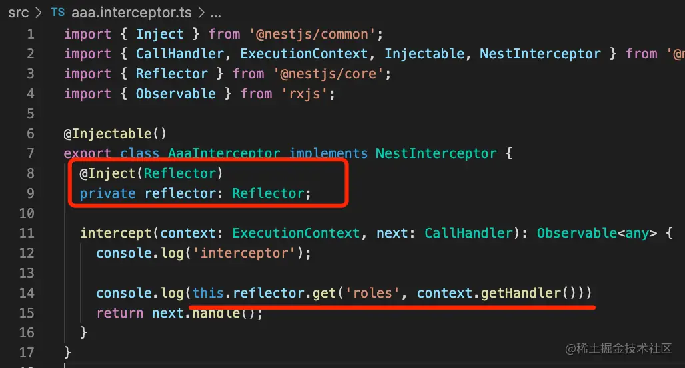

刷新下页面，就可以看到已经拿到了 metadata：

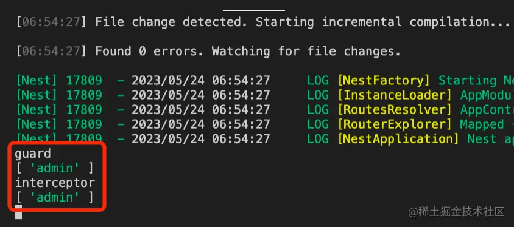

拿到 metadata 有什么用呢？

可以判断权限呀，比如这个路由需要 admin 角色，那可以取出 request 的 user 对象，看看它有没有这个角色，有才放行。

当然这只是一种用途。

除了能拿到 handler 上的装饰器，也可以拿到 class 上的：

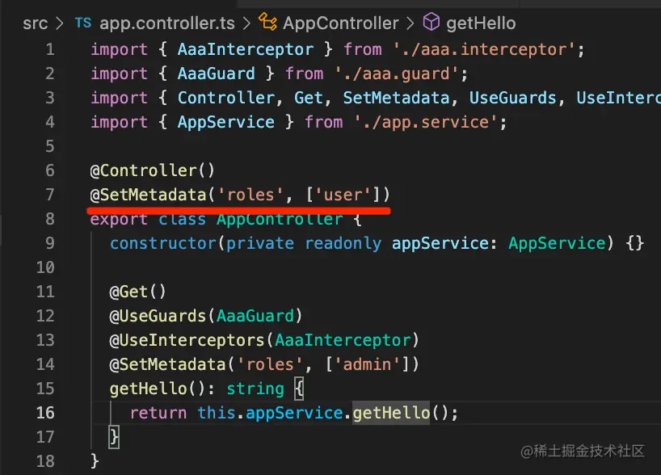

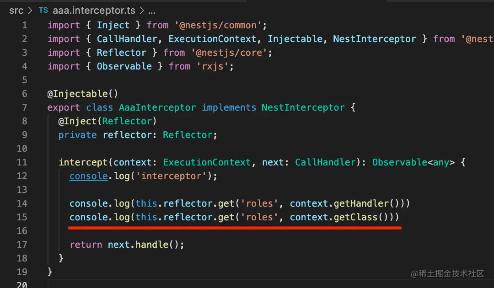

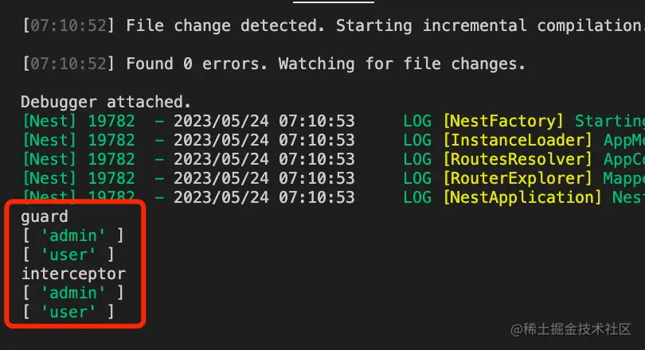

reflector 还有 3 个方法：

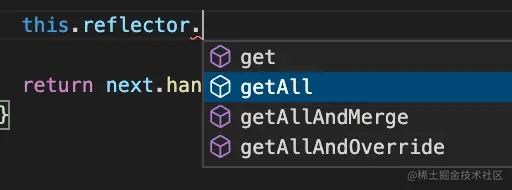

这 4 个方法有啥区别呢？

看下[它们的源码](https://github.com/nestjs/nest/blob/5bba7e9d264319490f142ca5e8099c559fa7e7e3/packages/core/services/reflector.service.ts#L11-L97)就知道了：

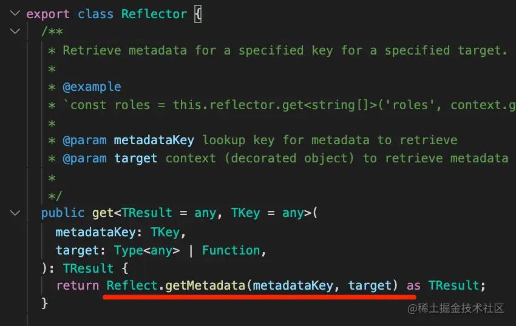

get 的实现就是 Reflect.getMetadata。

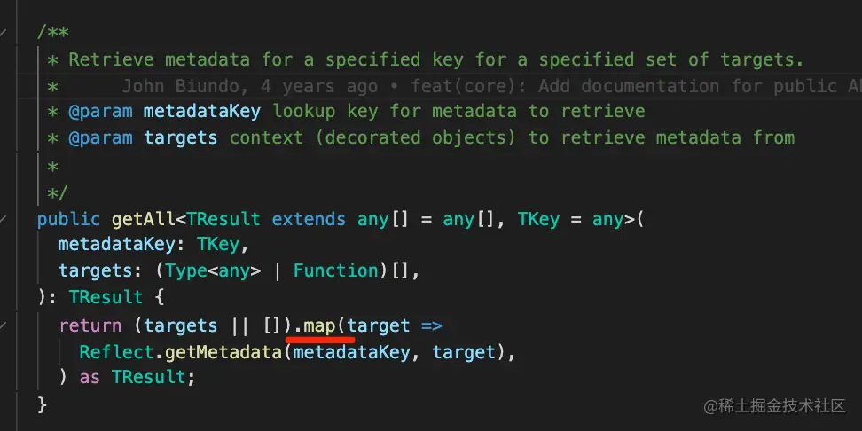

getAll 是返回一个 metadata 的数组。

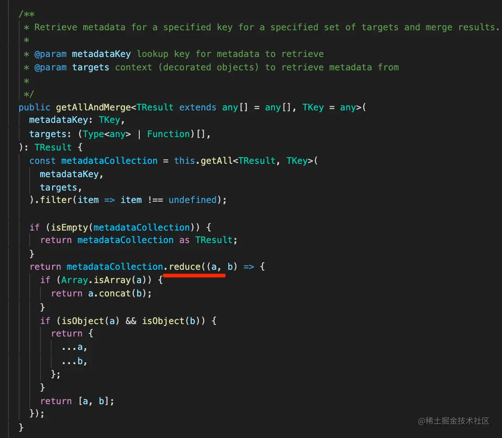

getAllAndMerge，会把它们合并为一个对象或者数组。

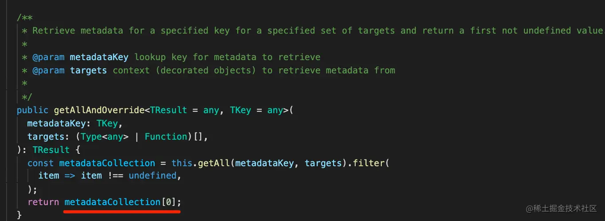

getAllAndOverride 会返回第一个非空的 metadata。

我们试一下：

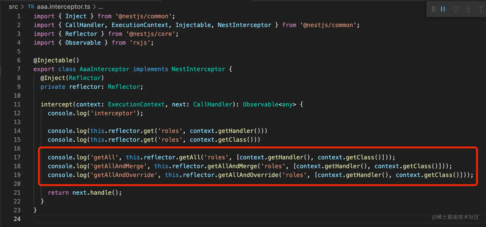

可以看到它们结果的区别：

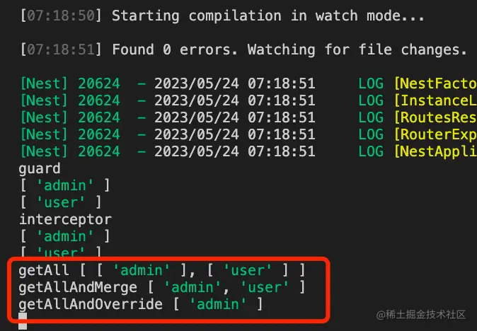

案例代码在[小册仓库](https://github.com/QuarkGluonPlasma/nestjs-course-code/tree/main/metadata-and-reflector)。

## 总结

Nest 的装饰器的实现原理就是 Reflect.getMetadata、Reflect.defineMetadata 这些 api。通过在 class、method 上添加 metadata，然后扫描到它的时候取出 metadata 来做相应的处理来完成各种功能。

Nest 的 Controller、Module、Service 等等所有的装饰器都是通过 Reflect.meatdata 给类或对象添加元数据的，然后初始化的时候取出来做依赖的扫描，实例化后放到 IOC 容器里。

实例化对象还需要构造器参数的类型，这个开启 ts 的 emitDecoratorMetadata 的编译选项之后， ts 就会自动添加一些元数据，也就是 design:type、design:paramtypes、design:returntype 这三个，分别代表被装饰的目标的类型、参数的类型、返回值的类型。

当然，reflect metadata 的 api 还在草案阶段，需要引入 reflect metadata 的包做 polyfill。

Nest 还提供了 @SetMetadata 的装饰器，可以在 controller 的 class 和 method 上添加 metadata，然后在 interceptor 和 guard 里通过 reflector 的 api 取出来。

理解了 metadata，nest 的实现原理就很容易搞懂了。
