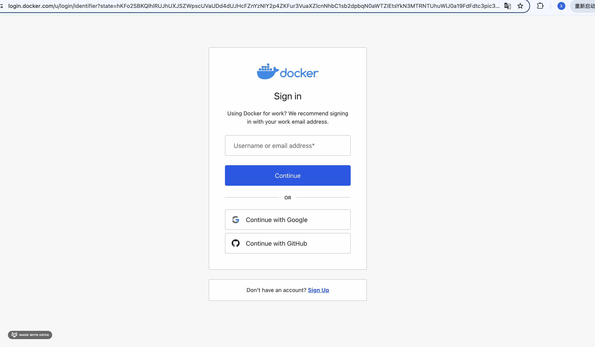
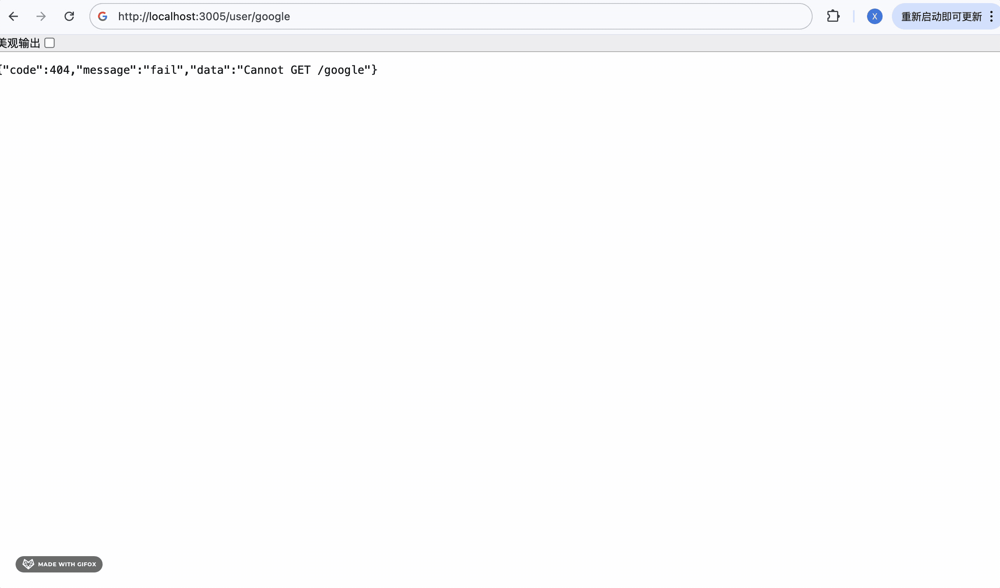
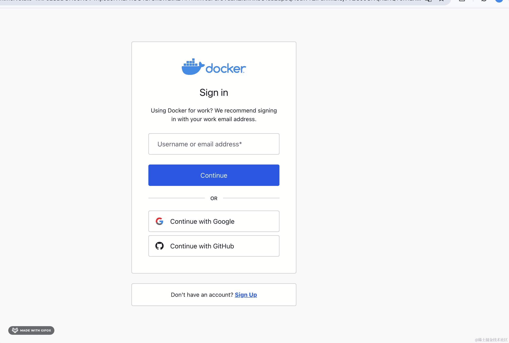
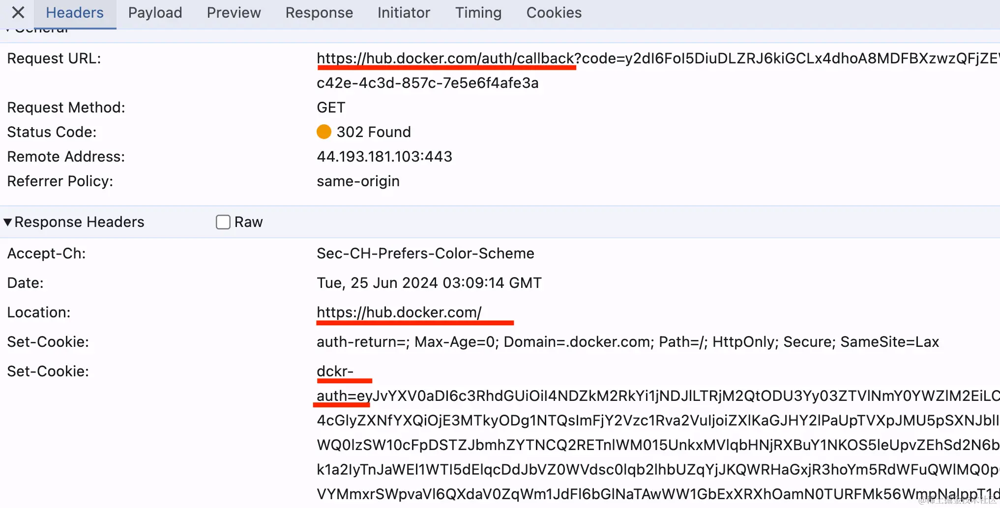

# 133. 会议室预定系统：Google 账号登录后端开发

我们的网站实现了用户名密码登录，用户忘记了密码也可以通过邮箱验证码来修改密码，之后再登录。


这样功能上没问题，但是不方便。

用户会访问很多个网站，如果每个网站都需要注册一个账号，那对于不常用的网站，很容易忘记账号密码。

解决方式就是支持三方账号登录。

比如 [dockerhub 的登录](https://login.docker.com/u/login)：


你可以登录 google、github 账号，然后授权，这样 dockerhub 网站就可以自动登录了。

根本不需要单独的账号密码。

原理就是他用你 github、google 的信息来给你创建了一个账号，之后只要是同样的 github、google 信息就可以自动登录了。

当你第一次授权的时候：



会跳到这个页面：


因为缺少了 username 的信息，你填上之后就可以注册了。

并且它还自动给你登录了：


然后退出登录用 google 账号登录一次：


因为你授权过，短时间内不需要再次授权，于是就直接登录了。

感受下现在的登录体验。

需要记住用户名密码么？

不需要。

你只需要点下 google 登录，然后授权，就自动登录了。

我们也在会议室预定系统里集成下 google 登录。

会用到 passport-google 的策略来做三方登录，所以要集成 passport。

进入 backend 项目，安装 passport 的包：

```
npm install --save @nestjs/passport passport
```
安装用户名密码认证的 passport-local 策略包：

```
npm install --save passport-local
npm install --save-dev @types/passport-local
```
然后创建一个认证模块：

```
nest g module auth
```


添加用户名密码认证的策略 auth/local.strategy.ts

```javascript
import { Strategy } from 'passport-local';
import { PassportStrategy } from '@nestjs/passport';
import { Injectable, UnauthorizedException } from '@nestjs/common';

@Injectable()
export class LocalStrategy extends PassportStrategy(Strategy) {

  async validate(username: string, password: string) {
    
  }
}
```

这里需要用到 UserService，在 UserModule 导出一下：


然后 AuthModule 引入 UserModule：


并把 LocalStrategy 声明为 provider。

LocalStrategy 里直接复用 userService.login 来做登录认证：


passport 会把返回的 user 信息放在 request.user 上。

然后 user/login 里就不需要手动调用 userService 了：


改成这样，用 AuthGuard('local') 来做处理即可，处理完从 reqeust.user 里拿 user 信息：


把服务跑起来：

```
npm run start:dev
```


然后进入 frontend_user 也把开发服务跑起来：

```
npm run start
```

当用户不存在：


当密码错误：


用户名密码都正确时：


没啥问题。

这样，我们的 passport 就集成成功了。

当然，passport-local、passport-jwt 都不集成也可以，直接用 passport-google 和 passport-github 就行。

各个策略都是独立的，可以单独使用。

下面我们来实现 google 和 github 登录：

上节我们实现了 Github 登录，这节继续来实现下 Google 登录。

在 [passport 的网站](https://www.passportjs.org/packages/)搜索：


找下载量最多的那个。

然后安装下：

```
npm install --save passport-google-oauth20
npm install --save-dev @types/passport-google-oauth20
```

获取 client id 和 client secret 的步骤[前面章节](https://juejin.cn/book/7226988578700525605/section/7376480527337193482)讲过。

授权的域名、callback url 要和应用中的对应才行，否则就重新搞一个。

我这里重新注册了一个应用，拿到了 client id：


创建 auth/google.strategy.ts

```javascript
import { Injectable } from '@nestjs/common';
import { PassportStrategy } from '@nestjs/passport';
import { Strategy } from 'passport-google-oauth20';

@Injectable()
export class GoogleStrategy extends PassportStrategy(Strategy, 'google') {
  constructor() {
    super({
      clientID: '535538293892-fso0juek6ag5eupus679gnrgt3g5gknq.apps.googleusercontent.com',
      clientSecret: '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',
      callbackURL: 'http://localhost:3005/user/callback/google',
      scope: ['email', 'profile'],
    });
  }

  validate (accessToken: string, refreshToken: string, profile: any) {
    const { name, emails, photos } = profile
    const user = {
      email: emails[0].value,
      firstName: name.givenName,
      lastName: name.familyName,
      picture: photos[0].value,
      accessToken
    }
    return user;
  }
}
```
这里填入刚刚的 clientID、clientSecret、callbackURL。

在 AuthModule 引入：


之后在 UserController 添加两个路由：


```javascript
@Get('google')
@UseGuards(AuthGuard('google'))
async googleAuth() {}

@Get('callback/google')
@UseGuards(AuthGuard('google'))
googleAuthRedirect(@Req() req) {
    if (!req.user) {
      return 'No user from google'
    }

    return {
      message: 'User information from google',
      user: req.user
    }
}
```
一个是触发登录的，一个是回调的。

测试下：



可以看到，google 的用户信息拿到了：


那我们只要在拿到用户信息的时候自动注册下就好了。

在 user.entity.ts 添加 loginType 字段：


```javascript
@Column({
    type: 'int',
    comment: '登录类型, 0 用户名密码登录, 1 Google 登录, 2 Github 登录',
    default: 0
})
loginType: LoginType;
```

```javascript
export enum LoginType {
    USERNAME_PASSWORD = 0,
    GOOGLE = 1,
    GITHUB = 2
}
```
默认是用户名密码登录，值是 0，当 google 或者 github 登录时，loginType 是 1 和 2。

因为前几节我们把 synchronize 关掉了，所以现在并不会自动创建这一列：


我们通过 migration:generate 生成个迁移：

```
npm run migration:generate src/migrations/add-user-loginType-column
```


生成的迁移类没问题：


跑一下：

```
npm run migration:run
```


在数据库看一下：


loginType 列添加成功了。


migrations 表也记录了这条执行记录。

然后补充下 google 授权后自动注册的逻辑：

在 UserService 里添加 registerByGoogleInfo 方法：


```javascript
async registerByGoogleInfo(email: string, nickName: string, headPic: string) {
    const newUser = new User();
    newUser.email = email;
    newUser.nickName = nickName;
    newUser.headPic = headPic;
    newUser.password = '';
    newUser.username = email + Math.random().toString().slice(2, 10);
    newUser.loginType = LoginType.GOOGLE;
    newUser.isAdmin = false;

    return this.userRepository.save(newUser);
}
```

email、nickName、headPic 都是基于 google 返回的信息。


username 我们就用 email + 随机数的方式生成，反正也不需要用用户名密码登录，保证唯一就行。

passport 也是一样。

在 UserController 调用下：

```javascript
@Get('callback/google')
@UseGuards(AuthGuard('google'))
async googleAuthRedirect(@Req() req) {
  if (!req.user) {
    throw new BadRequestException('google 登录失败');
  }
  const user = await this.userService.registerByGoogleInfo(
    req.user.email, 
    req.user.firstName + ' ' + req.user.lastName,
    req.user.picture
  );

  const vo = new LoginUserVo();
  vo.userInfo = {
      id: user.id,
      username: user.username,
      nickName: user.nickName,
      email: user.email,
      phoneNumber: user.phoneNumber,
      headPic: user.headPic,
      createTime: user.createTime.getTime(),
      isFrozen: user.isFrozen,
      isAdmin: user.isAdmin,
      roles: [],
      permissions: []
  }

  vo.accessToken = this.jwtService.sign({
    userId: vo.userInfo.id,
    username: vo.userInfo.username,
    email: vo.userInfo.email,
    roles: vo.userInfo.roles,
    permissions: vo.userInfo.permissions
  }, {
    expiresIn: this.configService.get('jwt_access_token_expires_time') || '30m'
  });

  vo.refreshToken = this.jwtService.sign({
    userId: vo.userInfo.id
  }, {
    expiresIn: this.configService.get('jwt_refresh_token_expres_time') || '7d'
  });

  return vo;
}
```
就是用 google 返回的信息来自动注册，并且自动登录，返回 accessToken 和 refreshToken。

测试下：


可以看到，google 授权之后，自动注册并返回了 token 信息，这样带上这个访问就是登录状态了：


数据库里 user 表也插入了该用户的记录：


nickName、headPic、username、loginType 都是对的。

后续 refreshToken 的流程不受影响，因为它只是取出 jwt 里的 userId 来查询用户信息并重新生成 token 返回：


然后继续处理 google 登录：

google 第一次账号授权会自动注册并登录，但是后续就不需要注册了。

所以我们要加个判断：


如果 email 能查到用户，那就直接登录：

```javascript
@Get('callback/google')
@UseGuards(AuthGuard('google'))
async googleAuthRedirect(@Req() req) {
  if (!req.user) {
    throw new BadRequestException('google 登录失败');
  }

  const foundUser = await this.userService.findUserByEmail(req.user.email);

  if(foundUser) {
    const vo = new LoginUserVo();
    vo.userInfo = {
        id: foundUser.id,
        username: foundUser.username,
        nickName: foundUser.nickName,
        email: foundUser.email,
        phoneNumber: foundUser.phoneNumber,
        headPic: foundUser.headPic,
        createTime: foundUser.createTime.getTime(),
        isFrozen: foundUser.isFrozen,
        isAdmin: foundUser.isAdmin,
        roles: foundUser.roles.map(item => item.name),
        permissions: foundUser.roles.reduce((arr, item) => {
            item.permissions.forEach(permission => {
                if(arr.indexOf(permission) === -1) {
                    arr.push(permission);
                }
            })
            return arr;
        }, [])
    }
    vo.accessToken = this.jwtService.sign({
      userId: vo.userInfo.id,
      username: vo.userInfo.username,
      email: vo.userInfo.email,
      roles: vo.userInfo.roles,
      permissions: vo.userInfo.permissions
    }, {
      expiresIn: this.configService.get('jwt_access_token_expires_time') || '30m'
    });

    vo.refreshToken = this.jwtService.sign({
      userId: vo.userInfo.id
    }, {
      expiresIn: this.configService.get('jwt_refresh_token_expres_time') || '7d'
    });
  
    return vo;
  } else {
    const user = await this.userService.registerByGoogleInfo(
      req.user.email, 
      req.user.firstName + ' ' + req.user.lastName,
      req.user.picture
    );

    const vo = new LoginUserVo();
    vo.userInfo = {
        id: user.id,
        username: user.username,
        nickName: user.nickName,
        email: user.email,
        phoneNumber: user.phoneNumber,
        headPic: user.headPic,
        createTime: user.createTime.getTime(),
        isFrozen: user.isFrozen,
        isAdmin: user.isAdmin,
        roles: [],
        permissions: []
    }

    vo.accessToken = this.jwtService.sign({
      userId: vo.userInfo.id,
      username: vo.userInfo.username,
      email: vo.userInfo.email,
      roles: vo.userInfo.roles,
      permissions: vo.userInfo.permissions
    }, {
      expiresIn: this.configService.get('jwt_access_token_expires_time') || '30m'
    });

    vo.refreshToken = this.jwtService.sign({
      userId: vo.userInfo.id
    }, {
      expiresIn: this.configService.get('jwt_refresh_token_expres_time') || '7d'
    });
  
    return vo;
  }
}
```
在 UserService 实现 findUserByEmail 方法：

```javascript
async findUserByEmail(email: string) {
    const user =  await this.userRepository.findOne({
        where: {
            email: email,
            isAdmin: false,
        },
        relations: [ 'roles', 'roles.permissions']
    });

    return user;
}
```

测试下：


数据库已经注册了这个 google 账号对应的 user，再次授权，会查询注册的用户信息返回。

可以看到，只执行了 select 语句：


但网站登录后一般都会重定向到首页：



这时候一般都是用 cookie 返回 token 的，比如 https://hub.docker.com 就是这么做的：



可以看到，它并不是直接返回 jwt 的 token，而是重定向回首页，在 cookie 里携带 token。

前端只要判断下如果 cookie 里有这些 token 就自动登录就好了。

我们也处理下：

操作 cookie 需要用到 cookie-parser 中间件：

```
npm install --save cookie-parser

npm install --save-dev @types/cookie-parser
```
在 main.ts 启用下：


在 callback/google 里注入 Response，设置 cookie：


然后重定向：


试一下：


重定向没问题。

cookie 也没问题：


此外，我们还要处理下普通的登录，用户名密码登录的时候要过滤下 loginType：


google 登录的账号是不能通过用户名密码登录的。

这样，google 登录的后端部分就完成了。

案例代码上传了[小册仓库](https://github.com/QuarkGluonPlasma/nestjs-course-code/tree/main/meeting_room_booking_system_backend)

## 总结

我们的应用之前只支持用户名密码登录，今天实现了 google 登录的后端部分。

首先我们把用户名密码的身份认证改成了用 passport。

当然，这不是必须的，每个策略都是可以独立用的。

然后我们创建了新的 google 应用，拿到 client id 和 client secret。

用 passport-google-oauth20 的策略来实现了 google 登录。

在 callback 的路由里，基于 google 返回的信息做了自动注册，如果用户已经注册过，就直接返回登录信息。

google 登录的 callback 里重定向到网站首页，然后通过 cookie 携带 userInfo、accessToken、refreshToken 等信息。

前端代码再处理下 cookie，同步登录状态就好了。
