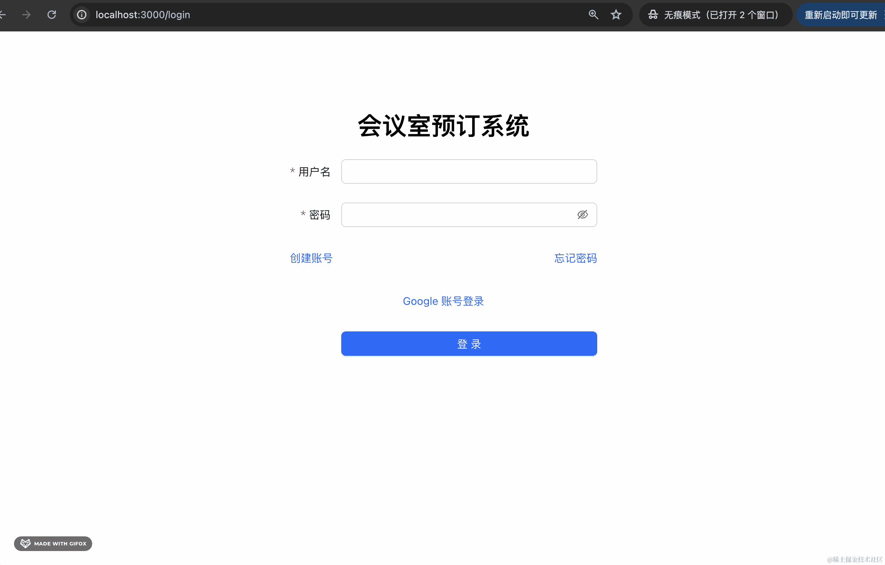
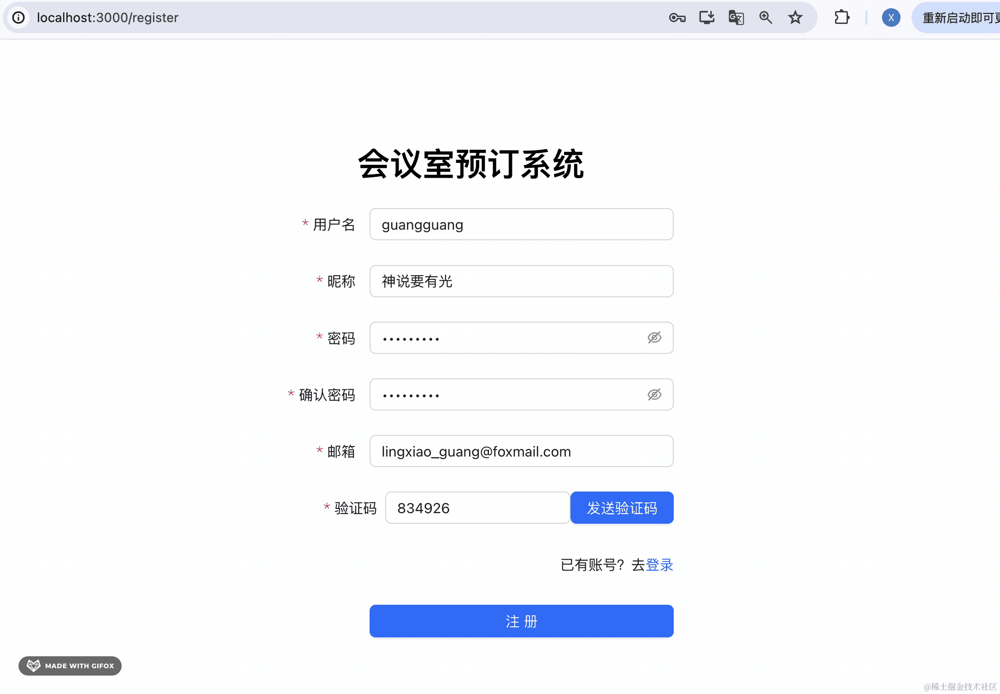
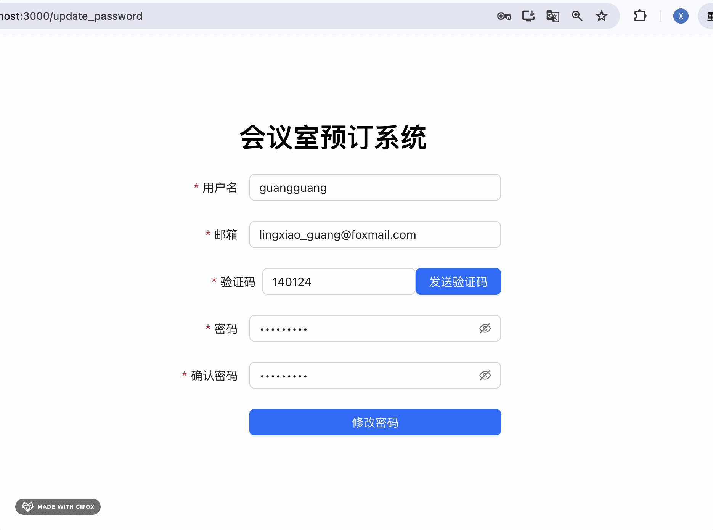
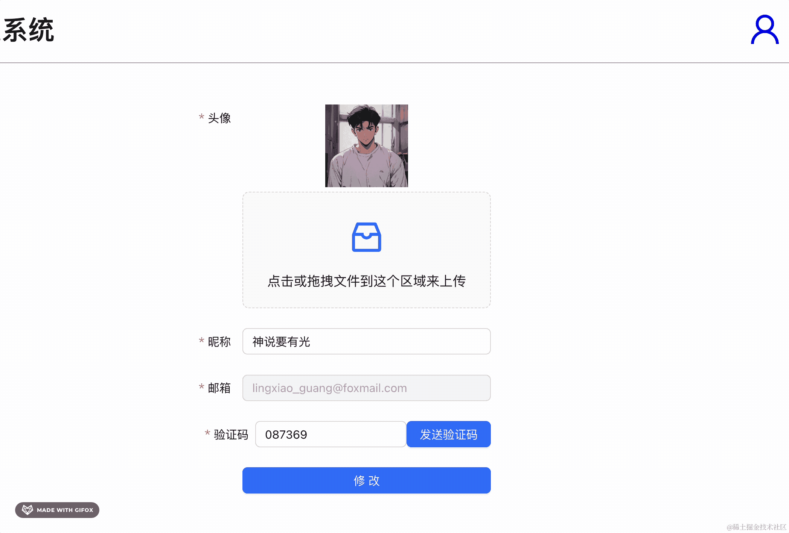
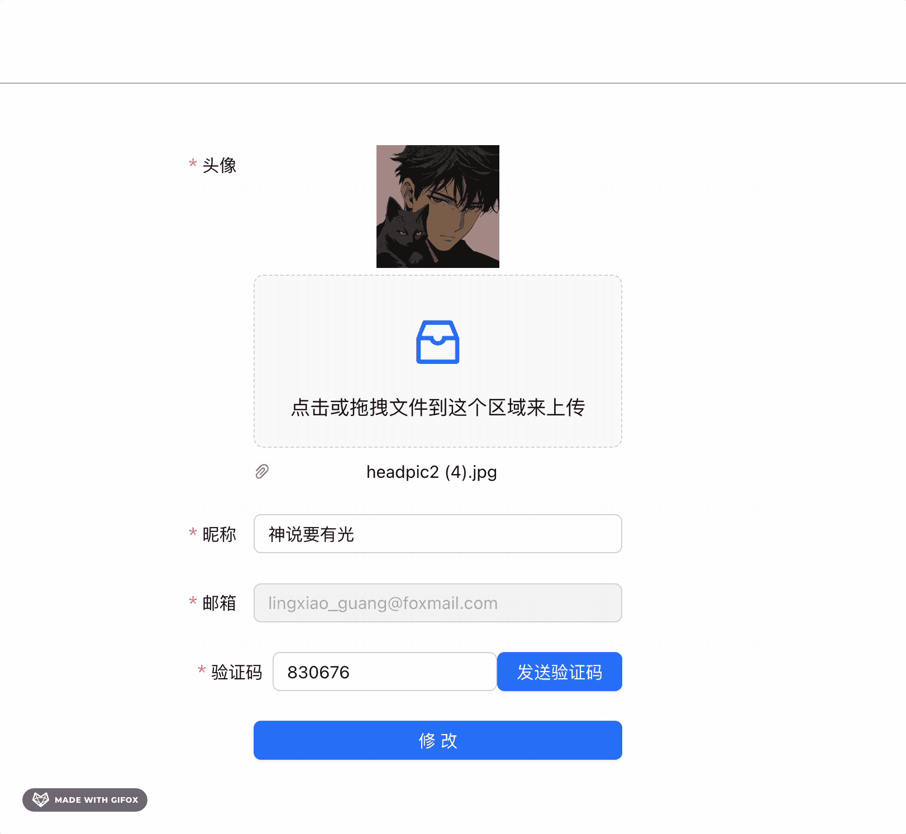
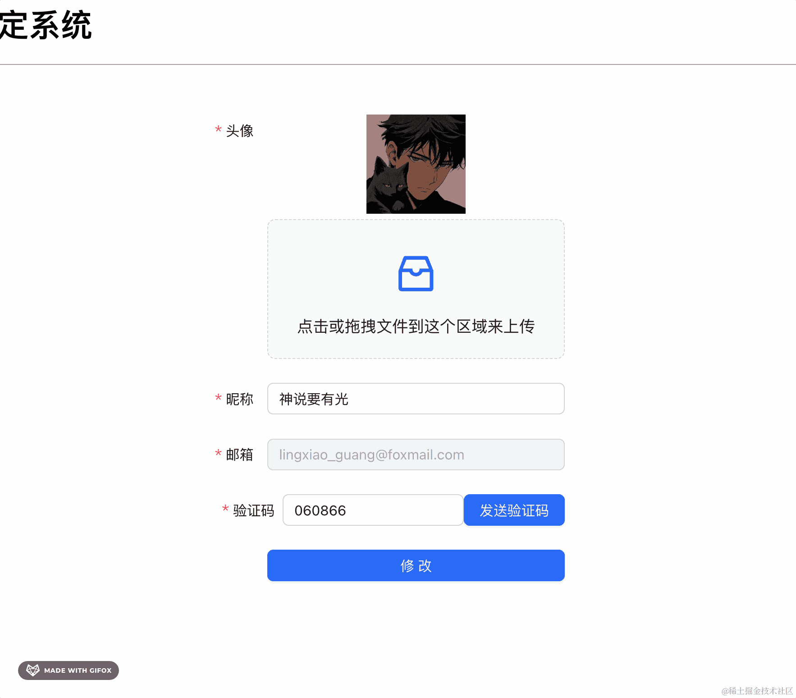
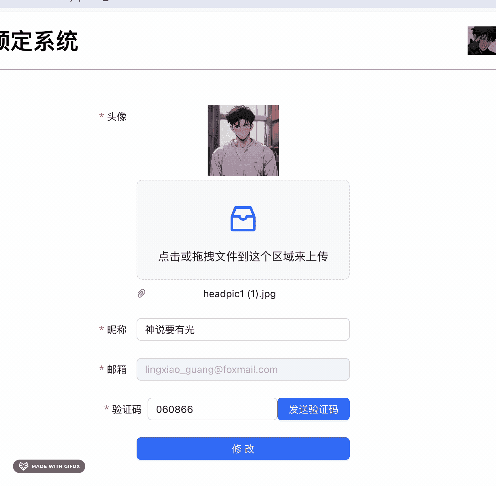

会议室预定系统的后端功能我们实现的差不多了，但是代码层面还是有很多可以优化的地方。

这节我们集中优化下。

## .env

我们在 .env 文件里保存着 redis、mysql、nodemailer、nest 服务、jwt、minio 的配置：


其实 google 登录的 client id 和 client secret 也应该在这里配置。


```
# 135. 会议室预定系统：后端代码优化
google_login_client_id=xxx
google_login_client_secret=xxx
google_login_callback_url=http://localhost:3005/user/callback/google
```
然后 google.strategy.ts 里取出来：


```javascript
constructor(configService: ConfigService) {
    super({
      clientID: configService.get('google_login_client_id'),
      clientSecret: configService.get('google_login_client_secret'),
      callbackURL: configService.get('google_login_callback_url'),
      scope: ['email', 'profile'],
    });
}
```
测试下：



没啥问题。

其实这个 client id 是测试用的，线上的肯定要另外申请，因为线上肯定不会是 http://localhost:3005 的域名。


也就是说，dev 环境和 prod 环境的 .env 是不同的。

所以我们要支持多个环境的 .env 的加载。

新建一个 src/.dev.env 的配置文件：


其他配置都一样，只是把启动端口改为 3006

然后 ConfigModule 的 envFilePath 指定多个 .env 文件：


```javascript
ConfigModule.forRoot({
  isGlobal: true,
  envFilePath: [ path.join(__dirname, '.env'), path.join(__dirname, '.dev.env')]
}),
```
当指定多个 .env 文件时，配置会做合并，但是相同的 key 前面的配置生效。

也就是说有 .env 的时候，它的配置优先生效。

跑起来试下：


端口是 3005。

删掉 .dev.env 再跑试试：


现在就是跑在 .env 里配置的 3006 端口了，也就是 .dev.env 生效了。

而且这个 .env 也可以不提交到 git 仓库，部署的时候手动把文件复制过去。

这样就没有泄漏的风险了。

这样，本地测试的配置写在 .dev.env 里，而线上生产环境的配置写在 .env 里。

## docker-compose.yml

前面章节添加了 minio 做 OSS 文件存储，但是并没有把它加到 docker compose 配置文件里。

我们加一下：


```yml
minio-container:
  image: bitnami/minio:latest
  ports:
    - 9000:9000
    - 9001:9001
  volumes:
    - /Users/guang/minio:/bitnami/minio/data
  environment:
    MINIO_ROOT_USER: guang
    MINIO_ROOT_PASSWORD: dongdong
  networks:
    - common-network
```
虽然有了桥接网络，多个容器之间可以通过容器名访问，但是这个 minio 还是需要暴露端口出来的。

因为管理界面、保存在 minio 的图片都需要直接访问。

把配置文件里的连接配置都改为容器名：


注释掉 fe 的容器，并且给 nest 容器映射下 3005 端口：


这里只测试下 nest 服务和 minio 服务就好了。

跑一下：

```
docker-compose up
```

注意，要先把你本地的 minio 容器停掉，不然 9000、9001 是被占用的。

nest 和 minio 都跑起来了：


浏览器访问下 minio 管理页面 http://localhost:9001/


没啥问题。

访问下 minio 预签名的接口：


也没问题，说明 nest 连接 minio 也是成功的。

回过头来，我们再来优化下 docker-compose.yml


可以通过 command 指定容器启动时执行的命令。

我们在 mysql 容器启动的时候，修改默认字符集为 utf8


```yml
command: mysqld --character-set-server=utf8mb4 --collation-server=utf8mb4_general_ci # 设置默认字符集
```
此外，每个容器都应该加上重启策略：


当容器意外停掉时重启。

## dto

在[如何灵活创建 dto](https://juejin.cn/book/7226988578700525605/section/7361740248814747700) 那节讲过，可以用 @nestjs/mapped-types 的 PartialType、PickType、OmitType、IntersectionType 来灵活创建 dto。

- PickType 是从已有 dto 类型中取某个字段。

- OmitType 是从已有 dto 类型中去掉某个字段。

- PartialType 是把 dto 类型变为可选。

- IntersectionType 是组合多个 dto 类型。

用这些方法，可以轻松的基于已有 dto 创建出新的 dto。

我们改造下现有 dto：

比如 LoginUserDto：


它的 username 和 password 在 RegiseterUserDto 里就可以复用：


而 UpdateUserPasswordDto 和 UpdateUserDto 也可以复用 RegisterUserDto 的某些字段：


所以 RegisterUserDto 可以简化成这样：


```javascript
import { ApiProperty } from "@nestjs/swagger";
import { IsEmail, IsNotEmpty, MinLength } from "class-validator";
import { LoginUserDto } from "./login-user.dto";
import { PickType } from "@nestjs/mapped-types";

export class RegisterUserDto extends PickType(LoginUserDto, ['username', 'password']){
    @IsNotEmpty({
        message: '昵称不能为空'
    })
    @ApiProperty()
    nickName: string;

    @IsNotEmpty({
        message: '邮箱不能为空'
    })
    @IsEmail({}, {
        message: '不是合法的邮箱格式'
    })
    @ApiProperty()
    email: string;
    
    @IsNotEmpty({
        message: '验证码不能为空'
    })
    @ApiProperty()
    captcha: string;
}
```
继承 LoginUserDto 里的两个字段。

而 UpdateUserPasswordDto 的字段可以全部从 RegisterUserDto 继承：


```javascript
import { ApiProperty, PickType } from "@nestjs/swagger";
import { IsEmail, IsNotEmpty, MinLength } from "class-validator";
import { LoginUserDto } from "./login-user.dto";
import { RegisterUserDto } from "./register-user.dto";

export class UpdateUserPasswordDto extends PickType(RegisterUserDto, ['email', 'captcha', 'username', 'password']){
}
```
UpdateUserDto 也是可以复用 RegisterUserDto 的大部分字段：


```javascript
import { ApiProperty } from "@nestjs/swagger";
import { IsEmail, IsNotEmpty } from "class-validator";
import { RegisterUserDto } from "./register-user.dto";
import { IntersectionType, PartialType, PickType } from "@nestjs/mapped-types";

export class UpdateUserDto extends PickType(RegisterUserDto, ['email', 'captcha']){

    @ApiProperty()
    headPic: string;

    @ApiProperty()
    nickName: string;
}
```
把 frontend_user 跑起来，测试下这些功能：

注册：


修改密码：


登录：


修改个人信息：



都没问题。

## captcha

现在的验证码其实有个问题：



发送了一个邮箱验证码之后下次修改信息还可以用这个验证码。

因为在 redis 里这个验证码会保存 10 分钟：


其实应该用完一次就删掉的。

我们在 RedisSercie 添加一个 del 方法：


```javascript
async del(key: string) {
    await this.redisClient.del(key);
}
```
更新完信息就调用它删掉验证码：


```javascript
@Post(['update', 'admin/update'])
@RequireLogin()
async update(@UserInfo('userId') userId: number, @Body() updateUserDto: UpdateUserDto) {
    const res = await this.userService.update(userId, updateUserDto);

    this.redisService.del(`update_user_captcha_${updateUserDto.email}`);

    return  res;
}
```


```javascript
@Post(['update_password', 'admin/update_password'])
async updatePassword(@Body() passwordDto: UpdateUserPasswordDto) {
    const res = await this.userService.updatePassword(passwordDto);

    this.redisService.del(`update_password_captcha_${passwordDto.email}`);

    return res;
}
```

测试下：



现在一个验证码就只能用一次了。

只不过提示不大对，应该提示这个：


改一下 front_user 项目里 UpdateInfo 组件的 onFinish 的处理：


状态码非 20x 的时候展示返回的错误信息。



现在就对了。

front_admin 项目里的 InfoModify 组件也要做同样的修改：


案例代码上传了[小册仓库](https://github.com/QuarkGluonPlasma/nestjs-course-code/tree/main/meeting_room_booking_system_backend)

## 总结

这节我们对后端代码做了一些优化：

- .env：分开了 .dev.env 和 .env 分别用于开发和生产环境，分别用不同的配置。
- docker-compose.yml：添加了 minio 的容器，和 nest 集成成功，并且添加了 mysql 容器启动时设置字符集的命令，还添加了 restart 容器重启配置
- dto：用 mapped-types 包的 PickTypes 等 api 对 dto 做了简化，直接复用已有 dto 的字段
- captcha：验证码用完之后就从 redis 中删掉，并且前端提示验证码失效

开发的时候只想着完成功能，但代码中有很多可以优化的点，这些可以逐步优化。
