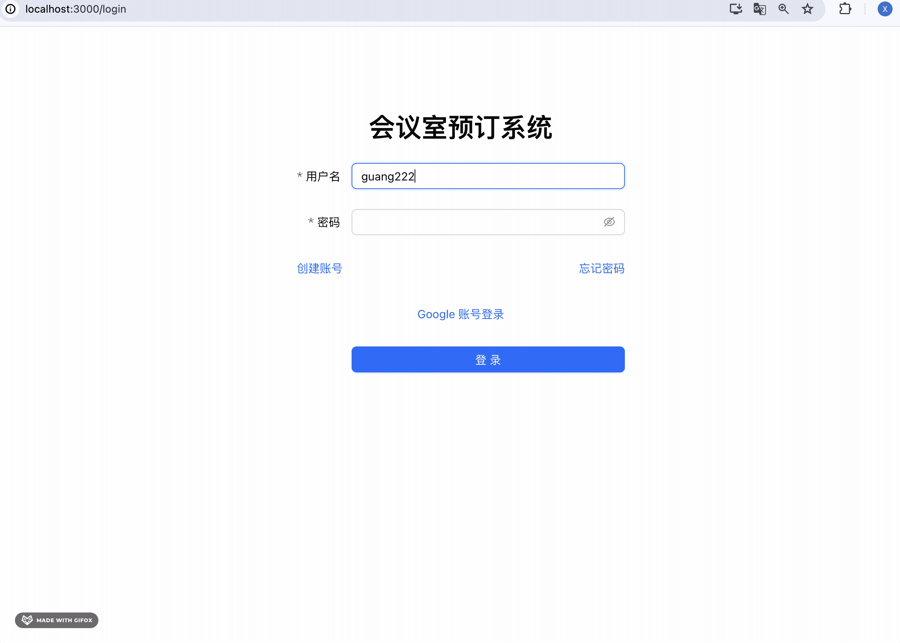
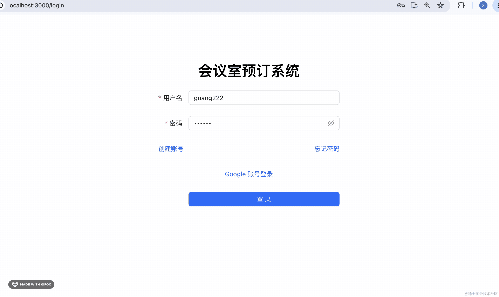

# 138. 会议室预定系统：全部功能测试

做完项目之后，我们整体测试一下。

按照当时的分析出的功能来测：

首先是普通用户的：

## 普通用户


进入 backend 和 frontend_user 项目，跑起来。

```
npm run start:dev
```


```
npm run start
```


### 注册

首先填入信息，发送验证码：


用户名要求唯一：


注册成功后我们登录下：

### 登录



刚才注册的账号可以登录。

然后还可以 google 账号直接登录，不需要注册：


### 修改密码

填入用户名、邮箱，点击发送验证码：


（其实当时邮箱应该添加唯一约束，也就是能唯一确定用户，这样就可以不需要填用户名了）


修改成功。

再登录下：



没问题。

### 修改个人信息

继续看当时分析的普通用户的需求：


登录后可以修改个人信息。


修改下头像：


没问题。

### 会议室列表

可以查看会议室列表，根据名称、容纳人数、设备来搜索会议室：


### 提交预定申请

选择好会议室之后可以提交预定申请：


填入预定时间、备注之后，可以提交预定申请：


然后在预定历史里就可以看到这次预定。

当然，你可以可以取消预定：


这样该预定记录就会回到已解除状态。

## 管理员

接下来我们进入管理员界面：

登录和修改密码和普通用户差不多。

我们来测试下各种管理功能：


### 用户管理

进入 frontend_admin 项目，跑起来：

```
npm run start
```
然后登录下：


可以按照用户名、昵称、邮箱来搜索用户：


（这个冻结功能目前没啥用，可以去掉）

### 会议室管理

可以按照名称、人数、设备来搜索会议室：


可以添加会议室：


之后在用户端这边也可以看到这个会议室了：


当然，也可以更新信息和删除：


### 预定管理

预定管理可以按照预定人、会议室名称、预定时间、位置等来搜索预定申请：


比如我们在用户端申请一个：


这时候管理端就可以看到这个申请了：


点击通过，然后在用户端就可以看到审批通过了：


这时候该会议室该时间段就不能再被预定：


### 统计

这个模块就是可以查看哪些会议室在过去一段时间内被预定的频率高，哪些用户使用会议室的频率高：


## 总结

我们按照最初的需求分析来过了一遍系统的功能。

我们首先测了注册、登录、修改密码、google 登录这些通用功能。

用户端可以搜索会议室、提交预定申请。

管理端可以审批预定申请，管理会议室、查看统计等。

整个流程是没问题的。

项目部署上线之后，就可以投入使用了。
