# 140. Nest 如何创建微服务？

前面我们写了很多 Http 服务了，这些服务都是单体架构的。

单体架构就是所有业务逻辑都在一个服务里实现。

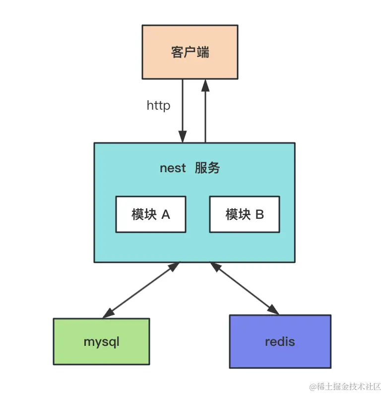

这样有个问题：

项目越来越大之后，模块越来越多，代码会越来越难以维护。

并且因为代码都在一个项目里，不好扩展。比如有的业务模块想多部署几个节点就做不到，只能整体扩展。

所以就有了拆分的需求，把业务模块拆成单独的微服务：

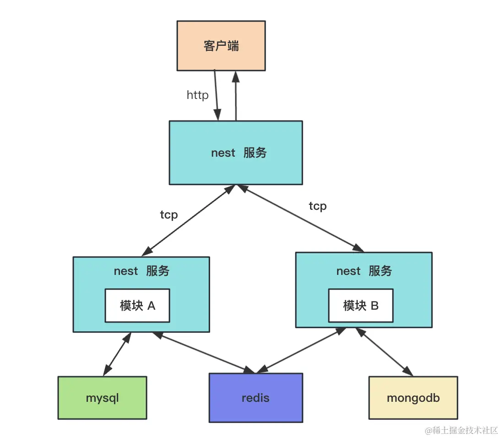

拆分也很简单，就是把之前放在不同目录的业务模块放到不同的服务里，再加上通信就好了。

不过微服务和微服务之间一般不是用 http 来通信的。

为什么呢？

因为 http 的请求响应会携带大量的 header：

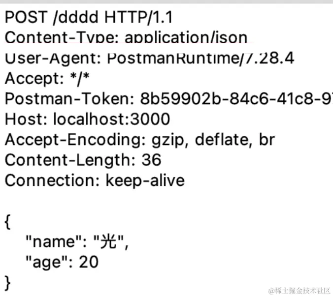

这些增大了通信的开销。

所以服务和服务之间没必要用 http，直接用 tcp 就好了。

nest 里实现微服务以及之间的 tcp 通信也很简单，下面我们来写一下。

创建个 nest 项目:

```
nest new microservice-test-main
```

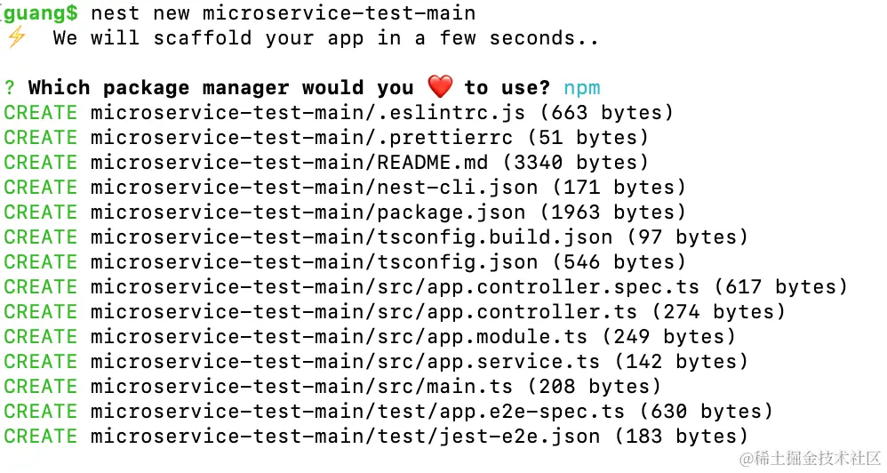

再创建一个：

```
nest new microservice-test-user
```
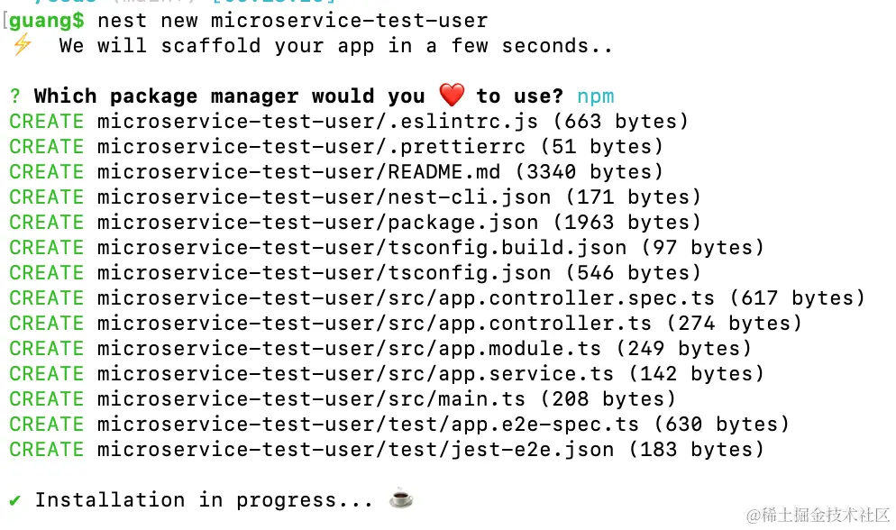

前面那个作为 http 服务向外提供接口，后面这个是微服务，提供 tcp 的微服务通信端口。

进入 microservice-test-user

安装微服务的包：

```
npm install @nestjs/microservices --save
```
然后修改下应用启动方式：

之前这个是启动 http 服务的：

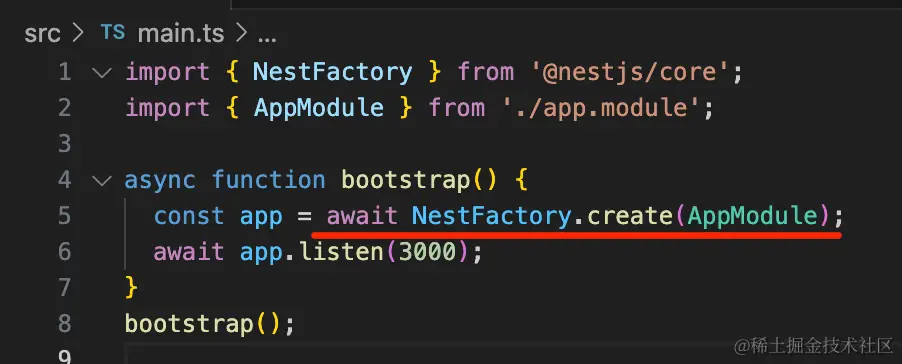

微服务不需要暴露 http 接口，只需要支持微服务的通信就行。

改成这样：

```javascript
import { NestFactory } from '@nestjs/core';
import { Transport, MicroserviceOptions } from '@nestjs/microservices';
import { AppModule } from './app.module';

async function bootstrap() {
  const app = await NestFactory.createMicroservice<MicroserviceOptions>(
    AppModule,
    {
      transport: Transport.TCP,
      options: {
        port: 8888,
      },
    },
  );
  app.listen();
}
bootstrap();
```

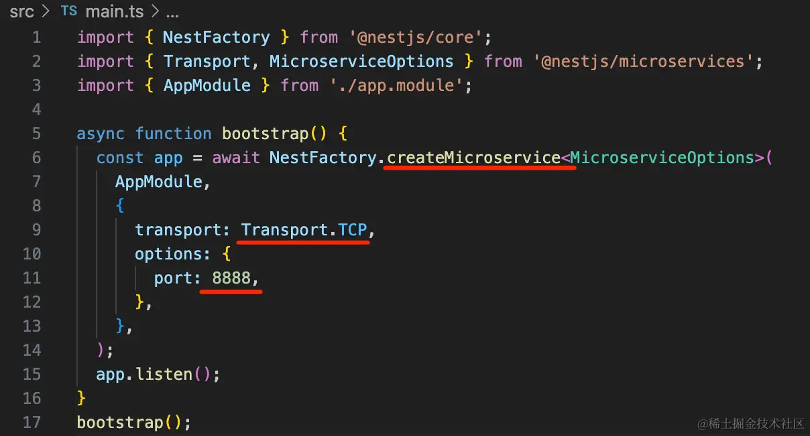

这就是启动一个微服务，通信端口在 8888，用 TCP 方式通信。

然后暴露个方法出去。

这里暴露接口不再是 http 时的 @Get、@Post 了，而是这样：

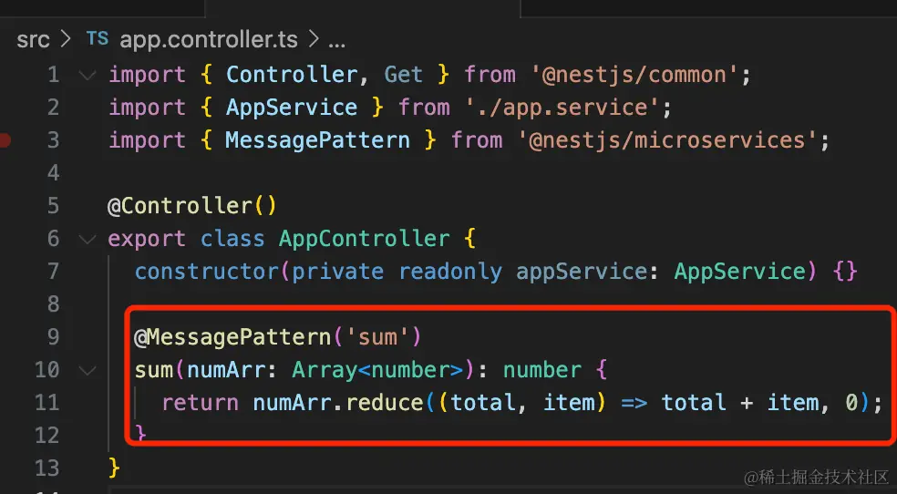

```javascript
@MessagePattern('sum')
sum(numArr: Array<number>): number {
    return numArr.reduce((total, item) => total + item, 0);
}
```
很容易理解，就是消息匹配什么模式，然后调用这个方法，处理参数，返回结果。

我们接收一个数字数组，返回所有数字的和。

这样，我们就创建了一个微服务：

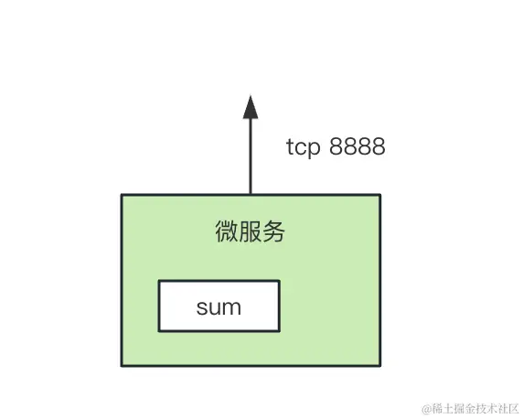

然后在 microservice-test-main 这个服务里连上它。

进入 microservice-test-main

安装微服务相关的包：

```
npm install @nestjs/microservices --save
```
然后做什么呢？

很明显，要引入连接微服务的客户端。

在 AppModule 引入 ClientsModule 动态模块：

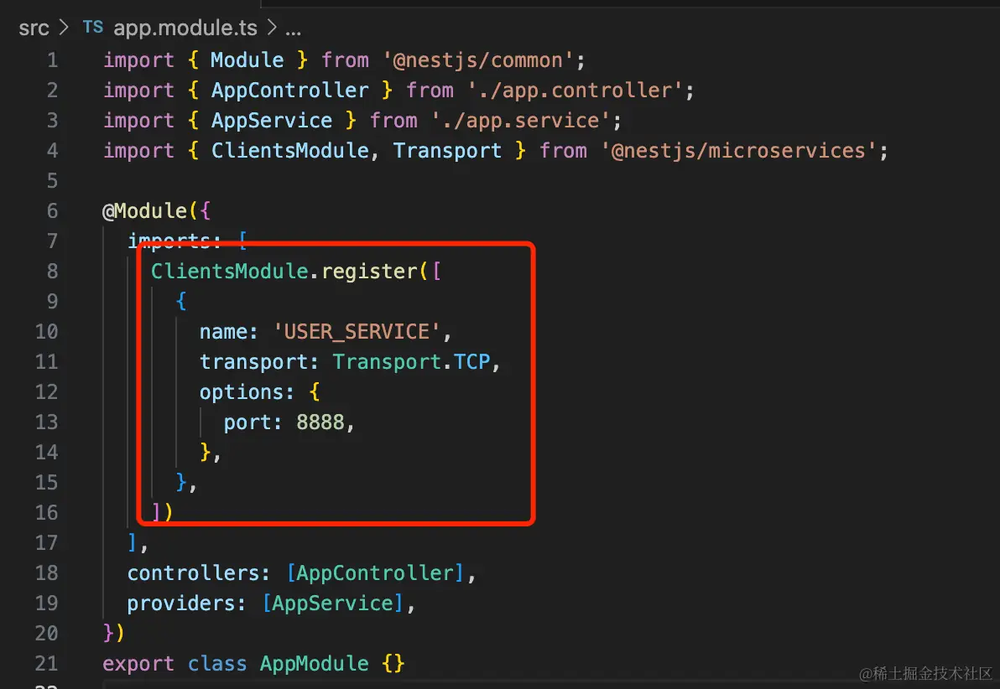

ClientsModule 的动态模块有 register、registerAsync 方法。

我们之前用过的 JwtModule 也是 register、registerAsync，这是动态模块的方法名规范。（忘记的同学回过头看下动态模块那一节）

```javascript
import { Module } from '@nestjs/common';
import { AppController } from './app.controller';
import { AppService } from './app.service';
import { ClientsModule, Transport } from '@nestjs/microservices';

@Module({
  imports: [
    ClientsModule.register([
      {
        name: 'USER_SERVICE',
        transport: Transport.TCP,
        options: {
          port: 8888,
        },
      },
    ])
  ],
  controllers: [AppController],
  providers: [AppService],
})
export class AppModule {}
```
这里的 register 参数是一个数组，也就是说你有多个微服务的时候，都依次写在这里就行。

引入了 ClientsModule 模块，就可以注入其中的 provider 来用了。

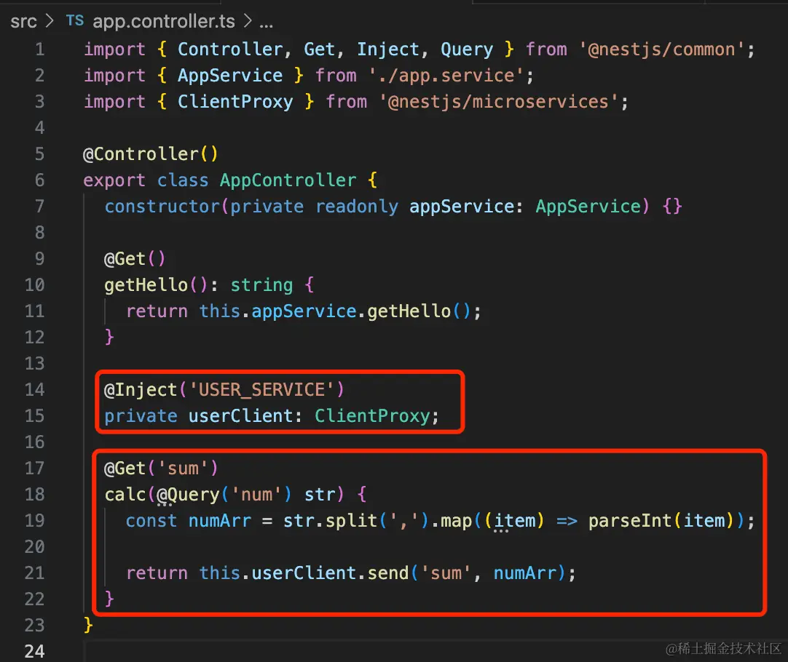

```javascript
@Inject('USER_SERVICE')
private userClient: ClientProxy;

@Get('sum')
calc(@Query('num') str) {
    const numArr = str.split(',').map((item) => parseInt(item));

    return this.userClient.send('sum', numArr);
}
```
注入的时候指定 token 为前面我们声明的微服务名字：

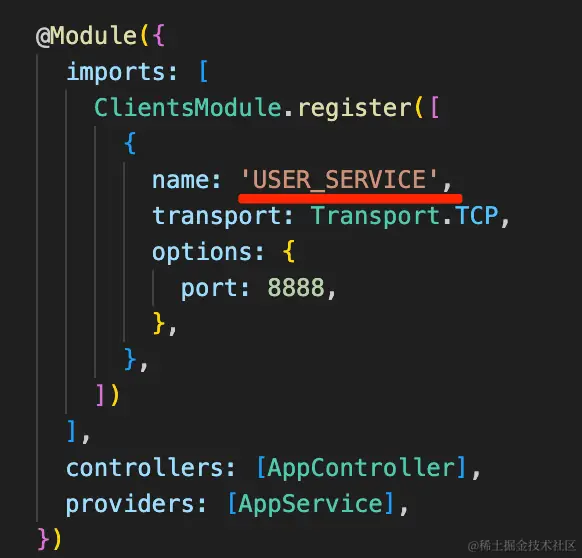

注入的对象就是连接这个微服务的客户端代理：

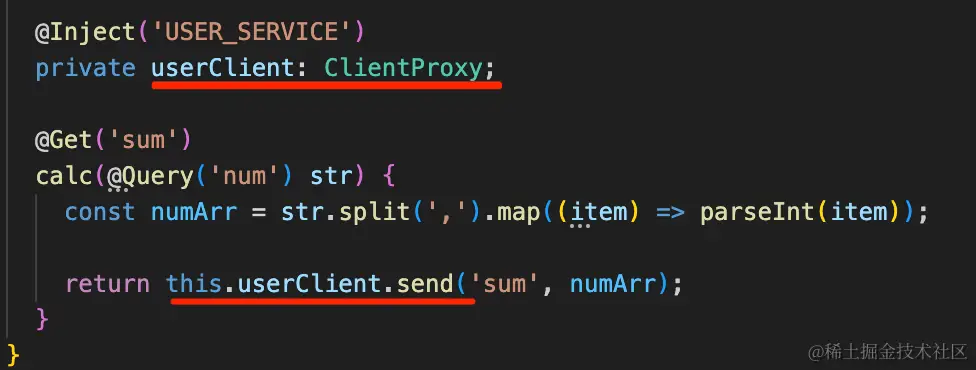

调用它的 send 方法，第一个是消息的名字，第二个是参数。

这里的 sum 就是微服务那边声明的这个消息，而参数就是那边声明的参数:

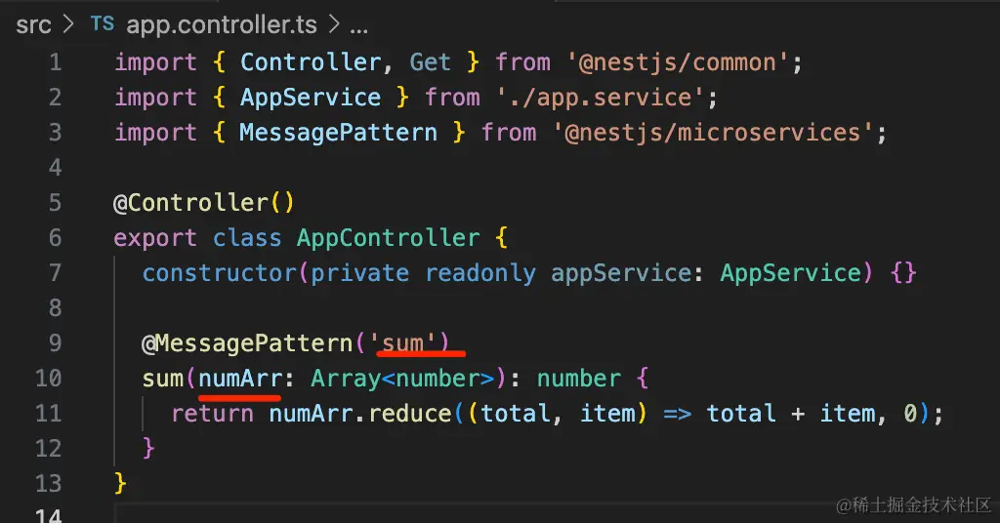

把两个服务都跑起来：

```
npm run start:dev
```
微服务那边跑起来的提示是这样的：

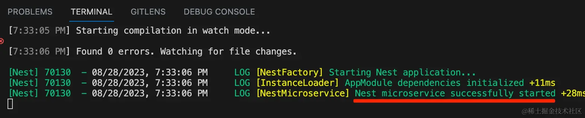

http 服务跑起来的提示是这样的：

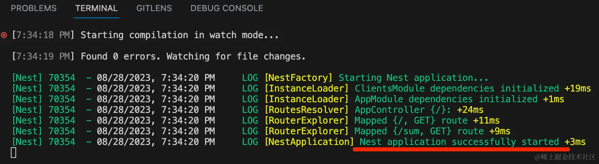

然后浏览器访问下 http://localhost:3000/sum?num=3,5,6：


返回了 14，是 3 + 5 + 6 的结果。

浏览器把 3、5、6 的参数传递给 http 服务，然后它给微服务发送消息，把参数带过去，微服务计算后返回了 14 给 http 服务，它再返回给浏览器：

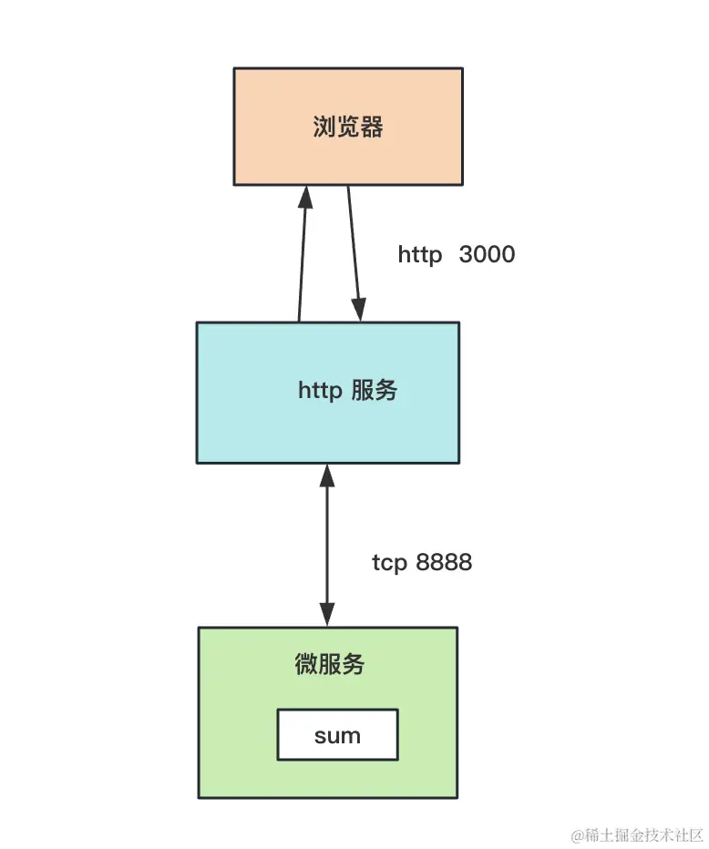

前面在微服务里是用 @MessagePattern 声明的要处理的消息。

如果并不需要返回消息的话，可以用 @EventPattern 声明：

比如我们在 microservice-test-user 的 AppController 再添加一个方法：

```javascript
@EventPattern('log')
log(str: string) {
    console.log(str);
}
```

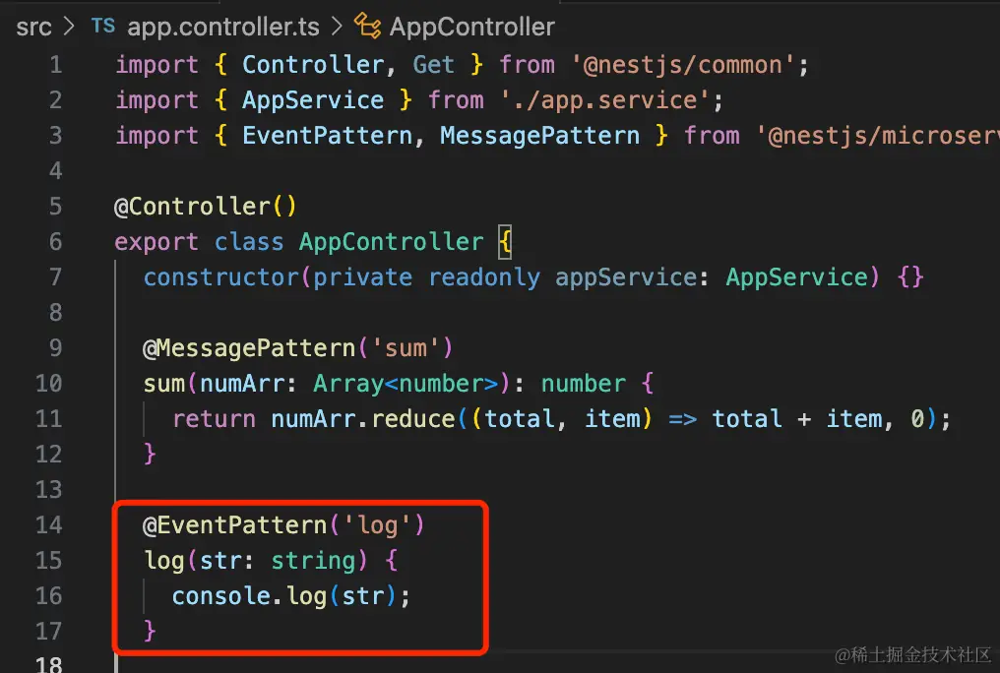

然后在 microservice-test-main 里调用下：

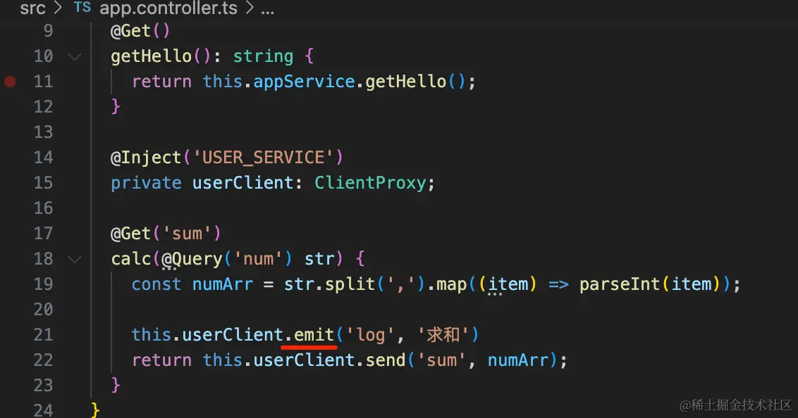

```javascript
this.userClient.emit('log', '求和')
```

注意，如果那边是 @MessagePattern 声明的方法，这边要用 send 方法调用。而 @EventPattern 声明的方法，这边要用 emit 方法调用。

测试下：


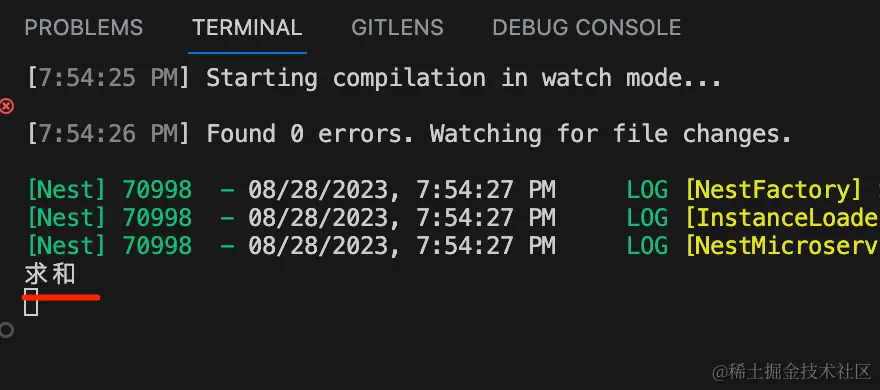

可以看到，微服务收到了这边发送的消息，并打印了日志。

那微服务之间具体传输了什么消息呢？我们抓包看一下。

想抓 tcp 层的包需要用到 wireshark。

在 [wireshark 官网](https://www.wireshark.org/)下载安装包：

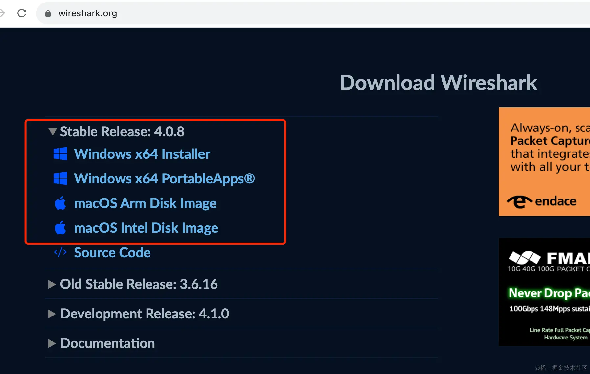

安装后把它跑起来：

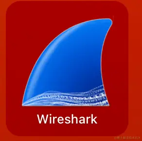

选择 loopback 这个网卡，本地回环地址，可以抓到 localhost 的包：

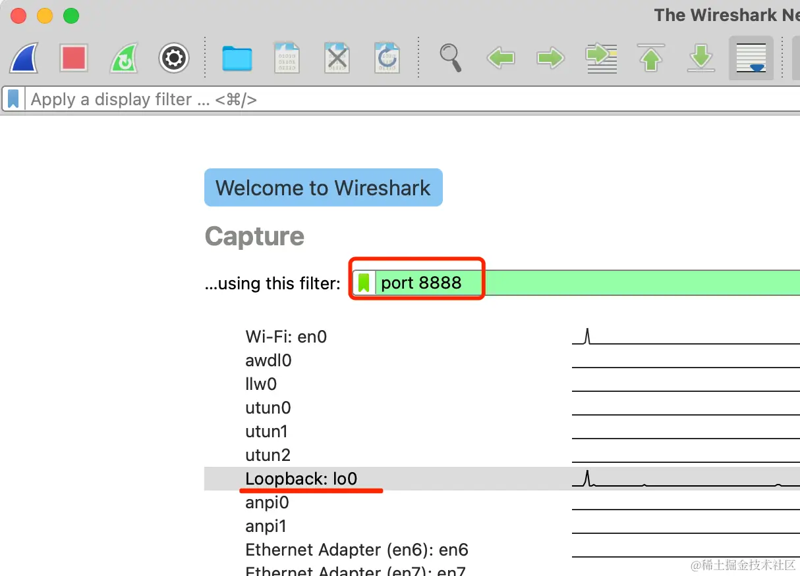

输入过滤器 port 8888，也就是过滤 8888 端口的数据包。

然后回车就会进入抓包界面：

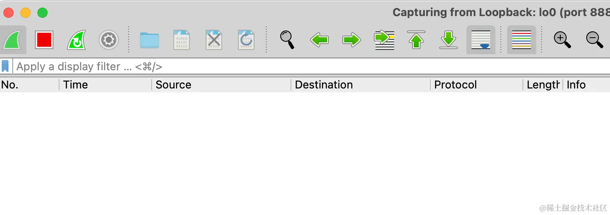

这时候再访问下 http://localhost:3000/sum?num=1,2,3

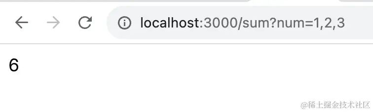

可以看到抓到了几个 tcp 的包：

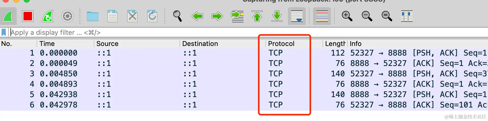

点开这几个 PSH 的包看一下：

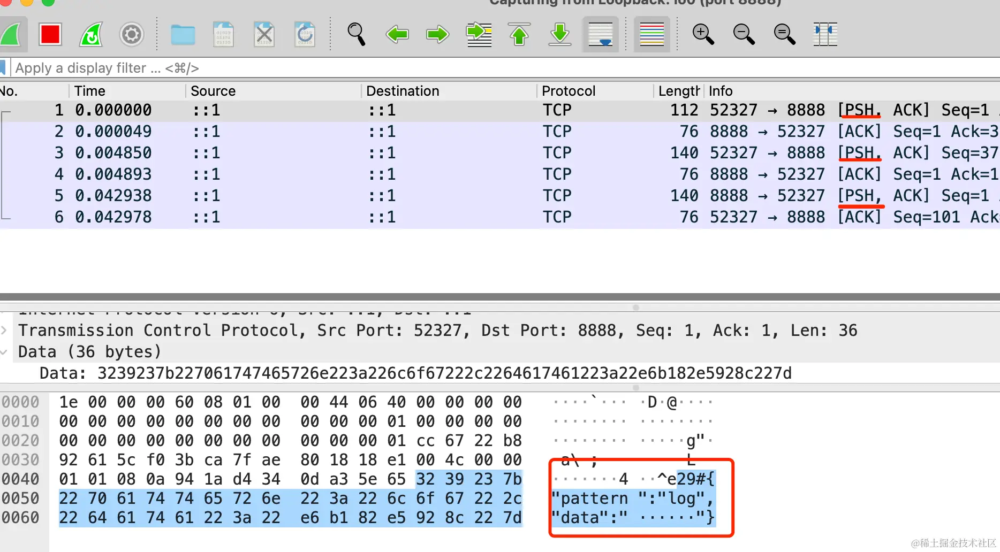

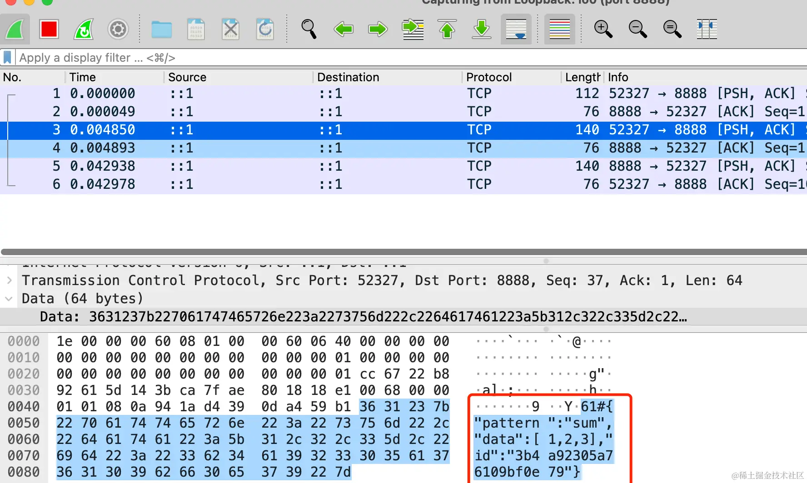

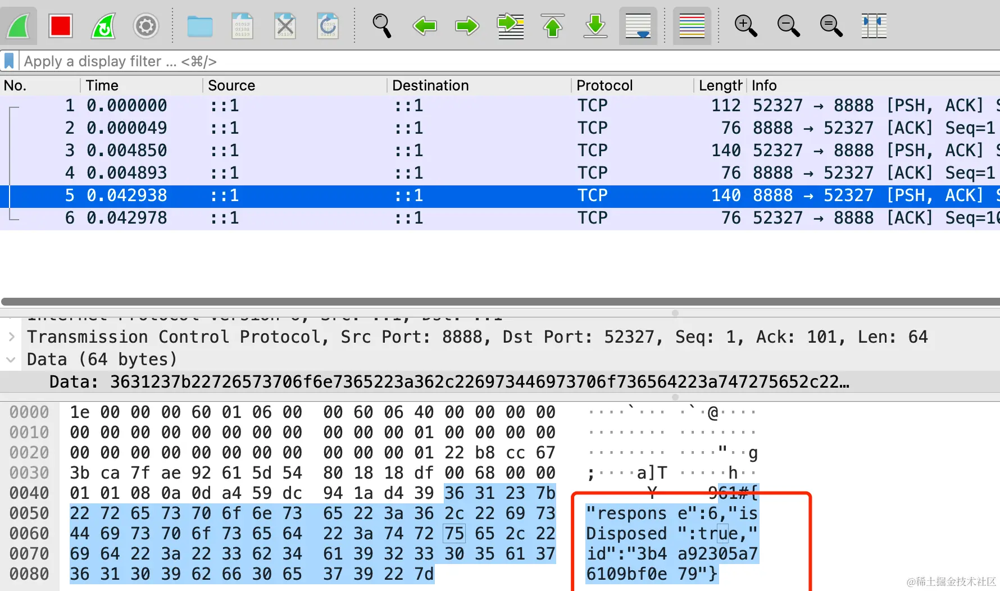

内容如下：

```
{"pattern": "log", "data": "求和"}
```
```
{"pattern": "sum", data: [1, 2, 3], "id": "3b4a92305a76109bf0e79"}
```
```
{"response": 6, "isDisposed": true, "id": "3b4a92305a76109bf0e79"}
```

前两个是主服务发送给微服务的，后面那个是微服务返回的。

从抓包我们可以得出结论：

- 微服务之间的 tcp 通信的消息格式是 json
- 如果是 message 的方式，需要两边各发送一个 tcp 包，也就是一问一答的方式
- 如果是 event 的方式，只需要客户端发送一个 tcp 的包

案例代码在小册仓库：

[microservice-test-main](https://github.com/QuarkGluonPlasma/nestjs-course-code/tree/main/microservice-test-main)

[microservice-test-user](https://github.com/QuarkGluonPlasma/nestjs-course-code/tree/main/microservice-test-user)

## 总结

之前我们一直写的都是单体的 http 服务，这样项目大了以后会难以维护和扩展。

这时候可以通过微服务的方式把业务逻辑拆分到不同的微服务里。

微服务之间通过 tcp 方式通信，在 nest 里需要用到 @nestjs/microservices 这个包。

微服务启动的时候不再调用 NestFactory.create 而是调用 NestFactory.createMicroservice 方法，指定 tcp 的端口。

然后另一个服务里通过 ClientsModule 来注入连接这个微服务的代理对象。

之后分别用 send、emit 方法来调用微服务的 @MessagePattern、@EventPattern 声明的方法。

这就是微服务的创建和通信方式。

我们还通过 wireshark 抓包分析了 tcp 通信的内容，发现微服务之间的通信是基于 json 的。

项目大了之后，为了维护和扩展方便，拆分微服务是很自然的事情。
