# 142. 用 Etcd 实现微服务配置中心和注册中心

微服务架构的系统都会有配置中心和注册中心。

为什么呢？

比如说配置中心：

系统中会有很多微服务，它们会有一些配置信息，比如环境变量、数据库连接信息等。

这些配置信息散落在各个服务中，以配置文件的形式存在。

这样你修改同样的配置需要去各个服务下改下配置文件，然后重启服务。

就很麻烦。

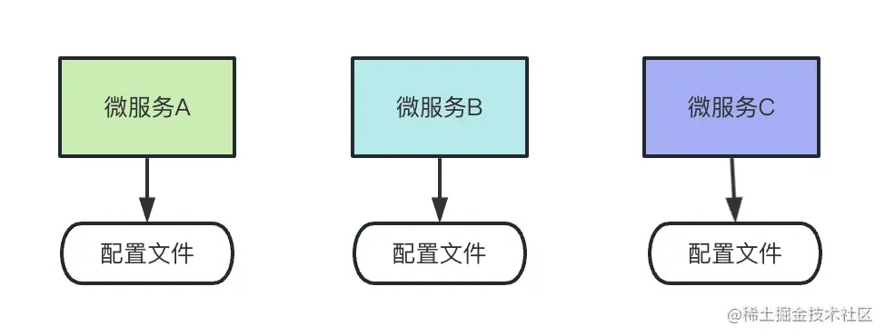

如果有一个服务专门用来集中管理配置信息呢？

这样每个微服务都从这里拿配置，可以统一的修改，并且配置更改后也会通知各个微服务。

这个集中管理配置信息的服务就叫配置中心。

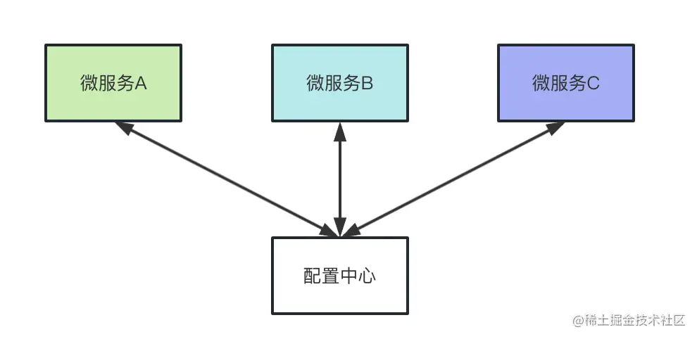

再就是注册中心：

微服务之间会相互依赖，共同完成业务逻辑的处理。

如果某个微服务挂掉了，那所有依赖它的服务就都不能工作了。

为了避免这种情况，我们会通过集群部署的方式，每种微服务部署若干个节点，并且还可能动态增加一些节点。

那么问题来了：

微服务 A 依赖了微服务 B，写代码的时候 B 只有 3 个节点，但跑起来以后，某个节点挂掉了，并且还新增了几个微服务 B 的节点。

这时候微服务 A 怎么知道微服务 B 有哪些节点可用呢？

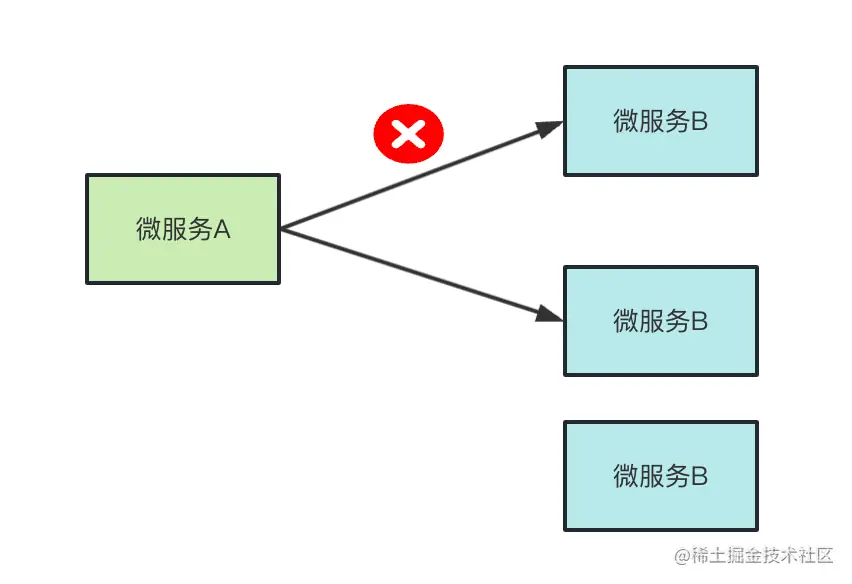

答案也是需要一个单独的服务来管理，这个服务就是注册中心：

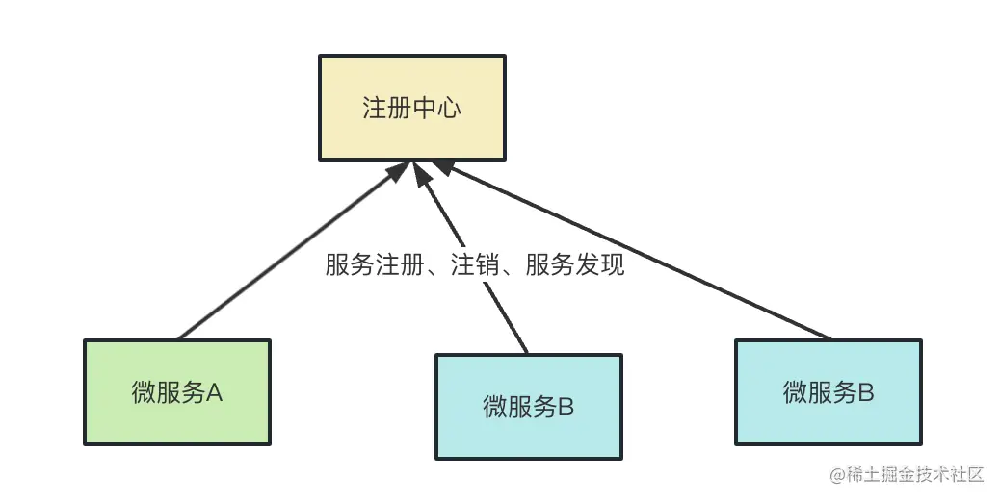

微服务在启动的时候，向注册中心注册，销毁的时候向注册中心注销，并且定时发心跳包来汇报自己的状态。

在查找其他微服务的时候，去注册中心查一下这个服务的所有节点信息，然后再选一个来用，这个叫做服务发现。

这样微服务就可以动态的增删节点而不影响其他微服务了。

微服务架构的后端系统中，都会有这两种服务。

下面是我网上找的几张微服务系统的架构图：

这个：
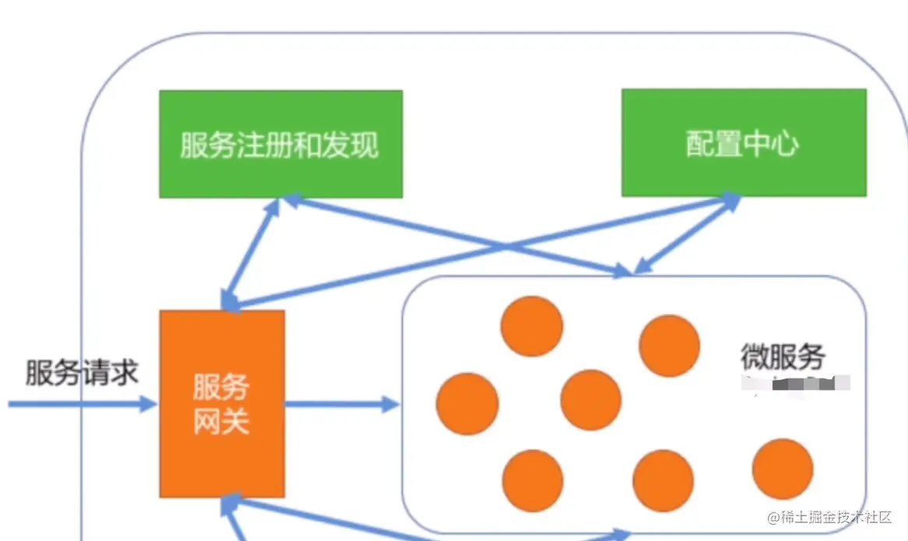

这个：


或者这个：
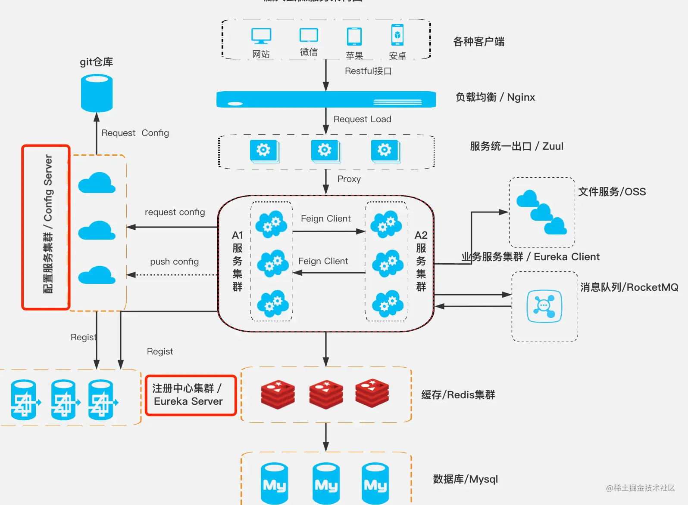

可以看到，配置中心和注册中心是必备组件。

但是，虽然这是两种服务，功能确实很类似，完全可以在一个服务里实现。

可以做配置中心、注册中心的中间件还是挺多的，比如 nacos、apollo、etcd 等。

今天我们来学下 etcd 实现注册中心和配置中心。


它其实是一个 key-value 的存储服务。

k8s 就是用它来做的注册中心、配置中心：

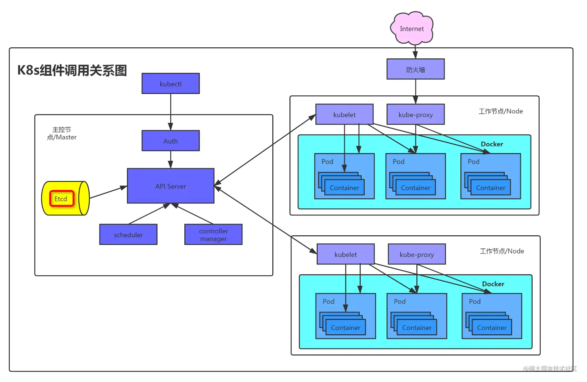

我们通过 docker 把它跑起来。

在 docker desktop 搜索 etcd 的镜像，点击 run:

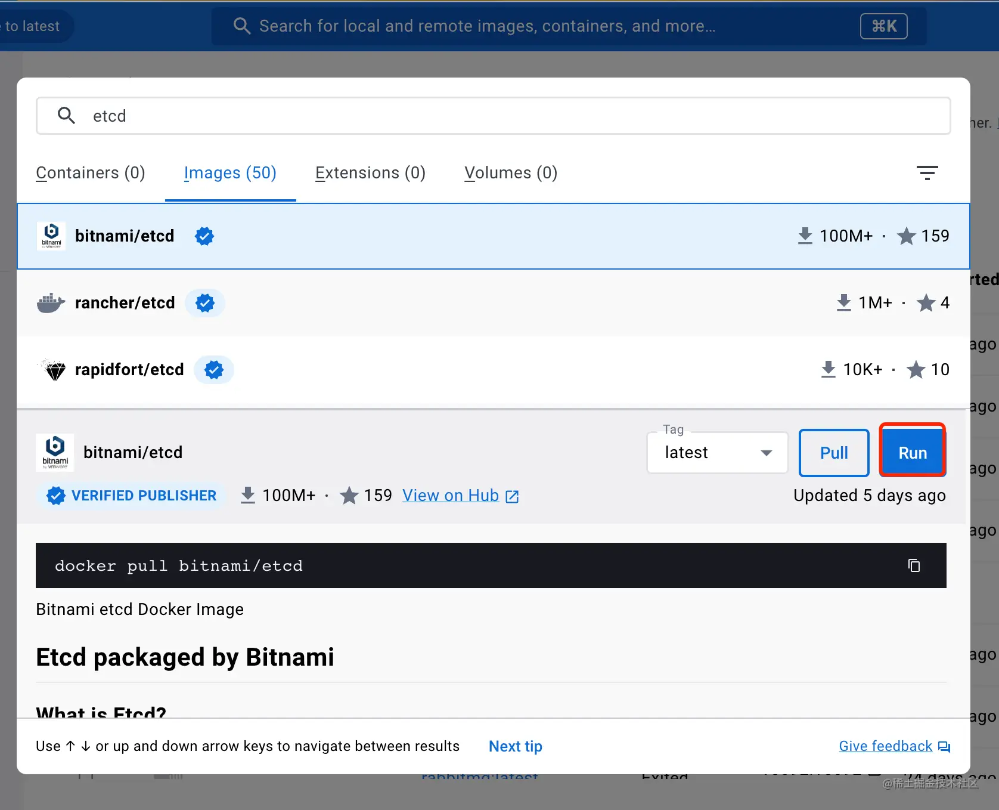

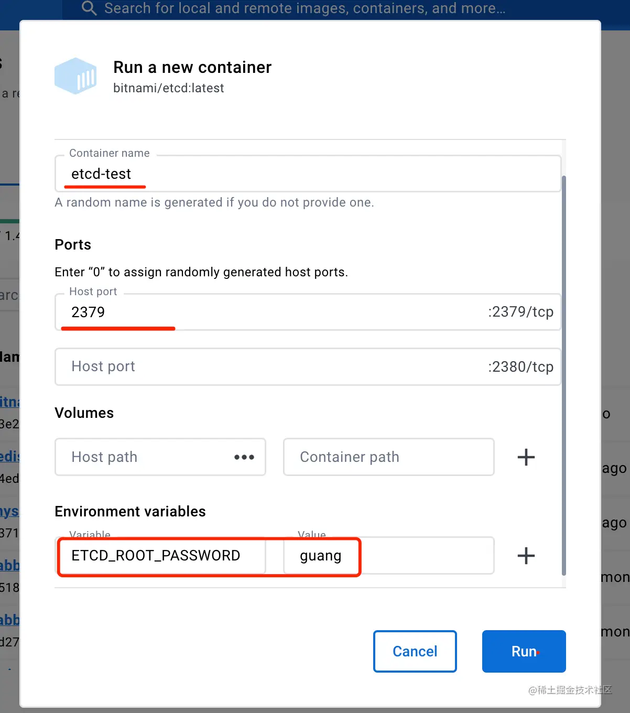

输入容器名，映射 2379 端口到容器内的 2379 端口，设置 ETCD_ROOT_PASSWORD 环境变量，也就是指定 root 的密码。

然后就可以看到 etcd server 的 docker 镜像成功跑起来了：

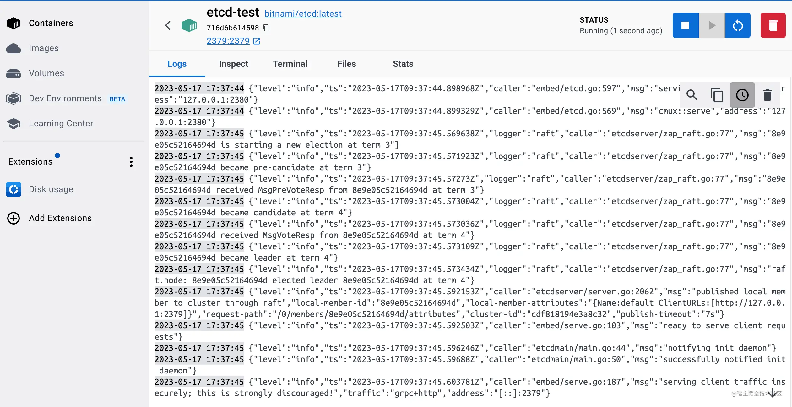

它带了一个 etcdctl 的命令行工具，可以作为客户端和 etcd server 交互。

常用的命令有这么几个：

```
etcdctl put key value
etcdctl get key
etcdctl del key
etcdctl watch key
```

就是对 key value 的增删改查和 watch 变动，还是比较容易理解的。

但是现在执行命令要加上 --user、--password 的参数才可以：

```
etcdctl get --user=root --password=guang key
```
如果不想每次都指定用户名密码，可以设置环境变量：
```
export ETCDCTL_USER=root
export ETCDCTL_PASSWORD=guang
```
这里的 password 就是启动容器的时候指定的那个环境变量：

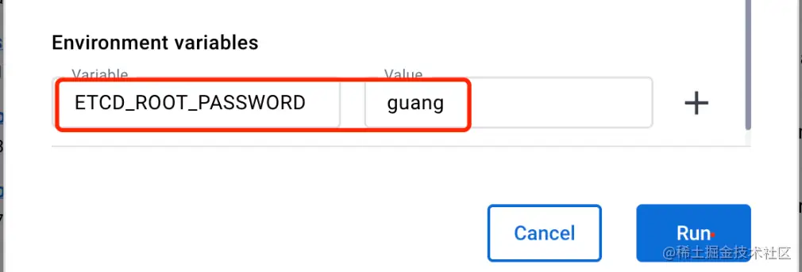

我们设置几个 key：

```
etcdctl put /services/a xxxx
etcdctl put /services/b yyyy
```


之后可以 get 来查询他们的值：

```
etcdctl get /services/a
etcdctl get /services/b
```
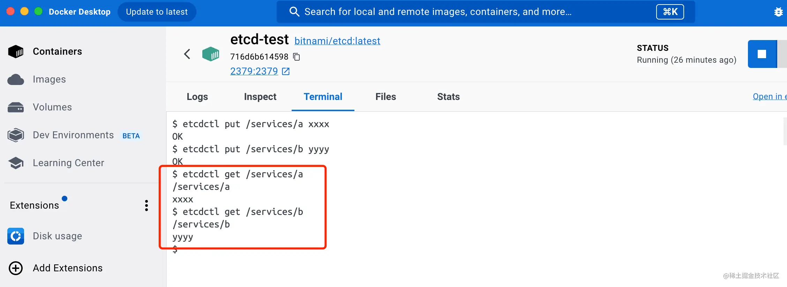

也可以通过 --prefix 查询指定前缀的 key 的值：

```
etcdctl get --prefix /services 
```

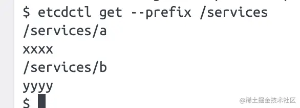

删除也是可以单个删和指定前缀批量删：

```
etcdctl del /servcies/a
etcdctl del --prefix /services
```


这样的 key-value 用来存储 服务名-链接信息，那就是注册中心，用来存储配置信息，那就是配置中心。

我们在 node 里面连接下 etcd 服务试试看：

创建个项目：

```
mkdir etcd-test
cd etcd-test
npm init -y
```

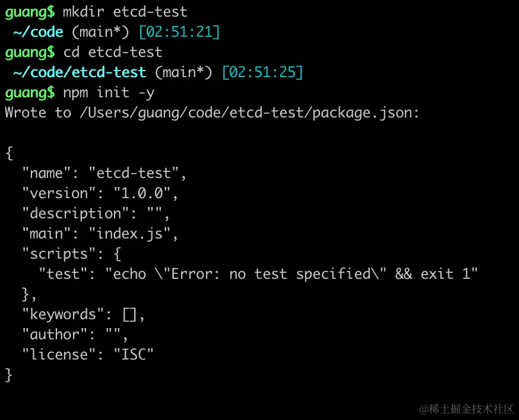

安装 etcd 的包：
```
npm install --save etcd3
```

创建 index.js

使用 etcd 官方提供的 npm 包 etcd3:

```javascript
const { Etcd3 } = require('etcd3');
const client = new Etcd3({
    hosts: 'http://localhost:2379',
    auth: {
        username: 'root',
        password: 'guang'
    }
});
 
(async () => { 
  const services = await client.get('/services/a').string();
  console.log('service A:', services);

  const allServices = await client.getAll().prefix('/services').keys();
  console.log('all services:', allServices);
 
  const watcher = await client.watch().key('/services/a').create();
  watcher.on('put', (req) => {
    console.log('put', req.value.toString())
  })
  watcher.on('delete', (req) => {
    console.log('delete')
  })
})();
```
get、getAll、watch 这些 api 和 ectdctl 命令行差不多，很容易搞懂。

get(xx) 是查询某个 key 的值。

getAll().prefix(xx).keys() 是查询某个字符串开头的 key。

watch().key(xx).create 则是创建某个 key 的监听器，监听他的 put 和 delete 事件。

我们再 put 几个 key：


```
etcdctl put /services/a xxx

etcdctl put /services/b yyy
```

然后执行上面的 node 脚本：


确实取到了 etcd server 中的值。

然后在 etcdctl 里 put 修改下 /services/a 的值：


```
etcdctl put /services/a zzz
```

在 node 脚本这里收到了通知：


再 del 试下：


```
etcdctl del /services/a
```

也收到了通知：


这样，在 node 里操作 etcd server 就跑通了。

然后我们封装下配置中心和注册中心的工具函数：

配置中心的实现比较简单，就是直接 put、get、del 对应的 key：

```javascript
// 保存配置
async function saveConfig(key, value) {
    await client.put(key).value(value);
}

// 读取配置
async function getConfig(key) {
    return await client.get(key).string();
}

// 删除配置
async function deleteConfig(key) {
    await client.delete().key(key);
}
```
使用起来也很简单；

```javascript
(async function main() {
    await saveConfig('config-key', 'config-value');
    const configValue = await getConfig('config-key');
    console.log('Config value:', configValue);
})();
```

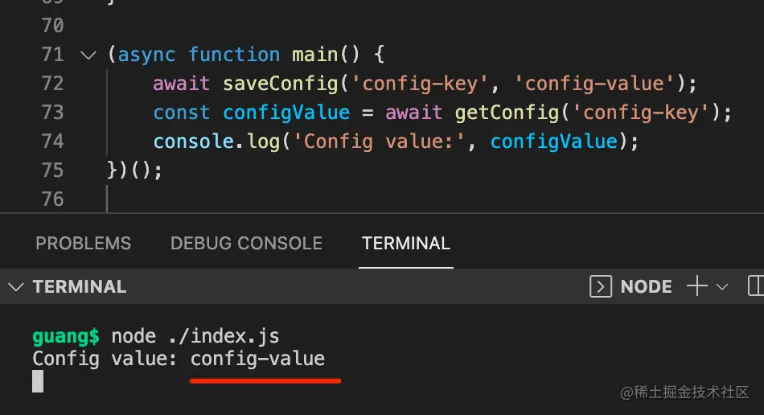

你可以在这里存各种数据库连接信息、环境变量等各种配置。

然后是注册中心：

服务注册：

```javascript
// 服务注册
async function registerService(serviceName, instanceId, metadata) {
    const key = `/services/${serviceName}/${instanceId}`;
    const lease = client.lease(10);
    await lease.put(key).value(JSON.stringify(metadata));
    lease.on('lost', async () => {
        console.log('租约过期，重新注册...');
        await registerService(serviceName, instanceId, metadata);
    });
}
```
注册的时候我们按照 /services/服务名/实例id 的格式来指定 key。

也就是一个微服务可以有多个实例。

设置了租约 10s，这个就是过期时间的意思，然后过期会自动删除。

我们可以监听 lost 事件，在过期后自动续租。

当不再续租的时候，就代表这个服务挂掉了。

然后是服务发现：

```javascript
// 服务发现
async function discoverService(serviceName) {
    const instances = await client.getAll().prefix(`/services/${serviceName}`).strings();
    return Object.entries(instances).map(([key, value]) => JSON.parse(value));
}
```
服务发现就是查询 /services/服务名 下的所有实例，返回它的信息。

```javascript
// 监听服务变更
async function watchService(serviceName, callback) {
    const watcher = await client.watch().prefix(`/services/${serviceName}`).create();
    watcher .on('put', async event => {
        console.log('新的服务节点添加:', event.key.toString());
        callback(await discoverService(serviceName));
    }).on('delete', async event => {
        console.log('服务节点删除:', event.key.toString());
        callback(await discoverService(serviceName));
    });
}
```
通过 watch 监听 /services/服务名下所有实例的变动，包括添加节点、删除节点等，返回现在的可用节点。

我们来测试下：

```javascript
(async function main() {
    const serviceName = 'my_service';
    
    await registerService(serviceName, 'instance_1', { host: 'localhost', port:3000 });
    await registerService(serviceName, 'instance_2', { host: 'localhost', port:3002 });

    const instances = await discoverService(serviceName);
    console.log('所有服务节点:', instances);

    watchService(serviceName, updatedInstances => {
        console.log('服务节点有变动:', updatedInstances);
    });
})();
```

跑起来确实能获得服务的所有节点信息：


当在 etcdctl 里 del 一个服务节点的时候，这里也能收到通知：


```
etcdctl del /services/my_service/instance_2
```


这样，我们就实现了服务注册、服务发现功能。

有的同学可能问了：redis 不也是 key-value 存储的么？为什么不用 redis 做配置中心和注册中心？

因为 redis 没法监听不存在的 key 的变化，而 etcd 可以，而配置信息很多都是动态添加的。

当然，还有很多别的原因，毕竟 redis 只是为了缓存设计的，不是专门的配置中心、注册中心的中间件。

专业的事情还是交给专业的中间件来干。

案例代码在[小册仓库](https://github.com/QuarkGluonPlasma/nestjs-course-code/tree/main/etcd-test)

也在这里贴一份：

```javascript
const { Etcd3 } = require('etcd3');
const client = new Etcd3({
    hosts: 'http://localhost:2379',
    auth: {
        username: 'root',
        password: 'guang'
    }
});

// 保存配置
async function saveConfig(key, value) {
    await client.put(key).value(value);
}

// 读取配置
async function getConfig(key) {
    return await client.get(key).string();
}

// 删除配置
async function deleteConfig(key) {
    await client.delete().key(key);
}
   
// 服务注册
async function registerService(serviceName, instanceId, metadata) {
    const key = `/services/${serviceName}/${instanceId}`;
    const lease = client.lease(10);
    await lease.put(key).value(JSON.stringify(metadata));
    lease.on('lost', async () => {
        console.log('租约过期，重新注册...');
        await registerService(serviceName, instanceId, metadata);
    });
}

// 服务发现
async function discoverService(serviceName) {
    const instances = await client.getAll().prefix(`/services/${serviceName}`).strings();
    return Object.entries(instances).map(([key, value]) => JSON.parse(value));
}

// 监听服务变更
async function watchService(serviceName, callback) {
    const watcher = await client.watch().prefix(`/services/${serviceName}`).create();
    watcher.on('put', async event => {
        console.log('新的服务节点添加:', event.key.toString());
        callback(await discoverService(serviceName));
    }).on('delete', async event => {
        console.log('服务节点删除:', event.key.toString());
        callback(await discoverService(serviceName));
    });
}

// (async function main() {
//     await saveConfig('config-key', 'config-value');
//     const configValue = await getConfig('config-key');
//     console.log('Config value:', configValue);
// })();

(async function main() {
    const serviceName = 'my_service';
    
    await registerService(serviceName, 'instance_1', { host: 'localhost', port:3000 });
    await registerService(serviceName, 'instance_2', { host: 'localhost', port:3002 });

    const instances = await discoverService(serviceName);
    console.log('所有服务节点:', instances);

    watchService(serviceName, updatedInstances => {
        console.log('服务节点有变动:', updatedInstances);
    });
})();
```
## 总结

微服务架构的系统中少不了配置中心和注册中心。

不同服务的配置需要统一管理，并且在更新后通知所有的服务，所以需要配置中心。

微服务的节点可能动态的增加或者删除，依赖他的服务在调用之前需要知道有哪些实例可用，所以需要注册中心。

服务启动的时候注册到注册中心，并定时续租期，调用别的服务的时候，可以查一下有哪些服务实例可用，也就是服务注册、服务发现功能。

注册中心和配置中心可以用 etcd 来做，它就是一个专业做这件事的中间件，k8s 就是用的它来做的配置和服务注册中心。

我们用 docker 跑了 etcd server，它内置了命令行工具 etcdctl 可以用来和 server 交互。

常用的命令有 put、get、del、watch 等。

在 node 里可以通过 etcd3 这个包来操作 etcd server。

稍微封装一下就可以实现配置管理和服务注册、发现的功能。

在微服务架构的后端系统中，配置中心、注册中心是必不可少的组件，不管是 java、go 还是 Node.js。
