# 143. Nest 集成 Etcd 做注册中心、配置中心

我们学了 etcd 来做配置中心和注册中心，它比较简单，就是 key 的 put、get、del、watch 这些。

虽然简单，它却是微服务体系必不可少的组件：
 
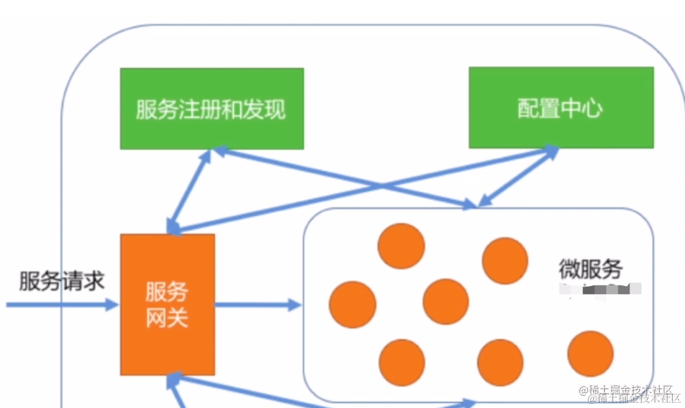

服务注册、发现、配置集中管理，都是用它来做。

那 Nest 里怎么集成它呢？

其实和 Redis 差不多。

集成 Redis 的时候我们就是写了一个 provider 创建连接，然后注入到 service 里调用它的方法。

还可以像 TypeOrmModule、JwtModule 等这些，封装一个动态模块：

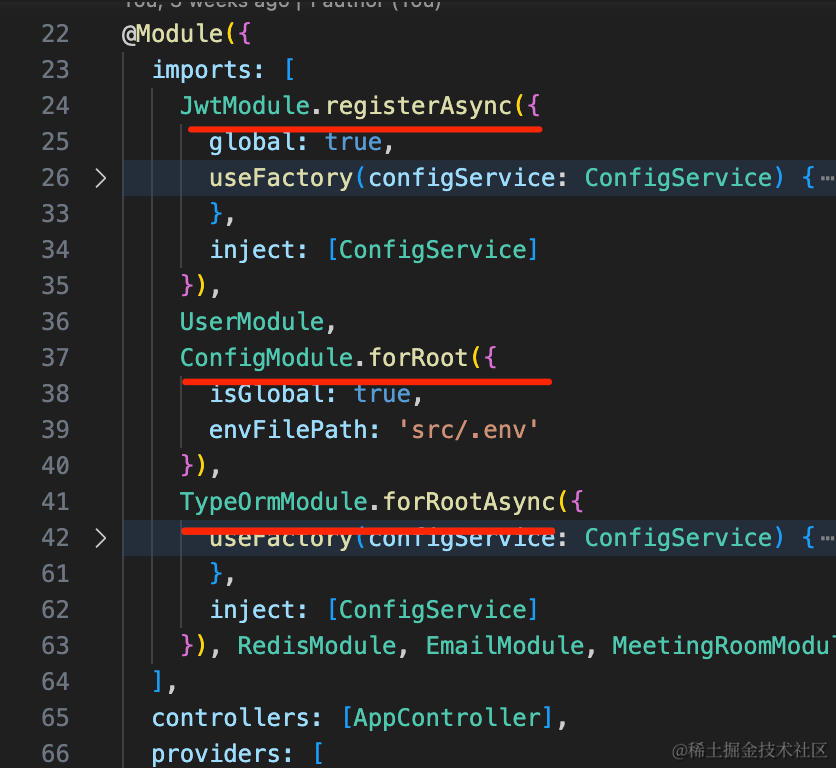

下面我们就来写一下：

```
nest new nest-etcd
```

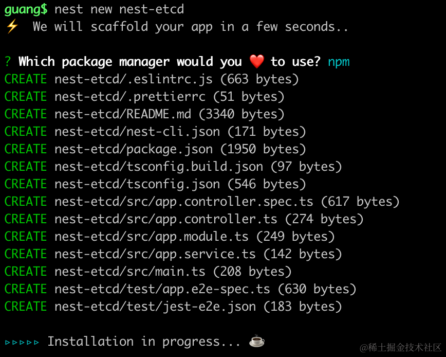

进入项目，把服务跑起来：

```
npm run start:dev
```
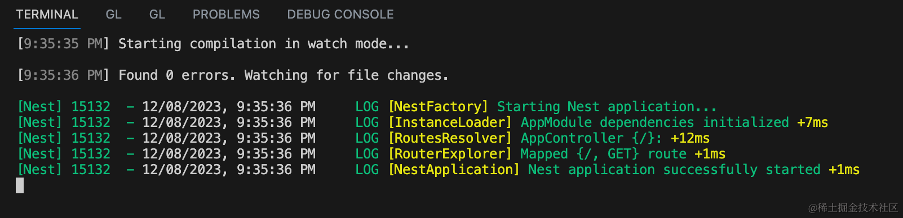

浏览器访问下：


nest 服务跑起来了。

按照上节的步骤把 etcd 服务跑起来：

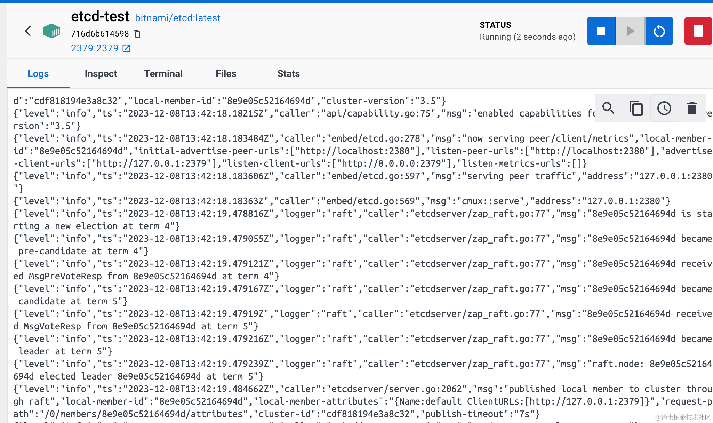

然后我们加一个 etcd 的 provider：

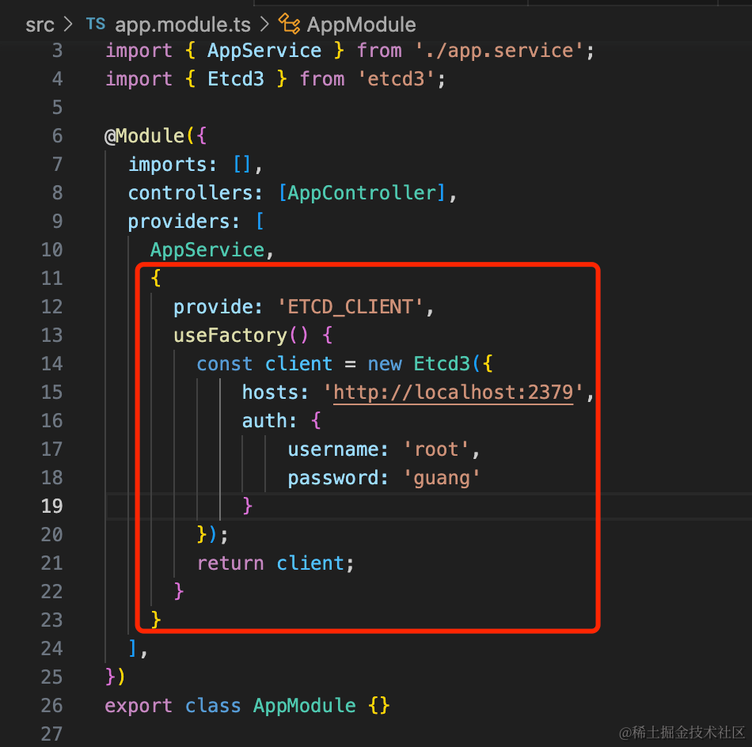

```javascript
import { Module } from '@nestjs/common';
import { AppController } from './app.controller';
import { AppService } from './app.service';
import { Etcd3 } from 'etcd3';

@Module({
  imports: [],
  controllers: [AppController],
  providers: [
    AppService,
    {
      provide: 'ETCD_CLIENT',
      useFactory() {
        const client = new Etcd3({
            hosts: 'http://localhost:2379',
            auth: {
                username: 'root',
                password: 'guang'
            }
        });
        return client;
      }
    }
  ],
})
export class AppModule {}

```
在 AppController 里注入下：

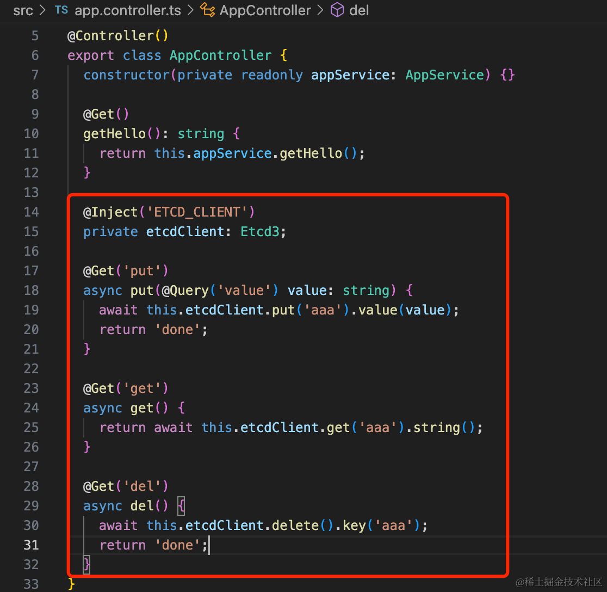

```javascript
import { Controller, Get, Inject, Query } from '@nestjs/common';
import { AppService } from './app.service';
import { Etcd3 } from 'etcd3';

@Controller()
export class AppController {
  constructor(private readonly appService: AppService) {}

  @Get()
  getHello(): string {
    return this.appService.getHello();
  }

  @Inject('ETCD_CLIENT')
  private etcdClient: Etcd3;

  @Get('put')
  async put(@Query('value') value: string) {
    await this.etcdClient.put('aaa').value(value);
    return 'done';
  }

  @Get('get')
  async get() {
    return await this.etcdClient.get('aaa').string();
  }

  @Get('del')
  async del() {
    await this.etcdClient.delete().key('aaa');
    return 'done';
  }
}
```

测试下：


这样 etcd 就集成好了，很简单。

然后我们封装一个动态模块。

创建一个 module 和 service：

```
nest g module etcd
nest g service etcd
```

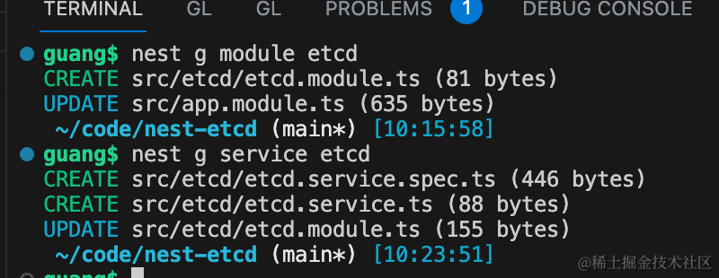

在 EtcdModule 添加 etcd 的 provider：

```javascript
import { Module } from '@nestjs/common';
import { EtcdService } from './etcd.service';
import { Etcd3 } from 'etcd3';

@Module({
  providers: [
    EtcdService,
    {
      provide: 'ETCD_CLIENT',
      useFactory() {
        const client = new Etcd3({
            hosts: 'http://localhost:2379',
            auth: {
                username: 'root',
                password: 'guang'
            }
        });
        return client;
      }
    }
  ],
  exports: [
    EtcdService
  ]
})
export class EtcdModule {}
```
然后在 EtcdService 添加一些方法：

```javascript
import { Inject, Injectable } from '@nestjs/common';
import { Etcd3 } from 'etcd3';

@Injectable()
export class EtcdService {

    @Inject('ETCD_CLIENT')
    private client: Etcd3;

    // 保存配置
    async saveConfig(key, value) {
        await this.client.put(key).value(value);
    }

    // 读取配置
    async getConfig(key) {
        return await this.client.get(key).string();
    }

    // 删除配置
    async deleteConfig(key) {
        await this.client.delete().key(key);
    }
   
    // 服务注册
    async registerService(serviceName, instanceId, metadata) {
        const key = `/services/${serviceName}/${instanceId}`;
        const lease = this.client.lease(10);
        await lease.put(key).value(JSON.stringify(metadata));
        lease.on('lost', async () => {
            console.log('租约过期，重新注册...');
            await this.registerService(serviceName, instanceId, metadata);
        });
    }

    // 服务发现
    async discoverService(serviceName) {
        const instances = await this.client.getAll().prefix(`/services/${serviceName}`).strings();
        return Object.entries(instances).map(([key, value]) => JSON.parse(value));
    }

    // 监听服务变更
    async watchService(serviceName, callback) {
        const watcher = await this.client.watch().prefix(`/services/${serviceName}`).create();
        watcher.on('put', async event => {
            console.log('新的服务节点添加:', event.key.toString());
            callback(await this.discoverService(serviceName));
        }).on('delete', async event => {
            console.log('服务节点删除:', event.key.toString());
            callback(await this.discoverService(serviceName));
        });
    }

}
```
配置的管理、服务注册、服务发现、服务变更的监听，这些我们都写过一遍，就不细讲了。

然后再创建个模块，引入它试一下：
```
nest g resource aaa
```

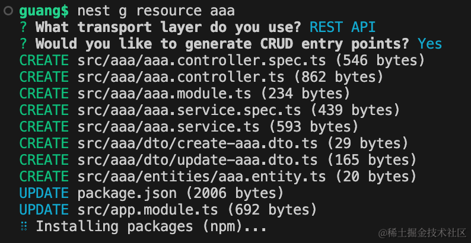

引入 EtcdModule：

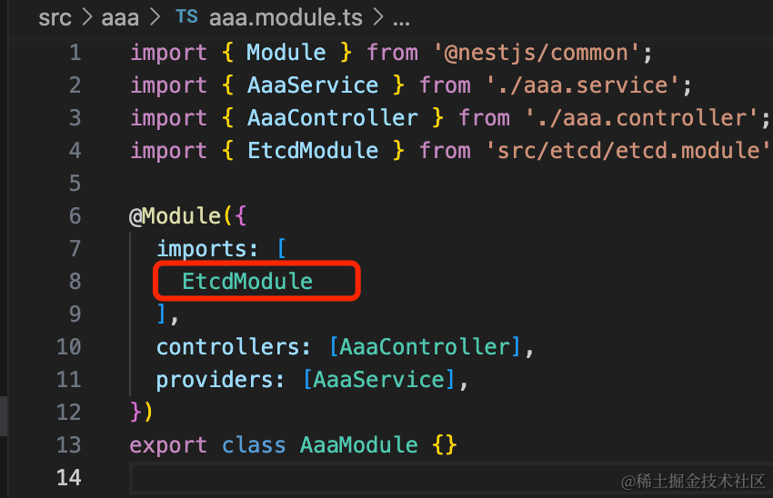

然后在 AaaController 注入 EtcdService，添加两个 handler：

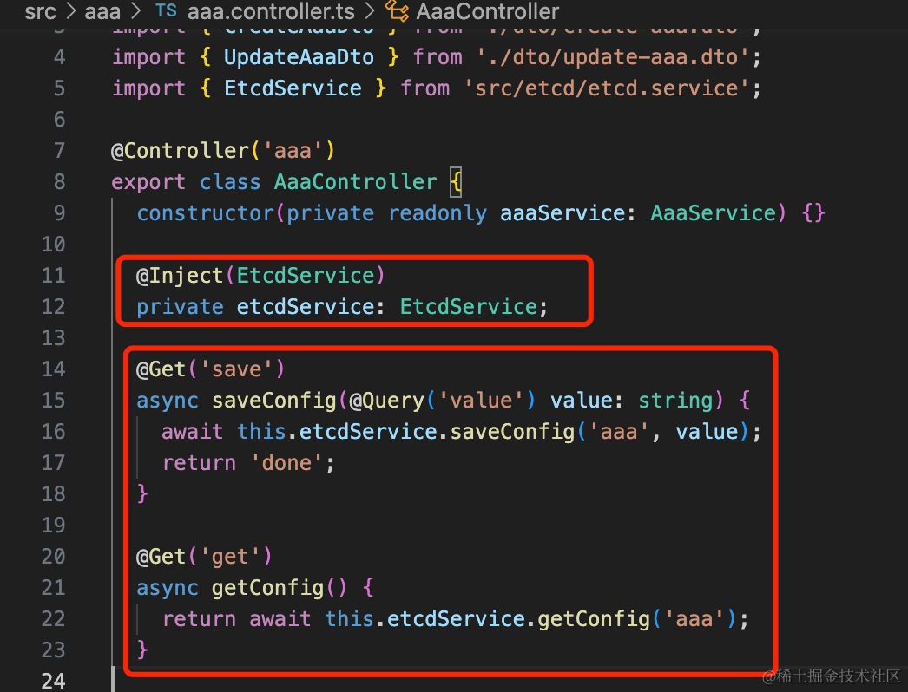

```javascript
@Inject(EtcdService)
private etcdService: EtcdService;

@Get('save')
async saveConfig(@Query('value') value: string) {
    await this.etcdService.saveConfig('aaa', value);
    return 'done';
}

@Get('get')
async getConfig() {
    return await this.etcdService.getConfig('aaa');
}
```
测试下：

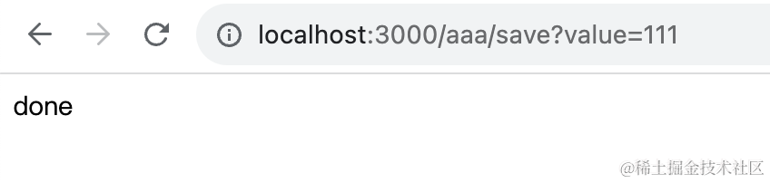


没啥问题。

不过现在 EtcdModule 是普通的模块，我们改成动态模块：

```javascript
import { DynamicModule, Module, ModuleMetadata, Type } from '@nestjs/common';
import { EtcdService } from './etcd.service';
import { Etcd3, IOptions } from 'etcd3';

export const ETCD_CLIENT_TOKEN = 'ETCD_CLIENT';

export const ETCD_CLIENT_OPTIONS_TOKEN = 'ETCD_CLIENT_OPTIONS';

@Module({})
export class EtcdModule {

  static forRoot(options?: IOptions): DynamicModule {
    return {
      module: EtcdModule,
      providers: [
        EtcdService,
        {
          provide: ETCD_CLIENT_TOKEN,
          useFactory(options: IOptions) {
            const client = new Etcd3(options);
            return client;
          },
          inject: [ETCD_CLIENT_OPTIONS_TOKEN]
        },
        {
          provide: ETCD_CLIENT_OPTIONS_TOKEN,
          useValue: options
        }
      ],
      exports: [
        EtcdService
      ]
    };
  }
}
```
把 EtcdModule 改成动态模块的方式，加一个 forRoot 方法。

把传入的 options 作为一个 provider，然后再创建 etcd client 作为一个 provider。

然后 AaaModule 引入 EtcdModule 的方式也改下：

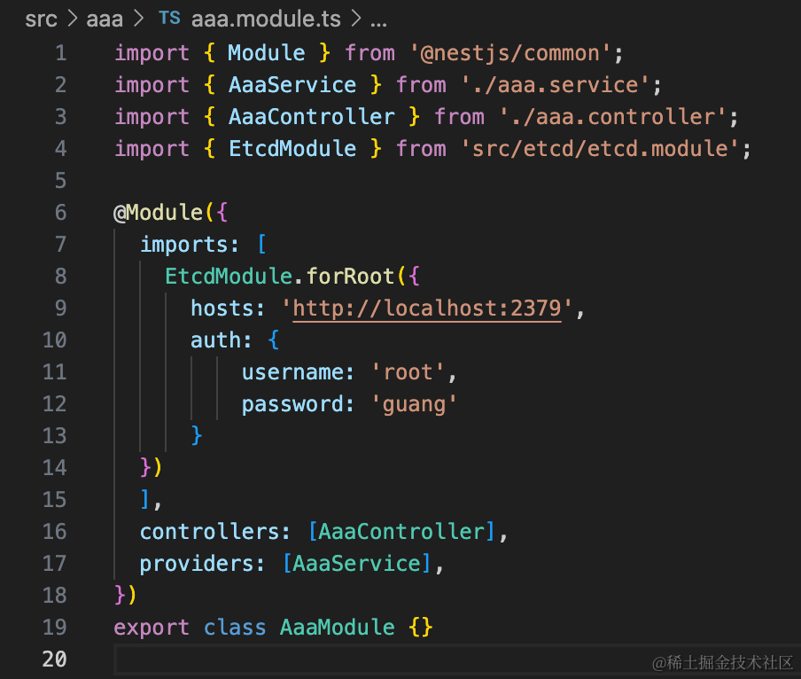

用起来是一样的：


但是现在 etcd 的参数是动态传入的了，这就是动态模块的好处。

当然，一般动态模块都有 forRootAsync，我们也加一下：


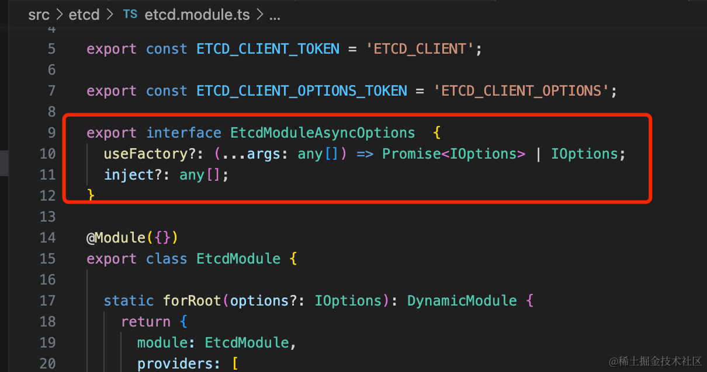

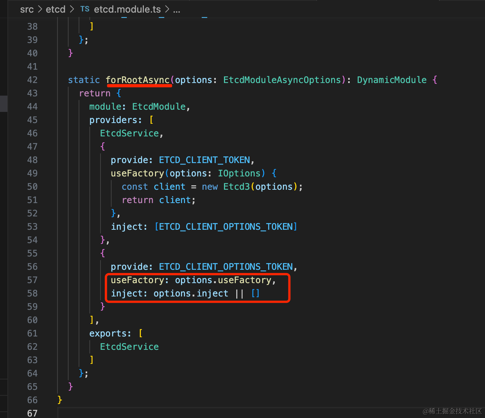

```javascript
export interface EtcdModuleAsyncOptions  {
  useFactory?: (...args: any[]) => Promise<IOptions> | IOptions;
  inject?: any[];
}
```
```javascript
static forRootAsync(options: EtcdModuleAsyncOptions): DynamicModule {
    return {
      module: EtcdModule,
      providers: [
        EtcdService,
        {
          provide: ETCD_CLIENT_TOKEN,
          useFactory(options: IOptions) {
            const client = new Etcd3(options);
            return client;
          },
          inject: [ETCD_CLIENT_OPTIONS_TOKEN]
        },
        {
          provide: ETCD_CLIENT_OPTIONS_TOKEN,
          useFactory: options.useFactory,
          inject: options.inject || []
        }
      ],
      exports: [
        EtcdService
      ]
    };
}
```
和 forRoot 的区别就是现在的 options 的 provider 是通过 useFactory 的方式创建的，之前是直接传入。

现在就可以这样传入 options 了：


```javascript
EtcdModule.forRootAsync({
  async useFactory() {
      await 111;
      return {
          hosts: 'http://localhost:2379',
          auth: {
              username: 'root',
              password: 'guang'
          }
      }
  }
})
```

我们安装下 config 的包

```
npm install @nestjs/config
```
在 AppModule 引入 ConfigModule：

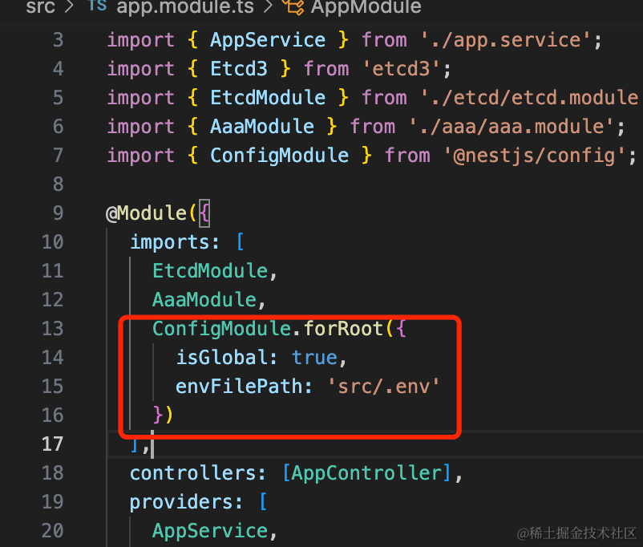

```javascript
ConfigModule.forRoot({
  isGlobal: true,
  envFilePath: 'src/.env'
})
```
添加对应的 src/.env

```env
etcd_hosts=http://localhost:2379
etcd_auth_username=root
etcd_auth_password=guang
```
然后在引入 EtcdModule 的时候，从 ConfigService 拿配置：

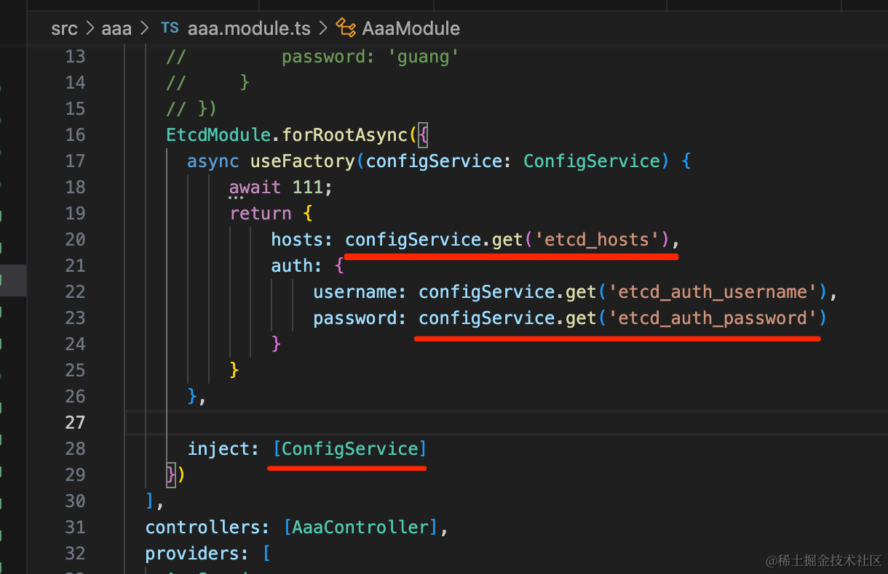

```javascript
EtcdModule.forRootAsync({
  async useFactory(configService: ConfigService) {
      await 111;
      return {
          hosts: configService.get('etcd_hosts'),
          auth: {
              username: configService.get('etcd_auth_username'),
              password: configService.get('etcd_auth_password')
          }
      }
  },
  inject: [ConfigService]
})
```
测试下：


功能正常。

这样，EtcdModule.forRootAsync 就成功实现了。

案例代码上传了[小册仓库](https://github.com/QuarkGluonPlasma/nestjs-course-code/tree/main/nest-etcd)。
## 总结

这节我们做了 Nest 和 etcd 的集成。

或者加一个 provider 创建连接，然后直接注入 etcdClient 来 put、get、del、watch。

或者再做一步，封装一个动态模块来用，用的时候再传入连接配置 

和集成 Redis 的时候差不多。

注册中心和配置中心是微服务体系必不可少的组件，后面会大量用到。
