# 144. 用 Nacos 实现微服务配置中心和注册中心

前面学了用 etcd 做配置中心和注册中心，这节来学习用 nacos 来做。

首先，通过 docker 把 nacos 服务跑起来：

搜索 nacos/nacos-server 的镜像：

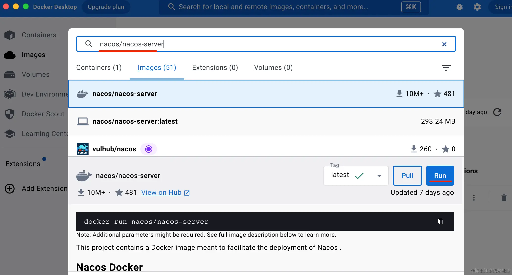

填一下启动参数：

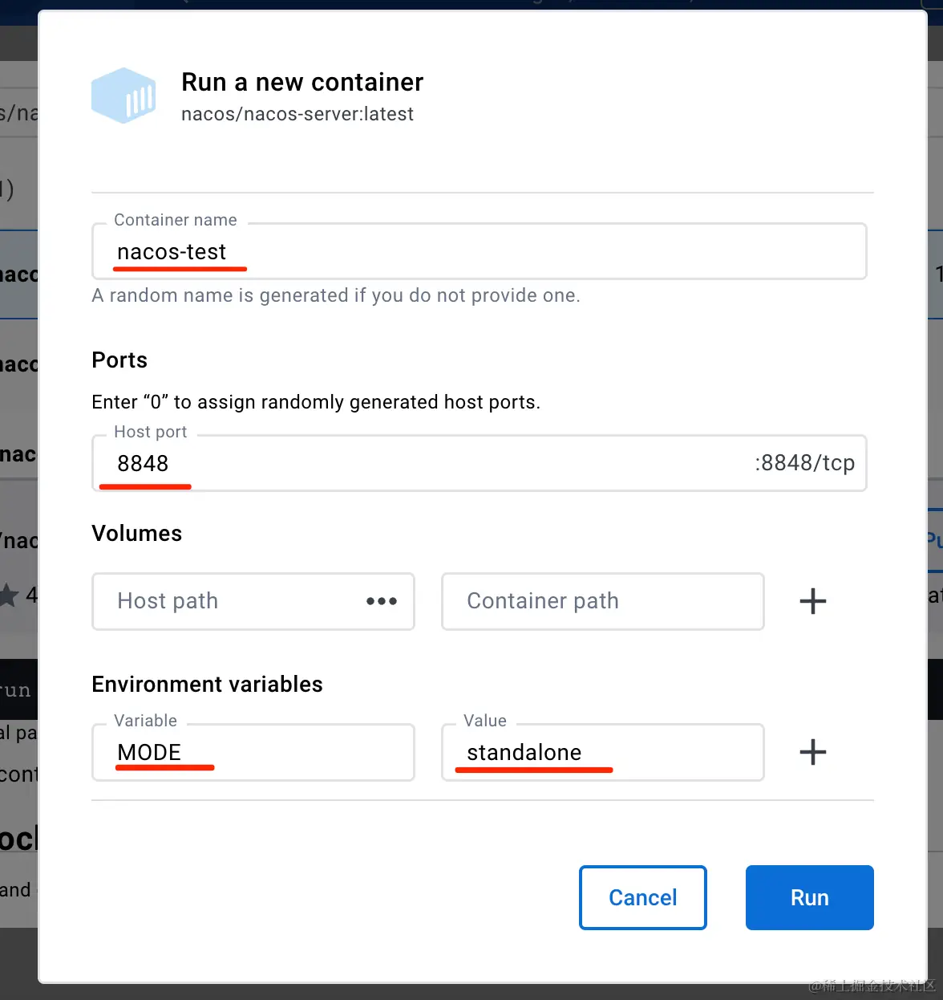

指定环境变量 MODE 为 standalone，也就是单机启动。

启动后可以看到打印的一个网页地址：

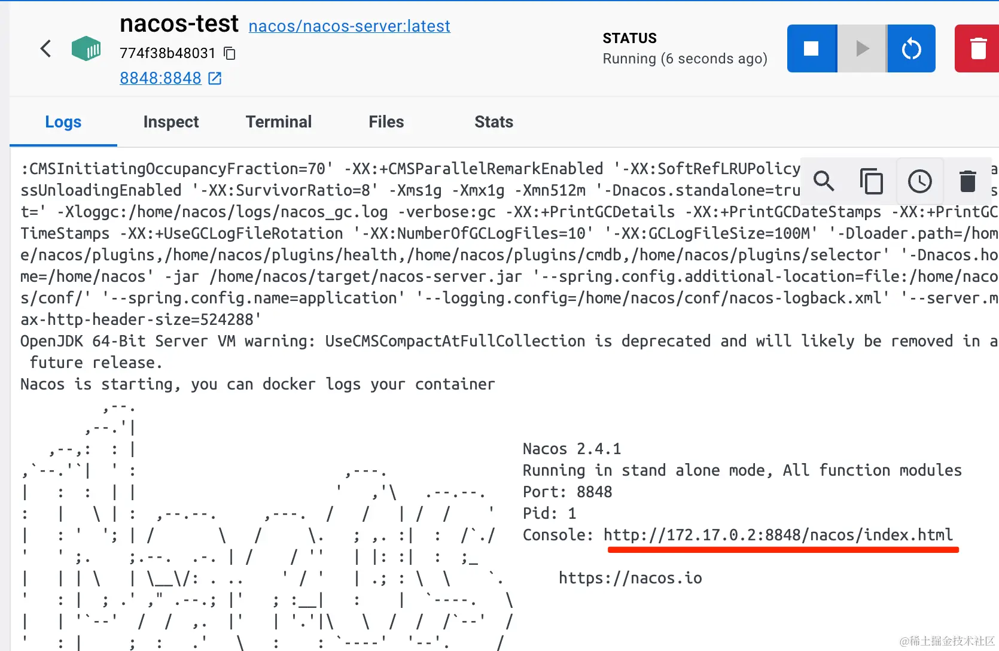

把 ip 替换成 localhost 就可以访问了：

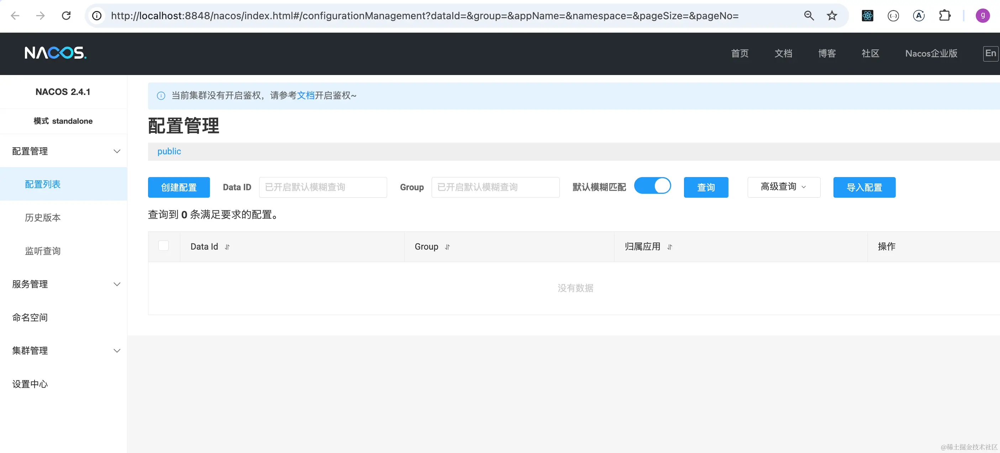

我们创建个 node 服务来连接 nacos：

```
mkdir nacos-node-test
cd ./nacos-node-test
npm init -y
```
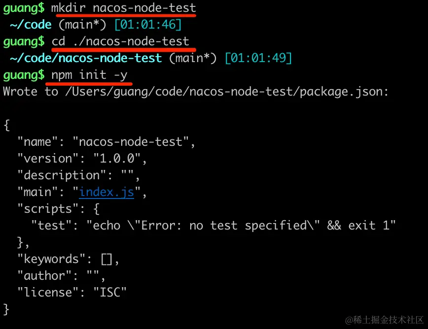

进入项目，安装 nacos 的包：

```
npm install --save nacos
```

创建 index.js

```javascript
import Nacos from 'nacos'

const client = new Nacos.NacosNamingClient({
    serverList: ['127.0.0.1:8848'],
    namespace: 'public',
    logger: console
})

await client.ready()

const aaaServiceName = 'aaaService'

const instance1 =  {
    ip: '127.0.0.1',
    port: 8080
}

client.registerInstance(aaaServiceName, instance1)

const instance2 =  {
    ip: '127.0.0.1',
    port: 8081
}

client.registerInstance(aaaServiceName, instance2)
```
这里创建了 NacosNamingClient，就是注册中心的客户端。

连接上之后，registerInstance 注册 aaa 服务的两个实例。

改下 package.json

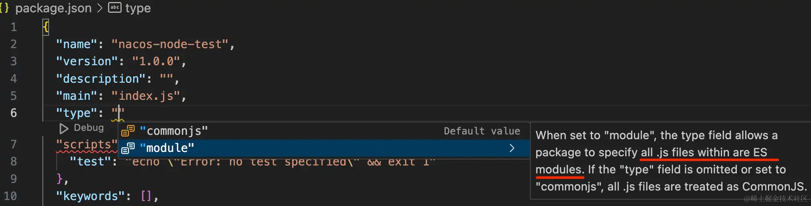

type 设置为 module，就是所有的 js 文件都是 es module 的。

这样就可以直接跑 es module 的代码了。

```
node ./index.js
```

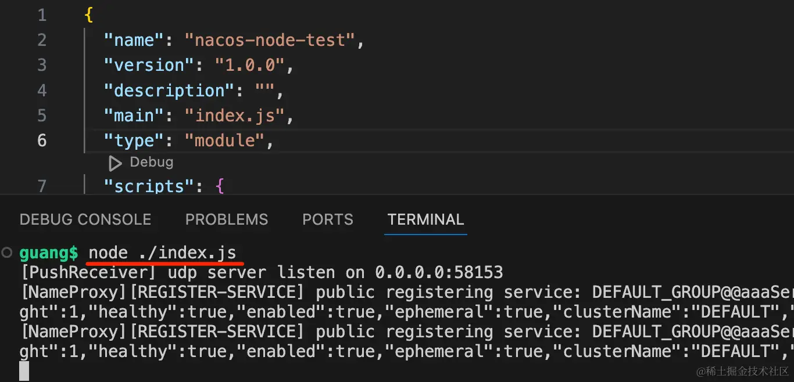

然后我们去 nacos 的控制台页面看一下：

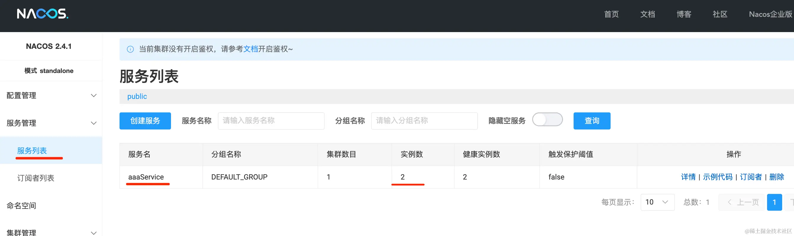

在服务列表可以看到，aaaService 有两个实例。

点开详情看下：

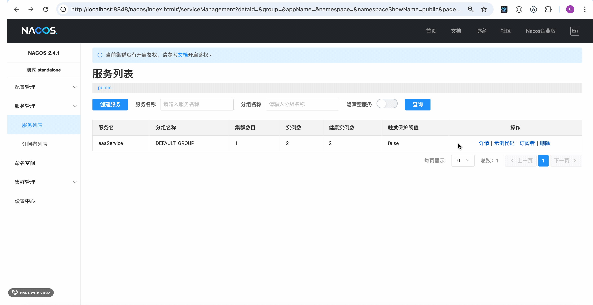

可以看到我们通过代码注册的两个实例。

可以注册，自然也可以取消注册

写下 index2.js

```javascript
import Nacos from 'nacos'

const client = new Nacos.NacosNamingClient({
    serverList: ['127.0.0.1:8848'],
    namespace: 'public',
    logger: console
})

await client.ready()

const aaaServiceName = 'aaaService'

const instance1 =  {
    ip: '127.0.0.1',
    port: 8080
}

client.deregisterInstance(aaaServiceName, instance1)

const instance2 =  {
    ip: '127.0.0.1',
    port: 8081
}

client.deregisterInstance(aaaServiceName, instance2)
```
只是把 registerInstance 换成 deregisterInstance

跑一下：
```
node ./index2.js
```
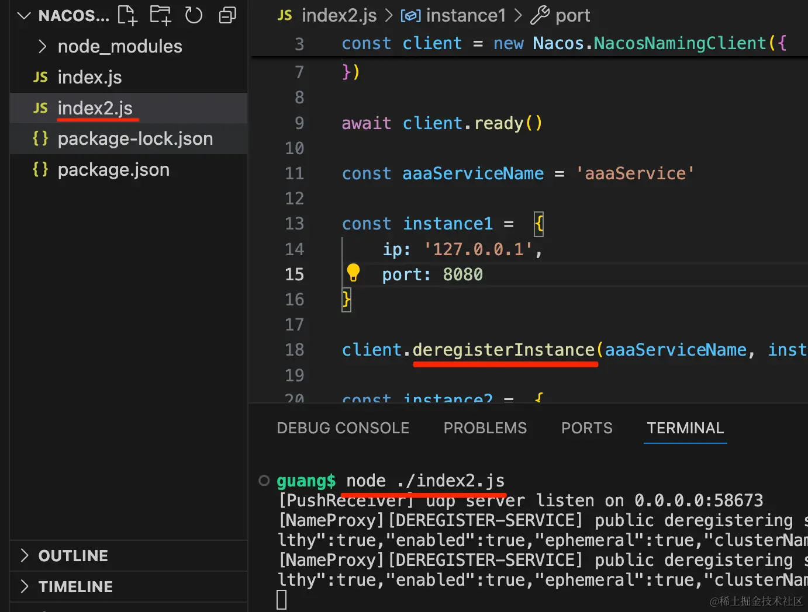

现在 aaaService 就没有实例了：

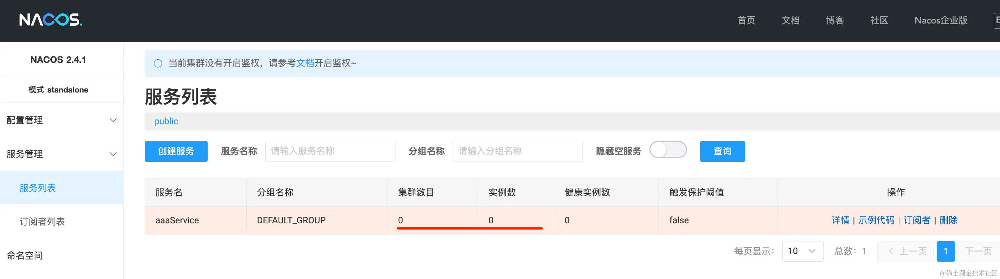

除了新增、删除，当然也可以查询实例，以及监听实例变化：

创建 index3.js

```javascript
import Nacos from 'nacos'

const client = new Nacos.NacosNamingClient({
    serverList: ['127.0.0.1:8848'],
    namespace: 'public',
    logger: console
})

await client.ready()

const instances = await client.getAllInstances('aaaService');

console.log(instances);
```
getAllInstances 就是查询 service 实例的方法。

先跑下 index.js 注册下，然后再跑下 index3.js 查询：

```javascript
node ./index.js
node ./index3.js
```
可以看到，查到了 aaaService 的两个实例：

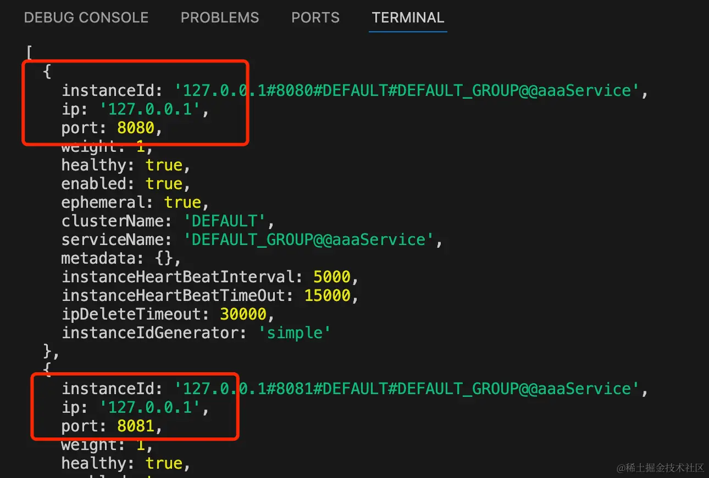

此外，还可以监听 service 实例的变化：

创建 index4.js

```javascript
import Nacos from 'nacos'

const client = new Nacos.NacosNamingClient({
    serverList: ['127.0.0.1:8848'],
    namespace: 'public',
    logger: console
})

await client.ready()

client.subscribe('aaaService', content => {
    console.log(content);
});
```
跑一下：

```
node ./index4.js
```

然后另开一个 terminal 跑下 index.js 来注册实例：

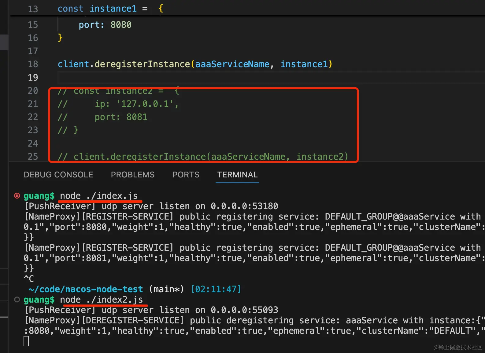

之后再跑 index2.js 去掉一个实例。

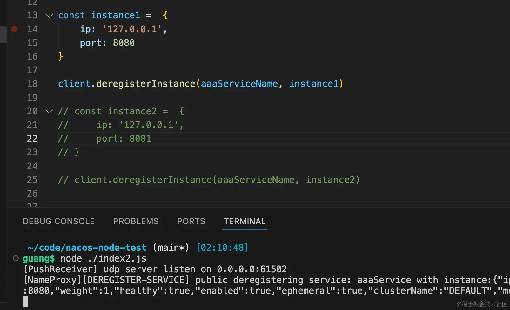

这时候在 index4.js 就监听到了这个变化：

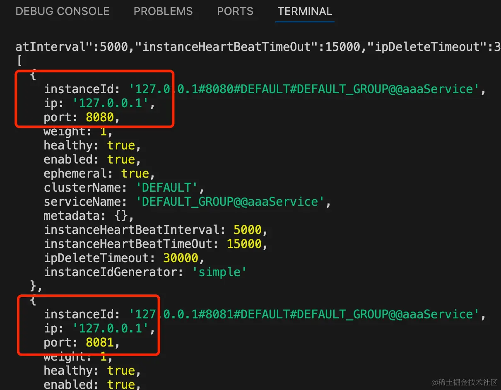

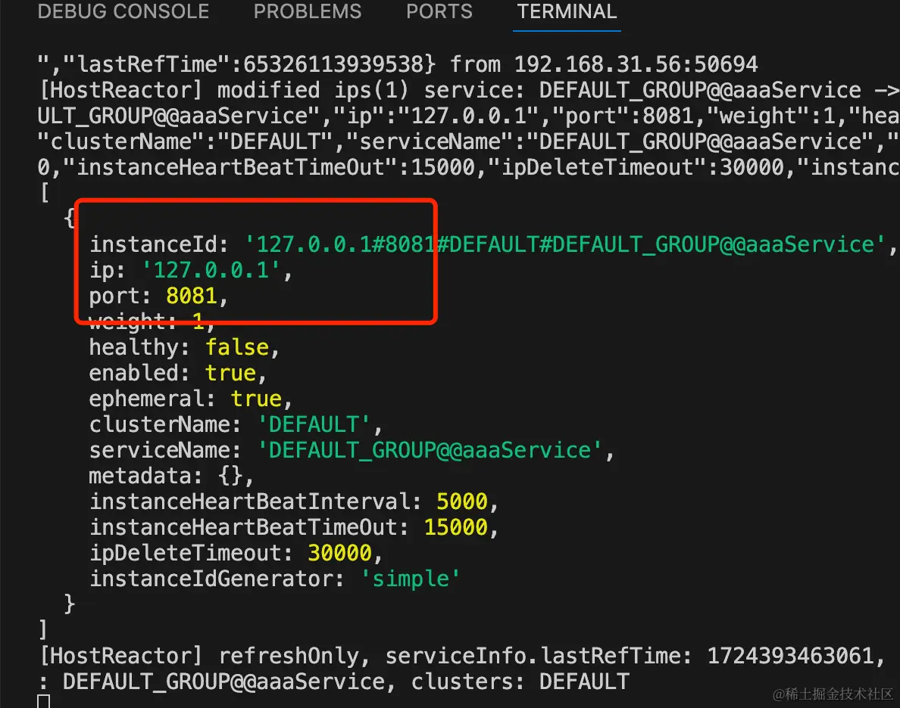

当实例改变的时候，就会调用回调函数，传入现在可用的实例。

在控制台页面也可以看到，确实只有一个实例了：

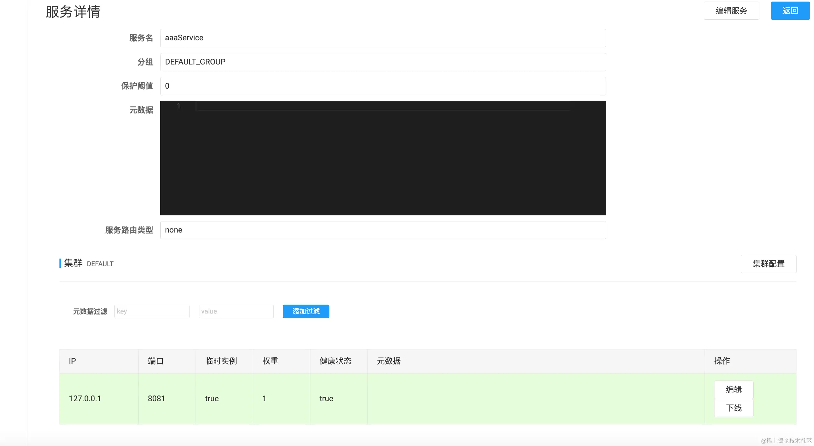

这样，服务注册、取消注册、服务发现、监听变化，我们就都过了一遍，平常用的也是这些功能。

接下来再看下 Nacos 作为配置中心的用法：

新建 index5.js

```javascript
import { NacosConfigClient } from 'nacos'

const client = new NacosConfigClient({
    serverAddr: 'localhost:8848',
})

const content = await client.publishSingle('config', 'DEFAULT_GROUP', '{"host":"127.0.0.1","port":8848}')

// await client.remove('config', 'DEFAULT_GROUP')

// const config = await client.getConfig('config', 'DEFAULT_GROUP')

// console.log(config)

// client.subscribe({ dataId: 'config', group: 'DEFAULT_GROUP', },
//     content => {
//         console.log(content)
//     }
// )
```
分别调用了新增、删除、查询、监听的 api。

我们把下面的注释掉，先看新增：

```
node index5.js
```

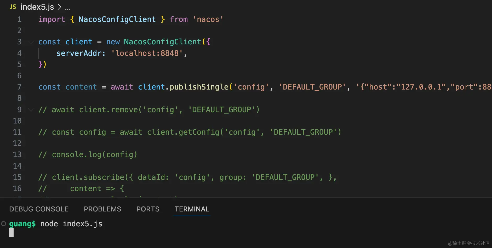

跑完之后可以在 nacos 控制台页面看到新增的这个配置：

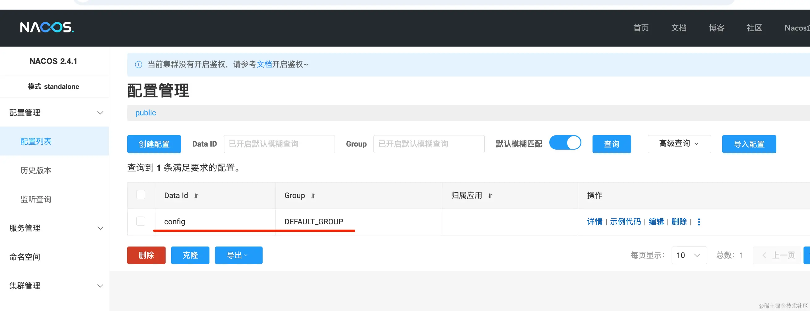

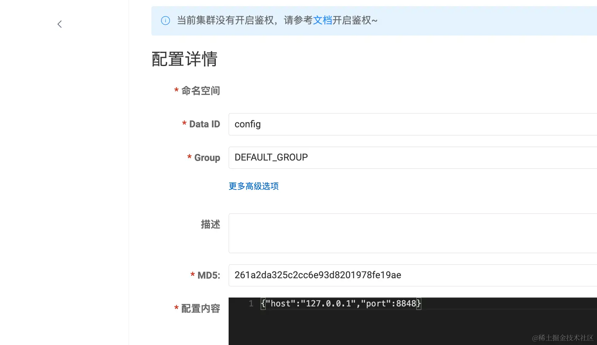

然后试下查询：

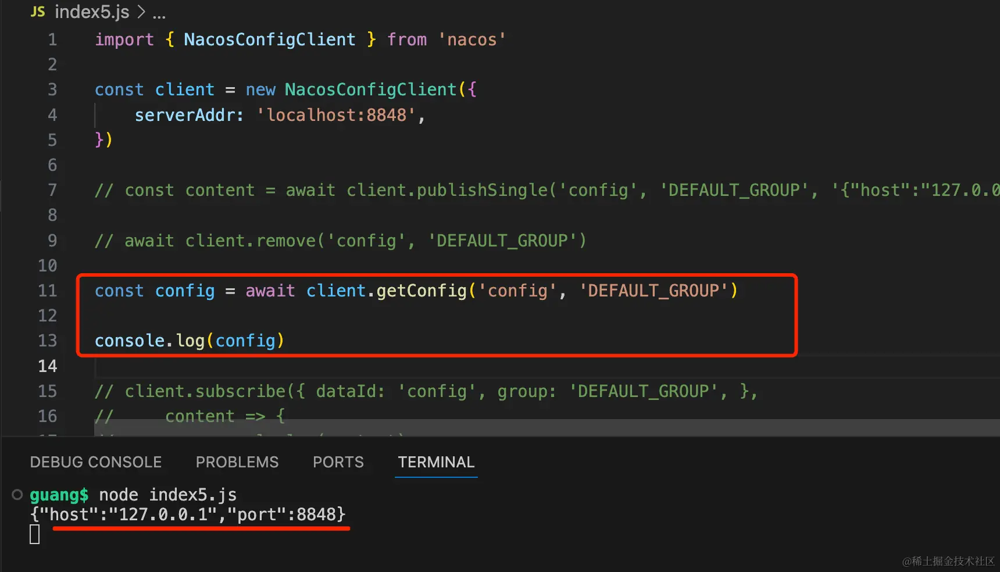

再试下删除：

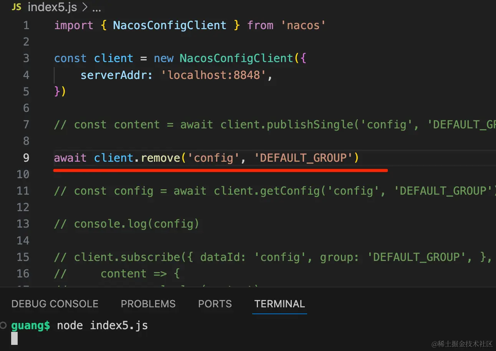

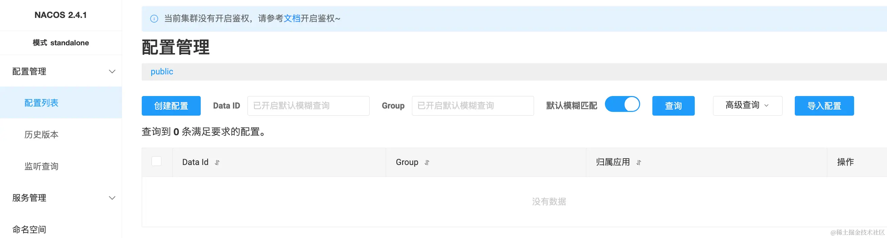

最后试下监听变化：

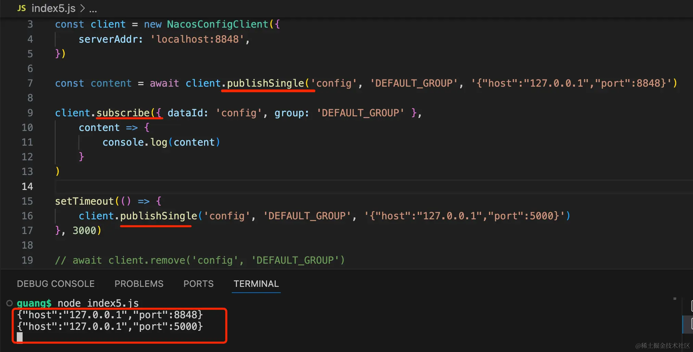

```javascript
import { NacosConfigClient } from 'nacos'

const client = new NacosConfigClient({
    serverAddr: 'localhost:8848',
})

const content = await client.publishSingle('config', 'DEFAULT_GROUP', '{"host":"127.0.0.1","port":8848}')

client.subscribe({ dataId: 'config', group: 'DEFAULT_GROUP' },
    content => {
        console.log(content)
    }
)

setTimeout(() => {
    client.publishSingle('config', 'DEFAULT_GROUP', '{"host":"127.0.0.1","port":5000}')
}, 3000)

// await client.remove('config', 'DEFAULT_GROUP')

// const config = await client.getConfig('config', 'DEFAULT_GROUP')

// console.log(config)
```
我们先 publishSingle  增加配置、然后 3s 后再 publishSingle 修改下这个配置。

可以看到 subscribe 监听到了配置变化，打印了最新配置。

这样，配置新增、删除、修改、查询、监听，我们就都过了一遍。

案例代码上传了[小册仓库](https://github.com/QuarkGluonPlasma/nestjs-course-code/tree/main/nacos-node-test)。

## 总结

这节我们学了 nacos 作为配置中心、注册中心的用法。

作为注册中心就是注册服务的实例，比如 aaaService 有多个服务实例的时候，可以分别用 registerService、deregisterInstance、getAllInstances、subscribe 实现新增、删除、查询、监听。

作为配置中心就是管理配置，可以分别用 publishSingle、remove、getConfig、subscribe 实现新增（修改）、删除、查询、监听。

nacos 相比 etcd，多了内置的控制台页面，比较方便。

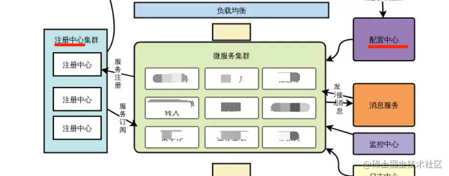

注册中心、配置中心用起来还是很简单的，但确是微服务架构必不可少的功能。
