# 145. 基于 gRPC 实现跨语言的微服务通信

后端系统大多都是微服务的架构，而且还可能同时有多种语言实现的微服务，比如 java、go、python、c++、node 等。

那么问题来了，多种语言实现的微服务之间如何通信呢？

有的同学会说 http 不就行？

但 http 是文本传输，通信效率低。更重要的是这些微服务并不会提供 http 接口，因为它们又不是直接面向客户端的。

跨语言调用服务一般会用 gRPC，它是 google 出的一种跨语言的远程方法调用的方案。

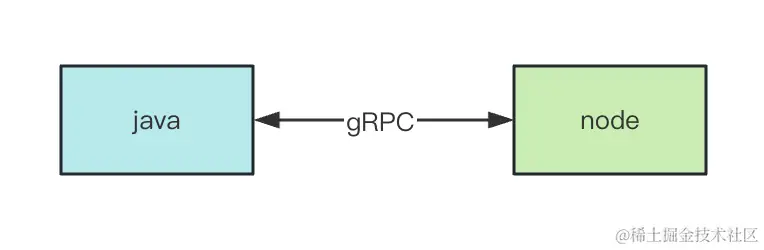

其中，RPC 是 Remote Procedure Call，远程过程调用。

比如 java 微服务有个方法 aaa，node 微服务想调用它，就可以通过 gRPC 来实现。

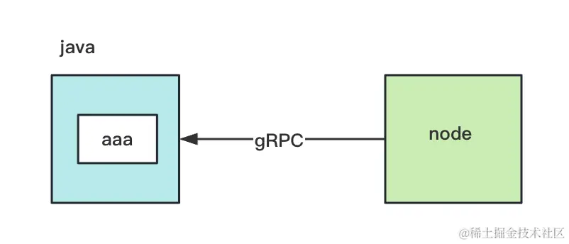

这节我们就来用一下 gRPC。

当然，我们不会真的创建 java 的微服务，而是会用两个 nest 的微服务之间实现 gRPC 通信。

在 java、phthon、go 等语言的微服务里，接入 gRPC 都是类似的。

我们创建个 nest 项目：

```
nest new grpc-client
```

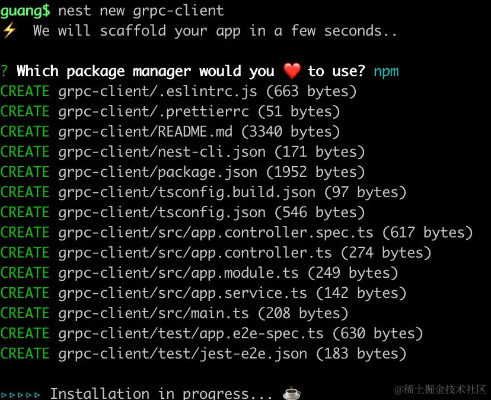

我们用 monorepo 的形式来放 client 和 server 的代码。

执行：
```
nest g app grpc-server
```
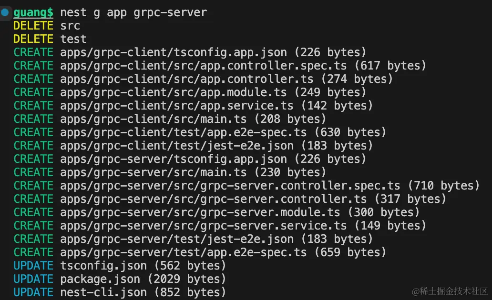

这样，就有了两个 nest 的 application：

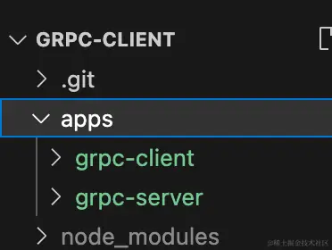

改下 grpc-server 的启动端口号为 3001:

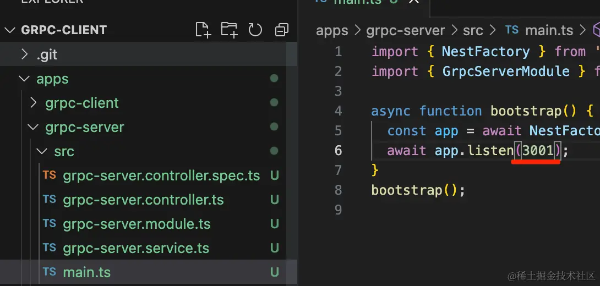

分别把两个 nest 应用跑起来：

```
npm run start:dev grpc-client

npm run start:dev grpc-server
```

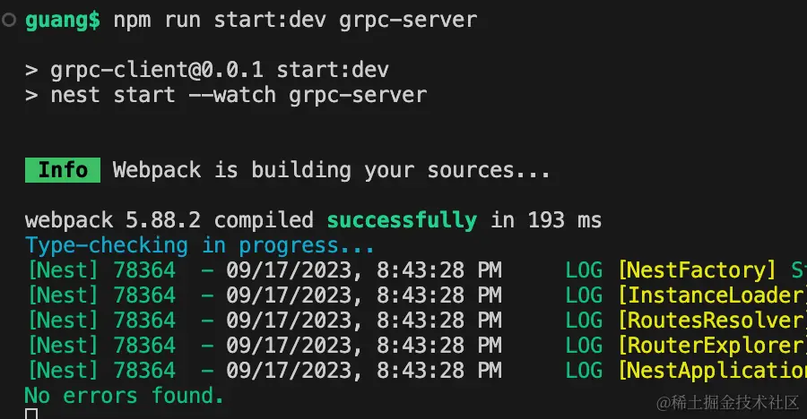

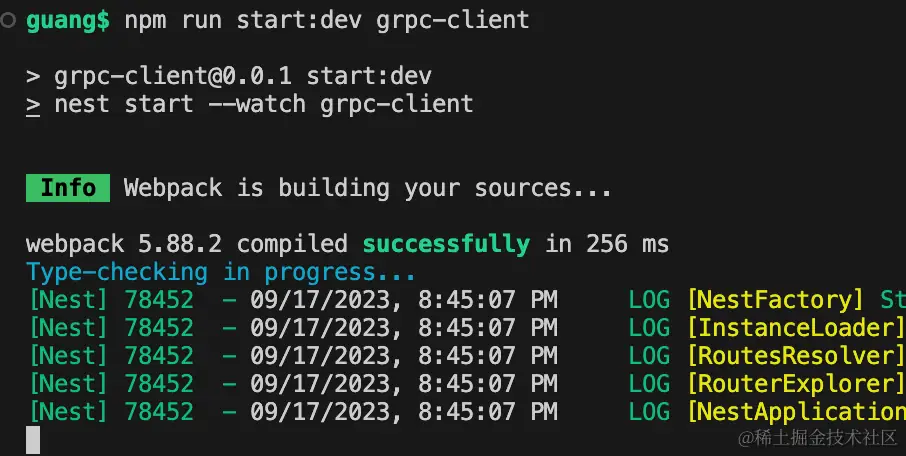

浏览器访问下：


这就代表两个 nest 应用都跑起来了。

然后我们把 grpc-server 改造成 grpc 的微服务。

安装用到的微服务的包：

```
npm install --save @nestjs/microservices
```

grpc 的包：

```
npm install --save @grpc/grpc-js @grpc/proto-loader
```

修改下 grpc-server 的 main.ts

```javascript
import { NestFactory } from '@nestjs/core';
import { GrpcOptions, Transport } from '@nestjs/microservices';
import { GrpcServerModule } from './grpc-server.module';
import { join } from 'path';

async function bootstrap() {
  const app = await NestFactory.createMicroservice<GrpcOptions>(GrpcServerModule, {
    transport: Transport.GRPC,
    options: {
      url: 'localhost:8888',
      package: 'book',
      protoPath: join(__dirname, 'book/book.proto'),
    },
  });

  await app.listen();
}
bootstrap();

```
和我们前面创建微服务的方式一样，只不过传输方式 transport 改为 GRPC，然后指定微服务监听端口为 8888。

然后在 options 指定 protoPath。

在 src 下创建这个对应的文件：

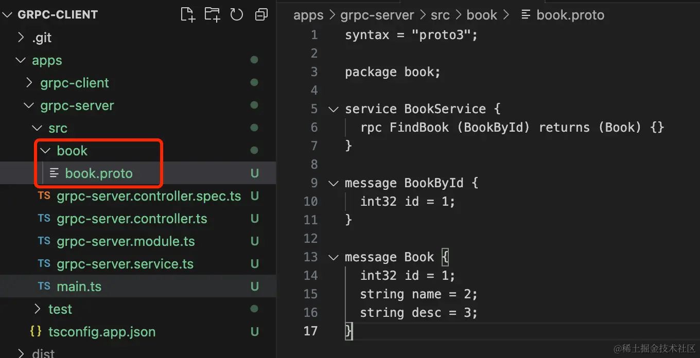

```javascript
syntax = "proto3";

package book;

service BookService {
  rpc FindBook (BookById) returns (Book) {}
}

message BookById {
  int32 id = 1;
}

message Book {
  int32 id = 1;
  string name = 2;
  string desc = 3;
}
```
这是一种叫做 protocol buffer 的语法。

我们安装个语法高亮插件 

搜索 ext:proto，也就是处理 .proto 文件的插件：


安装之后就有语法高亮了：

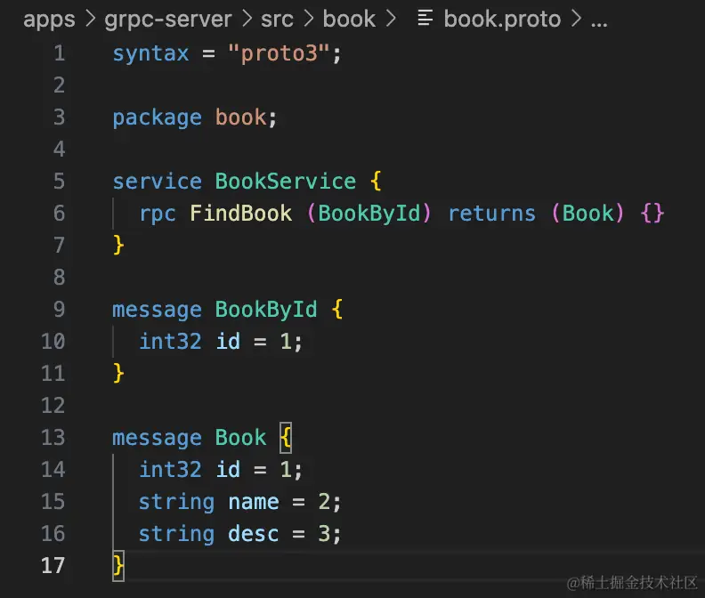

为什么要有一种 protocol buffer 的语法呢？

因为要跨语言通信，不同语言的语法又不一样，那怎么通信呢？

定义一种用于通信的语言，各种语言都支持这种语法的解析不就行了？

这就是为什么会有 protocol buffer。

这些语法也很容易看懂：

```
syntax = "proto3"
```
是使用 proto3 版本的语法。

```
package book;
```
是当前包为 book，也就是一种命名空间。

```
service BookService {
  rpc FindBook (BookById) returns (Book) {}
}
```
这个就是定义当前服务可以远程调用的方法。

有一个 FindBook 方法，参数是 BookById，返回值是 Book

然后下面就是参数和返回值的消息格式：

```
message BookById {
  int32 id = 1;
}

message Book {
  int32 id = 1;
  string name = 2;
  string desc = 3;
}
```
book.proto 只是定义了可用的方法和参数返回值的格式，我们还要在 controller 里实现对应的方法：

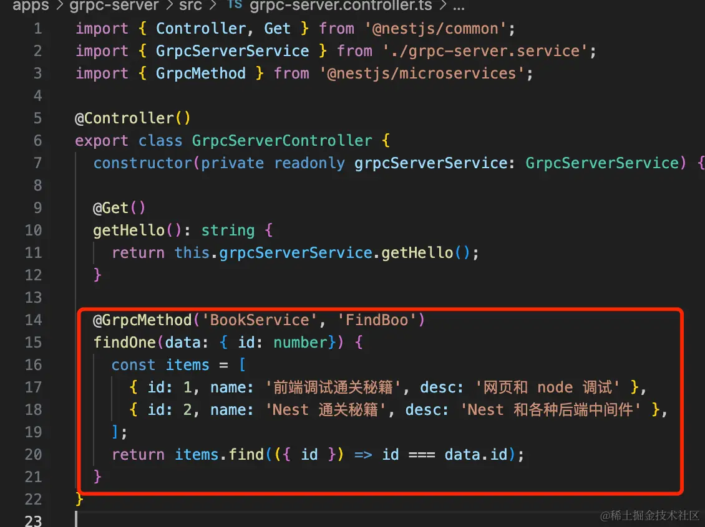

```javascript
@GrpcMethod('BookService', 'FindBook')
findBook(data: { id: number}) {
    const items = [
      { id: 1, name: '前端调试通关秘籍', desc: '网页和 node 调试' },
      { id: 2, name: 'Nest 通关秘籍', desc: 'Nest 和各种后端中间件' },
    ];
    return items.find(({ id }) => id === data.id);
}
```

实现了 findBook 方法，并通过 @GrpcMethod 把它标识为  grpc 的远程调用的方法。

在 nest-cli.json 添加 assets 配置，让 nest 在 build 的时候把 proto 也复制到 dist 目录下：

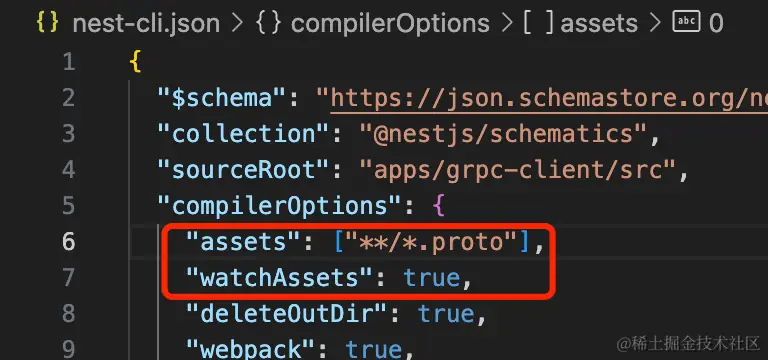

```javascript
"assets": ["**/*.proto"],
"watchAssets": true,
```

把它跑起来：

```
npm run start:dev grpc-server
```
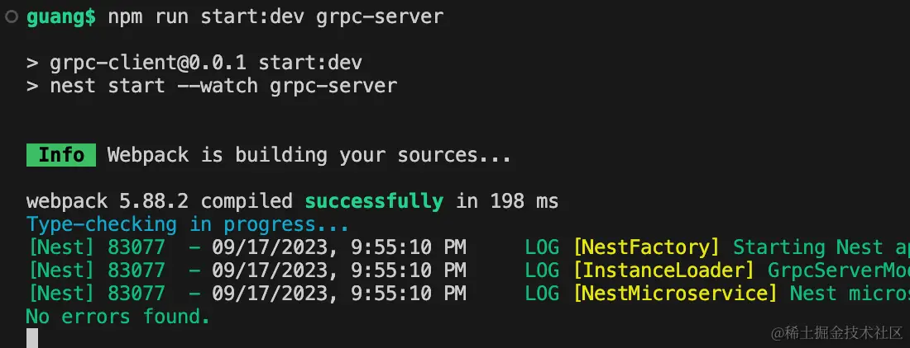

这时 dist 下就有 grpc-server 的代码了： 

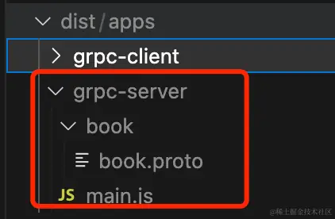

然后我们在 grpc-client 里连上它：

在 AppModule 里添加连接 grpc-server 的微服务的配置：

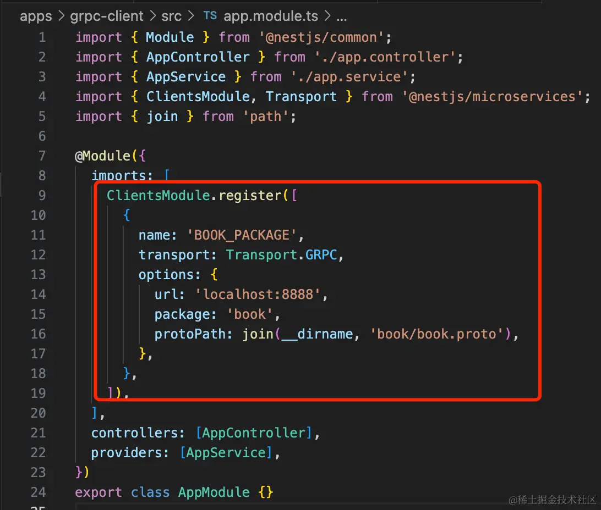

```javascript
import { Module } from '@nestjs/common';
import { AppController } from './app.controller';
import { AppService } from './app.service';
import { ClientsModule, Transport } from '@nestjs/microservices';
import { join } from 'path';

@Module({
  imports: [
    ClientsModule.register([
      {
        name: 'BOOK_PACKAGE',
        transport: Transport.GRPC,
        options: {
          url: 'localhost:8888',
          package: 'book',
          protoPath: join(__dirname, 'book/book.proto'),
        },
      },
    ]),
  ],
  controllers: [AppController],
  providers: [AppService],
})
export class AppModule {}
```
同样，客户端也是需要 proto 文件的，不然不知道怎么解析协议数据。

把 book/book.proto 文件复制过来：

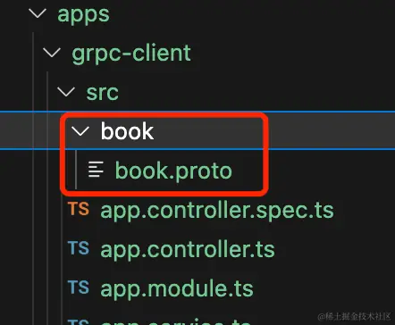

然后在 AppController 里实现调用远程方法的逻辑：

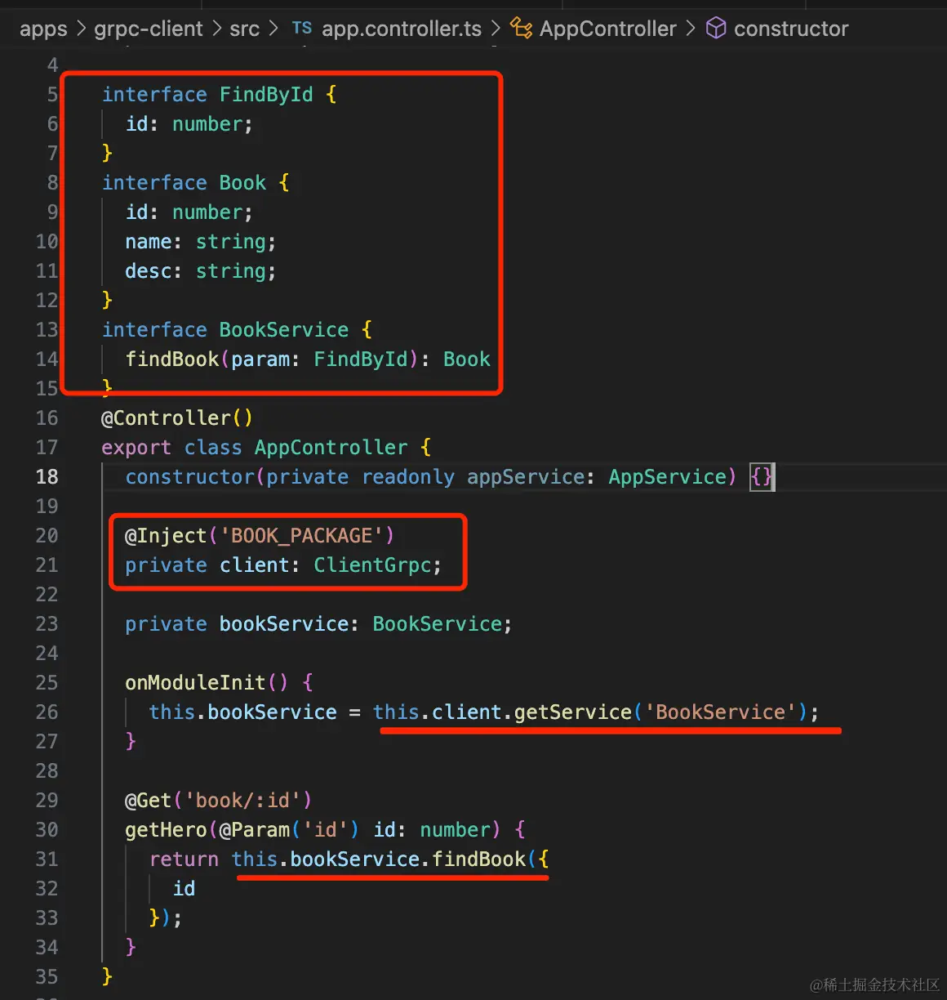

注入 BOOK_PACKAGE 的 grpc 客户端对象。

在 onModuleInit 的时候调用 getService 方法，拿到 BookService 的实例。

然后调用它的 findBook 方法。

```javascript
import { Controller, Get, Inject, Param, Query } from '@nestjs/common';
import { AppService } from './app.service';
import { ClientGrpc } from '@nestjs/microservices';

interface FindById {
  id: number;
}
interface Book {
  id: number;
  name: string;
  desc: string;  
}
interface BookService {
  findBook(param: FindById): Book 
}
@Controller()
export class AppController {
  constructor(private readonly appService: AppService) {}

  @Inject('BOOK_PACKAGE') 
  private client: ClientGrpc;

  private bookService: BookService;

  onModuleInit() {
    this.bookService = this.client.getService('BookService');
  }

  @Get('book/:id')
  getHero(@Param('id') id: number) {
    return this.bookService.findBook({
      id
    });
  }
}
```
把它跑起来：

```
npm run start:dev grpc-client
```
浏览器访问下：

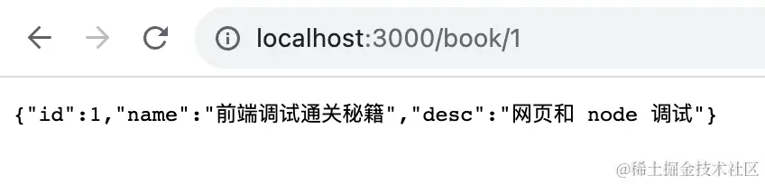

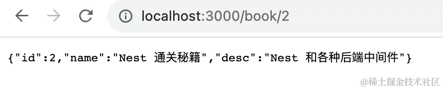

可以看到，远程方法调用成功了。

这就是基于 grpc 的远程方法调用，用 java、python、go、c++ 等实现的微服务也是这样来通信。

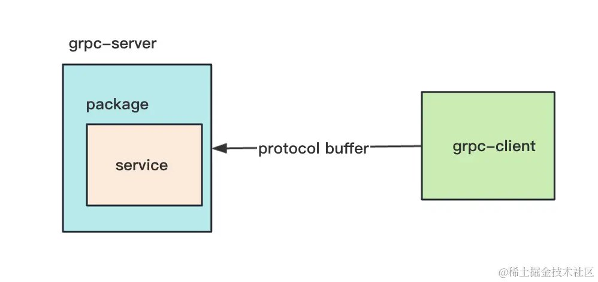

通过 protocol buffer 的语法定义通信数据的格式，比如 package、service 等。

然后 server 端实现 service 对应的方法，client 端远程调用这个 service。

比如在 java 的 srping 里，需要安装这两个依赖：

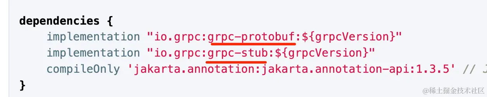

然后也是定义这样的 proto 文件：

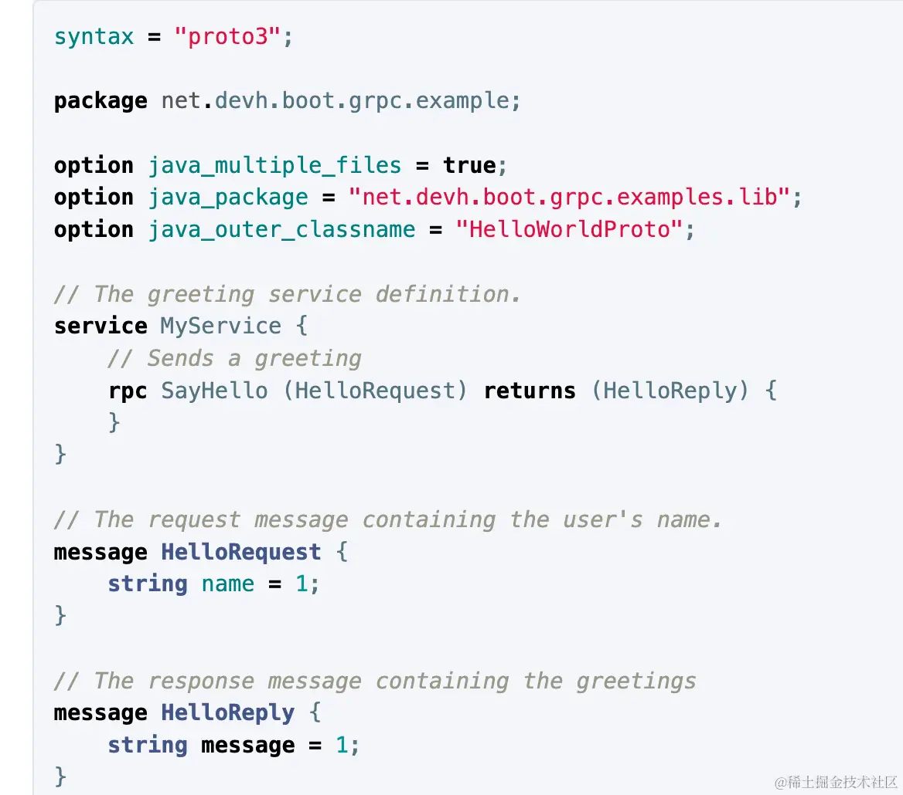

之后定义对应的 servie：

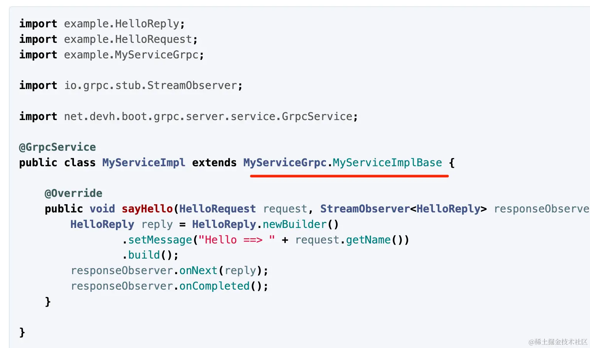

和 node 里差不多。

这样就能跨语言调用对方的方法了。

案例代码在[小册仓库](https://github.com/QuarkGluonPlasma/nestjs-course-code/tree/main/grpc-client)
## 总结

这节我们学习了基于 gRPC 的远程方法调用。

不同语言的微服务之间可以基于 gRPC 来相互调用对方的方法。

它的实现方式是通过 protocol buffer 的语法来定义通信数据的格式，定义 package、service。

然后 server 端实现 service 对应的方法，client 端远程调用这些 service。

这样就可以实现在 java、node、go、python 等多种语言之间实现微服务的远程方法调用。
