# 152. 为什么前端监控系统要用 RabbitMQ？

前端监控系统是采集用户端的异常、性能、业务埋点等数据上报，在服务端做存储，并支持可视化分析的平台。

用户量可能很大，采集的数据可能比较多，这时候服务端的并发压力会比较大，要是直接存入数据库，那数据库服务很可能会崩掉。


那就用现在的数据库，如何保证面对大量并发请求的时候，服务不崩呢？

答案就是消息队列，比如常用的 RabbitMQ：


第一个 web 服务接收请求，把消息存入 RabbitMQ，然后另一个 web 服务从 MQ 中取出消息存入数据库。

有同学说，这不是一样么？

不一样，MQ 的并发量比数据库高很多。之前 web 服务要等数据库存储完成才能响应，而现在只存入 MQ 就可以响应了。那可以支持的并发量就更多。

而数据库的并发比较低，我们可以通过 MQ 把消费的上限调低，就能保证数据库服务不崩。

比如 10w 的消息进来，每次只从中取出 1000 来消费：


并发量被控制住了，自然就崩不了了，从 MQ 中取出慢慢处理就好了。

这就是 MQ 的流量削峰的功能。

而且完全可以加几个 web 服务来同时消费 MQ 中的消息：


知道了 RabbitMQ 能干啥，那我们就来用一下试试吧！

我们通过 docker 来跑 RabbitMQ。

搜索 rabbitmq 的镜像，选择 3.11-management 的版本：

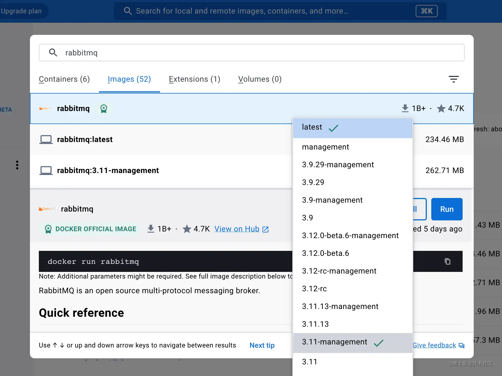

这个版本是有 web 管理界面的。

点击 run：

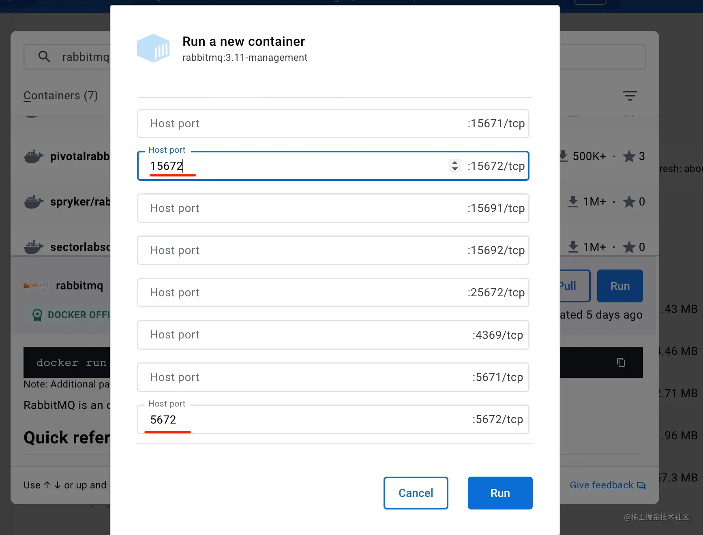

映射容器内的 5672、15672 这俩端口到本地的端口。

15672 是管理界面的，5672 是 mq 服务的端口。

等 rabbitmq 跑起来之后：

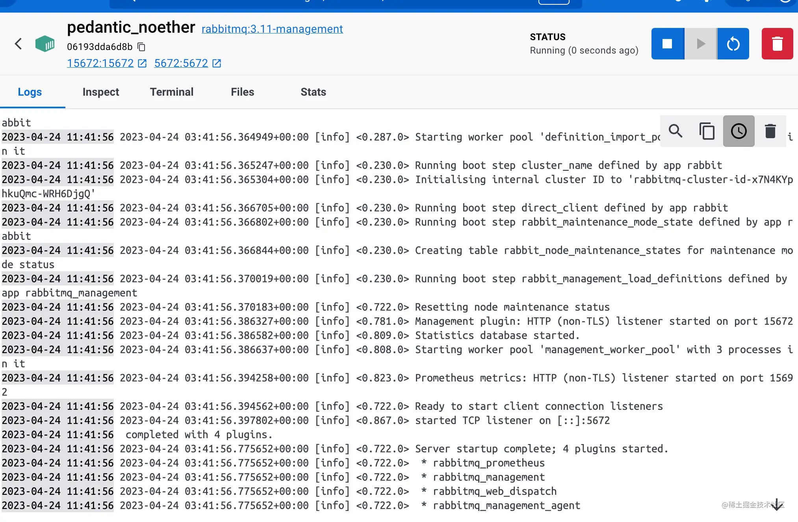

就可以在浏览器访问 http://localhost:15672 了：

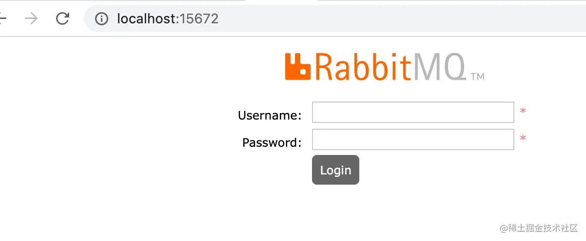

这就是它的 web 管理界面。

输入 guest、guest 进入管理页面：

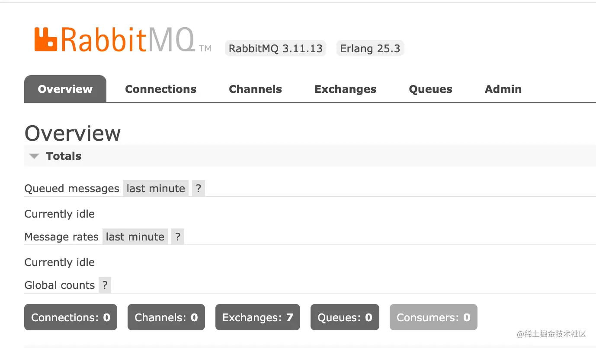

可以看到 connection、channel、exchange、queue 的分别的管理页面。

这些都是什么呢？

写个 demo 就理解了：

创建个项目：

```
mkdir rabbitmq-test

cd rabbitmq-test

npm init -y
```
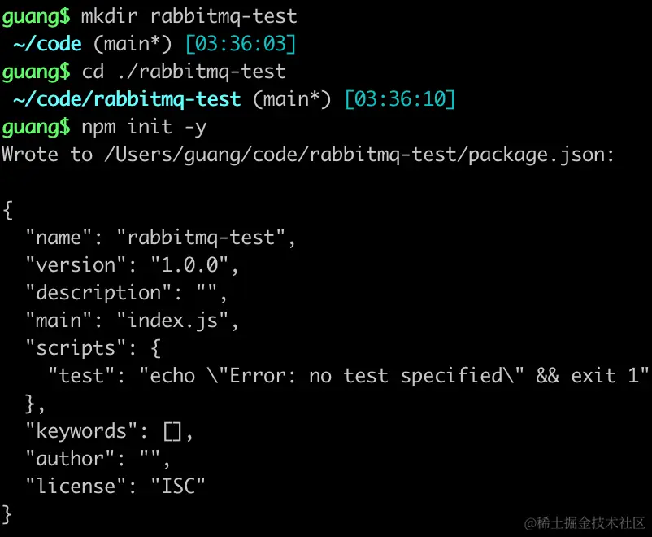

安装用到的包：

```
npm install amqplib
```
创建 src/producer.js

```javascript
import * as amqp from 'amqplib'

const connect = await amqp.connect(`amqp://localhost:5672`);
const channel = await connect.createChannel();

await channel.assertQueue('aaa');
await channel.sendToQueue('aaa',Buffer.from('hello'))
```
安装 amqplib 的包，这个是 rabbitmq 的 node 客户端（amqp 是 rabbitmq 的协议）。

上面的代码连接了 rabbitmq 服务，创建了一个名字为 aaa 的队列，并向队列中发送了一个消息。

然后 node 跑一下：

```
node ./src/producer.js
```
 （这里要用 es module 语法并且支持顶层 await 需要在 packege.json 里设置 type 为 module）
 
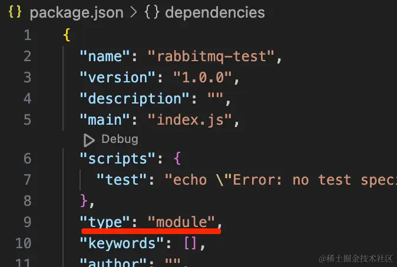


之后就可以在管理界面看到这个队列了：

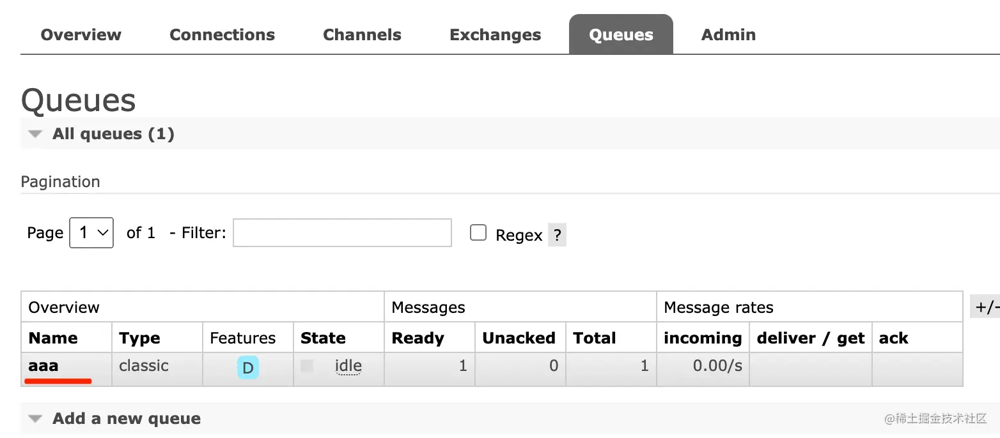

然后我们再写一个消费端 src/consumer.js：

```javascript
import * as amqp from 'amqplib'

const connect = await amqp.connect(`amqp://localhost:5672`);
const channel = await connect.createChannel();

const { queue } = await channel.assertQueue('aaa');
channel.consume(queue, msg => {
    console.log(msg.content.toString())
}, { noAck: true });
```
assertQueue 是如果没有就创建队列，有的话就直接返回。

这里取到那个队列，就可以从中消费消息了：

```
node src/consumer.js
```

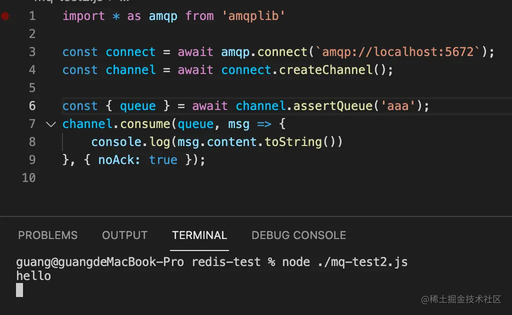

这样，我们就完成了第一次 RabbitMQ 的通信，两个服务之间也是这样通信的。

是不是还挺简单的？

rabbitmq 使用确实挺简单。

那怎么控制并发数呢？


我们改一下 src/producer.js：

```javascript
import * as amqp from 'amqplib'

const connect = await amqp.connect(`amqp://localhost:5672`);
const channel = await connect.createChannel();

await channel.assertQueue('aaa', {durable: false});

let i = 1;
setInterval(async () => {
    const msg = 'hello' + i;
    console.log('发送消息：', msg);
    await channel.sendToQueue('aaa',Buffer.from(msg))
    i++;
}, 500);
```

生产者每 0.5s 发送一次消息。

消费者每 1s 处理一条消息：

```javascript
import * as amqp from 'amqplib'

const connect = await amqp.connect(`amqp://localhost:5672`);
const channel = await connect.createChannel();

const { queue } = await channel.assertQueue('aaa');
channel.prefetch(3);

const currentTask = [];
channel.consume(queue, msg => {
    currentTask.push(msg);
    console.log('收到消息：', msg.content.toString());
}, { noAck: false });

setInterval(() => {
    const curMsg = currentTask.pop();
    channel.ack(curMsg);
}, 1000);
```
每条消费者收到的消息要确认之后才会在 MQ 里删除。可以收到消息自动确认，也可以手动确认。

这里我把 noAck 设置为 false 了，也就是不自动确认。

把收到的消息放入一个数组中，每 1s 确认一次。

然后我设置了 prefetch 为 3，也就是每次最多取回 3 条消息来处理。

跑一下试试：

消息生产端：

```
node ./src/producer.js
```
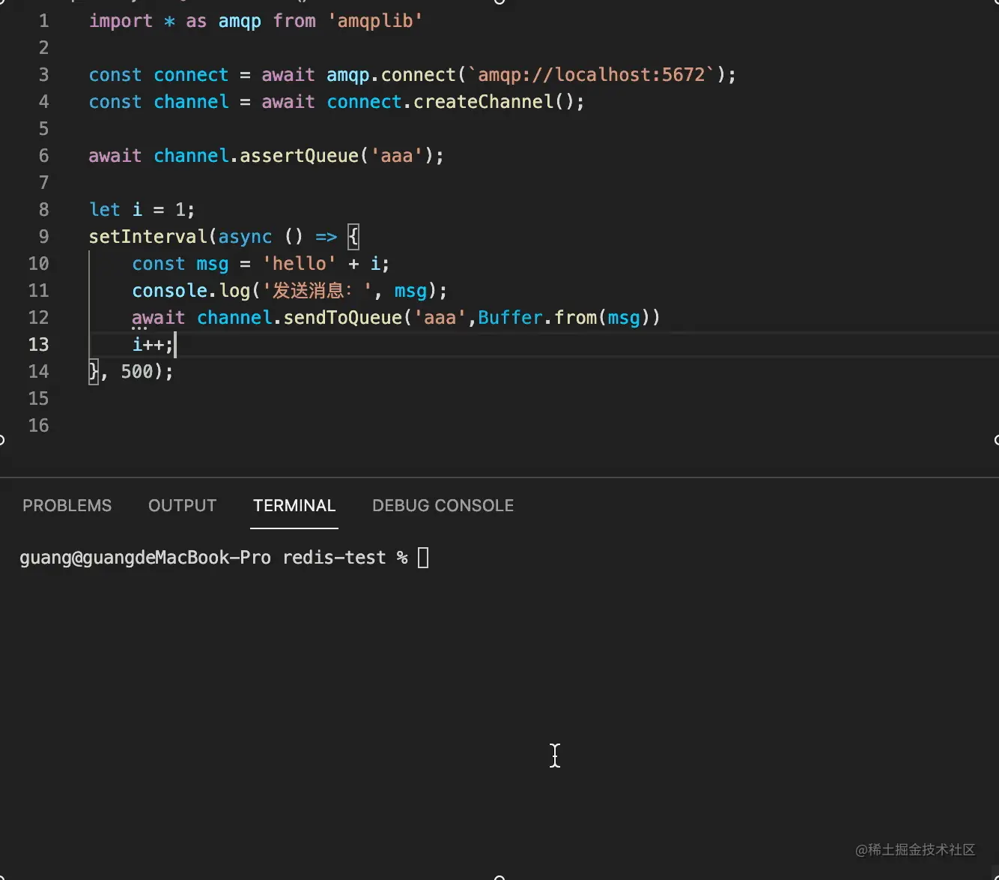

消息消费端：
```
node ./src/consumer.js
```
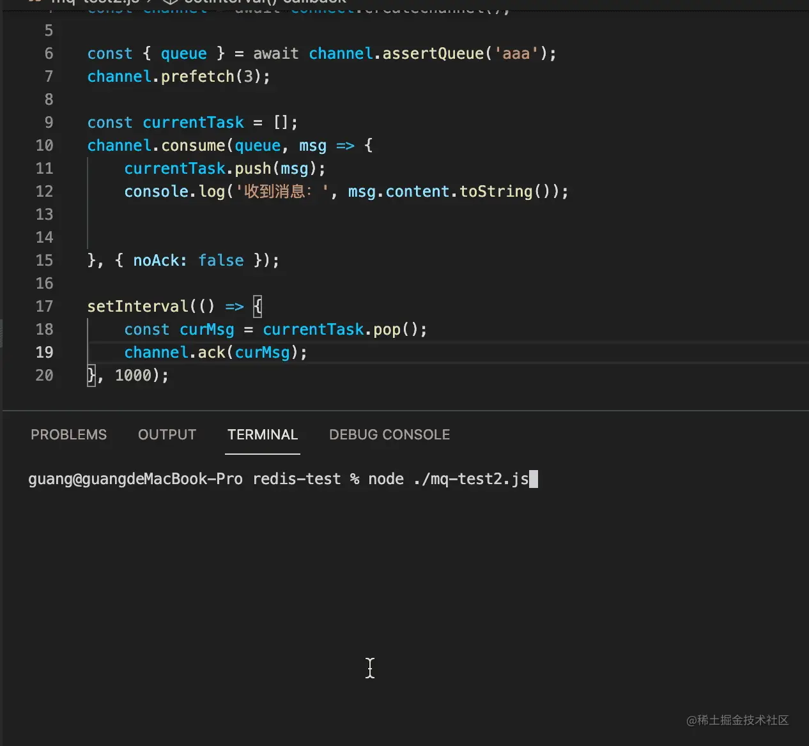

可以看到生产者是每 0.5s 往队列里放一条消息。

消费者一开始取出 3 条，然后每处理完一条取一条，保证最多并发处理 3 条。

这就是流量削峰的功能。

不同服务之间的速度差异可以通过 MQ 来缓冲。

大概了解了 rabbitmq 之后，我们来看看它的整体架构图：

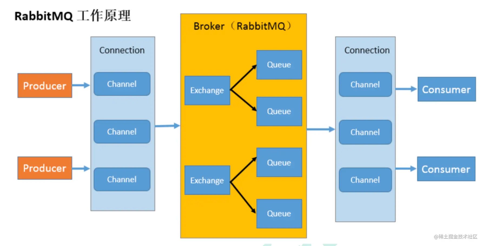

Producer 和 Consumer 分别是生产者和消费者。

Connection 是连接，但我们不会每用一次 rabbitmq 就创建一个单独的 Connection，而是在一个 Connection 里做一下划分，叫做 Channel，每个 Channel 做自己的事情。

而 Queue 就是两端存取消息的地方了。

整个接收消息和转发消息的服务就叫做 Broker。

至于 Exchange，我们前面的例子没有用到，这个是把消息放到不同的队列里用的，叫做交换机。

我们前面生产者和消费者都是直接指定了从哪个队列存取消息，那如果是一对多的场景呢？

总不能一个个的调用 sendQueue 发消息吧？

这时候就要找一个 Exchange（交换机） 来帮我们完成把消息按照规则放入不同的 Queue 的工作了。

Exchange 主要有 4 种：

- fanout：把消息放到这个交换机的所有 Queue
- direct：把消息放到交换机的指定 key 的队列
- topic：把消息放到交换机的指定 key 的队列，支持模糊匹配
- headers：把消息放到交换机的满足某些 header 的队列

一个个来试下：

首先是 direct，生产者端 src/direct.js：

```javascript
import * as amqp from 'amqplib'

const connect = await amqp.connect(`amqp://localhost:5672`);
const channel = await connect.createChannel();

await channel.assertExchange('direct-test-exchange', 'direct');

channel.publish('direct-test-exchange', 'aaa',  Buffer.from('hello1'));
channel.publish('direct-test-exchange', 'bbb',  Buffer.from('hello2'));
channel.publish('direct-test-exchange', 'ccc',  Buffer.from('hello3'));
```

不再是直接 sendToQueue 了，而是创建一个 exchange，然后调用 publish 往这个 exchange 发消息。

其中第二个参数是 routing key，也就是消息路由到哪个队列。

然后创建两个消费者：

src/direct-consumer1.js

```javascript
import * as amqp from 'amqplib'

const connect = await amqp.connect(`amqp://localhost:5672`);
const channel = await connect.createChannel();

const { queue } = await channel.assertQueue('queue1');
await channel.bindQueue(queue,  'direct-test-exchange', 'aaa');

channel.consume(queue, msg => {
    console.log(msg.content.toString())
}, { noAck: true });
```
src/direct-consumer2.js
```javascript
import * as amqp from 'amqplib'

const connect = await amqp.connect(`amqp://localhost:5672`);
const channel = await connect.createChannel();

const { queue } = await channel.assertQueue('queue2');
await channel.bindQueue(queue,  'direct-test-exchange', 'bbb');

channel.consume(queue, msg => {
    console.log(msg.content.toString())
}, { noAck: true });

```

分别创建 queue1 和 queue2 两个队列，绑定到前面创建的 direct-test-exchange 这个交换机上，指定了路由 key 分别是 aaa 和 bbb。

然后把生产者和两个消费者跑起来。

```
node src/direct.js
```
```
node src/direct-consumer1.js
```
```
node src/direct-consumer2.js
```
就可以看到队列 queue1 和 queue2 分别接收到了对应的消息：


这就是通过 direct 交换机发送消息的过程。

在管理页面上也可以看到这个交换机的信息：

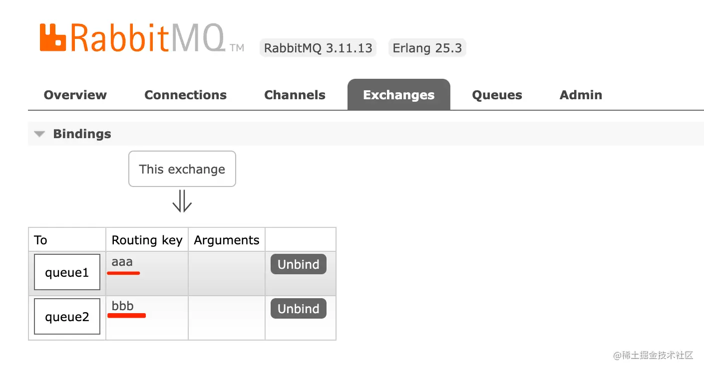

包括 exchange 下的两个 queue 以及各自的 routing key。

再来试下 topic 类型的 Exchange。

src/topic.js

```javascript
import * as amqp from 'amqplib'

const connect = await amqp.connect(`amqp://localhost:5672`);
const channel = await connect.createChannel();

await channel.assertExchange('direct-test-exchange2', 'topic');

channel.publish('direct-test-exchange2', 'aaa.1',  Buffer.from('hello1'));
channel.publish('direct-test-exchange2', 'aaa.2',  Buffer.from('hello2'));
channel.publish('direct-test-exchange2', 'bbb.1',  Buffer.from('hello3'));
```

生产者端创建叫 direct-test-exchange2 的 topic 类型的 Exchange，然后发三条消息。

创建两个消费端：

src/topic-consumer1.js

```javascript
import * as amqp from 'amqplib'

const connect = await amqp.connect(`amqp://localhost:5672`);
const channel = await connect.createChannel();

await channel.assertExchange('direct-test-exchange2', 'topic');

const { queue } = await channel.assertQueue('queue1');
await channel.bindQueue(queue,  'direct-test-exchange2', 'aaa.*');

channel.consume(queue, msg => {
    console.log(msg.content.toString())
}, { noAck: true });
```
src/topic-consumer2.js

```javascript
import * as amqp from 'amqplib'

const connect = await amqp.connect(`amqp://localhost:5672`);
const channel = await connect.createChannel();

await channel.assertExchange('direct-test-exchange2', 'topic');

const { queue } = await channel.assertQueue('queue2');
await channel.bindQueue(queue,  'direct-test-exchange2', 'bbb.*');

channel.consume(queue, msg => {
    console.log(msg.content.toString())
}, { noAck: true });
```
两个消费者端分别创建 queue1 和 queue2 两个队列，绑定到 direct-test-exchange2 的交换机下。

指定路由 key 分别为 aaa.* 和 bbb.*，这里的 * 是模糊匹配的意思。

消费者端也 assertExchange 了，如果不存在就创建，保证 exchange 一定存在。

然后跑一下：
```
node src/topic.js
```
```
node src/topic-consumer1.js
```
```
node src/topic-consumer2.js
```


可以看到，两个消费者分别收到了不同 routing key 对应的消息。

当然，在管理界面这里也是可以发消息的：

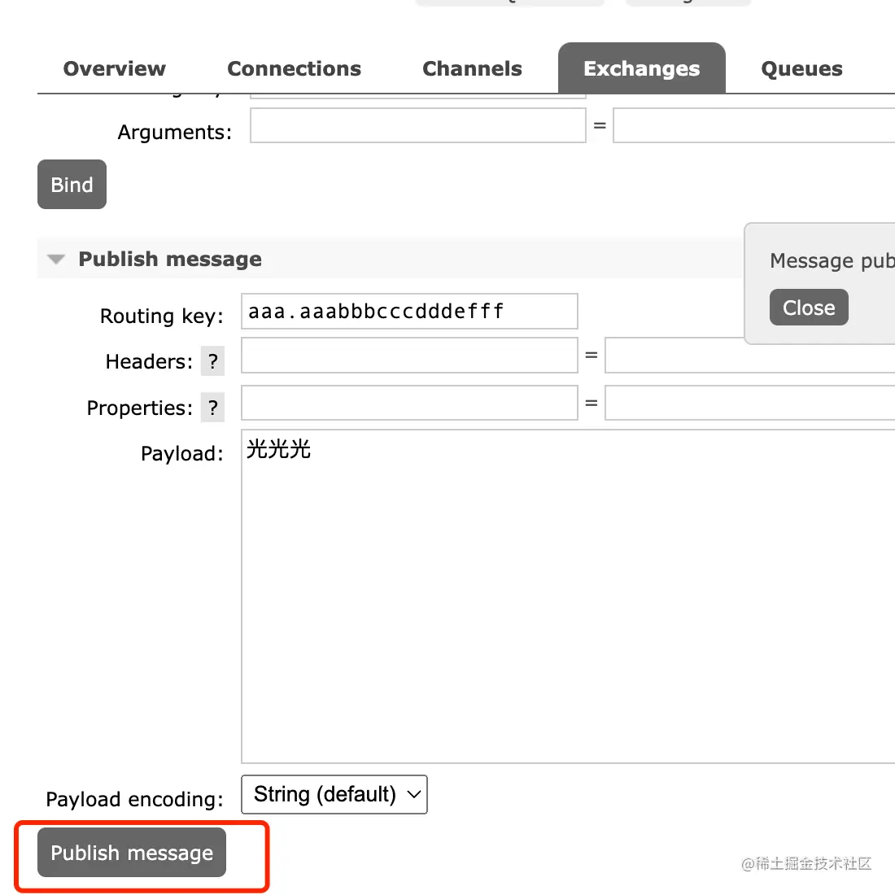

消费者端同样可以收到：


这就是 topic 类型的交换机，可以根据模糊匹配 routing key 来发消息到不同队列。

再来试下 fanout 类型的 exchange：

生产者：

src/fanout.js

```javascript
import * as amqp from 'amqplib'

const connect = await amqp.connect(`amqp://localhost:5672`);
const channel = await connect.createChannel();

await channel.assertExchange('direct-test-exchange3', 'fanout');

channel.publish('direct-test-exchange3', '',  Buffer.from('hello1'));
channel.publish('direct-test-exchange3', '',  Buffer.from('hello2'));
channel.publish('direct-test-exchange3', '',  Buffer.from('hello3'));
```
消费者：

src/fanout-consumer1.js

```javascript
import * as amqp from 'amqplib'

const connect = await amqp.connect(`amqp://localhost:5672`);
const channel = await connect.createChannel();

await channel.assertExchange('direct-test-exchange3', 'fanout');

const { queue } = await channel.assertQueue('queue1');
await channel.bindQueue(queue,  'direct-test-exchange3', 'aaa');

channel.consume(queue, msg => {
    console.log(msg.content.toString())
}, { noAck: true });
```
src/fanout-consumer2.js

```javascript
import * as amqp from 'amqplib'

const connect = await amqp.connect(`amqp://localhost:5672`);
const channel = await connect.createChannel();

await channel.assertExchange('direct-test-exchange3', 'fanout');

const { queue } = await channel.assertQueue('queue2');
await channel.bindQueue(queue,  'direct-test-exchange3', 'bbb');

channel.consume(queue, msg => {
    console.log(msg.content.toString())
}, { noAck: true });
```
fanout 是广播消息到 Exchange 下的所有队列，不需要指定 routing key，计算指定了也会忽略。

跑起来可以看到，两个消费者都收到了消息：
```
node src/fanout.js
```
```
node src/fanout-consumer1.js
```
```
node src/fanout-consumer2.js
```


这就是 fanout 类型交换机的特点，广播消息到所有绑定到它的 queue。

最后再来看下 headers 类型的 Exchange，这个不是根据 routing key 来匹配了，而是根据 headers：

生产者端：

src/headers.js

```javascript
import * as amqp from 'amqplib'

const connect = await amqp.connect(`amqp://localhost:5672`);
const channel = await connect.createChannel();

await channel.assertExchange('direct-test-exchange4', 'headers');

channel.publish('direct-test-exchange4', '',  Buffer.from('hello1'), {
    headers: {
        name: 'guang'
    }
});
channel.publish('direct-test-exchange4', '',  Buffer.from('hello2'), {
    headers: {
        name: 'guang'
    }
});
channel.publish('direct-test-exchange4', '',  Buffer.from('hello3'), {
    headers: {
        name: 'dong'
    }
});
```
消费者端：

src/headers-consumer1.js

```javascript
import * as amqp from 'amqplib'

const connect = await amqp.connect(`amqp://localhost:5672`);
const channel = await connect.createChannel();

await channel.assertExchange('direct-test-exchange4', 'headers');

const { queue } = await channel.assertQueue('queue1');
await channel.bindQueue(queue,  'direct-test-exchange4', '', {
    name: 'guang'
});

channel.consume(queue, msg => {
    console.log(msg.content.toString())
}, { noAck: true });
```
src/headers-consumer2.js

```javascript
import * as amqp from 'amqplib'

const connect = await amqp.connect(`amqp://localhost:5672`);
const channel = await connect.createChannel();

await channel.assertExchange('direct-test-exchange4', 'headers');

const { queue } = await channel.assertQueue('queue2');
await channel.bindQueue(queue,  'direct-test-exchange4', '', {
    name: 'dong'
});

channel.consume(queue, msg => {
    console.log(msg.content.toString())
}, { noAck: true });
```
跑起来是这样的：
```
node src/headers.js
```
```
node src/headers-consumer1.js
```
```
node src/headers-consumer2.js
```


很容易理解，只是从匹配 routing key 变成了匹配 header。

这就是 Exchange，当你需要一对多发消息的时候，就可以选择这些类型的交换机。

回过头来，我们来总结下 rabbitmq 解决了什么问题：

- **流量削峰**：可以把很大的流量放到 mq 种按照一定的流量上限来慢慢消费，这样虽然慢一点，但不至于崩溃。
- **应用解耦**：应用之间不再直接依赖，就算某个应用挂掉了，也可以再恢复后继续从 mq 中消费消息。并不会一个应用挂掉了，它关联的应用也挂掉。

比如前端监控系统的后端服务，就很适合使用 mq 来做流量削峰。

案例代码在[小册仓库](https://github.com/QuarkGluonPlasma/nestjs-course-code/tree/main/rabbitmq-test)

## 总结
前端监控系统会收到很多来自用户端的请求，如果直接存入数据库很容易把数据库服务搞挂掉，所以一般会加一个 RabbitMQ 来缓冲。

它是生产者往 queue 里放入消息，消费者从里面读消息，之后确认消息收到的流程。

当一对多的时候，还要加一个 Exchange 交换机来根据不同的规则转发消息：

- direct 交换机：根据 routing key 转发消息到队列
- topic 交换机：根据 routing key 转发消息到队列，支持模糊匹配
- headers 交换机：根据 headers 转发消息到队列
- fanout 交换机：广播消息到交换机下的所有队列

而且消费者可以设置一个消费的并发上限，这样就可以保证服务不会因并发过高而崩溃。

这就是流量削峰的功能。

RabbitMQ 在后端系统中经常能见到，是很常用的中间件。
