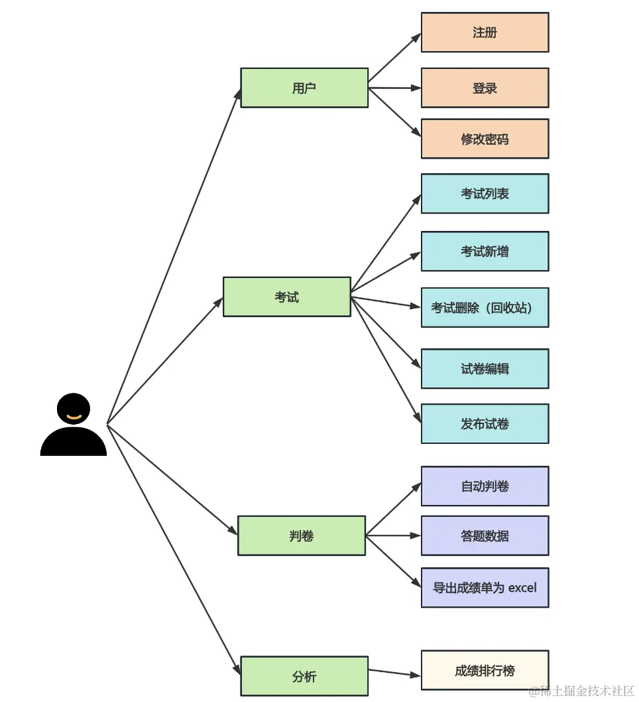
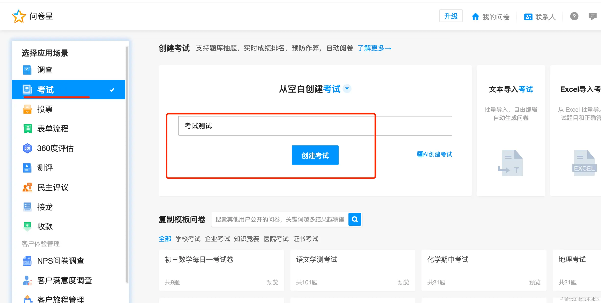
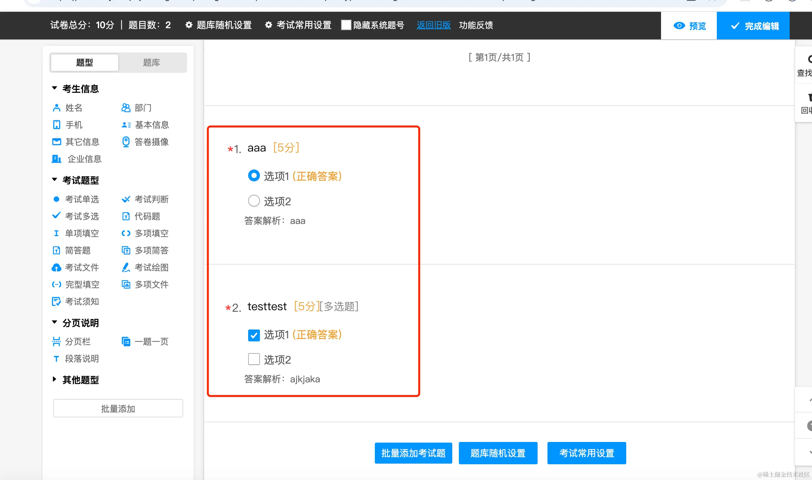
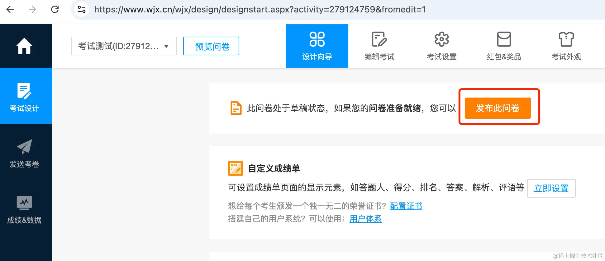
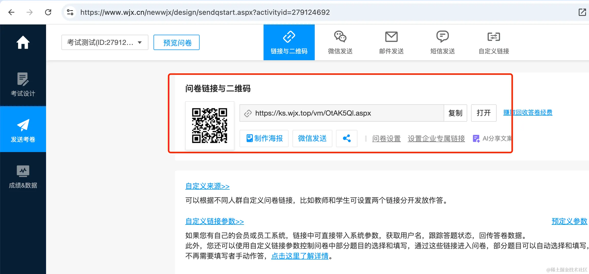
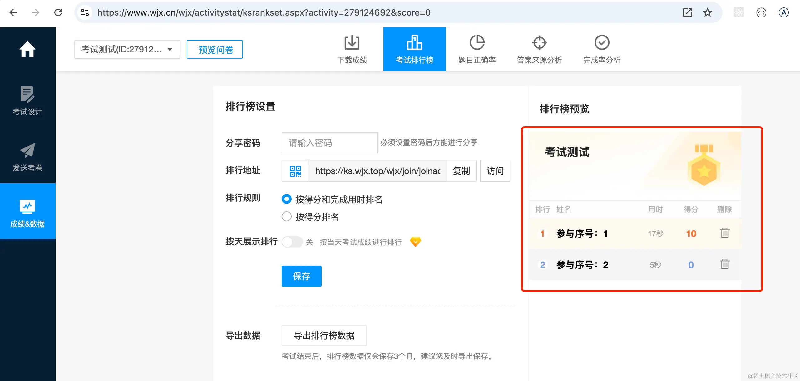

# 155. 考试系统：需求分析

这节开始，我们来做微服务的实战项目：考试系统。

大概有这些功能：

用户可以注册、登录、修改密码。

登录后可以查看考试列表，可以创建新的考试，也可以删除考试。

删除的考试会放到回收站。

试卷的编辑器是一个类似低代码的拖拽编辑的形式，有多种题型，编辑后可以保存试卷。

编辑的时候可以给每个题目设置分数、正确答案、答案解析。

保存试卷后点击发布，就可以把试卷链接发给用户了，用户答题后会保存答卷数据。

会自动判卷，并给出分数，这时可以查看正确答案和题解。

后台可以查看所有的答题数据和成绩单，可以导出成绩单为 excel。

还可以查看成绩排行榜。

这就是考试系统的全部功能。

其实我们这个系统是参考[问卷星](https://www.wjx.cn/)的考试来设计的。

据说它有 300 万家企业和国内 90% 的高校在用：

是很知名的一个问卷调查平台。

我们就不做原型图了，直接照着问卷星的来写就行。

登录后进入后台管理可以看到所有问卷列表：

它的问卷类型支持考试：

创建考试后，进入编辑器，可以添加不同的题型：

每道题目都可以设置分数、答案解析：

保存后，点击发布，会生成链接和二维码：

用户扫码后就可以答题了：

并且答完点提交会立刻判卷，给出分数，还可以查看正确答案和解析：

我们再答一份，然后可以在后台看到所有的答卷数据：

可以下载答卷数据为 excel：

可以查看考试排行榜：

这就是问卷星的考试系统的全部功能。

我们整体流程和他一样，只有一点不同：

它的问卷可以匿名答，我们的问卷要求登录之后作答，这样可以把问卷数据和用户关联。

## 总结

这节我们分析了下考试系统的需求。

主要有用户、考试、判断、分析，这四个模块。

功能主要有这些：

考试列表、考试编辑、考试删除、发布考试。

自动判卷、答题数据、成绩排行榜。

和问卷星类似，除了我们答卷需要登录。

整个项目的流程还是挺清晰的。
