# 16. 如何创建动态模块

前面讲过，Provider 是可以通过 useFactory 动态产生的，那 Module 可不可以呢？

自然是可以的，这节我们就来学下动态模块 Dynamic Module。

我们新建一个项目：

```
nest new dynamic-module -p npm
```
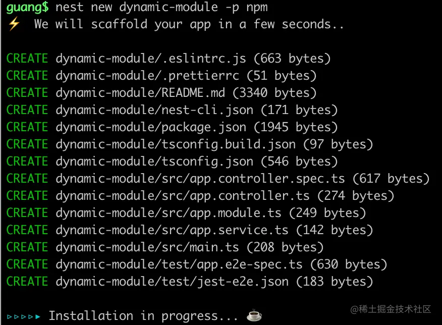

执行
```
nest g resource bbb
```
创建一个实现了 CRUD 的模块：

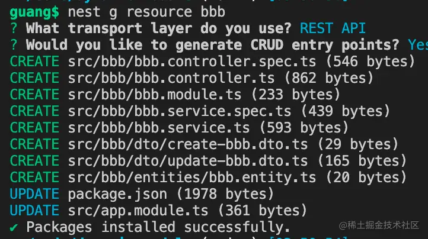

然后执行：
```
npm run start:dev
```
浏览器访问下，可以看到 bbb 模块生效了：

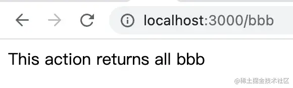

这个模块是静态的，也就是它的内容是固定不变的，每次 import 都是一样：

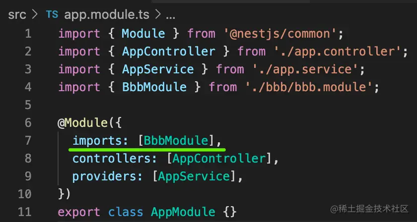

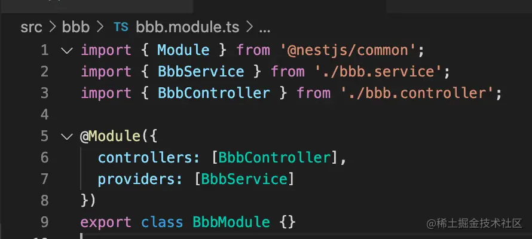

有的时候我们希望 import 的时候给这个模块传一些参数，动态生成模块的内容，怎么办呢？

这时候就需要 Dynamic Module 了：

```javascript
import { DynamicModule, Module } from '@nestjs/common';
import { BbbService } from './bbb.service';
import { BbbController } from './bbb.controller';

@Module({})
export class BbbModule {

  static register(options: Record<string, any>): DynamicModule {
    return {
      module: BbbModule,
      controllers: [BbbController],
      providers: [
        {
          provide: 'CONFIG_OPTIONS',
          useValue: options,
        },
        BbbService,
      ],
      exports: []
    };
  }
}
```

我们给 BbbModule 加一个 register 的静态方法，返回模块定义的对象。

和在装饰器里定义的时候的区别，只是多了一个 module 属性：

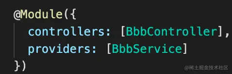

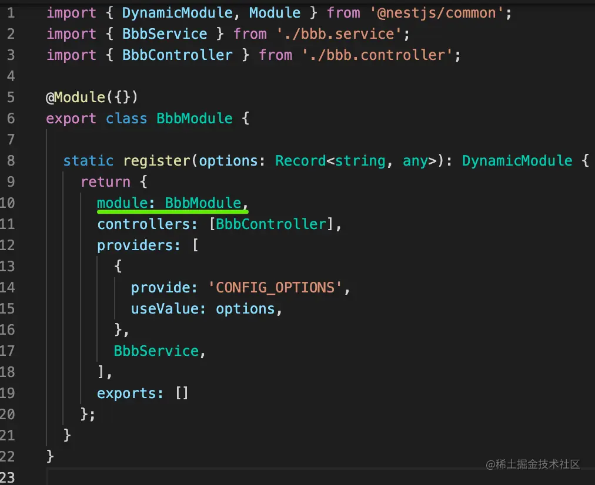

而且我们还可以把参数传入的 options 对象作为一个新的 provider。

import 的时候就得这样用了，通过 register 方法传入参数，返回值就是模块定义：

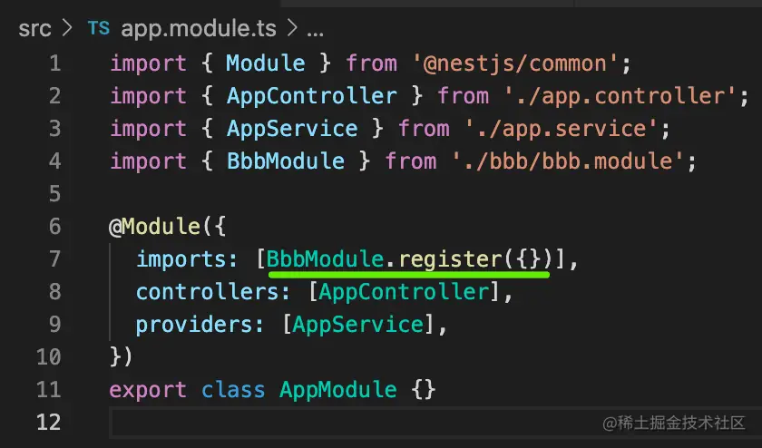

改成这样之后，再跑一下：


依然是正常的。

而且这时候我们把传入的 options 通过 useValue 创建了个 provider，这样模块内部就可以注入它了。

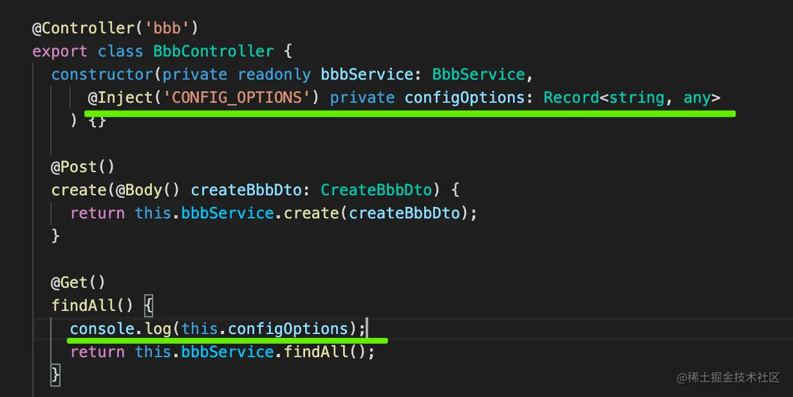

我在 BbbController 里面通过 token 注入这个 provider，打印下它的值。

改一下 register 的参数：

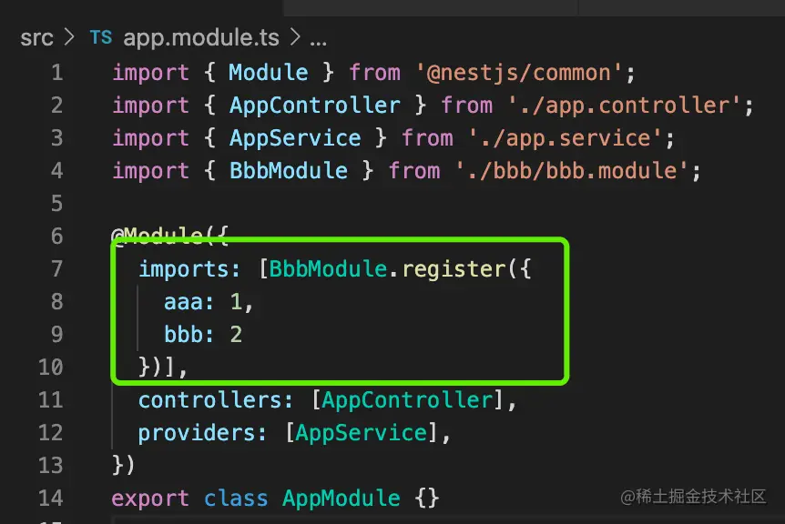

浏览器再访问下，可以看到控制台打印了 config 对象：

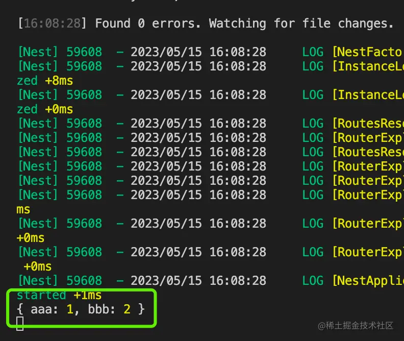

这样我们就可以在 import 一个模块的时候，传入参数，然后动态生成模块的内容。

这就是 Dynamic Module。

这里的 register 方法其实叫啥都行，但 nest 约定了 3 种方法名：

*   register
*   forRoot
*   forFeature

我们约定它们分别用来做不同的事情：

*   register：用一次模块传一次配置，比如这次调用是 BbbModule.register({aaa:1})，下一次就是 BbbModule.register({aaa:2}) 了

*   forRoot：配置一次模块用多次，比如 XxxModule.forRoot({}) 一次，之后就一直用这个 Module，一般在 AppModule 里 import

*   forFeature：用了 forRoot 固定了整体模块，用于局部的时候，可能需要再传一些配置，比如用 forRoot 指定了数据库链接信息，再用 forFeature 指定某个模块访问哪个数据库和表。

光这么说可能不够直观，我们看一个真实的动态模块就懂了。

比如 @nestjs/typeorm 的动态模块：

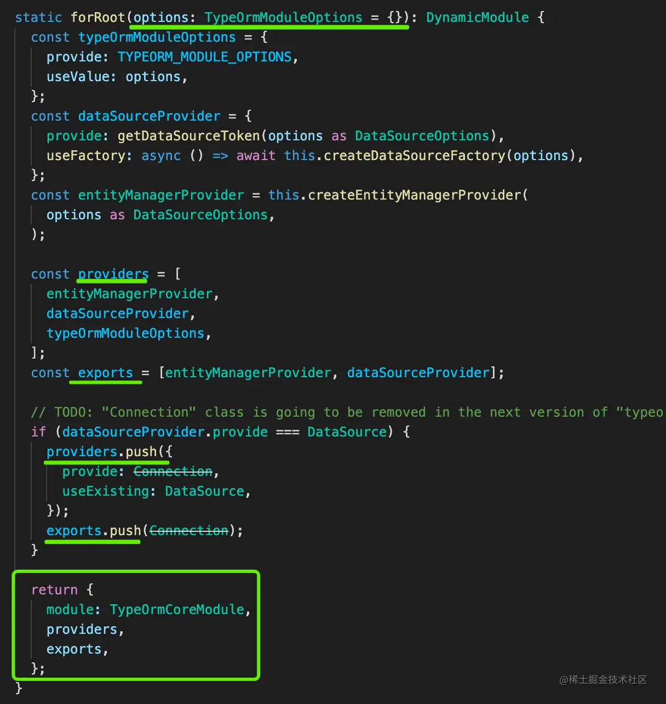

forRoot 传入配置，动态产生 provider 和 exports，返回模块定义。

而且还有 forRootAsync：

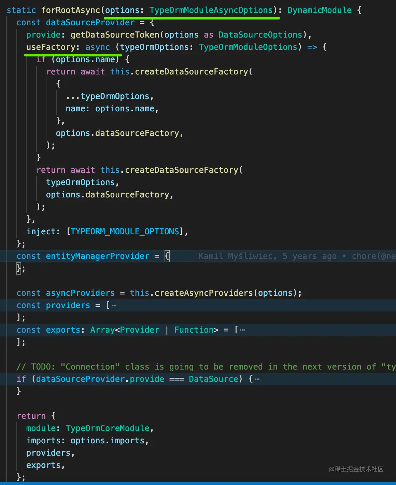

区别就是可以用 async 的 useFactory 动态产生 provider，比如异步请求别的服务拿到配置返回，作为 options。

forFeature 则是传入局部的一些配置，来动态产生局部用的模块：

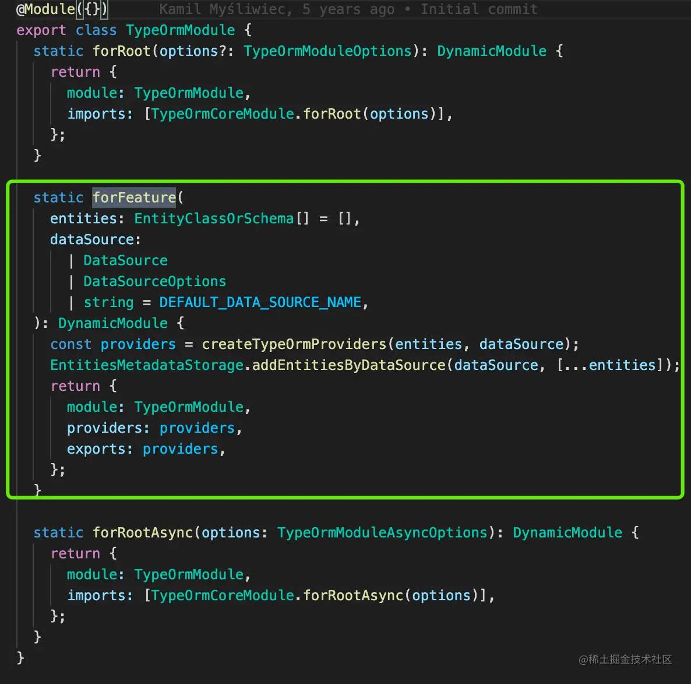

typeorm 的模块用起来是这样的：

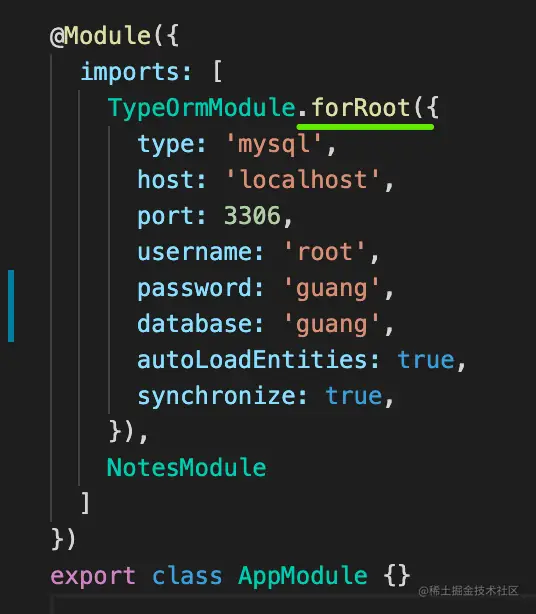

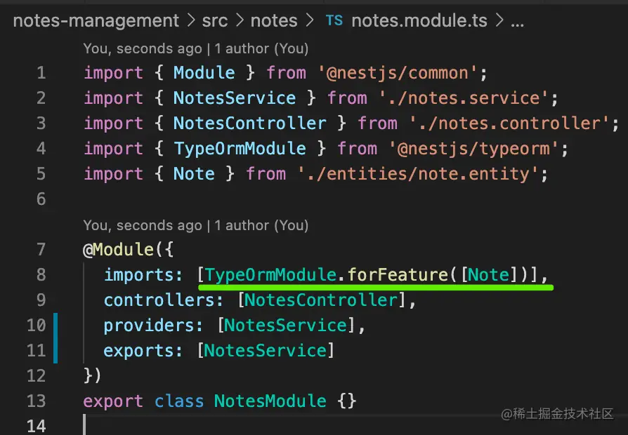

在 AppModule 里 import 通过 forRoot 动态产生的模块，在具体的业务 Module 里，通过 forFeature 传入具体实体类的配置。

其实 forRoot、forFeature、register 有区别么？

本质上没区别，只是我们约定了它们使用上的一些区别。

此外，Nest 还提供了另一种方式来创建动态模块：

我们再生成一个新模块：

    nest g module ccc

然后生成个 controller：

    nest g controller ccc --no-spec

这次我们不手动写 register、registerAsync 等方法了，用 builder 来生成。

新建一个 ccc.module-definition.ts 文件：

```javascript
import { ConfigurableModuleBuilder } from "@nestjs/common";

export interface CccModuleOptions {
    aaa: number;
    bbb: string;
}

export const { ConfigurableModuleClass, MODULE_OPTIONS_TOKEN } =
  new ConfigurableModuleBuilder<CccModuleOptions>().build();
```

用 ConfigurableModuleBuilder 生成一个 class，这个 class 里就带了 register、registerAsync 方法。

返回的 ConfigurableModuleClass、MODULE\_OPTIONS\_TOKEN 分别是生成的 class 、options 对象的 token。

然后 Module 继承它：

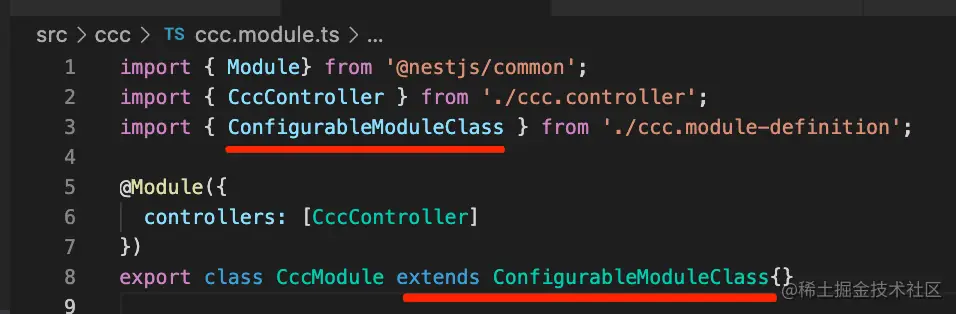

这样这个 CccModule 就已经有了 register 和 registerAsync 方法了：

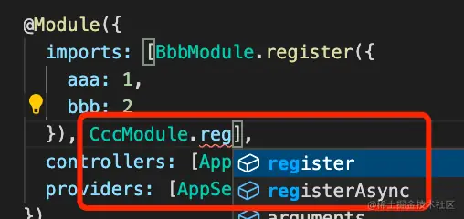

不用自己定义了，省事了不少。

传入 options：

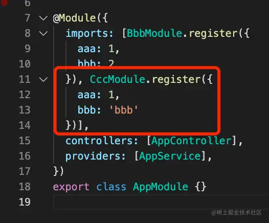

那现在如何在 Module 内注入这个 options 呢？

记得 build class 的时候返回了一个 token 么？

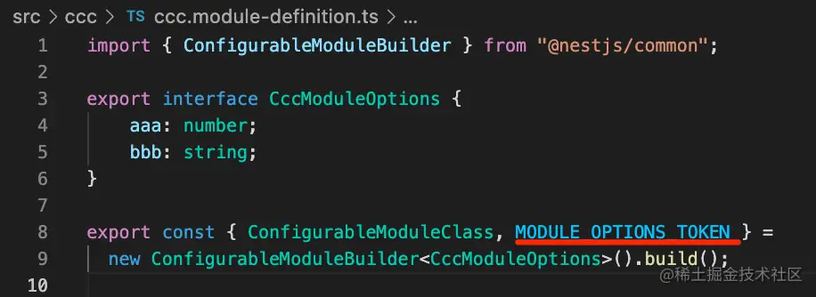

就用这个注入：

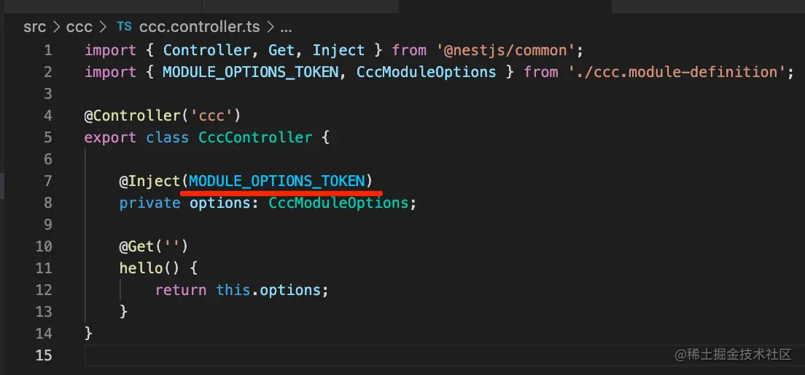

```javascript
import { Controller, Get, Inject } from '@nestjs/common';
import { MODULE_OPTIONS_TOKEN, CccModuleOptions } from './ccc.module-definition';

@Controller('ccc')
export class CccController {

    @Inject(MODULE_OPTIONS_TOKEN)
    private options: CccModuleOptions;

    @Get('')
    hello() {
        return this.options;
    }
}
```

浏览器访问下：

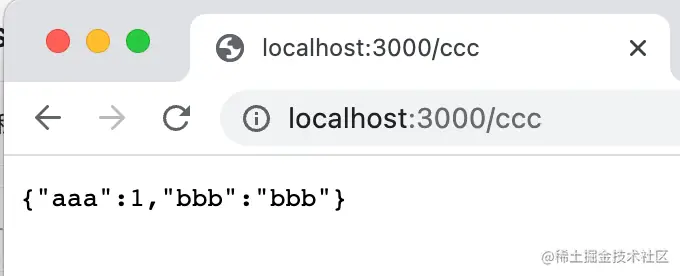

可以看到拿到了 options 对象。

当然，options 对象不是这么用的，一般是用来做配置，内部的 provider 基于它来做一些设置，这里只是演示。

你还可以用 registerAsync 方法，用 useFactory 动态创建 options 对象：

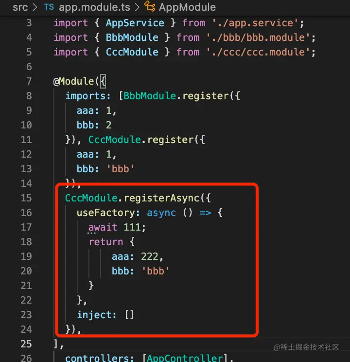

前面我们不是说还可以用 forRoot、forFeature 这样的方法么？

那用 builder 的方式如何生成这样的 class 呢？

调用 setClassMethodName 设置下就好了：

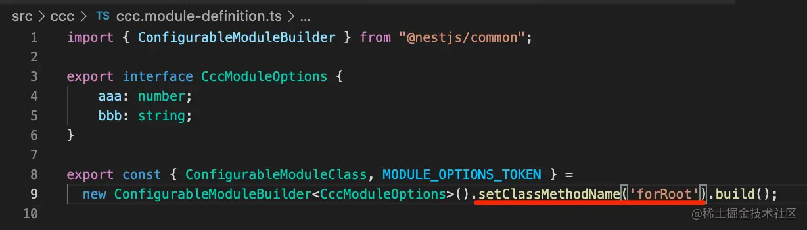

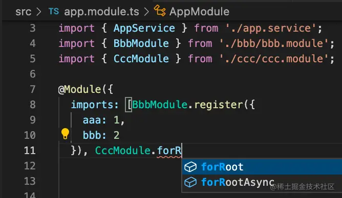

如果我还想根据传入的参数决定是否设置为全局模块呢？

那就要这样写了：

```javascript
import { ConfigurableModuleBuilder } from "@nestjs/common";

export interface CccModuleOptions {
    aaa: number;
    bbb: string;
}

export const { ConfigurableModuleClass, MODULE_OPTIONS_TOKEN } =
  new ConfigurableModuleBuilder<CccModuleOptions>().setClassMethodName('register').setExtras({
    isGlobal: true
  }, (definition, extras) => ({
    ...definition,
    global: extras.isGlobal,
  })).build();

```

setExtras 第一个参数是给 options 扩展啥 extras 属性，第二个参数是收到 extras 属性之后如何修改模块定义。

我们定义了 isGlobal 的 option，收到它之后给模块定义加上个 global。

这时候你就会发现 register 的 options 多了 isGlobal：

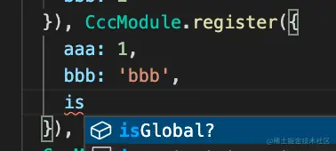

这样创建的就是全局的模块。

不过这样还有个问题：

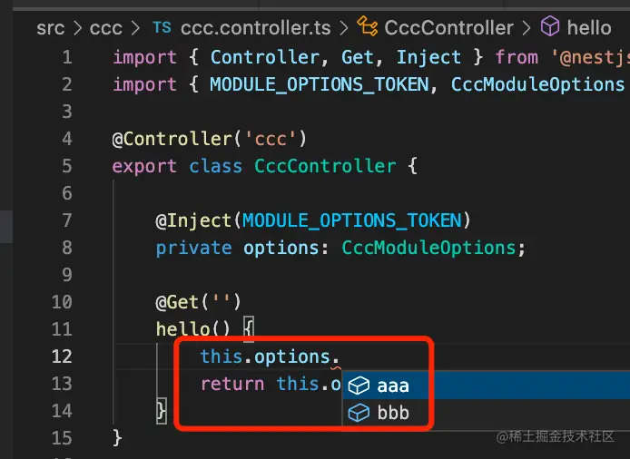

options 那里多了 isGlobal 属性，但是类型定义这里还没有呀。

因为我们用的是这个类型：

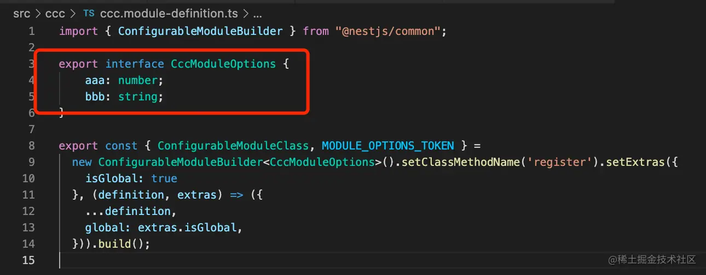

最好是用 builder 返回的类型：

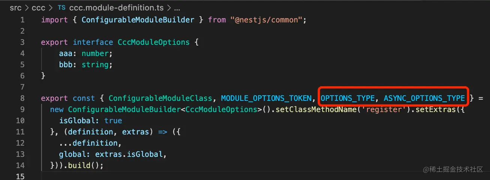

这样就有了：

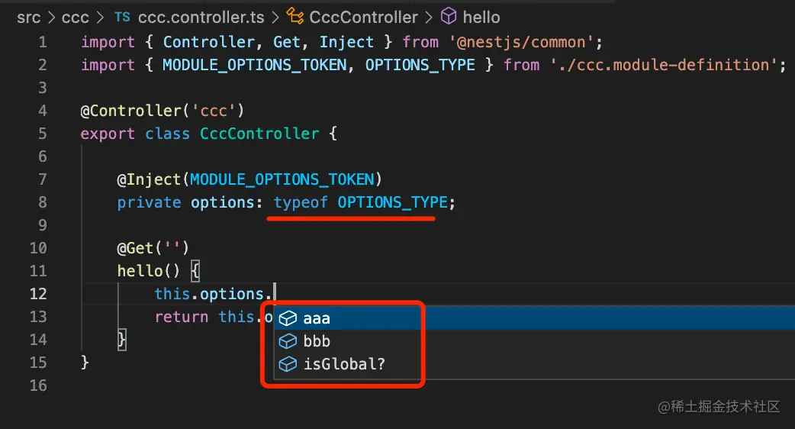

而这个 ASYNC\_OPTIONS\_TYPE 是 async 方式创建模块的 otpion 类型：

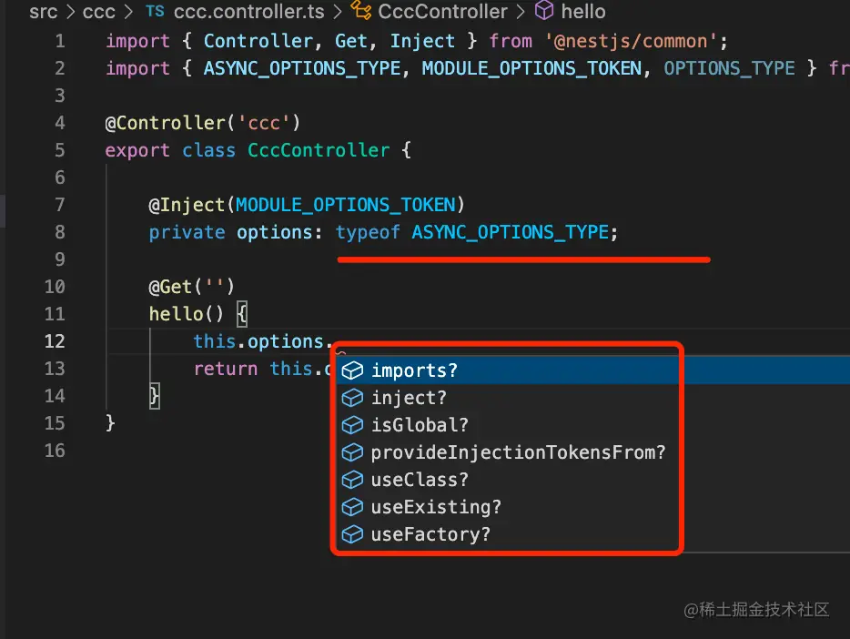

回过头来看一下这个 ConfigurableModuleBuilder，它只是对我们定义 register、registerAsync 的过程做了封装，传参数就可以生成对应的 class，简便了不少。

如果你觉得这种 builder 的方式更麻烦，那直接用第一种方式也可以。

案例代码在[小册仓库](https://github.com/QuarkGluonPlasma/nestjs-course-code/tree/main/dynamic-module)。

## 总结

Module 可以传入 options 动态产生，这叫做动态 Module，你还可以把传入的 options 作为 provider 注入到别的对象里。

建议的动态产生 Module 的方法名有 register、forRoot、forFeature 3种。

*   register：用一次注册一次

*   forRoot：只注册一次，用多次，一般在 AppModule 引入

*   forFeature：用了 forRoot 之后，用 forFeature 传入局部配置，一般在具体模块里 imports

并且这些方法都可以写 xxxAsync 版本，也就是传入 useFactory 等 option，内部注册异步 provider。

这个过程也可以用 ConfigurableModuleBuilder 来生成。通过 setClassMethodName 设置方法名，通过 setExtras 设置额外的 options 处理逻辑。

并且返回的 class 都有 xxxAsync 的版本。

这就是动态模块的定义方式，后面用到 typeorm、mongoose 等模块会大量见到这种模块。
